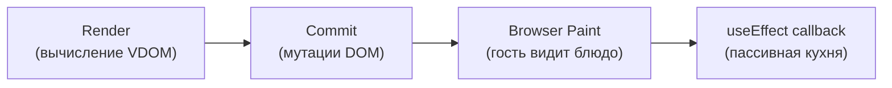

# Уровень 5: useEffect — жизненный цикл и подводные камни

## Что ты думаешь, что делает useEffect

Большинство разработчиков воспринимают `useEffect` как "хук для side effects после рендера". Это в целом верно, но неточно. Непонимание деталей ведёт к трём классам ошибок: лишним рендерам, race conditions и неправильному разделению логики между Effect и Event Handler.

## Временная шкала выполнения

Представь, что браузер — это повар с двумя кухнями. Первая кухня — основная (render + commit), вторая — пассивная (passive effects). Сначала всё готовится на основной кухне, потом блюдо уходит гостю (paint), и только потом повар спокойно убирает пассивную кухню.



**useLayoutEffect** — другой режим. Он блокирует paint: повар убирает кухню до того, как блюдо ушло к гостю.

```
render → commit → useLayoutEffect → browser paint → useEffect
```

💡 Используй `useLayoutEffect` только тогда, когда тебе нужно измерить DOM или синхронно обновить его до того, как пользователь увидит результат (например, позиционирование тултипа).

## Cleanup: что происходит перед следующим вызовом

Когда `useEffect` возвращает функцию — это cleanup. React вызывает её **перед** следующим запуском того же effect (и перед unmount).

```tsx
useEffect(() => {
  const id = setInterval(tick, 1000)
  return () => clearInterval(id) // cleanup
}, [])
```

Порядок при обновлении зависимостей:

```
рендер N+1 → cleanup N → effect N+1
```

Не "старый cleanup, потом новый effect" — именно такой порядок. React сохраняет возвращённую destroy-функцию прямо на hook-узле в linked list и вызывает её в нужный момент.

## Массив зависимостей и Object.is

React сравнивает зависимости через `Object.is` — не через `===`. Разница в двух случаях:

```tsx
Object.is(NaN, NaN) // true  — NaN считается равным себе
Object.is(+0, -0)   // false — +0 и -0 разные
```

Три режима массива зависимостей:

| Deps | Поведение |
|------|-----------|
| Отсутствует | Effect запускается после каждого рендера |
| `[]` | Только после mount (и cleanup при unmount) |
| `[a, b]` | Запускается когда `a` или `b` изменился по `Object.is` |

⚠️ Объекты и функции создаются заново при каждом рендере — `{}` не равен `{}` через `Object.is`. Это частая причина бесконечных loops.

## StrictMode: двойной запуск

В development-режиме StrictMode намеренно запускает Effect дважды (mount → unmount → mount). Это не баг, это инструмент.

**Зачем?** Чтобы проверить, что твой cleanup действительно идемпотентен: если двойной запуск ломает компонент — значит cleanup написан неправильно.

```tsx
// ✅ Корректный cleanup — двойной запуск не оставляет следов
useEffect(() => {
  const connection = connect(url)
  return () => connection.disconnect()
}, [url])
```

## Golden Rule: Effect vs Event Handler

Это самое важное правило уровня.

Задай себе вопрос: **почему этот код должен выполниться?**

- "Потому что компонент показан пользователю" → **Effect**
- "Потому что пользователь нажал кнопку" → **Event Handler**

```tsx
// ✅ Effect — выполняется при показе компонента
useEffect(() => {
  analytics.track('page_viewed', { page: '/home' })
}, [])

// ✅ Event Handler — выполняется при действии пользователя
function handlePurchase() {
  analytics.track('purchase_completed', { orderId })
  // ❌ НЕ через useEffect — это реакция на действие, не на показ
}
```

## Когда useEffect НУЖЕН

- Подписки на внешние источники данных (WebSocket, EventSource)
- Таймеры (setInterval, setTimeout)
- DOM-измерения после рендера
- Data fetching (с оговорками — смотри задание 5.4)
- Синхронизация с внешними системами (localStorage при mount)

## Когда useEffect НЕ НУЖЕН

- **Трансформация данных**: если значение вычисляется из props/state — вычисляй во время рендера, не через Effect
- **Уведомление parent**: если нужно вызвать `onChange` — делай это в event handler, не в Effect
- **POST по действию пользователя**: submit формы — Event Handler, не Effect

## ⚠️ Частые ошибки новичков

❌ **POST-запрос в useEffect**

```tsx
useEffect(() => {
  fetch('/api/register', { method: 'POST', body: JSON.stringify(formData) })
}, [formData]) // отправляет при каждом изменении formData!
```

Почему это проблема: Effect выполняется при изменении зависимостей — пользователь ещё не нажал Submit, а запрос уже летит.

✅ Отправляй в обработчике кнопки:

```tsx
function handleSubmit() {
  fetch('/api/register', { method: 'POST', body: JSON.stringify(formData) })
}
```

---

❌ **Цепочка Effects (Effect Chains)**

```tsx
useEffect(() => { setB(computeB(a)) }, [a])
useEffect(() => { setC(computeC(b)) }, [b])
useEffect(() => { setD(computeD(c)) }, [c])
```

Почему это плохо: 3 лишних рендера вместо одного.

✅ Вычисляй всё за один раз — в event handler или во время рендера:

```tsx
function handleChange(newA) {
  setA(newA)
  setB(computeB(newA))
  setC(computeC(computeB(newA)))
}
```

---

❌ **Data fetching без cleanup (race condition)**

```tsx
useEffect(() => {
  fetch(`/api/search?q=${query}`)
    .then(r => r.json())
    .then(data => setResults(data)) // может прийти устаревший ответ!
}, [query])
```

Почему это проблема: при быстрой смене query запросы могут вернуться в обратном порядке.

✅ Используй ignore-флаг или AbortController:

```tsx
useEffect(() => {
  let ignore = false
  fetch(`/api/search?q=${query}`)
    .then(r => r.json())
    .then(data => { if (!ignore) setResults(data) })
  return () => { ignore = true }
}, [query])
```
