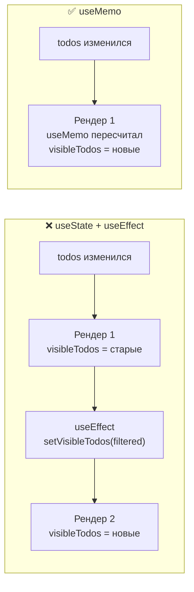
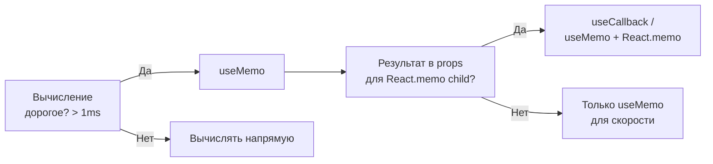
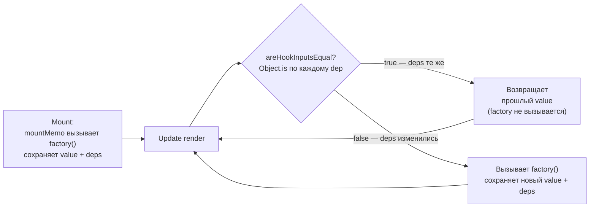

# Уровень 6: useMemo и useCallback — расширенная теория

## Hook node: что реально хранит React

Fiber-узел компонента ссылается на `memoizedState` — голову linked list хуков.
Каждый вызов хука в render-функции продвигает указатель `workInProgress` на следующий узел.
Для `useMemo` структура узла:

```
FiberNode.memoizedState →
  Hook { memoizedState: [value, deps], queue: null, baseState: null, next: → }
                          ↑       ↑
                    результат   массив зависимостей
```

Для `useCallback` — то же самое, но в `memoizedState[0]` лежит функция, а не результат:

```
Hook { memoizedState: [fn, deps], ... }
```

## mountMemo vs updateMemo

React имеет два диспетчера: `HooksDispatcherOnMount` и `HooksDispatcherOnUpdate`.
При первом рендере компонента используется Mount-диспетчер, при обновлениях — Update.

```ts
// HooksDispatcherOnMount.useMemo
function mountMemo<T>(factory: () => T, deps: DependencyList): T {
  const hook = mountWorkInProgressHook()
  const nextDeps = deps === undefined ? null : deps
  const nextValue = factory()  // вычисляем factory один раз
  hook.memoizedState = [nextValue, nextDeps]
  return nextValue
}

// HooksDispatcherOnUpdate.useMemo
function updateMemo<T>(factory: () => T, deps: DependencyList): T {
  const hook = updateWorkInProgressHook()
  const nextDeps = deps === undefined ? null : deps
  const prevState = hook.memoizedState  // [prevValue, prevDeps]
  
  if (prevState !== null && nextDeps !== null) {
    const prevDeps = prevState[1]
    if (areHookInputsEqual(nextDeps, prevDeps)) {
      return prevState[0]  // deps не изменились — возвращаем кэш
    }
  }
  
  const nextValue = factory()  // deps изменились — пересчитываем
  hook.memoizedState = [nextValue, nextDeps]
  return nextValue
}
```

## areHookInputsEqual: алгоритм сравнения deps

```ts
function areHookInputsEqual(
  nextDeps: DependencyList,
  prevDeps: DependencyList | null,
): boolean {
  if (prevDeps === null) {
    // Нет предыдущих deps — всегда пересчитываем
    return false
  }
  
  for (let i = 0; i < prevDeps.length && i < nextDeps.length; i++) {
    if (Object.is(nextDeps[i], prevDeps[i])) {
      continue
    }
    return false  // нашли отличие — выходим
  }
  
  return true  // все deps равны
}
```

Ключевое: `Object.is`, не `===`. Это важно для:
- `NaN`: `Object.is(NaN, NaN) === true` — мемоизация стабильна
- `+0/-0`: `Object.is(+0, -0) === false` — редкий случай

## useCallback: реальная реализация

```ts
// mountCallback
function mountCallback<T extends Function>(callback: T, deps: DependencyList): T {
  const hook = mountWorkInProgressHook()
  const nextDeps = deps === undefined ? null : deps
  hook.memoizedState = [callback, nextDeps]  // сохраняем функцию, не вызываем!
  return callback
}

// updateCallback
function updateCallback<T extends Function>(callback: T, deps: DependencyList): T {
  const hook = updateWorkInProgressHook()
  const nextDeps = deps === undefined ? null : deps
  const prevState = hook.memoizedState
  
  if (prevState !== null && nextDeps !== null) {
    const prevDeps = prevState[1]
    if (areHookInputsEqual(nextDeps, prevDeps)) {
      return prevState[0]  // возвращаем старую функцию
    }
  }
  
  hook.memoizedState = [callback, nextDeps]
  return callback
}
```

Обрати внимание: в отличие от `useMemo`, `useCallback` **не вызывает** переданную функцию.
Он просто сохраняет ссылку на неё.

Эквивалентность:
```ts
useCallback(fn, deps) === useMemo(() => fn, deps)
```

## React.memo и shallowEqual

`React.memo(Component)` создаёт компонент-обёртку с особой логикой bail out:

```ts
// Упрощённый алгоритм React.memo
function updateSimpleMemoComponent(fiber, newProps) {
  const prevProps = fiber.memoizedProps
  
  if (shallowEqual(prevProps, newProps)) {
    // Props не изменились (по ссылкам) — bail out
    return fiber.child  // возвращаем прошлое дерево
  }
  
  // Props изменились — рендерим заново
  return renderWithHooks(fiber, newProps)
}

function shallowEqual(obj1, obj2) {
  if (Object.is(obj1, obj2)) return true
  
  const keys1 = Object.keys(obj1)
  const keys2 = Object.keys(obj2)
  if (keys1.length !== keys2.length) return false
  
  for (const key of keys1) {
    if (!Object.is(obj1[key], obj2[key])) return false
  }
  
  return true
}
```

shallowEqual сравнивает значения по ссылке (`Object.is`).
Если prop — объект `{}` или функция `() => {}`, созданная inline, — каждый рендер новая ссылка → bail out не срабатывает.

## YMNAE: useMemo vs useEffect для derived data

"You Might Not Need an Effect" — раздел официальной документации React.
Один из самых частых антипаттернов: хранить вычисляемые данные в state и синхронизировать через Effect.

### Антипаттерн: useState + useEffect

```tsx
// ❌ Плохо: 2 рендера вместо 1
function TodoList({ todos, filter }) {
  const [visibleTodos, setVisibleTodos] = useState(todos)

  useEffect(() => {
    setVisibleTodos(todos.filter(t => t.status === filter))
  }, [todos, filter])

  return <ul>{visibleTodos.map(t => <li key={t.id}>{t.text}</li>)}</ul>
}
```

Что происходит:
1. Рендер 1: `todos` или `filter` изменились → компонент рендерится
2. Effect запускается после рендера → вызывает `setVisibleTodos`
3. Рендер 2: `visibleTodos` обновился → компонент рендерится снова

Итого: два рендера. Пользователь может увидеть промежуточное состояние (старый список).

### Правильно: useMemo

```tsx
// ✅ Хорошо: 1 рендер
function TodoList({ todos, filter }) {
  const visibleTodos = useMemo(
    () => todos.filter(t => t.status === filter),
    [todos, filter]
  )

  return <ul>{visibleTodos.map(t => <li key={t.id}>{t.text}</li>)}</ul>
}
```

Что происходит:
1. Рендер: `todos` или `filter` изменились
2. `useMemo` пересчитывает `visibleTodos` прямо во время рендера
3. Итого: один рендер. Никакого мигания.

### Диаграмма двух подходов



## Когда НЕ нужна мемоизация

### 1. Примитивные вычисления

```tsx
// ❌ Overhead больше пользы
const total = useMemo(() => items.reduce((s, i) => s + i.price, 0), [items])

// ✅ Просто вычисляй
const total = items.reduce((s, i) => s + i.price, 0)
```

### 2. Компоненты без React.memo

Если `Child` не обёрнут в `React.memo`, стабилизация `onClick` через `useCallback` ничего не даёт — Child всё равно рендерится вместе с Parent.

### 3. Стабильные значения из хуков

`useState` и `useReducer` гарантируют стабильность dispatch/setter — не оборачивай их в useCallback.

```tsx
const [count, setCount] = useState(0)
// setCount — стабильная ссылка, React гарантирует это
// ❌ НЕ нужно:
const stableSetCount = useCallback(setCount, [setCount])
```

### 4. Context Provider value

```tsx
// ❌ Частая ошибка
function Provider({ children }) {
  const value = { user, setUser }  // новый объект каждый рендер!
  return <Context.Provider value={value}>{children}</Context.Provider>
}

// ✅ Мемоизируй value
function Provider({ children }) {
  const value = useMemo(() => ({ user, setUser }), [user, setUser])
  return <Context.Provider value={value}>{children}</Context.Provider>
}
```

Без `useMemo` для value — все подписчики контекста рендерятся при каждом рендере Provider.

## Cost-Benefit анализ: когда стоит мемоизировать

Правило: измеряй, не гадай.

```tsx
// Измерение стоимости вычисления
console.time('filter')
const result = bigArray.filter(expensiveCheck)
console.timeEnd('filter')
// Если > 1ms — кандидат для useMemo
// Если < 0.1ms — мемоизация навредит
```



## React Compiler: забежим вперёд

React Compiler (уровень 12) — инструмент, который анализирует компонент статически
и автоматически добавляет мемоизацию там, где это нужно.

```tsx
// Ты пишешь:
function Component({ items, filter }) {
  const visible = items.filter(i => i.active === filter)
  return <List items={visible} />
}

// Compiler генерирует (упрощённо):
function Component({ items, filter }) {
  const visible = useMemo(
    () => items.filter(i => i.active === filter),
    [items, filter]
  )
  return <List items={visible} />
}
```

Цель компилятора — избавить разработчика от ручной мемоизации.
Но понимание того, КАК работает useMemo под капотом, остаётся важным —
без этого невозможно диагностировать проблемы производительности.

## Полная картина: lifecycle мемоизированного значения



## Итог: правила мемоизации

| Ситуация | Решение |
|----------|---------|
| Дорогое вычисление (> 1ms) | `useMemo` |
| Функция как prop для `React.memo` child | `useCallback` |
| Объект как prop для `React.memo` child | `useMemo` |
| Объект как dep в `useEffect` | `useMemo` |
| Context Provider value | `useMemo` |
| Примитивное вычисление | ничего |
| Setter из useState | ничего (уже стабилен) |
| Компонент без `React.memo` | думай дважды |
