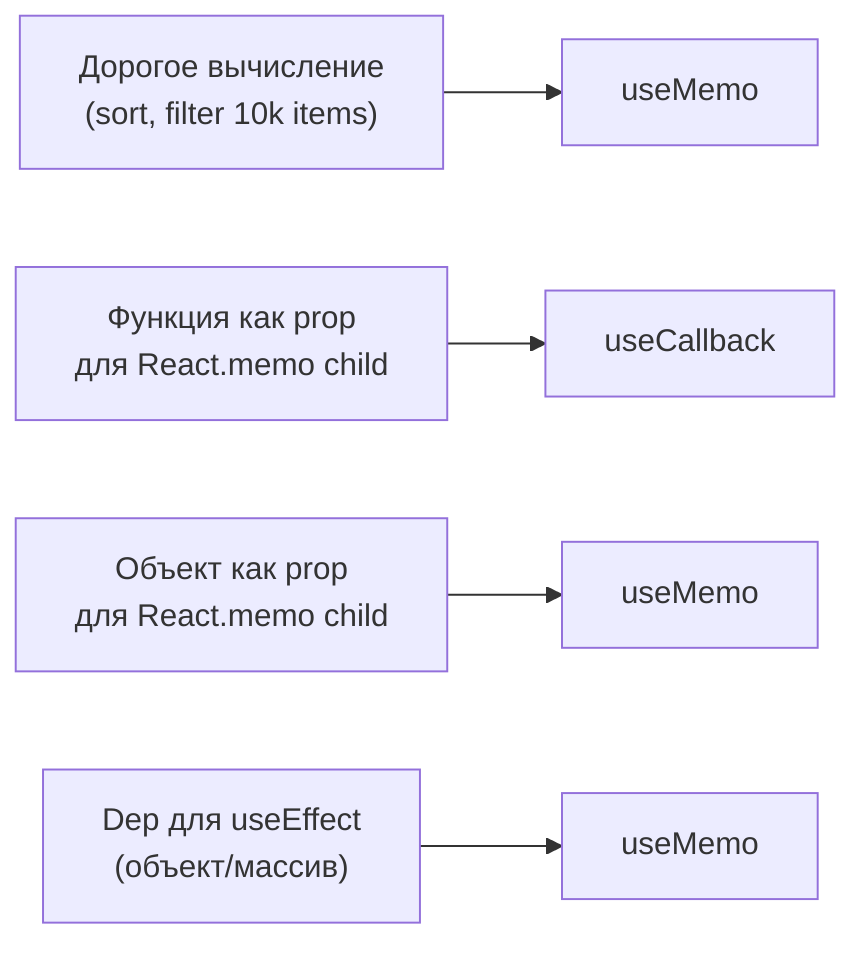

# Уровень 6: useMemo и useCallback — под капотом

## Что происходит, когда React "мемоизирует"

Каждый раз при рендере компонента React проходит по связанному списку hook-узлов.
Когда он встречает `useMemo` или `useCallback` — он не просто "кэширует результат".
Он смотрит на deps, сравнивает с прошлыми deps через `Object.is`, и решает:
пересчитывать или отдать старое значение.

Понять это — значит понять, когда мемоизация действительно нужна,
а когда она просто добавляет overhead без пользы.

## Как хранится мемоизированное значение

Каждый хук — это узел в linked list на Fiber. Для `useMemo` структура такая:

```
HookNode {
  memoizedState: [value, deps],  // кортеж: значение + зависимости
  queue: null,
  next: → следующий хук
}
```

При первом рендере (`mountMemo`) React вычисляет значение и сохраняет его вместе с deps:

```ts
// mountMemo — псевдокод
function mountMemo(factory, deps) {
  const hook = mountWorkInProgressHook()
  const value = factory()          // вычисляем один раз
  hook.memoizedState = [value, deps]
  return value
}
```

При обновлении (`updateMemo`) React сравнивает старые и новые deps:

```ts
// updateMemo — псевдокод
function updateMemo(factory, deps) {
  const hook = updateWorkInProgressHook()
  const [prevValue, prevDeps] = hook.memoizedState
  if (areHookInputsEqual(deps, prevDeps)) {
    return prevValue  // deps не изменились — отдаём кэш
  }
  const nextValue = factory()      // deps изменились — пересчитываем
  hook.memoizedState = [nextValue, deps]
  return nextValue
}
```

## areHookInputsEqual: как сравниваются зависимости

Это простой цикл через `Object.is`:

```ts
function areHookInputsEqual(nextDeps, prevDeps) {
  for (let i = 0; i < nextDeps.length; i++) {
    if (!Object.is(nextDeps[i], prevDeps[i])) return false
  }
  return true
}
```

💡 Если длина deps изменилась — React предупредит в console в development.
В production это UB (undefined behavior) — не меняй длину deps.

## useCallback = useMemo для функций

Это буквально синтаксический сахар:

```ts
// useCallback — псевдокод (реальный React так и делает)
function useCallback(callback, deps) {
  return useMemo(() => callback, deps)
}
```

Разница в том, что хранится в `memoizedState`:
- `useMemo` → `[result, deps]` — результат вызова factory
- `useCallback` → `[callback, deps]` — сама функция (не результат её вызова)

## Referential equality: проблема inline объектов

Каждый рендер создаёт новые ссылки:

```tsx
// ❌ Каждый рендер — новый объект, новая функция
function Parent() {
  const style = { color: 'red' }       // новая ссылка
  const handleClick = () => doSomething()  // новая ссылка
  return <Child style={style} onClick={handleClick} />
}
```

Если `Child` обёрнут в `React.memo`, это ломает оптимизацию:
`React.memo` делает shallowEqual по props — объекты не равны, рендер происходит.

```tsx
// ✅ Стабилизируем ссылки
function Parent() {
  const style = useMemo(() => ({ color: 'red' }), [])
  const handleClick = useCallback(() => doSomething(), [])
  return <Child style={style} onClick={handleClick} />
}
```

## React.memo: как это работает вместе

```
React.memo(Child) создаёт обёртку, которая:
  1. Получает новые props
  2. Сравнивает с предыдущими через shallowEqual
  3. Если равны — возвращает прошлый результат рендера (bail out)
  4. Если нет — рендерит Child заново
```

Без стабильных ссылок для объектов/функций — `React.memo` бесполезен:
shallowEqual смотрит на ссылки, а не на содержимое.

## Когда мемоизация ПОМОГАЕТ



## Когда мемоизация ВРЕДИТ

📌 Мемоизация — это не бесплатно. Каждый `useMemo` и `useCallback`:
- Выделяет hook-узел в памяти
- При каждом рендере проходит цикл сравнения deps
- Сохраняет предыдущее значение в памяти (GC не может собрать)

```tsx
// ❌ Бессмысленная мемоизация примитивных вычислений
const count = useMemo(() => items.length, [items])
// Сравнение deps + выделение памяти > реальная стоимость .length

// ✅ Просто пиши
const count = items.length
```

## ⚠️ Частые ошибки новичков

❌ **useMemo вместо useMemo для derived state через useEffect**

```tsx
// ❌ Два рендера: 1) todos обновился 2) visibleTodos обновился
const [visibleTodos, setVisibleTodos] = useState([])
useEffect(() => {
  setVisibleTodos(todos.filter(t => t.status === filter))
}, [todos, filter])
```

Почему плохо: первый рендер показывает старые `visibleTodos`, второй — новые.
Пользователь видит мигание или просто теряется лишний рендер.

```tsx
// ✅ Один рендер: вычисляем прямо во время рендера
const visibleTodos = useMemo(
  () => todos.filter(t => t.status === filter),
  [todos, filter]
)
```

---

❌ **React.memo без стабильных ссылок**

```tsx
// ❌ React.memo бесполезен — props.onClick новая ссылка каждый рендер
const Child = React.memo(({ onClick }) => <button onClick={onClick}>Click</button>)

function Parent() {
  return <Child onClick={() => console.log('click')} />  // новая функция!
}
```

```tsx
// ✅ useCallback даёт стабильную ссылку
function Parent() {
  const handleClick = useCallback(() => console.log('click'), [])
  return <Child onClick={handleClick} />
}
```

---

❌ **useMemo для всего подряд "на всякий случай"**

```tsx
// ❌ Overhead больше пользы для простых операций
const doubled = useMemo(() => value * 2, [value])
const label = useMemo(() => `${firstName} ${lastName}`, [firstName, lastName])
```

Правило: мемоизируй только если:
1. Вычисление действительно дорогое (можно проверить через `performance.now()`)
2. Результат используется как dep в другом хуке или prop для `React.memo`
