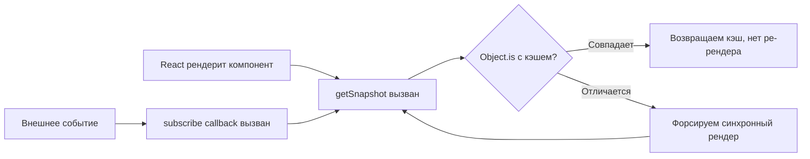

# Уровень 7: Подписки и внешние хранилища — Подробная теория

## Tearing: когда React врёт вам о состоянии

Представьте UI, который показывает баланс кошелька в трёх местах: в шапке, в боковом меню и в центральной панели. Все три компонента читают один и тот же глобальный store. В обычном (синхронном) режиме всё хорошо: рендер происходит атомарно, все компоненты видят одно значение.

Concurrent Mode меняет правила игры.

```
Синхронный рендер (React 17 и ниже):
──────────────────────────────────────────────────────
render(Header)     → store.balance = 100
render(Sidebar)    → store.balance = 100
render(Dashboard)  → store.balance = 100
                      Все видят 100. Консистентно.
──────────────────────────────────────────────────────

Concurrent рендер (React 18, без useSyncExternalStore):
──────────────────────────────────────────────────────
render(Header)     → store.balance = 100
  [ React уступает управление браузеру (yield) ]
  [ Приходит событие: store.balance = 200 ]
render(Sidebar)    → store.balance = 200
render(Dashboard)  → store.balance = 200
                      Header показывает 100, остальные — 200. TEARING!
──────────────────────────────────────────────────────
```

Это не теоретическая проблема. React DevTools в Concurrent Mode часто прерывает рендер для обработки срочных обновлений (transitions, Suspense). Если ваш store — обычный JS объект без защиты от tearing, пользователь может увидеть рассинхронизированный UI.

### Как useSyncExternalStore решает tearing

Слово "Sync" в названии не случайно. Хук форсирует _синхронный_ рендер при обнаружении изменений в store. Упрощённо:

```
1. React начинает concurrent рендер
2. render(Header) → getSnapshot() → 100
3. React делает yield
4. store обновился → callback вызван
5. React обнаруживает: getSnapshot() теперь возвращает 200
6. React ОТМЕНЯЕТ текущий рендер
7. React запускает СИНХРОННЫЙ рендер (без прерываний)
8. Все компоненты видят 200. Консистентно.
```

---

## Внутреннее устройство useSyncExternalStore

### Как React проверяет snapshot

React хранит последнее возвращённое значение `getSnapshot()`. При каждом вызове subscribe-callback он снова вызывает `getSnapshot()` и сравнивает с кэшом через `Object.is`:

```
callback() вызван
  → nextSnapshot = getSnapshot()
  → Object.is(nextSnapshot, cachedSnapshot)?
    → true: ничего не делать
    → false: scheduleRerender() — форсируем синхронный рендер
```

Именно поэтому `getSnapshot` **не может возвращать новый объект каждый раз** — `Object.is({}, {})` всегда `false`, что приведёт к бесконечным ре-рендерам.

### Структура hook node

В fiber-дереве `useSyncExternalStore` хранит в `memoizedState`:

```
{
  value: T,          // последний результат getSnapshot()
  getSnapshot: fn,   // текущая функция getSnapshot
}
```

При рендере React:
1. Вызывает `getSnapshot()` — получает текущее значение
2. Сравнивает с `memoizedState.value` через `Object.is`
3. Если отличается — форсирует синхронный flush

---

## Стабильность getSnapshot: глубокое погружение

Рассмотрим три паттерна и их последствия:

### Паттерн 1: Примитивы (всегда безопасно)

```tsx
const getOnline = () => navigator.onLine         // boolean — примитив
const getWidth = () => window.innerWidth          // number — примитив
const getHash = () => location.hash               // string — примитив
```

Примитивы сравниваются по значению. `Object.is(true, true) === true`. Никаких проблем.

### Паттерн 2: Объекты из store (зависит от реализации store)

```tsx
// ❌ Store возвращает новый объект каждый раз
const getState = () => ({ ...store.state })  // INFINITE LOOP!

// ✅ Store возвращает стабильную ссылку
const getState = () => store.state  // store.state — один объект, меняется только при setState
```

Ключевой принцип: **store должен менять ссылку на объект только при реальном изменении данных**.

### Паттерн 3: Производные данные через кэш

```tsx
let cachedSize = { width: window.innerWidth, height: window.innerHeight }

const getWindowSize = () => {
  const w = window.innerWidth
  const h = window.innerHeight
  // Возвращаем кэш, если размеры не изменились
  if (cachedSize.width === w && cachedSize.height === h) {
    return cachedSize
  }
  cachedSize = { width: w, height: h }
  return cachedSize
}
```

---

## Паттерн: Selector для частичных подписок

Если компоненту нужна только часть store, подписка на весь store вызовет лишние ре-рендеры. Решение — selector:

```tsx
// store с полным состоянием
const store = createStore({ count: 0, name: 'Alice', theme: 'dark' })

// Компонент A: нужен только count
function Counter() {
  const count = useStore(store, state => state.count)
  return <div>{count}</div>
}

// Компонент B: нужен только name
function UserName() {
  const name = useStore(store, state => state.name)
  return <div>{name}</div>
}
```

Реализация `useStore` с selector:

```tsx
function useStore<T, S>(store: Store<T>, selector: (state: T) => S): S {
  return useSyncExternalStore(
    store.subscribe,
    () => selector(store.getState()),
    () => selector(store.getState()),
  )
}
```

⚠️ **Проблема**: если selector возвращает новый объект (`state => ({ a: state.a })`), каждый вызов создаёт новый объект → бесконечные ре-рендеры.

### shallowEqual selector

Решение — кэшировать результат selector и возвращать старую ссылку, если данные не изменились (shallow compare):

```tsx
function useStoreWithSelector<T, S>(
  store: Store<T>,
  selector: (state: T) => S,
  isEqual: (a: S, b: S) => boolean = Object.is
): S {
  const ref = useRef<S | undefined>(undefined)

  return useSyncExternalStore(
    store.subscribe,
    () => {
      const next = selector(store.getState())
      // Если данные те же — возвращаем предыдущую ссылку
      if (ref.current !== undefined && isEqual(ref.current, next)) {
        return ref.current
      }
      ref.current = next
      return next
    }
  )
}

// shallowEqual для объектов
function shallowEqual<T extends object>(a: T, b: T): boolean {
  const keysA = Object.keys(a) as (keyof T)[]
  if (keysA.length !== Object.keys(b).length) return false
  return keysA.every(key => Object.is(a[key], b[key]))
}
```

Именно так работает Zustand под капотом.

---

## YMNAE: ручная подписка vs useSyncExternalStore

Классический антипаттерн — реализация медиа-запроса через useEffect:

```tsx
// ❌ Ручная подписка через useEffect
function useMediaQuery(query: string): boolean {
  const [matches, setMatches] = useState(
    () => window.matchMedia(query).matches
  )

  useEffect(() => {
    const mql = window.matchMedia(query)
    const handler = (e: MediaQueryListEvent) => setMatches(e.matches)
    mql.addEventListener('change', handler)
    return () => mql.removeEventListener('change', handler)
  }, [query])

  return matches
}
```

Проблемы этого подхода:
1. **Два рендера при mount**: initial state + первый effect → setState
2. **Race condition**: между mount и подпиской медиа-запрос мог смениться
3. **Tearing**: Concurrent Mode может видеть несогласованное состояние
4. **SSR**: `useState(() => window.matchMedia(query).matches)` упадёт на сервере

```tsx
// ✅ useSyncExternalStore
function makeMediaQueryStore(query: string) {
  let mql: MediaQueryList | null = null
  const getMql = () => {
    if (!mql) mql = window.matchMedia(query)
    return mql
  }

  const subscribe = (callback: () => void) => {
    const m = getMql()
    m.addEventListener('change', callback)
    return () => m.removeEventListener('change', callback)
  }

  const getSnapshot = () => getMql().matches
  const getServerSnapshot = () => false  // SSR-safe default

  return { subscribe, getSnapshot, getServerSnapshot }
}

function useMediaQuery(query: string): boolean {
  const store = useMemo(() => makeMediaQueryStore(query), [query])
  return useSyncExternalStore(
    store.subscribe,
    store.getSnapshot,
    store.getServerSnapshot,
  )
}
```

Преимущества:
- Нет двойного рендера при mount
- Нет race condition (getSnapshot вызывается прямо во время рендера)
- Защита от tearing
- SSR-safe через getServerSnapshot

---

## Построение mini store

Минимальная реализация store, совместимого с `useSyncExternalStore`:

```tsx
type Listener = () => void

type Store<T> = {
  getState: () => T
  setState: (next: T | ((prev: T) => T)) => void
  subscribe: (listener: Listener) => () => void
}

function createStore<T>(initialState: T): Store<T> {
  let state = initialState
  const listeners = new Set<Listener>()

  return {
    getState: () => state,

    setState: (next) => {
      const nextState = typeof next === 'function'
        ? (next as (prev: T) => T)(state)
        : next
      if (Object.is(state, nextState)) return  // Не уведомляем, если ничего не изменилось
      state = nextState
      listeners.forEach(l => l())
    },

    subscribe: (listener) => {
      listeners.add(listener)
      return () => listeners.delete(listener)
    },
  }
}
```

Использование:

```tsx
const counterStore = createStore({ count: 0 })

function useCounterStore<S>(selector: (s: { count: number }) => S): S {
  return useSyncExternalStore(
    counterStore.subscribe,
    () => selector(counterStore.getState()),
  )
}

function Counter() {
  const count = useCounterStore(s => s.count)
  return (
    <button onClick={() => counterStore.setState(s => ({ count: s.count + 1 }))}>
      {count}
    </button>
  )
}

function DoubleCounter() {
  const doubled = useCounterStore(s => s.count * 2)
  return <div>Удвоенное: {doubled}</div>
}
```

`Counter` и `DoubleCounter` — независимые подписчики. Изменение store обновит оба компонента одновременно, без риска tearing.

---

## Диаграмма: жизненный цикл useSyncExternalStore



---

## Распространённые ошибки

### 1. getSnapshot создаёт новый объект

```tsx
// ❌ Infinite loop
useSyncExternalStore(subscribe, () => ({ value: store.get() }))

// ✅ Возвращаем примитив или стабильную ссылку
useSyncExternalStore(subscribe, () => store.get())
```

### 2. subscribe — нестабильная ссылка

```tsx
// ❌ subscribe пересоздаётся при каждом рендере → React переподписывается бесконечно
function Component() {
  const value = useSyncExternalStore(
    (cb) => { window.addEventListener('resize', cb); return () => window.removeEventListener('resize', cb) },
    () => window.innerWidth
  )
}

// ✅ subscribe определён вне компонента или стабилизирован через useCallback/useMemo
const subscribe = (cb: () => void) => {
  window.addEventListener('resize', cb)
  return () => window.removeEventListener('resize', cb)
}
```

### 3. Отсутствие getServerSnapshot при SSR

```tsx
// ❌ Упадёт при гидратации
useSyncExternalStore(subscribe, () => window.innerWidth)

// ✅ SSR-safe
useSyncExternalStore(subscribe, () => window.innerWidth, () => 0)
```

### 4. Мутация state вместо замены

```tsx
// ❌ Мутация: listeners не уведомлены, getSnapshot вернёт ту же ссылку
store.state.count += 1  // Object.is(oldRef, newRef) === true → React не перерендерится

// ✅ Замена ссылки
store.setState(prev => ({ ...prev, count: prev.count + 1 }))
```
