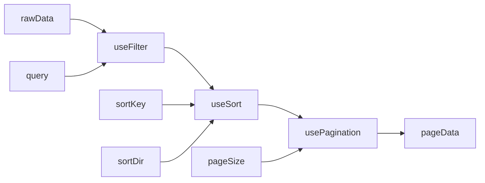

# Уровень 8: Кастомные хуки — глубокое погружение

## Composing Hooks: слоистая архитектура

Кастомные хуки позволяют строить функциональность слоями — каждый слой решает одну задачу, а верхний слой их соединяет.

Классический пример: таблица данных с пагинацией, сортировкой и фильтрацией.

```
useDataTable(data, config)
  ├── useFilter(data, query)      → filteredData
  ├── useSort(data, key, dir)     → sortedData
  └── usePagination(total, size)  → page, totalPages, ...
```

Каждый хук — отдельная единица, которую можно тестировать изолированно:

```tsx
// Хук пагинации — не знает ничего о данных
function usePagination(total: number, pageSize: number) {
  const [page, setPage] = useState(1)
  const totalPages = Math.ceil(total / pageSize)

  return {
    page,
    totalPages,
    hasNext: page < totalPages,
    hasPrev: page > 1,
    next: () => setPage(p => Math.min(totalPages, p + 1)),
    prev: () => setPage(p => Math.max(1, p - 1)),
    reset: () => setPage(1),
  }
}

// Хук сортировки — работает с любым массивом объектов
function useSort<T>(data: T[], initialKey: keyof T, initialDir: 'asc' | 'desc' = 'asc') {
  const [key, setKey] = useState<keyof T>(initialKey)
  const [dir, setDir] = useState<'asc' | 'desc'>(initialDir)

  const sorted = useMemo(() => {
    return [...data].sort((a, b) => {
      const av = a[key], bv = b[key]
      const cmp = av < bv ? -1 : av > bv ? 1 : 0
      return dir === 'asc' ? cmp : -cmp
    })
  }, [data, key, dir])

  const toggle = (newKey: keyof T) => {
    if (newKey === key) setDir(d => d === 'asc' ? 'desc' : 'asc')
    else { setKey(newKey); setDir('asc') }
  }

  return { sorted, key, dir, toggle }
}

// Хук фильтрации — применяет текстовый поиск
function useFilter<T>(data: T[], fields: (keyof T)[]) {
  const [query, setQuery] = useState('')

  const filtered = useMemo(() => {
    if (!query.trim()) return data
    const q = query.toLowerCase()
    return data.filter(item =>
      fields.some(f => String(item[f]).toLowerCase().includes(q))
    )
  }, [data, query, fields])

  return { filtered, query, setQuery }
}

// Композиция: один хук для всей таблицы
function useDataTable<T>(data: T[], fields: (keyof T)[], pageSize = 10) {
  const { filtered, query, setQuery } = useFilter(data, fields)
  const { sorted, key, dir, toggle } = useSort(filtered, fields[0])
  const pagination = usePagination(sorted.length, pageSize)

  // При изменении фильтра — сбрасываем страницу
  useEffect(() => {
    pagination.reset()
  }, [query])

  const offset = (pagination.page - 1) * pageSize
  const pageData = sorted.slice(offset, offset + pageSize)

  return {
    data: pageData,
    filter: { query, setQuery },
    sort: { key, dir, toggle },
    pagination,
  }
}
```

Диаграмма потока данных:



---

## useDebounce: правильная реализация

Наивная версия — таймеры накапливаются:

```tsx
// ❌ Каждый keystroke создаёт новый таймер, старые не отменяются
function useDebounceWrong<T>(value: T, delay: number): T {
  const [debounced, setDebounced] = useState(value)

  useEffect(() => {
    // Нет cleanup! При следующем вызове эффекта старый setTimeout
    // продолжает существовать и сработает через delay ms
    setTimeout(() => setDebounced(value), delay)
  }, [value, delay])

  return debounced
}
```

Что происходит при быстром вводе "react":
- r → timer1(delay=300ms)
- re → timer2(delay=300ms), timer1 всё ещё тикает
- rea → timer3, timer1 и timer2 тикают
- reac → ...
- через 300ms: timer1 срабатывает → setDebounced('r')
- через 300ms: timer2 срабатывает → setDebounced('re')
- и т.д. — setState вызывается 5 раз!

Правильная версия с cleanup:

```tsx
// ✅ Cleanup отменяет предыдущий таймер при каждом новом значении
function useDebounce<T>(value: T, delay: number): T {
  const [debounced, setDebounced] = useState(value)

  useEffect(() => {
    const timer = setTimeout(() => setDebounced(value), delay)
    return () => clearTimeout(timer) // ← отменяем предыдущий таймер
  }, [value, delay])

  return debounced
}
```

Что происходит теперь:
- r → timer1 создан
- re → cleanup(timer1), timer2 создан
- rea → cleanup(timer2), timer3 создан
- reac → cleanup(timer3), timer4 создан
- react → cleanup(timer4), timer5 создан
- пауза 300ms → timer5 срабатывает → setDebounced('react')
- setState вызывается 1 раз!

---

## usePrevious: почему useRef, а не useState

```tsx
function usePrevious<T>(value: T): T | undefined {
  const ref = useRef<T>()

  useEffect(() => {
    ref.current = value
  }) // нет deps — эффект запускается после каждого рендера

  return ref.current
}
```

Временная шкала при изменении `count: 0 → 1`:

```
Рендер 1 (count=0):
  usePrevious вызывается с value=0
  ref.current = undefined (ещё не было эффекта)
  return undefined         ← current render sees undefined

  [commit]
  effect: ref.current = 0  ← обновляется ПОСЛЕ рендера

Рендер 2 (count=1):
  usePrevious вызывается с value=1
  return ref.current = 0   ← видит значение из прошлого рендера!

  [commit]
  effect: ref.current = 1
```

Почему не `useState`?

```tsx
// ❌ useState триггерит дополнительный рендер
function usePreviousWrong<T>(value: T): T | undefined {
  const [prev, setPrev] = useState<T>()
  const [curr, setCurr] = useState(value)

  if (value !== curr) {
    setPrev(curr)   // ← вызывает ещё один рендер!
    setCurr(value)
  }

  return prev
}
```

`useRef` обновляет `current` без рендера — это его ключевое свойство: мутабельный контейнер, не влияющий на жизненный цикл компонента.

---

## "Latest Callback" паттерн: аналог useEffectEvent

Проблема: вы хотите запустить `setInterval` один раз, но колбэк должен видеть актуальное состояние.

```tsx
// ❌ Closure trap
function Counter() {
  const [count, setCount] = useState(0)

  useEffect(() => {
    const id = setInterval(() => {
      // count здесь — это значение на момент СОЗДАНИЯ эффекта (0)
      // Closure захватила count=0 и не обновляется
      console.log('count:', count) // всегда 0
    }, 1000)
    return () => clearInterval(id)
  }, []) // пустой массив — интервал создаётся один раз

  return <button onClick={() => setCount(c => c + 1)}>{count}</button>
}
```

Если добавить `count` в зависимости — интервал будет пересоздаваться при каждом изменении, что тоже неправильно.

Решение через ref:

```tsx
function useLatestCallback<T extends (...args: unknown[]) => unknown>(callback: T): T {
  const callbackRef = useRef<T>(callback)

  // Обновляем ref синхронно перед рендером — после каждого рендера ref актуален
  useEffect(() => {
    callbackRef.current = callback
  })

  // Возвращаем стабильную функцию-обёртку, которая делегирует вызов ref
  return useCallback(
    (...args: Parameters<T>) => callbackRef.current(...args),
    []
  ) as T
}

// Использование
function Counter() {
  const [count, setCount] = useState(0)

  const tick = useLatestCallback(() => {
    console.log('count:', count) // видит актуальный count через ref!
  })

  useEffect(() => {
    const id = setInterval(tick, 1000) // tick — стабильная ссылка
    return () => clearInterval(id)
  }, [tick]) // deps=[tick] — интервал не пересоздаётся, tick стабилен

  return <button onClick={() => setCount(c => c + 1)}>{count}</button>
}
```

Это то, что React называет `useEffectEvent` в RFC — официальный способ "разделить" эффект на реактивную часть (зависимости) и нереактивную (логику колбэка).

---

## Тестирование кастомных хуков: renderHook

React Testing Library предоставляет `renderHook` для изолированного тестирования хуков:

```tsx
import { renderHook, act } from '@testing-library/react'
import { useDebounce } from './useDebounce'

test('debounce delays value update', async () => {
  jest.useFakeTimers()

  const { result, rerender } = renderHook(
    ({ value }) => useDebounce(value, 300),
    { initialProps: { value: 'initial' } }
  )

  expect(result.current).toBe('initial')

  // Обновляем значение
  rerender({ value: 'updated' })
  expect(result.current).toBe('initial') // ещё не обновилось

  // Проматываем таймер
  act(() => jest.advanceTimersByTime(300))
  expect(result.current).toBe('updated') // теперь обновилось

  jest.useRealTimers()
})
```

Ключевые принципы тестирования хуков:
- Изменения state/ref — оборачивать в `act()`
- Для async хуков — использовать `waitFor`
- Для cleanup — вызывать `unmount()` и проверять отсутствие side effects

---

## YMNAE и кастомные хуки

"You Might Not Need An Effect" — документ React команды — напрямую влияет на качество кастомных хуков.

### Антипаттерн: хук уведомляет родителя через useEffect

```tsx
// ❌ useEffect для уведомления родителя — двойной рендер
function useToggleWithNotify(onChange?: (value: boolean) => void) {
  const [on, setOn] = useState(false)

  useEffect(() => {
    onChange?.(on) // после рендера — вызываем родителя → ещё один рендер
  }, [on, onChange])

  return { on, toggle: () => setOn(v => !v) }
}

// ✅ Уведомляем в event handler — один рендер
function useToggle(onChange?: (value: boolean) => void) {
  const [on, setOn] = useState(false)

  const toggle = () => {
    const next = !on
    setOn(next)
    onChange?.(next) // прямо здесь, в момент действия
  }

  return { on, toggle }
}
```

### Антипаттерн: хук хранит вычислимое состояние

```tsx
// ❌ filteredItems хранится в state, синхронизируется через useEffect
function useSearchItems(items: string[], query: string) {
  const [filtered, setFiltered] = useState(items)

  useEffect(() => {
    setFiltered(items.filter(i => i.includes(query))) // setState → лишний рендер
  }, [items, query])

  return filtered
}

// ✅ Вычисляем при рендере через useMemo
function useSearchItems(items: string[], query: string) {
  return useMemo(
    () => items.filter(i => i.includes(query)),
    [items, query]
  )
}
```

### Антипаттерн: цепочка effects (effect chain)

```tsx
// ❌ A меняет B, B меняет C — каскад рендеров
function useFormValidation(value: string) {
  const [trimmed, setTrimmed] = useState(value)
  const [error, setError] = useState('')
  const [isValid, setIsValid] = useState(false)

  useEffect(() => { setTrimmed(value.trim()) }, [value])
  useEffect(() => { setError(trimmed.length < 3 ? 'Too short' : '') }, [trimmed])
  useEffect(() => { setIsValid(error === '') }, [error])

  return { trimmed, error, isValid }
}

// ✅ Всё вычисляется за один рендер
function useFormValidation(value: string) {
  const trimmed = value.trim()
  const error = trimmed.length < 3 ? 'Too short' : ''
  const isValid = error === ''
  return { trimmed, error, isValid }
}
```

### Антипаттерн: хук подписывается на browser API через useEffect

```tsx
// ❌ useEffect для window.scrollY — tearing risk, лишний рендер
function useScrollY() {
  const [y, setY] = useState(0)
  useEffect(() => {
    const handler = () => setY(window.scrollY)
    window.addEventListener('scroll', handler)
    return () => window.removeEventListener('scroll', handler)
  }, [])
  return y
}

// ✅ useSyncExternalStore — правильный инструмент для browser events
const scrollSubscribe = (cb: () => void) => {
  window.addEventListener('scroll', cb)
  return () => window.removeEventListener('scroll', cb)
}
const scrollSnapshot = () => window.scrollY

function useScrollY() {
  return useSyncExternalStore(scrollSubscribe, scrollSnapshot, () => 0)
}
```

---

## Антипаттерн: хук, дублирующий React-примитив

Иногда разработчики реализуют "свой useState" через useRef + forceUpdate:

```tsx
// ❌ Самодельный useState — хуже во всём
function useMyState<T>(initial: T): [T, (next: T) => void] {
  const [, forceUpdate] = useReducer(c => c + 1, 0)
  const ref = useRef(initial)

  const setState = (next: T) => {
    ref.current = next
    forceUpdate()
  }

  return [ref.current, setState]
}
```

Проблемы:
- Нет batching (React 18 не может сгруппировать обновления)
- Нет Object.is сравнения (обновляется даже при одинаковых значениях)
- Нет поддержки Concurrent Mode (планировщик не знает о приоритете)
- Нет DevTools интеграции

Правило: никогда не реализуй примитивы React поверх примитивов React. Если стандартного useState/useReducer не хватает — это сигнал, что нужно пересмотреть архитектуру.

---

## Итог: критерии хорошего кастомного хука

```
✅ Решает конкретную задачу (один SRP)
✅ Параметры явные — нет скрытых зависимостей через контекст
✅ Интерфейс инкапсулирован — не протекает setState напрямую
✅ Cleanup написан корректно (useEffect с return)
✅ Не хранит вычислимое состояние (useMemo вместо useEffect+setState)
✅ Уведомляет родителя в event handler, не в useEffect
✅ Browser API подключается через useSyncExternalStore

❌ Делает слишком много (God hook)
❌ Скрытые зависимости через контекст/глобальный state
❌ Хранит то, что можно вычислить
❌ Цепочки effects (A→B→C)
❌ Дублирует React-примитивы
❌ Забытый cleanup
```
