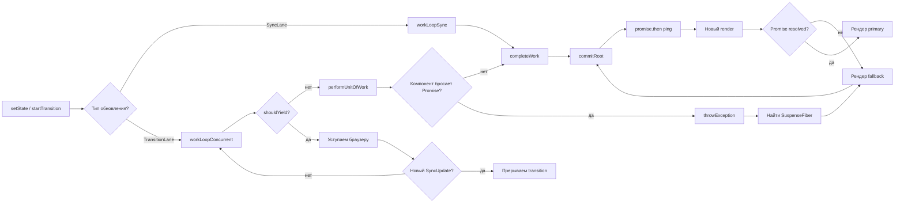

# Уровень 10 (расширенная теория): Concurrent React под микроскопом

## Прерываемый рендер: shouldYield и time slicing

В синхронном режиме `workLoopSync` выглядит так:

```ts
function workLoopSync() {
  while (workInProgress !== null) {
    performUnitOfWork(workInProgress)
  }
}
```

Этот цикл не останавливается ни при каких обстоятельствах. Если дерево содержит 10 000 fiber-узлов, браузер будет заблокирован всё время обработки.

В concurrent режиме используется `workLoopConcurrent`:

```ts
function workLoopConcurrent() {
  while (workInProgress !== null && !shouldYield()) {
    performUnitOfWork(workInProgress)
  }
}
```

`shouldYield()` — экспортируется из пакета Scheduler. Реализация примерно такая:

```ts
// Упрощённая реализация shouldYield из Scheduler
let deadline = 0
const yieldInterval = 5 // ms — "frame slice"

function shouldYield(): boolean {
  return performance.now() >= deadline
}

function scheduleCallback(callback: () => void) {
  deadline = performance.now() + yieldInterval
  MessageChannel.port1.postMessage(null)  // планируем в отдельный macrotask
}
```

Браузер рисует кадр каждые ~16ms (60fps). React берёт не более 5ms из этих 16ms, оставляя остальное браузеру для обработки событий, layout, paint. Это и есть **time slicing**.

```
Timeline (concurrent):
│ React 5ms │ Browser 11ms │ React 5ms │ Browser 11ms │
│ fibers... │ input/paint  │ fibers... │ input/paint  │
```

---

## Lane-based scheduling: как React решает, что рендерить

Каждый root хранит битовое поле `pendingLanes` — маску всех ожидающих обновлений:

```ts
root.pendingLanes = 0b0000_0000_0000_0000_0000_0001_0000_0001
//                                                  ↑         ↑
//                                              TransitionLane SyncLane
```

При каждом цикле React выбирает наивысший приоритет:

```ts
function getNextLanes(root: FiberRoot): Lanes {
  const pendingLanes = root.pendingLanes
  if (pendingLanes === NoLanes) return NoLanes

  // Sync всегда первым
  if (pendingLanes & SyncLane) return SyncLane

  // InputContinuousLane — drag, scroll
  if (pendingLanes & InputContinuousLane) return InputContinuousLane

  // DefaultLane — обычные обновления
  if (pendingLanes & DefaultLane) return DefaultLane

  // TransitionLanes — самые низкие
  const transitionLanes = pendingLanes & TransitionLanes
  if (transitionLanes !== NoLanes) return transitionLanes

  return NoLanes
}
```

### Starvation prevention

Если транзиция долго ждёт (пользователь генерирует много sync обновлений), React начинает "состаривать" её lane: переводит в EntangledLanes, которые обрабатываются с повышенным приоритетом. Это предотвращает бесконечное откладывание.

```
TransitionLane waiting > 5000ms
    ↓
React повышает priorityLevel до SyncLane-1
    ↓
Следующий render включает transition work
```

---

## Suspense internals: жизнь SuspenseComponent fiber

Когда React встречает `<Suspense fallback={<Spinner />}>`, он создаёт fiber с `tag = SuspenseComponent`. У этого fiber особая логика в `beginWork`.

### Шаг 1: Первый рендер — нет pending promise

```
beginWork(SuspenseFiber)
    ↓
showFallback = false
    ↓
Рендерим primary child (OffscreenComponent с mode="visible")
    ↓
Всё ок — дерево строится нормально
```

### Шаг 2: Дочерний компонент бросает Promise

```
performUnitOfWork(UserProfileFiber)
    ↓
render() throws promise P
    ↓
React catches в throwException()
    ↓
Ищет ближайший SuspenseFiber в стеке
    ↓
Прикрепляет P к SuspenseFiber.updateQueue
    ↓
Перезапускает renderFiber от SuspenseFiber
```

В `throwException` React также вызывает `attachPingListener` — подписывается на `P.then(ping)`. Когда Promise разрешится, `ping` разбудит root и запланирует новый render.

### Шаг 3: Второй рендер SuspenseFiber — показываем fallback

```
beginWork(SuspenseFiber)
    ↓
didSuspend = true (есть pending promise)
    ↓
showFallback = true
    ↓
Рендерим primary child как OffscreenComponent с mode="hidden"
    ↓
Рендерим fallback ветку нормально
    ↓
commit: fallback видим, primary — в DOM но скрыт (display: none)
```

Важно: **primary ветка не уничтожается**. Она остаётся в DOM как скрытый OffscreenComponent. Это нужно для того, чтобы при resolve Promise не перемонтировать весь поддерев заново.

```
DOM после Suspense fallback:
<div data-suspense-boundary>
  <!-- OffscreenComponent mode="hidden": display:none -->
  <div class="user-profile">...</div>
  <!-- Fallback: видим -->
  <div class="spinner">Loading...</div>
</div>
```

### Шаг 4: Promise resolve → ping → новый render

```
P resolves
    ↓
ping(root, SuspenseLane)
    ↓
scheduleUpdateOnFiber(root, SuspenseLane)
    ↓
Новый render от SuspenseFiber
    ↓
cache.read(key) теперь возвращает value (не бросает)
    ↓
showFallback = false
    ↓
OffscreenComponent mode="visible"
    ↓
commit: fallback удаляется, primary становится visible
```

---

## Fallback rendering и OffscreenComponent

`OffscreenComponent` — это специальный fiber type, введённый именно для Suspense (и будущих View Transitions). Его ключевое свойство: дерево под ним остаётся в DOM, но не видно пользователю.

```
SuspenseComponent
├── OffscreenComponent (mode="hidden" | "visible")
│   └── primary children (UserProfile, UserPosts...)
└── fallback (Fragment)
    └── Spinner
```

Когда `mode="hidden"`, React выполняет весь цикл `beginWork`/`completeWork` для потомков, но помечает их как `Offscreen`. В commit phase это означает: применить все DOM-мутации, но не показывать. React применяет `display: none` к корневому DOM-узлу OffscreenComponent.

Это дорого? Да, немного — дерево строится даже в скрытом состоянии. Зато когда Promise resolve, React не перемонтирует компоненты, а просто меняет `display` обратно. Все `useEffect` и `useState` сохраняют своё состояние.

---

## Promise caching: почему без кэша — infinite loop

Рассмотрим, что произошло бы без кэша:

```
Render 1: UserProfile вызывает fetch('/api/user') → Promise P1 → throw P1
React: покажи fallback, жди P1
P1 resolve...
Render 2: UserProfile вызывает fetch('/api/user') → Promise P2 (НОВЫЙ!) → throw P2
React: покажи fallback, жди P2
P2 resolve...
Render 3: UserProfile вызывает fetch('/api/user') → Promise P3 (НОВЫЙ!) → throw P3
... ∞
```

Каждый рендер создаёт новый Promise, который никогда не был в кэше → всегда кидает → fallback вечно показан.

Правильный паттерн — это **resource pattern** (или wrapPromise):

```ts
function wrapPromise<T>(promise: Promise<T>) {
  let status: 'pending' | 'fulfilled' | 'rejected' = 'pending'
  let result: T
  let error: unknown

  const suspender = promise.then(
    value => { status = 'fulfilled'; result = value },
    err   => { status = 'rejected'; error = err },
  )

  return {
    read(): T {
      if (status === 'pending')   throw suspender     // throw Promise
      if (status === 'rejected')  throw error         // throw Error
      return result                                   // return value
    },
  }
}
```

Этот объект создаётся **один раз** (например, вне компонента или в родителе) и передаётся в компонент. При каждом `read()` возвращается один и тот же `suspender` — React узнаёт его и не зацикливается.

---

## Waterfall: анатомия проблемы

```tsx
// ❌ Waterfall: UserPosts ждёт пока UserProfile получит данные
function UserPage() {
  return (
    <Suspense fallback={<Spinner />}>
      <UserProfile userId="1">  {/* fetch user → suspend → resume */}
        <Suspense fallback={<Spinner />}>
          <UserPosts userId="1" />  {/* fetch posts → suspend → resume */}
        </Suspense>
      </UserProfile>
    </Suspense>
  )
}
```

Почему waterfall? Потому что `<UserPosts>` не рендерится до тех пор, пока `<UserProfile>` не вернётся из suspend. React строит дерево сверху вниз — если родитель suspended, дочерние узлы до него не доходят.

```
Timeline:
t=0ms:   UserProfile suspend → fallback
t=300ms: UserProfile resolve → рендер → UserPosts suspend → fallback
t=600ms: UserPosts resolve → рендер
Итого: 600ms
```

### Решение 1: Поднять fetch выше

```tsx
// ✅ Параллельные запросы: оба Promise созданы до рендера
function UserPage() {
  // Запросы стартуют СРАЗУ, до любого suspend
  const userResource = fetchUser('1')      // создаём Promise
  const postsResource = fetchPosts('1')   // создаём Promise

  return (
    <Suspense fallback={<Spinner />}>
      <UserProfile resource={userResource} />
      <UserPosts resource={postsResource} />
    </Suspense>
  )
}
```

Теперь оба Promise созданы одновременно. Оба компонента могут suspend, но ждут параллельно:

```
Timeline:
t=0ms:   UserProfile suspend + UserPosts suspend → один общий fallback
t=300ms: оба resolve → один перерендер
Итого: 300ms
```

### Решение 2: Promise.all

```tsx
const [user, posts] = use(
  Promise.all([fetchUser(userId), fetchPosts(userId)])
)
```

---

## Selective hydration: Suspense при SSR

При серверном рендере `<Suspense>` границы становятся **streaming boundaries**. Сервер может отправить HTML в несколько чанков:

```
Chunk 1 (immediate):
<html>
  <body>
    <div id="root">
      <header>...</header>
      <!--$?--><template id="B:0"><!--/$?--></template>  ← placeholder
      <footer>...</footer>

Chunk 2 (after data ready, e.g. 300ms later):
<div hidden id="S:0">
  <div class="user-profile">John Doe</div>
</div>
<script>$RC("B:0", "S:0")</script>  ← swap placeholder with content
```

На клиенте React выполняет **selective hydration** — гидрирует компоненты с учётом приоритетов:

```
Если пользователь кликнул на ещё негидрированный компонент:
    ↓
React немедленно гидрирует этот Suspense boundary (SyncLane)
    ↓
Остальные boundaries гидрируются по TransitionLane (фоново)
```

Это означает: даже если у вас тяжёлая страница с 10 Suspense boundaries, пользователь может взаимодействовать с той частью, на которую кликнул — React приоритизирует её гидрацию.

---

## use() хук: детальное рассмотрение

`use()` — не просто синтаксический сахар. У него есть важные особенности:

### 1. Можно вызывать условно

```tsx
// ✅ use() разрешён в условиях (в отличие от useState, useEffect)
function UserProfile({ shouldLoad, promise }: Props) {
  if (!shouldLoad) return <div>Скрыто</div>
  const user = use(promise)   // OK: use внутри условия
  return <div>{user.name}</div>
}
```

Это работает потому, что `use()` не хранит состояние в hooks linked list. Он читает thenable напрямую через специальный механизм dispatcher.

### 2. use() с Context

```tsx
// use() также работает с Context — аналог useContext
const theme = use(ThemeContext)
```

### 3. Внутренняя реализация

```ts
// Упрощённая реализация use() из React source
function use<T>(usable: Usable<T>): T {
  if (usable !== null && typeof usable === 'object') {
    // Thenable (Promise)
    if (typeof (usable as any).then === 'function') {
      const thenable = usable as Thenable<T>
      return useThenable(thenable)
    }
    // Context
    if ((usable as any).$$typeof === REACT_CONTEXT_TYPE) {
      return readContext(usable as ReactContext<T>)
    }
  }
  throw new Error('Invalid argument to use()')
}

function useThenable<T>(thenable: Thenable<T>): T {
  switch (thenable.status) {
    case 'fulfilled':
      return thenable.value   // данные готовы
    case 'rejected':
      throw thenable.reason   // ошибка — поймает ErrorBoundary
    default:
      // pending: прикрепляем обработчики и throw
      if (typeof thenable.status === 'undefined') {
        // Первый раз видим этот thenable — инструментируем его
        thenable.status = 'pending'
        thenable.then(
          value => { thenable.status = 'fulfilled'; thenable.value = value },
          reason => { thenable.status = 'rejected'; thenable.reason = reason },
        )
      }
      throw thenable  // React поймает в throwException
  }
}
```

---

## Диаграмма: полный цикл Concurrent render с Suspense



---

## Streaming SSR: Suspense как граница потока

```
Сервер                              Клиент
─────────────────────────────────   ─────────────────────
renderToPipeableStream(<App />)
    ↓
Немедленно: <html><body>           → parse → hydrate shell
    <header>Static content</header>
    <!--$?-->PLACEHOLDER<!--/$?-->
    <footer>Static content</footer>
    
(300ms спустя — данные готовы):
    <div hidden>                    → $RC() → заменить placeholder
      <UserProfile>John</UserProfile>
    </div>
    <script>$RC("B:0","S:0")</script>
    
(600ms спустя — посты готовы):
    <div hidden>                    → $RC() → заменить placeholder
      <UserPosts>...</UserPosts>
    </div>
    <script>$RC("B:1","S:1")</script>
```

Пользователь видит header и footer мгновенно. UserProfile появляется через 300ms. UserPosts через 600ms. Без блокировки.

---

## Отличие от react19-course

Этот уровень изучает **механику**, а не API:

| Что изучаем здесь | Что изучает react19-course |
|---|---|
| Как thrown promise ловится React | Как писать компоненты с Suspense |
| SuspenseComponent fiber internals | startTransition API |
| shouldYield в work loop | isPending индикация |
| Lane-based scheduling | use() хук как пользователь |
| Offscreen component | Streaming SSR настройка |

Понимание механики позволяет отлаживать сложные случаи: почему Suspense не показывает fallback, почему transition не прерывается, почему isPending застрял в true.

---

## Резюме: ключевые принципы

```
1. Прерываемость = shouldYield() + TransitionLane
   - Sync updates никогда не прерываются
   - Transition updates проверяют shouldYield() после каждого fiber

2. Suspense = try-catch на уровне React render
   - throw Promise → React ловит → fallback → ping → retry
   - Кэш ОБЯЗАТЕЛЕН: один Promise на ключ

3. Waterfall = render-then-fetch
   - Решение: fetch-then-render (поднять запросы выше в дереве)

4. use() = инструментированный throw/catch с удобным синтаксисом
   - Можно вызывать условно
   - Работает с Promise и Context

5. Selective hydration = приоритизация гидрации по взаимодействию
   - Клик на компонент → immediate hydration этой Suspense boundary
```
