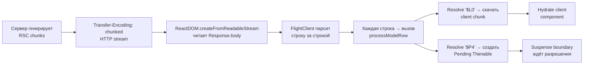
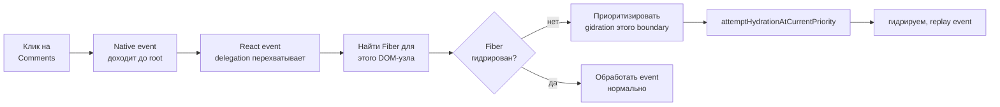
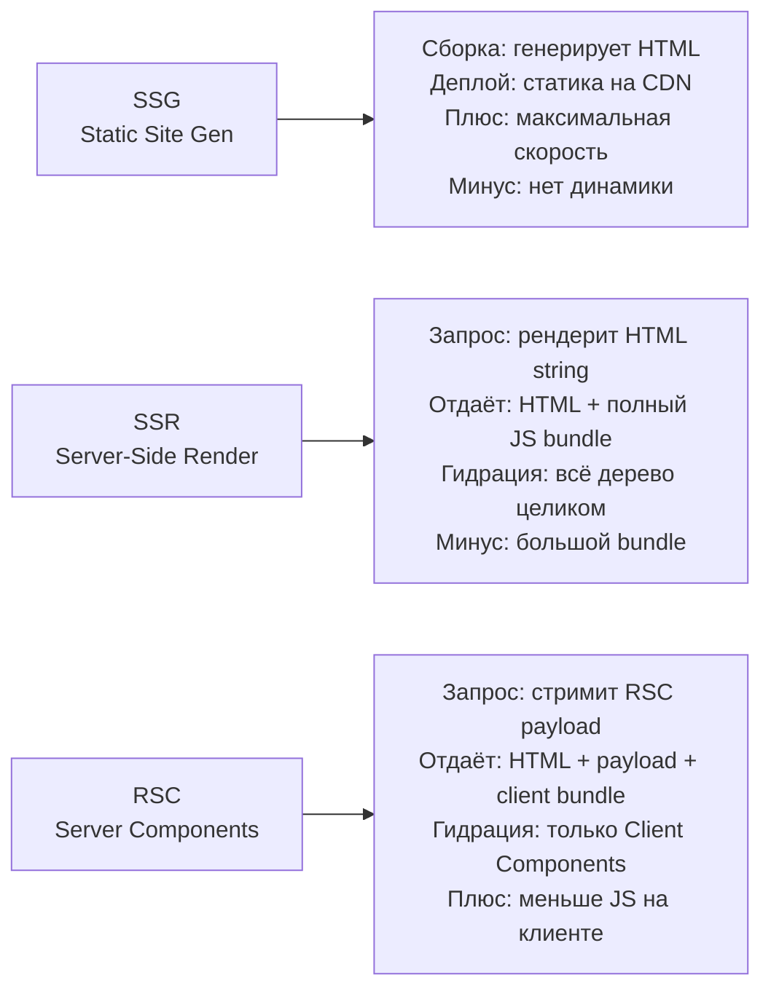
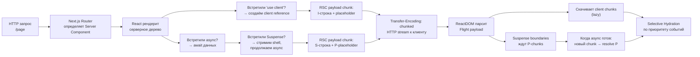

# Уровень 11 (расширенная теория): RSC Protocol, Flight и Selective Hydration

## RSC Payload: анатомия wire format

React Flight — это протокол, который React использует для передачи компонентного дерева от сервера к клиенту. Он разработан командой React специально для RSC и сильно отличается от обычного JSON.

### Структура строки payload

Каждая строка payload имеет формат: `<id>:<type><data>`

```
0:I["/chunks/counter-abc123.js",["counter-chunk"],"Counter"]
1:["$","div",null,{"className":"app","children":["$","$L0",null,{"initialCount":5}]}]
```

Расшифровка типов:

| Префикс | Значение | Данные |
|---------|----------|--------|
| `I` | Import (client reference) | путь к chunk, имена экспортов |
| `J` | JSON / React element | сериализованный React.element |
| `S` | String token | "react.suspense", "react.fragment" |
| `M` | Module metadata | метаданные бандла |
| `E` | Error | ошибка в Server Component |
| `P` | Promise/async | ещё не разрешённый chunk |

### Как выглядит реальный payload

Возьмём простую страницу:

```tsx
// Page.tsx (Server Component)
async function Page() {
  const data = await fetchData()
  return (
    <div className="page">
      <h1>{data.title}</h1>
      <Suspense fallback={<Spinner />}>
        <Comments postId={data.id} />
      </Suspense>
      <LikeButton postId={data.id} />  {/* 'use client' */}
    </div>
  )
}
```

RSC payload для этой страницы (упрощённо):

```
0:"$Sreact.suspense"
1:I["/static/chunks/like-button-abc.js",["like-button"],"LikeButton"]
2:{"id":"$L1","props":{"postId":"123"}}
3:{"type":"div","props":{"className":"page"},"children":[
     {"type":"h1","props":{},"children":"Статья о React"},
     {"type":"$0","props":{"fallback":"$spinner"},"children":"$P4"},
     "$L2"
   ]}
4:null
```

Строка `$P4` — это placeholder для ещё не разрешённого Suspense-чанка. Когда `Comments` загрузится на сервере, придёт ещё одна строка:

```
4:{"type":"div","props":{"className":"comments"},"children":[...]}
```

---

## Flight protocol: как клиент разбирает поток

React DOM не просто читает payload как JSON — он **постепенно** восстанавливает дерево по мере поступления данных.



Ключевые моменты парсинга:

**1. Lazy refs (`$L<id>`)** — это отложенные ссылки на client chunks. Когда Flight-клиент встречает `$L0`, он:
- Проверяет кэш модулей
- Если chunk не загружен — начинает его загрузку
- Создаёт React lazy element, который suspend-ится до готовности chunk

**2. Pending thenables (`$P<id>`)** — placeholders для async Server Components. Создаётся React element, который throw-ит Promise до разрешения соответствующей строки payload.

**3. Server references (`$$typeof: Symbol(react.client.reference)`)** — специальный объект, который React использует для идентификации Client Components в payload:

```js
{
  $$typeof: Symbol(react.client.reference),
  $$id: './src/LikeButton.tsx#LikeButton',
  $$async: false
}
```

---

## Streaming mechanics: как HTML приходит кусками

### Transfer-Encoding: chunked

HTTP/1.1 поддерживает потоковую передачу через заголовок `Transfer-Encoding: chunked`. Каждый чанк предваряется размером в шестнадцатеричном формате:

```
HTTP/1.1 200 OK
Content-Type: text/html
Transfer-Encoding: chunked

1a\r\n
<html><head></head><body>\r\n
3e\r\n
<div id="root"><h1>Заголовок</h1></div>\r\n
0\r\n
\r\n
```

### Как React вставляет данные Suspense

Когда Suspense-граница разрешается, React не просто отдаёт HTML — он **инжектирует скрипт-тег** в уже открытый HTML-поток:

```html
<!-- Первый чанк: shell с placeholder -->
<div id="root">
  <div class="page">
    <h1>Заголовок</h1>
    <!--$?-->
    <template id="B:0"></template>
    <div class="spinner">Загрузка...</div>
    <!--/$-->
  </div>
</div>

<!-- Второй чанк: когда Comments загрузились -->
<div hidden id="S:0">
  <div class="comments">
    <!-- реальный контент comments -->
  </div>
</div>
<script>
  $RC("B:0", "S:0")  // replaceSuspenseContent
</script>
```

Функция `$RC` (replaceSuspenseContent) — это минифицированный runtime React, который:
1. Находит `<template id="B:0">` (Suspense placeholder)
2. Заменяет его содержимым `<div id="S:0">`
3. Убирает `hidden` атрибут

Это происходит **до** загрузки основного React bundle! Пользователь видит реальный контент как только он приходит с сервера.

---

## Server Components сериализация: что можно передать

### Разрешённые типы для props Server → Client

```tsx
// ✅ Primitives
<Client str="hello" num={42} bool={true} nil={null} />

// ✅ Plain objects и arrays (рекурсивно)
<Client data={{ user: { name: 'Alice', age: 30 } }} list={[1, 2, 3]} />

// ✅ JSX как children (но не вызывать на клиенте)
<Client>
  <div>Статичный контент от сервера</div>
</Client>

// ✅ Promises (React 19)
const promise = fetchData()  // начинается на сервере
<Client dataPromise={promise} />

// ✅ Server Actions (специальные async функции)
async function submitForm(formData: FormData) { 'use server'; ... }
<Client action={submitForm} />
```

### Запрещённые типы: вызовут ошибку

```tsx
// ❌ Функции (кроме Server Actions)
const handleClick = () => console.log('clicked')
<Client onClick={handleClick} />  // Error: Functions cannot be passed directly

// ❌ Классы и экземпляры
class User { constructor(public name: string) {} }
<Client user={new User('Alice')} />  // Error: not serializable

// ❌ Date, Map, Set, RegExp — нельзя напрямую
<Client date={new Date()} />  // Error

// ✅ Правильно: сериализуй вручную
<Client date={new Date().toISOString()} />
```

### Почему именно такие ограничения?

RSC payload сериализуется как JSON-подобный текст. JavaScript-функции не сериализуются в JSON. `Date` можно было бы добавить, но команда React намеренно ограничила типы, чтобы избежать скрытых ошибок при передаче сложных объектов.

---

## Selective Hydration: детальный механизм

### Как React узнаёт, что нужно гидрировать первым

Когда пользователь взаимодействует со страницей до завершения гидрации, браузер регистрирует native events. React перехватывает их через event delegation на root-контейнере.



### Приоритеты hydration

React использует ту же систему lanes для приоритизации гидрации:

| Событие | Lane | Приоритет |
|---------|------|-----------|
| `click`, `input` | SyncLane | Максимальный |
| `mouseover` | InputContinuousLane | Высокий |
| `scroll` (passive) | DefaultLane | Нормальный |
| Фоновая гидрация | IdleLane | Минимальный |

```tsx
// Внутри React: регистрация события до загрузки bundle
// ReactDOMFizzServer.ts — injected script
window.__reactFiberListeners = []
document.addEventListener('click', (e) => {
  // Если нашли не гидрированный fiber:
  // scheduleCallback(ImmediatePriority, hydrateRoot)
  // После гидрации: replayEvent(e)
})
```

### Replay событий

После гидрации React **воспроизводит** события, которые произошли до неё. Это значит: если пользователь кликнул на кнопку до гидрации — клик не потеряется. React запомнил событие, гидрировал компонент, и запустил onClick-обработчик.

---

## Progressive Enhancement: работает без JavaScript

Пока гидрация не завершена (или если JS отключён), страница должна оставаться функциональной. Это возможно за счёт HTML-семантики:

```tsx
// ✅ Ссылки работают без JS
<a href="/products/123">Перейти к товару</a>

// ✅ Формы работают через нативный submit
<form action="/api/search" method="GET">
  <input name="q" />
  <button type="submit">Поиск</button>
</form>

// ✅ Server Actions тоже работают без JS (POST-форма)
async function search(formData: FormData) {
  'use server'
  redirect(`/search?q=${formData.get('q')}`)
}
<form action={search}>
  <input name="q" />
  <button type="submit">Поиск</button>
</form>
```

Когда React гидрирует — он улучшает поведение: добавляет `preventDefault`, optimistic updates, transitions. Но базовая функциональность работает сразу.

---

## Сравнение: SSR vs RSC vs SSG



| Характеристика | SSG | SSR | RSC |
|----------------|-----|-----|-----|
| Когда рендерится | Сборка | Каждый запрос | Каждый запрос |
| Динамические данные | Нет (или ISR) | Да | Да |
| JS bundle | Полный | Полный | Только client |
| Time to First Byte | Минимальный | Средний | Средний |
| Streaming | Нет | Ограниченно | Да |
| Обновление без JS | Нет | Нет | Частично (Server Actions) |

---

## Server Actions: RPC через 'use server'

Server Actions — это функции, которые выполняются на сервере, но вызываются с клиента как обычные async-функции. Бандлер создаёт для них HTTP endpoint.

```tsx
// actions.ts
'use server'
export async function createPost(title: string, content: string) {
  await db.posts.create({ title, content })
  revalidatePath('/posts')
}

// CreatePostForm.tsx (Client Component)
'use client'
import { createPost } from './actions'

export function CreatePostForm() {
  async function handleSubmit(e: FormEvent) {
    e.preventDefault()
    await createPost(title, content)  // вызов уходит как POST /rsc-action
  }
  ...
}
```

Под капотом бандлер создаёт endpoint наподобие `/next/server-action/abc123`, который принимает аргументы, десериализованные через тот же Flight protocol, выполняет функцию и возвращает результат.

---

## Водопады данных в RSC: параллельность через Promise.all

Server Components могут быть async, но не должны создавать водопады:

```tsx
// ❌ Водопад: user загружается, потом posts
async function Profile({ userId }: { userId: string }) {
  const user = await fetchUser(userId)       // 200ms
  const posts = await fetchPosts(userId)     // 300ms
  // Итого: 500ms
  return <div>...</div>
}

// ✅ Параллельно: оба запроса одновременно
async function Profile({ userId }: { userId: string }) {
  const [user, posts] = await Promise.all([
    fetchUser(userId),    // \
    fetchPosts(userId),   //  > оба стартуют одновременно → 300ms
  ])
  return <div>...</div>
}

// ✅ Ещё лучше: стримить через Suspense
async function Profile({ userId }: { userId: string }) {
  const userPromise = fetchUser(userId)    // стартует немедленно
  const postsPromise = fetchPosts(userId)  // стартует немедленно
  return (
    <div>
      <Suspense fallback={<UserSkeleton />}>
        <UserCard promise={userPromise} />    {/* показывается как только готов */}
      </Suspense>
      <Suspense fallback={<PostsSkeleton />}>
        <PostsList promise={postsPromise} />  {/* независимо от UserCard */}
      </Suspense>
    </div>
  )
}
```

---

## Кэширование в RSC: React cache()

React предоставляет утилиту `cache()` для дедупликации запросов в рамках одного рендер-прохода:

```tsx
import { cache } from 'react'

// Один и тот же userId → один запрос, даже если вызывается из разных компонентов
const getUser = cache(async (userId: string) => {
  return await db.users.findById(userId)
})

async function UserName({ userId }: { userId: string }) {
  const user = await getUser(userId)  // запрос
  return <span>{user.name}</span>
}

async function UserAvatar({ userId }: { userId: string }) {
  const user = await getUser(userId)  // дедуплицируется!
  return 
}
```

`cache()` работает только в Server Components и сбрасывается между запросами (не между компонентами одного запроса).

---

## ⚠️ Распространённые ошибки новичков

### 1. Путать 'use server' для файла и для функции

```tsx
// ❌ 'use server' в начале файла делает ВСЕ функции Server Actions
'use server'
export function helper() { ... }  // теперь тоже Server Action — не то, что хотели

// ✅ 'use server' на конкретную функцию (inline Server Action)
export function MyForm() {
  async function submit(data: FormData) {
    'use server'  // только эта функция
    await saveData(data)
  }
  return <form action={submit}>...</form>
}
```

### 2. Мутировать БД без revalidation

```tsx
// ❌ Данные обновились в БД, но страница показывает старые
async function deletePost(id: string) {
  'use server'
  await db.posts.delete(id)
  // Забыли revalidate!
}

// ✅ Инвалидировать кэш после мутации
async function deletePost(id: string) {
  'use server'
  await db.posts.delete(id)
  revalidatePath('/posts')   // или revalidateTag('posts')
}
```

### 3. Передавать секреты из Server Action в Client Component

```tsx
// ❌ API ключ попадёт в RSC payload и будет виден в devtools
async function ServerComp() {
  const apiKey = process.env.SECRET_API_KEY
  return <Client apiKey={apiKey} />  // ОПАСНО
}

// ✅ Использовать секреты только внутри Server Component
async function ServerComp() {
  const data = await fetchWithAuth(process.env.SECRET_API_KEY)
  return <Client data={data} />  // передаём только результат, не ключ
}
```

### 4. Вызывать Server Action в useEffect

```tsx
// ❌ Server Actions предназначены для user actions, не для side effects
'use client'
import { loadData } from './actions'

function Component() {
  useEffect(() => {
    loadData()  // плохая практика: нет обработки ошибок, нет loading state
  }, [])
}

// ✅ Для загрузки данных — Server Component или SWR/React Query
async function ServerComponent() {
  const data = await loadData()  // на сервере, нет лишней сети
  return <ClientComponent data={data} />
}
```

---

## Резюме: полный цикл RSC запроса



📌 RSC — это не просто "SSR с оптимизацией". Это фундаментально другая модель: сервер отдаёт не HTML-строку, а **описание дерева компонентов**, которое клиент постепенно восстанавливает, гидрирует только интерактивные части и делает это с учётом того, с чем прямо сейчас взаимодействует пользователь.
