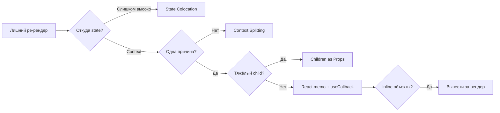

# Уровень 13: Продвинутые паттерны производительности — подробная теория

## Введение: системный взгляд на производительность

После изучения internals React — Fiber, reconciliation, хуков — возникает соблазн
оптимизировать всё подряд. Добавить `useMemo` везде. Обернуть каждый компонент в `React.memo`.
Но это **симптоматическое лечение**, а не устранение причины.

Настоящая производительность начинается с архитектуры: правильное расположение state,
правильное разделение Context, правильная структура дерева компонентов. Оптимизации поверх
плохой архитектуры дают небольшой эффект и создают технический долг.

---

## State Colocation: детальный разбор

### Почему "поднять state" — частая ошибка

Документация React учит "поднимать state" (lifting state up). Это правильно, когда несколько
компонентов **действительно** должны его разделять. Но разработчики начинают делать это
превентивно — "а вдруг понадобится". Результат: state в корне приложения, и вся страница
ре-рендерится при каждом нажатии клавиши.

### Пример: форма с поднятым state

```tsx
// ❌ Плохо: вся страница ре-рендерится при вводе в форму
function Page() {
  const [formData, setFormData] = useState({ name: '', email: '' })

  return (
    <div>
      <Navigation />     {/* ← ненужный ре-рендер */}
      <HeroBanner />     {/* ← ненужный ре-рендер */}
      <Form
        data={formData}
        onChange={setFormData}
      />
      <Recommendations />  {/* ← ненужный ре-рендер */}
      <Footer />           {/* ← ненужный ре-рендер */}
    </div>
  )
}
```

При каждом нажатии клавиши в форме: `setFormData` → ре-рендер `Page` → ре-рендер всех 5 дочерних компонентов.
`React.memo` здесь не поможет: `Navigation` и `HeroBanner` без props — они безопасны, но
`setFormData` передаётся новой функцией при каждом рендере (если без `useCallback`)...
А `Recommendations` получает `user` из props? Нет — тогда он вообще не должен ре-рендериться.

```tsx
// ✅ Хорошо: form state живёт в форме
function Form() {
  const [formData, setFormData] = useState({ name: '', email: '' })
  return (
    <form>
      <input value={formData.name} onChange={e =>
        setFormData(d => ({ ...d, name: e.target.value }))
      } />
      <input value={formData.email} onChange={e =>
        setFormData(d => ({ ...d, email: e.target.value }))
      } />
    </form>
  )
}

function Page() {
  return (
    <div>
      <Navigation />
      <HeroBanner />
      <Form />        {/* ← только Form ре-рендерится при вводе */}
      <Recommendations />
      <Footer />
    </div>
  )
}
```

### Алгоритм принятия решения: где держать state?

```
Кто использует этот state?

  Один компонент         → держать в нём
  Несколько сиблингов   → поднять к ближайшему общему предку
  Большое поддерево     → рассмотреть Context
  Всё приложение        → Context или external store (Zustand, Redux)
```

---

## Context Splitting: разделение по частоте изменений

### Как Context вызывает ре-рендеры

Context не волшебный — это тот же механизм props, только через дерево. Когда значение контекста
изменяется, React находит всех потребителей `useContext(SomeContext)` и планирует их ре-рендер.

Проблема возникает, когда в одном контексте смешаны данные с разной частотой изменений:

```tsx
// ❌ Один AppContext — три разных ритма изменений
interface AppContextType {
  user: User          // меняется при логине/логауте (редко)
  theme: Theme        // меняется при переключении (иногда)
  searchQuery: string // меняется при каждом нажатии (часто!)
  setSearchQuery: (q: string) => void
}

// При каждом вводе символа: setSearchQuery → AppContext.value обновляется
// → ВСЕ useContext(AppContext) ре-рендерятся:
//   UserCard (использует user)      ← ненужный ре-рендер
//   ThemeToggle (использует theme)  ← ненужный ре-рендер
//   SearchResults (использует query) ← нужный ре-рендер
```

### Разделение на независимые контексты

```tsx
// ✅ Три контекста — три независимых ритма обновлений

const UserContext = createContext<User | null>(null)
const ThemeContext = createContext<Theme>('light')
const SearchContext = createContext<{
  query: string
  setQuery: (q: string) => void
}>({ query: '', setQuery: () => {} })

function AppProviders({ children }: { children: React.ReactNode }) {
  const [user, setUser] = useState<User | null>(null)
  const [theme, setTheme] = useState<Theme>('light')
  const [query, setQuery] = useState('')

  // ⚠️ Важно: объект для SearchContext мемоизируем, иначе он будет
  // создаваться заново при каждом рендере AppProviders
  const searchValue = useMemo(() => ({ query, setQuery }), [query])

  return (
    <UserContext.Provider value={user}>
      <ThemeContext.Provider value={theme}>
        <SearchContext.Provider value={searchValue}>
          {children}
        </SearchContext.Provider>
      </ThemeContext.Provider>
    </UserContext.Provider>
  )
}
```

Теперь `UserCard` подписан только на `UserContext` — он не ре-рендерится при вводе поиска.

### Value + Setter: всегда разделять

Особый случай: контекст с `value` и `setter`. Setter стабилен (всегда одна и та же функция из
`useState`/`useReducer`). Если положить их вместе — потребители setter ре-рендерятся при каждом
изменении value.

```tsx
// ❌ Смешиваем стабильное (setter) и нестабильное (value)
const ThemeContext = createContext({ theme, setTheme })

// ✅ Разделяем — ThemeSetterContext никогда не меняется
const ThemeValueContext = createContext<Theme>('light')
const ThemeSetterContext = createContext<React.Dispatch<React.SetStateAction<Theme>>>(() => {})

// Компонент, который только меняет тему — не ре-рендерится при изменении темы
function ThemeToggleButton() {
  const setTheme = useContext(ThemeSetterContext)  // стабильный контекст
  return <button onClick={() => setTheme(t => t === 'light' ? 'dark' : 'light')}>Toggle</button>
}
```

---

## Children as Props: internals и почему это работает

### Что происходит с JSX

JSX — это синтаксический сахар для `React.createElement`. Выражение `<HeavyChild />` превращается
в вызов функции, возвращающей **объект**:

```tsx
// JSX:
<HeavyChild name="test" />

// После компиляции:
React.createElement(HeavyChild, { name: 'test' })
// Возвращает объект: { type: HeavyChild, props: { name: 'test' }, key: null }
```

Этот объект создаётся **в том месте**, где написан JSX — то есть в родительском компоненте
родителя. При ре-рендере Wrapper он не пересоздаётся — потому что Wrapper его не создавал.

### Визуализация

```
Без children as props:
  App рендерится
    └─ Wrapper рендерится → создаёт <HeavyChild /> → HeavyChild рендерится
         (при setState в Wrapper → Wrapper ре-рендерится → HeavyChild ре-рендерится)

С children as props:
  App рендерится → создаёт <HeavyChild /> (React element object)
    └─ Wrapper рендерится → получает {children: <HeavyChild />} в props
         (при setState в Wrapper → Wrapper ре-рендерится)
         React сравнивает children: тот же объект → bailout → HeavyChild НЕ ре-рендерится
```

### Ограничение паттерна

Children as props не работает, если children используют state из wrapper:

```tsx
// ❌ Это не сработает — HeavyChild нужен count из Wrapper
function Wrapper({ children }) {
  const [count, setCount] = useState(0)
  // Как передать count в children? Нельзя — children созданы снаружи
  return <div>{count} {children}</div>
}

// В этом случае нужен другой подход: render props или context
```

---

## Composition vs Inheritance: всё через компоненты

React строится на композиции. Вместо "расширить базовый класс" — "обернуть компонент":

```tsx
// ❌ Наследование (Class components — устаревший паттерн)
class FancyButton extends BaseButton {
  render() { return <button className="fancy">{super.render()}</button> }
}

// ✅ Композиция — обернуть и добавить
function FancyButton({ children, ...props }) {
  return <button className="fancy" {...props}>{children}</button>
}

// ✅ Специализация через props
function Dialog({ title, body, footer }) {
  return (
    <div className="dialog">
      <h2>{title}</h2>
      <div>{body}</div>
      <footer>{footer}</footer>
    </div>
  )
}

// ✅ Render props — когда нужен доступ к внутреннему state
function DataFetcher({ url, children }) {
  const [data, setData] = useState(null)
  useEffect(() => { fetch(url).then(r => r.json()).then(setData) }, [url])
  return children(data)
}

// Использование:
<DataFetcher url="/api/users">
  {(users) => users ? <UserList users={users} /> : <Spinner />}
</DataFetcher>
```

---

## React DevTools Profiler: как читать результаты

### Flame Chart (огненная диаграмма)

Flame chart показывает дерево рендеров для одного коммита:
- Ширина прямоугольника = время рендера
- Серый = не ре-рендерился (bailout)
- Цветной = ре-рендерился (цвет от зелёного к красному — чем горячее, тем медленнее)

```
Commit #3 (12ms total):
  App (0.1ms)
    Header (0.05ms) ← grey, bailout
    SearchSection (11.8ms)
      SearchBar (0.2ms)
      SearchResults (11.6ms)  ← red, медленно!
        ResultItem ×100 (each ~0.1ms)
```

### Ranked View

Показывает компоненты, отсортированные по времени рендера. Полезно для нахождения самых
медленных компонентов без изучения дерева.

### Commit Graph

Показывает все коммиты в записанной сессии. Высокие столбцы = долгие коммиты = проблемы.
Нажмите на столбец, чтобы увидеть flame chart для этого коммита.

### Как записать профиль

1. Открыть React DevTools → вкладка Profiler
2. Нажать Record (кружок)
3. Выполнить действие, которое тормозит
4. Нажать Stop
5. Изучить commit graph и flame chart

---

## Performance Audit Checklist: систематический подход

```
1. ИЗМЕРИТЬ ДО ОПТИМИЗАЦИИ
   [ ] Записать профиль DevTools Profiler
   [ ] Зафиксировать baseline: сколько компонентов ре-рендерятся, за сколько ms

2. STATE COLOCATION
   [ ] Найти state, который используется только в поддереве
   [ ] Переместить state вниз к ближайшему общему предку потребителей

3. CONTEXT AUDIT
   [ ] Какие данные в каждом контексте?
   [ ] Смешаны ли данные с разной частотой изменений?
   [ ] Разделить контексты по частоте: редко / иногда / часто

4. INLINE ОБЪЕКТЫ
   [ ] Найти компоненты с React.memo
   [ ] Проверить: нет ли inline объектов/массивов/функций в props
   [ ] Вынести константы за пределы компонента или useMemo/useCallback

5. EFFECT CHAINS
   [ ] Найти цепочки useEffect: A обновляет state → B зависит от state → ещё рендер
   [ ] Заменить на derived state (useMemo) или вычисление во время рендера

6. КЛЮЧИ В СПИСКАХ
   [ ] Найти списки без key или с key={index}
   [ ] Добавить стабильные уникальные ключи

7. ВИРТУАЛИЗАЦИЯ
   [ ] Есть ли списки > 100 элементов?
   [ ] Рассмотреть react-window или TanStack Virtual

8. ИЗМЕРИТЬ ПОСЛЕ
   [ ] Записать профиль снова
   [ ] Сравнить с baseline
```

---

## Когда НЕ оптимизировать

Производительность с числом в уме — **16ms на кадр** (60fps). Если рендер занимает 2ms,
оптимизация не даст заметного результата пользователю.

```
Не оптимизируй, если:
  - Пользователь не замечает задержку
  - Рендер < 5ms при типичном сценарии
  - Компонент рендерится редко (один раз при монтировании)
  - Оптимизация усложняет код, а выигрыш < 1ms

Оптимизируй, если:
  - Пользователь говорит "лагает"
  - Flame chart показывает > 16ms на коммит
  - Список > 100-500 элементов в DOM
  - Компонент ре-рендерится при каждом нажатии клавиши
```

💡 Преждевременная оптимизация (premature optimization) — добавление `useMemo`/`useCallback`
без профилирования. Это технический долг: код сложнее, а выигрыша нет.

---

## useSyncExternalStore vs useEffect для подписок

Паттерн "подписаться в useEffect" работает, но имеет проблемы с Concurrent Mode (tearing).
Правильный способ — `useSyncExternalStore`:

```tsx
// ❌ Старый паттерн — tearing в concurrent mode
function useOnlineStatus() {
  const [isOnline, setIsOnline] = useState(navigator.onLine)
  useEffect(() => {
    const handler = () => setIsOnline(navigator.onLine)
    window.addEventListener('online', handler)
    window.addEventListener('offline', handler)
    return () => {
      window.removeEventListener('online', handler)
      window.removeEventListener('offline', handler)
    }
  }, [])
  return isOnline
}

// ✅ Правильный паттерн — React знает как синхронизировать
function useOnlineStatus() {
  return useSyncExternalStore(
    (callback) => {
      window.addEventListener('online', callback)
      window.addEventListener('offline', callback)
      return () => {
        window.removeEventListener('online', callback)
        window.removeEventListener('offline', callback)
      }
    },
    () => navigator.onLine,
    () => true  // server snapshot
  )
}
```

---

## Диаграмма: решение для каждой проблемы



---

## Резюме

Производительность React — это три уровня:

**Уровень 1 — Архитектура** (даёт наибольший эффект):
- State Colocation
- Context Splitting
- Children as Props

**Уровень 2 — Мемоизация** (тонкая настройка):
- React.memo + useCallback + useMemo
- Стабильные ключи в списках
- useSyncExternalStore для внешних хранилищ

**Уровень 3 — Структурные решения** (для экстремальных случаев):
- Виртуализация для длинных списков
- Code splitting + lazy loading
- Web Workers для тяжёлых вычислений

📌 Всегда начинай с измерения. Профайлер сначала — оптимизация потом.
