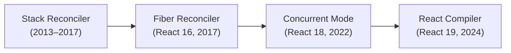

# Уровень 14 (подробная теория): Итоги и архитектурная карта React

## Полный жизненный цикл React — пошаговый разбор

Представьте, что пользователь нажал кнопку. Вот что происходит буквально с первой
миллисекунды до момента, когда браузер отрисовал изменение:

### Шаг 1: Событие → setState

```
click
  → React SyntheticEvent handler
  → setState(newValue)
  → dispatchSetState(fiber, queue, action)
```

`dispatchSetState` (ReactFiberHooks.js) создаёт объект `Update`:

```ts
const update = {
  lane: requestUpdateLane(fiber),  // числовой приоритет
  action: newValue,                // то, что передано в setState
  hasEagerState: false,
  eagerState: null,
  next: null,                      // circular linked list
}
```

Важный момент: если мы в синхронном контексте (не Concurrent), React вычисляет
**eager state** — проверяет, изменился ли результат _прямо сейчас_. Если `Object.is(current, new)`
возвращает `true` — рендер не запускается вообще.

### Шаг 2: Lanes — система приоритетов

React использует **Lanes** — битовые маски. Каждое обновление получает Lane:

```ts
const SyncLane = /*             */ 0b0000000000000000000000000000001
const InputContinuousLane = /*  */ 0b0000000000000000000000000000100
const DefaultLane = /*          */ 0b0000000000000000000000000010000
const TransitionLane1 = /*      */ 0b0000000000000000000000001000000
const IdleLane = /*             */ 0b0100000000000000000000000000000
```

Почему биты, а не числа? Можно быстро объединять несколько Lane в одно число через
битовое OR, и так же быстро проверять пересечения через AND.

`startTransition` переводит работу в `TransitionLane` — Scheduler может прервать и отложить.
Синхронные события получают `SyncLane` — прерывать нельзя.

### Шаг 3: Scheduler — планировщик вне React

Scheduler — отдельный пакет (`packages/scheduler`). Он полностью независим от React:
не знает о Fiber, не знает о компонентах. Его единственная задача — вызывать колбэки
в нужное время.

Внутри Scheduler — **min-heap** (минимальная куча). Задачи отсортированы по `expirationTime`.
Каждые ~5ms (один frame) Scheduler проверяет через `MessageChannel`:

```ts
const channel = new MessageChannel()
channel.port1.onmessage = performWorkUntilDeadline
channel.port2.postMessage(null)  // запланировать следующий "тик"
```

Почему `MessageChannel`, а не `setTimeout(fn, 0)`? setTimeout имеет минимальную задержку 1-4ms
и нестабилен в background-вкладках. `MessageChannel` срабатывает в конце текущей задачи,
до рисования браузера — это быстрее.

`shouldYield()` проверяет: `performance.now() > deadline`. Если да — работа прерывается.

### Шаг 4: Work Loop — двойная буферизация

React всегда работает с двумя деревьями:

```
current tree          workInProgress tree
(отображается)        (строится)
    │                      │
FiberRoot ─────────────────┤
    │                      │
 HostRoot ←── alternate ──▶ HostRoot (wip)
    │                      │
  App ←──── alternate ────▶ App (wip)
    │                      │
 Child ←─── alternate ────▶ Child (wip)
```

После Commit `workInProgress` становится `current`. Старое `current` переиспользуется
как `workInProgress` для следующего рендера — выделение памяти минимально.

Work Loop (упрощённо):

```ts
function workLoopConcurrent() {
  while (workInProgress !== null && !shouldYield()) {
    performUnitOfWork(workInProgress)
  }
}

function performUnitOfWork(unitOfWork: Fiber) {
  const next = beginWork(current, unitOfWork, renderLanes)
  unitOfWork.memoizedProps = unitOfWork.pendingProps

  if (next === null) {
    // Детей нет → завершить узел
    completeUnitOfWork(unitOfWork)
  } else {
    workInProgress = next
  }
}
```

### Шаг 5: beginWork — что происходит для каждого компонента

`beginWork` (ReactFiberBeginWork.js) — switch по `fiber.tag`:

```ts
switch (workInProgress.tag) {
  case FunctionComponent:
    return updateFunctionComponent(current, workInProgress, ...)
  case ClassComponent:
    return updateClassComponent(current, workInProgress, ...)
  case HostComponent:      // div, span, etc.
    return updateHostComponent(current, workInProgress, ...)
  case SuspenseComponent:
    return updateSuspenseComponent(current, workInProgress, ...)
  // ...
}
```

Для FunctionComponent: `renderWithHooks` вызывает саму функцию компонента.
Во время вызова `ReactCurrentDispatcher.current` переключается на `HooksDispatcherOnUpdate`
(или `HooksDispatcherOnMount` при первом рендере).

**Bailout**: если `props` и `context` не изменились, и нет pending updates с нужным Lane —
`beginWork` возвращает `null` без вызова функции компонента. Это оптимизация "cloneChildFibers"
(просто копируем старые файберы).

### Шаг 6: Hooks во время beginWork

Каждый хук — узел linked list в `fiber.memoizedState`:

```
memoizedState
    │
    ▼
Hook (useState: count=0)
    │ next
    ▼
Hook (useEffect: cleanup, deps)
    │ next
    ▼
Hook (useMemo: [value, deps])
    │ next
    ▼
  null
```

При первом рендере — `mountHook`, при обновлении — `updateHook`. Порядок вызовов хуков
должен быть одинаковым (отсюда правило "no hooks in conditions").

### Шаг 7: Reconciliation — сравнение children

После того как функция компонента вернула JSX, React запускает `reconcileChildFibers`
(ReactChildFiber.js) — сравнивает возвращённые элементы с существующими Fiber-узлами.

**Алгоритм для списков (два прохода):**

```
Фаза 1: Линейное сравнение (пока oldFiber и newChild совпадают по key/type)
         ← эффективно для append-only сценариев

Фаза 2: Если совпадение сломалось → оставшиеся oldFibers → Map по key
         Новые children ищутся в Map → переиспользование или создание
         ← эффективно для shuffle/sort сценариев
```

Флаги на Fiber-узлах (`flags`):
- `Placement` (2) — вставить в DOM
- `Update` (4) — обновить атрибуты/текст
- `Deletion` (8) — удалить из DOM
- `Snapshot` (256) — вызвать getSnapshotBeforeUpdate
- `Passive` (512) — есть useEffect для запуска

### Шаг 8: completeWork

После `beginWork` для всего поддерева запускается `completeWork` (снизу вверх):

```ts
function completeWork(current, workInProgress) {
  switch (workInProgress.tag) {
    case HostComponent: {
      if (current !== null && workInProgress.stateNode != null) {
        // Обновить существующий DOM-узел (diff props)
        updateHostComponent(...)
      } else {
        // Создать новый DOM-узел
        const instance = createInstance(type, newProps)
        appendAllChildren(instance, workInProgress)
        workInProgress.stateNode = instance
      }
    }
  }
  // Поднять subtreeFlags от детей к родителю
  bubbleProperties(workInProgress)
}
```

`bubbleProperties` — ключевая оптимизация: `subtreeFlags` содержит OR всех флагов
поддерева. Если `subtreeFlags === NoFlags`, Commit может пропустить всё поддерево.

### Шаг 9: Commit — три подфазы

Commit абсолютно синхронный. React захватывает управление и не отпускает до конца.

```
commitRoot(root)
  │
  ├─ commitBeforeMutationEffects
  │    getSnapshotBeforeUpdate (class components)
  │    useLayoutEffect cleanup (DOM ещё старый!)
  │
  ├─ commitMutationEffects          ← DOM изменяется здесь
  │    commitPlacement (insertBefore/appendChild)
  │    commitUpdate (updateDOMProperties)
  │    commitDeletion (removeChild + cleanup)
  │
  ├─ root.current = finishedWork    ← "flip" — workInProgress стал current
  │
  ├─ commitLayoutEffects
  │    useLayoutEffect setup        ← DOM обновлён, synchronous
  │    componentDidMount/Update
  │
  └─ scheduleCallback(Scheduler, flushPassiveEffects)
       useEffect cleanup
       useEffect setup              ← асинхронно, после paint
```

💡 Вот почему `useLayoutEffect` блокирует визуальный рендер: он выполняется до того,
как браузер получил возможность перерисовать страницу.

---

## Маппинг концепций курса → файлы исходников

| Уровень | Концепция | Файл React |
|---|---|---|
| 01 | Fiber node, child/sibling/return | `ReactFiber.js` |
| 01 | FiberRoot vs HostRoot | `ReactFiberRoot.js` |
| 02 | Work Loop, performUnitOfWork | `ReactFiberWorkLoop.js` |
| 02 | Scheduler, MessageChannel | `packages/scheduler/Scheduler.js` |
| 02 | Lanes (SyncLane, TransitionLane) | `ReactFiberLane.js` |
| 03 | reconcileChildFibers | `ReactChildFiber.js` |
| 03 | Placement/Update/Deletion flags | `ReactFiberFlags.js` |
| 04 | Hooks linked list | `ReactFiberHooks.js` |
| 04 | mountState / updateState | `ReactFiberHooks.js` (функции с prefix mount/update) |
| 05 | Effect object (tag, create, deps) | `ReactFiberHooks.js` (HookEffectTag) |
| 05 | commitPassiveEffects | `ReactFiberCommitWork.js` |
| 06 | mountMemo / updateMemo | `ReactFiberHooks.js` |
| 07 | useSyncExternalStore internals | `ReactFiberHooks.js` (mountSyncExternalStore) |
| 09 | Auto-batching, batchedUpdates | `ReactFiberWorkLoop.js` (executionContext) |
| 10 | shouldYield, Concurrent mode | `ReactFiberWorkLoop.js`, `Scheduler.js` |
| 10 | SuspenseComponent, thrown promise | `ReactFiberThrow.js` |
| 11 | RSC Flight protocol | `packages/react-client/ReactFlightClient.js` |
| 12 | useMemoCache | `ReactFiberHooks.js` (mountMemoCache) |

---

## Decision Tree: детальный разбор 12 сценариев

### Сценарий 1: "Мне нужно вычислить значение из props или state"

```
computed during render:
  const fullName = `${firstName} ${lastName}`
  const filtered = items.filter(i => i.active)
```

Нет `useEffect`, нет `useMemo` — просто вычисли. React rerenders быстрые.
Добавляй `useMemo` только если:
- вычисление занимает >1ms (бенчмарк!)
- результат используется как стабильная ссылка в зависимостях другого хука

### Сценарий 2: "Мне нужно кэшировать дорогое вычисление"

```ts
const result = useMemo(() => expensiveSort(bigList), [bigList])
```

Только если профайлер показал реальную проблему. `useMemo` не бесплатный: React
хранит deps, сравнивает их при каждом рендере.

### Сценарий 3: "Мне нужна стабильная функция-callback"

```ts
// Вариант А: вынести за компонент (если не нужен closure)
const handleClick = () => console.log('click')
function MyComponent() {
  return <button onClick={handleClick}>...</button>
}

// Вариант Б: useCallback (если нужен closure)
const handler = useCallback(() => doSomething(id), [id])
```

`useCallback(fn, deps)` — это просто `useMemo(() => fn, deps)`.

### Сценарий 4: "Мне нужно синхронизироваться с внешним store"

```ts
// Всегда useSyncExternalStore, никогда useState+useEffect
const value = useSyncExternalStore(store.subscribe, store.getSnapshot, store.getServerSnapshot)
```

Уровень 07 объяснял почему: tearing в Concurrent Mode при ручном подходе.

### Сценарий 5: "Мне нужно что-то сделать при изменении props"

```
Сначала спроси: это вычисление или побочный эффект?
├─ вычисление → computed during render (сценарий 1)
└─ побочный эффект (fetch, DOM API, внешний store)
    ├─ ответ на действие пользователя → event handler
    └─ синхронизация с чем-то внешним → useEffect
```

❌ Типичная ошибка:
```ts
useEffect(() => { setFullName(`${first} ${last}`) }, [first, last])
```
✅ Правильно: `const fullName = `${first} ${last}``

### Сценарий 6: "Мне нужно сбросить state при смене entity"

```tsx
// ❌ Трудно читать, лишний рендер
useEffect(() => { setComment('') }, [postId])

// ✅ React сам сбрасывает state при смене key
<CommentForm key={postId} postId={postId} />
```

### Сценарий 7: "Мне нужно предотвратить лишние ре-рендеры дочернего компонента"

```
1. Убедись что props стабильны (нет inline objects/functions)
2. Оберни в React.memo
3. Если нужен callback → useCallback
4. Если нужен объект → useMemo или вынеси за компонент
```

### Сценарий 8: "Мне нужно читать/писать DOM напрямую"

```ts
// Перед отрисовкой (синхронно, блокирует paint):
useLayoutEffect(() => {
  const rect = ref.current.getBoundingClientRect()
  setTooltipPosition(rect)
}, [])

// После отрисовки (асинхронно, не блокирует):
useEffect(() => {
  // analytics, подписки, третьи библиотеки
}, [])
```

### Сценарий 9: "Мне нужен медленный обновляющийся UI без заморозки"

```ts
const [isPending, startTransition] = useTransition()
startTransition(() => {
  setFilter(newFilter)  // НЕ блокирует input
})
```

Уровень 10. React прервёт рендер при новом вводе пользователя.

### Сценарий 10: "Мне нужен контекст без лишних ре-рендеров"

```
Разделить по частоте изменений:
  UserContext (меняется редко) → только UserCard подписан
  ThemeContext (иногда)       → только ThemeToggle подписан
  SearchContext (часто)       → только SearchResults подписан
```

Уровень 13. Мемоизировать объектное значение контекста через `useMemo`.

### Сценарий 11: "Мне нужно загрузить данные"

```
├─ Server Component (Next.js/RSC) → async/await прямо в компоненте
├─ Нужен loading state → Suspense + ресурс (use(promise))
└─ Клиентский fetch → useEffect + AbortController + cleanup
```

### Сценарий 12: "Мне нужен глобальный state"

```
├─ Редко меняется, нет производительности → Context
├─ Часто меняется или сложная логика → Zustand / Redux Toolkit
└─ Серверный state (кэш) → React Query / SWR
```

---

## YMNAE: полный reference всех антипаттернов

Все 8 антипаттернов в одном месте. Номера в скобках — уровни/задания где разбирались.

### 1. Effect для вычисления [Уровень 04, 05]

```ts
// ❌
const [sorted, setSorted] = useState([])
useEffect(() => { setSorted([...items].sort()) }, [items])

// ✅ computed during render
const sorted = useMemo(() => [...items].sort(), [items])
```

**Почему плохо:** лишний рендер, лишний Effect, усложнённый поток данных.

### 2. Effect для синхронизации двух state [Уровень 05, 13]

```ts
// ❌
const [items, setItems] = useState([])
const [count, setCount] = useState(0)
useEffect(() => { setCount(items.length) }, [items])

// ✅
const count = items.length  // всегда актуально, без лишнего рендера
```

### 3. Effect для ответа на событие [Уровень 05]

```ts
// ❌
useEffect(() => {
  if (submitted) { sendAnalytics() }
}, [submitted])

// ✅
const handleSubmit = () => {
  setSubmitted(true)
  sendAnalytics()  // прямо в обработчике
}
```

### 4. Сброс state через Effect [Уровень 03, 05]

```ts
// ❌
useEffect(() => { setComment('') }, [userId])

// ✅ key на компоненте сбрасывает весь state
<CommentForm key={userId} />
```

### 5. Подписка на внешний store через useEffect [Уровень 07]

```ts
// ❌ tearing в Concurrent Mode
const [value, setValue] = useState(store.getValue())
useEffect(() => {
  return store.subscribe(() => setValue(store.getValue()))
}, [])

// ✅
const value = useSyncExternalStore(store.subscribe, store.getValue)
```

### 6. Подписка на browser API через useEffect [Уровень 07]

```ts
// ❌
const [isOnline, setIsOnline] = useState(navigator.onLine)
useEffect(() => {
  const handler = () => setIsOnline(navigator.onLine)
  window.addEventListener('online', handler)
  window.addEventListener('offline', handler)
  return () => { window.removeEventListener('online', handler); ... }
}, [])

// ✅
const isOnline = useSyncExternalStore(
  (cb) => { window.addEventListener('online', cb); window.addEventListener('offline', cb); return () => { ... } },
  () => navigator.onLine,
  () => true,
)
```

### 7. Бесконечный цикл Effect [Уровень 05, 10]

```ts
// ❌ deps включает объект/массив созданный в рендере → новый при каждом рендере
const [data, setData] = useState([])
useEffect(() => {
  fetch('/api').then(r => r.json()).then(setData)
}, [data])  // data меняется → Effect снова → data снова меняется...

// ✅ Убери data из deps, если ты только читаешь его для сравнения
// Или используй ref для предыдущего значения
```

### 8. Effect для инициализации [Уровень 05]

```ts
// ❌ в StrictMode выполнится дважды, в обычном — синхронная задержка
useEffect(() => {
  GlobalStore.init()
}, [])

// ✅ lazy initializer или вне компонента
const store = GlobalStore.getOrCreate()
function App() { /* store уже готов */ }
```

---

## Эволюция React: Stack → Fiber → Concurrent → Compiler



**Stack Reconciler (до React 16):** рекурсивный обход, нельзя прервать.
Одна глубокая анимация могла заморозить интерфейс на сотни миллисекунд.

**Fiber (React 16):** рекурсию заменила итерация (linked list + цикл).
Работу можно прервать и возобновить. Основа для всего Concurrent Mode.

**Concurrent Mode (React 18):** `startTransition`, `Suspense`, `useDeferredValue`.
Scheduler может отдавать управление браузеру между рендерами.

**React Compiler (React 19):** AST → HIR → ReactiveScopes → автоматическая мемоизация.
`useMemo` и `useCallback` вручную — в прошлом (для большинства случаев).

---

## Что дальше: план для продолжения изучения

### Читать исходники

1. Начать с `packages/react-reconciler/src/ReactFiberWorkLoop.js` — это "сердце" React
2. Поставить брейкпоинт в `renderWithHooks` — увидеть реальный вызов компонента
3. Прочитать `ReactChildFiber.js` — reconciliation детей (один из самых читаемых файлов)

### React RFCs

- `0000-server-components.md` — архитектурный документ RSC с примерами
- `0068-react-compiler.md` — как Compiler принимает решения о мемоизации
- `0000-react-forget.md` — ранний дизайн компилятора (историческое чтение)

### Contributing

1. `yarn test --watch packages/react-reconciler` — запустить тесты reconciler
2. `yarn build react,react-dom --type=UMD_DEV` — собрать React локально
3. `fixtures/` — живые примеры для тестирования

### Углублённое чтение

- "React Fiber Architecture" — Andrew Clark (2016, Github gist)
- "Inside Fiber: in-depth overview of the new reconciliation algorithm" — Max Koretskyi
- React DevTools Profiler — видеть Fiber-дерево и времена рендеров в production

---

## Итог курса: что вы теперь знаете

После 14 уровней у вас есть рабочая ментальная модель, которая объясняет:

- Почему `key` пересоздаёт компонент (Reconciliation, уровень 03)
- Почему нельзя вызывать хуки в условиях (linked list, уровень 04)
- Почему `useEffect` выполняется после Paint (Commit phases, уровень 05)
- Почему `useMemo` не предотвращает рендер родителя (уровень 06)
- Почему `useState+useEffect` для store вызывает tearing (уровень 07)
- Почему `startTransition` не блокирует ввод (Scheduler + Lanes, уровень 10)
- Почему RSC не может использовать useState (нет Fiber на сервере, уровень 11)
- Почему React Compiler не может оптимизировать мутирующий код (Rules of React, уровень 12)

Это не просто знание ответов. Это умение задать правильный вопрос и найти ответ
в исходниках — самостоятельно.
