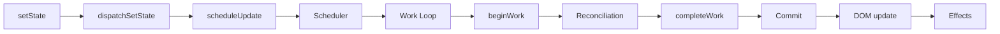

# Уровень 14: Итоги и архитектурная карта React

Это финальный уровень курса. Здесь мы не вводим новых концепций — мы собираем всё в единую
ментальную карту. Когда вы понимаете полный путь от `setState` до изменения в DOM, React
перестаёт быть магией и становится инструментом, которым вы управляете осознанно.

---

## Полная ментальная модель: от setState до DOM

Каждый раз, когда вы вызываете `setState`, запускается цепочка из шести фаз:

```
setState → scheduleUpdateOnFiber → Scheduler → Work Loop → Reconciliation → Commit
```

### Фаза 1: Постановка в очередь

`setState` вызывает `dispatchSetState`. Функция создаёт объект `Update` с новым значением
и добавляет его в **circular linked list** очереди хука. Затем вызывается
`scheduleUpdateOnFiber` — корень помечается как нуждающийся в обновлении.

### Фаза 2: Планировщик (Scheduler)

Scheduler — отдельный пакет React. Он не знает о Fiber и React, он работает только с
приоритетами и временными метками. Обновления получают **Lane** (числовой приоритет),
Scheduler откладывает низкоприоритетные задачи и запускает высокоприоритетные немедленно.

Механизм прерывания: `MessageChannel.postMessage` ставит задачу в **макрозадачу** (не
микрозадачу!), что позволяет браузеру обработать события между рендерами.

### Фаза 3: Work Loop

```
performConcurrentWorkOnRoot
  └─ renderRootConcurrent
       └─ workLoopConcurrent
            └─ performUnitOfWork (×N)
                 ├─ beginWork   → создаёт/обновляет дочерние Fiber-узлы
                 └─ completeWork → создаёт DOM-узлы, копит effectList
```

Work Loop обходит Fiber-дерево в глубину. На каждом узле:
- `beginWork` — рендерит компонент, запускает хуки, создаёт child-файберы
- Если `shouldYield()` возвращает `true` — работа прерывается, управление возвращается браузеру
- `completeWork` — создаёт реальные DOM-узлы, собирает `subtreeFlags`

### Фаза 4: Reconciliation (внутри beginWork)

Для каждого компонента React сравнивает **current** (текущее дерево) и **workInProgress**
(строящееся). Алгоритм O(n) с двумя допущениями:
1. Разные типы → пересоздать поддерево
2. Одинаковые типы + одинаковый `key` → обновить (переиспользовать Fiber)

При обновлении списков: фаза 1 (linear scan) → фаза 2 (Map по ключам для оставшихся).

### Фаза 5: Commit

Commit — **синхронная**, не прерываемая фаза. Три подфазы:

```
commitRoot
  ├─ Before mutation  (getSnapshotBeforeUpdate, useLayoutEffect cleanup)
  ├─ Mutation         (insertBefore/appendChild/removeChild — DOM изменяется)
  └─ Layout           (useLayoutEffect, componentDidMount/Update — DOM уже обновлён)
       └─ (после отрисовки браузера)
            └─ Passive  (useEffect cleanup → useEffect setup)
```

### Итоговая цепочка



---

## Когда какой инструмент: дерево решений

| Сценарий | Решение |
|---|---|
| Вычислить из props/state | `const x = compute(props)` — прямо в рендере |
| Кэшировать дорогое вычисление | `useMemo(() => expensive(), [deps])` |
| Стабилизировать функцию-callback | `useCallback(fn, [deps])` или вынести за компонент |
| Синхронизировать с внешним store | `useSyncExternalStore(subscribe, getSnapshot)` |
| Реагировать на действие пользователя | Event handler — без `useEffect` |
| Читать DOM перед отрисовкой | `useLayoutEffect` |
| Побочный эффект после рендера | `useEffect` |
| Предотвратить лишние ре-рендеры дочерних | `React.memo` + стабильные props |
| Предотвратить лишние ре-рендеры от контекста | Разделить контекст по частоте изменений |
| Управляемый переход без заморозки UI | `useTransition` / `startTransition` |

---

## "You Might Not Need an Effect" — итоговый чеклист

Прежде чем написать `useEffect`, пройдите этот список:

- [ ] **Вычисление из данных?** → `const value = compute(data)` прямо в рендере
- [ ] **Сброс state при смене props?** → `key` на компоненте, не `useEffect`
- [ ] **Корректировка state при смене props?** → вычисляй во время рендера (derived state)
- [ ] **Уведомить родителя об изменении state?** → передай handler в props, вызови при событии
- [ ] **Подписка на внешний store?** → `useSyncExternalStore`
- [ ] **Подписка на browser API (matchMedia, online)?** → `useSyncExternalStore`
- [ ] **Инициализировать что-то один раз?** → lazy initializer `useState(() => init())`
- [ ] **Логика после действия пользователя?** → в event handler, не в Effect

Если ни один пункт не сработал — тогда `useEffect`.

---

## Ключевые файлы исходников React

| Концепция | Файл |
|---|---|
| Fiber node, WorkTag | `packages/react-reconciler/src/ReactFiber.js` |
| Work Loop, beginWork, completeWork | `packages/react-reconciler/src/ReactFiberWorkLoop.js` |
| beginWork по типам компонентов | `packages/react-reconciler/src/ReactFiberBeginWork.js` |
| completeWork | `packages/react-reconciler/src/ReactFiberCompleteWork.js` |
| Hooks (mount/update) | `packages/react-reconciler/src/ReactFiberHooks.js` |
| Reconciliation children | `packages/react-reconciler/src/ReactChildFiber.js` |
| Commit фазы | `packages/react-reconciler/src/ReactFiberCommitWork.js` |
| Lane-система приоритетов | `packages/react-reconciler/src/ReactFiberLane.js` |
| Scheduler | `packages/scheduler/src/forks/Scheduler.js` |
| Suspense, thrown promise | `packages/react-reconciler/src/ReactFiberThrow.js` |

---

## Что дальше

- [React source code](https://github.com/facebook/react) — читать с `packages/react-reconciler/`
- [React RFCs](https://github.com/reactjs/rfcs) — как принимаются архитектурные решения
- [React Working Group](https://github.com/reactwg) — дискуссии о новых фичах
- [Overreacted](https://overreacted.io) — Dan Abramov о глубоком понимании React
