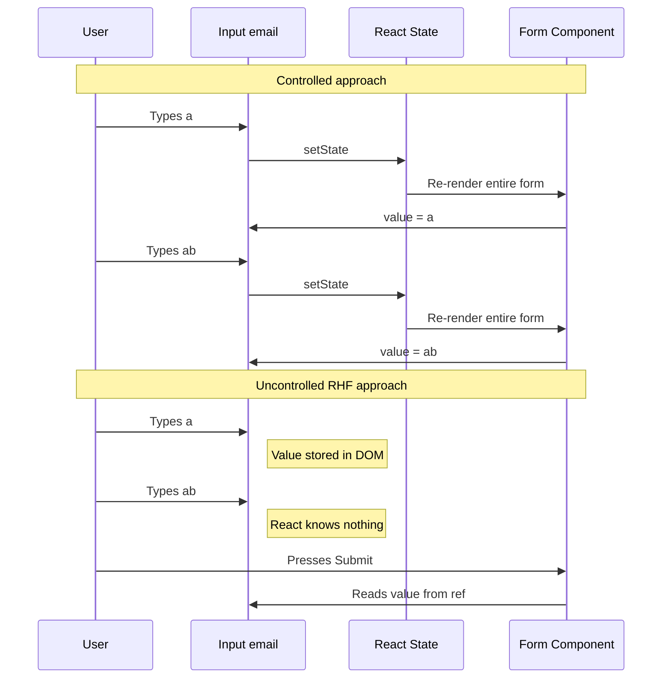
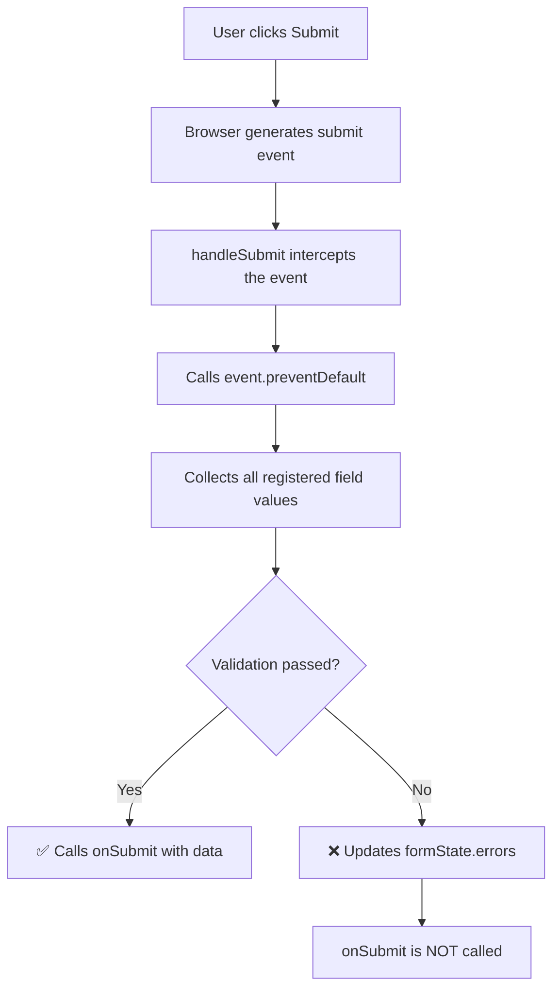
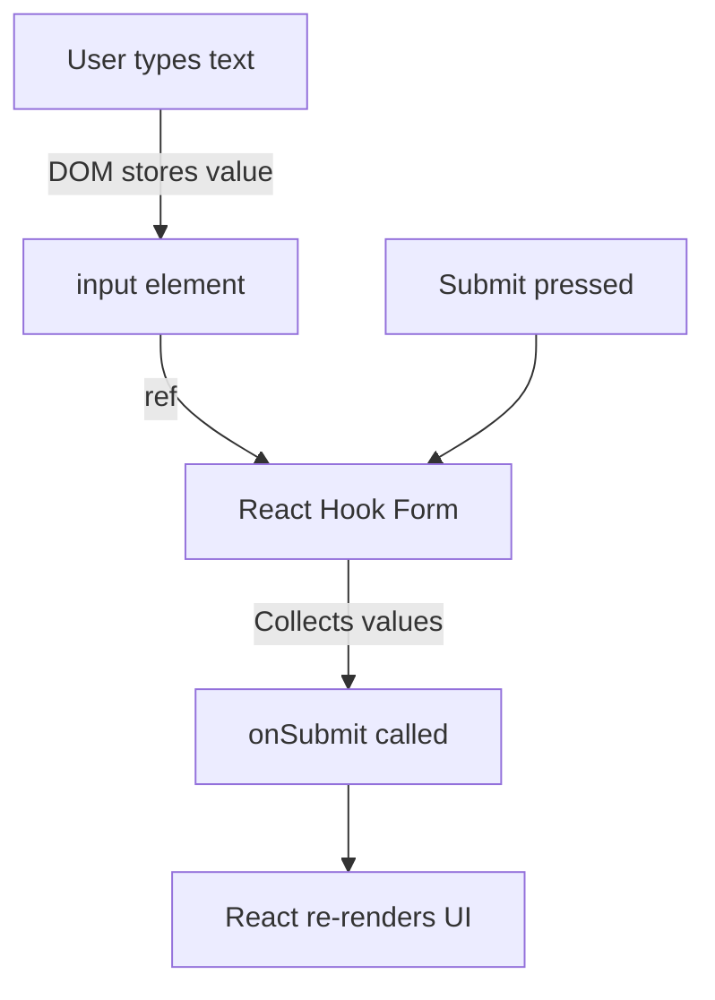

# Level 0: Setup — Configuration and First Form

## Why Do We Need a Form Library at All?

Forms are the most interactive part of any web application. Registration, login, checkout, profile settings, search filters -- all of these are forms. At first glance, managing them in React seems simple: create a `useState`, attach an `onChange` -- done.

But in a real project, a form quickly accumulates complexity:

- Validation is needed (required fields, email and phone formats, minimum password length)
- Errors need to be displayed -- and not all at once, but at the right moment (after blur? after submit?)
- Submission state needs management (disabled button, loader, server error handling)
- Nested fields, arrays, dynamic forms need to be handled
- And all of this must work **fast**, even if the form has 50 fields

When you start writing all this manually, the code turns into spaghetti with dozens of `useState` calls, hundreds of lines of handlers, and tangled validation logic. This is exactly the problem that form libraries solve.

---

## React Hook Form: What It Is and Why React Hook Form

**React Hook Form (RHF)** is a form management library for React, built around one idea: **forms should be fast by default**. Instead of storing every keystroke in React state and re-rendering components, RHF works directly with the DOM via refs. This makes it fundamentally faster than most alternatives.

### Comparison with Alternatives

To understand why the industry arrived at React Hook Form, it helps to look at the evolution of form approaches in React:

**Redux Form (2015)** -- the first popular library. Stores form state in Redux store. Every keystroke dispatches an action, updates the store, triggers re-renders of all subscribed components. On forms with 20+ fields this was noticeably slow. Size: ~23 KB.

**Formik (2017)** -- removed the Redux dependency but stayed in the controlled components paradigm. Every field change updates React state via `setState`. Better than Redux Form, but still noticeable lag on large forms. Size: ~16 KB.

**React Hook Form (2019)** -- a fundamentally different approach. Instead of storing values in React state, RHF uses **uncontrolled components** and refs. React doesn't know about intermediate field values, so it doesn't re-render components on every keystroke. Size: ~12 KB.

| Characteristic | Redux Form | Formik | React Hook Form |
| --- | --- | --- | --- |
| Bundle size | ~23 KB | ~16 KB | ~12 KB |
| Re-renders on input | Entire tree | Entire form | Only the changed field |
| API | Redux + HOC | Components/Hooks | Hooks |
| TypeScript | Weak support | Medium | Excellent out of the box |
| Schema validation | Via plugin | Yup out of the box | Zod, Yup, Joi, etc. |

**Key takeaway:** React Hook Form wins on performance not through clever optimizations, but through an architectural decision -- it simply doesn't cause unnecessary re-renders.

---

## Uncontrolled vs Controlled Components

This is the key concept. Without understanding it, React Hook Form will seem like magic. Let's break it down.

### Controlled Component

In the controlled approach, React **fully owns** the input value. You store the value in `useState` and update state on every change. React re-renders the component and passes the new value back to `<input>`:

```tsx
const [email, setEmail] = useState('')

<input
  value={email}
  onChange={(e) => setEmail(e.target.value)}
/>
```

What happens on every keystroke:

1. User presses a key
2. Browser generates `onChange` event
3. React calls `setEmail` with the new value
4. React re-renders the component (and all child components!)
5. `<input>` receives the new value via the `value` prop

Think of it as a **system with a middleman**: instead of text simply appearing in the input field (as in plain HTML), each letter takes a journey: field -> React -> state -> React -> field. If a form has 10 fields and they're all in one component, typing in one field re-renders all 10.

### Uncontrolled Component

In the uncontrolled approach, **the DOM itself stores** the value. React doesn't participate in the input process -- you just get the final value when you need it (e.g., on form submission):

```tsx
const inputRef = useRef<HTMLInputElement>(null)

// React doesn't know what the user is typing
<input ref={inputRef} />

// Get value directly from DOM when needed
const value = inputRef.current?.value
```

Analogy: it's like a **paper form**. You hand someone a pen and a form -- they write. You don't need to stand next to them and record every letter in your notebook. You just collect the filled form when it's ready.

### Why React Hook Form Chose the Uncontrolled Approach

Let's visualize the re-render difference with a three-field form:



In the controlled approach, typing a 10-letter word triggers 10 form re-renders. In the uncontrolled approach -- **zero** re-renders until submission. On a form with 30 fields where the user types an average of 15 characters per field, the difference is 450 re-renders vs 0.

**This is why React Hook Form is called a "performance-first" library.** This isn't marketing -- it's an architectural decision that delivers a tangible difference on real forms.

---

## The `useForm` Hook -- Entry Point

`useForm` is the main and often the only hook you'll need from React Hook Form. Think of it as a **control panel** for your form: you call it once, and it returns a set of tools for registering fields, handling submission, tracking errors, and managing values.

### How to Call

```tsx
import { useForm } from 'react-hook-form'

// First, describe the form data structure
interface LoginForm {
  email: string
  password: string
}

function MyForm() {
  // Call useForm with the form type
  const { register, handleSubmit, formState } = useForm<LoginForm>()
}
```

Notice the generic `<LoginForm>`. It tells TypeScript which fields exist in the form. Without it, you'll lose autocomplete and field name checking -- you could write `register('emal')` with a typo and the compiler won't complain.

### What useForm Returns

The hook returns an object with many properties and methods. At this level we only need two, but it's useful to know the full picture:

```tsx
const {
  register,     // Connects a field to the form (detailed below)
  handleSubmit,  // Wraps your submit function (detailed below)
  watch,         // Subscribes to value changes (covered in level 1)
  formState,     // Object with errors, status, etc. (covered in level 2)
  setValue,      // Programmatically sets a field value
  getValues,     // Gets current values without subscription
  reset,         // Resets form to initial values
  control,       // Object for controlled components (Controller)
} = useForm<LoginForm>()
```

**All useForm methods and when we'll study them:**

| Method | Purpose | Level |
|---|---|---|
| `register` | Connects a field to the form | 0 -- this level |
| `handleSubmit` | Handles form submission | 0 -- this level |
| `watch` | Subscribes to value changes | 1 |
| `formState` | Errors, validation status | 1 |
| `setValue` / `getValues` | Programmatic value control | 1 |
| `reset` | Form reset | 1 |
| `control` | UI library integration | 5+ |

### useForm Options

When calling `useForm`, you can pass a config object. At this stage, it's enough to know about `defaultValues` -- initial field values:

```tsx
const { register, handleSubmit } = useForm<LoginForm>({
  defaultValues: {
    email: '',
    password: '',
  },
})
```

`defaultValues` are useful when editing an existing record (e.g., user profile) -- you pass data from the server, and the form opens already filled.

---

## The `register` Function -- Connecting a Field to the Form

`register` is the function that **binds an HTML input element to the form system**. Without it, React Hook Form doesn't know the field exists and can't collect its value or validate it.

### What register Returns

When you call `register('email')`, it returns an object with four properties:

```tsx
const emailProps = register('email')
// emailProps contains:
// {
//   name: 'email',       -- field name (for HTML name attribute)
//   ref: [Function],     -- ref for DOM binding
//   onChange: [Function], -- change handler
//   onBlur: [Function],  -- blur handler
// }
```

Let's examine each property:

**`name`** -- the field's string name. React Hook Form uses it as a key for storing the value. This is exactly how the value ends up in the data object on submission.

**`ref`** -- the most important property. Through the ref, React Hook Form gets **direct access to the DOM element**. This allows the library to read the field value (`input.value`) directly from DOM, without React state involvement. This is the secret behind "zero re-renders."

**`onChange`** -- the handler RHF attaches to the change event. But unlike the controlled approach, it **doesn't call setState** and doesn't trigger a re-render. Instead, it updates RHF's internal store (a plain JavaScript object, invisible to React).

**`onBlur`** -- the blur event handler. Needed for validation in `onBlur` mode (when errors show after the user leaves the field).

### How register Connects to a Field

In practice, you almost never destructure these properties manually. Instead, the spread operator (`...`) spreads all four properties as props on `<input>`:

```tsx
// These two are fully equivalent:

// Option 1: spread (recommended)
<input {...register('email')} />

// Option 2: manual assignment (for understanding)
const { name, ref, onChange, onBlur } = register('email')
<input name={name} ref={ref} onChange={onChange} onBlur={onBlur} />
```

Analogy: `register` works like **checking in at a doctor's office**. When you arrive at the clinic, you provide your name (name), get an ID bracelet (ref), and from that point the clinic knows who you are, where to find you, and how to contact you (onChange, onBlur). Without registration, the clinic doesn't know you exist -- similarly, RHF doesn't know about a field if it isn't registered.

### register with Validation Options

As a second argument, `register` accepts an object with validation rules. This is a topic for later levels, but here's what it looks like:

```tsx
<input
  {...register('email', {
    required: 'Email is required',
    pattern: {
      value: /^[A-Z0-9._%+-]+@[A-Z0-9.-]+\.[A-Z]{2,}$/i,
      message: 'Invalid email format',
    },
  })}
/>
```

At this level we don't use validation -- we're focusing on basic field registration.

---

## The `handleSubmit` Function -- Handling Submission

`handleSubmit` is a **wrapper** for your submit function. It handles three tasks that you'd otherwise need to do manually:

1. **Prevents page reload** -- calls `event.preventDefault()` for you
2. **Collects data** -- iterates all registered fields and collects their values into one object
3. **Runs validation** -- if there are validation rules, checks all fields. If at least one field is invalid, your `onSubmit` function **will not be called**

### How It Works

`handleSubmit` is a higher-order function. This means it accepts a function and returns a new function:

```tsx
const onSubmit = (data: LoginForm) => {
  console.log(data) // { email: 'test@example.com', password: '123456' }
}

// handleSubmit(onSubmit) returns a NEW function
// that becomes the form's submit event handler
<form onSubmit={handleSubmit(onSubmit)}>
```

Here's what happens step by step when the user clicks "Submit":



### What It Would Look Like Without handleSubmit

Without React Hook Form, the same process would need to be written manually:

```tsx
// Without React Hook Form -- everything manual
const handleManualSubmit = (e: React.FormEvent<HTMLFormElement>) => {
  e.preventDefault()                          // 1. Prevent reload
  const formData = new FormData(e.currentTarget) // 2. Collect data
  const data = Object.fromEntries(formData)     // 3. Convert to object

  // 4. Manual validation
  const errors: Record<string, string> = {}
  if (!data.email) errors.email = 'Email is required'
  if (!data.password) errors.password = 'Password is required'

  if (Object.keys(errors).length > 0) {
    // Show errors... somehow...
    return
  }

  onSubmit(data) // 5. Finally call business logic
}
```

```tsx
// With React Hook Form -- one line
<form onSubmit={handleSubmit(onSubmit)}>
```

`handleSubmit` encapsulates all the boilerplate, letting you focus on what to **do** with the data, not how to **collect** it.

### handleSubmit with Error Handler

`handleSubmit` can accept a **second** function -- a validation error handler:

```tsx
const onSubmit = (data: LoginForm) => {
  // Called when all fields are valid
  console.log('Success:', data)
}

const onError = (errors: FieldErrors<LoginForm>) => {
  // Called when there are validation errors
  console.log('Validation failed:', errors)
}

<form onSubmit={handleSubmit(onSubmit, onError)}>
```

At this level we don't use validation, so the second argument isn't needed yet. But it's useful to know it exists.

---

## Step-by-Step Guide: First Form

Now let's put everything together. We'll build a simple login form step by step.

### Step 1: Define the Data Structure

Before writing UI, describe what data the form collects. This TypeScript interface will be used as a generic for `useForm`:

```typescript
interface LoginForm {
  email: string
  password: string
}
```

Why is this needed? This interface is a **contract** between the form and the rest of the code. TypeScript will check that you only register existing fields, and in `onSubmit` you'll get a properly typed object.

### Step 2: Initialize useForm

Call the hook with the form type and destructure the needed methods:

```tsx
const { register, handleSubmit } = useForm<LoginForm>()
```

At this point React Hook Form has created an internal store for your form. But it doesn't yet know what fields exist in the DOM -- that's what registration is for.

### Step 3: Create Markup with Field Registration

Each `<input>` connects to the form via the spread operator with `register`:

```tsx
<form onSubmit={handleSubmit(onSubmit)}>
  <div>
    <label htmlFor="email">Email</label>
    <input
      id="email"
      type="email"
      {...register('email')}
      placeholder="Enter email"
    />
  </div>

  <div>
    <label htmlFor="password">Password</label>
    <input
      id="password"
      type="password"
      {...register('password')}
      placeholder="Enter password"
    />
  </div>

  <button type="submit">Log in</button>
</form>
```

Notice: we do **not** create `useState` for each field, do **not** write `onChange` manually, do **not** manage values. All of this is handled by RHF through `register`.

### Step 4: Write the Submit Handler

```tsx
const onSubmit = (data: LoginForm) => {
  console.log('Form submitted:', data)
  // data = { email: 'user@example.com', password: '123456' }
}
```

The `onSubmit` function receives an already collected and typed object. You don't need to parse FormData, traverse the DOM, or cast types -- RHF did it for you.

### Full Code

```tsx
import { useState } from 'react'
import { useForm } from 'react-hook-form'

interface LoginForm {
  email: string
  password: string
}

export function FirstForm() {
  const { register, handleSubmit } = useForm<LoginForm>()
  const [submittedData, setSubmittedData] = useState<LoginForm | null>(null)

  const onSubmit = (data: LoginForm) => {
    console.log('Form submitted:', data)
    setSubmittedData(data)
  }

  return (
    <div>
      <h2>Login Form</h2>

      <form onSubmit={handleSubmit(onSubmit)}>
        <div>
          <label htmlFor="email">Email</label>
          <input
            id="email"
            type="email"
            {...register('email')}
            placeholder="Enter email"
          />
        </div>

        <div>
          <label htmlFor="password">Password</label>
          <input
            id="password"
            type="password"
            {...register('password')}
            placeholder="Enter password"
          />
        </div>

        <button type="submit">Log in</button>
      </form>

      {submittedData && (
        <div>
          <h3>Submitted data:</h3>
          <pre>{JSON.stringify(submittedData, null, 2)}</pre>
        </div>
      )}
    </div>
  )
}
```

Here's how data flows through the system from input to display:



Key point: React **does not re-render** during text input. Re-render happens only once -- when `setSubmittedData` updates state after submission.

---

## When React Hook Form Is Used in Production

React Hook Form is not a learning library. It's used in real projects worldwide. Here are typical scenarios:

- **Login and registration forms** -- where response speed and real-time validation matter
- **Multi-step forms (wizards)** -- checkout, questionnaires, surveys. RHF works well with splitting a form into steps
- **Admin panels** with dozens of fields -- where controlled component performance starts degrading
- **Forms with dynamic fields** -- when users can add/remove rows (e.g., order items list)
- **Integration with UI libraries** (MUI, Ant Design, Chakra UI) -- via the `Controller` component

---

## Common Beginner Mistakes

### Mistake 1: Putting handleSubmit on onClick instead of onSubmit

```tsx
// Wrong
<form>
  <input {...register('email')} />
  <button onClick={handleSubmit(onSubmit)}>Submit</button>
</form>
```

**Why this is a problem:** with this approach, the form doesn't submit when pressing Enter in an input field. In standard HTML, when a user presses Enter inside an `<input>`, the browser finds the nearest `<form>` and fires a `submit` event. If the handler is on the button, not the form, this mechanism doesn't work. It also breaks accessibility -- screen readers and keyboard navigation depend on `<form onSubmit>` semantics.

```tsx
// Correct
<form onSubmit={handleSubmit(onSubmit)}>
  <input {...register('email')} />
  <button type="submit">Submit</button>
</form>
```

### Mistake 2: Forgetting to pass the type to useForm

```tsx
// Wrong -- no generic
const { register } = useForm()

register('emial') // Typo! But TypeScript is silent
```

**Why this is a problem:** without the generic, TypeScript thinks the form can have any fields. You lose:
- Field name autocomplete in IDE
- Typo checking in field names
- Typed data in `onSubmit` (you'll get `Record<string, any>` instead of a specific interface)
- Safe refactoring -- when renaming a field, the compiler won't point to all places using the old name

```tsx
// Correct -- with generic
interface LoginForm {
  email: string
  password: string
}

const { register } = useForm<LoginForm>()

register('emial') // TypeScript error: 'emial' is not in LoginForm
```

### Mistake 3: Using value and onChange together with register

```tsx
// Wrong -- conflicting approaches
const [email, setEmail] = useState('')

<input
  value={email}
  onChange={(e) => setEmail(e.target.value)}
  {...register('email')}
/>
```

**Why this is a problem:** `register` returns its own `onChange` and `ref`. When you add your own `value` and `onChange`, a conflict occurs: `register` has already attached its `onChange`, but your `value` makes the component controlled, depriving RHF of its ability to work via `ref`. The result is a Frankenstein -- neither controlled nor uncontrolled. Data may not reach RHF on submission.

```tsx
// Correct -- only register, no useState
<input {...register('email')} />
```

If you need to programmatically read or change a value, use `watch` or `setValue` from the same `useForm`, not your own `useState`.

### Mistake 4: Calling register outside JSX and forgetting to pass ref

```tsx
// Wrong -- ref is lost
const emailProps = register('email')

<input name={emailProps.name} onChange={emailProps.onChange} />
// Forgot ref={emailProps.ref} -- RHF can't read value from DOM!
```

**Why this is a problem:** without `ref`, React Hook Form loses its connection to the DOM element. It won't be able to read the field value on form submission. The `onSubmit` function will receive `undefined` instead of the value.

```tsx
// Correct -- use spread, it passes everything
<input {...register('email')} />
```

---

## Additional Resources

- [React Hook Form Official Documentation](https://react-hook-form.com/) -- start with "Get Started"
- [useForm API Reference](https://react-hook-form.com/docs/useform) -- full description of the hook and all its options
- [register API Reference](https://react-hook-form.com/docs/useform/register) -- details on field registration and validation options
- [React: Uncontrolled Components](https://react.dev/learn/manipulating-the-dom-with-refs) -- React docs on refs and uncontrolled components

---

## What's Next?

In the next level you'll learn:

- Different field types (text, number, checkbox, select, textarea)
- The `watch` method -- how to subscribe to field value changes
- `setValue` and `getValues` -- how to programmatically control values
- The `formState` object -- how to know if the form was changed, submitted, etc.
