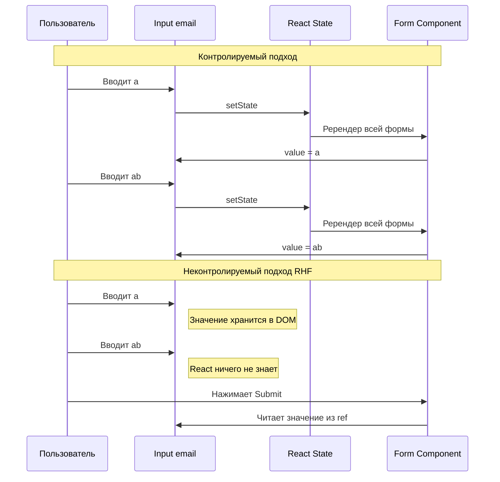
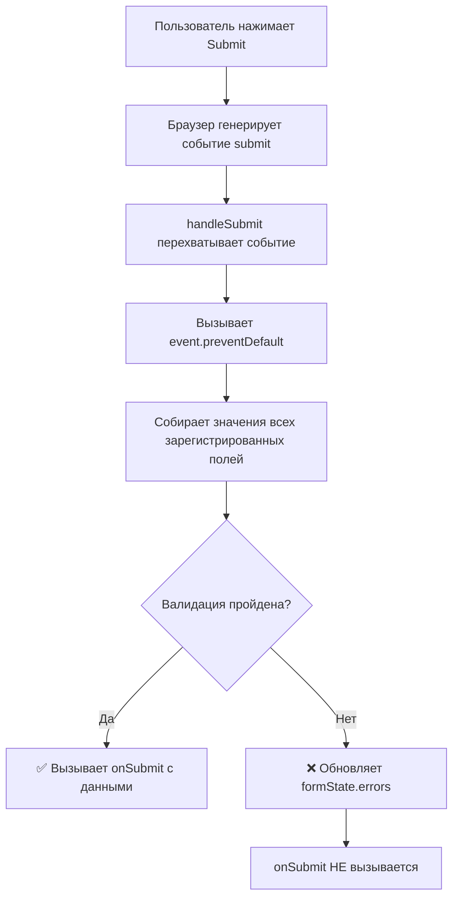
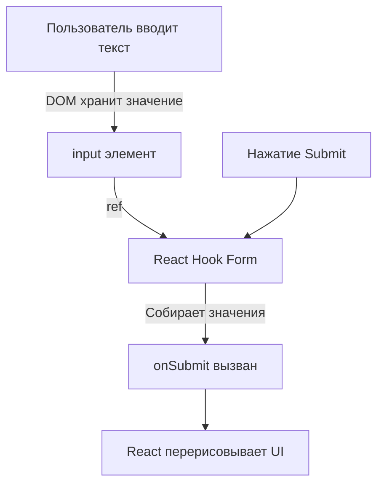

# Уровень 0: Setup — Настройка и первая форма

## Зачем вообще нужна библиотека для форм?

Формы -- это самая интерактивная часть любого веб-приложения. Регистрация, авторизация, оформление заказа, настройки профиля, фильтры поиска -- всё это формы. И на первый взгляд кажется, что управлять ими в React несложно: завёл `useState`, повесил `onChange` -- готово.

Но в реальном проекте форма быстро обрастает сложностью:

- Нужна валидация (обязательные поля, форматы email и телефона, минимальная длина пароля)
- Нужно показывать ошибки -- причём не все сразу, а в нужный момент (после blur? после submit?)
- Нужно управлять состоянием отправки (disabled-кнопка, лоадер, обработка ошибок сервера)
- Нужно работать с вложенными полями, массивами, динамическими формами
- И всё это должно работать **быстро**, даже если в форме 50 полей

Когда вы начинаете писать это вручную, код превращается в лапшу из десятков `useState`, сотен строк обработчиков и запутанную логику валидации. Именно эту проблему решают библиотеки для форм.

---

## React Hook Form: что это и почему именно он

**React Hook Form (RHF)** -- это библиотека для управления формами в React, построенная вокруг одной идеи: **формы должны быть быстрыми по умолчанию**. Вместо того чтобы хранить каждое нажатие клавиши в React-состоянии и перерисовывать компонент, RHF работает напрямую с DOM через рефы (`ref`). Это делает его принципиально быстрее большинства альтернатив.

### Сравнение с альтернативами

Чтобы понять, почему индустрия пришла к React Hook Form, полезно посмотреть на эволюцию подходов к формам в React:

**Redux Form (2015)** -- первая популярная библиотека. Хранит состояние формы в Redux-сторе. Каждое нажатие клавиши диспатчит экшен, обновляет стор, вызывает перерисовку всех подписанных компонентов. На формах с 20+ полями это было заметно медленно. Размер: ~23 KB.

**Formik (2017)** -- убрал зависимость от Redux, но остался в парадигме контролируемых компонентов. Каждое изменение поля обновляет React-состояние через `setState`. Лучше, чем Redux Form, но на больших формах всё равно заметны тормоза. Размер: ~16 KB.

**React Hook Form (2019)** -- принципиально другой подход. Вместо хранения значений в React-состоянии, RHF использует **неконтролируемые компоненты** и рефы. React не знает о промежуточных значениях полей, поэтому не перерисовывает компоненты при каждом нажатии. Размер: ~12 KB.

| Характеристика | Redux Form | Formik | React Hook Form |
| --- | --- | --- | --- |
| Размер бандла | ~23 KB | ~16 KB | ~12 KB |
| Ререндеры при вводе | Всё дерево | Форма целиком | Только нужное поле |
| API | Redux + HOC | Компоненты/Хуки | Хуки |
| TypeScript | Слабая поддержка | Средняя | Отличная из коробки |
| Валидация схемами | Через плагин | Yup из коробки | Zod, Yup, Joi и др. |

📌 **Главный вывод:** React Hook Form выигрывает по производительности не за счёт хитрых оптимизаций, а за счёт архитектурного решения -- он просто не вызывает лишние ререндеры.

---

## Неконтролируемые vs контролируемые компоненты

Это ключевая концепция, без понимания которой React Hook Form будет казаться магией. Разберём подробно.

### Контролируемый компонент (controlled)

В контролируемом подходе React **полностью владеет** значением поля ввода. Вы храните значение в `useState`, а при каждом изменении обновляете состояние. React перерисовывает компонент и передаёт новое значение обратно в `<input>`:

```tsx
const [email, setEmail] = useState('')

<input
  value={email}
  onChange={(e) => setEmail(e.target.value)}
/>
```

Что происходит при каждом нажатии клавиши:

1. Пользователь нажимает клавишу
2. Браузер генерирует событие `onChange`
3. React вызывает `setEmail` с новым значением
4. React перерисовывает компонент (и все дочерние компоненты!)
5. `<input>` получает новое значение через проп `value`

Представьте это как **систему с посредником**: вместо того чтобы текст просто появлялся в поле ввода (как в обычном HTML), каждая буква совершает путешествие: поле -> React -> состояние -> React -> поле. Если в форме 10 полей и каждое находится в одном компоненте, то при вводе в одно поле перерисовываются все 10.

### Неконтролируемый компонент (uncontrolled)

В неконтролируемом подходе **DOM сам хранит** значение. React не участвует в процессе ввода -- вы просто получаете финальное значение, когда оно понадобится (например, при отправке формы):

```tsx
const inputRef = useRef<HTMLInputElement>(null)

// React не знает, что пользователь вводит
<input ref={inputRef} />

// Значение получаем напрямую из DOM, когда нужно
const value = inputRef.current?.value
```

Аналогия: это как **бумажная анкета**. Вы даёте человеку ручку и бланк -- он пишет. Вам не нужно стоять рядом и записывать каждую букву в свой блокнот. Вы просто забираете заполненный бланк, когда он готов.

### Почему React Hook Form выбрал неконтролируемый подход

Визуализируем разницу в ререндерах на примере формы с тремя полями:



В контролируемом подходе ввод слова из 10 букв вызывает 10 ререндеров формы. В неконтролируемом -- **ноль** ререндеров до момента отправки. На форме с 30 полями, где пользователь заполняет каждое поле в среднем 15 символами, разница составляет 450 ререндеров против 0.

💡 **Именно поэтому React Hook Form называют "performance-first" библиотекой.** Это не маркетинг -- это архитектурное решение, которое даёт ощутимую разницу на реальных формах.

---

## Хук `useForm` -- точка входа

`useForm` -- это главный и часто единственный хук, который вам понадобится из React Hook Form. Его можно сравнить с **пультом управления** формой: вы вызываете его один раз, а он возвращает набор инструментов для регистрации полей, обработки отправки, отслеживания ошибок и управления значениями.

### Как вызвать

```tsx
import { useForm } from 'react-hook-form'

// Сначала опишите структуру данных формы
interface LoginForm {
  email: string
  password: string
}

function MyForm() {
  // Вызовите useForm с типом формы
  const { register, handleSubmit, formState } = useForm<LoginForm>()
}
```

Обратите внимание на дженерик `<LoginForm>`. Он говорит TypeScript, какие поля существуют в форме. Без него вы потеряете автодополнение и проверку имён полей -- сможете написать `register('emal')` с опечаткой, и компилятор промолчит.

### Что возвращает useForm

Хук возвращает объект с множеством свойств и методов. На этом уровне нам нужны только два из них, но полезно знать общую картину:

```tsx
const {
  register,     // Подключает поле к форме (подробнее ниже)
  handleSubmit,  // Оборачивает вашу функцию отправки (подробнее ниже)
  watch,         // Подписывается на изменения значений (будет в уровне 1)
  formState,     // Объект с ошибками, статусом и т.д. (будет в уровне 2)
  setValue,      // Программно устанавливает значение поля
  getValues,     // Получает текущие значения без подписки
  reset,         // Сбрасывает форму к начальным значениям
  control,       // Объект для работы с контролируемыми компонентами (Controller)
} = useForm<LoginForm>()
```

**Все методы useForm и когда их изучим:**

| Метод | Назначение | Уровень |
|---|---|---|
| `register` | Подключает поле к форме | 0 — этот уровень |
| `handleSubmit` | Обрабатывает отправку | 0 — этот уровень |
| `watch` | Подписка на изменения значений | 1 |
| `formState` | Ошибки, статус валидации | 1 |
| `setValue` / `getValues` | Программное управление значениями | 1 |
| `reset` | Сброс формы | 1 |
| `control` | Интеграция с UI-библиотеками | 5+ |

### Опции useForm

При вызове `useForm` можно передать объект настроек. На данном этапе достаточно знать про `defaultValues` -- начальные значения полей:

```tsx
const { register, handleSubmit } = useForm<LoginForm>({
  defaultValues: {
    email: '',
    password: '',
  },
})
```

`defaultValues` полезны, когда вы редактируете существующую запись (например, профиль пользователя) -- вы передаёте туда данные с сервера, и форма открывается уже заполненной.

---

## Функция `register` -- подключение поля к форме

`register` -- это функция, которая **связывает HTML-элемент ввода с системой формы**. Без неё React Hook Form не знает, что поле существует, и не сможет ни собрать его значение, ни провалидировать.

### Что register возвращает

Когда вы вызываете `register('email')`, функция возвращает объект из четырёх свойств:

```tsx
const emailProps = register('email')
// emailProps содержит:
// {
//   name: 'email',       -- имя поля (для HTML-атрибута name)
//   ref: [Function],     -- реф для привязки к DOM-элементу
//   onChange: [Function], -- обработчик изменений
//   onBlur: [Function],  -- обработчик потери фокуса
// }
```

Разберём каждое свойство:

**`name`** -- строковое имя поля. React Hook Form использует его как ключ для хранения значения. Именно по этому имени значение попадёт в объект данных при отправке.

**`ref`** -- это самое важное свойство. Через реф React Hook Form получает **прямой доступ к DOM-элементу**. Благодаря этому библиотека может читать значение поля (`input.value`) напрямую из DOM, без участия React-состояния. Это и есть секрет "нулевых ререндеров".

**`onChange`** -- обработчик, который RHF вешает на событие изменения. Но в отличие от контролируемого подхода, он **не вызывает setState** и не провоцирует ререндер. Вместо этого он обновляет внутреннее хранилище RHF (обычный JavaScript-объект, невидимый для React).

**`onBlur`** -- обработчик потери фокуса. Нужен для валидации в режиме `onBlur` (когда ошибки показываются после того, как пользователь покинул поле).

### Как register подключается к полю

На практике вы почти никогда не разбираете эти свойства вручную. Вместо этого используется оператор spread (`...`), который раскладывает все четыре свойства как пропсы на `<input>`:

```tsx
// Эти две записи полностью эквивалентны:

// Вариант 1: spread (рекомендуемый)
<input {...register('email')} />

// Вариант 2: ручное присвоение (для понимания)
const { name, ref, onChange, onBlur } = register('email')
<input name={name} ref={ref} onChange={onChange} onBlur={onBlur} />
```

Аналогия: `register` работает как **регистрация на приёме у врача**. Когда вы приходите в клинику, вы сообщаете своё имя (name), вам дают браслет-идентификатор (ref), и с этого момента клиника знает, кто вы, где вас найти и как с вами связаться (onChange, onBlur). Без регистрации клиника не знает о вашем существовании -- точно так же RHF не знает о поле, если оно не зарегистрировано.

### register с опциями валидации

Вторым аргументом `register` принимает объект с правилами валидации. Это тема следующих уровней, но вот как это выглядит:

```tsx
<input
  {...register('email', {
    required: 'Email is required',
    pattern: {
      value: /^[A-Z0-9._%+-]+@[A-Z0-9.-]+\.[A-Z]{2,}$/i,
      message: 'Invalid email format',
    },
  })}
/>
```

На этом уровне мы не используем валидацию -- сфокусируемся на базовой регистрации полей.

---

## Функция `handleSubmit` -- обработка отправки

`handleSubmit` -- это **обёртка** для вашей функции отправки. Она берёт на себя три задачи, которые без неё пришлось бы делать вручную:

1. **Предотвращает перезагрузку страницы** -- вызывает `event.preventDefault()` за вас
2. **Собирает данные** -- обходит все зарегистрированные поля и собирает их значения в один объект
3. **Запускает валидацию** -- если есть правила валидации, проверяет все поля. Если хотя бы одно поле невалидно, ваша функция `onSubmit` **не будет вызвана**

### Как это работает

`handleSubmit` -- это функция высшего порядка (higher-order function). Это значит, что она принимает функцию и возвращает новую функцию:

```tsx
const onSubmit = (data: LoginForm) => {
  console.log(data) // { email: 'test@example.com', password: '123456' }
}

// handleSubmit(onSubmit) возвращает НОВУЮ функцию,
// которая станет обработчиком события submit формы
<form onSubmit={handleSubmit(onSubmit)}>
```

Вот что происходит шаг за шагом, когда пользователь нажимает кнопку "Отправить":



### Что было бы без handleSubmit

Без React Hook Form тот же процесс пришлось бы писать руками:

```tsx
// ❌ Без React Hook Form -- всё вручную
const handleManualSubmit = (e: React.FormEvent<HTMLFormElement>) => {
  e.preventDefault()                          // 1. Предотвратить перезагрузку
  const formData = new FormData(e.currentTarget) // 2. Собрать данные
  const data = Object.fromEntries(formData)     // 3. Преобразовать в объект

  // 4. Валидация вручную
  const errors: Record<string, string> = {}
  if (!data.email) errors.email = 'Email is required'
  if (!data.password) errors.password = 'Password is required'

  if (Object.keys(errors).length > 0) {
    // Показать ошибки... как-то...
    return
  }

  onSubmit(data) // 5. Наконец-то вызвать бизнес-логику
}
```

```tsx
// ✅ С React Hook Form -- одна строка
<form onSubmit={handleSubmit(onSubmit)}>
```

`handleSubmit` инкапсулирует всю рутину, позволяя вам сосредоточиться на том, что **делать** с данными, а не на том, как их **собрать**.

### handleSubmit с обработкой ошибок

`handleSubmit` может принимать **вторую** функцию -- обработчик ошибок валидации:

```tsx
const onSubmit = (data: LoginForm) => {
  // Вызывается, если все поля валидны
  console.log('Success:', data)
}

const onError = (errors: FieldErrors<LoginForm>) => {
  // Вызывается, если есть ошибки валидации
  console.log('Validation failed:', errors)
}

<form onSubmit={handleSubmit(onSubmit, onError)}>
```

На этом уровне мы не используем валидацию, поэтому второй аргумент нам пока не нужен. Но полезно знать, что он существует.

---

## Пошаговое руководство: Первая форма

Теперь соберём всё вместе. Построим простую форму авторизации шаг за шагом.

### Шаг 1: Определите структуру данных

Прежде чем писать UI, опишите, какие данные собирает форма. Это TypeScript-интерфейс, который будет использоваться как дженерик для `useForm`:

```typescript
interface LoginForm {
  email: string
  password: string
}
```

Зачем это нужно? Этот интерфейс -- **контракт** между формой и остальным кодом. TypeScript будет проверять, что вы регистрируете только существующие поля, а в `onSubmit` получите правильно типизированный объект.

### Шаг 2: Инициализируйте useForm

Вызовите хук с типом формы и деструктурируйте нужные методы:

```tsx
const { register, handleSubmit } = useForm<LoginForm>()
```

На этом этапе React Hook Form создал внутреннее хранилище для вашей формы. Но он ещё не знает, какие поля существуют в DOM, -- для этого нужна регистрация.

### Шаг 3: Создайте разметку с регистрацией полей

Каждый `<input>` подключается к форме через spread-оператор с `register`:

```tsx
<form onSubmit={handleSubmit(onSubmit)}>
  <div>
    <label htmlFor="email">Email</label>
    <input
      id="email"
      type="email"
      {...register('email')}
      placeholder="Enter email"
    />
  </div>

  <div>
    <label htmlFor="password">Password</label>
    <input
      id="password"
      type="password"
      {...register('password')}
      placeholder="Enter password"
    />
  </div>

  <button type="submit">Log in</button>
</form>
```

Обратите внимание: мы **не** создаём `useState` для каждого поля, **не** пишем `onChange` вручную, **не** управляем значениями. Всё это делает RHF через `register`.

### Шаг 4: Напишите обработчик отправки

```tsx
const onSubmit = (data: LoginForm) => {
  console.log('Form submitted:', data)
  // data = { email: 'user@example.com', password: '123456' }
}
```

Функция `onSubmit` получает уже собранный и типизированный объект. Вам не нужно парсить FormData, обходить DOM или приводить типы -- RHF сделал это за вас.

### Полный код

```tsx
import { useState } from 'react'
import { useForm } from 'react-hook-form'

interface LoginForm {
  email: string
  password: string
}

export function FirstForm() {
  const { register, handleSubmit } = useForm<LoginForm>()
  const [submittedData, setSubmittedData] = useState<LoginForm | null>(null)

  const onSubmit = (data: LoginForm) => {
    console.log('Form submitted:', data)
    setSubmittedData(data)
  }

  return (
    <div>
      <h2>Login Form</h2>

      <form onSubmit={handleSubmit(onSubmit)}>
        <div>
          <label htmlFor="email">Email</label>
          <input
            id="email"
            type="email"
            {...register('email')}
            placeholder="Enter email"
          />
        </div>

        <div>
          <label htmlFor="password">Password</label>
          <input
            id="password"
            type="password"
            {...register('password')}
            placeholder="Enter password"
          />
        </div>

        <button type="submit">Log in</button>
      </form>

      {submittedData && (
        <div>
          <h3>Submitted data:</h3>
          <pre>{JSON.stringify(submittedData, null, 2)}</pre>
        </div>
      )}
    </div>
  )
}
```

Вот как данные проходят через систему от ввода до отображения:



Ключевой момент: React **не перерисовывается** во время ввода текста. Перерисовка происходит только один раз -- когда `setSubmittedData` обновляет состояние после отправки.

---

## Когда React Hook Form используется в продакшене

React Hook Form -- не учебная библиотека. Она используется в реальных проектах по всему миру. Вот типичные сценарии:

- **Формы авторизации и регистрации** -- где важна скорость отклика и валидация в реальном времени
- **Многошаговые формы (wizards)** -- оформление заказа, анкеты, опросы. RHF хорошо работает с разделением формы на шаги
- **Админ-панели** с десятками полей -- там, где производительность контролируемых компонентов начинает деградировать
- **Формы с динамическими полями** -- когда пользователь может добавлять/удалять строки (например, список товаров в заказе)
- **Интеграция с UI-библиотеками** (MUI, Ant Design, Chakra UI) -- через компонент `Controller`

---

## ⚠️ Частые ошибки новичков

### ❌ Ошибка 1: Вешают handleSubmit на onClick кнопки вместо onSubmit формы

```tsx
// ❌ Неправильно
<form>
  <input {...register('email')} />
  <button onClick={handleSubmit(onSubmit)}>Submit</button>
</form>
```

**Почему это проблема:** при таком подходе форма не отправляется при нажатии Enter в поле ввода. В стандартном HTML, когда пользователь нажимает Enter внутри `<input>`, браузер ищет ближайший `<form>` и генерирует событие `submit`. Если обработчик висит на кнопке, а не на форме, этот механизм не работает. Кроме того, нарушается доступность (accessibility) -- скринридеры и навигация клавиатурой зависят от семантики `<form onSubmit>`.

```tsx
// ✅ Правильно
<form onSubmit={handleSubmit(onSubmit)}>
  <input {...register('email')} />
  <button type="submit">Submit</button>
</form>
```

### ❌ Ошибка 2: Забывают передать тип в useForm

```tsx
// ❌ Неправильно -- нет дженерика
const { register } = useForm()

register('emial') // Опечатка! Но TypeScript молчит
```

**Почему это проблема:** без дженерика TypeScript считает, что форма может содержать любые поля. Вы теряете:
- Автодополнение имён полей в IDE
- Проверку опечаток в именах полей
- Типизацию данных в `onSubmit` (получите `Record<string, any>` вместо конкретного интерфейса)
- Безопасный рефакторинг -- при переименовании поля компилятор не укажет на все места, где использовалось старое имя

```tsx
// ✅ Правильно -- с дженериком
interface LoginForm {
  email: string
  password: string
}

const { register } = useForm<LoginForm>()

register('emial') // TypeScript error: 'emial' is not in LoginForm
```

### ❌ Ошибка 3: Пытаются использовать value и onChange вместе с register

```tsx
// ❌ Неправильно -- конфликт подходов
const [email, setEmail] = useState('')

<input
  value={email}
  onChange={(e) => setEmail(e.target.value)}
  {...register('email')}
/>
```

**Почему это проблема:** `register` возвращает собственные `onChange` и `ref`. Когда вы добавляете свой `value` и `onChange`, происходит конфликт: `register` уже прикрепил свой `onChange`, но ваш `value` делает компонент контролируемым, лишая RHF возможности работать через `ref`. В итоге получается Франкенштейн -- ни контролируемый, ни неконтролируемый компонент. Данные могут не попадать в RHF при отправке.

```tsx
// ✅ Правильно -- только register, без useState
<input {...register('email')} />
```

Если вам нужно программно прочитать или изменить значение, используйте `watch` или `setValue` из того же `useForm`, а не собственный `useState`.

### ❌ Ошибка 4: Вызывают register вне JSX и забывают передать ref

```tsx
// ❌ Неправильно -- ref потерян
const emailProps = register('email')

<input name={emailProps.name} onChange={emailProps.onChange} />
// Забыли ref={emailProps.ref} -- RHF не может читать значение из DOM!
```

**Почему это проблема:** без `ref` React Hook Form теряет связь с DOM-элементом. Он не сможет прочитать значение поля при отправке формы. Функция `onSubmit` получит `undefined` вместо значения.

```tsx
// ✅ Правильно -- используйте spread, он передаст всё
<input {...register('email')} />
```

---

## 📚 Дополнительные ресурсы

- [Официальная документация React Hook Form](https://react-hook-form.com/) -- начните с раздела "Get Started"
- [useForm API Reference](https://react-hook-form.com/docs/useform) -- полное описание хука и всех его опций
- [register API Reference](https://react-hook-form.com/docs/useform/register) -- детали по регистрации полей и опциям валидации
- [React: Uncontrolled Components](https://react.dev/learn/manipulating-the-dom-with-refs) -- документация React по рефам и неконтролируемым компонентам

---

## Что дальше?

В следующем уровне вы изучите:

- Различные типы полей (text, number, checkbox, select, textarea)
- Метод `watch` -- как подписаться на изменения значений полей
- Методы `setValue` и `getValues` -- как программно управлять значениями
- Объект `formState` -- как узнать, была ли форма изменена, отправлена и т.д.
