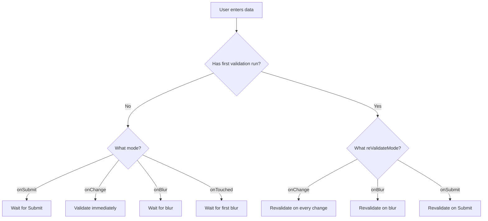
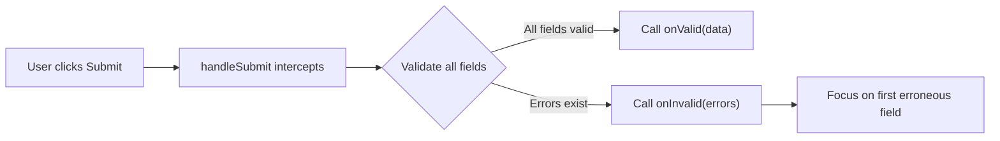
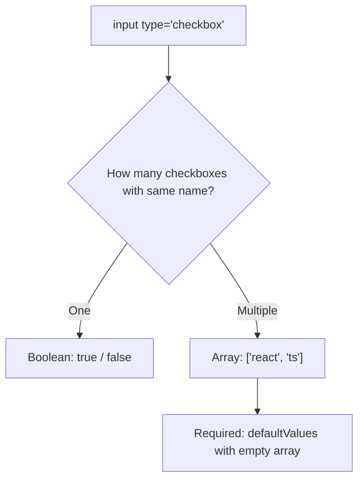
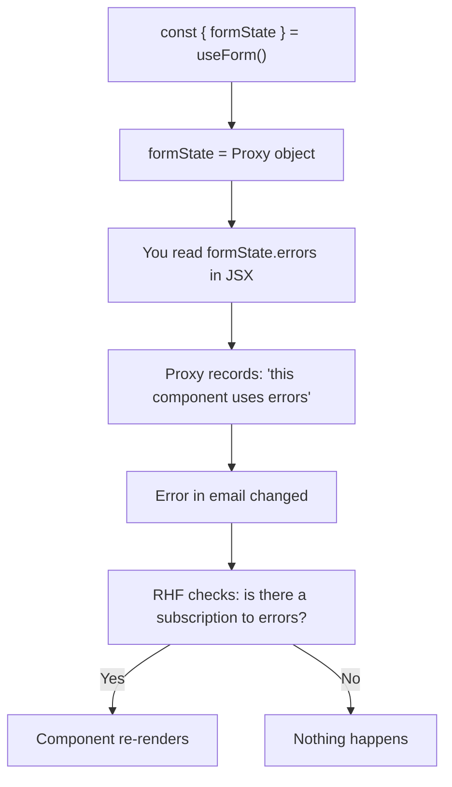
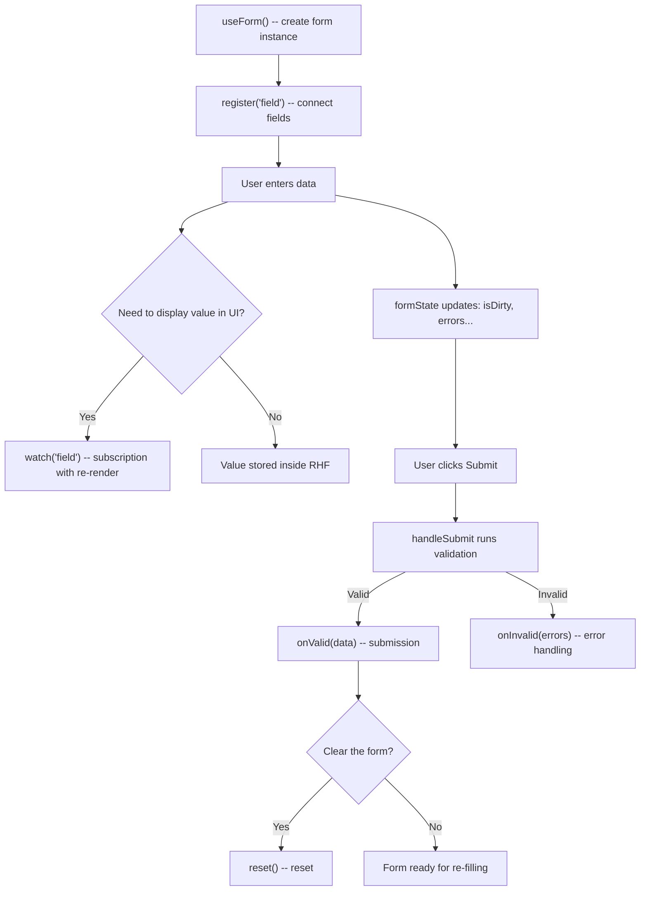

# Level 1: Basics -- useForm, register, handleSubmit, formState

## Introduction

Imagine you're building a house. You could mix concrete by hand, carry bricks one by one, and check every row with a level. Or you could use a cement mixer, a crane, and a laser level. Same result, but the second path is faster, more reliable, and more pleasant.

React Hook Form is exactly that toolkit for working with forms in React. Instead of manually creating `useState` for each field, writing `onChange` handlers, collecting data on submission, and managing errors -- you get all of this out of the box through a single `useForm` hook.

At this level, we'll explore in detail the **eight key tools** that form the foundation of any form:

1. **`useForm`** -- the entry point where everything starts
2. **`register`** -- connecting fields to the form
3. **`handleSubmit`** -- handling submission
4. **Field types** -- how RHF works with input, select, textarea, checkbox, radio
5. **`formState`** -- form state through Proxy (this is interesting!)
6. **`watch`** -- reactive value tracking
7. **`setValue` / `getValues`** -- programmatic control
8. **`reset`** -- form reset

---

## 1. The `useForm` Hook -- Entry Point

### What and Why

`useForm` is the main React Hook Form hook. It creates a **form instance** -- an object that stores all field values, validation errors, submission status, and much more. Everything you do with a form starts with a `useForm` call.

Analogy: `useForm` is like creating a new document in a text editor. Until you create a document, you have nowhere to type. Similarly, until you call `useForm`, you have no form to work with.

### How to Call

```tsx
import { useForm } from 'react-hook-form'

// 1. Define form data types
interface FormData {
  firstName: string
  lastName: string
  email: string
  age: number
}

function MyForm() {
  // 2. Create form instance
  const { register, handleSubmit, watch, formState, setValue, getValues, reset } =
    useForm<FormData>()

  return <form>...</form>
}
```

Notice the generic `useForm<FormData>()`. It tells TypeScript which fields exist in the form and their types. Thanks to this, you'll get autocomplete for field names and type checking when working with `register`, `watch`, `setValue`, and other methods.

### `useForm` Parameters

The hook accepts a config object. No parameter is required -- they all have sensible defaults.

```tsx
const form = useForm<FormData>({
  mode: 'onSubmit',           // When to run validation
  reValidateMode: 'onChange', // When to revalidate after first error
  defaultValues: {            // Initial field values
    firstName: '',
    lastName: '',
    email: '',
    age: 18,
  },
  shouldFocusError: true,     // Focus on first erroneous field
  criteriaMode: 'firstError', // How many errors to collect: one or all
})
```

Let's look at the most important parameters.

### `defaultValues` -- Initial Values

This is an object where you specify what values fields will have on first render. Without `defaultValues`, all fields start as `undefined`, which can lead to React warnings about switching between controlled and uncontrolled input.

```tsx
useForm<FormData>({
  defaultValues: {
    firstName: '',
    lastName: '',
    email: '',
    age: 18,
  },
})
```

`defaultValues` also defines what the form resets to when calling `reset()`. Additionally, this is the only way to set initial values for fields tracked via `watch` -- without it, `watch('firstName')` returns `undefined` until the first input.

**Tip:** `defaultValues` can be passed as an async function. This is convenient for edit forms where data comes from the server:

```tsx
useForm<FormData>({
  defaultValues: async () => {
    const response = await fetch('/api/user/profile')
    return response.json()
  },
})
```

### `mode` -- Validation Strategy

The `mode` parameter defines the **moment** when React Hook Form first runs validation for a field. This is a key decision that directly impacts user experience.

| mode          | When it triggers                                  | Suitable for                        |
| ------------- | ------------------------------------------------- | ----------------------------------- |
| `'onSubmit'`  | Only on "Submit" button click                     | Simple forms where errors aren't critical |
| `'onChange'`  | On every keystroke                                | Fields with indicators (password strength) |
| `'onBlur'`    | When user leaves the field                        | Most production forms              |
| `'onTouched'` | After first blur, then on every change            | Best UX and performance balance    |
| `'all'`       | On every change **and** on blur                   | Critical forms (payments, medicine) |

Default value -- `'onSubmit'`. This means errors won't appear until the first "Submit" button click, even if the user filled a field incorrectly.

**Important:** `mode` only affects the **first** check. After an error is found, re-validation (whether the error disappears after fixing) is controlled by `reValidateMode`, which defaults to `'onChange'`. This means the error disappears instantly as soon as the user corrects the field.

Here's how it looks on a diagram:



### What `useForm` Returns

The hook returns an object with methods and properties for form management. Here's the full list:

| Method / Property  | Purpose                                               |
| ------------------- | ----------------------------------------------------- |
| `register`          | Connects an HTML element to the form                  |
| `handleSubmit`      | Wraps your submit function, adding validation         |
| `watch`             | Subscribes to field changes (triggers re-render)      |
| `formState`         | State object: errors, isDirty, isValid, etc.          |
| `setValue`          | Programmatically sets a field value                   |
| `getValues`         | Reads current values without subscription             |
| `reset`             | Resets form to initial values                         |
| `trigger`           | Manually triggers validation                          |
| `setError`          | Programmatically sets an error for a field            |
| `clearErrors`       | Clears errors                                         |
| `setFocus`          | Focuses a specific field                              |
| `control`           | Object for Controller and useController integration   |
| `unregister`        | Disconnects a field from the form                     |
| `resetField`        | Resets a specific field                               |
| `getFieldState`     | Returns state of a specific field                     |

In this level we'll explore `register`, `handleSubmit`, `watch`, `formState`, `setValue`, `getValues`, and `reset`.

---

## 2. `register` -- Connecting Fields to the Form

### The Problem register Solves

In regular React, managing a form requires creating state for each field, an `onChange` handler, and binding `value`:

```tsx
// Without React Hook Form -- manual wiring for each field
const [firstName, setFirstName] = useState('')
const [lastName, setLastName] = useState('')
const [email, setEmail] = useState('')

<input value={firstName} onChange={e => setFirstName(e.target.value)} />
<input value={lastName} onChange={e => setLastName(e.target.value)} />
<input value={email} onChange={e => setEmail(e.target.value)} />
```

Three fields -- already 6 lines just for state. What if there are 20 fields? What if you also need validation?

The `register` function solves this. It returns a set of props (`ref`, `onChange`, `onBlur`, `name`) that you "spread" onto the HTML element. Through `ref`, the library gets direct access to the DOM element, and through `onChange` and `onBlur` it tracks changes.

```tsx
// With React Hook Form -- one call per field
<input {...register('firstName')} />
<input {...register('lastName')} />
<input {...register('email')} />
```

### How It Works Internally

When you write `{...register('firstName')}`, the call `register('firstName')` returns an object like this:

```tsx
{
  name: 'firstName',
  ref: (element) => { /* save DOM reference */ },
  onChange: (event) => { /* update internal form state */ },
  onBlur: (event) => { /* mark field as touched, maybe validate */ },
}
```

The `{...}` (spread) operator passes these props to `<input>`. As a result:

1. **`ref`** -- RHF saves a reference to the DOM element (for focus on error, for reading value)
2. **`onChange`** -- on every change, the value is recorded to the form's internal store
3. **`onBlur`** -- the field is marked as "touched", validation may run
4. **`name`** -- the field name for the HTML form

**Key point:** React Hook Form works through **uncontrolled components**. Values are stored in the DOM, not in React state. This means that when typing, the component **does not re-render** -- which gives a huge performance benefit for large forms.

### Registration with Validation Options

The second argument to `register` is an object with validation rules and settings:

```tsx
<input
  {...register('age', {
    required: 'Age is required',
    min: { value: 18, message: 'Minimum 18 years' },
    max: { value: 100, message: 'Maximum 100 years' },
    valueAsNumber: true,
  })}
/>
```

Here's the full list of available options:

| Option           | Type                            | What it does                                        |
| ---------------- | ------------------------------- | --------------------------------------------------- |
| `required`       | `boolean \| string`             | Field is required. String = error text              |
| `min`            | `number \| { value, message }`  | Minimum value (for numbers)                         |
| `max`            | `number \| { value, message }`  | Maximum value                                       |
| `minLength`      | `number \| { value, message }`  | Minimum string length                               |
| `maxLength`      | `number \| { value, message }`  | Maximum string length                               |
| `pattern`        | `RegExp \| { value, message }`  | Regular expression for validation                   |
| `validate`       | `function \| object`            | Custom validation function                          |
| `valueAsNumber`  | `boolean`                       | Convert value to number                             |
| `valueAsDate`    | `boolean`                       | Convert value to Date                               |
| `setValueAs`     | `(value) => any`                | Custom value transformation                         |
| `onChange`       | `(event) => void`               | Additional change handler                           |
| `onBlur`         | `(event) => void`               | Additional blur handler                             |
| `disabled`       | `boolean`                       | Disable the field                                   |
| `deps`           | `string \| string[]`            | Dependent fields (revalidate on their change)       |

### `setValueAs` -- Value Transformation

`setValueAs` is a conveyor function that transforms the field value **before** it enters the internal form store and **before** validation. Think of it as a water filter on a pipe: water (value) passes through the filter (setValueAs) before reaching the tank (form store).

```tsx
<input
  {...register('email', {
    setValueAs: value => value.trim().toLowerCase(),
  })}
/>
```

In this example, if the user types `"  John@MAIL.COM  "`, the form receives `"john@mail.com"`.

Typical uses of `setValueAs`:

```tsx
// Remove whitespace from edges
setValueAs: value => value.trim()

// Convert to number (alternative to valueAsNumber)
setValueAs: value => Number(value)

// Parse date string into Date object
setValueAs: value => new Date(value)

// Strip non-digit characters from phone number
setValueAs: value => value.replace(/\D/g, '')
```

**Important:** `setValueAs` is ignored if `valueAsNumber` or `valueAsDate` is specified. These three options are mutually exclusive.

### `onChange` and `onBlur` Handlers in register

You can add your own event handlers through `register` options. They will be called **in addition to** RHF's internal handlers, not instead of them:

```tsx
<input
  {...register('email', {
    onChange: e => {
      // Called after RHF processes the change
      console.log('Value changed to:', e.target.value)
      analytics.track('field_interaction', { field: 'email' })
    },
    onBlur: e => {
      // Called when user leaves the field
      console.log('User left the field, value:', e.target.value)
    },
  })}
/>
```

This is useful for side effects: sending analytics, logging, updating related data outside the form. For displaying values in the UI, use `watch` (covered next).

---

## 3. `handleSubmit` -- Handling Form Submission

### What It Is and How It Works

`handleSubmit` is a wrapper function. It accepts your submission handler and returns a new function that you pass to the form's `onSubmit`. Between the "Submit" button click and your handler call, `handleSubmit` performs validation of all fields.

Here's the flow:



### Basic Usage

```tsx
const { handleSubmit } = useForm<FormData>()

const onSubmit = (data: FormData) => {
  // data -- already validated, typed data
  console.log('Valid data:', data)
}

<form onSubmit={handleSubmit(onSubmit)}>
```

Notice: in `onSubmit` you receive **not** an `event`, but an object with form data. React Hook Form has already called `event.preventDefault()` for you and collected all values into a typed object.

### Two Callbacks: `onValid` and `onInvalid`

`handleSubmit` actually accepts **two** arguments:

1. **`onValid`** (required) -- called when the form passes validation
2. **`onInvalid`** (optional) -- called when there are validation errors

```tsx
import { FieldErrors } from 'react-hook-form'

const onValid = (data: FormData) => {
  api.submitForm(data)
}

const onInvalid = (errors: FieldErrors<FormData>) => {
  console.log('Failed fields:', Object.keys(errors))
}

<form onSubmit={handleSubmit(onValid, onInvalid)}>
```

Why is `onInvalid` useful? In real projects it's used for:

- **Analytics** -- which fields are most frequently filled incorrectly
- **Toast notifications** -- "Please fix errors in the form"
- **Scrolling** -- if the form is long, scroll to the first error
- **Monitoring** -- send error data to Sentry or another service

```tsx
handleSubmit(
  data => {
    api.submitForm(data)
  },
  errors => {
    analytics.track('form_validation_failed', {
      fields: Object.keys(errors),
      count: Object.keys(errors).length,
    })
    toast.error('Please fix the errors before submitting')
  }
)
```

### Async Submission

In real applications, form submission is almost always async -- you send data to the server and wait for a response. `handleSubmit` correctly handles `async` functions. While the promise is pending, `isSubmitting` in `formState` will be `true`:

```tsx
const onSubmit = async (data: FormData) => {
  // isSubmitting === true from this moment
  await api.sendData(data)
  // isSubmitting === false after resolve or reject
}

<form onSubmit={handleSubmit(onSubmit)}>
  <button disabled={isSubmitting}>
    {isSubmitting ? 'Sending...' : 'Submit'}
  </button>
</form>
```

This eliminates the need to manually create `useState` for a loading flag. RHF does it automatically.

---

## 4. Different Field Types

React Hook Form works with native HTML form elements. Key principle: RHF **does not create its own components** for inputs. Instead, it connects to standard `<input>`, `<select>`, `<textarea>` through `register`. This means everything you know about HTML forms still applies.

### Text Fields

The simplest case. All text input types work the same way -- `register` binds to the element, value is stored as a string:

```tsx
<input {...register('firstName')} />                    // type="text" by default
<input type="email" {...register('email')} />           // email with browser validation
<input type="password" {...register('password')} />     // password (hidden input)
<input type="url" {...register('website')} />           // URL
<input type="tel" {...register('phone')} />             // phone number
```

Note: the `type` attribute affects **browser** validation and mobile keyboard, but for RHF they're all just strings. If you need format validation, use `pattern` in register options.

### Number Fields

Numbers have a nuance: HTML `<input type="number">` still returns a **string**. If you need an actual number in form data, specify `valueAsNumber: true`:

```tsx
<input
  type="number"
  {...register('age', { valueAsNumber: true })}
/>
```

Without `valueAsNumber` you'll get `{ age: "25" }` (string). With it -- `{ age: 25 }` (number). This is important for `min` and `max` validators, and for sending data to the server.

### Textarea

Textarea works exactly like `<input type="text">` -- no special handling needed:

```tsx
<textarea {...register('bio')} rows={4} />
```

Value is stored as a string. All `register` options (required, minLength, maxLength, etc.) work as expected.

### Select

For `<select>`, register binds to the `<select>` element itself, not to `<option>`. The value will be the `value` of the selected `<option>`:

```tsx
<select {...register('country')}>
  <option value="">Choose a country</option>
  <option value="ru">Russia</option>
  <option value="us">USA</option>
  <option value="de">Germany</option>
</select>
```

For strict typing, you can limit allowed values with a literal type:

```tsx
type Country = 'ru' | 'us' | 'de' | ''

interface FormData {
  country: Country
}
```

### Radio

A group of radio buttons -- a set of `<input type="radio">` registered with the **same name**. RHF automatically understands this is a group and stores the selected button's `value`:

```tsx
<label>
  <input type="radio" value="male" {...register('gender')} />
  Male
</label>
<label>
  <input type="radio" value="female" {...register('gender')} />
  Female
</label>
<label>
  <input type="radio" value="other" {...register('gender')} />
  Other
</label>
```

In form data, `gender` will be a string: `"male"`, `"female"`, or `"other"`.

### Checkbox

Checkboxes in RHF work in two modes, and this is important to understand.

**Mode 1: Single checkbox (boolean)**

When a checkbox with a unique name is alone -- the value will be `true` or `false`:

```tsx
interface FormData {
  agree: boolean
}

<input type="checkbox" {...register('agree', { required: 'You must agree' })} />
```

RHF detects the `checkbox` type from `ref` and automatically returns a boolean, not a string.

**Mode 2: Checkbox group (array of strings)**

When multiple checkboxes are registered with the **same name** -- RHF collects the `value` of checked boxes into an array:

```tsx
interface FormData {
  skills: string[]
}

const { register } = useForm<FormData>({
  defaultValues: { skills: [] },
})

<input type="checkbox" value="react" {...register('skills')} />
<input type="checkbox" value="typescript" {...register('skills')} />
<input type="checkbox" value="nodejs" {...register('skills')} />
```

If the first and third checkboxes are checked, form data will contain `skills: ['react', 'nodejs']`.

**Important:** For a checkbox group, always specify `defaultValues` with an empty array. Without it, RHF won't understand this is a multi-select.

Here's a diagram showing how RHF determines the operating mode:



---

## 5. `formState` -- Form State and Proxy Magic

### What formState Stores

`formState` is an object containing complete information about the current form state: are there errors, has the user changed fields, is submission in progress, etc.

```tsx
const {
  formState: {
    errors,         // Error object: { email: { message: '...' }, ... }
    isDirty,        // true if user changed at least one field
    dirtyFields,    // { firstName: true, email: true } -- which fields changed
    touchedFields,  // { firstName: true } -- which fields received focus
    isSubmitting,   // true while submission is in progress (async)
    isValid,        // true if all fields pass validation
    isValidating,   // true while async validation is running
    submitCount,    // How many times user pressed Submit
    isSubmitted,    // true after first submit
    isSubmitSuccessful, // true if last submit completed without errors
  },
} = useForm<FormData>({ mode: 'onChange' })
```

Each of these properties updates automatically. You don't need to manually set `isSubmitting = true` before a request -- RHF does it itself.

### Practical Example

```tsx
function LoginForm() {
  const {
    register,
    handleSubmit,
    formState: { errors, isSubmitting, isValid, isDirty },
  } = useForm<LoginForm>({ mode: 'onChange' })

  const onSubmit = async (data: LoginForm) => {
    await api.login(data)
  }

  return (
    <form onSubmit={handleSubmit(onSubmit)}>
      <input {...register('email', { required: 'Email is required' })} />
      {errors.email && <span className="error">{errors.email.message}</span>}

      <input
        type="password"
        {...register('password', { required: 'Password is required' })}
      />
      {errors.password && <span className="error">{errors.password.message}</span>}

      <button type="submit" disabled={!isValid || isSubmitting}>
        {isSubmitting ? 'Logging in...' : 'Log in'}
      </button>
    </form>
  )
}
```

In this example, the "Log in" button will be disabled until the user fills both fields correctly (`!isValid`) or while submission is in progress (`isSubmitting`). Errors display under fields automatically.

### Proxy Pattern: Why formState Works "Magically"

This is the most interesting technical detail of React Hook Form, and it's important to understand it to avoid nasty bugs.

`formState` is **not a regular JavaScript object**. It's a **Proxy**. Proxy is a built-in JavaScript mechanism that allows intercepting property accesses on an object. When you write `formState.errors`, the Proxy catches this access and records: "the component is using `errors`."

Why is this needed? For **render optimization**. If your component only uses `errors` and `isSubmitting`, why re-render it when `isDirty` or `touchedFields` changes? The Proxy allows RHF to subscribe the component **only to the properties it actually reads**.



This is an elegant solution, but it imposes constraints on **how** you access `formState`.

### Rules for Working with formState

**Correct: destructure immediately when calling useForm**

```tsx
const {
  formState: { errors, isDirty, isValid },
} = useForm()
```

When you destructure `errors`, `isDirty`, `isValid` directly in the `useForm` call, the Proxy captures access to all three properties during render. The component will re-render when any of them changes.

**Correct: access properties directly in JSX**

```tsx
const { formState } = useForm()

return (
  <div>
    {formState.errors.email && <span>{formState.errors.email.message}</span>}
    <button disabled={formState.isSubmitting}>Submit</button>
  </div>
)
```

Here the Proxy intercepts accesses to `formState.errors` and `formState.isSubmitting` during render, so the subscription works correctly.

**Wrong: late destructuring**

```tsx
const { formState } = useForm()
// ...somewhere later in the code...
const { errors } = formState  // Too late! Proxy may not register this correctly
```

The problem is that destructuring happens after render or in a conditional block. The Proxy may not register the subscription, and the component won't re-render when errors change.

**Wrong: copying formState to another variable**

```tsx
const { formState } = useForm()
const state = formState        // Proxy reference is copied, but subscription logic breaks
console.log(state.errors)      // May not trigger re-renders
```

**Wrong: conditional property access**

```tsx
const { formState } = useForm()
if (someCondition) {
  console.log(formState.errors) // Proxy won't subscribe because this path may not execute
}
```

If `someCondition` is `false` on first render, the Proxy won't register access to `errors`, and when errors appear, the component won't know about them.

**Practical rule:** Always destructure the needed `formState` properties directly in the `useForm` call. This is the most reliable and readable approach.

---

## 6. `watch` -- Tracking Values in Real Time

### The Problem watch Solves

You already know that React Hook Form uses uncontrolled components: values are stored in the DOM, and React doesn't re-render the component on input. This is great for performance, but what if I **need** to display the current field value in the UI? For example, show a preview, calculate password length, or change the interface based on selection?

That's what `watch` is for. It **subscribes** the component to changes of a specific field and triggers a re-render on every update. Essentially, `watch` is a bridge between the world of uncontrolled components (where values live in the DOM) and the world of React (where UI updates through rendering).

### Usage Options

```tsx
const { register, watch } = useForm<FormData>()

// Watch one field
const firstName = watch('firstName')

// Watch several fields (returns a tuple)
const [firstName, lastName] = watch(['firstName', 'lastName'])

// Watch all fields (returns entire form data object)
const allValues = watch()

// Watch with default value (returned before field is registered)
const email = watch('email', 'default@example.com')
```

### `watch` vs `getValues` vs `onChange` -- When to Use What

This is one of the most frequent questions. All three methods allow you to "know" a field's value, but they do it in fundamentally different ways:

| Method      | Triggers re-render? | Reactive? | When to use                              |
| ----------- | ------------------- | --------- | ---------------------------------------- |
| `watch`     | Yes                 | Yes       | Displaying value in UI                   |
| `getValues` | No                  | No        | Reading value in a handler / on click    |
| `onChange`  | No                  | No        | Side effect on every change              |

Analogy: imagine a form field as a thermometer.

- **`watch`** -- this is a digital display that **constantly shows** the current temperature. Every change is immediately reflected on the screen.
- **`getValues`** -- this is when you **walk up and look** at the thermometer at a specific moment. You see the current value, but if the temperature changes a second later -- you won't know.
- **`onChange`** -- this is a sensor that **logs** every change to a journal, but doesn't display the value on a screen.

```tsx
const { register, watch, getValues } = useForm()

// watch: value updates in UI in real-time
const password = watch('password', '')
return <div>Length: {password.length} characters</div>

// getValues: read once in an event handler
const handleClick = () => {
  const currentEmail = getValues('email')
  navigator.clipboard.writeText(currentEmail)
}

// onChange: side effect without re-render
<input
  {...register('search', {
    onChange: (e) => {
      debouncedApiCall(e.target.value) // fire-and-forget
    }
  })}
/>
```

### Example: Password Strength Indicator

A classic use case for `watch` -- showing password strength in real time. Without `watch`, you'd have to make the field controlled via `useState`, sacrificing RHF's benefits.

```tsx
function PasswordForm() {
  const { register, watch } = useForm()
  const password = watch('password', '')

  const getStrength = (pwd: string) => {
    if (pwd.length === 0) return { label: 'Enter password', color: '#888' }
    if (pwd.length < 6) return { label: 'Weak', color: '#f44336' }
    if (pwd.length < 10) return { label: 'Medium', color: '#ff9800' }
    return { label: 'Strong', color: '#4caf50' }
  }

  const strength = getStrength(password)

  return (
    <div>
      <input type="password" {...register('password')} />
      <div style={{ color: strength.color }}>
        Strength: {strength.label}
      </div>
    </div>
  )
}
```

On every keystroke in the password field, `watch` returns a new value, the component re-renders, `getStrength` computes the new level, and the user sees an updated indicator.

**Performance warning:** `watch()` without arguments subscribes to **all** form fields. Every change to any field will trigger a re-render of the component. Use `watch('specificField')` wherever possible.

---

## 7. `setValue` and `getValues` -- Programmatic Control

### `setValue` -- Setting a Value from Outside

Sometimes a field's value needs to be set not through user input, but programmatically. Typical scenarios:

- "Fill with test data" button in development mode
- Address selection from API suggestions (geocoding)
- Copying values from one form section to another
- Setting values after loading data from the server

```tsx
const { setValue } = useForm<FormData>()

// Simple: set a value
setValue('firstName', 'John')

// With options: trigger validation and mark as dirty
setValue('firstName', 'John', {
  shouldValidate: true,   // Run validation for this field
  shouldDirty: true,      // Mark field as dirty (changed by user)
  shouldTouch: true,      // Mark field as touched
})
```

`setValue` options are important for correct form behavior. By default, `setValue` does **not** trigger validation and does **not** mark the field as dirty. If you need the form to react to a programmatic change the same way it reacts to user input -- pass the corresponding flags.

**Important:** `setValue` only works with fields already registered via `register`. If you call `setValue('unknownField', 'value')`, nothing will happen.

### `getValues` -- Reading Current Values

`getValues` is a way to "peek" at the current form state without subscribing. The component **will not** re-render when values obtained via `getValues` change.

```tsx
const { getValues } = useForm<FormData>()

// Read all fields
const allValues = getValues()
// { firstName: 'John', lastName: 'Doe', email: 'john@example.com' }

// Read one field
const email = getValues('email')
// 'john@example.com'

// Read several fields
const [firstName, lastName] = getValues(['firstName', 'lastName'])
// ['John', 'Doe']
```

### Practical Example: Product Control Buttons

```tsx
function ProductForm() {
  const { register, handleSubmit, setValue, getValues, reset } =
    useForm<ProductForm>({
      defaultValues: { title: '', description: '', price: 0 },
    })

  const fillTestData = () => {
    setValue('title', 'Test Product')
    setValue('description', 'A sample product for testing')
    setValue('price', 999)
  }

  const doublePrice = () => {
    const currentPrice = getValues('price')
    setValue('price', currentPrice * 2, { shouldValidate: true })
  }

  return (
    <form onSubmit={handleSubmit(console.log)}>
      <input {...register('title')} />
      <textarea {...register('description')} />
      <input type="number" {...register('price', { valueAsNumber: true })} />

      <button type="button" onClick={fillTestData}>Fill test data</button>
      <button type="button" onClick={doublePrice}>Double price</button>
      <button type="button" onClick={() => reset()}>Clear</button>
      <button type="submit">Save</button>
    </form>
  )
}
```

Notice that `fillTestData` and `doublePrice` use `type="button"`. Without this attribute, buttons inside `<form>` default to `type="submit"` and will trigger form submission on click.

---

## 8. `reset` -- Resetting the Form to Initial State

### What reset Does

`reset` returns the form to values from `defaultValues` and clears all internal state: errors, dirty and touched flags, submission count. Essentially, the form is returned to the "just created" state.

```tsx
const { reset } = useForm<FormData>({
  defaultValues: { firstName: '', lastName: '', email: '' },
})

// Reset to defaultValues
reset()

// Reset to new values (overrides defaultValues)
reset({
  firstName: 'John',
  lastName: 'Doe',
  email: 'john@example.com',
})
```

### When to Call reset

**After successful submission** -- if you want to clear the form (e.g., feedback form):

```tsx
const onSubmit = async (data: FormData) => {
  await api.sendFeedback(data)
  reset() // Clear the form for next message
}
```

**When receiving data from the server** -- if the form works as an editor and data arrives asynchronously:

```tsx
useEffect(() => {
  fetchUserProfile().then(data => {
    reset(data) // Set all fields to server values
  })
}, [reset])
```

**When canceling edits** -- user started changing fields but changed their mind:

```tsx
<button type="button" onClick={() => reset()}>
  Cancel changes
</button>
```

### reset Options

`reset` accepts a second argument -- an options object that allows partial state reset:

```tsx
reset(values, {
  keepErrors: false,         // Keep validation errors
  keepDirty: false,          // Keep dirty flags
  keepValues: false,         // Keep current field values
  keepDefaultValues: false,  // Keep current defaultValues
  keepIsSubmitted: false,    // Keep isSubmitted status
  keepTouched: false,        // Keep touched flags
  keepIsValid: false,        // Keep isValid status
  keepSubmitCount: false,    // Keep submitCount
})
```

Most commonly used:

```tsx
// Reset after successful edit: set new "baseline" values
reset(dataFromServer)

// Cancel changes but keep validation errors visible
reset(undefined, { keepErrors: true })

// Reset values but remember that user already interacted with form
reset(undefined, { keepTouched: true })
```

---

## Form Lifecycle: Putting It All Together

Now that we've covered each tool individually, let's see how they work together throughout the form's lifecycle:



---

## Common Beginner Mistakes

### Mistake 1: Forgetting `valueAsNumber` for numeric fields

```tsx
// Bad: age will be a string "25", not a number
<input type="number" {...register('age')} />

// Good: age will be a number 25
<input type="number" {...register('age', { valueAsNumber: true })} />
```

**Why this is a problem:** HTML input always returns a string, even with `type="number"`. Without `valueAsNumber: true`, your server will receive `"25"` instead of `25`, and `min` / `max` validators may work incorrectly with a string.

---

### Mistake 2: `watch` without a default value

```tsx
// Bad: value is undefined before first render
const value = watch('field')
<p>{value.length}</p> // TypeError: Cannot read property 'length' of undefined

// Good: provide default value
const value = watch('field', '')
<p>{value.length}</p> // Works: 0
```

**Why this is a problem:** Before the field is registered via `register`, `watch` returns `undefined`. If you call methods on this value (`.length`, `.toUpperCase()`), you'll get a runtime error. Always provide a second argument -- a default value. Or better, set `defaultValues` in `useForm` -- then `watch` returns them immediately.

---

### Mistake 3: Using `getValues` in JSX for displaying data

```tsx
// Bad: UI won't update when the field changes
const email = getValues('email')
<p>Your email: {email}</p>

// Good: watch subscribes to changes and triggers re-render
const email = watch('email')
<p>Your email: {email}</p>
```

**Why this is a problem:** `getValues` is a snapshot. It returns the value at the moment of the call, but doesn't subscribe to changes. If the user changes the field, the text on screen stays the same. `watch` subscribes and updates the UI on every change.

---

### Mistake 4: Destructuring `formState` in the wrong place

```tsx
// Bad: late destructuring -- Proxy may not register the subscription
const { formState } = useForm()
// ...later in a handler or effect...
const { errors } = formState

// Good: destructure immediately when calling useForm
const {
  formState: { errors, isDirty, isValid },
} = useForm()
```

**Why this is a problem:** `formState` is a Proxy object. For the subscription to properties (errors, isDirty, etc.) to work correctly, access must happen during render. Destructuring directly in the `useForm` call guarantees that property access happens at the right moment.

---

### Mistake 5: `setValue` on an unregistered field

```tsx
// Bad: field is not registered yet -- nothing happens
setValue('email', 'test@example.com')
// ...somewhere later...
<input {...register('email')} />

// Good: field must be registered before setValue
<input {...register('email')} />
// ...in a handler called after render...
const fillData = () => {
  setValue('email', 'test@example.com') // Works: field is already registered
}
```

**Why this is a problem:** `setValue` only works with fields already registered via `register`. This happens during component render. If you call `setValue` before `<input {...register('email')} />` has rendered, the call will be ignored.

---

### Mistake 6: Button without `type="button"` inside a form

```tsx
// Bad: this button submits the form on click!
<form onSubmit={handleSubmit(onSubmit)}>
  <button onClick={fillTestData}>Fill test data</button>
</form>

// Good: type="button" prevents form submission
<form onSubmit={handleSubmit(onSubmit)}>
  <button type="button" onClick={fillTestData}>Fill test data</button>
</form>
```

**Why this is a problem:** By HTML standard, a button inside a `<form>` without an explicit `type` has `type="submit"`. Clicking it will submit the form, even if you just wanted to fill in test data.

---

## Additional Resources

- [useForm -- full documentation](https://react-hook-form.com/docs/useform)
- [register -- options and examples](https://react-hook-form.com/docs/useform/register)
- [handleSubmit -- handling submission](https://react-hook-form.com/docs/useform/handlesubmit)
- [formState -- all state properties](https://react-hook-form.com/docs/useform/formstate)
- [watch -- tracking fields](https://react-hook-form.com/docs/useform/watch)
- [setValue -- programmatic value setting](https://react-hook-form.com/docs/useform/setvalue)
- [getValues -- reading values](https://react-hook-form.com/docs/useform/getvalues)
- [reset -- form reset](https://react-hook-form.com/docs/useform/reset)
