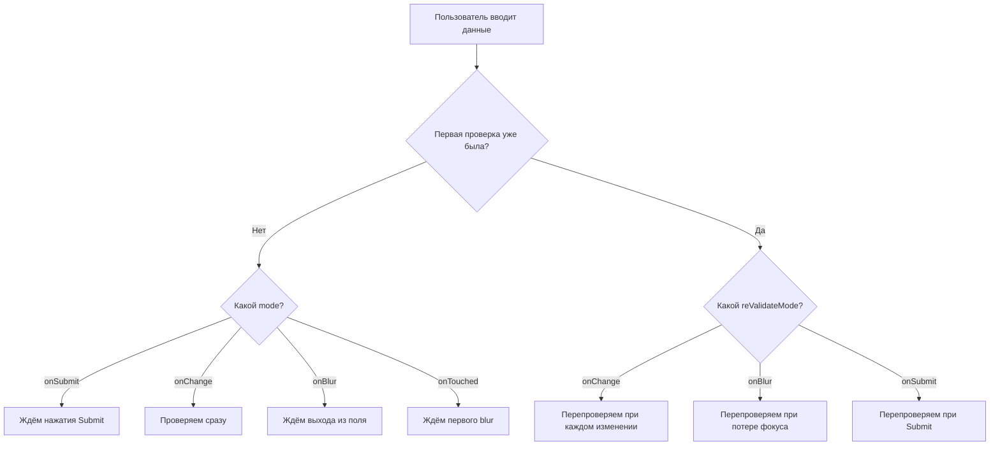
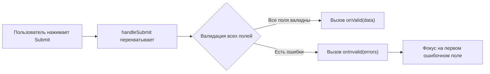
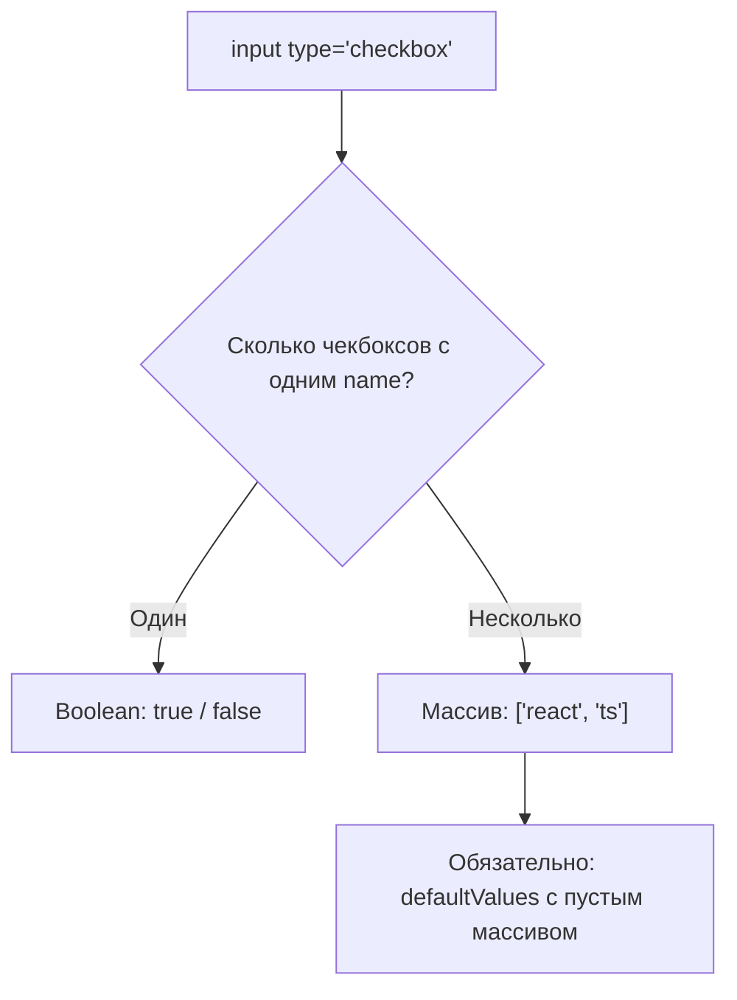
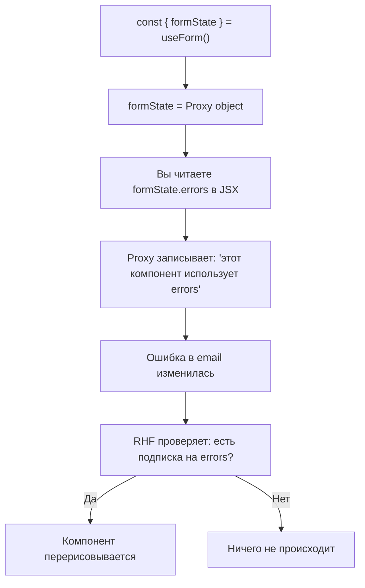
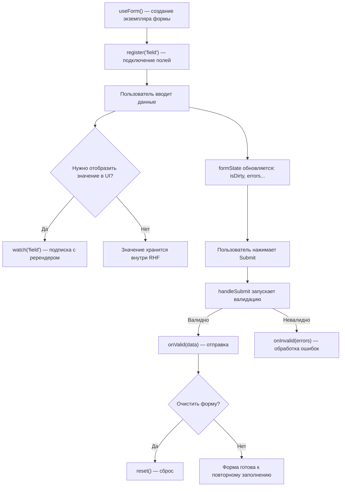

# Уровень 1: Основы -- useForm, register, handleSubmit, formState

## Введение

Представьте, что вы строите дом. Вы можете замешивать бетон вручную, таскать кирпичи по одному и проверять уровнем каждый ряд. Или можете взять бетономешалку, кран и лазерный нивелир. Результат тот же, но второй путь быстрее, надёжнее и приятнее.

React Hook Form -- это тот самый набор инструментов для работы с формами в React. Вместо того чтобы вручную создавать `useState` для каждого поля, писать обработчики `onChange`, собирать данные при отправке и управлять ошибками -- вы получаете всё это из коробки через один хук `useForm`.

На этом уровне мы подробно разберём **восемь ключевых инструментов**, которые составляют фундамент любой формы:

1. **`useForm`** -- точка входа, из которой всё начинается
2. **`register`** -- подключение полей к форме
3. **`handleSubmit`** -- обработка отправки
4. **Типы полей** -- как RHF работает с input, select, textarea, checkbox, radio
5. **`formState`** -- состояние формы через Proxy (это интересно!)
6. **`watch`** -- реактивное отслеживание значений
7. **`setValue` / `getValues`** -- программное управление
8. **`reset`** -- сброс формы

---

## 1. Хук `useForm` -- точка входа

### Что это и зачем

`useForm` -- это главный хук React Hook Form. Он создаёт **экземпляр формы** -- объект, который хранит значения всех полей, ошибки валидации, статус отправки и многое другое. Всё, что вы делаете с формой, начинается с вызова `useForm`.

Если провести аналогию: `useForm` -- это как создание нового документа в текстовом редакторе. Пока вы не создали документ, вам некуда печатать текст. Точно так же, пока вы не вызвали `useForm`, у вас нет формы, с которой можно работать.

### Как вызывать

```tsx
import { useForm } from 'react-hook-form'

// 1. Определяем типы данных формы
interface FormData {
  firstName: string
  lastName: string
  email: string
  age: number
}

function MyForm() {
  // 2. Создаём экземпляр формы
  const { register, handleSubmit, watch, formState, setValue, getValues, reset } =
    useForm<FormData>()

  return <form>...</form>
}
```

Обратите внимание на дженерик `useForm<FormData>()`. Он сообщает TypeScript, какие поля есть в форме и каких они типов. Благодаря этому вы получите автодополнение имён полей и проверку типов при работе с `register`, `watch`, `setValue` и другими методами.

### Параметры `useForm`

Хук принимает объект конфигурации. Ни один параметр не является обязательным -- у всех есть разумные значения по умолчанию.

```tsx
const form = useForm<FormData>({
  mode: 'onSubmit',           // Когда запускать валидацию
  reValidateMode: 'onChange', // Когда перепроверять после первой ошибки
  defaultValues: {            // Начальные значения полей
    firstName: '',
    lastName: '',
    email: '',
    age: 18,
  },
  shouldFocusError: true,     // Перевести фокус на первое ошибочное поле
  criteriaMode: 'firstError', // Сколько ошибок собирать: одну или все
})
```

Разберём самые важные параметры.

### `defaultValues` -- начальные значения

Это объект, в котором вы указываете, какие значения поля будут иметь при первом рендере. Без `defaultValues` все поля начнут с `undefined`, что может привести к предупреждениям React о переключении между controlled и uncontrolled input.

```tsx
useForm<FormData>({
  defaultValues: {
    firstName: '',
    lastName: '',
    email: '',
    age: 18,
  },
})
```

`defaultValues` также определяет, к чему вернётся форма при вызове `reset()`. Кроме того, это единственный способ задать начальные значения для полей, которые отслеживаются через `watch` -- без них `watch('firstName')` вернёт `undefined` до первого ввода.

💡 **Совет:** `defaultValues` можно передать как асинхронную функцию. Это удобно для форм редактирования, где данные приходят с сервера:

```tsx
useForm<FormData>({
  defaultValues: async () => {
    const response = await fetch('/api/user/profile')
    return response.json()
  },
})
```

### `mode` -- стратегия валидации

Параметр `mode` определяет **момент**, когда React Hook Form впервые запустит валидацию для поля. Это ключевое решение, которое напрямую влияет на пользовательский опыт.

| mode          | Когда срабатывает                               | Подходит для                          |
| ------------- | ----------------------------------------------- | ------------------------------------- |
| `'onSubmit'`  | Только при нажатии "Отправить"                  | Простых форм, где ошибки не критичны  |
| `'onChange'`  | При каждом нажатии клавиши                      | Полей с индикаторами (сила пароля)    |
| `'onBlur'`    | Когда пользователь покидает поле                | Большинства продакшен-форм            |
| `'onTouched'` | После первого blur, затем при каждом изменении  | Лучший баланс UX и производительности |
| `'all'`       | При каждом изменении **и** при потере фокуса    | Критичных форм (платежи, медицина)    |

Значение по умолчанию -- `'onSubmit'`. Это значит, что до первого нажатия кнопки "Отправить" ошибки вообще не появятся, даже если пользователь заполнил поле неправильно.

📌 **Важно:** `mode` влияет только на **первую** проверку. После того как ошибка уже обнаружена, повторная проверка (исчезнет ли ошибка после исправления) управляется параметром `reValidateMode`, который по умолчанию равен `'onChange'`. Это значит, что ошибка исчезнет мгновенно, как только пользователь исправит поле.

Вот как это выглядит на схеме:



### Что возвращает `useForm`

Хук возвращает объект с методами и свойствами для управления формой. Вот полный список того, что вы получаете:

| Метод / свойство   | Назначение                                              |
| ------------------- | ------------------------------------------------------- |
| `register`          | Подключает HTML-элемент к форме                         |
| `handleSubmit`      | Оборачивает вашу функцию отправки, добавляя валидацию   |
| `watch`             | Подписывается на изменения полей (вызывает ререндер)    |
| `formState`         | Объект состояния: ошибки, isDirty, isValid и т.д.       |
| `setValue`          | Программно устанавливает значение поля                  |
| `getValues`         | Читает текущие значения без подписки                    |
| `reset`             | Сбрасывает форму к начальным значениям                  |
| `trigger`           | Запускает валидацию вручную                             |
| `setError`          | Устанавливает ошибку для поля программно                |
| `clearErrors`       | Очищает ошибки                                          |
| `setFocus`          | Переводит фокус на конкретное поле                      |
| `control`           | Объект для интеграции с Controller и useController      |
| `unregister`        | Отключает поле от формы                                 |
| `resetField`        | Сбрасывает конкретное поле                              |
| `getFieldState`     | Возвращает состояние конкретного поля                   |

В этом уровне мы подробно рассмотрим `register`, `handleSubmit`, `watch`, `formState`, `setValue`, `getValues` и `reset`.

---

## 2. `register` -- подключение полей к форме

### Проблема, которую решает register

В обычном React для управления формой вам нужно для каждого поля создать состояние, обработчик `onChange` и привязать `value`:

```tsx
// Without React Hook Form — manual wiring for each field
const [firstName, setFirstName] = useState('')
const [lastName, setLastName] = useState('')
const [email, setEmail] = useState('')

<input value={firstName} onChange={e => setFirstName(e.target.value)} />
<input value={lastName} onChange={e => setLastName(e.target.value)} />
<input value={email} onChange={e => setEmail(e.target.value)} />
```

Три поля -- уже 6 строк только на состояние. А если полей 20? А если нужна ещё валидация?

Функция `register` решает эту проблему. Она возвращает набор пропсов (`ref`, `onChange`, `onBlur`, `name`), которые нужно "распылить" на HTML-элемент. Через `ref` библиотека получает прямой доступ к DOM-элементу, а через `onChange` и `onBlur` отслеживает изменения.

```tsx
// With React Hook Form — one call per field
<input {...register('firstName')} />
<input {...register('lastName')} />
<input {...register('email')} />
```

### Как это работает внутри

Когда вы пишете `{...register('firstName')}`, вызов `register('firstName')` возвращает объект примерно такого вида:

```tsx
{
  name: 'firstName',
  ref: (element) => { /* save DOM reference */ },
  onChange: (event) => { /* update internal form state */ },
  onBlur: (event) => { /* mark field as touched, maybe validate */ },
}
```

Оператор `{...}` (spread) передаёт эти пропсы на `<input>`. В результате:

1. **`ref`** -- RHF сохраняет ссылку на DOM-элемент (для фокуса при ошибке, для чтения значения)
2. **`onChange`** -- при каждом изменении значение записывается во внутреннее хранилище формы
3. **`onBlur`** -- поле помечается как "затронутое" (touched), может запуститься валидация
4. **`name`** -- имя поля для HTML-формы

🔥 **Ключевой момент:** React Hook Form работает через **неуправляемые компоненты** (uncontrolled). Значения хранятся в DOM, а не в React-состоянии. Это означает, что при вводе текста компонент **не перерисовывается** -- что даёт огромный выигрыш в производительности для больших форм.

### Регистрация с опциями валидации

Второй аргумент `register` -- объект с правилами валидации и настройками:

```tsx
<input
  {...register('age', {
    required: 'Возраст обязателен',
    min: { value: 18, message: 'Минимум 18 лет' },
    max: { value: 100, message: 'Максимум 100 лет' },
    valueAsNumber: true,
  })}
/>
```

Вот полный список доступных опций:

| Опция            | Тип                             | Что делает                                          |
| ---------------- | ------------------------------- | --------------------------------------------------- |
| `required`       | `boolean \| string`             | Поле обязательно. Строка = текст ошибки             |
| `min`            | `number \| { value, message }`  | Минимальное значение (для чисел)                    |
| `max`            | `number \| { value, message }`  | Максимальное значение                               |
| `minLength`      | `number \| { value, message }`  | Минимальная длина строки                            |
| `maxLength`      | `number \| { value, message }`  | Максимальная длина строки                           |
| `pattern`        | `RegExp \| { value, message }`  | Регулярное выражение для проверки                   |
| `validate`       | `function \| object`            | Пользовательская функция валидации                  |
| `valueAsNumber`  | `boolean`                       | Преобразовать значение в число                      |
| `valueAsDate`    | `boolean`                       | Преобразовать значение в Date                       |
| `setValueAs`     | `(value) => any`                | Пользовательское преобразование значения            |
| `onChange`        | `(event) => void`               | Дополнительный обработчик при изменении             |
| `onBlur`          | `(event) => void`               | Дополнительный обработчик при потере фокуса         |
| `disabled`       | `boolean`                       | Отключить поле                                      |
| `deps`           | `string \| string[]`            | Зависимые поля (перевалидировать при изменении)     |

### `setValueAs` -- трансформация значений

`setValueAs` -- это функция-конвейер, которая преобразует значение поля **до** того, как оно попадёт во внутреннее хранилище формы и **до** валидации. Представьте её как фильтр на водопроводной трубе: вода (значение) проходит через фильтр (setValueAs) прежде чем попасть в бак (хранилище формы).

```tsx
<input
  {...register('email', {
    setValueAs: value => value.trim().toLowerCase(),
  })}
/>
```

В этом примере, если пользователь введёт `"  John@MAIL.COM  "`, в форму попадёт `"john@mail.com"`.

Типичные применения `setValueAs`:

```tsx
// Remove whitespace from edges
setValueAs: value => value.trim()

// Convert to number (alternative to valueAsNumber)
setValueAs: value => Number(value)

// Parse date string into Date object
setValueAs: value => new Date(value)

// Strip non-digit characters from phone number
setValueAs: value => value.replace(/\D/g, '')
```

📌 **Важно:** `setValueAs` игнорируется, если указан `valueAsNumber` или `valueAsDate`. Эти три опции взаимоисключающие.

### Обработчики `onChange` и `onBlur` в register

Вы можете добавить свои обработчики событий через опции `register`. Они будут вызваны **в дополнение** к внутренним обработчикам RHF, а не вместо них:

```tsx
<input
  {...register('email', {
    onChange: e => {
      // Called after RHF processes the change
      console.log('Value changed to:', e.target.value)
      analytics.track('field_interaction', { field: 'email' })
    },
    onBlur: e => {
      // Called when user leaves the field
      console.log('User left the field, value:', e.target.value)
    },
  })}
/>
```

Это полезно для побочных эффектов: отправки аналитики, логирования, обновления связанных данных вне формы. Для отображения значений в UI лучше использовать `watch` (об этом далее).

---

## 3. `handleSubmit` -- обработка отправки формы

### Что это и как работает

`handleSubmit` -- это функция-обёртка. Она принимает вашу функцию обработки отправки и возвращает новую функцию, которую вы передаёте в `onSubmit` формы. Между нажатием кнопки "Отправить" и вызовом вашей функции `handleSubmit` выполняет валидацию всех полей.

Вот как выглядит поток:



### Базовое использование

```tsx
const { handleSubmit } = useForm<FormData>()

const onSubmit = (data: FormData) => {
  // data -- уже провалидированные, типизированные данные
  console.log('Valid data:', data)
}

<form onSubmit={handleSubmit(onSubmit)}>
```

Обратите внимание: в `onSubmit` вы получаете **не** `event`, а объект с данными формы. React Hook Form уже вызвал `event.preventDefault()` за вас и собрал все значения в типизированный объект.

### Два callback: `onValid` и `onInvalid`

`handleSubmit` на самом деле принимает **два** аргумента:

1. **`onValid`** (обязательный) -- вызывается, когда форма прошла валидацию
2. **`onInvalid`** (необязательный) -- вызывается, когда есть ошибки валидации

```tsx
import { FieldErrors } from 'react-hook-form'

const onValid = (data: FormData) => {
  api.submitForm(data)
}

const onInvalid = (errors: FieldErrors<FormData>) => {
  console.log('Failed fields:', Object.keys(errors))
}

<form onSubmit={handleSubmit(onValid, onInvalid)}>
```

Зачем нужен `onInvalid`? В реальных проектах он используется для:

- **Аналитики** -- какие поля чаще всего заполняют неправильно
- **Toast-уведомлений** -- "Пожалуйста, исправьте ошибки в форме"
- **Прокрутки** -- если форма длинная, прокрутить к первой ошибке
- **Мониторинга** -- отправить данные об ошибках в Sentry или другой сервис

```tsx
handleSubmit(
  data => {
    api.submitForm(data)
  },
  errors => {
    analytics.track('form_validation_failed', {
      fields: Object.keys(errors),
      count: Object.keys(errors).length,
    })
    toast.error('Please fix the errors before submitting')
  }
)
```

### Асинхронная отправка

В реальных приложениях отправка формы почти всегда асинхронная -- вы отправляете данные на сервер и ждёте ответа. `handleSubmit` корректно обрабатывает `async`-функции. Пока промис не разрешится, свойство `isSubmitting` в `formState` будет `true`:

```tsx
const onSubmit = async (data: FormData) => {
  // isSubmitting === true from this moment
  await api.sendData(data)
  // isSubmitting === false after resolve or reject
}

<form onSubmit={handleSubmit(onSubmit)}>
  <button disabled={isSubmitting}>
    {isSubmitting ? 'Sending...' : 'Submit'}
  </button>
</form>
```

Это избавляет от необходимости вручную создавать `useState` для флага загрузки. RHF делает это автоматически.

---

## 4. Различные типы полей

React Hook Form работает с нативными HTML-элементами форм. Ключевой принцип: RHF **не создаёт собственные компоненты** для полей ввода. Вместо этого он подключается к стандартным `<input>`, `<select>`, `<textarea>` через `register`. Это означает, что всё, что вы знаете об HTML-формах, остаётся в силе.

### Текстовые поля

Самый простой случай. Все текстовые типы input работают одинаково -- `register` привязывается к элементу, значение хранится как строка:

```tsx
<input {...register('firstName')} />                    // type="text" by default
<input type="email" {...register('email')} />           // email with browser validation
<input type="password" {...register('password')} />     // password (hidden input)
<input type="url" {...register('website')} />           // URL
<input type="tel" {...register('phone')} />             // phone number
```

Обратите внимание: атрибут `type` влияет на **браузерную** валидацию и клавиатуру на мобильных устройствах, но для RHF все они -- просто строки. Если вам нужна валидация формата, используйте `pattern` в опциях `register`.

### Числовые поля

С числами есть нюанс: HTML `<input type="number">` всё равно возвращает **строку**. Если вам нужно именно число в данных формы, укажите `valueAsNumber: true`:

```tsx
<input
  type="number"
  {...register('age', { valueAsNumber: true })}
/>
```

Без `valueAsNumber` вы получите `{ age: "25" }` (строка). С ним -- `{ age: 25 }` (число). Это важно для корректной работы валидаторов `min` и `max`, а также для отправки данных на сервер.

### Textarea

Textarea работает точно так же, как `<input type="text">` -- никаких специальных действий не требуется:

```tsx
<textarea {...register('bio')} rows={4} />
```

Значение хранится как строка. Все опции `register` (required, minLength, maxLength и т.д.) работают как ожидается.

### Select

Для `<select>` register привязывается к самому элементу `<select>`, а не к `<option>`. Значением будет `value` выбранного `<option>`:

```tsx
<select {...register('country')}>
  <option value="">Choose a country</option>
  <option value="ru">Russia</option>
  <option value="us">USA</option>
  <option value="de">Germany</option>
</select>
```

Для строгой типизации можно ограничить допустимые значения литеральным типом:

```tsx
type Country = 'ru' | 'us' | 'de' | ''

interface FormData {
  country: Country
}
```

### Radio

Группа радиокнопок -- это набор `<input type="radio">`, зарегистрированных с **одним и тем же именем**. RHF автоматически понимает, что это группа, и хранит значение `value` выбранной кнопки:

```tsx
<label>
  <input type="radio" value="male" {...register('gender')} />
  Male
</label>
<label>
  <input type="radio" value="female" {...register('gender')} />
  Female
</label>
<label>
  <input type="radio" value="other" {...register('gender')} />
  Other
</label>
```

В данных формы `gender` будет строкой: `"male"`, `"female"` или `"other"`.

### Checkbox

Чекбоксы в RHF работают в двух режимах, и это важно понимать.

**Режим 1: Одиночный чекбокс (boolean)**

Когда чекбокс с уникальным именем один -- значение будет `true` или `false`:

```tsx
interface FormData {
  agree: boolean
}

<input type="checkbox" {...register('agree', { required: 'You must agree' })} />
```

RHF определяет тип `checkbox` по `ref` и автоматически возвращает boolean, а не строку.

**Режим 2: Группа чекбоксов (массив строк)**

Когда несколько чекбоксов зарегистрированы с **одним именем** -- RHF собирает `value` отмеченных чекбоксов в массив:

```tsx
interface FormData {
  skills: string[]
}

const { register } = useForm<FormData>({
  defaultValues: { skills: [] },
})

<input type="checkbox" value="react" {...register('skills')} />
<input type="checkbox" value="typescript" {...register('skills')} />
<input type="checkbox" value="nodejs" {...register('skills')} />
```

Если отмечены первый и третий чекбоксы, в данных формы будет `skills: ['react', 'nodejs']`.

📌 **Важно:** Для группы чекбоксов обязательно указывайте `defaultValues` с пустым массивом. Без этого RHF не поймёт, что это множественный выбор.

Вот схема, показывающая как RHF определяет режим работы:



---

## 5. `formState` -- состояние формы и магия Proxy

### Что хранит formState

`formState` -- это объект, содержащий полную информацию о текущем состоянии формы: есть ли ошибки, менял ли пользователь поля, идёт ли отправка и т.д.

```tsx
const {
  formState: {
    errors,         // Объект ошибок: { email: { message: '...' }, ... }
    isDirty,        // true, если пользователь менял хотя бы одно поле
    dirtyFields,    // { firstName: true, email: true } -- какие поля менялись
    touchedFields,  // { firstName: true } -- какие поля получали фокус
    isSubmitting,   // true, пока идёт отправка (async)
    isValid,        // true, если все поля проходят валидацию
    isValidating,   // true, пока идёт асинхронная валидация
    submitCount,    // Сколько раз пользователь нажал Submit
    isSubmitted,    // true после первого Submit
    isSubmitSuccessful, // true, если последний Submit прошёл без ошибок
  },
} = useForm<FormData>({ mode: 'onChange' })
```

Каждое из этих свойств обновляется автоматически. Вам не нужно вручную устанавливать `isSubmitting = true` перед запросом -- RHF делает это сам.

### Практический пример

```tsx
function LoginForm() {
  const {
    register,
    handleSubmit,
    formState: { errors, isSubmitting, isValid, isDirty },
  } = useForm<LoginForm>({ mode: 'onChange' })

  const onSubmit = async (data: LoginForm) => {
    await api.login(data)
  }

  return (
    <form onSubmit={handleSubmit(onSubmit)}>
      <input {...register('email', { required: 'Email is required' })} />
      {errors.email && <span className="error">{errors.email.message}</span>}

      <input
        type="password"
        {...register('password', { required: 'Password is required' })}
      />
      {errors.password && <span className="error">{errors.password.message}</span>}

      <button type="submit" disabled={!isValid || isSubmitting}>
        {isSubmitting ? 'Logging in...' : 'Log in'}
      </button>
    </form>
  )
}
```

В этом примере кнопка "Log in" будет заблокирована, пока пользователь не заполнит оба поля корректно (`!isValid`) или пока идёт отправка (`isSubmitting`). Ошибки отображаются под полями автоматически.

### Proxy-паттерн: почему formState работает "магически"

Это самая интересная техническая деталь React Hook Form, и её важно понять, чтобы избежать неприятных багов.

`formState` -- это **не обычный JavaScript-объект**. Это **Proxy**. Proxy -- это встроенный механизм JavaScript, который позволяет перехватывать обращения к свойствам объекта. Когда вы пишете `formState.errors`, Proxy ловит это обращение и записывает: "компонент использует `errors`".

Зачем это нужно? Для **оптимизации рендеринга**. Если ваш компонент использует только `errors` и `isSubmitting`, зачем перерисовывать его при изменении `isDirty` или `touchedFields`? Proxy позволяет RHF подписать компонент **только на те свойства, которые вы реально читаете**.



Это элегантное решение, но оно накладывает ограничения на то, **как** вы обращаетесь к `formState`.

### Правила работы с formState

**✅ Правильно: деструктуризация сразу при вызове useForm**

```tsx
const {
  formState: { errors, isDirty, isValid },
} = useForm()
```

Когда вы деструктуризируете `errors`, `isDirty`, `isValid` прямо при вызове `useForm`, Proxy фиксирует обращение ко всем трём свойствам во время рендера. Компонент будет перерисовываться при изменении любого из них.

**✅ Правильно: доступ к свойствам прямо в JSX**

```tsx
const { formState } = useForm()

return (
  <div>
    {formState.errors.email && <span>{formState.errors.email.message}</span>}
    <button disabled={formState.isSubmitting}>Submit</button>
  </div>
)
```

Здесь Proxy перехватывает обращения к `formState.errors` и `formState.isSubmitting` во время рендера, поэтому подписка работает корректно.

**❌ Неправильно: поздняя деструктуризация**

```tsx
const { formState } = useForm()
// ...somewhere later in the code...
const { errors } = formState  // Too late! Proxy may not register this correctly
```

Проблема в том, что деструктуризация происходит после рендера или в условном блоке. Proxy может не зарегистрировать подписку, и компонент не будет перерисовываться при изменении ошибок.

**❌ Неправильно: копирование formState в другую переменную**

```tsx
const { formState } = useForm()
const state = formState        // Proxy reference is copied, but subscription logic breaks
console.log(state.errors)      // May not trigger re-renders
```

**❌ Неправильно: условное чтение свойств**

```tsx
const { formState } = useForm()
if (someCondition) {
  console.log(formState.errors) // Proxy won't subscribe because this path may not execute
}
```

Если `someCondition` при первом рендере -- `false`, Proxy не зарегистрирует обращение к `errors`, и когда ошибки появятся, компонент не узнает об этом.

💡 **Практическое правило:** Всегда деструктуризируйте нужные свойства `formState` прямо в вызове `useForm`. Это самый надёжный и читаемый подход.

---

## 6. `watch` -- отслеживание значений в реальном времени

### Проблема, которую решает watch

Вы уже знаете, что React Hook Form использует неуправляемые компоненты: значения хранятся в DOM, и при вводе текста React не перерисовывает компонент. Это отлично для производительности, но возникает вопрос: а что если мне **нужно** отобразить текущее значение поля в UI? Например, показать превью, посчитать длину пароля или изменить интерфейс в зависимости от выбора?

Для этого существует `watch`. Он **подписывает** компонент на изменения конкретного поля и вызывает перерисовку при каждом обновлении. По сути, `watch` -- это мост между миром неуправляемых компонентов (где значения живут в DOM) и миром React (где UI обновляется через рендеринг).

### Варианты использования

```tsx
const { register, watch } = useForm<FormData>()

// Watch one field
const firstName = watch('firstName')

// Watch several fields (returns a tuple)
const [firstName, lastName] = watch(['firstName', 'lastName'])

// Watch all fields (returns entire form data object)
const allValues = watch()

// Watch with default value (returned before field is registered)
const email = watch('email', 'default@example.com')
```

### `watch` vs `getValues` vs `onChange` -- когда что использовать

Это один из самых частых вопросов. Все три способа позволяют "узнать" значение поля, но делают это принципиально по-разному:

| Метод       | Вызывает ререндер? | Реактивный? | Когда использовать                         |
| ----------- | ------------------- | ----------- | ------------------------------------------ |
| `watch`     | ✅ Да              | ✅ Да      | Отображение значения в UI                  |
| `getValues` | ❌ Нет             | ❌ Нет     | Чтение значения в обработчике / по клику   |
| `onChange`  | ❌ Нет             | ❌ Нет     | Побочный эффект при каждом изменении        |

Аналогия: представьте поле формы как термометр.

- **`watch`** -- это электронное табло, которое **постоянно показывает** текущую температуру. Каждое изменение тут же отражается на экране.
- **`getValues`** -- это когда вы **подходите и смотрите** на градусник в конкретный момент. Вы видите текущее значение, но если температура изменится через секунду -- вы об этом не узнаете.
- **`onChange`** -- это датчик, который **записывает в журнал** каждое изменение, но не выводит значение на табло.

```tsx
const { register, watch, getValues } = useForm()

// watch: value updates in UI in real-time
const password = watch('password', '')
return <div>Length: {password.length} characters</div>

// getValues: read once in an event handler
const handleClick = () => {
  const currentEmail = getValues('email')
  navigator.clipboard.writeText(currentEmail)
}

// onChange: side effect without re-render
<input
  {...register('search', {
    onChange: (e) => {
      debouncedApiCall(e.target.value) // fire-and-forget
    }
  })}
/>
```

### Пример: индикатор силы пароля

Классический пример использования `watch` -- показ силы пароля в реальном времени. Без `watch` пришлось бы делать поле управляемым через `useState`, жертвуя преимуществами RHF.

```tsx
function PasswordForm() {
  const { register, watch } = useForm()
  const password = watch('password', '')

  const getStrength = (pwd: string) => {
    if (pwd.length === 0) return { label: 'Enter password', color: '#888' }
    if (pwd.length < 6) return { label: 'Weak', color: '#f44336' }
    if (pwd.length < 10) return { label: 'Medium', color: '#ff9800' }
    return { label: 'Strong', color: '#4caf50' }
  }

  const strength = getStrength(password)

  return (
    <div>
      <input type="password" {...register('password')} />
      <div style={{ color: strength.color }}>
        Strength: {strength.label}
      </div>
    </div>
  )
}
```

При каждом нажатии клавиши в поле пароля `watch` возвращает новое значение, компонент перерисовывается, `getStrength` вычисляет новый уровень, и пользователь видит обновлённый индикатор.

⚠️ **Предупреждение о производительности:** `watch()` без аргументов подписывается на **все** поля формы. Каждое изменение любого поля вызовет ререндер компонента. Используйте `watch('конкретное поле')` везде, где это возможно.

---

## 7. `setValue` и `getValues` -- программное управление

### `setValue` -- установка значения извне

Иногда значение поля нужно установить не через пользовательский ввод, а программно. Типичные сценарии:

- Кнопка "Заполнить тестовыми данными" в режиме разработки
- Выбор адреса из подсказок API (геокодирование)
- Копирование значений из одной секции формы в другую
- Установка значений после загрузки данных с сервера

```tsx
const { setValue } = useForm<FormData>()

// Simple: set a value
setValue('firstName', 'John')

// With options: trigger validation and mark as dirty
setValue('firstName', 'John', {
  shouldValidate: true,   // Run validation for this field
  shouldDirty: true,      // Mark field as dirty (changed by user)
  shouldTouch: true,      // Mark field as touched
})
```

Опции `setValue` важны для корректного поведения формы. По умолчанию `setValue` **не** запускает валидацию и **не** помечает поле как dirty. Если вам нужно, чтобы форма реагировала на программное изменение так же, как на пользовательский ввод -- передайте соответствующие флаги.

📌 **Важно:** `setValue` работает только с полями, которые уже зарегистрированы через `register`. Если вы вызовете `setValue('unknownField', 'value')`, ничего не произойдёт.

### `getValues` -- чтение текущих значений

`getValues` -- это способ "заглянуть" в текущее состояние формы без подписки. Компонент **не будет** перерисовываться при изменении значений, полученных через `getValues`.

```tsx
const { getValues } = useForm<FormData>()

// Read all fields
const allValues = getValues()
// { firstName: 'John', lastName: 'Doe', email: 'john@example.com' }

// Read one field
const email = getValues('email')
// 'john@example.com'

// Read several fields
const [firstName, lastName] = getValues(['firstName', 'lastName'])
// ['John', 'Doe']
```

### Практический пример: кнопки управления товаром

```tsx
function ProductForm() {
  const { register, handleSubmit, setValue, getValues, reset } =
    useForm<ProductForm>({
      defaultValues: { title: '', description: '', price: 0 },
    })

  const fillTestData = () => {
    setValue('title', 'Test Product')
    setValue('description', 'A sample product for testing')
    setValue('price', 999)
  }

  const doublePrice = () => {
    const currentPrice = getValues('price')
    setValue('price', currentPrice * 2, { shouldValidate: true })
  }

  return (
    <form onSubmit={handleSubmit(console.log)}>
      <input {...register('title')} />
      <textarea {...register('description')} />
      <input type="number" {...register('price', { valueAsNumber: true })} />

      <button type="button" onClick={fillTestData}>Fill test data</button>
      <button type="button" onClick={doublePrice}>Double price</button>
      <button type="button" onClick={() => reset()}>Clear</button>
      <button type="submit">Save</button>
    </form>
  )
}
```

Обратите внимание, что `fillTestData` и `doublePrice` используют `type="button"`. Без этого атрибута кнопки внутри `<form>` по умолчанию имеют `type="submit"` и вызовут отправку формы при клике.

---

## 8. `reset` -- сброс формы к начальному состоянию

### Что делает reset

`reset` возвращает форму к значениям из `defaultValues` и сбрасывает всё внутреннее состояние: ошибки, флаги dirty и touched, счётчик отправок. По сути, форма возвращается в состояние "только что создана".

```tsx
const { reset } = useForm<FormData>({
  defaultValues: { firstName: '', lastName: '', email: '' },
})

// Reset to defaultValues
reset()

// Reset to new values (overrides defaultValues)
reset({
  firstName: 'John',
  lastName: 'Doe',
  email: 'john@example.com',
})
```

### Когда вызывать reset

**После успешной отправки** -- если вы хотите очистить форму (например, форма обратной связи):

```tsx
const onSubmit = async (data: FormData) => {
  await api.sendFeedback(data)
  reset() // Clear the form for next message
}
```

**При получении данных с сервера** -- если форма работает как редактор и данные пришли асинхронно:

```tsx
useEffect(() => {
  fetchUserProfile().then(data => {
    reset(data) // Set all fields to server values
  })
}, [reset])
```

**При отмене редактирования** -- пользователь начал менять поля, но передумал:

```tsx
<button type="button" onClick={() => reset()}>
  Cancel changes
</button>
```

### Опции reset

`reset` принимает второй аргумент -- объект с опциями, которые позволяют частично сбросить состояние:

```tsx
reset(values, {
  keepErrors: false,         // Сохранить ошибки валидации
  keepDirty: false,          // Сохранить флаги dirty
  keepValues: false,         // Сохранить текущие значения полей
  keepDefaultValues: false,  // Сохранить текущие defaultValues
  keepIsSubmitted: false,    // Сохранить статус isSubmitted
  keepTouched: false,        // Сохранить флаги touched
  keepIsValid: false,        // Сохранить статус isValid
  keepSubmitCount: false,    // Сохранить счётчик submitCount
})
```

Чаще всего используются:

```tsx
// Reset after successful edit: set new "baseline" values
reset(dataFromServer)

// Cancel changes but keep validation errors visible
reset(undefined, { keepErrors: true })

// Reset values but remember that user already interacted with form
reset(undefined, { keepTouched: true })
```

---

## Жизненный цикл формы: собираем всё вместе

Теперь, когда мы рассмотрели каждый инструмент по отдельности, давайте посмотрим, как они работают вместе на протяжении жизни формы:



---

## ⚠️ Частые ошибки новичков

### ❌ Ошибка 1: Забыли `valueAsNumber` для числовых полей

```tsx
// ❌ Bad: age will be a string "25", not a number
<input type="number" {...register('age')} />

// ✅ Good: age will be a number 25
<input type="number" {...register('age', { valueAsNumber: true })} />
```

**Почему это проблема:** HTML input всегда возвращает строку, даже с `type="number"`. Без `valueAsNumber: true` ваш сервер получит `"25"` вместо `25`, а валидаторы `min` / `max` могут работать неправильно со строкой.

---

### ❌ Ошибка 2: `watch` без значения по умолчанию

```tsx
// ❌ Bad: value is undefined before first render
const value = watch('field')
<p>{value.length}</p> // TypeError: Cannot read property 'length' of undefined

// ✅ Good: provide default value
const value = watch('field', '')
<p>{value.length}</p> // Works: 0
```

**Почему это проблема:** До момента, когда поле зарегистрируется через `register`, `watch` возвращает `undefined`. Если вы вызываете на этом значении методы (`.length`, `.toUpperCase()`), получите runtime error. Всегда указывайте второй аргумент -- значение по умолчанию. Или лучше задавайте `defaultValues` в `useForm` -- тогда `watch` сразу вернёт их.

---

### ❌ Ошибка 3: `getValues` в JSX для отображения данных

```tsx
// ❌ Bad: UI won't update when the field changes
const email = getValues('email')
<p>Your email: {email}</p>

// ✅ Good: watch subscribes to changes and triggers re-render
const email = watch('email')
<p>Your email: {email}</p>
```

**Почему это проблема:** `getValues` -- это моментальный снимок. Он возвращает значение на момент вызова, но не подписывается на изменения. Если пользователь изменит поле, текст на экране останется прежним. `watch` же подписывается и обновляет UI при каждом изменении.

---

### ❌ Ошибка 4: Деструктуризация `formState` в неправильном месте

```tsx
// ❌ Bad: late destructuring — Proxy may not register the subscription
const { formState } = useForm()
// ...later in a handler or effect...
const { errors } = formState

// ✅ Good: destructure immediately when calling useForm
const {
  formState: { errors, isDirty, isValid },
} = useForm()
```

**Почему это проблема:** `formState` -- Proxy-объект. Чтобы подписка на свойства (errors, isDirty и т.д.) сработала корректно, обращение к ним должно произойти во время рендера. Деструктуризация прямо в вызове `useForm` гарантирует, что обращения к свойствам произойдут в правильный момент.

---

### ❌ Ошибка 5: `setValue` для незарегистрированного поля

```tsx
// ❌ Bad: field is not registered yet — nothing happens
setValue('email', 'test@example.com')
// ...somewhere later...
<input {...register('email')} />

// ✅ Good: field must be registered before setValue
<input {...register('email')} />
// ...in a handler called after render...
const fillData = () => {
  setValue('email', 'test@example.com') // Works: field is already registered
}
```

**Почему это проблема:** `setValue` работает только с полями, которые уже зарегистрированы через `register`. Это происходит при рендере компонента. Если вы вызываете `setValue` до того, как `<input {...register('email')} />` отрендерился, вызов будет проигнорирован.

---

### ❌ Ошибка 6: Кнопка без `type="button"` внутри формы

```tsx
// ❌ Bad: this button submits the form on click!
<form onSubmit={handleSubmit(onSubmit)}>
  <button onClick={fillTestData}>Fill test data</button>
</form>

// ✅ Good: type="button" prevents form submission
<form onSubmit={handleSubmit(onSubmit)}>
  <button type="button" onClick={fillTestData}>Fill test data</button>
</form>
```

**Почему это проблема:** По стандарту HTML, кнопка внутри `<form>` без явного `type` имеет `type="submit"`. Клик по ней отправит форму, даже если вы хотели просто заполнить тестовые данные.

---

## 📚 Дополнительные ресурсы

- [useForm -- полная документация](https://react-hook-form.com/docs/useform)
- [register -- опции и примеры](https://react-hook-form.com/docs/useform/register)
- [handleSubmit -- обработка отправки](https://react-hook-form.com/docs/useform/handlesubmit)
- [formState -- все свойства состояния](https://react-hook-form.com/docs/useform/formstate)
- [watch -- отслеживание полей](https://react-hook-form.com/docs/useform/watch)
- [setValue -- программная установка значений](https://react-hook-form.com/docs/useform/setvalue)
- [getValues -- чтение значений](https://react-hook-form.com/docs/useform/getvalues)
- [reset -- сброс формы](https://react-hook-form.com/docs/useform/reset)
