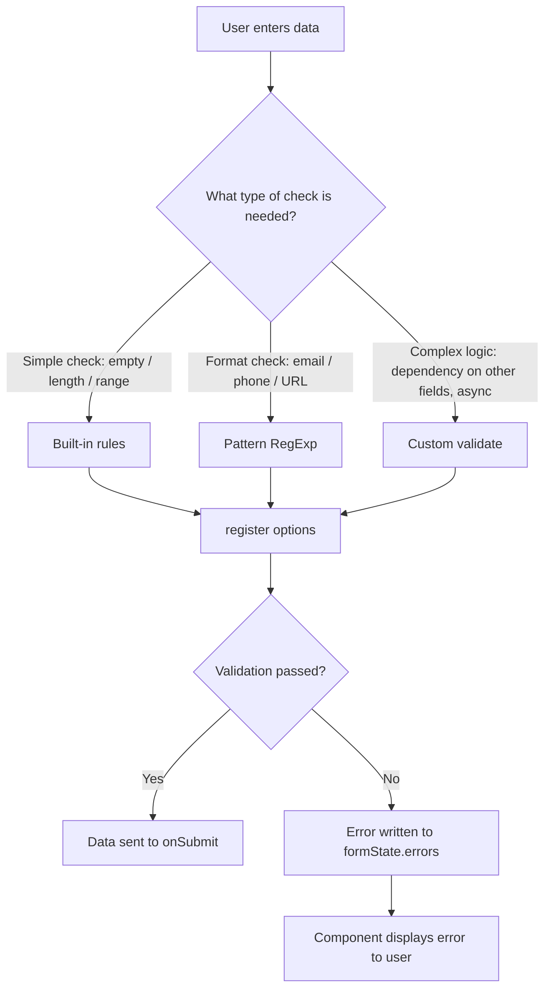
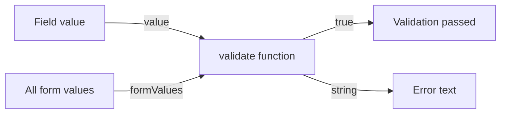
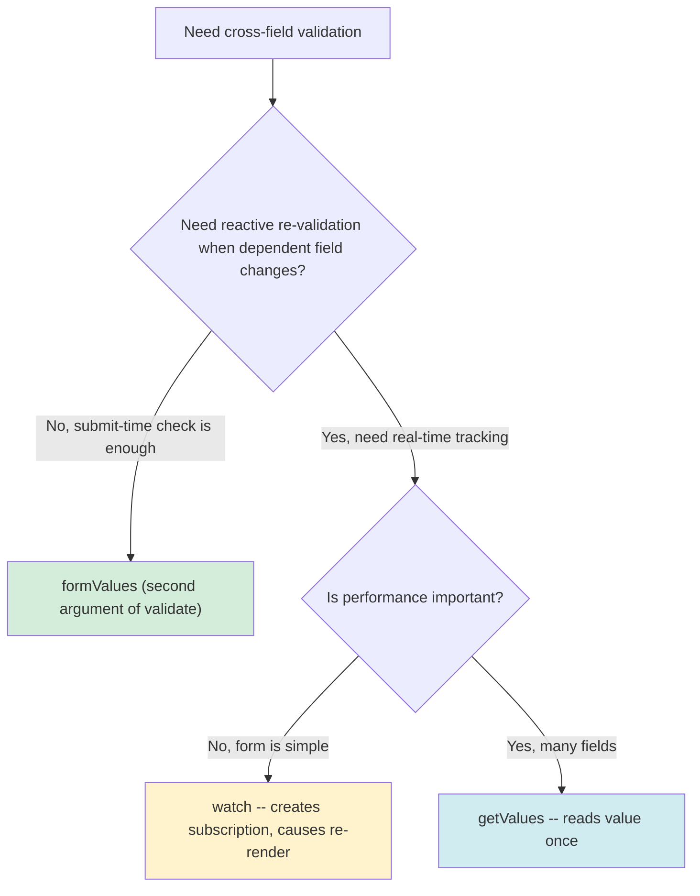
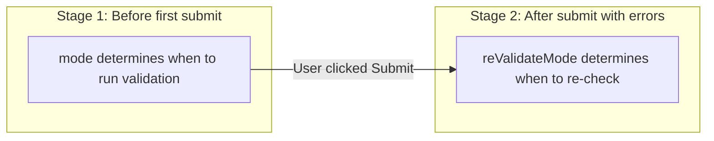

# Level 2: Validation -- Built-in, Patterns, Custom

## Introduction

Imagine a form as a door to your system. Each input field is a separate entrance through which data enters the application. Validation is the **guard at each entrance**, checking: "Can this value be allowed through?"

Without validation, a user could submit an empty string instead of an email, `-5` instead of age, or `abc` instead of a phone number. Server-side validation would catch this, but the user is already waiting for a server response, sees a confusing 400 error, and their form experience is ruined.

React Hook Form offers a multi-level validation system -- from simple built-in rules to fully custom functions. In this level, we'll cover each layer: when to apply it, how it works internally in RHF, and what pitfalls await you.



---

## 1. Built-in Validation Rules

Built-in rules are the first line of defense. They cover the most common validation scenarios and don't require writing custom logic. Each rule is passed as the second argument to `register` as part of the options object.

Mental model: think of built-in rules as **lock settings on a door**. You don't write the lock code manually -- you just specify parameters: "minimum key length -- 8 characters", "accept only keys of a certain format". RHF already knows how to check these rules.

### `required` -- Required Field

The most basic rule. It checks that the field is not empty before form submission. Under the hood, RHF checks that the value is not an empty string `""`, `undefined`, or `null`.

The `required` rule can be specified two ways:

- **Boolean `true`** -- field is required, but no error message is set (in `errors.field.message` there will be an empty string).
- **String** -- field is required, and this string becomes the error message. This is the preferred approach because the user needs feedback.

```tsx
// Minimal -- just marks as required, no message
<input {...register('email', { required: true })} />

// Preferred -- with a human-readable message
<input {...register('email', { required: 'Email is required for registration' })} />
```

In the first case, `errors.email.message` will be an empty string, and `errors.email.type` will be `"required"`. In the second case, `errors.email.message` will contain your text `"Email is required for registration"`.

**Important:** the `required` rule checks primitive values. If your field contains an array or object (e.g., multi-select), `required` won't work correctly -- use `validate` instead.

### `minLength` / `maxLength` -- String Length Constraints

These rules work with string value length. They're ideal for text inputs: username, description, comment.

Imagine a registration form where the username must be 3 to 20 characters. Without these rules, a user could register with the name `"a"` or paste a 1000-character string.

Each rule accepts an object with two fields:
- `value` -- numeric constraint (minimum or maximum length)
- `message` -- error text for the user

```tsx
<input
  {...register('username', {
    required: 'Username is required',
    minLength: {
      value: 3,
      message: 'Minimum 3 characters',
    },
    maxLength: {
      value: 20,
      message: 'Maximum 20 characters',
    },
  })}
/>
```

When a user types `"ab"` and tries to submit, RHF compares `"ab".length` (2) with `value: 3` -- the length is below minimum, so `errors.username` gets an error object with `type: "minLength"` and `message: "Minimum 3 characters"`.

### `min` / `max` -- Numeric Range Constraints

If `minLength` / `maxLength` check **string length**, then `min` / `max` check **numeric values**. This is important for `number` type fields -- age, quantity, price.

```tsx
<input
  type="number"
  {...register('age', {
    required: 'Age is required',
    valueAsNumber: true,
    min: {
      value: 18,
      message: 'Minimum 18 years',
    },
    max: {
      value: 120,
      message: 'Maximum 120 years',
    },
  })}
/>
```

Note `valueAsNumber: true` -- this is a `register` option that converts the input's string value to a number. Without it, a `type="number"` field value will still be the string `"25"`, not the number `25`. This can lead to unexpected comparison results: string `"9"` is greater than string `"100"` in lexicographic comparison.

### `pattern` -- Regular Expression Check

The `pattern` rule allows checking a field value against a regular expression. This is a bridge between simple built-in rules and fully custom validation -- you specify the format, and RHF checks for a match.

```tsx
<input
  {...register('email', {
    required: 'Email is required',
    pattern: {
      value: /^[A-Z0-9._%+-]+@[A-Z0-9.-]+\.[A-Z]{2,}$/i,
      message: 'Invalid email format',
    },
  })}
/>
```

Under the hood, RHF calls `regex.test(value)` and, if the result is `false`, records an error with `type: "pattern"`. The `i` flag at the end of the regex makes it case-insensitive -- without it, email `user@example.com` would fail validation because the pattern expects `[A-Z]` (uppercase letters).

### Built-in Rules Summary Table

| Rule | What it checks | Value type | Example |
|---------|--------------|-------------|--------|
| `required` | Field is not empty | `boolean \| string` | `required: 'Required'` |
| `minLength` | Minimum string length | `{ value, message }` | `minLength: { value: 3, message: '...' }` |
| `maxLength` | Maximum string length | `{ value, message }` | `maxLength: { value: 20, message: '...' }` |
| `min` | Minimum numeric value | `{ value, message }` | `min: { value: 0, message: '...' }` |
| `max` | Maximum numeric value | `{ value, message }` | `max: { value: 100, message: '...' }` |
| `pattern` | Regular expression match | `{ value, message }` | `pattern: { value: /.../, message: '...' }` |

---

## 2. Useful RegExp Patterns

Regular expressions are a powerful tool for data format validation. However, writing a good regex is not easy, and writing it wrong is very easy. Below are proven patterns for typical tasks, with a breakdown of **what exactly** each one checks.

**Tip:** extract patterns into separate constants at the top of the file or in a utility module. This improves readability, allows reuse, and simplifies testing.

### Email

```tsx
const emailPattern = /^[A-Z0-9._%+-]+@[A-Z0-9.-]+\.[A-Z]{2,}$/i
```

Breakdown:
- `^` -- start of string (email can't be part of another text)
- `[A-Z0-9._%+-]+` -- one or more characters before `@`: letters, digits, dot, underscore, percent, plus, hyphen
- `@` -- required separator character
- `[A-Z0-9.-]+` -- domain name: letters, digits, dot, hyphen
- `\.` -- dot before the domain extension (escaped because `.` in regex means "any character")
- `[A-Z]{2,}$` -- domain extension of at least 2 letters (ru, com, org, museum...)
- Flag `i` -- case-insensitivity

This pattern covers most real-world email addresses. For 100% RFC 5322 compliance, a significantly more complex regex would be needed, but in practice such precision isn't necessary -- the final email check happens anyway through sending a confirmation email.

### Russian Phone Number

```tsx
const phonePattern = /^\+7\s?\(?\d{3}\)?\s?\d{3}-?\d{2}-?\d{2}$/
```

This pattern flexibly accepts several formats:
- `\+7` -- starts with `+7` (`+` character is escaped)
- `\s?` -- optional space
- `\(?` and `\)?` -- optional parentheses around the operator code
- `\d{3}` -- exactly 3 digits (operator code)
- `-?` -- optional hyphen between digit groups

Valid examples: `+7 (999) 123-45-67`, `+7(999)123-45-67`, `+79991234567`.

### URL

```tsx
const urlPattern = /^https?:\/\/.+\..+$/
```

Simple pattern checking basic URL structure:
- `https?` -- `http` or `https` (`s` character is optional due to `?`)
- `:\/\/` -- required `://` (slashes are escaped)
- `.+` -- at least one any character (domain name)
- `\.` -- dot
- `.+$` -- at least one character after the dot (domain extension)

### HEX Color

```tsx
const hexPattern = /^#([A-Fa-f0-9]{6}|[A-Fa-f0-9]{3})$/
```

- `#` -- required hash character
- `[A-Fa-f0-9]{6}` -- 6 hex characters (full notation: `#3498db`)
- `|` -- or
- `[A-Fa-f0-9]{3}` -- 3 hex characters (short notation: `#FFF`)

### Slug (URL-friendly string)

```tsx
const slugPattern = /^[a-z0-9]+(?:-[a-z0-9]+)*$/
```

A slug is a human-readable URL identifier (e.g., `my-awesome-article`):
- `[a-z0-9]+` -- starts with one or more lowercase letters/digits
- `(?:-[a-z0-9]+)*` -- then zero or more groups of "hyphen + letters/digits"
- No spaces, uppercase letters, or special characters

### Password (complex)

```tsx
const passwordPattern = /^(?=.*[A-Z])(?=.*\d)(?=.*[!@#$%^&*]).{8,}$/
```

This pattern uses **lookahead** (`?=`) -- a "look ahead" mechanism:
- `(?=.*[A-Z])` -- somewhere in the string there's an uppercase letter
- `(?=.*\d)` -- somewhere there's a digit
- `(?=.*[!@#$%^&*])` -- somewhere there's a special character
- `.{8,}` -- total length of at least 8 characters

Each lookahead checks its condition independently, without "consuming" characters -- they all check the same string. That's why the order of characters in the password doesn't matter.

**In practice**, complex password validation is better implemented through `validate` with separate checks (section 3), so the user sees specific hints: "Add an uppercase letter", "Add a digit" -- instead of a general "Password doesn't meet requirements."

---

## 3. Custom Validation via `validate`

Built-in rules cover typical scenarios, but real forms often require logic that can't be expressed with a single `pattern` or `minLength`. For such cases, `register` accepts the `validate` option -- this is your **own guard**, for whom you write instructions in plain JavaScript.

The `validate` rule works **independently** of other validation rules. This means that even if `required` and `pattern` pass, `validate` will still execute and can block submission.

### Single Function

The simplest variant -- pass a single function to `validate`. It receives the current field value and must return:
- `true` -- validation passed
- string -- error text (validation failed)

This is like assigning one guard with one instruction: "Check everything on the list in order and tell me what's wrong."

```tsx
<input
  {...register('password', {
    required: 'Password is required',
    validate: (value) => {
      if (value.length < 8) return 'Minimum 8 characters'
      if (!/[A-Z]/.test(value)) return 'At least one uppercase letter required'
      if (!/\d/.test(value)) return 'At least one digit required'
      return true
    },
  })}
/>
```

With this approach, the function returns **the first error found**. If the password is `"abc"` -- the user will only see `"Minimum 8 characters"`, fix the length, and then see the next error. This can be frustrating. The solution is an object with multiple checks.

### Object with Multiple Checks

Instead of a single function, you can pass an object where each key is a check name, and the value is a validation function. Each function is called independently.

This is like putting **multiple guards**, each checking their own thing: one checks length, another checks for uppercase, a third checks for a digit.

```tsx
<input
  {...register('password', {
    required: 'Password is required',
    validate: {
      minLength: (v) => v.length >= 8 || 'Minimum 8 characters',
      uppercase: (v) => /[A-Z]/.test(v) || 'Must have an uppercase letter',
      number: (v) => /\d/.test(v) || 'Must have a digit',
      special: (v) => /[!@#$%^&*]/.test(v) || 'Must have a special character',
    },
  })}
/>
```

Note the pattern: `condition || 'error message'`. If the condition is true -- returns `true` (validation passed). If false -- returns the error string. This is a compact alternative to `if/return`.

By default, RHF stops at the **first** failed check from the object. To collect **all** errors at once, use `criteriaMode: 'all'` (covered in section 6).

### Access to Other Field Values (Second Argument `formValues`)

Starting from version 7, the `validate` function receives a **second argument** -- an object with all current form values. This is the most convenient way to implement cross-field validation without `watch` or `getValues`.

```tsx
<input
  {...register('confirmPassword', {
    validate: (value, formValues) =>
      value === formValues.password || 'Passwords do not match',
  })}
/>
```

In this example, `formValues.password` gives access to the current value of the `password` field without needing to call `watch` or `getValues`. This approach is simpler because it doesn't create a change subscription and doesn't require additional hooks.



---

## 4. Cross-field Validation (Dependency Between Fields)

Cross-field validation is when the correctness of one field depends on another's value. Typical real-world examples:

- **Password confirmation** -- confirmPassword must match password
- **Password change** -- new password must not match the old one
- **Date range** -- end date must be after start date
- **Promo code and amount** -- discount can't exceed order total

There are three approaches to implementing cross-field validation in RHF. The choice depends on whether you need reactive re-validation.

### Approach 1: `formValues` (second argument of validate) -- simplest

As we saw in section 3, the `validate` function receives all form values as the second argument. This is the **recommended approach** for most cases:

```tsx
<input
  {...register('confirmPassword', {
    required: 'Confirm your password',
    validate: (value, formValues) =>
      value === formValues.password || 'Passwords do not match',
  })}
/>
```

**Limitation:** `confirmPassword` validation will only trigger when `confirmPassword` itself changes. If the user first fills both fields, then goes back and changes `password` -- `confirmPassword` won't re-validate automatically. For most forms this is acceptable because users typically fill fields sequentially.

### Approach 2: `watch` -- Reactive Re-validation

If you need `confirmPassword` to re-validate on every `password` change, use `watch`:

```tsx
function RegistrationForm() {
  const {
    register,
    watch,
    handleSubmit,
    formState: { errors },
  } = useForm()

  const password = watch('password')

  return (
    <form onSubmit={handleSubmit(console.log)}>
      <input
        {...register('password', { required: 'Password is required' })}
      />

      <input
        {...register('confirmPassword', {
          required: 'Confirm your password',
          validate: {
            match: (v) => v === password || 'Passwords do not match',
          },
        })}
      />

      {errors.confirmPassword && (
        <span className="error">{errors.confirmPassword.message}</span>
      )}
    </form>
  )
}
```

`watch('password')` subscribes to changes in the `password` field. Every time `password` changes, the component re-renders, the `password` value updates, and on the next validation `confirmPassword` will be compared against the current value.

### Approach 3: `getValues` -- Without Subscription

`getValues` reads a field value **once** at the moment of validation, without creating a subscription. Suitable for forms where validation only triggers on submit:

```tsx
function ChangePasswordForm() {
  const { register, getValues, handleSubmit } = useForm()

  return (
    <form onSubmit={handleSubmit(console.log)}>
      <input {...register('currentPassword')} />

      <input
        {...register('newPassword', {
          validate: {
            different: (v) => {
              const current = getValues('currentPassword')
              return v !== current || 'New password must differ from current'
            },
          },
        })}
      />
    </form>
  )
}
```

### Which Approach to Choose?



---

## 5. Validation Modes: `mode` and `reValidateMode`

So far we've talked about **what** to validate. Now let's talk about **when**. React Hook Form lets you precisely configure when validation triggers through two `useForm` options: `mode` and `reValidateMode`.

### `mode` -- When to Run Validation for the First Time

The `mode` option determines on which event RHF first checks validation rules for each field. By default `mode: 'onSubmit'` -- validation only runs when the form is submitted.

```tsx
useForm({ mode: 'onSubmit' })   // default
useForm({ mode: 'onChange' })
useForm({ mode: 'onBlur' })
useForm({ mode: 'onTouched' })
useForm({ mode: 'all' })
```

Let's break down each mode:

**`onSubmit`** (default) -- validation triggers only when `handleSubmit` is called. The user fills the form without any error hints, clicks "Submit", and only then sees all problems at once. After the first submit, fields with errors start re-validating on every change (thanks to `reValidateMode`).

Suitable for: simple 2-4 field forms (login, feedback) where early hints aren't needed.

**`onChange`** -- validation runs on every field value change. The user starts typing -- and immediately sees that the password is too short. Fixed it -- the error disappears instantly.

**Performance warning:** `onChange` causes a component re-render on **every keystroke**. For a 5-field form this is unnoticeable. For a 50-field form -- it can be a problem.

Suitable for: forms with high UX requirements (registration, checkout) where instant feedback is critical.

**`onBlur`** -- validation runs when the user leaves the field (`blur` event). The user fills a field, moves to the next one -- and at that moment sees the previous field's error.

Suitable for: medium-complexity forms where feedback is needed without "pressure" on every character.

**`onTouched`** -- a hybrid of `onBlur` and `onChange`. First validation triggers on `blur` (leaving the field). After that, the field re-validates on every `onChange`. So the user doesn't see an error until they leave the field, but after that gets instant feedback when correcting.

Suitable for: most production forms -- a good balance between UX and performance.

**`all`** -- validation fires on both `blur` and `onChange` simultaneously. The strictest mode.

Suitable for: forms where data is critically important (financial operations, medical records).

### `reValidateMode` -- When to Re-validate After the First Error

`reValidateMode` controls how RHF re-validates fields **after the user has already submitted the form once** and received errors. This option only works together with `mode: 'onSubmit'`.

```tsx
useForm({
  mode: 'onSubmit',
  reValidateMode: 'onChange',  // default -- re-validate on every change
})

useForm({
  mode: 'onSubmit',
  reValidateMode: 'onBlur',   // re-validate on field blur
})

useForm({
  mode: 'onSubmit',
  reValidateMode: 'onSubmit',  // re-validate only on re-submission
})
```

The two-stage logic:
1. **Before first submit** -- validation is controlled by `mode`
2. **After first submit with errors** -- fields with errors re-validate according to `reValidateMode`



### Mode Selection Table

| Scenario | `mode` | `reValidateMode` | Why |
|----------|--------|-------------------|-----|
| Simple login form | `onSubmit` | `onChange` | Minimum noise, quick correction |
| Registration with password | `onTouched` | -- | Feedback after leaving field |
| Checkout | `onChange` | -- | Instant feedback |
| Long questionnaire | `onBlur` | -- | Don't distract during input |

**Tip:** start with `onSubmit` (default value). Complicate the validation mode only if UX testing shows users are struggling.

---

## 6. Displaying Errors

Validation is useless if the user can't see what went wrong. React Hook Form stores all validation errors in the `formState.errors` object. Let's understand how this object is structured and how to properly display errors.

### The `errors` Object Structure

When a field's validation fails, RHF creates an entry in `errors` by field name. Each entry is an object with properties:

- `type` -- the type of rule that failed (`"required"`, `"minLength"`, `"pattern"`, `"validate"`, or the key name from the `validate` object)
- `message` -- error text (if you specified one)
- `ref` -- reference to the field's DOM element (used for focusing on the error)

```tsx
// If username fails minLength validation:
errors.username = {
  type: 'minLength',
  message: 'Minimum 3 characters',
  ref: HTMLInputElement
}
```

When a field passes validation, its entry is **removed** from `errors`. This means checking `errors.fieldName` (truthiness check) is a reliable way to determine if there's an error.

### Basic Display

The most common pattern -- conditional rendering of error text under the field:

```tsx
<div className="form-group">
  <label htmlFor="email">Email</label>

  <input
    id="email"
    {...register('email', { required: 'Email is required' })}
    style={{ borderColor: errors.email ? '#dc3545' : '#ddd' }}
  />

  {errors.email && (
    <span style={{ color: '#dc3545', fontSize: '0.875rem' }}>
      {errors.email.message}
    </span>
  )}
</div>
```

Two things happen here: the field gets a red border on error, and error text appears below it. When the user corrects the value and the error is removed from `errors`, both visual indicators are automatically removed -- React re-renders the component with the updated `errors`.

### `criteriaMode: 'all'` -- Show All Errors at Once

By default, RHF stops at the **first** failed check and records only it in `errors.field.message`. This means that when validating a password with a `validate` object, the user will see errors one at a time: fixed the length -- got the uppercase letter error, fixed the letter -- got the digit error.

For better UX, you can show **all** errors at once by setting `criteriaMode: 'all'`:

```tsx
const {
  register,
  formState: { errors },
} = useForm({
  criteriaMode: 'all',
})
```

With `criteriaMode: 'all'`, the error object gets an additional `types` property -- an object containing **all** failed checks:

```tsx
// With criteriaMode: 'all', errors.password looks like:
{
  type: 'minLength',          // first failed rule (still present)
  message: 'Minimum 8 characters', // message of the first failed rule
  types: {
    minLength: 'Minimum 8 characters',
    uppercase: 'Must have an uppercase letter',
    number: 'Must have a digit',
  }
}
```

Displaying all errors:

```tsx
<input
  {...register('password', {
    validate: {
      minLength: (v) => v.length >= 8 || 'Minimum 8 characters',
      uppercase: (v) => /[A-Z]/.test(v) || 'Must have an uppercase letter',
      number: (v) => /\d/.test(v) || 'Must have a digit',
    },
  })}
/>

{errors.password?.types && (
  <ul style={{ color: '#dc3545', fontSize: '0.875rem' }}>
    {Object.entries(errors.password.types).map(([key, message]) => (
      <li key={key}>{message}</li>
    ))}
  </ul>
)}
```

Now the user immediately sees the full list of password requirements and can fix everything in one go.

### Typing `errors` in TypeScript

If you're using `useForm<FormData>()`, the `errors` object is automatically typed as `FieldErrors<FormData>`. This gives you autocomplete and type safety when accessing errors:

```tsx
const {
  formState: { errors },
} = useForm<FormData>()

// TypeScript knows errors.email exists and has a message property
errors.email?.message  // OK
errors.nonExistent?.message  // TypeScript error
```

---

## Common Beginner Mistakes

### Mistake 1: Using `pattern` without the `i` flag for case-insensitive matching

```tsx
// Bad -- will reject user@example.com because of lowercase letters
pattern: {
  value: /^[A-Z0-9._%+-]+@[A-Z0-9.-]+\.[A-Z]{2,}$/,
  message: 'Invalid email'
}

// Good -- the i flag makes it case-insensitive
pattern: {
  value: /^[A-Z0-9._%+-]+@[A-Z0-9.-]+\.[A-Z]{2,}$/i,
  message: 'Invalid email'
}
```

**Why this is a problem:** Without the `i` flag, the character class `[A-Z]` only matches uppercase letters. An email like `user@example.com` would fail because `user` and `com` contain lowercase letters.

---

### Mistake 2: Forgetting that `validate` object stops at first error by default

```tsx
// Bad -- user sees only one error at a time
validate: {
  minLength: (v) => v.length >= 8 || 'Minimum 8 characters',
  uppercase: (v) => /[A-Z]/.test(v) || 'Need uppercase',
  number: (v) => /\d/.test(v) || 'Need a digit',
}

// Good -- use criteriaMode: 'all' to show all errors
useForm({ criteriaMode: 'all' })
```

**Why this is a problem:** By default, RHF stops at the first failed check in the `validate` object. The user fixes one issue, only to discover the next. With `criteriaMode: 'all'`, they see all problems at once.

---

### Mistake 3: Not providing error messages

```tsx
// Bad -- user sees technical error type
required: true,
minLength: 3

// Good -- user-friendly messages
required: 'This field is required',
minLength: { value: 3, message: 'Minimum 3 characters' }
```

**Why this is a problem:** Without custom messages, RHF displays technical type names like `"required"` or `"minLength"` instead of helpful instructions. Users don't know what `"minLength"` means.

---

### Mistake 4: Mixing register validation with resolver validation

```tsx
// Bad -- rules in register are ignored when resolver is present
const { register } = useForm({
  resolver: zodResolver(schema),
})

<input {...register('email', { required: 'Required' })} />
// The required rule will be IGNORED -- validation goes through Zod

// Good -- all rules in the schema
const schema = z.object({
  email: z.string().min(1, 'Required').email('Invalid email'),
})

const { register } = useForm({
  resolver: zodResolver(schema),
})

<input {...register('email')} />
```

**Why this is a problem:** When a `resolver` is used, React Hook Form **fully delegates validation** to the resolver. Rules passed as the second argument to `register` simply don't work. This doesn't cause an error -- they're silently ignored, which is especially tricky: you think the field is being validated, but it isn't.

---

### Mistake 5: Using `validate` with arrow function when `this` access is needed (Yup-specific)

```tsx
// Bad -- arrow function doesn't have its own this
.test('check', 'Error', (value) => {
  const other = this.parent.otherField // ERROR: this === undefined
})

// Good -- regular function for this access
.test('check', 'Error', function(value) {
  const other = this.parent.otherField
  return value !== other
})
```

**Why this is a problem:** Arrow functions inherit `this` from the outer scope, where `parent` is undefined. This is a fundamental JavaScript property, not a Yup quirk. Note: this applies to Yup, not Zod. In Zod, cross-field validation uses the second argument `formValues` instead.

---

## Additional Resources

- [register validation options](https://react-hook-form.com/docs/useform/register)
- [formState.errors](https://react-hook-form.com/docs/useform/formstate)
- [criteriaMode](https://react-hook-form.com/docs/useform#criteriaMode)
- [MDN: Regular Expressions](https://developer.mozilla.org/en-US/docs/Web/JavaScript/Guide/Regular_Expressions)
