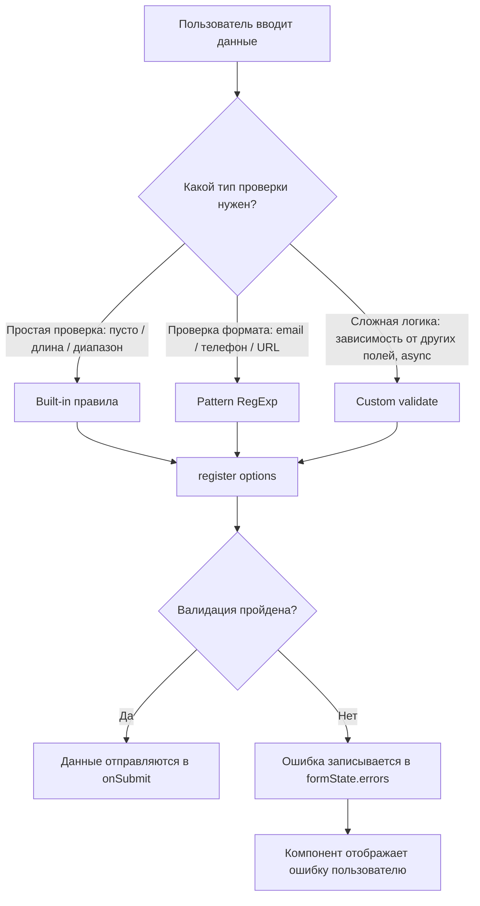
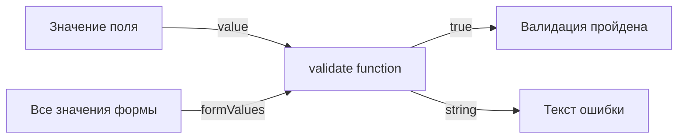
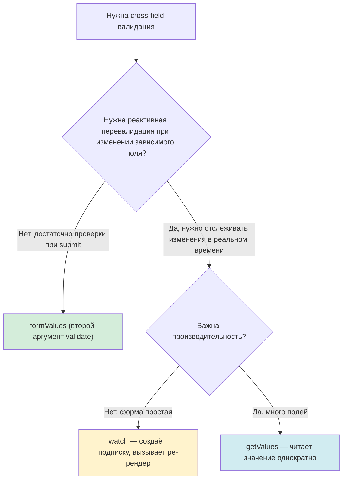
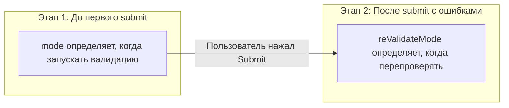

# Уровень 2: Валидация — Built-in, Patterns, Custom

## Введение

Представьте, что форма — это дверь в вашу систему. Каждое поле ввода — отдельный вход, через который данные попадают внутрь приложения. Валидация — это **охранник на каждом входе**, который проверяет: «А можно ли этому значению пройти дальше?»

Без валидации пользователь может отправить пустую строку вместо email, число `-5` вместо возраста или `abc` вместо телефона. Серверная валидация поймает это, но пользователь уже ждёт ответа от сервера, видит непонятную ошибку 400, и его опыт взаимодействия с формой испорчен.

React Hook Form предлагает многоуровневую систему валидации — от простых встроенных правил до полностью кастомных функций. В этом уровне мы разберём каждый слой этой системы: когда его применять, как он работает внутри RHF, и какие подводные камни вас ожидают.



---

## 1. Built-in правила валидации

Built-in правила — это первая линия обороны. Они покрывают самые частые сценарии валидации и не требуют написания кастомной логики. Каждое правило передаётся вторым аргументом в функцию `register` как часть объекта опций.

Ментальная модель: думайте о built-in правилах как о **настройках замка на двери**. Вы не пишете код замка вручную — просто указываете параметры: «минимальная длина ключа — 8 символов», «принимать только ключи определённого формата». RHF уже знает, как эти правила проверять.

### `required` — обязательное поле

Самое базовое правило. Оно проверяет, что поле не пустое перед отправкой формы. Под капотом RHF проверяет, что значение не равно пустой строке `""`, `undefined` или `null`.

Правило `required` можно задать двумя способами:

- **Булево значение `true`** — поле обязательно, но сообщение об ошибке не задаётся (в `errors.field.message` будет пустая строка).
- **Строка** — поле обязательно, и эта строка становится сообщением об ошибке. Это предпочтительный способ, потому что пользователю нужна обратная связь.

```tsx
// Minimal — just marks as required, no message
<input {...register('email', { required: true })} />

// Preferred — with a human-readable message
<input {...register('email', { required: 'Email обязателен для регистрации' })} />
```

В первом случае `errors.email.message` будет пустой строкой, а `errors.email.type` будет `"required"`. Во втором случае `errors.email.message` будет содержать ваш текст `"Email обязателен для регистрации"`.

📌 **Важно:** правило `required` проверяет примитивные значения. Если ваше поле содержит массив или объект (например, мультиселект), `required` не сработает корректно — используйте `validate` вместо него.

### `minLength` / `maxLength` — ограничение длины строки

Эти правила работают с длиной строкового значения поля. Они идеально подходят для текстовых инпутов: имя пользователя, описание, комментарий.

Представьте форму регистрации, где username должен быть от 3 до 20 символов. Без этих правил пользователь мог бы зарегистрироваться с именем `"a"` или вставить строку из 1000 символов.

Каждое правило принимает объект с двумя полями:
- `value` — числовое ограничение (минимальная или максимальная длина)
- `message` — текст ошибки для пользователя

```tsx
<input
  {...register('username', {
    required: 'Username обязателен',
    minLength: {
      value: 3,
      message: 'Минимум 3 символа',
    },
    maxLength: {
      value: 20,
      message: 'Максимум 20 символов',
    },
  })}
/>
```

Когда пользователь вводит `"ab"` и пытается отправить форму, RHF сравнивает `"ab".length` (2) с `value: 3` — длина меньше минимальной, поэтому в `errors.username` появляется объект ошибки с `type: "minLength"` и `message: "Минимум 3 символа"`.

### `min` / `max` — ограничение числового диапазона

Если `minLength` / `maxLength` проверяют **длину строки**, то `min` / `max` проверяют **числовое значение**. Это важно для полей с типом `number` — возраст, количество, цена.

```tsx
<input
  type="number"
  {...register('age', {
    required: 'Возраст обязателен',
    valueAsNumber: true,
    min: {
      value: 18,
      message: 'Минимум 18 лет',
    },
    max: {
      value: 120,
      message: 'Максимум 120 лет',
    },
  })}
/>
```

Обратите внимание на `valueAsNumber: true` — это опция `register`, которая преобразует строковое значение инпута в число. Без неё значение поля `type="number"` всё равно будет строкой `"25"`, а не числом `25`. Это может привести к неожиданным результатам при сравнении: строка `"9"` больше строки `"100"` при лексикографическом сравнении.

### `pattern` — проверка по регулярному выражению

Правило `pattern` позволяет проверить значение поля на соответствие регулярному выражению. Это мост между простыми built-in правилами и полностью кастомной валидацией — вы задаёте формат, а RHF проверяет совпадение.

```tsx
<input
  {...register('email', {
    required: 'Email обязателен',
    pattern: {
      value: /^[A-Z0-9._%+-]+@[A-Z0-9.-]+\.[A-Z]{2,}$/i,
      message: 'Неверный формат email',
    },
  })}
/>
```

Под капотом RHF вызывает `regex.test(value)` и, если результат `false`, записывает ошибку с `type: "pattern"`. Флаг `i` в конце регулярного выражения делает его регистронезависимым — без него email `user@example.com` не пройдёт проверку, потому что паттерн ожидает `[A-Z]` (заглавные буквы).

### Сводная таблица built-in правил

| Правило | Что проверяет | Тип значения | Пример |
|---------|--------------|-------------|--------|
| `required` | Поле не пустое | `boolean \| string` | `required: 'Обязательно'` |
| `minLength` | Минимальная длина строки | `{ value, message }` | `minLength: { value: 3, message: '...' }` |
| `maxLength` | Максимальная длина строки | `{ value, message }` | `maxLength: { value: 20, message: '...' }` |
| `min` | Минимальное числовое значение | `{ value, message }` | `min: { value: 0, message: '...' }` |
| `max` | Максимальное числовое значение | `{ value, message }` | `max: { value: 100, message: '...' }` |
| `pattern` | Соответствие регулярному выражению | `{ value, message }` | `pattern: { value: /.../, message: '...' }` |

---

## 2. Полезные RegExp паттерны

Регулярные выражения — мощный инструмент для проверки формата данных. Однако написать хороший regex непросто, а написать его неправильно — очень легко. Ниже приведены проверенные паттерны для типичных задач, с разбором того, **что именно** проверяет каждый из них.

💡 **Совет:** выносите паттерны в отдельные константы в начале файла или в утилитарный модуль. Это улучшает читаемость, позволяет переиспользовать их и упрощает тестирование.

### Email

```tsx
const emailPattern = /^[A-Z0-9._%+-]+@[A-Z0-9.-]+\.[A-Z]{2,}$/i
```

Разберём по частям:
- `^` — начало строки (email не может быть частью другого текста)
- `[A-Z0-9._%+-]+` — один или больше символов до `@`: буквы, цифры, точка, подчёркивание, процент, плюс, дефис
- `@` — обязательный символ-разделитель
- `[A-Z0-9.-]+` — доменное имя: буквы, цифры, точка, дефис
- `\.` — точка перед доменной зоной (экранирована, потому что `.` в regex означает «любой символ»)
- `[A-Z]{2,}$` — доменная зона минимум из 2 букв (ru, com, org, museum...)
- Флаг `i` — регистронезависимость

📌 Этот паттерн покрывает большинство реальных email-адресов. Для 100% соответствия стандарту RFC 5322 потребовался бы значительно более сложный regex, но на практике такая точность не нужна — финальная проверка email всё равно происходит через отправку письма с подтверждением.

### Российский телефон

```tsx
const phonePattern = /^\+7\s?\(?\d{3}\)?\s?\d{3}-?\d{2}-?\d{2}$/
```

Этот паттерн гибко принимает несколько форматов записи:
- `\+7` — начинается с `+7` (символ `+` экранирован)
- `\s?` — опциональный пробел
- `\(?` и `\)?` — опциональные скобки вокруг кода оператора
- `\d{3}` — ровно 3 цифры (код оператора)
- `-?` — опциональный дефис между группами цифр

Валидные примеры: `+7 (999) 123-45-67`, `+7(999)123-45-67`, `+79991234567`.

### URL

```tsx
const urlPattern = /^https?:\/\/.+\..+$/
```

Простой паттерн, проверяющий базовую структуру URL:
- `https?` — `http` или `https` (символ `s` опционален благодаря `?`)
- `:\/\/` — обязательный `://` (слеши экранированы)
- `.+` — хотя бы один любой символ (доменное имя)
- `\.` — точка
- `.+$` — хотя бы один символ после точки (доменная зона)

### HEX цвет

```tsx
const hexPattern = /^#([A-Fa-f0-9]{6}|[A-Fa-f0-9]{3})$/
```

- `#` — обязательный символ решётки
- `[A-Fa-f0-9]{6}` — 6 символов hex (полная запись: `#3498db`)
- `|` — или
- `[A-Fa-f0-9]{3}` — 3 символа hex (сокращённая запись: `#FFF`)

### Slug (URL-friendly строка)

```tsx
const slugPattern = /^[a-z0-9]+(?:-[a-z0-9]+)*$/
```

Slug — это человекочитаемый идентификатор для URL (например, `my-awesome-article`):
- `[a-z0-9]+` — начинается с одной или более строчных букв/цифр
- `(?:-[a-z0-9]+)*` — далее ноль или более групп «дефис + буквы/цифры»
- Никаких пробелов, заглавных букв или спецсимволов

### Пароль (сложный)

```tsx
const passwordPattern = /^(?=.*[A-Z])(?=.*\d)(?=.*[!@#$%^&*]).{8,}$/
```

Этот паттерн использует **lookahead** (`?=`) — механизм «заглядывания вперёд»:
- `(?=.*[A-Z])` — где-то в строке есть заглавная буква
- `(?=.*\d)` — где-то есть цифра
- `(?=.*[!@#$%^&*])` — где-то есть спецсимвол
- `.{8,}` — общая длина не менее 8 символов

Каждый lookahead проверяет условие независимо, не «съедая» символы — они все проверяются на одной и той же строке. Именно поэтому порядок символов в пароле не важен.

⚠️ **На практике** валидацию сложных паролей лучше реализовать через `validate` с отдельными проверками (раздел 3), чтобы показать пользователю конкретные подсказки: «Добавьте заглавную букву», «Добавьте цифру» — вместо общего «Пароль не соответствует требованиям».

---

## 3. Custom валидация через `validate`

Built-in правила покрывают типовые сценарии, но реальные формы часто требуют логики, которую нельзя выразить одним `pattern` или `minLength`. Для таких случаев `register` принимает опцию `validate` — это ваш **собственный охранник**, которому вы пишете инструкцию на чистом JavaScript.

Правило `validate` работает **независимо** от остальных правил валидации. Это означает, что даже если `required` и `pattern` пройдены, `validate` всё равно выполнится и может заблокировать отправку.

### Одиночная функция

Самый простой вариант — передать в `validate` одну функцию. Она получает текущее значение поля и должна вернуть:
- `true` — валидация пройдена
- строку — текст ошибки (валидация провалена)

Это как назначить одного охранника с одной инструкцией: «Проверь по списку всё по порядку и скажи, что не так».

```tsx
<input
  {...register('password', {
    required: 'Пароль обязателен',
    validate: (value) => {
      if (value.length < 8) return 'Минимум 8 символов'
      if (!/[A-Z]/.test(value)) return 'Нужна хотя бы одна заглавная буква'
      if (!/\d/.test(value)) return 'Нужна хотя бы одна цифра'
      return true
    },
  })}
/>
```

При таком подходе функция возвращает **первую найденную ошибку**. Если пароль `"abc"` — пользователь увидит только `"Минимум 8 символов"`, исправит длину, и только тогда увидит следующую ошибку. Это может раздражать. Решение — объект с несколькими проверками.

### Объект с несколькими проверками

Вместо одной функции можно передать объект, где каждый ключ — это имя проверки, а значение — функция валидации. Каждая функция вызывается независимо.

Это как поставить **нескольких охранников**, каждый из которых проверяет своё: один — длину, другой — наличие заглавной буквы, третий — наличие цифры.

```tsx
<input
  {...register('password', {
    required: 'Пароль обязателен',
    validate: {
      minLength: (v) => v.length >= 8 || 'Минимум 8 символов',
      uppercase: (v) => /[A-Z]/.test(v) || 'Должна быть заглавная буква',
      number: (v) => /\d/.test(v) || 'Должна быть цифра',
      special: (v) => /[!@#$%^&*]/.test(v) || 'Должен быть спецсимвол',
    },
  })}
/>
```

Обратите внимание на паттерн: `condition || 'error message'`. Если условие истинно — возвращается `true` (валидация пройдена). Если ложно — возвращается строка ошибки. Это компактная альтернатива `if/return`.

По умолчанию RHF остановится на **первой** проваленной проверке из объекта. Чтобы собрать **все** ошибки одновременно, используйте `criteriaMode: 'all'` (об этом в разделе 6).

### Доступ к значениям других полей (второй аргумент `formValues`)

Начиная с версии 7, функция `validate` получает **второй аргумент** — объект со всеми текущими значениями формы. Это самый удобный способ реализовать кросс-полевую валидацию без `watch` или `getValues`.

```tsx
<input
  {...register('confirmPassword', {
    validate: (value, formValues) =>
      value === formValues.password || 'Пароли не совпадают',
  })}
/>
```

В этом примере `formValues.password` даёт доступ к текущему значению поля `password` без необходимости вызывать `watch` или `getValues`. Этот подход проще, потому что не создаёт подписку на изменения и не требует дополнительных хуков.



---

## 4. Cross-field валидация (зависимость между полями)

Cross-field валидация — это ситуация, когда корректность одного поля зависит от значения другого. Типичные примеры из реальных приложений:

- **Подтверждение пароля** — confirmPassword должен совпадать с password
- **Смена пароля** — новый пароль не должен совпадать со старым
- **Диапазон дат** — дата окончания должна быть позже даты начала
- **Промокод и сумма** — скидка не может быть больше суммы заказа

Есть три подхода к реализации cross-field валидации в RHF. Выбор зависит от того, нужна ли вам реактивная перевалидация.

### Подход 1: `formValues` (второй аргумент validate) — самый простой

Как мы видели в разделе 3, функция `validate` получает все значения формы вторым аргументом. Это **рекомендуемый подход** для большинства случаев:

```tsx
<input
  {...register('confirmPassword', {
    required: 'Подтвердите пароль',
    validate: (value, formValues) =>
      value === formValues.password || 'Пароли не совпадают',
  })}
/>
```

⚠️ **Ограничение:** валидация `confirmPassword` запустится только при изменении самого `confirmPassword`. Если пользователь сначала заполнил оба поля, а потом вернулся и изменил `password` — поле `confirmPassword` не перевалидируется автоматически. Для большинства форм это приемлемо, потому что пользователь обычно заполняет поля последовательно.

### Подход 2: `watch` — реактивная перевалидация

Если вам нужно, чтобы `confirmPassword` перевалидировался при каждом изменении `password`, используйте `watch`:

```tsx
function RegistrationForm() {
  const {
    register,
    watch,
    handleSubmit,
    formState: { errors },
  } = useForm()

  const password = watch('password')

  return (
    <form onSubmit={handleSubmit(console.log)}>
      <input
        {...register('password', { required: 'Пароль обязателен' })}
      />

      <input
        {...register('confirmPassword', {
          required: 'Подтвердите пароль',
          validate: {
            match: (v) => v === password || 'Пароли не совпадают',
          },
        })}
      />

      {errors.confirmPassword && (
        <span className="error">{errors.confirmPassword.message}</span>
      )}
    </form>
  )
}
```

`watch('password')` подписывается на изменения поля `password`. Каждый раз, когда `password` меняется, компонент перерендеривается, значение `password` обновляется, и при следующей валидации `confirmPassword` будет сравниваться с актуальным значением.

### Подход 3: `getValues` — без подписки

`getValues` читает значение поля **однократно** в момент вызова валидации, не создавая подписку. Подходит для форм, где валидация запускается только при submit:

```tsx
function ChangePasswordForm() {
  const { register, getValues, handleSubmit } = useForm()

  return (
    <form onSubmit={handleSubmit(console.log)}>
      <input {...register('currentPassword')} />

      <input
        {...register('newPassword', {
          validate: {
            different: (v) => {
              const current = getValues('currentPassword')
              return v !== current || 'Новый пароль должен отличаться от текущего'
            },
          },
        })}
      />
    </form>
  )
}
```

### Какой подход выбрать?



---

## 5. Режимы валидации: `mode` и `reValidateMode`

До сих пор мы говорили о **что** валидировать. Теперь поговорим о **когда**. React Hook Form позволяет точно настроить момент запуска валидации через две опции `useForm`: `mode` и `reValidateMode`.

### `mode` — когда запустить валидацию в первый раз

Опция `mode` определяет, при каком событии RHF впервые проверит правила валидации для каждого поля. По умолчанию `mode: 'onSubmit'` — валидация запускается только при попытке отправить форму.

```tsx
useForm({ mode: 'onSubmit' })   // default
useForm({ mode: 'onChange' })
useForm({ mode: 'onBlur' })
useForm({ mode: 'onTouched' })
useForm({ mode: 'all' })
```

Разберём каждый режим подробно:

**`onSubmit`** (по умолчанию) — валидация срабатывает только при вызове `handleSubmit`. Пользователь заполняет форму без каких-либо подсказок об ошибках, нажимает кнопку «Отправить», и только тогда видит все проблемы разом. После первого submit, поля с ошибками начинают перевалидироваться при каждом изменении (благодаря `reValidateMode`).

Подходит для: простых форм на 2-4 поля (логин, обратная связь), где ранние подсказки не нужны.

**`onChange`** — валидация запускается при каждом изменении значения поля. Пользователь начал печатать — и сразу видит, что пароль слишком короткий. Исправил — ошибка мгновенно исчезает.

⚠️ **Предупреждение о производительности:** `onChange` вызывает ре-рендер компонента при **каждом нажатии клавиши**. Для формы с 5 полями это незаметно. Для формы с 50 полями — может быть проблемой.

Подходит для: форм с высокими требованиями к UX (регистрация, оформление заказа), где мгновенная обратная связь критична.

**`onBlur`** — валидация запускается, когда пользователь покидает поле (событие `blur`). Пользователь заполнил поле, перешёл к следующему — и в этот момент видит ошибку предыдущего.

Подходит для: форм средней сложности, где нужна обратная связь, но без «давления» при каждом символе.

**`onTouched`** — гибрид `onBlur` и `onChange`. Первая валидация срабатывает при `blur` (покидании поля). После этого поле перевалидируется при каждом `onChange`. То есть пользователь не видит ошибку, пока не покинет поле, но после этого получает мгновенную обратную связь при исправлении.

Подходит для: большинства продакшн-форм — хороший баланс между UX и производительностью.

**`all`** — валидация срабатывает и при `blur`, и при `onChange` одновременно. Самый строгий режим.

Подходит для: форм, где данные критически важны (финансовые операции, медицинские записи).

### `reValidateMode` — когда перепроверять после первой ошибки

`reValidateMode` управляет тем, как RHF перевалидирует поля **после того, как пользователь уже один раз отправил форму** и получил ошибки. Эта опция работает только совместно с `mode: 'onSubmit'`.

```tsx
useForm({
  mode: 'onSubmit',
  reValidateMode: 'onChange',  // default — перепроверять при каждом изменении
})

useForm({
  mode: 'onSubmit',
  reValidateMode: 'onBlur',   // перепроверять при покидании поля
})

useForm({
  mode: 'onSubmit',
  reValidateMode: 'onSubmit',  // перепроверять только при повторной отправке
})
```

Логика двухэтапная:
1. **До первого submit** — валидация управляется `mode`
2. **После первого submit** — поля с ошибками перевалидируются по правилам `reValidateMode`



### Таблица выбора режима

| Сценарий | `mode` | `reValidateMode` | Почему |
|----------|--------|-------------------|--------|
| Простая форма логина | `onSubmit` | `onChange` | Минимум шума, быстрое исправление |
| Регистрация с паролем | `onTouched` | — | Обратная связь после покидания поля |
| Оформление заказа | `onChange` | — | Мгновенная обратная связь |
| Длинная анкета | `onBlur` | — | Не отвлекать при вводе |

💡 **Совет:** начните с `onSubmit` (значение по умолчанию). Усложняйте режим валидации только если UX-тестирование покажет, что пользователи испытывают затруднения.

---

## 6. Отображение ошибок

Валидация бесполезна, если пользователь не видит, что пошло не так. React Hook Form хранит все ошибки валидации в объекте `formState.errors`. Давайте разберёмся, как этот объект устроен и как правильно показывать ошибки.

### Структура объекта `errors`

Когда валидация поля проваливается, RHF создаёт запись в `errors` по имени поля. Каждая запись — это объект со свойствами:

- `type` — тип правила, которое провалилось (`"required"`, `"minLength"`, `"pattern"`, `"validate"`, или имя ключа из объекта `validate`)
- `message` — текст ошибки (если вы его указали)
- `ref` — ссылка на DOM-элемент поля (используется для фокуса на ошибке)

```tsx
// If username fails minLength validation:
errors.username = {
  type: 'minLength',
  message: 'Минимум 3 символа',
  ref: HTMLInputElement
}
```

Когда поле проходит валидацию, его запись **удаляется** из `errors`. Это значит, что проверка `errors.fieldName` (truthiness check) — надёжный способ определить, есть ли ошибка.

### Базовое отображение

Самый распространённый паттерн — условный рендеринг текста ошибки под полем:

```tsx
<div className="form-group">
  <label htmlFor="email">Email</label>

  <input
    id="email"
    {...register('email', { required: 'Email обязателен' })}
    style={{ borderColor: errors.email ? '#dc3545' : '#ddd' }}
  />

  {errors.email && (
    <span style={{ color: '#dc3545', fontSize: '0.875rem' }}>
      {errors.email.message}
    </span>
  )}
</div>
```

Здесь происходят две вещи: поле получает красную рамку при ошибке и под ним появляется текст ошибки. Когда пользователь исправляет значение и ошибка исчезает из `errors`, оба визуальных индикатора убираются автоматически — React перерендерит компонент с обновлённым `errors`.

### `criteriaMode: 'all'` — показать все ошибки одновременно

По умолчанию RHF останавливается на **первой** проваленной проверке и записывает только её в `errors.field.message`. Это означает, что при валидации пароля с объектом `validate` пользователь будет видеть ошибки по одной: исправил длину — появилась ошибка про заглавную букву, исправил букву — появилась ошибка про цифру.

Для лучшего UX можно показать **все** ошибки сразу, установив `criteriaMode: 'all'`:

```tsx
const {
  register,
  formState: { errors },
} = useForm({
  criteriaMode: 'all',
})
```

При `criteriaMode: 'all'` в объекте ошибки появляется дополнительное свойство `types` — объект, содержащий **все** провалившиеся проверки:

```tsx
// With criteriaMode: 'all', errors.password looks like:
{
  type: 'minLength',          // first failed rule (still present)
  message: 'Минимум 8 символов', // message of the first failed rule
  types: {
    minLength: 'Минимум 8 символов',
    uppercase: 'Должна быть заглавная буква',
    number: 'Должна быть цифра',
  }
}
```

Отображение всех ошибок:

```tsx
<input
  {...register('password', {
    validate: {
      minLength: (v) => v.length >= 8 || 'Минимум 8 символов',
      uppercase: (v) => /[A-Z]/.test(v) || 'Должна быть заглавная буква',
      number: (v) => /\d/.test(v) || 'Должна быть цифра',
    },
  })}
/>

{errors.password?.types && (
  <ul style={{ color: '#dc3545', fontSize: '0.875rem' }}>
    {Object.entries(errors.password.types).map(([key, message]) => (
      <li key={key}>{message}</li>
    ))}
  </ul>
)}
```

Теперь пользователь сразу видит полный список требований к паролю и может исправить всё за один подход.

### Типизация `errors` в TypeScript

Если вы используете `useForm<FormType>()` с дженериком, объект `errors` будет типизирован автоматически. Это значит, что `errors.username` существует только если `username` есть в `FormType`, а `errors.nonexistent` вызовет ошибку компиляции.

```tsx
interface LoginForm {
  email: string
  password: string
}

const { formState: { errors } } = useForm<LoginForm>()

errors.email?.message    // OK — email is in LoginForm
errors.password?.message // OK — password is in LoginForm
// errors.name?.message  // TypeScript error — name is not in LoginForm
```

Это одно из ключевых преимуществ RHF по сравнению с ручным управлением ошибками — типы синхронизированы с вашей формой автоматически.

---

## 7. Полный пример: форма регистрации с валидацией

Соберём всё вместе в реалистичном примере — форме регистрации, которая использует built-in правила, паттерны, кастомную валидацию и отображение ошибок:

```tsx
import { useForm } from 'react-hook-form'

interface RegistrationForm {
  username: string
  email: string
  age: number
  password: string
}

export function RegistrationForm() {
  const {
    register,
    handleSubmit,
    formState: { errors, isValid, isSubmitting },
  } = useForm<RegistrationForm>({
    mode: 'onTouched',
  })

  const onSubmit = (data: RegistrationForm) => {
    console.log('Registered:', data)
  }

  return (
    <form onSubmit={handleSubmit(onSubmit)}>
      {/* Built-in: required + minLength + maxLength */}
      <div>
        <label>Username</label>
        <input
          {...register('username', {
            required: 'Username обязателен',
            minLength: { value: 3, message: 'Минимум 3 символа' },
            maxLength: { value: 20, message: 'Максимум 20 символов' },
          })}
        />
        {errors.username && (
          <span className="error">{errors.username.message}</span>
        )}
      </div>

      {/* Built-in: required + pattern */}
      <div>
        <label>Email</label>
        <input
          type="email"
          {...register('email', {
            required: 'Email обязателен',
            pattern: {
              value: /^[^\s@]+@[^\s@]+\.[^\s@]+$/,
              message: 'Неверный формат email',
            },
          })}
        />
        {errors.email && (
          <span className="error">{errors.email.message}</span>
        )}
      </div>

      {/* Built-in: required + min + max + valueAsNumber */}
      <div>
        <label>Возраст</label>
        <input
          type="number"
          {...register('age', {
            valueAsNumber: true,
            required: 'Возраст обязателен',
            min: { value: 18, message: 'Минимум 18 лет' },
            max: { value: 120, message: 'Максимум 120 лет' },
          })}
        />
        {errors.age && (
          <span className="error">{errors.age.message}</span>
        )}
      </div>

      {/* Built-in + custom validate */}
      <div>
        <label>Пароль</label>
        <input
          type="password"
          {...register('password', {
            required: 'Пароль обязателен',
            minLength: { value: 8, message: 'Минимум 8 символов' },
            validate: {
              uppercase: (v) =>
                /[A-Z]/.test(v) || 'Нужна заглавная буква',
              number: (v) =>
                /\d/.test(v) || 'Нужна цифра',
            },
          })}
        />
        {errors.password && (
          <span className="error">{errors.password.message}</span>
        )}
      </div>

      <button type="submit" disabled={!isValid || isSubmitting}>
        {isSubmitting ? 'Отправка...' : 'Зарегистрироваться'}
      </button>
    </form>
  )
}
```

В этом примере каждое поле использует свой уровень валидации:
- **username** — только built-in правила (required + длина)
- **email** — built-in + pattern (формат через регулярное выражение)
- **age** — built-in с числовым диапазоном + `valueAsNumber`
- **password** — built-in + custom validate (комбинация встроенных и кастомных правил)

Режим `onTouched` обеспечивает баланс: ошибки не появляются, пока пользователь не покинет поле, но после первого blur обновляются мгновенно.

---

## ⚠️ Частые ошибки новичков

### ❌ Ошибка 1: `required: true` без сообщения

```tsx
// ❌ Bad — user sees no explanation
<input {...register('email', { required: true })} />
{errors.email && <span>{errors.email.message}</span>}
// message will be an empty string!
```

```tsx
// ✅ Good — clear message for the user
<input {...register('email', { required: 'Email обязателен' })} />
{errors.email && <span>{errors.email.message}</span>}
```

**Почему это проблема:** при `required: true` поле `errors.email.message` будет пустой строкой. Пользователь увидит красную рамку или пустое место, но не поймёт, что от него требуется. Всегда передавайте строку с описанием ошибки.

---

### ❌ Ошибка 2: `pattern` без флага `i` и без `message`

```tsx
// ❌ Bad — case-sensitive, no error message
<input {...register('email', {
  pattern: /^[A-Z0-9._%+-]+@[A-Z0-9.-]+\.[A-Z]{2,}$/
})} />
```

```tsx
// ✅ Good — case-insensitive flag, wrapped in object with message
<input {...register('email', {
  pattern: {
    value: /^[A-Z0-9._%+-]+@[A-Z0-9.-]+\.[A-Z]{2,}$/i,
    message: 'Неверный формат email',
  },
})} />
```

**Почему это проблема:** две ошибки в одном. Во-первых, без флага `i` email `user@mail.ru` не пройдёт валидацию, потому что паттерн ожидает заглавные буквы `[A-Z]`. Во-вторых, без `message` пользователь не увидит текст ошибки. Правило `pattern` **всегда** оборачивайте в объект `{ value, message }`.

---

### ❌ Ошибка 3: функция `validate` не возвращает `true` при успехе

```tsx
// ❌ Bad — no return for the success path
validate: (value) => {
  if (value.length < 8) {
    return 'Минимум 8 символов'
  }
  // implicit return undefined — RHF treats this as an error!
}
```

```tsx
// ✅ Good — explicit true on success
validate: (value) => {
  if (value.length < 8) {
    return 'Минимум 8 символов'
  }
  return true
}
```

**Почему это проблема:** если функция ничего не возвращает (`undefined`), RHF трактует это как ошибку валидации. Поле будет считаться невалидным даже при корректном вводе. Всегда возвращайте `true` явно.

---

### ❌ Ошибка 4: забыли `valueAsNumber` для числового инпута

```tsx
// ❌ Bad — age arrives as string "25", min/max compare strings
<input type="number" {...register('age', {
  min: { value: 18, message: 'Минимум 18' },
})} />
```

```tsx
// ✅ Good — age arrives as number 25, proper numeric comparison
<input type="number" {...register('age', {
  valueAsNumber: true,
  min: { value: 18, message: 'Минимум 18' },
})} />
```

**Почему это проблема:** HTML-инпут `type="number"` всё равно возвращает строку. Без `valueAsNumber: true` значение `"9"` будет считаться больше `"18"` при строковом сравнении (потому что `"9" > "1"`). Для числовых полей с `min`/`max` всегда добавляйте `valueAsNumber: true`.

---

### ❌ Ошибка 5: использование `errors.field.message` при `criteriaMode: 'all'`

```tsx
// ❌ Bad — with criteriaMode 'all', message only contains the first error
const { formState: { errors } } = useForm({ criteriaMode: 'all' })

{errors.password && <span>{errors.password.message}</span>}
// Shows only "Минимум 8 символов", ignoring other failures
```

```tsx
// ✅ Good — use errors.field.types to show all errors
{errors.password?.types && (
  <div>
    {Object.entries(errors.password.types).map(([key, msg]) => (
      <div key={key}>{msg}</div>
    ))}
  </div>
)}
```

**Почему это проблема:** при `criteriaMode: 'all'` все ошибки собираются в `errors.field.types`, а `errors.field.message` содержит только первую. Если вы включили этот режим для показа всех ошибок, используйте `.types`, а не `.message`.

---

### ❌ Ошибка 6: `onChange` mode на большой форме

```tsx
// ❌ Bad — re-renders on every keystroke in every field
useForm({ mode: 'onChange' })
// For a form with 30 fields this causes performance issues
```

```tsx
// ✅ Good — validate on blur first, then onChange for corrections
useForm({ mode: 'onTouched' })
// Or keep default and rely on reValidateMode
useForm({ mode: 'onSubmit', reValidateMode: 'onChange' })
```

**Почему это проблема:** `mode: 'onChange'` запускает валидацию при **каждом нажатии клавиши** в **каждом поле**. На маленькой форме это незаметно, но на форме с 20+ полями вызывает ощутимые подтормаживания. Используйте `onTouched` или `onBlur` как более производительную альтернативу.

---

## Дополнительные ресурсы

- [React Hook Form: register options](https://react-hook-form.com/docs/useform/register) — официальная документация по правилам валидации
- [React Hook Form: useForm](https://react-hook-form.com/docs/useform) — документация по mode, reValidateMode, criteriaMode
- [MDN: Regular Expressions](https://developer.mozilla.org/en-US/docs/Web/JavaScript/Guide/Regular_Expressions) — справочник по регулярным выражениям
- [Валидация по схемам (Уровень 3)](../03-zod-basics/README.md) — следующий уровень: интеграция с Zod для декларативной валидации
