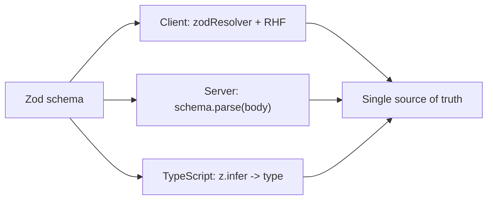
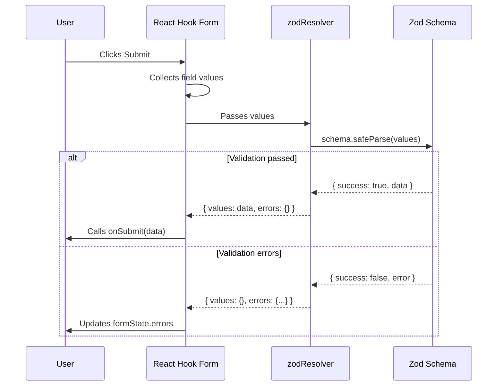
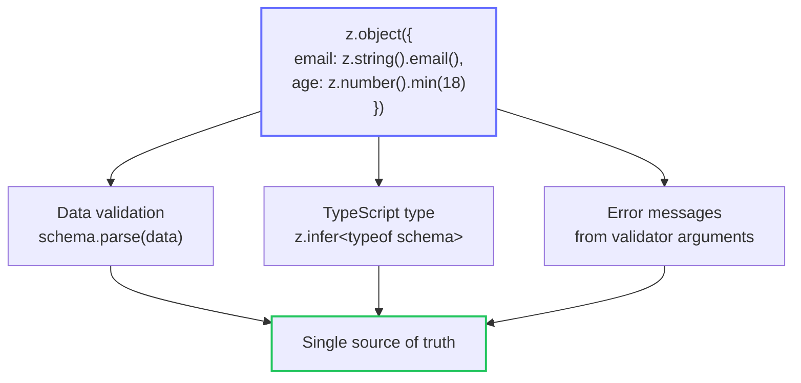

# Level 3: Zod Basics

## Introduction

Until now, we've been describing validation rules directly in `register` -- one rule per field. This works for simple forms, but imagine a real project: a registration form with 15 fields, cross-field validation (password and confirmation), conditional rules (if role is "admin" -- an invitation code is required). Rules are scattered across JSX markup, duplicated between forms, and during refactoring it's easy to forget to update validation in one of the places.

Schema-based validation solves this problem radically: you describe **the entire data structure and all rules in one object**, and the form simply connects to it. It's like the difference between checking each passenger manually at the airplane entrance versus running everyone through a single security scanner with pre-configured rules.

**Why schemas are better than built-in validation?**

| Built-in validation            | Schema validation            |
| ------------------------------- | ------------------------------ |
| Rules scattered across fields     | All rules in one place      |
| Complex cross-field validation | Easy cross-field validation |
| Less type safety         | Full type safety        |
| Hard to reuse         | Easy to reuse         |

In production, schema validation gives another important advantage -- **the same schema can be used on both client and server**. If your backend is written in Node.js, the same Zod schema validates data on both ends. This eliminates the situation where the client lets invalid data through and the server returns a cryptic 400 error.



---

## What is Zod?

**Zod** is a TypeScript-first schema validation library with zero dependencies. The key word here is **TypeScript-first**: Zod isn't just compatible with TypeScript, it's designed to **automatically derive TypeScript types from schemas**. You describe the schema once -- and get both data validation and a TypeScript type from a single source.

Analogy: imagine you're drawing a building blueprint. Usually you need to draw the blueprint (structure description) and separately write a technical specification (rules: minimum wall thickness, maximum height, etc.). With Zod, you draw one blueprint that **simultaneously serves as the structure description, validation rule set, and TypeScript type**.

**Installation:**

```bash
npm install zod @hookform/resolvers
```

The `zod` package is the validation library itself. The `@hookform/resolvers` package is the adapter that allows React Hook Form to understand schemas from various libraries (Zod, Yup, Joi, and others). We need the `zodResolver` from this package.

### Basic Example

```tsx
import { useForm } from 'react-hook-form'
import { zodResolver } from '@hookform/resolvers/zod'
import { z } from 'zod'

// 1. Create the schema
const schema = z.object({
  email: z.string().email('Invalid email'),
  password: z.string().min(8, 'Minimum 8 characters'),
})

// 2. Infer the type from the schema
type FormData = z.infer<typeof schema>

// 3. Use with useForm
const { register, handleSubmit } = useForm<FormData>({
  resolver: zodResolver(schema),
})
```

Let's break this down step by step:

1. **`z.object({...})`** -- creates an object schema. Each key is a form field name, and the value is the rules for that field.
2. **`z.infer<typeof schema>`** -- TypeScript magic. Zod analyzes your schema and derives a type from it: `{ email: string; password: string }`. You get the type automatically, without describing it manually.
3. **`resolver: zodResolver(schema)`** -- connects the schema to React Hook Form. Now on every submission attempt (or on field change, depending on `mode`), RHF runs data through Zod and gets a list of errors.

### What Happens Under the Hood

When the user clicks Submit, React Hook Form collects all field values and passes them to `zodResolver`. The resolver calls `schema.safeParse(data)`, which returns either `{ success: true, data: ... }` with validated data, or `{ success: false, error: ... }` with a list of errors. The resolver transforms Zod errors into a format RHF understands and writes them to `formState.errors`.



**Important:** when you use a `resolver`, built-in rules in `register` (such as `required`, `minLength`) are **ignored**. All validation goes through the schema. Don't mix two approaches in one form -- this is a common mistake (see the errors section for details).

---

## Basic Zod Types

Zod provides a set of primitive types from which schemas of any complexity are built. Each type is an object with validator methods that can be chained. This resembles the builder pattern: you start with a base type and add constraints one by one.

### Strings

Strings are the most common type in forms. Zod offers a rich set of built-in validators for strings:

```tsx
const schema = z.object({
  // Required string
  name: z.string(),

  // Email -- built-in format validator
  email: z.string().email('Invalid email'),

  // URL
  website: z.string().url('Invalid URL'),

  // UUID
  id: z.string().uuid('Invalid UUID'),

  // With length constraints
  username: z.string().min(3).max(20),

  // With pattern (regular expression)
  phone: z.string().regex(/^\+7\d{10}$/, 'Invalid format'),

  // Optional string (string | undefined)
  bio: z.string().optional(),

  // With default value
  role: z.string().default('user'),
})
```

**Tip:** note the difference between `z.string()` and `z.string().min(1)`. An empty string `""` passes `z.string()` validation, because it's still a string. If a field is required, use `.min(1, 'Required field')` -- this is one of the most common beginner traps.

### Numbers

Numbers in forms require special attention, because HTML inputs always return strings. Zod expects the `number` type, so conversion is needed (see the integration section below):

```tsx
const schema = z.object({
  // Required number
  age: z.number(),

  // With range
  rating: z.number().min(1).max(10),

  // Positive
  price: z.number().positive('Price must be positive'),

  // Negative
  balance: z.number().negative(),

  // Integer
  count: z.number().int('Must be an integer'),

  // Optional
  discount: z.number().optional(),
})
```

**Pitfall with numbers:** `<input type="number">` returns the string `"42"`, not the number `42`. If you pass a string to a Zod schema with `z.number()`, validation fails with "Expected number, received string". The solution is to add `{ valueAsNumber: true }` to `register`:

```tsx
<input type="number" {...register('age', { valueAsNumber: true })} />
```

Alternative approach -- use `z.coerce.number()`, which automatically converts a string to a number via `Number(input)`:

```tsx
const schema = z.object({
  age: z.coerce.number().min(18).max(120),
})
// Now "42" automatically becomes 42 before validation
```

### Booleans

```tsx
const schema = z.object({
  agree: z.boolean().refine(v => v === true, 'Consent is required'),
  newsletter: z.boolean().optional(),
})
```

Note: `z.boolean()` accepts both `true` and `false`. If a checkbox must be checked (e.g., terms agreement), you need `.refine()` that checks the value is exactly `true`. Without `refine`, the user can leave the checkbox empty and validation will pass.

### Enum (enumerations)

Enum is useful for fields with a limited set of values -- user roles, statuses, contact types:

```tsx
const schema = z.object({
  // Zod enum -- creates type 'admin' | 'user' | 'guest'
  role: z.enum(['admin', 'user', 'guest']),

  // TypeScript enum -- if enum is already defined in code
  status: z.nativeEnum(Status),
})
```

**Tip:** `z.enum` is preferable to `z.nativeEnum` because it infers more precise types and works without an additional TypeScript enum. Use `z.nativeEnum` only when the enum already exists in the codebase and you don't want to duplicate values.

---

## Object Schemas

### z.object -- Nested Objects

Real forms almost always have logical field grouping. Address (city, street, zip), work information (company, position) -- all of these are nested objects. Zod supports nesting to any depth:

```tsx
const schema = z.object({
  // Nested object
  address: z.object({
    city: z.string(),
    street: z.string(),
    zip: z.string().regex(/^\d{5}$/, 'Invalid zip code'),
  }),

  // Optional object
  company: z
    .object({
      name: z.string(),
      position: z.string(),
    })
    .optional(),
})
```

Each `z.object` creates its own nesting level. In React Hook Form, nested fields are accessed via **dot notation**: `register('address.city')`. Errors are found at the same path: `errors.address?.city?.message`.

### z.infer -- Type Inference from Schema

This is one of Zod's most powerful features. Instead of writing a TypeScript interface manually and then duplicating rules in the schema, you describe the schema once and get the type automatically:

```tsx
const schema = z.object({
  email: z.string().email(),
  age: z.number().min(18),
})

// Type is inferred automatically:
// { email: string; age: number }
type FormData = z.infer<typeof schema>
```

**Important:** Always use `z.infer` instead of manually describing the type. This guarantees the type always matches the schema. If you add a field to the schema, the type updates automatically. If you describe the type manually and forget to update it when the schema changes -- you'll get a desynchronization that TypeScript won't catch.

Visualization of the "single source of truth" approach:



### Arrays

Arrays are needed for dynamic lists -- contacts, skills, order items:

```tsx
const schema = z.object({
  // Array of strings
  tags: z.array(z.string()),

  // With minimum length
  skills: z.array(z.string()).min(1, 'Select at least one skill'),

  // Array of objects
  contacts: z.array(
    z.object({
      type: z.string(),
      value: z.string(),
    })
  ),
})
```

In React Hook Form, array elements are accessed by index: `register('contacts.0.type')`, `register('skills.1')`. Array errors are also indexed: `errors.contacts?.[0]?.type?.message`. At level 8 we'll cover working with `useFieldArray` for dynamically adding and removing elements.

---

## Integration with React Hook Form

To connect Zod to React Hook Form, use `zodResolver` from the `@hookform/resolvers` package. A resolver is an adapter function that translates validation from Zod format to a format React Hook Form understands.

### How the Resolver Works

Without a resolver, you'd have to manually call `schema.parse()` in the submit handler and map Zod errors to form fields. The resolver does this automatically:

```tsx
// Without resolver -- manual
const onSubmit = (data: FormData) => {
  const result = schema.safeParse(data)
  if (!result.success) {
    result.error.issues.forEach(issue => {
      setError(issue.path.join('.'), { message: issue.message })
    })
    return
  }
  // ... business logic
}

// With resolver -- automatic
const { register, handleSubmit } = useForm<FormData>({
  resolver: zodResolver(schema),
})
```

### Full Example

```tsx
import { useForm } from 'react-hook-form'
import { zodResolver } from '@hookform/resolvers/zod'
import { z } from 'zod'

const schema = z.object({
  email: z.string().email('Invalid email'),
  password: z.string().min(8, 'Minimum 8 characters'),
})

type FormData = z.infer<typeof schema>

export function LoginForm() {
  const {
    register,
    handleSubmit,
    formState: { errors, isValid },
  } = useForm<FormData>({
    resolver: zodResolver(schema),
    mode: 'onChange',
  })

  const onSubmit = (data: FormData) => {
    console.log('Submitted:', data)
  }

  return (
    <form onSubmit={handleSubmit(onSubmit)}>
      <div>
        <label>Email</label>
        <input type="email" {...register('email')} />
        {errors.email && <span className="error">{errors.email.message}</span>}
      </div>

      <div>
        <label>Password</label>
        <input type="password" {...register('password')} />
        {errors.password && <span className="error">{errors.password.message}</span>}
      </div>

      <button type="submit" disabled={!isValid}>
        Sign In
      </button>
    </form>
  )
}
```

**Note `mode: 'onChange'`**. Without this option (default `mode: 'onSubmit'`), validation only runs on form submission. With `mode: 'onChange'`, the Zod schema is checked on every field change, and `isValid` updates in real time. This is convenient for UX, but has a cost -- more re-renders. Choose `mode` based on your scenario.

### zodResolver Options

`zodResolver` accepts additional parameters for fine-tuning:

```tsx
// Sync mode -- faster, but doesn't support async validation
useForm({
  resolver: zodResolver(schema, undefined, { mode: 'sync' }),
})

// Get "raw" values (before transform) instead of transformed
useForm({
  resolver: zodResolver(schema, undefined, { raw: true }),
})
```

In most cases, just `zodResolver(schema)` without additional options is enough.

### Nested Objects with RHF

For nested objects, use dot notation in `register`:

```tsx
const schema = z.object({
  name: z.string().min(1, 'Required'),
  address: z.object({
    city: z.string().min(1, 'Required'),
    zip: z.string().regex(/^\d{5}$/, 'Invalid zip code'),
  }),
})

type FormData = z.infer<typeof schema>

function AddressForm() {
  const { register, formState: { errors } } = useForm<FormData>({
    resolver: zodResolver(schema),
  })

  return (
    <form>
      <input {...register('name')} />
      <input {...register('address.city')} />
      <input {...register('address.zip')} />
      {errors.address?.city && <span>{errors.address.city.message}</span>}
    </form>
  )
}
```

The dot notation `'address.city'` tells RHF that this is the `city` field inside the `address` object. On submission, data is automatically collected into the correct structure: `{ name: '...', address: { city: '...', zip: '...' } }`.

---

## Complete Registration Schema

Let's put all the concepts together into one comprehensive schema. This is a typical registration form you'd encounter in a real project:

```tsx
import { z } from 'zod'

const registrationSchema = z
  .object({
    firstName: z.string().min(1, 'Required'),
    lastName: z.string().min(1, 'Required'),
    email: z.string().email('Invalid email'),
    age: z.number().min(18, 'Minimum 18 years').max(120, 'Maximum 120 years'),

    password: z
      .string()
      .min(8, 'Minimum 8 characters')
      .regex(/[A-Z]/, 'Must have an uppercase letter')
      .regex(/\d/, 'Must have a digit'),

    confirmPassword: z.string(),

    address: z.object({
      country: z.string().min(1, 'Required'),
      city: z.string().min(1, 'Required'),
    }),

    skills: z.array(z.string()).min(1, 'Select at least one'),
    role: z.enum(['developer', 'designer', 'manager']),
    agree: z.boolean().refine(v => v === true, 'Consent is required'),
  })
  .refine(data => data.password === data.confirmPassword, {
    message: 'Passwords do not match',
    path: ['confirmPassword'],
  })

type RegistrationForm = z.infer<typeof registrationSchema>
```

Key points of this schema:

- **Validator chains** on `password`: `.min(8)` -> `.regex(/[A-Z]/)` -> `.regex(/\d/)`. Zod checks them sequentially and stops at the first error (by default). The user will see "Minimum 8 characters", fix it, then see "Must have an uppercase letter", etc.
- **`.refine()` at the object level** -- cross-field validation. The `.refine()` method is called after `.object()` and has access to **all fields** simultaneously. The `path: ['confirmPassword']` parameter specifies which field to attach the error to in `formState.errors`.
- **`z.enum`** for role -- limits values to an exact list. Attempting to pass `'intern'` will result in a validation error.
- **`z.boolean().refine(v => v === true)`** -- a trick for required checkboxes. Regular `z.boolean()` accepts `false`, which doesn't work for terms agreement.

---

## optional, nullable, and nullish -- When to Use What

Three modifiers for "empty" values look similar but behave differently. The choice depends on what your API expects:

```tsx
const schema = z.object({
  // optional: string | undefined -- field may be absent
  nickname: z.string().optional(),

  // nullable: string | null -- field exists but value may be null
  avatar: z.string().nullable(),

  // nullish: string | undefined | null -- either
  bio: z.string().nullish(),
})
```

**When to choose what:**

- **`optional()`** -- when the field is not required in the form. The user may not fill it, and it will be `undefined`.
- **`nullable()`** -- when the API returns or expects `null`. For example, a database stores `NULL` for empty fields, and when loading data for editing you'll get `null`, not `undefined`.
- **`nullish()`** -- when you don't control what comes in -- `null` or `undefined`. This is the most "lenient" option.

---

## transform and coerce -- Data Transformation

Zod can not only validate data but also **transform** it. This is especially useful for forms where HTML inputs return strings, but business logic expects different types.

### z.coerce -- Automatic Type Coercion

`z.coerce` uses standard JavaScript constructors (`Number()`, `String()`, `Boolean()`) for conversion:

```tsx
const schema = z.object({
  // "42" -> 42, "" -> 0
  age: z.coerce.number().min(18),

  // new Date("2024-01-15") -> Date object
  birthday: z.coerce.date(),

  // Boolean("true") -> true, Boolean("") -> false
  agree: z.coerce.boolean(),
})
```

**Caution with `z.coerce.number()`**: empty string `""` becomes `0` via `Number("")`, not a validation error. If you need an empty field to be treated as an error, add `.min(1)` or use `z.preprocess`:

```tsx
// Empty field becomes 0, and .positive() will reject it
age: z.coerce.number().positive('Enter your age'),
```

### .transform() -- Custom Transformation

For more complex transformations, use `.transform()`:

```tsx
const schema = z.object({
  email: z
    .string()
    .email()
    .transform(email => email.toLowerCase().trim()),

  tags: z
    .string()
    .transform(str => str.split(',').map(s => s.trim()))
    .pipe(z.array(z.string()).min(1)),
})
```

In the first case, email is normalized (lowercased and trimmed). In the second -- the string "react, typescript, zod" becomes an array `["react", "typescript", "zod"]`. The `.pipe()` method allows validating the transformation result against another schema.

**Important:** when using `.transform()`, the `z.infer` type returns the **output** type (after transformation). If you need the input type (what the user actually types), use `z.input<typeof schema>`.

---

## Common Beginner Mistakes

### Mistake 1: Forgetting to import the resolver

```tsx
// Wrong -- forgot the import
import { z } from 'zod'

const { register } = useForm({ resolver: zodResolver(schema) }) // zodResolver is not defined!

// Correct -- import the resolver
import { z } from 'zod'
import { zodResolver } from '@hookform/resolvers/zod'

const { register } = useForm({ resolver: zodResolver(schema) })
```

**Why this is a mistake:** Without importing `zodResolver` from `@hookform/resolvers/zod`, you'll get `ReferenceError: zodResolver is not defined` at runtime. TypeScript may not catch this error if your `tsconfig` is misconfigured.

---

### Mistake 2: Manually describing the type instead of using z.infer

```tsx
// Wrong -- type is not inferred from the schema
type FormData = {
  email: string
  password: string
}
const schema = z.object({ email: z.string(), password: z.string() })

// Correct -- use z.infer
const schema = z.object({
  email: z.string(),
  password: z.string(),
})
type FormData = z.infer<typeof schema>
```

**Why this is a mistake:** Manual type description creates **two sources of truth**. When you add a `username` field to the schema and forget to add it to the interface, TypeScript won't show an error. And when you remove a field from the schema but leave it in the type, `register('deletedField')` won't cause a compiler error, but the field won't be validated. `z.infer` eliminates this entire class of bugs.

---

### Mistake 3: Using .optional() instead of .nullable()

```tsx
// Wrong -- undefined is not the same as null
bio: z.string().optional() // can be undefined

// Correct -- if the API returns null
bio: z.string().nullable() // can be null
```

**Why this is a mistake:** `optional()` makes the field `string | undefined`, while `nullable()` makes it `string | null`. If the server returns `null` for an empty field (typical for SQL databases), and your schema expects `undefined`, validation will fail when loading data for editing. Choose the modifier that matches your API.

---

### Mistake 4: Minimum 1 element in array without a message

```tsx
// Wrong -- unclear default error message
skills: z.array(z.string()).min(1)

// Correct -- with a clear message
skills: z.array(z.string()).min(1, 'Select at least one skill')
```

**Why this is a mistake:** Without a custom message, Zod will show a technical "Array must contain at least 1 element(s)". Form users shouldn't see programmer terminology. Always add human-readable messages to every validator.

---

### Mistake 5: Mixing register validation and resolver

```tsx
// Wrong -- rules in register are ignored when resolver is present
const { register } = useForm({
  resolver: zodResolver(schema),
})

<input {...register('email', { required: 'Required' })} />
// The required rule will be IGNORED -- validation goes through Zod

// Correct -- all rules in the schema
const schema = z.object({
  email: z.string().min(1, 'Required').email('Invalid email'),
})

const { register } = useForm({
  resolver: zodResolver(schema),
})

<input {...register('email')} />
```

**Why this is a mistake:** When a `resolver` is used, React Hook Form **fully delegates validation** to the resolver. Rules passed as the second argument to `register` simply don't work. This doesn't cause an error -- they're silently ignored, which is especially tricky: you think the field is being validated, but it isn't.

---

### Mistake 6: Using z.string() instead of z.string().min(1) for required fields

```tsx
// Wrong -- empty string "" passes z.string() validation
const schema = z.object({
  name: z.string(),
})
// schema.parse({ name: '' }) -- OK, no error!

// Correct -- min(1) requires a non-empty string
const schema = z.object({
  name: z.string().min(1, 'Name is required'),
})
// schema.parse({ name: '' }) -- ZodError!
```

**Why this is a mistake:** `z.string()` only checks the **type** (that the value is a string), not the **content**. An empty string `""` is a valid string. Unlike `required: true` in register, which checks for emptiness, in Zod you need to explicitly specify `.min(1)`.

---

## Additional Resources

- [Zod documentation](https://zod.dev/) -- complete guide to all types and methods
- [@hookform/resolvers](https://react-hook-form.com/docs/useform/resolver) -- resolver documentation
- [Zod GitHub](https://github.com/colinhacks/zod) -- source code, issues, examples

---

## What's Next?

In the next level, we'll dive into **advanced Zod features**:

- **`.refine()`** -- custom validation rules with access to other fields
- **`.superRefine()`** -- when one `refine` isn't enough and you need to report multiple errors
- **`discriminatedUnion`** -- conditional fields based on a discriminator value
- **`transform` and `pipe`** -- data transformation during validation
