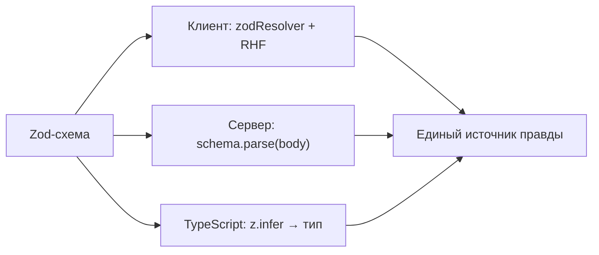
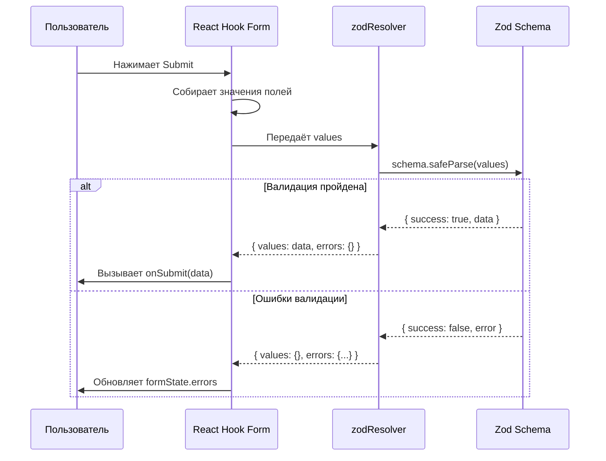
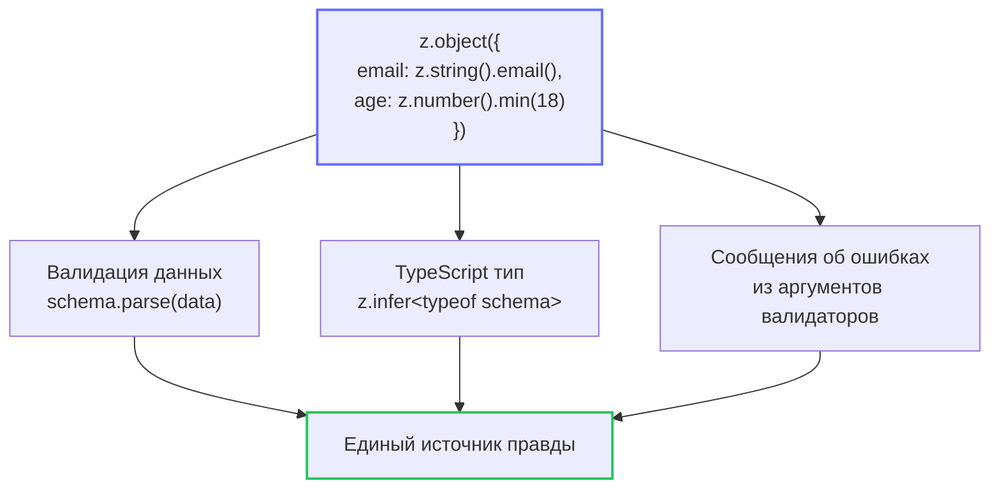

# Уровень 3: Основы Zod

## Введение

До этого момента мы описывали правила валидации прямо в `register` -- по одному правилу на каждое поле. Это работает для простых форм, но представьте реальный проект: форма регистрации с 15 полями, кросс-полевая валидация (пароль и подтверждение), условные правила (если роль "admin" -- требуется код приглашения). Правила рассыпаны по JSX-разметке, дублируются между формами, и при рефакторинге легко забыть обновить валидацию в одном из мест.

Валидация по схемам решает эту проблему кардинально: вы описываете **всю структуру данных и все правила в одном объекте**, а форма просто подключается к нему. Это как разница между тем, чтобы проверять каждого пассажира вручную на входе в самолёт, и тем, чтобы пропустить всех через единый сканер безопасности с заранее настроенными правилами.

**Почему схемы лучше встроенной валидации?**

| Встроенная валидация            | Валидация по схемам            |
| ------------------------------- | ------------------------------ |
| Правила разбросаны по полям     | Все правила в одном месте      |
| Сложная кросс-полевая валидация | Легкая кросс-полевая валидация |
| Меньше типобезопасности         | Полная типобезопасность        |
| Сложно переиспользовать         | Легко переиспользовать         |

В продакшене валидация по схемам даёт ещё одно важное преимущество -- **одну схему можно использовать и на клиенте, и на сервере**. Если ваш бэкенд написан на Node.js, та же Zod-схема валидирует данные на обоих концах. Это исключает ситуацию, когда клиент пропускает невалидные данные, а сервер возвращает загадочную ошибку 400.



---

## Что такое Zod?

**Zod** -- это TypeScript-first библиотека для валидации схем с нулевыми зависимостями. Ключевое слово здесь -- **TypeScript-first**: Zod не просто совместим с TypeScript, а спроектирован так, чтобы **автоматически выводить TypeScript-типы из схем**. Вы описываете схему один раз -- и получаете валидацию данных и TypeScript-тип из одного источника.

Аналогия: представьте, что вы составляете чертёж здания. Обычно нужно нарисовать чертёж (описание структуры) и отдельно написать техническое задание (правила: минимальная толщина стен, максимальная высота и т.д.). С Zod вы рисуете один чертёж, который **одновременно является и описанием структуры, и набором правил проверки, и TypeScript-типом**.

**Установка:**

```bash
npm install zod @hookform/resolvers
```

Пакет `zod` -- это сама библиотека валидации. Пакет `@hookform/resolvers` -- это адаптер, который позволяет React Hook Form понимать схемы из различных библиотек (Zod, Yup, Joi и другие). Нам нужен именно `zodResolver` из этого пакета.

### Базовый пример

```tsx
import { useForm } from 'react-hook-form'
import { zodResolver } from '@hookform/resolvers/zod'
import { z } from 'zod'

// 1. Создайте схему
const schema = z.object({
  email: z.string().email('Неверный email'),
  password: z.string().min(8, 'Минимум 8 символов'),
})

// 2. Выведите тип из схемы
type FormData = z.infer<typeof schema>

// 3. Используйте с useForm
const { register, handleSubmit } = useForm<FormData>({
  resolver: zodResolver(schema),
})
```

Разберём этот пример шаг за шагом:

1. **`z.object({...})`** -- создаёт схему объекта. Каждый ключ -- это имя поля формы, а значение -- правила для этого поля.
2. **`z.infer<typeof schema>`** -- магия TypeScript. Zod анализирует вашу схему и выводит из неё тип: `{ email: string; password: string }`. Вы получаете тип автоматически, не описывая его вручную.
3. **`resolver: zodResolver(schema)`** -- подключает схему к React Hook Form. Теперь при каждой попытке отправки (или при изменении поля, в зависимости от `mode`) RHF прогоняет данные через Zod и получает список ошибок.

### Что происходит под капотом

Когда пользователь нажимает Submit, React Hook Form собирает значения всех полей и передаёт их в `zodResolver`. Resolver вызывает `schema.safeParse(data)`, который возвращает либо `{ success: true, data: ... }` с провалидированными данными, либо `{ success: false, error: ... }` со списком ошибок. Resolver преобразует ошибки Zod в формат, понятный RHF, и записывает их в `formState.errors`.



📌 **Важно:** когда вы используете `resolver`, встроенные правила в `register` (такие как `required`, `minLength`) **игнорируются**. Вся валидация идёт через схему. Не смешивайте два подхода в одной форме -- это частая ошибка (подробнее в разделе ошибок).

---

## Основные типы Zod

Zod предоставляет набор примитивных типов, из которых строятся схемы любой сложности. Каждый тип -- это объект с методами-валидаторами, которые можно вызывать цепочкой (chaining). Это напоминает строитель (builder pattern): вы начинаете с базового типа и добавляете ограничения одно за другим.

### Строки

Строки -- самый частый тип в формах. Zod предлагает богатый набор встроенных валидаторов для строк:

```tsx
const schema = z.object({
  // Обязательная строка
  name: z.string(),

  // Email -- встроенный валидатор формата
  email: z.string().email('Неверный email'),

  // URL
  website: z.string().url('Неверный URL'),

  // UUID
  id: z.string().uuid('Неверный UUID'),

  // С длиной
  username: z.string().min(3).max(20),

  // С паттерном (регулярное выражение)
  phone: z.string().regex(/^\+7\d{10}$/, 'Неверный формат'),

  // Опциональная строка (string | undefined)
  bio: z.string().optional(),

  // С дефолтным значением
  role: z.string().default('user'),
})
```

💡 **Совет:** обратите внимание на разницу между `z.string()` и `z.string().min(1)`. Пустая строка `""` проходит валидацию `z.string()`, потому что это всё ещё строка. Если поле обязательно для заполнения, используйте `.min(1, 'Обязательное поле')` -- это одна из самых частых ловушек для новичков.

### Числа

Числа в формах требуют особого внимания, потому что HTML-инпуты всегда возвращают строки. Zod ожидает тип `number`, поэтому нужно преобразование (об этом ниже в разделе интеграции):

```tsx
const schema = z.object({
  // Обязательное число
  age: z.number(),

  // С диапазоном
  rating: z.number().min(1).max(10),

  // Положительное
  price: z.number().positive('Цена должна быть положительной'),

  // Отрицательное
  balance: z.number().negative(),

  // Целое
  count: z.number().int('Должно быть целым числом'),

  // Опциональное
  discount: z.number().optional(),
})
```

⚠️ **Подводный камень с числами:** `<input type="number">` возвращает строку `"42"`, а не число `42`. Если передать строку в Zod-схему с `z.number()`, валидация провалится с ошибкой "Expected number, received string". Решение -- добавить `{ valueAsNumber: true }` в `register`:

```tsx
<input type="number" {...register('age', { valueAsNumber: true })} />
```

Альтернативный подход -- использовать `z.coerce.number()`, который автоматически преобразует строку в число через `Number(input)`:

```tsx
const schema = z.object({
  age: z.coerce.number().min(18).max(120),
})
// Теперь "42" автоматически станет 42 перед валидацией
```

### Булевы значения

```tsx
const schema = z.object({
  agree: z.boolean().refine(v => v === true, 'Необходимо согласие'),
  newsletter: z.boolean().optional(),
})
```

Обратите внимание: `z.boolean()` принимает и `true`, и `false`. Если чекбокс должен быть обязательно отмечен (например, согласие с условиями), нужен `.refine()`, который проверяет, что значение именно `true`. Без `refine` пользователь может оставить чекбокс пустым, и валидация пройдёт.

### Enum (перечисления)

Enum полезен для полей с ограниченным набором значений -- роли пользователей, статусы, типы контактов:

```tsx
const schema = z.object({
  // Zod enum -- создаёт тип 'admin' | 'user' | 'guest'
  role: z.enum(['admin', 'user', 'guest']),

  // TypeScript enum -- если enum уже определён в коде
  status: z.nativeEnum(Status),
})
```

💡 **Совет:** `z.enum` предпочтительнее `z.nativeEnum`, потому что он выводит более точные типы и работает без дополнительного TypeScript enum. Используйте `z.nativeEnum` только когда enum уже существует в кодовой базе и вы не хотите дублировать значения.

---

## Объектные схемы

### z.object -- вложенные объекты

Реальные формы почти всегда имеют логическую группировку полей. Адрес (город, улица, индекс), рабочая информация (компания, должность) -- всё это вложенные объекты. Zod поддерживает вложенность на любую глубину:

```tsx
const schema = z.object({
  // Вложенный объект
  address: z.object({
    city: z.string(),
    street: z.string(),
    zip: z.string().regex(/^\d{5}$/, 'Неверный индекс'),
  }),

  // Опциональный объект
  company: z
    .object({
      name: z.string(),
      position: z.string(),
    })
    .optional(),
})
```

Каждый `z.object` создаёт свой уровень вложенности. В React Hook Form доступ к вложенным полям осуществляется через **точечную нотацию**: `register('address.city')`. А ошибки находятся по тому же пути: `errors.address?.city?.message`.

### z.infer -- вывод типа из схемы

Это одна из самых мощных возможностей Zod. Вместо того чтобы писать TypeScript-интерфейс вручную и потом дублировать правила в схеме, вы описываете схему один раз, а тип получаете автоматически:

```tsx
const schema = z.object({
  email: z.string().email(),
  age: z.number().min(18),
})

// Тип выводится автоматически:
// { email: string; age: number }
type FormData = z.infer<typeof schema>
```

📌 **Важно:** Всегда используйте `z.infer` вместо ручного описания типа. Это гарантирует, что тип всегда соответствует схеме. Если вы добавите поле в схему, тип обновится автоматически. Если опишете тип вручную и забудете обновить его при изменении схемы -- получите рассинхронизацию, которую TypeScript не поймает.

Визуализация подхода "единый источник правды":



### Массивы

Массивы нужны для динамических списков -- контакты, навыки, товары в заказе:

```tsx
const schema = z.object({
  // Массив строк
  tags: z.array(z.string()),

  // С минимальной длиной
  skills: z.array(z.string()).min(1, 'Выберите хотя бы один навык'),

  // Массив объектов
  contacts: z.array(
    z.object({
      type: z.string(),
      value: z.string(),
    })
  ),
})
```

В React Hook Form к элементам массива обращаются через индекс: `register('contacts.0.type')`, `register('skills.1')`. Ошибки массива тоже индексированы: `errors.contacts?.[0]?.type?.message`. На уровне 8 мы подробно разберём работу с `useFieldArray` для динамического добавления и удаления элементов.

---

## Интеграция с React Hook Form

Для подключения Zod к React Hook Form используется `zodResolver` из пакета `@hookform/resolvers`. Resolver -- это функция-адаптер, которая переводит валидацию из формата Zod в формат, понятный React Hook Form.

### Как работает resolver

Без resolver вам пришлось бы вручную вызывать `schema.parse()` в обработчике отправки и маппить ошибки Zod на поля формы. Resolver делает это автоматически:

```tsx
// ❌ Без resolver -- вручную
const onSubmit = (data: FormData) => {
  const result = schema.safeParse(data)
  if (!result.success) {
    result.error.issues.forEach(issue => {
      setError(issue.path.join('.'), { message: issue.message })
    })
    return
  }
  // ... бизнес-логика
}

// ✅ С resolver -- автоматически
const { register, handleSubmit } = useForm<FormData>({
  resolver: zodResolver(schema),
})
```

### Полный пример

```tsx
import { useForm } from 'react-hook-form'
import { zodResolver } from '@hookform/resolvers/zod'
import { z } from 'zod'

const schema = z.object({
  email: z.string().email('Неверный email'),
  password: z.string().min(8, 'Минимум 8 символов'),
})

type FormData = z.infer<typeof schema>

export function LoginForm() {
  const {
    register,
    handleSubmit,
    formState: { errors, isValid },
  } = useForm<FormData>({
    resolver: zodResolver(schema),
    mode: 'onChange',
  })

  const onSubmit = (data: FormData) => {
    console.log('Submitted:', data)
  }

  return (
    <form onSubmit={handleSubmit(onSubmit)}>
      <div>
        <label>Email</label>
        <input type="email" {...register('email')} />
        {errors.email && <span className="error">{errors.email.message}</span>}
      </div>

      <div>
        <label>Password</label>
        <input type="password" {...register('password')} />
        {errors.password && <span className="error">{errors.password.message}</span>}
      </div>

      <button type="submit" disabled={!isValid}>
        Войти
      </button>
    </form>
  )
}
```

📌 **Обратите внимание на `mode: 'onChange'`**. Без этой опции (по умолчанию `mode: 'onSubmit'`) валидация запускается только при отправке формы. С `mode: 'onChange'` Zod-схема проверяется при каждом изменении поля, и `isValid` обновляется в реальном времени. Это удобно для UX, но имеет цену -- больше ререндеров. Выбирайте `mode` в зависимости от сценария.

### Опции zodResolver

`zodResolver` принимает дополнительные параметры для тонкой настройки:

```tsx
// Синхронный режим -- быстрее, но не поддерживает async валидацию
useForm({
  resolver: zodResolver(schema, undefined, { mode: 'sync' }),
})

// Получить "сырые" значения (до transform) вместо трансформированных
useForm({
  resolver: zodResolver(schema, undefined, { raw: true }),
})
```

В большинстве случаев достаточно просто `zodResolver(schema)` без дополнительных опций.

### Вложенные объекты с RHF

Для вложенных объектов используйте точечную нотацию в `register`:

```tsx
const schema = z.object({
  name: z.string().min(1, 'Обязательно'),
  address: z.object({
    city: z.string().min(1, 'Обязательно'),
    zip: z.string().regex(/^\d{5}$/, 'Неверный индекс'),
  }),
})

type FormData = z.infer<typeof schema>

function AddressForm() {
  const { register, formState: { errors } } = useForm<FormData>({
    resolver: zodResolver(schema),
  })

  return (
    <form>
      <input {...register('name')} />
      <input {...register('address.city')} />
      <input {...register('address.zip')} />
      {errors.address?.city && <span>{errors.address.city.message}</span>}
    </form>
  )
}
```

Точечная нотация `'address.city'` сообщает RHF, что это поле `city` внутри объекта `address`. При отправке данные автоматически соберутся в правильную структуру: `{ name: '...', address: { city: '...', zip: '...' } }`.

---

## Полная схема регистрации

Соберём все изученные концепции в одну комплексную схему. Это типичный пример формы регистрации, какую вы встретите в реальном проекте:

```tsx
import { z } from 'zod'

const registrationSchema = z
  .object({
    firstName: z.string().min(1, 'Обязательно'),
    lastName: z.string().min(1, 'Обязательно'),
    email: z.string().email('Неверный email'),
    age: z.number().min(18, 'Минимум 18 лет').max(120, 'Максимум 120 лет'),

    password: z
      .string()
      .min(8, 'Минимум 8 символов')
      .regex(/[A-Z]/, 'Должна быть заглавная буква')
      .regex(/\d/, 'Должна быть цифра'),

    confirmPassword: z.string(),

    address: z.object({
      country: z.string().min(1, 'Обязательно'),
      city: z.string().min(1, 'Обязательно'),
    }),

    skills: z.array(z.string()).min(1, 'Выберите хотя бы один'),
    role: z.enum(['developer', 'designer', 'manager']),
    agree: z.boolean().refine(v => v === true, 'Необходимо согласие'),
  })
  .refine(data => data.password === data.confirmPassword, {
    message: 'Пароли не совпадают',
    path: ['confirmPassword'],
  })

type RegistrationForm = z.infer<typeof registrationSchema>
```

Разберём ключевые моменты этой схемы:

- **Цепочки валидаторов** на `password`: `.min(8)` → `.regex(/[A-Z]/)` → `.regex(/\d/)`. Zod проверяет их последовательно и останавливается на первой ошибке (по умолчанию). Пользователь увидит "Минимум 8 символов", исправит, затем увидит "Должна быть заглавная буква" и т.д.
- **`.refine()` на уровне объекта** -- кросс-полевая валидация. Метод `.refine()` вызывается после `.object()` и получает доступ ко **всем полям** одновременно. Параметр `path: ['confirmPassword']` указывает, к какому полю привязать ошибку в `formState.errors`.
- **`z.enum`** для роли -- ограничивает значения точным списком. Попытка передать `'intern'` приведёт к ошибке валидации.
- **`z.boolean().refine(v => v === true)`** -- хитрость для обязательных чекбоксов. Обычный `z.boolean()` принимает и `false`, что не подходит для согласия с условиями.

---

## optional, nullable и nullish -- когда что использовать

Три модификатора для "пустых" значений выглядят похоже, но ведут себя по-разному. Выбор зависит от того, что ожидает ваш API:

```tsx
const schema = z.object({
  // optional: string | undefined -- поле может отсутствовать
  nickname: z.string().optional(),

  // nullable: string | null -- поле есть, но значение может быть null
  avatar: z.string().nullable(),

  // nullish: string | undefined | null -- и то, и другое
  bio: z.string().nullish(),
})
```

🔥 **Когда что выбирать:**

- **`optional()`** -- когда поле необязательно в форме. Пользователь может его не заполнять, и оно будет `undefined`.
- **`nullable()`** -- когда API возвращает или ожидает `null`. Например, база данных хранит `NULL` для пустых полей, и при загрузке данных для редактирования вы получите `null`, а не `undefined`.
- **`nullish()`** -- когда вы не контролируете, что придёт -- `null` или `undefined`. Это самый "мягкий" вариант.

---

## transform и coerce -- преобразование данных

Zod умеет не только проверять данные, но и **преобразовывать** их. Это особенно полезно для форм, где HTML-инпуты возвращают строки, а бизнес-логика ожидает другие типы.

### z.coerce -- автоматическое приведение типов

`z.coerce` использует стандартные JavaScript-конструкторы (`Number()`, `String()`, `Boolean()`) для преобразования:

```tsx
const schema = z.object({
  // "42" → 42, "" → 0
  age: z.coerce.number().min(18),

  // new Date("2024-01-15") → Date object
  birthday: z.coerce.date(),

  // Boolean("true") → true, Boolean("") → false
  agree: z.coerce.boolean(),
})
```

⚠️ **Осторожно с `z.coerce.number()`**: пустая строка `""` превращается в `0` через `Number("")`, а не в ошибку валидации. Если нужно, чтобы пустое поле считалось ошибкой, добавьте `.min(1)` или используйте `z.preprocess`:

```tsx
// Пустое поле станет 0, а .positive() его отклонит
age: z.coerce.number().positive('Введите возраст'),
```

### .transform() -- кастомное преобразование

Для более сложных преобразований используйте `.transform()`:

```tsx
const schema = z.object({
  email: z
    .string()
    .email()
    .transform(email => email.toLowerCase().trim()),

  tags: z
    .string()
    .transform(str => str.split(',').map(s => s.trim()))
    .pipe(z.array(z.string()).min(1)),
})
```

В первом случае email нормализуется (приводится к нижнему регистру и удаляются пробелы). Во втором -- строка "react, typescript, zod" превращается в массив `["react", "typescript", "zod"]`. Метод `.pipe()` позволяет валидировать результат трансформации другой схемой.

📌 **Важно:** при использовании `.transform()` тип `z.infer` возвращает **выходной** тип (после трансформации). Если нужен входной тип (что пользователь реально вводит), используйте `z.input<typeof schema>`.

---

## ⚠️ Частые ошибки новичков

### ❌ Ошибка 1: Не импортировали resolver

```tsx
// ❌ Неправильно — забыли импорт
import { z } from 'zod'

const { register } = useForm({ resolver: zodResolver(schema) }) // zodResolver не определён!

// ✅ Правильно — импортируем resolver
import { z } from 'zod'
import { zodResolver } from '@hookform/resolvers/zod'

const { register } = useForm({ resolver: zodResolver(schema) })
```

**Почему это ошибка:** Без импорта `zodResolver` из `@hookform/resolvers/zod` вы получите `ReferenceError: zodResolver is not defined` в рантайме. TypeScript может не поймать эту ошибку, если у вас неправильно настроен `tsconfig`.

---

### ❌ Ошибка 2: Ручное описание типа вместо z.infer

```tsx
// ❌ Неправильно — тип не выведен из схемы
type FormData = {
  email: string
  password: string
}
const schema = z.object({ email: z.string(), password: z.string() })

// ✅ Правильно — используем z.infer
const schema = z.object({
  email: z.string(),
  password: z.string(),
})
type FormData = z.infer<typeof schema>
```

**Почему это ошибка:** Ручное описание типа -- это **два источника правды**. Когда вы добавите поле `username` в схему и забудете добавить его в интерфейс, TypeScript не покажет ошибку. А когда удалите поле из схемы, но оставите в типе, `register('deletedField')` не вызовет ошибку компиляции, но поле не будет валидироваться. `z.infer` исключает эту категорию багов полностью.

---

### ❌ Ошибка 3: .optional() вместо .nullable()

```tsx
// ❌ Неправильно — undefined не то же самое что null
bio: z.string().optional() // может быть undefined

// ✅ Правильно — если API возвращает null
bio: z.string().nullable() // может быть null
```

**Почему это ошибка:** `optional()` делает поле `string | undefined`, а `nullable()` — `string | null`. Если сервер возвращает `null` для пустого поля (что типично для SQL-баз данных), а ваша схема ожидает `undefined`, валидация провалится при загрузке данных для редактирования. Выбирайте модификатор, соответствующий вашему API.

---

### ❌ Ошибка 4: Минимум 1 элемент в массиве без сообщения

```tsx
// ❌ Неправильно — непонятная ошибка по умолчанию
skills: z.array(z.string()).min(1)

// ✅ Правильно — с понятным сообщением
skills: z.array(z.string()).min(1, 'Выберите хотя бы один навык')
```

**Почему это ошибка:** Без пользовательского сообщения Zod покажет техническое "Array must contain at least 1 element(s)". Пользователь формы не должен видеть программистские термины. Всегда добавляйте человекочитаемые сообщения к каждому валидатору.

---

### ❌ Ошибка 5: Смешивание register-валидации и resolver

```tsx
// ❌ Неправильно — правила в register игнорируются при наличии resolver
const { register } = useForm({
  resolver: zodResolver(schema),
})

<input {...register('email', { required: 'Обязательно' })} />
// Правило required будет ПРОИГНОРИРОВАНО -- валидация идёт через Zod

// ✅ Правильно — все правила в схеме
const schema = z.object({
  email: z.string().min(1, 'Обязательно').email('Неверный email'),
})

const { register } = useForm({
  resolver: zodResolver(schema),
})

<input {...register('email')} />
```

**Почему это ошибка:** Когда используется `resolver`, React Hook Form **полностью делегирует валидацию** resolver-у. Правила, переданные вторым аргументом в `register`, просто не работают. Это не вызывает ошибку -- они молча игнорируются, что особенно коварно: вы думаете, что поле валидируется, а на самом деле нет.

---

### ❌ Ошибка 6: z.string() вместо z.string().min(1) для обязательных полей

```tsx
// ❌ Неправильно — пустая строка "" проходит валидацию z.string()
const schema = z.object({
  name: z.string(),
})
// schema.parse({ name: '' }) — OK, ошибки нет!

// ✅ Правильно — min(1) требует непустую строку
const schema = z.object({
  name: z.string().min(1, 'Имя обязательно'),
})
// schema.parse({ name: '' }) — ZodError!
```

**Почему это ошибка:** `z.string()` проверяет только **тип** (что значение -- строка), но не **содержимое**. Пустая строка `""` -- это валидная строка. В отличие от `required: true` в register, который проверяет на пустоту, в Zod вам нужно явно указать `.min(1)`.

---

## 📚 Дополнительные ресурсы

- [Zod документация](https://zod.dev/) -- полное руководство по всем типам и методам
- [@hookform/resolvers](https://react-hook-form.com/docs/useform/resolver) -- документация по resolver-ам
- [Zod GitHub](https://github.com/colinhacks/zod) -- исходный код, issues, примеры

---

## Что дальше?

На следующем уровне мы углубимся в **продвинутые возможности Zod**:

- **`.refine()`** -- пользовательские правила валидации с доступом к другим полям
- **`.superRefine()`** -- когда одного `refine` недостаточно и нужно добавить несколько ошибок
- **`z.discriminatedUnion()`** -- элегантное решение для форм, где набор полей зависит от выбранного типа (например, "физлицо" vs "юрлицо")
