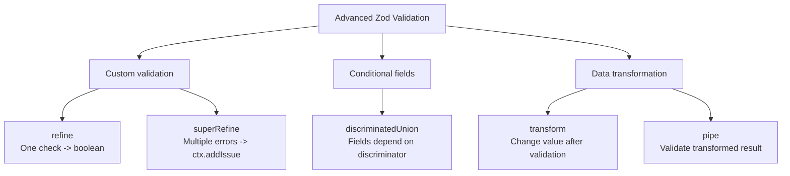
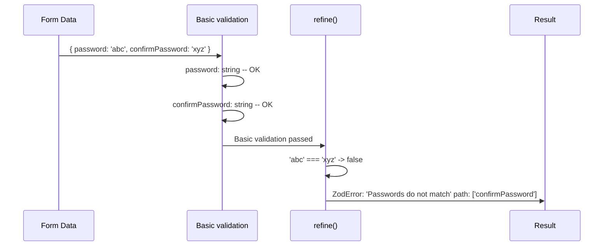
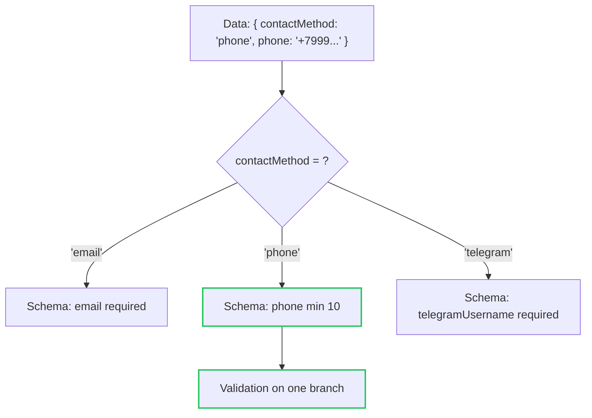
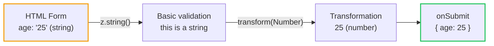

# Level 4: Advanced Zod

## Introduction

After learning basic Zod types, it's time to move on to advanced features. In this level, you'll learn to create custom validation, work with conditional fields, and transform data directly in the schema.

In the previous level, we built schemas from standard blocks: `z.string()`, `z.number()`, `z.object()`. These blocks cover 70-80% of a typical form's needs. But real production forms require more:

- Password must match confirmation -- this is a **cross-field** check that can't be expressed with `z.string().min(8)`
- Username must be unique -- requires an **async** check via API
- The set of fields changes based on user selection -- chose "email" as contact method, show email field; chose "phone" -- show phone field
- HTML inputs return strings, but the backend expects numbers and dates -- data **transformation** is needed

Analogy: if basic Zod types are bricks that build a wall, then `refine`, `superRefine`, `discriminatedUnion`, and `transform` are the **engineering systems** of the building: plumbing, electricity, ventilation. Without them, the wall stands, but you can't live in the building.

Here's how advanced Zod tools map to task types:



---

## Custom Validation with `refine`

### Single refine

`refine` allows adding an arbitrary check that can't be expressed with built-in methods. It accepts a function that returns `boolean`: `true` -- validation passed, `false` -- error.

Think of `refine` as an **additional filter** on the conveyor. Data has already passed basic checks (string, number, minimum length), and now you're adding your own logic on top. It's like a quality control system at a factory: automatic scanners already checked the size and shape of the part, but an engineer adds one more check -- conformity to the blueprint.

```tsx
const schema = z
  .object({
    password: z.string(),
    confirmPassword: z.string(),
  })
  .refine(data => data.password === data.confirmPassword, {
    message: 'Passwords do not match',
    path: ['confirmPassword'], // Which field to attach the error to
  })
```

Let's break down the anatomy of `refine`:

1. **First argument** -- a predicate function `(data) => boolean`. It receives the entire data object (because `refine` is called at the object level, not at an individual field level)
2. **Second argument** -- a configuration object with two keys:
   - `message` -- error text the user will see
   - `path` -- an array specifying which field to attach the error to in `formState.errors`

**Important:** the `path` parameter is critical for React Hook Form integration. Without it, the error will end up in `errors.root`, not in a specific field, and the user won't see the problematic input highlighted.

### What Happens Under the Hood

When Zod encounters `refine`, it creates a `ZodEffects` wrapper around your schema. During data parsing, basic object validation runs first (all fields pass their checks), and only if successful -- your `refine` function is called. If basic validation fails (e.g., `password` is empty), `refine` **is not called** -- Zod doesn't waste time on a custom check for obviously invalid data.



### Multiple refine

You can chain multiple checks, each with its own error:

```tsx
const schema = z
  .object({
    currentPassword: z.string(),
    newPassword: z.string(),
  })
  .refine(data => data.newPassword !== data.currentPassword, {
    message: 'New password must be different',
    path: ['newPassword'],
  })
  .refine(data => data.newPassword.length >= 8, {
    message: 'Minimum 8 characters',
    path: ['newPassword'],
  })
```

**Important chaining nuance:** `refine` in a chain works **sequentially**. If the first `refine` returns `false`, the second **will not execute**. The user will only see the first error and won't know about the second until they fix the first. For a password change form, this means: first "New password must be different", then (after fixing) -- "Minimum 8 characters". This can annoy the user who wants to see all problems at once. The solution is `superRefine` (covered below).

### Async refine

`refine` supports async functions. This is necessary when checking requires a server request -- for example, checking username or email uniqueness:

```tsx
const schema = z
  .object({
    username: z.string(),
  })
  .refine(
    async data => {
      const response = await fetch(`/api/check-username?username=${data.username}`)
      const { available } = await response.json()
      return available
    },
    {
      message: 'Username is taken',
      path: ['username'],
    }
  )
```

**Production tip:** async `refine` is called on **every** form validation. If you have `mode: 'onChange'`, this means a server request on every keystroke. Be sure to add debounce at the form level or use `mode: 'onBlur'` so the request only fires after the user leaves the field.

---

## Advanced Validation with `superRefine`

`superRefine` is a more powerful alternative to `refine`. It allows adding **multiple errors** in a single pass and gives full control through the `ctx` object:

```tsx
const schema = z
  .object({
    password: z.string(),
    confirm: z.string(),
  })
  .superRefine((data, ctx) => {
    if (data.password.length < 8) {
      ctx.addIssue({
        code: z.ZodIssueCode.custom,
        message: 'Minimum 8 characters',
        path: ['password'],
      })
    }

    if (!/[A-Z]/.test(data.password)) {
      ctx.addIssue({
        code: z.ZodIssueCode.custom,
        message: 'At least one uppercase letter required',
        path: ['password'],
      })
    }

    if (data.password !== data.confirm) {
      ctx.addIssue({
        code: z.ZodIssueCode.custom,
        message: 'Passwords do not match',
        path: ['confirm'],
      })
    }
  })
```

### Key Difference from refine

If `refine` is a function with a simple "yes/no" answer, then `superRefine` is an **inspector with a notebook**. It goes through the data, records **all** found problems in the notebook (`ctx.addIssue`), and at the end gives a full report. It doesn't need to stop at the first error.

Technically, the difference is:

- `refine` returns `boolean` -- one function, one error
- `superRefine` returns nothing, but calls `ctx.addIssue()` for **each** found problem

This is critical for UX: the user sees **all** password errors at once ("short", "no uppercase", "no digit"), instead of fixing them one by one.

### When is `superRefine` better than `refine`?

| `refine`                                 | `superRefine`                               |
| ---------------------------------------- | ------------------------------------------- |
| One check -- one error             | Multiple errors per call              |
| Returns `boolean`                     | Calls `ctx.addIssue()` for each error |
| Convenient for simple checks              | Convenient for complex logic with branches     |
| Chain `.refine().refine()` -- slower | Single `.superRefine()` -- faster            |

**Selection rule:** if you have one simple check (passwords match?) -- use `refine`. If there are more than two checks or they contain branches -- `superRefine`.

### Advanced Feature: Abort Validation with `fatal`

Sometimes one error makes all other checks meaningless. For example, if email failed basic validation, there's no point checking its uniqueness. For this, `ctx.addIssue` has a `fatal` flag:

```tsx
const schema = z.string().superRefine((val, ctx) => {
  if (val.length < 3) {
    ctx.addIssue({
      code: z.ZodIssueCode.custom,
      message: 'Minimum 3 characters',
      fatal: true, // Stops further validation
    })
    return z.NEVER // Signal to TypeScript: code below won't be reached
  }

  // This code won't execute if length < 3
  if (!/^[a-z]+$/.test(val)) {
    ctx.addIssue({
      code: z.ZodIssueCode.custom,
      message: 'Only lowercase Latin letters',
    })
  }
})
```

`z.NEVER` is not required for aborting (the abort is done by `fatal: true`), but it helps TypeScript understand that code after `return` is unreachable. Without it, TypeScript might complain about using `val` below, even though execution won't reach that code.

### Example: Checking Uniqueness of Multiple Fields

In a real registration app, you often need to check both email and username simultaneously. With `superRefine`, you can launch both requests in parallel via `Promise.all`:

```tsx
const schema = z
  .object({
    email: z.string().email(),
    username: z.string().min(3),
  })
  .superRefine(async (data, ctx) => {
    const [emailTaken, usernameTaken] = await Promise.all([
      checkEmail(data.email),
      checkUsername(data.username),
    ])

    if (emailTaken) {
      ctx.addIssue({
        code: z.ZodIssueCode.custom,
        message: 'Email is already taken',
        path: ['email'],
      })
    }

    if (usernameTaken) {
      ctx.addIssue({
        code: z.ZodIssueCode.custom,
        message: 'Username is already taken',
        path: ['username'],
      })
    }
  })
```

**Tip:** `Promise.all` launches both checks simultaneously, not sequentially. If each check takes 200ms, with `Promise.all` the total time will be ~200ms, not 400ms. This matters for UX -- the user shouldn't wait.

---

## `discriminatedUnion` -- Conditional Fields

`discriminatedUnion` is ideal for forms where the set of fields depends on a selected value (the discriminator). Zod automatically determines which schema branch to use.

### The Problem discriminatedUnion Solves

Imagine a feedback form where the user chooses a contact method: email, phone, or Telegram. Depending on the choice, different fields should appear with different validation rules. Without `discriminatedUnion`, you'd have to make all fields optional and write complex logic in `refine`:

```tsx
// Without discriminatedUnion -- complex and unreliable
const badSchema = z
  .object({
    contactMethod: z.enum(['email', 'phone', 'telegram']),
    email: z.string().email().optional(),
    phone: z.string().optional(),
    telegramUsername: z.string().optional(),
  })
  .refine(
    data => {
      if (data.contactMethod === 'email') return !!data.email
      if (data.contactMethod === 'phone') return !!data.phone
      if (data.contactMethod === 'telegram') return !!data.telegramUsername
      return false
    },
    { message: 'Fill in contact details' }
  )
```

Problems with this approach: all fields are optional (the type doesn't reflect reality), validation in `refine` duplicates business logic, errors are uninformative, TypeScript can't narrow the type.

### Solution with discriminatedUnion

```tsx
const contactSchema = z.discriminatedUnion('contactMethod', [
  z.object({
    contactMethod: z.literal('email'),
    email: z.string().email('Invalid email'),
  }),
  z.object({
    contactMethod: z.literal('phone'),
    phone: z.string().min(10, 'Minimum 10 digits'),
  }),
  z.object({
    contactMethod: z.literal('telegram'),
    telegramUsername: z.string().min(1, 'Required'),
  }),
])

type ContactForm = z.infer<typeof contactSchema>
// ContactForm =
//   | { contactMethod: 'email'; email: string }
//   | { contactMethod: 'phone'; phone: string }
//   | { contactMethod: 'telegram'; telegramUsername: string }
```

Notice the `ContactForm` type -- this is a **discriminated union** in TypeScript. The compiler knows that if `contactMethod === 'email'`, the object **definitely** has an `email` field. This allows safely working with data after validation without additional checks.

### How It Works Under the Hood

When Zod receives data for validation, it looks at the discriminator value (`contactMethod`) and **immediately** selects the right schema branch. No iteration through options:



### Using with React Hook Form

```tsx
function ContactForm() {
  const {
    register,
    handleSubmit,
    watch,
    formState: { errors },
  } = useForm<ContactForm>({
    resolver: zodResolver(contactSchema),
  })

  const method = watch('contactMethod')

  return (
    <form onSubmit={handleSubmit(onSubmit)}>
      <select {...register('contactMethod')}>
        <option value="email">Email</option>
        <option value="phone">Phone</option>
        <option value="telegram">Telegram</option>
      </select>

      {method === 'email' && <input {...register('email')} placeholder="Email" />}
      {method === 'phone' && <input {...register('phone')} placeholder="Phone" />}
      {method === 'telegram' && <input {...register('telegramUsername')} placeholder="@username" />}

      <button type="submit">Submit</button>
    </form>
  )
}
```

**Important:** when switching `contactMethod`, hidden fields are removed from the DOM, but their values **remain** in RHF's internal store. This means that when switching back, the user will see previously entered data. If you need to clear values on switch, use `useEffect` with `reset` or `setValue`.

### Why `discriminatedUnion` and not `union`?

- `discriminatedUnion` is **faster** -- Zod immediately knows which branch to check by the discriminator value
- `union` iterates through all options and collects errors from each -- slower and gives less informative error messages
- `discriminatedUnion` requires the discriminator to be `z.literal()` -- explicit and predictable

Analogy: imagine mail sorting. `discriminatedUnion` is when the envelope has a zip code and the machine immediately throws it into the right bin. `union` is when the machine tries to put the envelope into each bin one by one and sees if it fits. The first approach is obviously faster.

---

## `transform` and `pipe` -- Data Transformation

### `transform` -- Transformation After Validation

`transform` allows modifying a value **after** successful validation. This is useful for normalizing data before sending.

### Why Is Transformation Needed?

HTML forms work with strings. When a user types "25" in an age field, JavaScript gets the string `"25"`, not the number `25`. When entering an email with spaces and uppercase letters "  User@Example.COM  ", the backend expects a normalized `"user@example.com"`. A date from `<input type="date">` comes as the string `"2024-01-15"`, but the API expects a `Date` object.

`transform` solves all these tasks -- it turns "raw" form data into a format ready for server submission:

```tsx
const schema = z.object({
  // Trim spaces
  name: z
    .string()
    .min(1, 'Required')
    .transform(val => val.trim()),

  // String -> Number
  age: z.string().transform(val => Number(val)),

  // Email normalization
  email: z
    .string()
    .email('Invalid email')
    .transform(val => val.toLowerCase().trim()),

  // Date transformation
  birthDate: z.string().transform(val => new Date(val)),
})

// Input type:  { name: string, age: string, email: string, birthDate: string }
// Output type: { name: string, age: number, email: string, birthDate: Date }
type FormInput = z.input<typeof schema> // type BEFORE transform
type FormOutput = z.output<typeof schema> // type AFTER transform (= z.infer)
```

**Key point:** after `transform`, the input and output types of the schema **differ**. Zod tracks both types:

- `z.input<typeof schema>` -- type **before** transformation (what comes from the form)
- `z.output<typeof schema>` (same as `z.infer<typeof schema>`) -- type **after** transformation (what `onSubmit` receives)



### `pipe` -- Validation and Transformation Chain

`pipe` allows passing the result of one schema to another. This is useful when you need to first transform a value, then **validate the transformed result**:

```tsx
const schema = z.object({
  // String from input -> convert to number -> validate as number
  age: z
    .string()
    .transform(val => Number(val))
    .pipe(z.number().min(18, 'Minimum 18 years').max(120, 'Maximum 120 years')),

  // String -> Number -> positivity check
  price: z
    .string()
    .transform(val => parseFloat(val))
    .pipe(z.number().positive('Price must be positive')),
})
```

Without `pipe`, there's no validation after `transform`. If a user types "abc" in the age field, `Number("abc")` returns `NaN`, and this value silently passes through. `pipe` catches such cases because `NaN` doesn't pass the `z.number()` check.

### `transform` vs `pipe`

| `transform`                        | `pipe`                                               |
| ---------------------------------- | ---------------------------------------------------- |
| Transforms the value               | Passes result to another schema                     |
| No validation after transformation | Validates the transformed value                     |
| `.transform(v => Number(v))`       | `.transform(v => Number(v)).pipe(z.number().min(1))` |

**Tip:** think of `transform` as a plug adapter (changes the shape but doesn't check voltage), and `pipe` as an adapter with a fuse (changes the shape **and** checks that voltage is in the acceptable range).

### Practical Example: Form with Prices

In a real project, a product add form often contains number fields that come from HTML as strings. The user might enter a price with a comma ("19,99"), but the backend expects a number. Here's how to solve it:

```tsx
const productSchema = z.object({
  title: z
    .string()
    .min(1, 'Required')
    .transform(val => val.trim()),

  price: z
    .string()
    .transform(val => parseFloat(val.replace(',', '.')))
    .pipe(z.number({ message: 'Must be a number' }).positive('Price must be positive')),

  quantity: z
    .string()
    .transform(val => parseInt(val, 10))
    .pipe(
      z
        .number({ message: 'Must be a number' })
        .int('Must be an integer')
        .min(1, 'Minimum 1')
    ),
})
```

This pattern -- `z.string().transform().pipe(z.number().rules())` -- is **standard** for numeric fields in forms. You'll use it constantly.

### Alternative: `z.coerce`

For simple type conversions, Zod offers `z.coerce` -- it automatically calls the appropriate constructor before validation:

```tsx
const schema = z.object({
  age: z.coerce.number().min(18).max(120),
  // Equivalent: z.string().transform(Number).pipe(z.number().min(18).max(120))

  date: z.coerce.date(),
  // Equivalent: z.string().transform(v => new Date(v)).pipe(z.date())
})
```

**Warning:** `z.coerce.number()` uses `Number(input)` under the hood. This means `Number("")` returns `0`, not `NaN`. An empty string passes validation as number `0`. If this is undesirable, use manual `transform` + `pipe` with an additional check.

---

## Cross-field Validation

Cross-field validation is checks that depend on values of multiple fields simultaneously. In Zod, this is done using `refine` and `superRefine` at the object level.

### Why Is This a Separate Topic?

Basic validators (`min`, `max`, `email`) work with **one field** in isolation. But business rules often link fields together:

- End date must be after start date
- Maximum age must be greater than minimum age
- If role "admin" is selected, "invitation code" field is required
- Sum of all percentages must equal 100

All these checks can't be expressed at the individual field level -- they require access to the **entire** data object. That's why `refine` and `superRefine` are called **on the object**, not on an individual field:

```tsx
const schema = z
  .object({
    startDate: z.string().min(1, 'Required'),
    endDate: z.string().min(1, 'Required'),
    minAge: z.number().min(0),
    maxAge: z.number().min(0),
  })
  .refine(data => new Date(data.endDate) > new Date(data.startDate), {
    message: 'End date must be after start date',
    path: ['endDate'],
  })
  .refine(data => data.maxAge > data.minAge, {
    message: 'Maximum age must be greater than minimum',
    path: ['maxAge'],
  })
```

**Important:** `refine` at the object level receives the entire object as an argument (not one field). This allows comparing values of different fields against each other.

### When to Use superRefine for Cross-field Validation

If you have more than two or three cross-field checks, it's better to combine them into one `superRefine`. This gives the user all errors at once:

```tsx
const eventSchema = z
  .object({
    startDate: z.string(),
    endDate: z.string(),
    startTime: z.string(),
    endTime: z.string(),
    maxParticipants: z.coerce.number(),
    minParticipants: z.coerce.number(),
  })
  .superRefine((data, ctx) => {
    if (new Date(data.endDate) <= new Date(data.startDate)) {
      ctx.addIssue({
        code: z.ZodIssueCode.custom,
        message: 'End date must be after start date',
        path: ['endDate'],
      })
    }

    if (data.startDate === data.endDate && data.endTime <= data.startTime) {
      ctx.addIssue({
        code: z.ZodIssueCode.custom,
        message: 'End time must be after start time',
        path: ['endTime'],
      })
    }

    if (data.maxParticipants <= data.minParticipants) {
      ctx.addIssue({
        code: z.ZodIssueCode.custom,
        message: 'Maximum participants must be greater than minimum',
        path: ['maxParticipants'],
      })
    }
  })
```

---

## Common Beginner Mistakes

### Mistake 1: .refine() without path

```tsx
// Wrong -- error not attached to a field
.refine((data) => data.password === data.confirm, {
  message: 'Passwords do not match'
})

// Correct -- specify path
.refine((data) => data.password === data.confirm, {
  message: 'Passwords do not match',
  path: ['confirm']
})
```

**Why this is a mistake:** Without `path`, the error goes to `errors.root`, not `errors.confirm`. The field won't be highlighted, and the user won't understand where the problem is. React Hook Form renders errors by field (`errors.fieldName.message`), and if an error isn't attached to a field, it simply "gets lost" -- no component will display it unless you specifically handle `errors.root`.

---

### Mistake 2: Chaining refine instead of superRefine

```tsx
// Suboptimal -- three separate passes
schema
  .refine(data => data.password.length >= 8, { ... })
  .refine(data => /[A-Z]/.test(data.password), { ... })
  .refine(data => data.password !== data.username, { ... })

// Better -- one pass with superRefine
schema.superRefine((data, ctx) => {
  if (data.password.length < 8) ctx.addIssue({ ... })
  if (!/[A-Z]/.test(data.password)) ctx.addIssue({ ... })
  if (data.password === data.username) ctx.addIssue({ ... })
})
```

**Why this is a mistake:** A chain of `refine` runs each check in a separate pass, and if the first fails, the rest don't execute. `superRefine` checks everything in one pass. For the user, this means: with `refine` they see errors **one at a time** and have to submit the form again and again. With `superRefine` they see **all** errors at once and can fix them in one go.

---

### Mistake 3: transform without pipe for result validation

```tsx
// Wrong -- NaN passes validation
age: z.string().transform(val => Number(val))

// Correct -- validate the transformed result
age: z.string()
  .transform(val => Number(val))
  .pipe(z.number().min(18).max(120))
```

**Why this is a mistake:** `transform` doesn't validate the result. If the user types "abc", `Number("abc")` returns `NaN`, and this value is accepted without error. `NaN` is technically of type `number` in JavaScript, but the backend won't be able to work with it. `pipe(z.number())` catches `NaN` because Zod checks that the value is a finite number.

---

### Mistake 4: Using z.infer instead of z.input with transform

```tsx
const schema = z.object({
  age: z.string().transform(val => Number(val)),
})

// Wrong -- z.infer gives the type AFTER transform: { age: number }
// But the form works with input data where age is a string
const { register } = useForm<z.infer<typeof schema>>()

// Correct -- z.input gives the type BEFORE transform: { age: string }
const { register } = useForm<z.input<typeof schema>>({
  resolver: zodResolver(schema),
})
```

**Why this is a mistake:** When using `transform`, input and output types differ. The form works with input data (strings from `<input>`), so `useForm` needs `z.input`. And `z.infer` (= `z.output`) is needed for typing `onSubmit` -- where data is already transformed:

```tsx
const { register, handleSubmit } = useForm<z.input<typeof schema>>({
  resolver: zodResolver(schema),
})

const onSubmit = (data: z.output<typeof schema>) => {
  // data.age is already a number, not a string
  console.log(data.age + 1) // OK
}
```

---

### Mistake 5: discriminatedUnion without clearing values on switch

```tsx
// Problem: user entered email, switched to phone,
// came back to email -- old value is still there.
// But if they switch to phone and press Submit --
// the data will have both phone and the old email (in RHF store)
const method = watch('contactMethod')

// Solution: clear values on switch
useEffect(() => {
  if (method === 'email') {
    setValue('phone', undefined)
    setValue('telegramUsername', undefined)
  }
  // ... similarly for other branches
}, [method, setValue])
```

**Why this is a mistake:** React Hook Form preserves values of all registered fields even after they're unmounted. Zod validation will work correctly (only checks the needed branch), but "garbage" values from other branches remain in RHF's store. This can cause problems during debugging or if you read values via `getValues()`.

---

## Additional Resources

- [Zod: refine](https://zod.dev/?id=refine)
- [Zod: superRefine](https://zod.dev/?id=superrefine)
- [Zod: discriminatedUnion](https://zod.dev/?id=discriminated-unions)
- [Zod: transform](https://zod.dev/?id=transform)
- [Zod: pipe](https://zod.dev/?id=pipe)
- [Zod: z.input and z.output](https://zod.dev/?id=extracting-input--output-types) -- difference between input and output types

---

## What's Next?

In the next level, you'll meet Yup -- an alternative validation library -- and compare it with Zod. You'll learn:

- How the same validation looks in Yup
- The strengths and weaknesses of each library
- When to choose Zod vs when to choose Yup
- How to migrate from Yup to Zod
