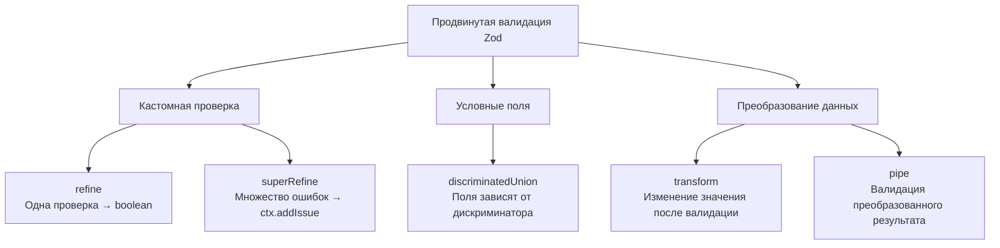
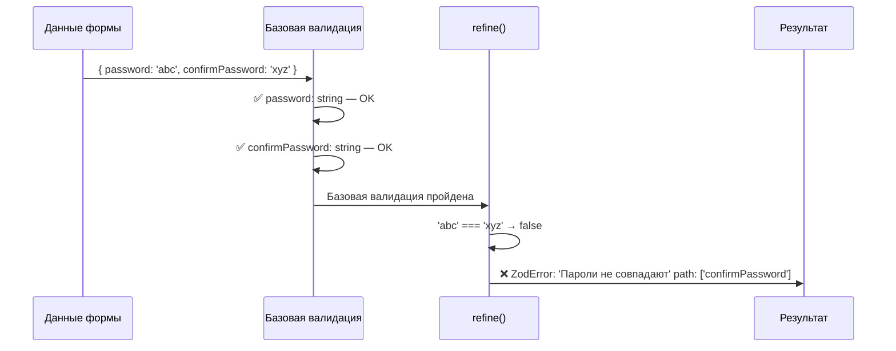
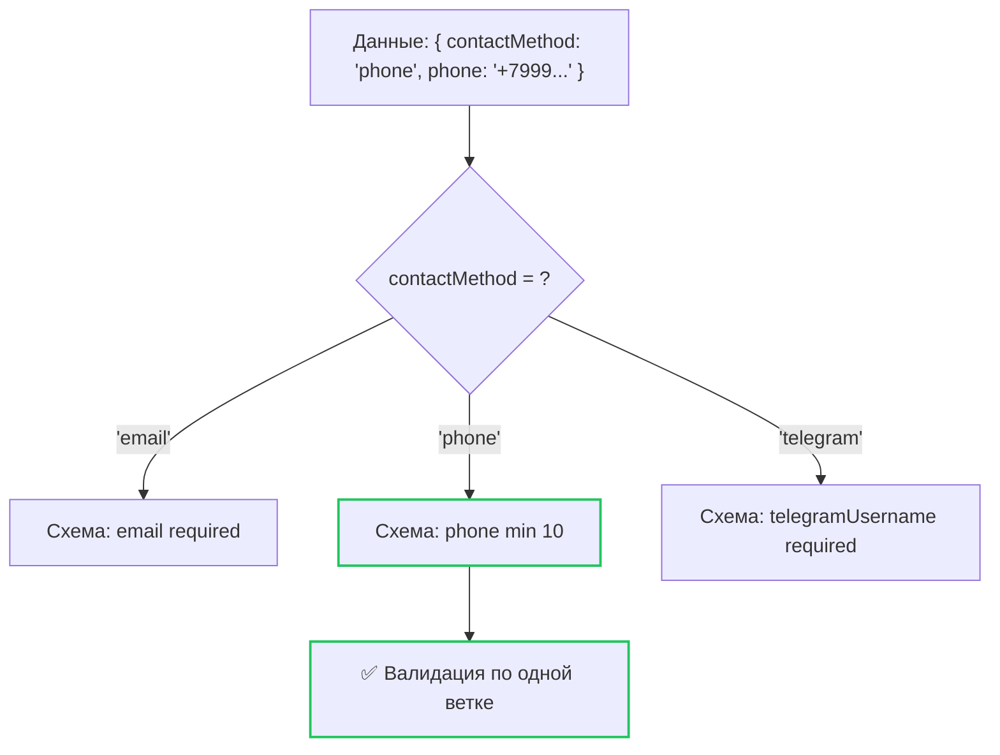
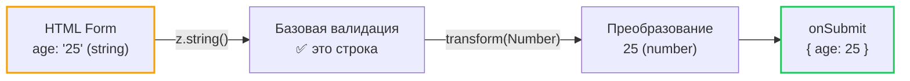

# Уровень 4: Продвинутый Zod

## Введение

После изучения базовых типов Zod пора перейти к продвинутым возможностям. В этом уровне вы научитесь создавать кастомную валидацию, работать с условными полями и преобразовывать данные прямо в схеме.

В предыдущем уровне мы строили схемы из стандартных блоков: `z.string()`, `z.number()`, `z.object()`. Эти блоки покрывают 70-80% потребностей типичной формы. Но реальные формы в продакшене требуют большего:

- Пароль должен совпадать с подтверждением -- это **межполевая** проверка, которую не выразить через `z.string().min(8)`
- Имя пользователя должно быть уникальным -- нужна **асинхронная** проверка через API
- Набор полей меняется в зависимости от выбора пользователя -- выбрал "email" как способ связи, значит, показать поле email; выбрал "телефон" -- показать поле телефона
- HTML-инпуты возвращают строки, а бэкенд ожидает числа и даты -- нужно **преобразование** данных

Аналогия: если базовые типы Zod -- это кирпичи, из которых строится стена, то `refine`, `superRefine`, `discriminatedUnion` и `transform` -- это **инженерные системы** здания: водопровод, электрика, вентиляция. Без них стена стоит, но жить в здании невозможно.

Вот как распределяются инструменты продвинутого Zod по типам задач:



---

## Кастомная валидация с `refine`

### Одиночное refine

`refine` позволяет добавить произвольную проверку, которую нельзя выразить встроенными методами. Он принимает функцию, которая возвращает `boolean`: `true` -- валидация пройдена, `false` -- ошибка.

Представьте `refine` как **дополнительный фильтр** на конвейере. Данные уже прошли базовую проверку (строка, число, минимальная длина), и теперь вы добавляете свою логику поверх. Это как система контроля качества на заводе: автоматические сканеры уже проверили размер и форму детали, но инженер добавляет ещё одну проверку -- соответствие чертежу.

```tsx
const schema = z
  .object({
    password: z.string(),
    confirmPassword: z.string(),
  })
  .refine(data => data.password === data.confirmPassword, {
    message: 'Пароли не совпадают',
    path: ['confirmPassword'], // К какому полю привязать ошибку
  })
```

Разберём анатомию `refine`:

1. **Первый аргумент** -- функция-предикат `(data) => boolean`. Она получает весь объект данных (потому что `refine` вызван на уровне объекта, а не на уровне отдельного поля)
2. **Второй аргумент** -- объект конфигурации с двумя ключами:
   - `message` -- текст ошибки, который увидит пользователь
   - `path` -- массив, указывающий, к какому полю привязать ошибку в `formState.errors`

📌 **Важно:** параметр `path` критически важен для интеграции с React Hook Form. Без него ошибка попадёт в `errors.root`, а не в конкретное поле, и пользователь не увидит подсветку проблемного инпута.

### Что происходит под капотом

Когда Zod встречает `refine`, он создаёт обёртку `ZodEffects` вокруг вашей схемы. При парсинге данных сначала выполняется базовая валидация объекта (все поля проходят свои проверки), и только если она успешна -- вызывается ваша функция `refine`. Если базовая валидация провалилась (например, `password` пустой), `refine` **не вызывается** -- Zod не тратит время на кастомную проверку заведомо невалидных данных.



### Несколько refine

Можно выстроить цепочку проверок, каждая со своей ошибкой:

```tsx
const schema = z
  .object({
    currentPassword: z.string(),
    newPassword: z.string(),
  })
  .refine(data => data.newPassword !== data.currentPassword, {
    message: 'Новый пароль должен отличаться',
    path: ['newPassword'],
  })
  .refine(data => data.newPassword.length >= 8, {
    message: 'Минимум 8 символов',
    path: ['newPassword'],
  })
```

⚠️ **Важный нюанс цепочки:** `refine` в цепочке работают **последовательно**. Если первый `refine` вернёт `false`, второй **не выполнится**. Пользователь увидит только первую ошибку и не узнает о второй, пока не исправит первую. Для формы смены пароля это значит: сначала "Новый пароль должен отличаться", потом (после исправления) -- "Минимум 8 символов". Это может раздражать пользователя, который хочет видеть все проблемы сразу. Решение -- `superRefine` (разберём ниже).

### Async refine

`refine` поддерживает асинхронные функции. Это необходимо, когда проверка требует обращения к серверу -- например, проверка уникальности имени пользователя или email:

```tsx
const schema = z
  .object({
    username: z.string(),
  })
  .refine(
    async data => {
      const response = await fetch(`/api/check-username?username=${data.username}`)
      const { available } = await response.json()
      return available
    },
    {
      message: 'Имя пользователя занято',
      path: ['username'],
    }
  )
```

💡 **Совет для продакшена:** асинхронный `refine` вызывается при **каждой** валидации формы. Если у вас `mode: 'onChange'`, это значит запрос к серверу при каждом нажатии клавиши. Обязательно добавляйте debounce на уровне формы или используйте `mode: 'onBlur'`, чтобы запрос уходил только после того, как пользователь покинул поле.

---

## Продвинутая валидация с `superRefine`

`superRefine` -- более мощная альтернатива `refine`. Она позволяет добавлять **несколько ошибок** за один проход и даёт полный контроль через объект `ctx`:

```tsx
const schema = z
  .object({
    password: z.string(),
    confirm: z.string(),
  })
  .superRefine((data, ctx) => {
    if (data.password.length < 8) {
      ctx.addIssue({
        code: z.ZodIssueCode.custom,
        message: 'Минимум 8 символов',
        path: ['password'],
      })
    }

    if (!/[A-Z]/.test(data.password)) {
      ctx.addIssue({
        code: z.ZodIssueCode.custom,
        message: 'Нужна хотя бы одна заглавная буква',
        path: ['password'],
      })
    }

    if (data.password !== data.confirm) {
      ctx.addIssue({
        code: z.ZodIssueCode.custom,
        message: 'Пароли не совпадают',
        path: ['confirm'],
      })
    }
  })
```

### Ключевое отличие от refine

Если `refine` -- это функция с простым ответом "да/нет", то `superRefine` -- это **инспектор с блокнотом**. Он проходит по данным, записывает **все** найденные проблемы в блокнот (`ctx.addIssue`), и в конце отдаёт полный отчёт. Ему не нужно останавливаться на первой ошибке.

Технически разница выглядит так:

- `refine` возвращает `boolean` -- одна функция, одна ошибка
- `superRefine` ничего не возвращает, но вызывает `ctx.addIssue()` для **каждой** найденной проблемы

Это критически важно для UX: пользователь видит **все** ошибки пароля сразу ("короткий", "нет заглавной", "нет цифры"), вместо того чтобы исправлять их по одной.

### Когда `superRefine` лучше `refine`?

| `refine`                                 | `superRefine`                               |
| ---------------------------------------- | ------------------------------------------- |
| Одна проверка -- одна ошибка             | Несколько ошибок за один вызов              |
| Возвращает `boolean`                     | Вызывает `ctx.addIssue()` для каждой ошибки |
| Удобен для простых проверок              | Удобен для сложной логики с ветвлениями     |
| Цепочка `.refine().refine()` -- медленнее | Один `.superRefine()` -- быстрее            |

🔥 **Правило выбора:** если у вас одна простая проверка (пароли совпадают?) -- используйте `refine`. Если проверок больше двух или они содержат ветвления -- `superRefine`.

### Продвинутая возможность: прерывание валидации с `fatal`

Иногда одна ошибка делает все остальные проверки бессмысленными. Например, если email не прошёл базовую валидацию, нет смысла проверять его уникальность. Для этого у `ctx.addIssue` есть флаг `fatal`:

```tsx
const schema = z.string().superRefine((val, ctx) => {
  if (val.length < 3) {
    ctx.addIssue({
      code: z.ZodIssueCode.custom,
      message: 'Минимум 3 символа',
      fatal: true, // Прекращает дальнейшую валидацию
    })
    return z.NEVER // Сигнал TypeScript: дальше кода не будет
  }

  // Этот код не выполнится, если длина < 3
  if (!/^[a-z]+$/.test(val)) {
    ctx.addIssue({
      code: z.ZodIssueCode.custom,
      message: 'Только строчные латинские буквы',
    })
  }
})
```

`z.NEVER` -- это не обязательный вызов для прерывания (прерывание делает `fatal: true`), но он помогает TypeScript понять, что код после `return` недостижим. Без него TypeScript может жаловаться на использование переменной `val` ниже, хотя до этого кода выполнение не дойдёт.

### Пример: проверка уникальности нескольких полей

В реальном приложении при регистрации часто нужно проверить одновременно и email, и username. С `superRefine` можно запустить оба запроса параллельно через `Promise.all`:

```tsx
const schema = z
  .object({
    email: z.string().email(),
    username: z.string().min(3),
  })
  .superRefine(async (data, ctx) => {
    const [emailTaken, usernameTaken] = await Promise.all([
      checkEmail(data.email),
      checkUsername(data.username),
    ])

    if (emailTaken) {
      ctx.addIssue({
        code: z.ZodIssueCode.custom,
        message: 'Email уже занят',
        path: ['email'],
      })
    }

    if (usernameTaken) {
      ctx.addIssue({
        code: z.ZodIssueCode.custom,
        message: 'Имя пользователя уже занято',
        path: ['username'],
      })
    }
  })
```

💡 **Совет:** `Promise.all` запускает обе проверки одновременно, а не последовательно. Если каждая проверка занимает 200 мс, с `Promise.all` общее время будет ~200 мс, а не 400 мс. Это важно для UX -- пользователь не должен ждать.

---

## `discriminatedUnion` -- условные поля

`discriminatedUnion` идеально подходит для форм, где набор полей зависит от выбранного значения (дискриминатора). Zod автоматически определяет, какую ветку схемы использовать.

### Проблема, которую решает discriminatedUnion

Представьте форму обратной связи, где пользователь выбирает способ связи: email, телефон или Telegram. В зависимости от выбора должны появляться разные поля с разными правилами валидации. Без `discriminatedUnion` вам пришлось бы делать все поля опциональными и писать сложную логику в `refine`:

```tsx
// ❌ Без discriminatedUnion -- сложно и ненадёжно
const badSchema = z
  .object({
    contactMethod: z.enum(['email', 'phone', 'telegram']),
    email: z.string().email().optional(),
    phone: z.string().optional(),
    telegramUsername: z.string().optional(),
  })
  .refine(
    data => {
      if (data.contactMethod === 'email') return !!data.email
      if (data.contactMethod === 'phone') return !!data.phone
      if (data.contactMethod === 'telegram') return !!data.telegramUsername
      return false
    },
    { message: 'Заполните контактные данные' }
  )
```

Проблемы этого подхода: все поля опциональны (тип не отражает реальность), валидация в `refine` дублирует бизнес-логику, ошибки неинформативны, TypeScript не может сузить тип.

### Решение с discriminatedUnion

```tsx
const contactSchema = z.discriminatedUnion('contactMethod', [
  z.object({
    contactMethod: z.literal('email'),
    email: z.string().email('Неверный email'),
  }),
  z.object({
    contactMethod: z.literal('phone'),
    phone: z.string().min(10, 'Минимум 10 цифр'),
  }),
  z.object({
    contactMethod: z.literal('telegram'),
    telegramUsername: z.string().min(1, 'Обязательно'),
  }),
])

type ContactForm = z.infer<typeof contactSchema>
// ContactForm =
//   | { contactMethod: 'email'; email: string }
//   | { contactMethod: 'phone'; phone: string }
//   | { contactMethod: 'telegram'; telegramUsername: string }
```

Обратите внимание на тип `ContactForm` -- это **дискриминированное объединение** (discriminated union) в TypeScript. Компилятор знает, что если `contactMethod === 'email'`, то у объекта **обязательно** есть поле `email`. Это позволяет безопасно работать с данными после валидации без дополнительных проверок.

### Как это работает под капотом

Когда Zod получает данные для валидации, он смотрит на значение дискриминатора (`contactMethod`) и **сразу** выбирает нужную ветку схемы. Никакого перебора вариантов:



### Использование с React Hook Form

```tsx
function ContactForm() {
  const {
    register,
    handleSubmit,
    watch,
    formState: { errors },
  } = useForm<ContactForm>({
    resolver: zodResolver(contactSchema),
  })

  const method = watch('contactMethod')

  return (
    <form onSubmit={handleSubmit(onSubmit)}>
      <select {...register('contactMethod')}>
        <option value="email">Email</option>
        <option value="phone">Телефон</option>
        <option value="telegram">Telegram</option>
      </select>

      {method === 'email' && <input {...register('email')} placeholder="Email" />}
      {method === 'phone' && <input {...register('phone')} placeholder="Телефон" />}
      {method === 'telegram' && <input {...register('telegramUsername')} placeholder="@username" />}

      <button type="submit">Отправить</button>
    </form>
  )
}
```

📌 **Важно:** при переключении `contactMethod` скрытые поля удаляются из DOM, но их значения **остаются** во внутреннем хранилище RHF. Это означает, что при повторном переключении пользователь увидит ранее введённые данные. Если нужно очищать значения при переключении, используйте `useEffect` с `reset` или `setValue`.

### Почему `discriminatedUnion`, а не `union`?

- `discriminatedUnion` **быстрее** -- Zod сразу знает, какую ветку проверять, по значению дискриминатора
- `union` перебирает все варианты и собирает ошибки из каждого -- это медленнее и даёт менее понятные сообщения об ошибках
- `discriminatedUnion` требует, чтобы дискриминатор был `z.literal()` -- это явно и предсказуемо

Аналогия: представьте почтовую сортировку. `discriminatedUnion` -- это когда на конверте написан индекс, и машина сразу кидает его в нужный ящик. `union` -- это когда машина пытается засунуть конверт в каждый ящик по очереди и смотрит, подошёл ли он. Первый способ очевидно быстрее.

---

## `transform` и `pipe` -- преобразование данных

### `transform` -- преобразование после валидации

`transform` позволяет изменить значение **после** успешной валидации. Это полезно для нормализации данных перед отправкой.

### Зачем нужно преобразование?

HTML-формы работают со строками. Когда пользователь вводит "25" в поле возраста, JavaScript получает строку `"25"`, а не число `25`. Когда вводит email с пробелами и заглавными буквами "  User@Example.COM  ", бэкенд ожидает нормализованный `"user@example.com"`. Дата из `<input type="date">` приходит как строка `"2024-01-15"`, а API ожидает объект `Date`.

`transform` решает все эти задачи -- он превращает "сырые" данные формы в формат, готовый для отправки на сервер:

```tsx
const schema = z.object({
  // Trim пробелов
  name: z
    .string()
    .min(1, 'Обязательно')
    .transform(val => val.trim()),

  // String -> Number
  age: z.string().transform(val => Number(val)),

  // Нормализация email
  email: z
    .string()
    .email('Неверный email')
    .transform(val => val.toLowerCase().trim()),

  // Преобразование даты
  birthDate: z.string().transform(val => new Date(val)),
})

// Input type:  { name: string, age: string, email: string, birthDate: string }
// Output type: { name: string, age: number, email: string, birthDate: Date }
type FormInput = z.input<typeof schema> // тип ДО transform
type FormOutput = z.output<typeof schema> // тип ПОСЛЕ transform (= z.infer)
```

🔥 **Ключевой момент:** после `transform` входной и выходной типы схемы **различаются**. Zod отслеживает оба типа:

- `z.input<typeof schema>` -- тип **до** преобразования (что приходит из формы)
- `z.output<typeof schema>` (он же `z.infer<typeof schema>`) -- тип **после** преобразования (что получает `onSubmit`)



### `pipe` -- цепочка валидации и преобразования

`pipe` позволяет передать результат одной схемы в другую. Это полезно, когда нужно сначала преобразовать значение, а затем **валидировать преобразованный результат**:

```tsx
const schema = z.object({
  // String из input -> преобразуем в number -> валидируем как number
  age: z
    .string()
    .transform(val => Number(val))
    .pipe(z.number().min(18, 'Минимум 18 лет').max(120, 'Максимум 120 лет')),

  // String -> Number -> проверка на положительность
  price: z
    .string()
    .transform(val => parseFloat(val))
    .pipe(z.number().positive('Цена должна быть положительной')),
})
```

Без `pipe` после `transform` нет валидации результата. Если пользователь введёт "abc" в поле возраста, `Number("abc")` вернёт `NaN`, и это значение молча проскочит дальше. `pipe` ловит такие случаи, потому что `NaN` не пройдёт проверку `z.number()`.

### `transform` vs `pipe`

| `transform`                        | `pipe`                                               |
| ---------------------------------- | ---------------------------------------------------- |
| Преобразует значение               | Передаёт результат в другую схему                    |
| Нет валидации после преобразования | Валидация преобразованного значения                  |
| `.transform(v => Number(v))`       | `.transform(v => Number(v)).pipe(z.number().min(1))` |

💡 **Совет:** думайте о `transform` как о конвертере розеток (меняет форму, но не проверяет напряжение), а о `pipe` -- как о конвертере с предохранителем (меняет форму **и** проверяет, что напряжение в допустимом диапазоне).

### Практический пример: форма с ценами

В реальном проекте форма добавления товара часто содержит поля с числами, которые приходят из HTML как строки. Пользователь может ввести цену с запятой ("19,99"), а бэкенд ожидает число. Вот как это решается:

```tsx
const productSchema = z.object({
  title: z
    .string()
    .min(1, 'Обязательно')
    .transform(val => val.trim()),

  price: z
    .string()
    .transform(val => parseFloat(val.replace(',', '.')))
    .pipe(z.number({ message: 'Должно быть числом' }).positive('Цена должна быть положительной')),

  quantity: z
    .string()
    .transform(val => parseInt(val, 10))
    .pipe(
      z
        .number({ message: 'Должно быть числом' })
        .int('Должно быть целым числом')
        .min(1, 'Минимум 1')
    ),
})
```

Этот паттерн -- `z.string().transform().pipe(z.number().правила())` -- является **стандартным** для числовых полей в формах. Вы будете использовать его постоянно.

### Альтернатива: `z.coerce`

Для простых случаев преобразования типов Zod предлагает `z.coerce` -- он автоматически вызывает конструктор нужного типа перед валидацией:

```tsx
const schema = z.object({
  age: z.coerce.number().min(18).max(120),
  // Эквивалент: z.string().transform(Number).pipe(z.number().min(18).max(120))

  date: z.coerce.date(),
  // Эквивалент: z.string().transform(v => new Date(v)).pipe(z.date())
})
```

⚠️ **Внимание:** `z.coerce.number()` использует `Number(input)` под капотом. Это означает, что `Number("")` вернёт `0`, а не `NaN`. Пустая строка пройдёт валидацию как число `0`. Если это нежелательно, используйте ручной `transform` + `pipe` с дополнительной проверкой.

---

## Межполевая валидация

Межполевая (кросс-полевая) валидация -- это проверки, которые зависят от значений нескольких полей одновременно. В Zod для этого используются `refine` и `superRefine` на уровне объекта.

### Почему это отдельная тема?

Базовые валидаторы (`min`, `max`, `email`) работают с **одним полем** изолированно. Но бизнес-правила часто связывают поля друг с другом:

- Дата окончания должна быть позже даты начала
- Максимальный возраст должен быть больше минимального
- Если выбрана роль "admin", поле "код приглашения" обязательно
- Сумма всех процентов должна равняться 100

Все эти проверки невозможно выразить на уровне отдельного поля -- они требуют доступа ко **всему объекту** данных. Именно поэтому `refine` и `superRefine` вызываются **на объекте**, а не на отдельном поле:

```tsx
const schema = z
  .object({
    startDate: z.string().min(1, 'Обязательно'),
    endDate: z.string().min(1, 'Обязательно'),
    minAge: z.number().min(0),
    maxAge: z.number().min(0),
  })
  .refine(data => new Date(data.endDate) > new Date(data.startDate), {
    message: 'Дата окончания должна быть позже даты начала',
    path: ['endDate'],
  })
  .refine(data => data.maxAge > data.minAge, {
    message: 'Максимальный возраст должен быть больше минимального',
    path: ['maxAge'],
  })
```

📌 **Важно:** `refine` на уровне объекта получает весь объект как аргумент (а не одно поле). Это и позволяет сравнивать значения разных полей между собой.

### Когда использовать superRefine для межполевой валидации

Если у вас больше двух-трёх кросс-полевых проверок, лучше объединить их в один `superRefine`. Это даст пользователю все ошибки сразу:

```tsx
const eventSchema = z
  .object({
    startDate: z.string(),
    endDate: z.string(),
    startTime: z.string(),
    endTime: z.string(),
    maxParticipants: z.coerce.number(),
    minParticipants: z.coerce.number(),
  })
  .superRefine((data, ctx) => {
    if (new Date(data.endDate) <= new Date(data.startDate)) {
      ctx.addIssue({
        code: z.ZodIssueCode.custom,
        message: 'Дата окончания должна быть позже даты начала',
        path: ['endDate'],
      })
    }

    if (data.startDate === data.endDate && data.endTime <= data.startTime) {
      ctx.addIssue({
        code: z.ZodIssueCode.custom,
        message: 'Время окончания должно быть позже времени начала',
        path: ['endTime'],
      })
    }

    if (data.maxParticipants <= data.minParticipants) {
      ctx.addIssue({
        code: z.ZodIssueCode.custom,
        message: 'Максимум участников должен быть больше минимума',
        path: ['maxParticipants'],
      })
    }
  })
```

---

## ⚠️ Частые ошибки новичков

### ❌ Ошибка 1: .refine() без path

```tsx
// ❌ Неправильно -- ошибка не привязана к полю
.refine((data) => data.password === data.confirm, {
  message: 'Пароли не совпадают'
})

// ✅ Правильно -- указываем path
.refine((data) => data.password === data.confirm, {
  message: 'Пароли не совпадают',
  path: ['confirm']
})
```

**Почему это ошибка:** Без `path` ошибка попадёт в `errors.root`, а не в `errors.confirm`. Поле не подсветится, и пользователь не поймёт, где проблема. React Hook Form рендерит ошибки по полям (`errors.fieldName.message`), и если ошибка не привязана к полю, она просто "потеряется" -- ни один компонент её не отобразит, если вы специально не обрабатываете `errors.root`.

---

### ❌ Ошибка 2: Цепочка refine вместо superRefine

```tsx
// ❌ Неоптимально -- три отдельных прохода
schema
  .refine(data => data.password.length >= 8, { ... })
  .refine(data => /[A-Z]/.test(data.password), { ... })
  .refine(data => data.password !== data.username, { ... })

// ✅ Лучше -- один проход с superRefine
schema.superRefine((data, ctx) => {
  if (data.password.length < 8) ctx.addIssue({ ... })
  if (!/[A-Z]/.test(data.password)) ctx.addIssue({ ... })
  if (data.password === data.username) ctx.addIssue({ ... })
})
```

**Почему это ошибка:** Цепочка `refine` выполняет каждую проверку в отдельном проходе, и если первая не пройдёт, остальные не выполнятся. `superRefine` проверяет всё за один раз. Для пользователя это означает: с `refine` он видит ошибки **по одной** и вынужден отправлять форму снова и снова. С `superRefine` он видит **все** ошибки сразу и может исправить их за один раз.

---

### ❌ Ошибка 3: transform без pipe для валидации результата

```tsx
// ❌ Неправильно -- NaN пройдёт валидацию
age: z.string().transform(val => Number(val))

// ✅ Правильно -- валидируем преобразованное значение
age: z.string()
  .transform(val => Number(val))
  .pipe(z.number().min(18).max(120))
```

**Почему это ошибка:** `transform` не валидирует результат. Если пользователь введёт "abc", `Number("abc")` вернёт `NaN`, и это значение будет принято без ошибки. `NaN` -- это технически тип `number` в JavaScript, но бэкенд не сможет с ним работать. `pipe(z.number())` поймает `NaN`, потому что Zod проверяет, что значение -- конечное число.

---

### ❌ Ошибка 4: z.infer вместо z.input при transform

```tsx
const schema = z.object({
  age: z.string().transform(val => Number(val)),
})

// ❌ Неправильно -- z.infer даёт тип ПОСЛЕ transform: { age: number }
// Но форма работает с входными данными, где age -- это string
const { register } = useForm<z.infer<typeof schema>>()

// ✅ Правильно -- z.input даёт тип ДО transform: { age: string }
const { register } = useForm<z.input<typeof schema>>({
  resolver: zodResolver(schema),
})
```

**Почему это ошибка:** При использовании `transform` входной и выходной типы различаются. Форма работает с входными данными (строки из `<input>`), поэтому для `useForm` нужен `z.input`. А `z.infer` (= `z.output`) нужен для типизации `onSubmit` -- там уже преобразованные данные:

```tsx
const { register, handleSubmit } = useForm<z.input<typeof schema>>({
  resolver: zodResolver(schema),
})

const onSubmit = (data: z.output<typeof schema>) => {
  // data.age -- уже number, не string
  console.log(data.age + 1) // OK
}
```

---

### ❌ Ошибка 5: discriminatedUnion без очистки значений при переключении

```tsx
// ❌ Проблема: пользователь ввёл email, переключил на phone,
// вернулся на email -- старое значение осталось.
// Но если он переключит на phone и нажмёт Submit --
// в данных будет и phone, и старый email (в хранилище RHF)
const method = watch('contactMethod')

// ✅ Решение: очищать значения при переключении
useEffect(() => {
  if (method === 'email') {
    setValue('phone', undefined)
    setValue('telegramUsername', undefined)
  }
  // ... аналогично для других веток
}, [method, setValue])
```

**Почему это ошибка:** React Hook Form сохраняет значения всех зарегистрированных полей даже после их размонтирования. Zod-валидация отработает корректно (проверит только нужную ветку), но в хранилище RHF останутся "мусорные" значения от других веток. Это может привести к проблемам при отладке или если вы читаете значения через `getValues()`.

---

## 📚 Дополнительные ресурсы

- [Zod: refine](https://zod.dev/?id=refine)
- [Zod: superRefine](https://zod.dev/?id=superrefine)
- [Zod: discriminatedUnion](https://zod.dev/?id=discriminated-unions)
- [Zod: transform](https://zod.dev/?id=transform)
- [Zod: pipe](https://zod.dev/?id=pipe)
- [Zod: z.input и z.output](https://zod.dev/?id=extracting-input--output-types) -- разница между входным и выходным типами

---

## Что дальше?

В следующем уровне вы познакомитесь с Yup -- альтернативной библиотекой валидации -- и сравните её с Zod. Вы узнаете:

- Как выглядит та же валидация в Yup
- В чём сильные и слабые стороны каждой библиотеки
- Когда выбирать Zod, а когда Yup
- Как мигрировать с Yup на Zod
