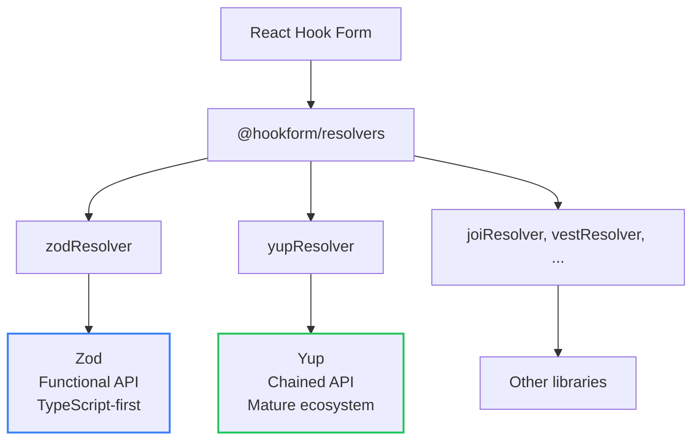
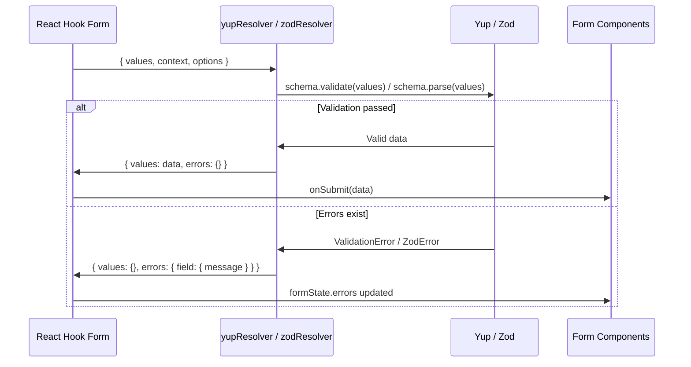

# Level 5: Yup and Library Comparison

## Introduction

Zod is not the only schema validation library. **Yup** is a time-tested alternative with a chained API, widely used in the React ecosystem. In this level, you'll learn Yup and learn to choose between Zod and Yup for your projects.

In the previous two levels, we deeply studied Zod -- from basic types to `refine`, `superRefine`, and `discriminatedUnion`. Zod has become the de facto standard for TypeScript projects, but the reality is that **most existing projects use Yup**. It appeared earlier (2016 vs 2020), became the standard validator for Formik, and millions of lines of production code are written with it.

Analogy: if Zod is **Swift** (modern, strictly typed, built from scratch for safety), then Yup is **Objective-C** (proven, mature, with a huge ecosystem and codebase). Both solve the same task, but with different philosophies. And just as an iOS developer should know both languages, a React developer should be able to work with both Zod and Yup.

Here's how the two libraries relate in the form validation ecosystem:



**Key takeaway of this level:** React Hook Form is **not tied** to any specific validation library. Through the resolver system, it works with any of them identically. Your task is to understand the difference and make an informed choice for your project.

---

## Yup Basics

### What is Yup?

**Yup** is a schema validation library with a chained API inspired by the Joi library for Node.js. If you've worked with jQuery, Lodash, or Mongoose -- the style will feel familiar: you call methods one after another, building a chain of constraints.

**Installation:**

```bash
npm install yup @hookform/resolvers
```

You already installed `@hookform/resolvers` for Zod -- it contains adapters for all supported validation libraries. You only need `yup` itself additionally.

### Basic Example

```tsx
import { useForm } from 'react-hook-form'
import { yupResolver } from '@hookform/resolvers/yup'
import * as yup from 'yup'

// 1. Create the schema
const schema = yup.object({
  email: yup.string().email('Invalid email').required('Required'),
  password: yup.string().min(8, 'Minimum 8 characters').required('Required'),
})

// 2. Infer the type
type FormData = yup.InferType<typeof schema>

// 3. Use with useForm
const { register, handleSubmit } = useForm<FormData>({
  resolver: yupResolver(schema),
})
```

Notice the three steps -- they're identical to what we did with Zod. Only the import, schema syntax, and resolver name change. Everything else (working with `register`, `handleSubmit`, `formState`) remains exactly the same.

### Key Difference: Required by Default

**This is the most important architectural difference between Zod and Yup:**

```tsx
// Zod: fields are REQUIRED by default
const zodSchema = z.object({
  name: z.string(),           // required
  bio: z.string().optional(),  // need to explicitly mark as optional
})

// Yup: fields are OPTIONAL by default
const yupSchema = yup.object({
  name: yup.string().required(), // need to explicitly mark as required
  bio: yup.string(),              // optional
})
```

This isn't just a syntactic difference -- it's a **philosophical** one. Zod assumes "everything is required until stated otherwise" (safer, but more verbose for forms with many optional fields). Yup assumes "nothing is required until stated otherwise" (more convenient for prototypes, but easy to forget `.required()`).

---

## Yup Validation Types and Methods

### Strings

Yup offers a rich set of built-in validators for strings. Each method in the chain adds a new constraint:

```tsx
const schema = yup.object({
  // Required string
  name: yup.string().required('Required'),

  // Email
  email: yup.string().email('Invalid email').required('Required'),

  // URL
  website: yup.string().url('Invalid URL'),

  // With length
  username: yup.string().min(3).max(20),

  // With pattern
  phone: yup.string().matches(/^\+7\d{10}$/, 'Invalid format'),

  // Optional
  bio: yup.string(),

  // With default value
  role: yup.string().default('user'),

  // One of values
  status: yup.string().oneOf(['active', 'inactive']),
})
```

**Tip:** the order of calls in the chain usually doesn't matter, but `.required()` is recommended to be placed last -- so when reading the code you immediately see which fields are required. This is a convention, not a technical constraint.

### Numbers

```tsx
const schema = yup.object({
  // Required number
  age: yup.number().required('Required'),

  // With range
  rating: yup.number().min(1).max(10),

  // Positive
  price: yup.number().positive('Price must be positive'),

  // Integer
  count: yup.number().integer('Must be an integer'),

  // Optional
  discount: yup.number(),
})
```

**HTML form number trap:** HTML `<input type="number">` still returns a string. Yup tries to auto-coerce the string to a number, but if the user leaves the field empty, you get `NaN`. More on this in the errors section.

### Booleans

```tsx
const schema = yup.object({
  agree: yup.boolean().oneOf([true], 'Consent is required'),
  newsletter: yup.boolean(),
})
```

The `.oneOf([true])` trick is the standard way to validate "I agree to the terms" checkboxes. Without it, `false` (unchecked box) also passes validation, since `false` is a valid boolean value.

### Arrays

```tsx
const schema = yup.object({
  // Array of strings
  tags: yup.array().of(yup.string()),

  // With minimum length
  skills: yup.array().of(yup.string()).min(1, 'Select at least one'),

  // Array of objects
  contacts: yup.array().of(
    yup.object({
      type: yup.string(),
      value: yup.string(),
    })
  ),
})
```

### Objects

```tsx
const schema = yup.object({
  // Nested object
  address: yup.object({
    city: yup.string().required('Required'),
    street: yup.string().required('Required'),
    zip: yup.string().matches(/^\d{5}$/, 'Invalid zip code'),
  }),

  // Optional object
  company: yup.object({
    name: yup.string(),
    position: yup.string(),
  }),
})
```

### Type Comparison: Zod vs Yup

To reinforce, here's a parallel comparison of equivalent constructs:

| Task | Zod | Yup |
| --- | --- | --- |
| Required string | `z.string()` | `yup.string().required()` |
| Optional string | `z.string().optional()` | `yup.string()` |
| Email | `z.string().email()` | `yup.string().email()` |
| Enum | `z.enum(['a', 'b'])` | `yup.string().oneOf(['a', 'b'])` |
| Number >= 18 | `z.number().min(18)` | `yup.number().min(18)` |
| Array of strings | `z.array(z.string())` | `yup.array().of(yup.string())` |
| Type inference | `z.infer<typeof s>` | `yup.InferType<typeof s>` |

---

## Custom Validation with `.test()`

The `.test()` method in Yup is the equivalent of `.refine()` in Zod. It allows creating arbitrary checks that can't be expressed with built-in methods.

### Basic `.test()`

The method accepts three arguments: test name (for identification), error message, and a predicate function:

```tsx
const schema = yup.object({
  // Custom sync test
  username: yup
    .string()
    .test('no-spaces', 'Must not contain spaces', value => !value?.includes(' ')),
})
```

### Cross-field Validation via `yup.ref()`

One of Yup's conveniences is the built-in reference to other fields via `yup.ref()`. For password comparison, you don't need `refine` at the object level:

```tsx
const schema = yup.object({
  password: yup.string().required(),
  confirmPassword: yup.string().oneOf([yup.ref('password')], 'Passwords must match'),
})
```

In Zod, the same task would require writing `.refine()` at the entire object level:

```tsx
// Zod -- refine at object level
const zodSchema = z.object({
  password: z.string(),
  confirmPassword: z.string(),
}).refine(data => data.password === data.confirmPassword, {
  message: 'Passwords do not match',
  path: ['confirmPassword'],
})
```

In Yup, this is done in one line directly in the field description. This is one of Yup's advantages -- for typical tasks like "password confirmation" or "end date after start date", the code is more compact.

### Async test

```tsx
const schema = yup.object({
  email: yup.string().test('is-available', 'Email is already taken', async value => {
    if (!value) return true
    const response = await fetch(`/api/check-email?email=${value}`)
    const { available } = await response.json()
    return available
  }),
})
```

**Production tip:** like Zod `refine`, async `test` is called on every validation. Use `mode: 'onBlur'` or implement debounce to avoid sending a request on every keystroke.

### Custom test with context

The `.test()` method gives access to context via `this` -- you can access values of neighboring fields, path, schema options, and create dynamic errors:

```tsx
const schema = yup.object({
  startDate: yup.string().required(),
  endDate: yup
    .string()
    .required()
    .test('after-start', 'End date must be after start', function (value) {
      // this.parent gives access to all object fields
      const { startDate } = this.parent
      return new Date(value) > new Date(startDate)
    }),
})
```

> **Important:** To access `this.parent`, use a regular function (`function`), not an arrow function (`=>`). Arrow functions don't have their own `this`.

### Dynamic Errors via `createError`

Yup allows creating errors with dynamic messages directly inside `.test()`:

```tsx
const schema = yup.object({
  age: yup
    .number()
    .test('age-range', '', function (value) {
      if (!value) return true
      if (value < 18) {
        return this.createError({ message: 'Minimum age is 18' })
      }
      if (value > 120) {
        return this.createError({ message: 'Enter a realistic age' })
      }
      return true
    }),
})
```

This is analogous to `ctx.addIssue()` in Zod `superRefine`, but with more compact syntax. However, there's a difference: in Yup, `.test()` can return only **one** error, while Zod `superRefine` allows adding **multiple** via `ctx.addIssue()`.

### Conditional Validation with `.when()`

Yup has a built-in `.when()` method for conditional validation -- a convenient alternative to Zod `discriminatedUnion`:

```tsx
const schema = yup.object({
  hasCompany: yup.boolean(),
  companyName: yup.string().when('hasCompany', {
    is: true,
    then: schema => schema.required('Enter company name'),
    otherwise: schema => schema.notRequired(),
  }),
})
```

`.when()` can depend on multiple fields simultaneously:

```tsx
const schema = yup.object({
  isBig: yup.boolean(),
  isSpecial: yup.boolean(),
  count: yup.number().when(['isBig', 'isSpecial'], {
    is: (isBig: boolean, isSpecial: boolean) => isBig && isSpecial,
    then: schema => schema.min(5),
    otherwise: schema => schema.min(0),
  }),
})
```

---

## Zod vs Yup Comparison

### Summary Table

| Criterion               | Zod                               | Yup                                  |
| ------------------------- | --------------------------------- | ------------------------------------ |
| **Size**                | ~12 KB                            | ~14 KB                               |
| **TypeScript**          | First-class, excellent inference  | Good, but sometimes needs annotations |
| **API**                 | Functional, composable            | Chained, expressive                  |
| **Performance**         | Faster                            | Slower                               |
| **Async validation**    | Via `refine`                     | Via `test`                           |
| **Community**           | Large, growing                    | Very large, mature                   |
| **Documentation**       | Excellent                         | Good                                 |
| **Required by default** | Fields are required              | Fields are optional                  |
| **Cross-field refs**    | `refine` at object level          | `yup.ref()` inside field             |

### Syntax Comparison

```tsx
// Zod
const zodSchema = z.object({
  email: z.string().email('Invalid email'),
  age: z.number().min(18),
  role: z.enum(['admin', 'user']),
})
type ZodForm = z.infer<typeof zodSchema>

// Yup
const yupSchema = yup.object({
  email: yup.string().email('Invalid email').required(),
  age: yup.number().min(18).required(),
  role: yup.string().oneOf(['admin', 'user']).required(),
})
type YupForm = yup.InferType<typeof yupSchema>
```

Notice: the Zod version is shorter by three `.required()` calls. On a 20-field schema, this saves 20 lines of code and 20 potential places where you could forget about requiredness.

### Under the Hood: How Resolvers Work

A resolver is an adapter between a validation library and React Hook Form. Its task is to accept form data, validate it, and return the result in a standard format:



The resolver transforms errors from the library's format (Yup -- `ValidationError` with nested `inner`, Zod -- `ZodError` with `issues` array) into a unified `{ [fieldName]: { message, type } }` format that React Hook Form understands. This is exactly why switching between libraries is painless -- only the schema and resolver import change, while all other form code stays the same.

### When to Choose Zod?

- New TypeScript project
- Type safety matters (best type inference)
- Best performance needed
- Prefer functional API
- Need `discriminatedUnion`, `transform`, `pipe`
- Validation not only in forms (API routes, config, env variables)

### When to Choose Yup?

- JavaScript project (no TypeScript)
- Already using Yup in the project
- Love chained API
- Need lots of ready-made examples on the internet
- Migrating from Formik (Yup is its default validator)
- Familiar `yup.ref()` for cross-field references
- Built-in `.when()` for conditional validation

### Production Context: Migrating Between Libraries

In real projects, the question "Zod or Yup" often doesn't arise -- you come into an existing project where the choice is already made. But sometimes a migration task comes up. Here's a checklist:

1. **Replace imports** -- `* as yup from 'yup'` to `z from 'zod'` (or vice versa)
2. **Replace resolver** -- `yupResolver` to `zodResolver`
3. **Translate schemas** -- the most voluminous part. Use the correspondence table above
4. **Check requiredness** -- in Zod all fields are required, in Yup -- optional. This is the main source of bugs during migration
5. **Replace `.test()` with `.refine()`** (or vice versa) -- syntax is similar, but there are nuances with `this.parent` vs `data` argument
6. **Check cross-field references** -- `yup.ref('field')` needs to be rewritten as `.refine()` at the object level

**Tip:** migrate form by form, not the entire project at once. Zod and Yup can coexist -- different forms can use different resolvers.

---

## Integrating Yup with React Hook Form

### Full Example

```tsx
import { useForm } from 'react-hook-form'
import { yupResolver } from '@hookform/resolvers/yup'
import * as yup from 'yup'

const schema = yup.object({
  firstName: yup.string().required('First name is required'),
  lastName: yup.string().required('Last name is required'),
  email: yup.string().email('Invalid email').required('Email is required'),
  age: yup
    .number()
    .typeError('Must be a number')
    .min(18, 'Minimum 18 years')
    .max(120, 'Maximum 120 years')
    .required('Age is required'),
  password: yup
    .string()
    .min(8, 'Minimum 8 characters')
    .required('Password is required'),
  confirmPassword: yup
    .string()
    .oneOf([yup.ref('password')], 'Passwords do not match')
    .required('Confirm your password'),
})

type FormData = yup.InferType<typeof schema>

export function YupForm() {
  const {
    register,
    handleSubmit,
    formState: { errors, isValid },
  } = useForm<FormData>({
    resolver: yupResolver(schema),
    mode: 'onChange',
  })

  const onSubmit = (data: FormData) => {
    console.log('Submitted:', data)
  }

  return (
    <form onSubmit={handleSubmit(onSubmit)}>
      <div>
        <input {...register('firstName')} placeholder="First Name" />
        {errors.firstName && <span className="error">{errors.firstName.message}</span>}
      </div>

      <div>
        <input {...register('lastName')} placeholder="Last Name" />
        {errors.lastName && <span className="error">{errors.lastName.message}</span>}
      </div>

      <div>
        <input type="email" {...register('email')} placeholder="Email" />
        {errors.email && <span className="error">{errors.email.message}</span>}
      </div>

      <div>
        <input type="number" {...register('age')} placeholder="Age" />
        {errors.age && <span className="error">{errors.age.message}</span>}
      </div>

      <div>
        <input type="password" {...register('password')} placeholder="Password" />
        {errors.password && <span className="error">{errors.password.message}</span>}
      </div>

      <div>
        <input type="password" {...register('confirmPassword')} placeholder="Confirm password" />
        {errors.confirmPassword && <span className="error">{errors.confirmPassword.message}</span>}
      </div>

      <button type="submit" disabled={!isValid}>
        Register
      </button>
    </form>
  )
}
```

Notice that the usage pattern is **absolutely identical** to Zod forms from levels 3-4. The only differences:

1. Import `yupResolver` instead of `zodResolver`
2. Schema written in Yup syntax
3. Type inferred via `yup.InferType` instead of `z.infer`

All other scaffolding -- `register`, `handleSubmit`, `formState`, error display -- doesn't change. This is the power of resolver abstraction.

---

## Common Beginner Mistakes

### Mistake 1: Forgetting .required() in Yup

```tsx
// Wrong -- field is optional (default in Yup!)
email: yup.string().email('Invalid email')

// Correct -- add .required()
email: yup.string().email('Invalid email').required('Email is required')
```

**Why this is a mistake:** Unlike Zod, where fields are required by default, in Yup fields are **optional** by default. Without `.required()`, an empty string passes validation. This is the most common mistake when switching from Zod to Yup.

This error is especially treacherous on registration forms, where a forgotten `.required()` on the password field means a user can register without a password. In production, this is a critical vulnerability.

---

### Mistake 2: Arrow function in .test() with this

```tsx
// Wrong -- arrow function doesn't have this
endDate: yup.string().test('after-start', 'Too early', (value) => {
  const { startDate } = this.parent // ERROR: this === undefined
  return new Date(value) > new Date(startDate)
})

// Correct -- regular function for this access
endDate: yup.string().test('after-start', 'Too early', function(value) {
  const { startDate } = this.parent
  return new Date(value) > new Date(startDate)
})
```

**Why this is a mistake:** `this.parent` is available only in regular functions. Arrow functions inherit `this` from the outer context, where `parent` is undefined. This is a fundamental JavaScript property, not a Yup quirk.

**Mnemonic:** if `.test()` needs access to neighboring fields -- use `function`. If only checking the current value -- an arrow function will do.

---

### Mistake 3: Using yupResolver instead of zodResolver (and vice versa)

```tsx
// Wrong -- mixed up resolver
import { zodResolver } from '@hookform/resolvers/zod'
import * as yup from 'yup'

const schema = yup.object({ ... })
useForm({ resolver: zodResolver(schema) }) // TypeError!

// Correct -- use yupResolver for Yup schema
import { yupResolver } from '@hookform/resolvers/yup'

useForm({ resolver: yupResolver(schema) })
```

**Why this is a mistake:** Each validation library requires its own resolver. `zodResolver` only works with Zod schemas, `yupResolver` -- only with Yup schemas. On mismatch, you'll get a `TypeError` at runtime, because the resolver will try to call a method that doesn't exist on the "foreign" schema (e.g., `zodResolver` calls `.parse()`, which doesn't exist on a Yup schema).

**How to quickly diagnose:** if the form crashes with "schema.parse is not a function" or "schema.validate is not a function", check the resolver-library correspondence.

---

### Mistake 4: Not adding .typeError() for number fields

```tsx
// Wrong -- unclear "NaN is not a number" error
age: yup.number().min(18).required()

// Correct -- with a clear message
age: yup.number().typeError('Must be a number').min(18).required()
```

**Why this is a mistake:** When an HTML input returns an empty string, Yup tries to coerce it to a number and gets `NaN`. Without `.typeError()`, the error message will be technical and unclear to the user.

In Zod, this problem is solved differently -- via `z.coerce.number()` or `z.string().transform(Number)`, and the default error message is more understandable. In Yup, `.typeError()` is a mandatory companion of `yup.number()` in forms.

---

### Mistake 5: Forgetting about coercion with InferType

```tsx
// Problem: InferType accounts for coercion
const schema = yup.object({
  age: yup.number().required(),
})
type FormData = yup.InferType<typeof schema>
// FormData = { age: number }
// But HTML input returns string!
```

Yup automatically coerces string to number during validation. `InferType` returns the type **after** coercion, i.e., `number`. This is correct for the `onSubmit` handler -- by that point Yup has already converted the string to a number. But if you use `watch()` before validation, the value might be a string, while TypeScript considers it a number. Keep this in mind when working with `watch`.

---

## Additional Resources

- [Yup documentation](https://github.com/jquense/yup)
- [Yup API Reference](https://github.com/jquense/yup#api)
- [@hookform/resolvers](https://react-hook-form.com/docs/useform/resolver)
- [Zod documentation](https://zod.dev/)

---

## What's Next?

In the next level, you'll move on to **complex fields** -- those that can't be handled by simple `register`:

- **Controller** -- wrapper for integration with UI libraries (MUI, Ant Design, react-select)
- **Radio and Select** -- multiple choice fields
- **Checkbox** -- working with checkbox groups

If `register` works with "simple" HTML elements (`<input>`, `<textarea>`, `<select>`), then `Controller` opens the door to the world of custom components where standard `ref` doesn't work.
