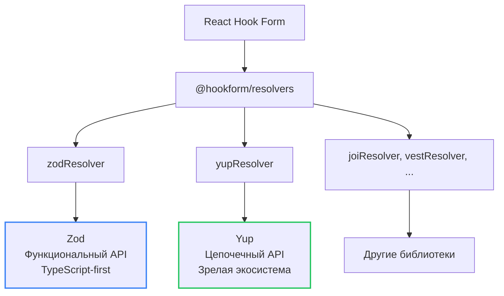
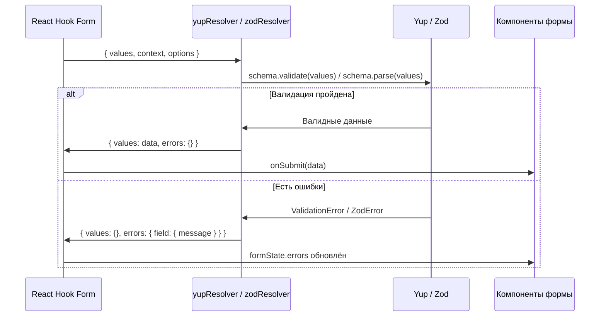

# Уровень 5: Yup и сравнение библиотек

## Введение

Zod -- не единственная библиотека для валидации схем. **Yup** -- проверенная временем альтернатива с цепочечным API, которая широко используется в экосистеме React. В этом уровне вы изучите Yup и научитесь выбирать между Zod и Yup для своих проектов.

В предыдущих двух уровнях мы глубоко изучили Zod -- от базовых типов до `refine`, `superRefine` и `discriminatedUnion`. Zod стал стандартом де-факто для TypeScript-проектов, но реальность такова, что **большинство существующих проектов используют Yup**. Он появился раньше (2016 vs 2020), стал стандартным валидатором для Formik, и миллионы строк продакшен-кода написаны с его помощью.

Аналогия: если Zod -- это **Swift** (современный, строго типизированный, созданный с нуля для безопасности), то Yup -- это **Objective-C** (проверенный, зрелый, с огромной экосистемой и кодовой базой). Оба решают одну задачу, но с разной философией. И как iOS-разработчик должен знать оба языка, так и React-разработчик должен уметь работать и с Zod, и с Yup.

Вот как две библиотеки соотносятся в экосистеме валидации форм:



📌 **Главный вывод этого уровня:** React Hook Form **не привязан** к конкретной библиотеке валидации. Через систему resolver-ов он работает с любой из них одинаково. Ваша задача -- понять разницу и сделать осознанный выбор для своего проекта.

---

## Основы Yup

### Что такое Yup?

**Yup** -- это библиотека для валидации схем с цепочечным (chained) API, вдохновлённая библиотекой Joi для Node.js. Если вы работали с jQuery, Lodash или Mongoose -- стиль покажется знакомым: вы вызываете методы один за другим, выстраивая цепочку ограничений.

**Установка:**

```bash
npm install yup @hookform/resolvers
```

Пакет `@hookform/resolvers` вы уже установили для Zod -- он содержит адаптеры для всех поддерживаемых библиотек валидации. Дополнительно нужен только сам `yup`.

### Базовый пример

```tsx
import { useForm } from 'react-hook-form'
import { yupResolver } from '@hookform/resolvers/yup'
import * as yup from 'yup'

// 1. Создайте схему
const schema = yup.object({
  email: yup.string().email('Неверный email').required('Обязательно'),
  password: yup.string().min(8, 'Минимум 8 символов').required('Обязательно'),
})

// 2. Выведите тип
type FormData = yup.InferType<typeof schema>

// 3. Используйте с useForm
const { register, handleSubmit } = useForm<FormData>({
  resolver: yupResolver(schema),
})
```

Обратите внимание на три шага -- они идентичны тому, что мы делали с Zod. Меняется только импорт, синтаксис схемы и имя resolver-а. Всё остальное (работа с `register`, `handleSubmit`, `formState`) остаётся ровно таким же.

### Ключевое отличие: обязательность по умолчанию

🔥 **Это самое важное архитектурное различие между Zod и Yup:**

```tsx
// Zod: поля ОБЯЗАТЕЛЬНЫ по умолчанию
const zodSchema = z.object({
  name: z.string(),           // обязательное
  bio: z.string().optional(),  // нужно явно пометить как optional
})

// Yup: поля ОПЦИОНАЛЬНЫ по умолчанию
const yupSchema = yup.object({
  name: yup.string().required(), // нужно явно пометить как required
  bio: yup.string(),              // опциональное
})
```

Это не просто синтаксическая разница -- это **философская** разница. Zod исходит из позиции "всё обязательно, пока не сказано иное" (безопаснее, но многословнее для форм с большим количеством опциональных полей). Yup исходит из позиции "ничего не обязательно, пока не сказано иное" (удобнее для прототипов, но легко забыть `.required()`).

---

## Типы и методы валидации Yup

### Строки

Yup предлагает богатый набор встроенных валидаторов для строк. Каждый метод в цепочке добавляет новое ограничение:

```tsx
const schema = yup.object({
  // Обязательная строка
  name: yup.string().required('Обязательно'),

  // Email
  email: yup.string().email('Неверный email').required('Обязательно'),

  // URL
  website: yup.string().url('Неверный URL'),

  // С длиной
  username: yup.string().min(3).max(20),

  // С паттерном
  phone: yup.string().matches(/^\+7\d{10}$/, 'Неверный формат'),

  // Опциональная
  bio: yup.string(),

  // С дефолтным значением
  role: yup.string().default('user'),

  // Один из значений
  status: yup.string().oneOf(['active', 'inactive']),
})
```

💡 **Совет:** порядок вызовов в цепочке обычно не важен, но `.required()` рекомендуется ставить последним -- так при чтении кода сразу видно, какие поля обязательные. Это конвенция, не техническое ограничение.

### Числа

```tsx
const schema = yup.object({
  // Обязательное число
  age: yup.number().required('Обязательно'),

  // С диапазоном
  rating: yup.number().min(1).max(10),

  // Положительное
  price: yup.number().positive('Цена должна быть положительной'),

  // Целое
  count: yup.number().integer('Должно быть целым числом'),

  // Опциональное
  discount: yup.number(),
})
```

⚠️ **Ловушка с числами в HTML-формах:** HTML `<input type="number">` всё равно возвращает строку. Yup пытается автоматически привести строку к числу (coercion), но если пользователь оставит поле пустым, получится `NaN`. Об этом подробнее в разделе ошибок.

### Булевы значения

```tsx
const schema = yup.object({
  agree: yup.boolean().oneOf([true], 'Необходимо согласие'),
  newsletter: yup.boolean(),
})
```

Трюк с `.oneOf([true])` -- стандартный способ валидации чекбоксов "Я согласен с условиями". Без этого `false` (непоставленная галочка) тоже пройдёт валидацию, ведь `false` -- допустимое булево значение.

### Массивы

```tsx
const schema = yup.object({
  // Массив строк
  tags: yup.array().of(yup.string()),

  // С минимальной длиной
  skills: yup.array().of(yup.string()).min(1, 'Выберите хотя бы один'),

  // Массив объектов
  contacts: yup.array().of(
    yup.object({
      type: yup.string(),
      value: yup.string(),
    })
  ),
})
```

### Объекты

```tsx
const schema = yup.object({
  // Вложенный объект
  address: yup.object({
    city: yup.string().required('Обязательно'),
    street: yup.string().required('Обязательно'),
    zip: yup.string().matches(/^\d{5}$/, 'Неверный индекс'),
  }),

  // Опциональный объект
  company: yup.object({
    name: yup.string(),
    position: yup.string(),
  }),
})
```

### Сравнение типов: Zod vs Yup

Чтобы закрепить, вот параллельное сравнение одинаковых конструкций:

| Задача | Zod | Yup |
| --- | --- | --- |
| Обязательная строка | `z.string()` | `yup.string().required()` |
| Опциональная строка | `z.string().optional()` | `yup.string()` |
| Email | `z.string().email()` | `yup.string().email()` |
| Enum | `z.enum(['a', 'b'])` | `yup.string().oneOf(['a', 'b'])` |
| Число ≥ 18 | `z.number().min(18)` | `yup.number().min(18)` |
| Массив строк | `z.array(z.string())` | `yup.array().of(yup.string())` |
| Вывод типа | `z.infer<typeof s>` | `yup.InferType<typeof s>` |

---

## Кастомная валидация с `.test()`

Метод `.test()` в Yup -- это аналог `.refine()` в Zod. Он позволяет создавать произвольные проверки, которые нельзя выразить встроенными методами.

### Базовый `.test()`

Метод принимает три аргумента: имя теста (для идентификации), сообщение об ошибке и функцию-предикат:

```tsx
const schema = yup.object({
  // Кастомный синхронный test
  username: yup
    .string()
    .test('no-spaces', 'Не должно содержать пробелов', value => !value?.includes(' ')),
})
```

### Кросс-полевая валидация через `yup.ref()`

Одно из удобств Yup -- встроенная ссылка на другие поля через `yup.ref()`. Для сравнения паролей не нужен `refine` на уровне объекта:

```tsx
const schema = yup.object({
  password: yup.string().required(),
  confirmPassword: yup.string().oneOf([yup.ref('password')], 'Пароли должны совпадать'),
})
```

В Zod для той же задачи пришлось бы писать `.refine()` на уровне всего объекта:

```tsx
// Zod — refine на уровне объекта
const zodSchema = z.object({
  password: z.string(),
  confirmPassword: z.string(),
}).refine(data => data.password === data.confirmPassword, {
  message: 'Пароли не совпадают',
  path: ['confirmPassword'],
})
```

В Yup это делается одной строкой прямо в описании поля. Это одно из преимуществ Yup -- для типовых задач вроде "подтверждение пароля" или "дата окончания позже даты начала" код получается компактнее.

### Async test

```tsx
const schema = yup.object({
  email: yup.string().test('is-available', 'Email уже занят', async value => {
    if (!value) return true
    const response = await fetch(`/api/check-email?email=${value}`)
    const { available } = await response.json()
    return available
  }),
})
```

💡 **Совет для продакшена:** как и с Zod `refine`, асинхронный `test` вызывается при каждой валидации. Используйте `mode: 'onBlur'` или реализуйте debounce, чтобы не отправлять запрос на каждое нажатие клавиши.

### Кастомный test с контекстом

Метод `.test()` даёт доступ к контексту через `this` -- можно обращаться к значениям соседних полей, пути, опциям схемы и создавать динамические ошибки:

```tsx
const schema = yup.object({
  startDate: yup.string().required(),
  endDate: yup
    .string()
    .required()
    .test('after-start', 'Дата окончания должна быть позже начала', function (value) {
      // this.parent даёт доступ ко всем полям объекта
      const { startDate } = this.parent
      return new Date(value) > new Date(startDate)
    }),
})
```

> 📌 **Важно:** Для доступа к `this.parent` используйте обычную функцию (`function`), а не стрелочную (`=>`). Стрелочные функции не имеют собственного `this`.

### Динамические ошибки через `createError`

Yup позволяет создавать ошибки с динамическим сообщением прямо внутри `.test()`:

```tsx
const schema = yup.object({
  age: yup
    .number()
    .test('age-range', '', function (value) {
      if (!value) return true
      if (value < 18) {
        return this.createError({ message: 'Минимальный возраст -- 18 лет' })
      }
      if (value > 120) {
        return this.createError({ message: 'Введите реальный возраст' })
      }
      return true
    }),
})
```

Это аналог `ctx.addIssue()` в Zod `superRefine`, но с более компактным синтаксисом. Однако есть отличие: в Yup `.test()` может вернуть только **одну** ошибку, в то время как Zod `superRefine` позволяет добавить **несколько** через `ctx.addIssue()`.

### Условная валидация с `.when()`

У Yup есть встроенный метод `.when()` для условной валидации -- это удобная альтернатива Zod `discriminatedUnion`:

```tsx
const schema = yup.object({
  hasCompany: yup.boolean(),
  companyName: yup.string().when('hasCompany', {
    is: true,
    then: schema => schema.required('Укажите название компании'),
    otherwise: schema => schema.notRequired(),
  }),
})
```

`.when()` может зависеть от нескольких полей одновременно:

```tsx
const schema = yup.object({
  isBig: yup.boolean(),
  isSpecial: yup.boolean(),
  count: yup.number().when(['isBig', 'isSpecial'], {
    is: (isBig: boolean, isSpecial: boolean) => isBig && isSpecial,
    then: schema => schema.min(5),
    otherwise: schema => schema.min(0),
  }),
})
```

---

## Сравнение Zod vs Yup

### Сводная таблица

| Критерий                  | Zod                               | Yup                                  |
| ------------------------- | --------------------------------- | ------------------------------------ |
| **Размер**                | ~12 KB                            | ~14 KB                               |
| **TypeScript**            | First-class, отличный вывод типов | Хороший, но иногда требует аннотаций |
| **API**                   | Функциональный, композируемый     | Цепочечный, выразительный            |
| **Производительность**    | Быстрее                           | Медленнее                            |
| **Асинхронная валидация** | Через `refine`                    | Через `test`                         |
| **Сообщество**            | Большое, растущее                 | Очень большое, зрелое                |
| **Документация**          | Отличная                          | Хорошая                              |
| **Обязательность**        | Поля обязательны по умолчанию     | Поля опциональны по умолчанию        |
| **Кросс-полевые ссылки**  | `refine` на уровне объекта        | `yup.ref()` внутри поля              |

### Сравнение синтаксиса

```tsx
// Zod
const zodSchema = z.object({
  email: z.string().email('Неверный email'),
  age: z.number().min(18),
  role: z.enum(['admin', 'user']),
})
type ZodForm = z.infer<typeof zodSchema>

// Yup
const yupSchema = yup.object({
  email: yup.string().email('Неверный email').required(),
  age: yup.number().min(18).required(),
  role: yup.string().oneOf(['admin', 'user']).required(),
})
type YupForm = yup.InferType<typeof yupSchema>
```

Обратите внимание: Zod-версия короче на три `.required()`. На схеме из 20 полей это экономит 20 строк кода и 20 потенциальных мест, где можно забыть про обязательность.

### Под капотом: как работают resolver-ы

Resolver -- это адаптер между библиотекой валидации и React Hook Form. Его задача -- принять данные формы, провалидировать их и вернуть результат в стандартном формате:



Resolver преобразует ошибки из формата библиотеки (у Yup -- `ValidationError` с вложенными `inner`, у Zod -- `ZodError` с массивом `issues`) в единый формат `{ [fieldName]: { message, type } }`, который понимает React Hook Form. Именно поэтому переход между библиотеками безболезнен -- меняется только схема и импорт resolver-а, а весь остальной код формы остаётся прежним.

### Когда выбирать Zod?

- ✅ Новый TypeScript проект
- ✅ Важна типобезопасность (лучший type inference)
- ✅ Нужна лучшая производительность
- ✅ Предпочитаете функциональный API
- ✅ Нужны `discriminatedUnion`, `transform`, `pipe`
- ✅ Валидация не только в формах (API-роуты, конфигурация, env-переменные)

### Когда выбирать Yup?

- ✅ JavaScript проект (без TypeScript)
- ✅ Уже используете Yup в проекте
- ✅ Любите цепочечный API
- ✅ Нужно много готовых примеров в интернете
- ✅ Миграция с Formik (Yup -- его стандартный валидатор)
- ✅ Привычный `yup.ref()` для кросс-полевых ссылок
- ✅ Встроенный `.when()` для условной валидации

### Продакшен-контекст: миграция между библиотеками

В реальных проектах вопрос "Zod или Yup" часто не стоит -- вы приходите в существующий проект, где выбор уже сделан. Но иногда возникает задача миграции. Вот чек-лист:

1. **Замените импорты** -- `* as yup from 'yup'` на `z from 'zod'` (или наоборот)
2. **Замените resolver** -- `yupResolver` на `zodResolver`
3. **Переведите схемы** -- самая объёмная часть. Используйте таблицу соответствий выше
4. **Проверьте обязательность** -- в Zod все поля обязательны, в Yup -- опциональны. Это главный источник багов при миграции
5. **Замените `.test()` на `.refine()`** (или наоборот) -- синтаксис похож, но есть нюансы с `this.parent` vs аргумент `data`
6. **Проверьте кросс-полевые ссылки** -- `yup.ref('field')` нужно переписать как `.refine()` на уровне объекта

💡 **Совет:** мигрируйте форму за формой, а не весь проект сразу. Zod и Yup могут сосуществовать -- разные формы могут использовать разные resolver-ы.

---

## Интеграция Yup с React Hook Form

### Полный пример

```tsx
import { useForm } from 'react-hook-form'
import { yupResolver } from '@hookform/resolvers/yup'
import * as yup from 'yup'

const schema = yup.object({
  firstName: yup.string().required('Имя обязательно'),
  lastName: yup.string().required('Фамилия обязательна'),
  email: yup.string().email('Неверный email').required('Email обязателен'),
  age: yup
    .number()
    .typeError('Должно быть числом')
    .min(18, 'Минимум 18 лет')
    .max(120, 'Максимум 120 лет')
    .required('Возраст обязателен'),
  password: yup
    .string()
    .min(8, 'Минимум 8 символов')
    .required('Пароль обязателен'),
  confirmPassword: yup
    .string()
    .oneOf([yup.ref('password')], 'Пароли не совпадают')
    .required('Подтвердите пароль'),
})

type FormData = yup.InferType<typeof schema>

export function YupForm() {
  const {
    register,
    handleSubmit,
    formState: { errors, isValid },
  } = useForm<FormData>({
    resolver: yupResolver(schema),
    mode: 'onChange',
  })

  const onSubmit = (data: FormData) => {
    console.log('Submitted:', data)
  }

  return (
    <form onSubmit={handleSubmit(onSubmit)}>
      <div>
        <input {...register('firstName')} placeholder="Имя" />
        {errors.firstName && <span className="error">{errors.firstName.message}</span>}
      </div>

      <div>
        <input {...register('lastName')} placeholder="Фамилия" />
        {errors.lastName && <span className="error">{errors.lastName.message}</span>}
      </div>

      <div>
        <input type="email" {...register('email')} placeholder="Email" />
        {errors.email && <span className="error">{errors.email.message}</span>}
      </div>

      <div>
        <input type="number" {...register('age')} placeholder="Возраст" />
        {errors.age && <span className="error">{errors.age.message}</span>}
      </div>

      <div>
        <input type="password" {...register('password')} placeholder="Пароль" />
        {errors.password && <span className="error">{errors.password.message}</span>}
      </div>

      <div>
        <input type="password" {...register('confirmPassword')} placeholder="Подтвердите пароль" />
        {errors.confirmPassword && <span className="error">{errors.confirmPassword.message}</span>}
      </div>

      <button type="submit" disabled={!isValid}>
        Зарегистрироваться
      </button>
    </form>
  )
}
```

Заметьте, что шаблон использования **абсолютно идентичен** Zod-формам из уровней 3-4. Единственные отличия:

1. Импорт `yupResolver` вместо `zodResolver`
2. Схема написана в синтаксисе Yup
3. Тип выводится через `yup.InferType` вместо `z.infer`

Вся остальная обвязка -- `register`, `handleSubmit`, `formState`, отображение ошибок -- не меняется. Это и есть сила абстракции resolver-ов.

### Выбор режима валидации

Режимы валидации (`mode`) работают одинаково для обеих библиотек:

| Режим | Когда срабатывает | Когда использовать |
| --- | --- | --- |
| `onSubmit` (default) | При отправке формы | Простые формы |
| `onChange` | При каждом изменении поля | Формы с мгновенной обратной связью |
| `onBlur` | При потере фокуса | Баланс между UX и производительностью |
| `onTouched` | После первого blur, затем onChange | Лучший UX: не пугаем ошибками до первого взаимодействия |
| `all` | onChange + onBlur | Максимальная обратная связь |

🎯 **Рекомендация:** для большинства форм `onTouched` -- лучший выбор. Пользователь не увидит ошибку, пока не начнёт взаимодействовать с полем, но после первого взаимодействия получит мгновенную обратную связь.

---

## ⚠️ Частые ошибки новичков

### ❌ Ошибка 1: Забыли .required() в Yup

```tsx
// ❌ Неправильно -- поле необязательно (по умолчанию в Yup!)
email: yup.string().email('Неверный email')

// ✅ Правильно -- добавляем .required()
email: yup.string().email('Неверный email').required('Email обязателен')
```

**Почему это ошибка:** В отличие от Zod, где поля обязательны по умолчанию, в Yup поля по умолчанию **опциональны**. Без `.required()` пустая строка пройдёт валидацию. Это самая частая ошибка при переходе с Zod на Yup.

Особенно коварна эта ошибка на формах регистрации, где забытый `.required()` на поле пароля означает, что пользователь может зарегистрироваться без пароля. В продакшене это -- критическая уязвимость.

---

### ❌ Ошибка 2: Стрелочная функция в .test() с this

```tsx
// ❌ Неправильно -- стрелочная функция не имеет this
endDate: yup.string().test('after-start', 'Слишком рано', (value) => {
  const { startDate } = this.parent // ERROR: this === undefined
  return new Date(value) > new Date(startDate)
})

// ✅ Правильно -- обычная функция для доступа к this
endDate: yup.string().test('after-start', 'Слишком рано', function(value) {
  const { startDate } = this.parent
  return new Date(value) > new Date(startDate)
})
```

**Почему это ошибка:** `this.parent` доступен только в обычных функциях. Стрелочные функции наследуют `this` из внешнего контекста, где `parent` не определён. Это фундаментальное свойство JavaScript, а не особенность Yup.

💡 **Мнемоника:** если в `.test()` нужен доступ к соседним полям -- используйте `function`. Если проверяете только текущее значение -- стрелочная функция подойдёт.

---

### ❌ Ошибка 3: yupResolver вместо zodResolver (и наоборот)

```tsx
// ❌ Неправильно -- перепутали resolver
import { zodResolver } from '@hookform/resolvers/zod'
import * as yup from 'yup'

const schema = yup.object({ ... })
useForm({ resolver: zodResolver(schema) }) // TypeError!

// ✅ Правильно -- используем yupResolver для Yup-схемы
import { yupResolver } from '@hookform/resolvers/yup'

useForm({ resolver: yupResolver(schema) })
```

**Почему это ошибка:** Каждая библиотека валидации требует свой resolver. `zodResolver` работает только с Zod-схемами, `yupResolver` -- только с Yup-схемами. При несовпадении вы получите `TypeError` в рантайме, потому что resolver попытается вызвать метод, которого нет у "чужой" схемы (например, `zodResolver` вызовет `.parse()`, которого нет у Yup-схемы).

🐛 **Как быстро диагностировать:** если форма падает с ошибкой типа "schema.parse is not a function" или "schema.validate is not a function", проверьте соответствие resolver-а и библиотеки.

---

### ❌ Ошибка 4: .typeError() не добавлен для числовых полей

```tsx
// ❌ Неправильно -- непонятная ошибка "NaN is not a number"
age: yup.number().min(18).required()

// ✅ Правильно -- с понятным сообщением
age: yup.number().typeError('Должно быть числом').min(18).required()
```

**Почему это ошибка:** Когда HTML input возвращает пустую строку, Yup пытается привести её к числу и получает `NaN`. Без `.typeError()` сообщение об ошибке будет техническим и непонятным пользователю.

В Zod эта проблема решается иначе -- через `z.coerce.number()` или `z.string().transform(Number)`, и сообщение об ошибке по умолчанию более понятное. В Yup `.typeError()` -- обязательный спутник `yup.number()` в формах.

---

### ❌ Ошибка 5: Забыли про coercion при работе с InferType

```tsx
// ❌ Проблема: InferType учитывает coercion
const schema = yup.object({
  age: yup.number().required(),
})
type FormData = yup.InferType<typeof schema>
// FormData = { age: number }
// Но HTML input возвращает string!
```

Yup автоматически приводит строку к числу при валидации (coercion). `InferType` возвращает тип **после** приведения, то есть `number`. Это корректно для обработчика `onSubmit` -- к этому моменту Yup уже преобразует строку в число. Но если вы используете `watch()` до валидации, значение может быть строкой, а TypeScript будет считать его числом. Держите это в голове при работе с `watch`.

---

## 📚 Дополнительные ресурсы

- [Yup документация](https://github.com/jquense/yup)
- [Yup API Reference](https://github.com/jquense/yup#api)
- [@hookform/resolvers](https://react-hook-form.com/docs/useform/resolver)
- [Zod документация](https://zod.dev/)

---

## Что дальше?

В следующем уровне вы перейдёте к **сложным полям** -- тем, которые нельзя обработать простым `register`:

- **Controller** -- обёртка для интеграции с UI-библиотеками (MUI, Ant Design, react-select)
- **Radio и Select** -- поля с множественным выбором
- **Checkbox** -- работа с группами чекбоксов

Если `register` работает с "простыми" HTML-элементами (`<input>`, `<textarea>`, `<select>`), то `Controller` открывает двери в мир кастомных компонентов, где стандартный `ref` не работает.
