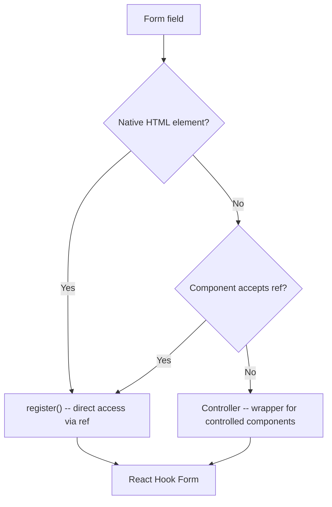
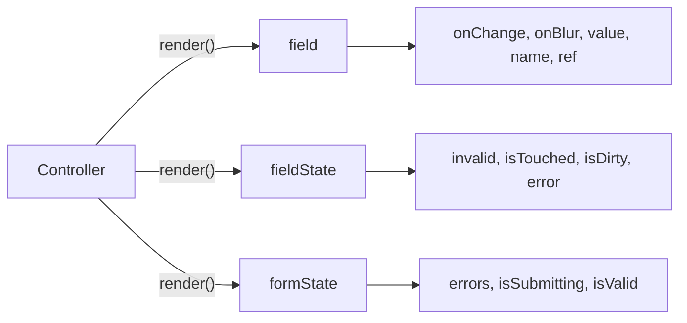
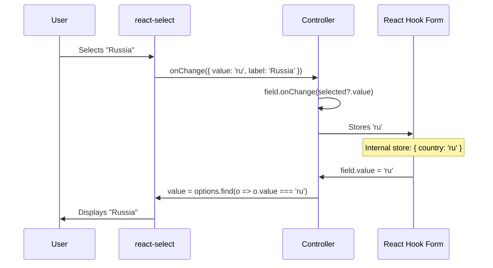
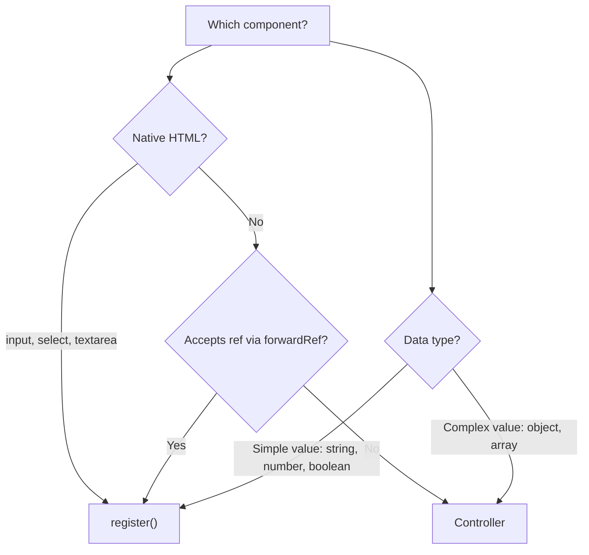

# Level 6: Complex Fields -- Controller, Radio, Select, Checkbox

## Introduction

Until now, all our form fields were native HTML elements: `<input>`, `<select>`, `<textarea>`. The `register` function handled them perfectly -- it passed `ref`, `onChange`, `onBlur`, and `name` directly to the DOM element, and React Hook Form read values straight from the DOM.

But in real projects, forms rarely consist of only bare HTML inputs. Design systems (Material UI, Ant Design, Chakra UI), custom components (styled selects, datepickers, autocompletes), and libraries like `react-select` -- all of these are **controlled components** that don't accept `ref` directly or work with values through their own API.

Analogy: imagine `register` is a **European-standard socket**. It perfectly fits appliances with European plugs (native HTML elements). But if you brought an appliance from another country (third-party UI component), you need an **adapter**. This is exactly the role `Controller` plays -- it adapts React Hook Form's interface for components that can't work with `register` directly.

In this level, we'll cover:

1. **Controller** -- bridge between RHF and controlled components
2. **Radio buttons** -- choosing one of several options
3. **Select** -- dropdown lists (native and custom)
4. **Checkbox** -- single flags and multiple selection



---

## Controller

### What is Controller?

**Controller** is a React Hook Form component that acts as an intermediary between the form and controlled components. It takes over managing the field value, handling change and blur events, and connecting to RHF's validation system.

Under the hood, `Controller` uses the `useController` hook, which subscribes to changes of a specific field via the `control` object. When the component inside `Controller` calls `field.onChange`, the value is written to RHF's internal store. When RHF needs to read a value (on submit, watch, or validation), it accesses the same store.

**When to use Controller:**

- Third-party UI components (Material-UI `TextField`, `Select`, `Checkbox`)
- Custom components that don't forward `ref` to the DOM element
- Components with their own data format (`react-select` returns an object `{ value, label }`)
- Datepickers, autocompletes, color-pickers, and other complex widgets

**When Controller is NOT needed:**

- Native HTML elements (`<input>`, `<select>`, `<textarea>`) -- use `register`
- Components that forward `ref` to an inner `<input>` via `forwardRef`

**Decision rule:** if a component can be connected via `register` -- use `register`. It's faster because it doesn't create a re-render subscription. `Controller` is the fallback for cases where `register` doesn't work.

### Basic Usage

```tsx
import { Controller, useForm } from 'react-hook-form'
import Select from 'react-select'

interface FormData {
  category: string
}

function MyForm() {
  const { control, handleSubmit } = useForm<FormData>()

  return (
    <form onSubmit={handleSubmit(console.log)}>
      <Controller
        name="category"
        control={control}
        render={({ field, fieldState: { error } }) => (
          <Select
            {...field}
            options={[
              { value: 'electronics', label: 'Electronics' },
              { value: 'clothing', label: 'Clothing' },
            ]}
          />
        )}
      />
      <button type="submit">Submit</button>
    </form>
  )
}
```

Let's break down the key `Controller` props:

| Prop | Required | Purpose |
|------|----------|---------|
| `name` | Yes | Field name in the form (key in the data object) |
| `control` | Yes | `control` object from `useForm` -- links Controller to a specific form |
| `render` | Yes | Function that returns your component's JSX |
| `rules` | No | Validation rules (analogous to the second argument of `register`) |
| `defaultValue` | No | Initial field value (better set via `defaultValues` in `useForm`) |

### render vs children

Controller supports two syntaxes for passing the render function. Both are fully equivalent -- choose whichever your team prefers:

```tsx
// Option 1: render prop (recommended -- explicit and readable)
<Controller
  name="category"
  control={control}
  render={({ field, fieldState }) => (
    <Select {...field} />
  )}
/>

// Option 2: children (same thing, alternative syntax)
<Controller
  name="category"
  control={control}
>
  {({ field, fieldState }) => (
    <Select {...field} />
  )}
</Controller>
```

**Tip:** in a project, pick one style and stick with it. Mixing two variants hurts readability. Most codebases use `render` -- it's more compact and explicit.

### All Render Function Parameters

The render function receives an object with three properties. Each is a "window" into different aspects of field and form state:

```tsx
<Controller
  name="category"
  control={control}
  render={({
    field,      // Object for connecting component to RHF
    fieldState, // State of the specific field
    formState,  // State of the entire form
  }) => <Select {...field} />}
/>
```

**`field`** -- the main object for binding the component:

| Property | Type | Purpose |
|----------|------|---------|
| `onChange` | `(value: any) => void` | Call on value change |
| `onBlur` | `() => void` | Call on focus loss |
| `value` | `any` | Current field value |
| `name` | `string` | Field name |
| `ref` | `React.Ref` | Ref for focus management |

**`fieldState`** -- field metadata:

| Property | Type | Purpose |
|----------|------|---------|
| `invalid` | `boolean` | Field failed validation |
| `isTouched` | `boolean` | User interacted with the field (blur) |
| `isDirty` | `boolean` | Value differs from `defaultValue` |
| `error` | `FieldError \| undefined` | Error object (contains `message` and `type`) |

**`formState`** -- global form state:

| Property | Type | Purpose |
|----------|------|---------|
| `errors` | `FieldErrors` | All form errors |
| `isSubmitting` | `boolean` | Form is being submitted |
| `isValid` | `boolean` | All fields are valid |
| `isDirty` | `boolean` | At least one field changed |



### Transforming Values in Controller

One of the main reasons `Controller` is needed is the ability to **transform** values between the component and the form. Third-party components often operate data in their own format, while the form only needs to store the relevant part.

```tsx
// react-select returns { value: 'el', label: 'Electronics' }
// But in the form we only want to store the string 'el'

<Controller
  name="category"
  control={control}
  render={({ field }) => (
    <Select
      {...field}
      // Intercept onChange -- extract only value
      onChange={(selected) => field.onChange(selected?.value)}
      // Convert string back to object for display
      value={options.find(opt => opt.value === field.value)}
      options={options}
    />
  )}
/>
```

This "adapter" pattern is standard when working with Controller. You intercept `onChange` and/or `value` to bring data to the required format.

### The `useController` Hook -- Alternative to Controller

If you're creating a reusable form component, it's more convenient to use the `useController` hook instead of the `Controller` component. It does the same thing but gives more flexibility:

```tsx
import { useForm, useController, UseControllerProps } from 'react-hook-form'

interface FormData {
  firstName: string
  lastName: string
}

// Reusable field component
function FormInput({ control, name, rules }: UseControllerProps<FormData>) {
  const {
    field: { onChange, onBlur, value, ref },
    fieldState: { error },
  } = useController({ name, control, rules })

  return (
    <div>
      <input
        onChange={onChange}
        onBlur={onBlur}
        value={value}
        ref={ref}
        placeholder={name}
        style={{ borderColor: error ? '#dc3545' : '#ddd' }}
      />
      {error && <span style={{ color: '#dc3545' }}>{error.message}</span>}
    </div>
  )
}

// Usage
function App() {
  const { control, handleSubmit } = useForm<FormData>({
    defaultValues: { firstName: '', lastName: '' },
  })

  return (
    <form onSubmit={handleSubmit(console.log)}>
      <FormInput
        name="firstName"
        control={control}
        rules={{ required: 'First name is required' }}
      />
      <FormInput
        name="lastName"
        control={control}
        rules={{ required: 'Last name is required' }}
      />
      <button type="submit">Submit</button>
    </form>
  )
}
```

**When to use what:**
- `Controller` -- for one-off integration cases in a specific form
- `useController` -- for creating reusable form components used across multiple forms

---

## Radio Buttons

### How Radio Works in HTML

Radio buttons are a group of mutually exclusive options: the user can select **only one**. In HTML, they're grouped by the `name` attribute -- all radios with the same `name` become part of one group. Each button has its own `value`, and when selected, this value goes into the form data.

Analogy: radio buttons work like **channel selectors on an old TV**. When you press one button, the previous one automatically pops out. The TV can only show one channel at a time.

### Registration via register

Native HTML radio buttons work great with `register`. RHF understands that multiple `<input type="radio">` with the same name form one group, and automatically manages the selection:

```tsx
import { useForm } from 'react-hook-form'

interface FormData {
  gender: 'male' | 'female' | 'other'
}

function RadioForm() {
  const { register, handleSubmit } = useForm<FormData>()

  const onSubmit = (data: FormData) => {
    console.log('Gender:', data.gender) // 'male' | 'female' | 'other'
  }

  return (
    <form onSubmit={handleSubmit(onSubmit)}>
      <fieldset>
        <legend>Gender</legend>
        <label>
          <input type="radio" value="male" {...register('gender')} />
          Male
        </label>
        <label>
          <input type="radio" value="female" {...register('gender')} />
          Female
        </label>
        <label>
          <input type="radio" value="other" {...register('gender')} />
          Other
        </label>
      </fieldset>
      <button type="submit">Submit</button>
    </form>
  )
}
```

Note the details:

1. **Same name** in `register('gender')` for all radios -- RHF understands this is one field
2. **Different `value`** -- this is exactly the value that goes into `data.gender`
3. **`<fieldset>` and `<legend>`** -- semantic grouping for accessibility

### Radio with Validation

```tsx
<input
  type="radio"
  value="male"
  {...register('gender', { required: 'Select gender' })}
/>
```

**Important:** the validation rule needs to be passed to **every** radio in the group, not just the first. Although RHF tracks the group by name, rules are bound to the specific `register` call. In practice, it's convenient to extract the options:

```tsx
const genderRules = { required: 'Select gender' }

<input type="radio" value="male" {...register('gender', genderRules)} />
<input type="radio" value="female" {...register('gender', genderRules)} />
<input type="radio" value="other" {...register('gender', genderRules)} />
```

### Radio with defaultValue

To have one button selected by default, use `defaultValues` in `useForm`:

```tsx
const { register } = useForm<FormData>({
  defaultValues: {
    gender: 'other', // "Other" selected by default
  },
})
```

---

## Select (Dropdown)

### Basic Select

Native HTML `<select>` works with `register` as simply as `<input>`. RHF registers the element, binds `ref`, and automatically reads the selected value:

```tsx
interface FormData {
  country: string
}

function SelectForm() {
  const { register, handleSubmit, formState: { errors } } = useForm<FormData>()

  return (
    <form onSubmit={handleSubmit(console.log)}>
      <select {...register('country')}>
        <option value="">Choose a country</option>
        <option value="us">USA</option>
        <option value="ru">Russia</option>
        <option value="de">Germany</option>
      </select>
      <button type="submit">Submit</button>
    </form>
  )
}
```

**Important pattern:** the first `<option>` with `value=""` is a placeholder. It allows the user to see a hint and prevents the form from submitting with the first real value auto-selected. Without it, the first value (`"us"`) would be selected by default, and `required` validation would always pass.

### Select with Validation

```tsx
<select
  {...register('country', {
    required: 'Choose a country',
  })}
>
  <option value="">Choose a country</option>
  <option value="us">USA</option>
  <option value="ru">Russia</option>
</select>
{errors.country && <span className="error">{errors.country.message}</span>}
```

The `required` validation checks that the value is not an empty string `""`. Since the placeholder has `value=""`, selecting the placeholder counts as an "empty field" and validation won't pass.

### Custom Select via Controller

Native `<select>` is simple and accessible, but limited in styling and functionality. Real projects often use `react-select`, `@mui/material/Select`, or other libraries. These require `Controller`:

```tsx
import { Controller, useForm } from 'react-hook-form'
import ReactSelect from 'react-select'

const countryOptions = [
  { value: 'us', label: 'USA' },
  { value: 'ru', label: 'Russia' },
  { value: 'de', label: 'Germany' },
]

function CustomSelectForm() {
  const { control, handleSubmit } = useForm<{ country: string }>({
    defaultValues: { country: '' },
  })

  return (
    <form onSubmit={handleSubmit(console.log)}>
      <Controller
        name="country"
        control={control}
        rules={{ required: 'Choose a country' }}
        render={({ field, fieldState: { error } }) => (
          <>
            <ReactSelect
              options={countryOptions}
              value={countryOptions.find(opt => opt.value === field.value)}
              onChange={(selected) => field.onChange(selected?.value ?? '')}
              onBlur={field.onBlur}
              placeholder="Choose a country..."
            />
            {error && <span className="error">{error.message}</span>}
          </>
        )}
      />
      <button type="submit">Submit</button>
    </form>
  )
}
```

Note the two transformations:
- **`value`**: RHF stores a string `'ru'`, but `react-select` expects an object `{ value: 'ru', label: 'Russia' }` -- find the right object via `find`
- **`onChange`**: `react-select` passes an object, and we extract only the `value`



---

## Checkbox

### Single Checkbox (boolean)

A single checkbox is an on/off toggle. In forms, it's most often used for terms agreement, newsletter subscription, remember me. The value in the form is a `boolean` (`true` or `false`).

Native checkbox works great with `register`. RHF automatically detects it's a checkbox (via `type="checkbox"`) and binds to the `checked` property, not `value`:

```tsx
interface FormData {
  agree: boolean
  newsletter: boolean
}

function CheckboxForm() {
  const { register, handleSubmit } = useForm<FormData>({
    defaultValues: {
      agree: false,
      newsletter: true, // Subscription enabled by default
    },
  })

  const onSubmit = (data: FormData) => {
    console.log('Agree:', data.agree)         // true | false
    console.log('Newsletter:', data.newsletter) // true | false
  }

  return (
    <form onSubmit={handleSubmit(onSubmit)}>
      <label>
        <input type="checkbox" {...register('agree')} />
        I agree to the terms
      </label>

      <label>
        <input type="checkbox" {...register('newsletter')} />
        Subscribe to newsletter
      </label>

      <button type="submit">Submit</button>
    </form>
  )
}
```

### Checkbox with Validation (Required Agreement)

Typical case -- a registration form where the user must agree to the terms:

```tsx
<label>
  <input
    type="checkbox"
    {...register('agree', {
      required: 'You must accept the terms',
    })}
  />
  I agree to the terms of use
</label>
{errors.agree && <span className="error">{errors.agree.message}</span>}
```

For checkbox, `required` checks that the value is `true` (checkbox is checked). If the checkbox is unchecked, `required` returns an error.

### Multiple Selection (Array)

When a user needs to select **multiple options** from a set (skills, categories, tags), checkboxes form an array of values. This is more complex than a single boolean, because you need to manage an array: add an element on check, remove on uncheck.

There are two approaches: manual management via `watch` + `setValue`, and using `Controller`.

#### Approach 1: watch + setValue

```tsx
interface FormData {
  skills: string[]
}

function MultiCheckboxForm() {
  const { watch, setValue, handleSubmit } = useForm<FormData>({
    defaultValues: { skills: [] },
  })

  const skills = watch('skills')

  const handleSkillChange = (skill: string, checked: boolean) => {
    if (checked) {
      setValue('skills', [...skills, skill])
    } else {
      setValue(
        'skills',
        skills.filter(s => s !== skill)
      )
    }
  }

  const onSubmit = (data: FormData) => {
    console.log('Skills:', data.skills) // ['react', 'typescript']
  }

  const skillOptions = ['react', 'vue', 'angular', 'typescript']

  return (
    <form onSubmit={handleSubmit(onSubmit)}>
      <fieldset>
        <legend>Skills</legend>
        {skillOptions.map(skill => (
          <label key={skill}>
            <input
              type="checkbox"
              value={skill}
              checked={skills.includes(skill)}
              onChange={e => handleSkillChange(skill, e.target.checked)}
            />
            {skill}
          </label>
        ))}
      </fieldset>
      <button type="submit">Submit</button>
    </form>
  )
}
```

This approach works but requires manually synchronizing `watch`, `setValue`, and `checked`. For multiple checkbox groups, this quickly becomes cumbersome.

#### Approach 2: Controller with Checkbox Group

```tsx
<Controller
  name="skills"
  control={control}
  rules={{
    validate: (v) => v.length > 0 || 'Select at least one skill',
  }}
  render={({ field, fieldState: { error } }) => (
    <fieldset>
      <legend>Skills</legend>
      {skillOptions.map(skill => (
        <label key={skill}>
          <input
            type="checkbox"
            value={skill}
            checked={field.value.includes(skill)}
            onChange={(e) => {
              const updated = e.target.checked
                ? [...field.value, skill]
                : field.value.filter((s: string) => s !== skill)
              field.onChange(updated)
            }}
          />
          {skill}
        </label>
      ))}
      {error && <span className="error">{error.message}</span>}
    </fieldset>
  )}
/>
```

**Tip:** the `Controller` approach scales better: validation is set in one place via `rules`, and the array update logic is encapsulated in `render`.

### Multiple Selection Validation

To check that the user selected at least one element (or a certain quantity), use `validate` in `rules` or a Zod schema:

```tsx
// Via validate in Controller
rules={{
  validate: (v) => v.length > 0 || 'Select at least one skill',
}}

// Via Zod schema (if using zodResolver)
const schema = z.object({
  skills: z.array(z.string()).min(1, 'Select at least one skill'),
})
```

---

## When to Use What: Summary Table

Before moving to errors, let's summarize -- which tool for which field type:

| Field type | Approach | Example |
|----------|--------|--------|
| `<input type="text">` | `register` | `{...register('name')}` |
| `<input type="radio">` | `register` (same name, different `value`) | `{...register('gender')}` |
| `<select>` (native) | `register` | `{...register('country')}` |
| `<input type="checkbox">` (boolean) | `register` | `{...register('agree')}` |
| Checkbox group (array) | `Controller` or `watch` + `setValue` | `<Controller name="skills" ...>` |
| `react-select` | `Controller` | `<Controller render={...}>` |
| Material-UI `TextField` | `Controller` | `<Controller render={...}>` |
| Any component without `ref` | `Controller` | `<Controller render={...}>` |



---

## Common Beginner Mistakes

### Mistake 1: Controller without control

```tsx
// Wrong -- control not passed
<Controller
  name="category"
  render={({ field }) => <Select {...field} />}
/>

// Correct -- pass control
const { control } = useForm()
<Controller
  name="category"
  control={control}
  render={({ field }) => <Select {...field} />}
/>
```

**Why this is a mistake:** `Controller` must know which form it's attached to. The `control` object is a link to the form's internal state created by `useForm`. Without it, Controller can neither write nor read values, nor trigger validation. TypeScript will show an error at compile time, but if types are disabled or JavaScript is used -- the error will manifest at runtime.

---

### Mistake 2: Controller for native checkbox

```tsx
// Redundant -- Controller for a regular HTML checkbox
<Controller
  name="agree"
  control={control}
  render={({ field }) => (
    <input type="checkbox" checked={field.value} onChange={field.onChange} />
  )}
/>

// Correct -- register works with native checkbox
<input type="checkbox" {...register('agree')} />
```

**Why this is a mistake:** `register` automatically handles native checkboxes. It detects `type="checkbox"` and correctly binds to the `checked` property. Using `Controller` adds unnecessary overhead -- extra re-renders and more code for no benefit.

---

### Mistake 3: Forgetting to transform values in Controller

```tsx
// Wrong -- react-select expects object, not string
<Controller
  name="country"
  control={control}
  render={({ field }) => (
    <ReactSelect
      {...field} // field.value is 'ru', but ReactSelect needs { value: 'ru', label: '...' }
      options={countryOptions}
    />
  )}
/>

// Correct -- transform value and onChange
<Controller
  name="country"
  control={control}
  render={({ field }) => (
    <ReactSelect
      value={countryOptions.find(opt => opt.value === field.value)}
      onChange={(selected) => field.onChange(selected?.value)}
      options={countryOptions}
    />
  )}
/>
```

**Why this is a mistake:** Third-party components often have their own data format. `react-select` expects objects `{ value, label }`, while RHF stores plain values. Without transformation, the component will display nothing or crash.

---

### Mistake 4: Using register for third-party components

```tsx
// Wrong -- register doesn't work with react-select
<select {...register('category')}>
  <ReactSelect options={options} />
</select>

// Correct -- use Controller
<Controller
  name="category"
  control={control}
  render={({ field }) => <ReactSelect {...field} />}
/>
```

**Why this is a mistake:** `register` only works with native HTML elements that have `ref`, `onChange`, `onBlur`, and `value` properties. Third-party components have their own API and don't expose a direct DOM reference. The form won't receive the selected value.

---

### Mistake 5: Not setting defaultValues for checkbox groups

```tsx
// Wrong -- RHF doesn't understand this is a multi-select
const { register } = useForm()

<input type="checkbox" value="react" {...register('skills')} />
<input type="checkbox" value="ts" {...register('skills')} />

// Correct -- specify defaultValues with empty array
const { register } = useForm({
  defaultValues: { skills: [] },
})
```

**Why this is a mistake:** Without `defaultValues` specifying an empty array, RHF can't determine that multiple checkboxes with the same name should form an array. The first checked box will set a string value, not an array.

---

## Additional Resources

- [Controller documentation](https://react-hook-form.com/docs/usecontroller/controller)
- [useController hook](https://react-hook-form.com/docs/usecontroller/usecontroller)
- [react-select](https://react-select.com/)
- [Working with UI libraries](https://react-hook-form.com/get-started#IntegratingwithUIlibraries)

---

## What's Next?

In the next level, you'll learn about **files and dates** -- two special field types that don't fit the standard "string value" model:

- **File upload** -- working with `FileList`, validation, image previews
- **Date inputs** -- native date pickers, date ranges, age calculation
- **Memory management** -- proper cleanup for blob URLs
