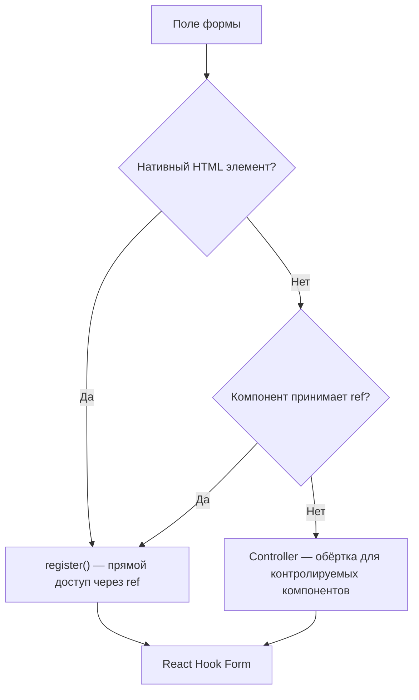
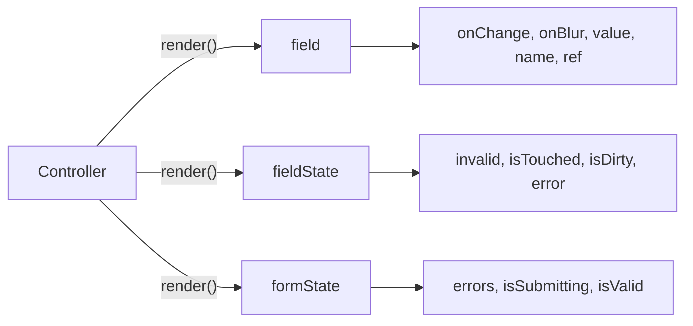
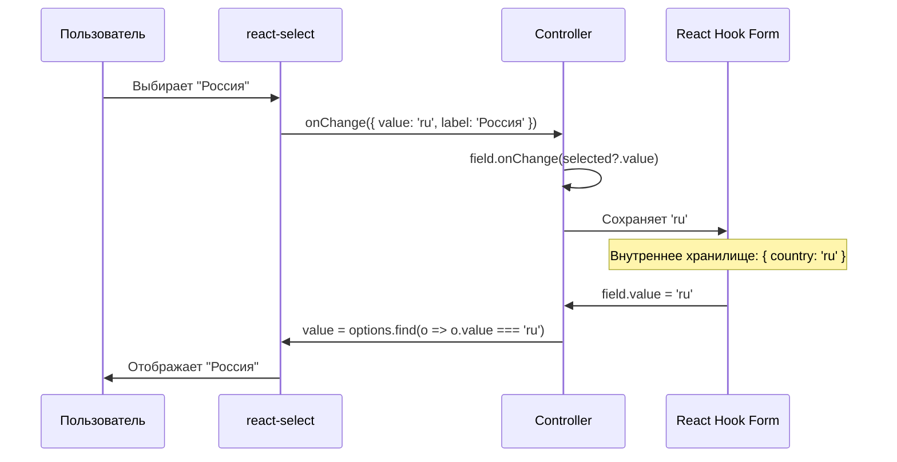
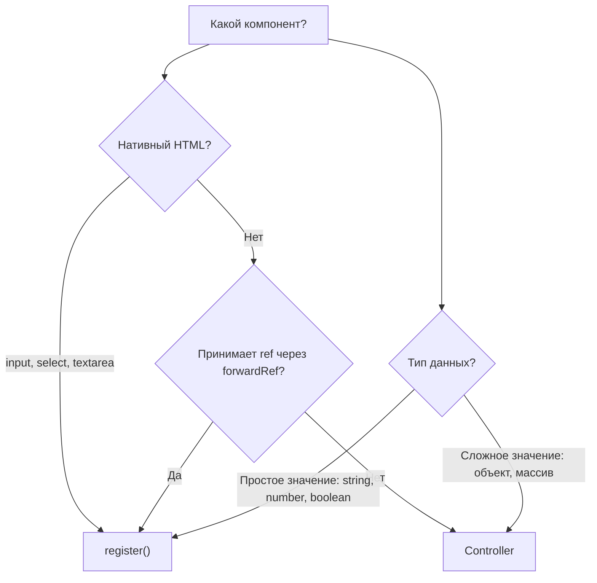

# Уровень 6: Сложные поля -- Controller, Radio, Select, Checkbox

## Введение

До этого момента все поля в наших формах были нативными HTML-элементами: `<input>`, `<select>`, `<textarea>`. Функция `register` справлялась с ними идеально -- она передавала `ref`, `onChange`, `onBlur` и `name` прямо в DOM-элемент, а React Hook Form читал значения напрямую из DOM.

Но в реальных проектах формы редко состоят только из голых HTML-инпутов. Дизайн-системы (Material UI, Ant Design, Chakra UI), кастомные компоненты (стилизованные селекты, дейтпикеры, автокомплиты) и библиотеки вроде `react-select` -- всё это **контролируемые компоненты**, которые не принимают `ref` напрямую или работают со значениями через собственный API.

Аналогия: представьте, что `register` -- это **розетка европейского стандарта**. Она идеально подходит для приборов с европейской вилкой (нативные HTML-элементы). Но если вы привезли прибор из другой страны (сторонний UI-компонент), вам нужен **переходник**. Именно эту роль выполняет `Controller` -- он адаптирует интерфейс React Hook Form для компонентов, которые не могут работать с `register` напрямую.

В этом уровне мы разберём:

1. **Controller** -- мост между RHF и контролируемыми компонентами
2. **Radio кнопки** -- выбор одного из нескольких вариантов
3. **Select** -- выпадающие списки (нативные и кастомные)
4. **Checkbox** -- одиночные флаги и множественный выбор



---

## Controller

### Что такое Controller?

**Controller** -- это компонент React Hook Form, который выступает посредником между формой и контролируемыми компонентами. Он берёт на себя управление значением поля, обработку событий изменения и потери фокуса, а также связь с системой валидации RHF.

Под капотом `Controller` использует хук `useController`, который подписывается на изменения конкретного поля через объект `control`. Когда компонент внутри `Controller` вызывает `field.onChange`, значение записывается во внутреннее хранилище RHF. Когда RHF нужно прочитать значение (при submit, watch или валидации), он обращается к тому же хранилищу.

**Когда использовать Controller:**

- ✅ Сторонние UI-компоненты (Material-UI `TextField`, `Select`, `Checkbox`)
- ✅ Кастомные компоненты, которые не пробрасывают `ref` к DOM-элементу
- ✅ Компоненты со своим форматом данных (`react-select` возвращает объект `{ value, label }`)
- ✅ Дейтпикеры, автокомплиты, color-пикеры и другие сложные виджеты

**Когда Controller НЕ нужен:**

- ❌ Нативные HTML-элементы (`<input>`, `<select>`, `<textarea>`) -- используйте `register`
- ❌ Компоненты, которые пробрасывают `ref` к внутреннему `<input>` через `forwardRef`

📌 **Правило принятия решения:** если компонент можно подключить через `register` -- используйте `register`. Он быстрее, потому что не создаёт подписку на ререндеры. `Controller` -- это запасной вариант для случаев, когда `register` не работает.

### Базовое использование

```tsx
import { Controller, useForm } from 'react-hook-form'
import Select from 'react-select'

interface FormData {
  category: string
}

function MyForm() {
  const { control, handleSubmit } = useForm<FormData>()

  return (
    <form onSubmit={handleSubmit(console.log)}>
      <Controller
        name="category"
        control={control}
        render={({ field, fieldState: { error } }) => (
          <Select
            {...field}
            options={[
              { value: 'electronics', label: 'Электроника' },
              { value: 'clothing', label: 'Одежда' },
            ]}
          />
        )}
      />
      <button type="submit">Отправить</button>
    </form>
  )
}
```

Разберём ключевые пропсы `Controller`:

| Проп | Обязательный | Назначение |
|------|-------------|------------|
| `name` | ✅ | Имя поля в форме (ключ в объекте данных) |
| `control` | ✅ | Объект `control` из `useForm` -- связывает Controller с конкретной формой |
| `render` | ✅ | Функция, которая возвращает JSX вашего компонента |
| `rules` | ❌ | Правила валидации (аналог второго аргумента `register`) |
| `defaultValue` | ❌ | Начальное значение поля (лучше задавать через `defaultValues` в `useForm`) |

### render vs children

Controller поддерживает два синтаксиса для передачи render-функции. Оба полностью эквивалентны -- выбирайте тот, который привычнее вашей команде:

```tsx
// Вариант 1: render prop (рекомендуемый -- явный и легко читается)
<Controller
  name="category"
  control={control}
  render={({ field, fieldState }) => (
    <Select {...field} />
  )}
/>

// Вариант 2: children (то же самое, альтернативный синтаксис)
<Controller
  name="category"
  control={control}
>
  {({ field, fieldState }) => (
    <Select {...field} />
  )}
</Controller>
```

💡 **Совет:** в проекте выберите один стиль и придерживайтесь его. Смешивание двух вариантов ухудшает читаемость. В большинстве кодовых баз принят `render` -- он компактнее и более явный.

### Все параметры render-функции

Render-функция получает объект с тремя свойствами. Каждое из них -- это «окно» в разные аспекты состояния поля и формы:

```tsx
<Controller
  name="category"
  control={control}
  render={({
    field,      // Объект для подключения компонента к RHF
    fieldState, // Состояние конкретного поля
    formState,  // Состояние всей формы
  }) => <Select {...field} />}
/>
```

**`field`** -- основной объект для привязки компонента:

| Свойство | Тип | Назначение |
|----------|-----|------------|
| `onChange` | `(value: any) => void` | Вызывайте при изменении значения |
| `onBlur` | `() => void` | Вызывайте при потере фокуса |
| `value` | `any` | Текущее значение поля |
| `name` | `string` | Имя поля |
| `ref` | `React.Ref` | Реф для фокус-менеджмента |

**`fieldState`** -- метаданные поля:

| Свойство | Тип | Назначение |
|----------|-----|------------|
| `invalid` | `boolean` | Поле не прошло валидацию |
| `isTouched` | `boolean` | Пользователь взаимодействовал с полем (blur) |
| `isDirty` | `boolean` | Значение отличается от `defaultValue` |
| `error` | `FieldError \| undefined` | Объект ошибки (содержит `message` и `type`) |

**`formState`** -- глобальное состояние формы:

| Свойство | Тип | Назначение |
|----------|-----|------------|
| `errors` | `FieldErrors` | Все ошибки формы |
| `isSubmitting` | `boolean` | Форма отправляется |
| `isValid` | `boolean` | Все поля валидны |
| `isDirty` | `boolean` | Хотя бы одно поле изменено |



### Преобразование значений в Controller

Одна из главных причин, почему нужен `Controller` -- это возможность **преобразовать** значение между компонентом и формой. Сторонние компоненты часто оперируют данными в своём формате, а в форме нужно хранить только нужную часть.

```tsx
// react-select возвращает объект { value: 'el', label: 'Электроника' }
// Но в форму мы хотим сохранить только строку 'el'

<Controller
  name="category"
  control={control}
  render={({ field }) => (
    <Select
      {...field}
      // Перехватываем onChange -- извлекаем только value
      onChange={(selected) => field.onChange(selected?.value)}
      // Преобразуем строку обратно в объект для отображения
      value={options.find(opt => opt.value === field.value)}
      options={options}
    />
  )}
/>
```

Этот паттерн "адаптер" -- типовая задача при работе с Controller. Вы перехватываете `onChange` и/или `value`, чтобы привести данные к нужному формату.

### Хук `useController` -- альтернатива Controller

Если вы создаёте переиспользуемый компонент формы, удобнее использовать хук `useController` вместо компонента `Controller`. Он делает то же самое, но даёт больше гибкости:

```tsx
import { useForm, useController, UseControllerProps } from 'react-hook-form'

interface FormData {
  firstName: string
  lastName: string
}

// Переиспользуемый компонент поля
function FormInput({ control, name, rules }: UseControllerProps<FormData>) {
  const {
    field: { onChange, onBlur, value, ref },
    fieldState: { error },
  } = useController({ name, control, rules })

  return (
    <div>
      <input
        onChange={onChange}
        onBlur={onBlur}
        value={value}
        ref={ref}
        placeholder={name}
        style={{ borderColor: error ? '#dc3545' : '#ddd' }}
      />
      {error && <span style={{ color: '#dc3545' }}>{error.message}</span>}
    </div>
  )
}

// Использование
function App() {
  const { control, handleSubmit } = useForm<FormData>({
    defaultValues: { firstName: '', lastName: '' },
  })

  return (
    <form onSubmit={handleSubmit(console.log)}>
      <FormInput
        name="firstName"
        control={control}
        rules={{ required: 'Имя обязательно' }}
      />
      <FormInput
        name="lastName"
        control={control}
        rules={{ required: 'Фамилия обязательна' }}
      />
      <button type="submit">Отправить</button>
    </form>
  )
}
```

📌 **Когда что использовать:**
- `Controller` -- для единичных случаев интеграции в конкретной форме
- `useController` -- для создания переиспользуемых компонентов формы, которые используются в нескольких формах

### Пример: кастомный TextField

Рассмотрим типичный продакшн-сценарий -- у вас есть дизайн-система с собственным компонентом текстового поля:

```tsx
// Кастомный компонент из дизайн-системы
function TextField({ label, error, ...props }: {
  label?: string
  error?: string
  [key: string]: any
}) {
  return (
    <div className="form-group">
      {label && <label>{label}</label>}
      <input
        style={{ borderColor: error ? '#dc3545' : '#ddd' }}
        {...props}
      />
      {error && <span className="error">{error}</span>}
    </div>
  )
}

// Интеграция с формой через Controller
function ProfileForm() {
  const { control, handleSubmit } = useForm<{ email: string }>({
    defaultValues: { email: '' },
  })

  return (
    <form onSubmit={handleSubmit(console.log)}>
      <Controller
        name="email"
        control={control}
        rules={{ required: 'Email обязателен' }}
        render={({ field, fieldState: { error } }) => (
          <TextField
            {...field}
            label="Email"
            error={error?.message}
          />
        )}
      />
      <button type="submit">Сохранить</button>
    </form>
  )
}
```

Обратите внимание: `{...field}` передаёт в `TextField` сразу `onChange`, `onBlur`, `value`, `name` и `ref`. Если ваш кастомный компонент принимает эти пропсы (как стандартный `<input>`), spread работает из коробки. Если нет -- адаптируйте через перехват, как в примере с `react-select`.

---

## Radio кнопки

### Как radio работают в HTML

Radio-кнопки -- это группа взаимоисключающих вариантов: пользователь может выбрать **только один**. В HTML они объединяются в группу по атрибуту `name` -- все radio с одинаковым `name` становятся частью одной группы. Каждая кнопка имеет свой `value`, и при выборе именно это значение попадает в данные формы.

Аналогия: radio-кнопки работают как **переключатель каналов на старом телевизоре**. Когда вы нажимаете одну кнопку, предыдущая автоматически отжимается. Телевизор может показывать только один канал одновременно.

### Регистрация через register

Нативные radio-кнопки в HTML отлично работают с `register`. RHF понимает, что несколько `<input type="radio">` с одинаковым именем -- это одна группа, и автоматически управляет выбором:

```tsx
import { useForm } from 'react-hook-form'

interface FormData {
  gender: 'male' | 'female' | 'other'
}

function RadioForm() {
  const { register, handleSubmit } = useForm<FormData>()

  const onSubmit = (data: FormData) => {
    console.log('Gender:', data.gender) // 'male' | 'female' | 'other'
  }

  return (
    <form onSubmit={handleSubmit(onSubmit)}>
      <fieldset>
        <legend>Пол</legend>
        <label>
          <input type="radio" value="male" {...register('gender')} />
          Мужской
        </label>
        <label>
          <input type="radio" value="female" {...register('gender')} />
          Женский
        </label>
        <label>
          <input type="radio" value="other" {...register('gender')} />
          Другой
        </label>
      </fieldset>
      <button type="submit">Отправить</button>
    </form>
  )
}
```

Обратите внимание на несколько деталей:

1. **Одинаковое имя** в `register('gender')` у всех radio -- RHF понимает, что это одно поле
2. **Разные `value`** -- именно это значение попадёт в `data.gender`
3. **`<fieldset>` и `<legend>`** -- семантическая группировка для доступности (accessibility)

### Radio с валидацией

```tsx
<input
  type="radio"
  value="male"
  {...register('gender', { required: 'Выберите пол' })}
/>
```

⚠️ **Важно:** правило валидации нужно передать **каждому** radio в группе, а не только первому. Хотя RHF отслеживает группу по имени, правила привязаны к конкретному вызову `register`. На практике удобнее вынести опции:

```tsx
const genderRules = { required: 'Выберите пол' }

<input type="radio" value="male" {...register('gender', genderRules)} />
<input type="radio" value="female" {...register('gender', genderRules)} />
<input type="radio" value="other" {...register('gender', genderRules)} />
```

### Radio с defaultValue

Чтобы одна из кнопок была выбрана по умолчанию, используйте `defaultValues` в `useForm`:

```tsx
const { register } = useForm<FormData>({
  defaultValues: {
    gender: 'other', // По умолчанию выбрано "Другой"
  },
})
```

---

## Select (выпадающий список)

### Базовый select

Нативный HTML `<select>` работает с `register` так же просто, как `<input>`. RHF регистрирует элемент, привязывает `ref` и автоматически считывает выбранное значение:

```tsx
interface FormData {
  country: string
}

function SelectForm() {
  const { register, handleSubmit, formState: { errors } } = useForm<FormData>()

  return (
    <form onSubmit={handleSubmit(console.log)}>
      <select {...register('country')}>
        <option value="">Выберите страну</option>
        <option value="us">USA</option>
        <option value="ru">Россия</option>
        <option value="de">Germany</option>
      </select>
      <button type="submit">Отправить</button>
    </form>
  )
}
```

📌 **Важный паттерн:** первая `<option>` с `value=""` -- это плейсхолдер. Она позволяет пользователю видеть подсказку и не даёт форме отправиться с автоматически выбранным первым реальным значением. Без неё первое значение (`"us"`) будет выбрано по умолчанию, и `required` валидация всегда будет пройдена.

### Select с валидацией

```tsx
<select
  {...register('country', {
    required: 'Выберите страну',
  })}
>
  <option value="">Выберите страну</option>
  <option value="us">USA</option>
  <option value="ru">Россия</option>
</select>
{errors.country && <span className="error">{errors.country.message}</span>}
```

Валидация `required` проверяет, что значение не равно пустой строке `""`. Поскольку плейсхолдер имеет `value=""`, выбор плейсхолдера считается «пустым полем» и валидация не пройдёт.

### Кастомный select через Controller

Нативный `<select>` прост и доступен, но ограничен в стилизации и функциональности. В реальных проектах часто используют `react-select`, `@mui/material/Select` или другие библиотеки. Для них нужен `Controller`:

```tsx
import { Controller, useForm } from 'react-hook-form'
import ReactSelect from 'react-select'

const countryOptions = [
  { value: 'us', label: 'USA' },
  { value: 'ru', label: 'Россия' },
  { value: 'de', label: 'Germany' },
]

function CustomSelectForm() {
  const { control, handleSubmit } = useForm<{ country: string }>({
    defaultValues: { country: '' },
  })

  return (
    <form onSubmit={handleSubmit(console.log)}>
      <Controller
        name="country"
        control={control}
        rules={{ required: 'Выберите страну' }}
        render={({ field, fieldState: { error } }) => (
          <>
            <ReactSelect
              options={countryOptions}
              value={countryOptions.find(opt => opt.value === field.value)}
              onChange={(selected) => field.onChange(selected?.value ?? '')}
              onBlur={field.onBlur}
              placeholder="Выберите страну..."
            />
            {error && <span className="error">{error.message}</span>}
          </>
        )}
      />
      <button type="submit">Отправить</button>
    </form>
  )
}
```

Обратите внимание на два преобразования:
- **`value`**: RHF хранит строку `'ru'`, а `react-select` ожидает объект `{ value: 'ru', label: 'Россия' }` -- находим нужный объект через `find`
- **`onChange`**: `react-select` передаёт объект, а мы извлекаем только `value`



---

## Checkbox

### Одиночный checkbox (boolean)

Одиночный checkbox -- это переключатель «да/нет». В формах он чаще всего используется для согласия с условиями, подписки на рассылку, запоминания авторизации. Значение в форме -- `boolean` (`true` или `false`).

Нативный checkbox прекрасно работает с `register`. RHF автоматически определяет, что это checkbox (по `type="checkbox"`), и привязывает значение к свойству `checked`, а не к `value`:

```tsx
interface FormData {
  agree: boolean
  newsletter: boolean
}

function CheckboxForm() {
  const { register, handleSubmit } = useForm<FormData>({
    defaultValues: {
      agree: false,
      newsletter: true, // По умолчанию подписка включена
    },
  })

  const onSubmit = (data: FormData) => {
    console.log('Agree:', data.agree)         // true | false
    console.log('Newsletter:', data.newsletter) // true | false
  }

  return (
    <form onSubmit={handleSubmit(onSubmit)}>
      <label>
        <input type="checkbox" {...register('agree')} />
        Я согласен с правилами
      </label>

      <label>
        <input type="checkbox" {...register('newsletter')} />
        Подписаться на рассылку
      </label>

      <button type="submit">Отправить</button>
    </form>
  )
}
```

### Checkbox с валидацией (обязательное согласие)

Типичный кейс -- форма регистрации, где пользователь обязан согласиться с условиями:

```tsx
<label>
  <input
    type="checkbox"
    {...register('agree', {
      required: 'Необходимо принять условия',
    })}
  />
  Я согласен с условиями использования
</label>
{errors.agree && <span className="error">{errors.agree.message}</span>}
```

Для checkbox `required` проверяет, что значение `true` (галочка стоит). Если checkbox не отмечен, `required` вернёт ошибку.

### Множественный выбор (массив)

Когда пользователю нужно выбрать **несколько вариантов** из набора (навыки, категории, теги), checkbox-ы формируют массив значений. Это сложнее, чем одиночный boolean, потому что нужно управлять массивом: добавлять элемент при отметке, удалять при снятии.

Есть два подхода: ручное управление через `watch` + `setValue` и использование `Controller`.

#### Подход 1: watch + setValue

```tsx
interface FormData {
  skills: string[]
}

function MultiCheckboxForm() {
  const { watch, setValue, handleSubmit } = useForm<FormData>({
    defaultValues: { skills: [] },
  })

  const skills = watch('skills')

  const handleSkillChange = (skill: string, checked: boolean) => {
    if (checked) {
      setValue('skills', [...skills, skill])
    } else {
      setValue(
        'skills',
        skills.filter(s => s !== skill)
      )
    }
  }

  const onSubmit = (data: FormData) => {
    console.log('Skills:', data.skills) // ['react', 'typescript']
  }

  const skillOptions = ['react', 'vue', 'angular', 'typescript']

  return (
    <form onSubmit={handleSubmit(onSubmit)}>
      <fieldset>
        <legend>Навыки</legend>
        {skillOptions.map(skill => (
          <label key={skill}>
            <input
              type="checkbox"
              value={skill}
              checked={skills.includes(skill)}
              onChange={e => handleSkillChange(skill, e.target.checked)}
            />
            {skill}
          </label>
        ))}
      </fieldset>
      <button type="submit">Отправить</button>
    </form>
  )
}
```

Этот подход работает, но требует вручную синхронизировать `watch`, `setValue` и `checked`. Для нескольких групп checkbox-ов это быстро становится громоздким.

#### Подход 2: Controller с checkbox-группой

```tsx
<Controller
  name="skills"
  control={control}
  rules={{
    validate: (v) => v.length > 0 || 'Выберите хотя бы один навык',
  }}
  render={({ field, fieldState: { error } }) => (
    <fieldset>
      <legend>Навыки</legend>
      {skillOptions.map(skill => (
        <label key={skill}>
          <input
            type="checkbox"
            value={skill}
            checked={field.value.includes(skill)}
            onChange={(e) => {
              const updated = e.target.checked
                ? [...field.value, skill]
                : field.value.filter((s: string) => s !== skill)
              field.onChange(updated)
            }}
          />
          {skill}
        </label>
      ))}
      {error && <span className="error">{error.message}</span>}
    </fieldset>
  )}
/>
```

💡 **Совет:** подход с `Controller` лучше масштабируется: валидация задаётся в одном месте через `rules`, а логика обновления массива инкапсулирована в `render`.

### Валидация множественного выбора

Для проверки, что пользователь выбрал хотя бы один элемент (или определённое количество), используйте `validate` в `rules` или Zod-схему:

```tsx
// Через validate в Controller
rules={{
  validate: (v) => v.length > 0 || 'Выберите хотя бы один навык',
}}

// Через Zod-схему (если используете zodResolver)
const schema = z.object({
  skills: z.array(z.string()).min(1, 'Выберите хотя бы один навык'),
})
```

---

## Когда что использовать: сводная таблица

Прежде чем перейти к ошибкам, подведём итог -- какой инструмент для какого типа поля:

| Тип поля | Подход | Пример |
|----------|--------|--------|
| `<input type="text">` | `register` | `{...register('name')}` |
| `<input type="radio">` | `register` (одно имя, разные `value`) | `{...register('gender')}` |
| `<select>` (нативный) | `register` | `{...register('country')}` |
| `<input type="checkbox">` (boolean) | `register` | `{...register('agree')}` |
| Группа checkbox (массив) | `Controller` или `watch` + `setValue` | `<Controller name="skills" ...>` |
| `react-select` | `Controller` | `<Controller render={...}>` |
| Material-UI `TextField` | `Controller` | `<Controller render={...}>` |
| Любой компонент без `ref` | `Controller` | `<Controller render={...}>` |



---

## ⚠️ Частые ошибки новичков

### ❌ Ошибка 1: Controller без control

```tsx
// ❌ Неправильно -- control не передан
<Controller
  name="category"
  render={({ field }) => <Select {...field} />}
/>

// ✅ Правильно -- передаём control
const { control } = useForm()
<Controller
  name="category"
  control={control}
  render={({ field }) => <Select {...field} />}
/>
```

**Почему это ошибка:** `Controller` обязан знать, к какой форме он привязан. Объект `control` -- это ссылка на внутреннее состояние формы, созданное `useForm`. Без него Controller не может ни записать значение, ни прочитать его, ни запустить валидацию. TypeScript покажет ошибку на этапе компиляции, но если типы отключены или используется JavaScript -- ошибка проявится в рантайме.

---

### ❌ Ошибка 2: Controller для нативного checkbox

```tsx
// ❌ Избыточно -- Controller для обычного HTML checkbox
<Controller
  name="agree"
  control={control}
  render={({ field }) => (
    <input type="checkbox" checked={field.value} onChange={field.onChange} />
  )}
/>

// ✅ Правильно -- register работает с нативным checkbox
<input type="checkbox" {...register('agree')} />
```

**Почему это ошибка:** `register` автоматически обрабатывает нативные чекбоксы. Он определяет `type="checkbox"` и:
- Привязывает значение к `checked`, а не к `value`
- Возвращает `boolean` (`true`/`false`) в данных формы
- Не создаёт лишнюю подписку на ререндеры

`Controller` добавляет дополнительный слой абстракции и подписку на обновления, что замедляет форму без какой-либо пользы. Используйте Controller для checkbox **только** если это сторонний компонент (например, `<Checkbox>` из Material UI).

---

### ❌ Ошибка 3: Не преобразуют значение в Controller

```tsx
// ❌ Неправильно -- в форму сохраняется объект { value, label }
<Controller
  name="category"
  control={control}
  render={({ field }) => (
    <Select
      {...field}
      options={[{ value: 'el', label: 'Электроника' }]}
    />
  )}
/>

// ✅ Правильно -- преобразуем значение, сохраняем только строку
<Controller
  name="category"
  control={control}
  render={({ field }) => (
    <Select
      {...field}
      onChange={(selected) => field.onChange(selected?.value)}
      value={options.find(opt => opt.value === field.value)}
      options={[{ value: 'el', label: 'Электроника' }]}
    />
  )}
/>
```

**Почему это ошибка:** сторонние компоненты вроде `react-select` работают с объектами `{ value, label }`. Если не перехватить `onChange`, в данных формы окажется объект вместо простого значения. При отправке на сервер вы получите `{ category: { value: 'el', label: 'Электроника' } }` вместо ожидаемого `{ category: 'el' }`. Это сломает серверную валидацию и сериализацию.

🔥 **Правило:** всегда проверяйте, что именно возвращает сторонний компонент в `onChange`, и преобразуйте к нужному формату.

---

### ❌ Ошибка 4: Radio без value

```tsx
// ❌ Неправильно -- нет value
<input type="radio" {...register('gender')} />

// ✅ Правильно -- с value
<input type="radio" value="male" {...register('gender')} />
<input type="radio" value="female" {...register('gender')} />
```

**Почему это ошибка:** Radio-кнопки требуют `value` для определения выбранного значения. Без `value` все кнопки в группе будут возвращать пустую строку `""` или `"on"` (браузерное поведение по умолчанию), и RHF не сможет отличить один вариант от другого.

---

### ❌ Ошибка 5: defaultValue в Controller вместо defaultValues в useForm

```tsx
// ❌ Непоследовательно -- defaultValue разбросан по Controller-ам
<Controller name="country" control={control} defaultValue="" render={...} />
<Controller name="city" control={control} defaultValue="" render={...} />

// ✅ Правильно -- все начальные значения в одном месте
const { control } = useForm({
  defaultValues: {
    country: '',
    city: '',
  },
})
<Controller name="country" control={control} render={...} />
<Controller name="city" control={control} render={...} />
```

**Почему это проблема:** когда `defaultValue` разбросаны по отдельным Controller-ам, трудно увидеть полную картину начального состояния формы. Кроме того, `reset()` использует `defaultValues` из `useForm`, а не `defaultValue` из отдельных Controller-ов. Если значения заданы в разных местах, `reset()` может вернуть форму в неожиданное состояние.

---

### ❌ Ошибка 6: Забывают onBlur в Controller

```tsx
// ❌ Неправильно -- onBlur не передан
<Controller
  name="country"
  control={control}
  render={({ field }) => (
    <ReactSelect
      value={field.value}
      onChange={field.onChange}
      // onBlur забыт!
    />
  )}
/>

// ✅ Правильно -- передаём onBlur
<Controller
  name="country"
  control={control}
  render={({ field }) => (
    <ReactSelect
      value={field.value}
      onChange={field.onChange}
      onBlur={field.onBlur}
    />
  )}
/>
```

**Почему это проблема:** без `onBlur` RHF не узнает, что пользователь «покинул» поле. Это ломает:
- Режим валидации `onBlur` -- ошибки не появятся, пока пользователь не нажмёт Submit
- `fieldState.isTouched` -- всегда будет `false`
- `formState.touchedFields` -- поле никогда не попадёт в список «тронутых»

💡 **Совет:** при использовании spread `{...field}` все нужные свойства передаются автоматически. Проблема возникает, когда вы деструктурируете `field` и передаёте свойства выборочно.

---

## 📚 Дополнительные ресурсы

- [Controller документация](https://react-hook-form.com/docs/useform/controller) -- полное описание API компонента Controller
- [useController документация](https://react-hook-form.com/docs/usecontroller) -- хук-версия Controller для переиспользуемых компонентов
- [register документация](https://react-hook-form.com/docs/useform/register) -- все опции регистрации полей, включая radio и checkbox
- [React: forwardRef](https://react.dev/reference/react/forwardRef) -- как пробросить ref в кастомный компонент, чтобы использовать `register` вместо `Controller`

---

## Что дальше?

В следующем уровне вы изучите:

- **Загрузка файлов** -- как интегрировать `<input type="file">` с RHF, валидация размера и типа файла
- **Дата и время** -- работа с дейтпикерами, форматирование и хранение дат в форме
