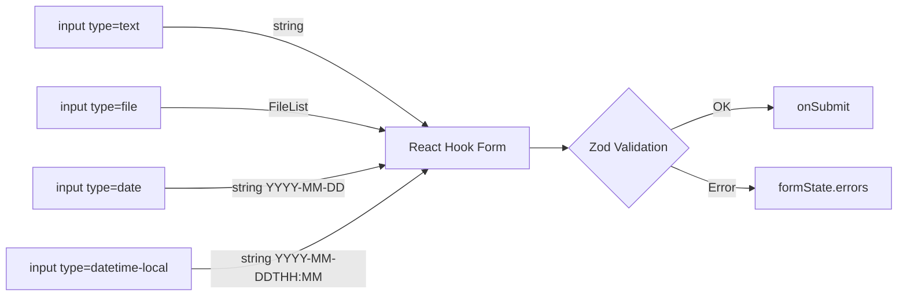
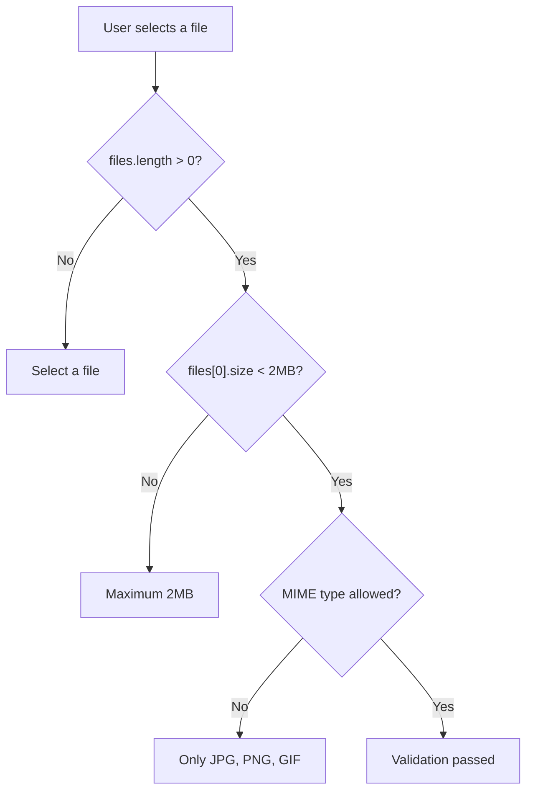
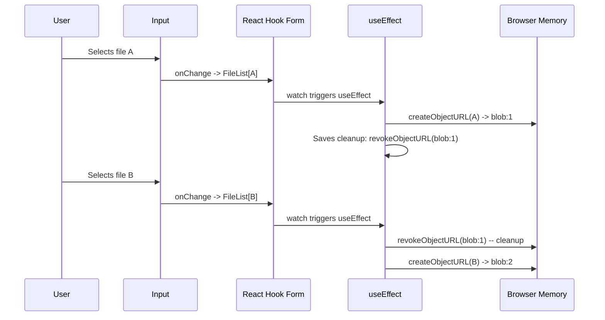
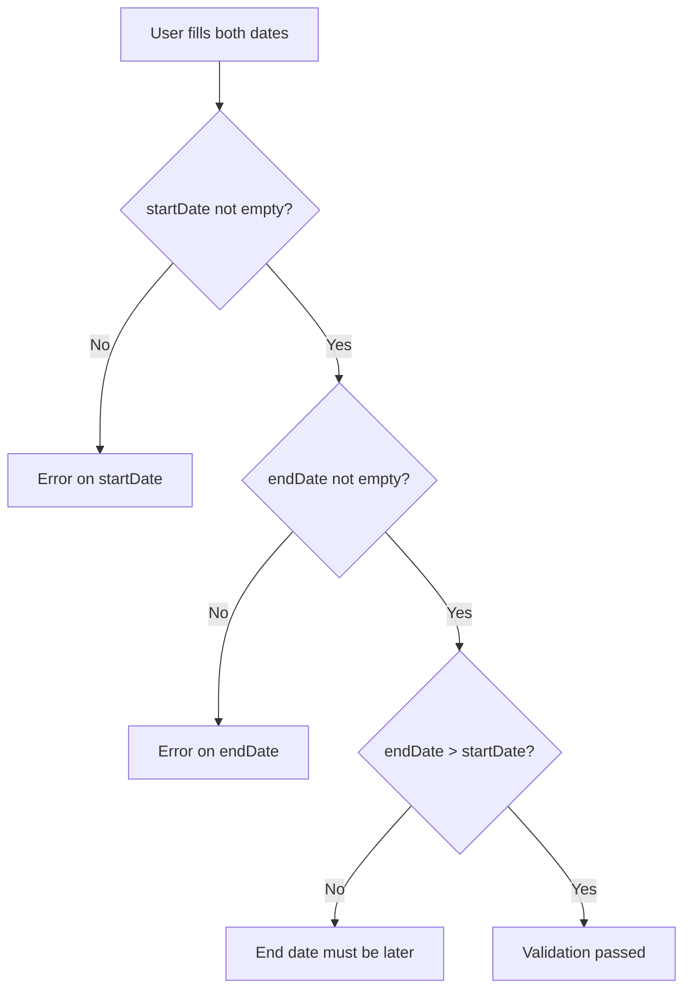

# Level 7: Files and Dates

## Introduction

File uploads and date handling are common web form tasks that require a special approach. If regular text fields are a "straight road" (typed a string, got a string), then files and dates are a **detour through a country lane**: different data type, different browser behavior, different pitfalls.

Why are these two field types put in a separate level? Because both break the familiar "field value = string" mental model:

- **File** -- not a string, but a `File` object (nested in `FileList`). It can't be saved as JSON, can't be pre-filled via `defaultValues`, and even `isDirty` works differently for it
- **Date** -- formally a string (`"2024-01-15"`), but semantically -- a point in time. Date validation requires comparison, transformations, and timezone awareness

In this level, you'll learn to integrate file upload and date fields with React Hook Form, validate them with Zod, build image previews without memory leaks, and work with date ranges.



---

## File Upload

### Basic File Upload

The file input in HTML is a special element. Unlike a text field where the value is a string, `<input type="file">` stores a `FileList` object. This is an array-like collection of `File` objects, even if the user selected one file.

```tsx
function FileUpload() {
  const { register, handleSubmit } = useForm()

  const onSubmit = (data: any) => {
    const file = data.avatar[0]
    console.log('File:', file)
  }

  return (
    <form onSubmit={handleSubmit(onSubmit)}>
      <input type="file" accept="image/*" {...register('avatar')} />
      <button type="submit">Upload</button>
    </form>
  )
}
```

**Important:** `register` for `type="file"` returns a `FileList`, not a single file. To get the first file, use `data.avatar[0]`.

### Under the Hood: How RHF Works with Files

When you call `register('avatar')` on a file input, React Hook Form attaches `ref` and handlers the same way as for regular fields. But there are several differences:

1. **Value is not stored as a string.** For security reasons, the browser doesn't allow programmatically setting a file input's value. So `setValue('avatar', someFile)` won't work directly -- the DOM won't accept this value
2. **`isDirty` works differently.** According to RHF documentation, file-type inputs require application-level management, because the user can cancel file selection, and `FileList` is not a simple object to compare
3. **`defaultValues` for files are useless.** You can't pre-fill a file input -- this is a browser limitation, not RHF's

Analogy: if a text field is a cell in a spreadsheet (type text, read text), then a file input is a **memory card slot**: you can insert a card and read its contents, but you can't "pre-write" data into the slot.

### The `accept` Attribute -- Browser-Level Filtering

The `accept` attribute limits the file types the user sees in the selection dialog:

```tsx
// Images only
<input type="file" accept="image/*" {...register('photo')} />

// PDF only
<input type="file" accept=".pdf" {...register('document')} />

// Multiple types
<input type="file" accept=".pdf,.doc,.docx" {...register('resume')} />

// MIME types
<input type="file" accept="image/png, image/jpeg" {...register('avatar')} />
```

**Warning:** `accept` is only a **hint to the browser**, not validation. The user can still select "All files" in the dialog and upload anything. Real validation must happen in the Zod schema.

---

## File Validation

### File Size and Type

File validation through Zod requires a chain of `refine` checks, because standard Zod methods (`.string()`, `.number()`) don't work with `FileList`. We use `z.instanceof(FileList)` as the base type and add checks on top:

```tsx
const schema = z.object({
  avatar: z
    .instanceof(FileList)
    .refine(files => files.length > 0, 'Select a file')
    .refine(files => files[0]?.size < 2_000_000, 'Maximum 2MB')
    .refine(
      files => ['image/jpeg', 'image/png', 'image/gif'].includes(files[0]?.type),
      'Only JPG, PNG, GIF'
    ),
})
```

The order of `refine` matters -- they execute sequentially, and if the first fails, subsequent ones aren't called. That's why `files.length > 0` goes first: without it, accessing `files[0]?.size` on an empty `FileList` won't cause an error (due to optional chaining), but the message would be illogical -- "Maximum 2MB" instead of "Select a file".



### Multiple File Upload

When users can upload multiple files, add the `multiple` attribute and validate the array:

```tsx
const schema = z.object({
  documents: z
    .instanceof(FileList)
    .refine(files => files.length > 0, 'Select at least one file')
    .refine(files => files.length <= 5, 'Maximum 5 files')
    .refine(
      files => Array.from(files).every(file => file.size < 5_000_000),
      'Each file must be less than 5MB'
    ),
})
```

Note `Array.from(files)` -- `FileList` isn't a real array and doesn't have the `.every()` method. Converting to an array via `Array.from()` (or spread operator `[...files]`) gives access to standard array methods.

### Production Pattern: File Validation Utility

In real projects, file validation logic repeats across different forms. Extract it into a reusable function:

```tsx
function createFileSchema(options: {
  required?: boolean
  maxSizeMB?: number
  allowedTypes?: string[]
  maxFiles?: number
}) {
  let schema = z.instanceof(FileList)

  if (options.required) {
    schema = schema.refine(
      files => files.length > 0,
      'Select a file'
    ) as any
  }

  if (options.maxFiles) {
    schema = schema.refine(
      files => files.length <= options.maxFiles!,
      `Maximum ${options.maxFiles} files`
    ) as any
  }

  if (options.maxSizeMB) {
    const maxBytes = options.maxSizeMB * 1_000_000
    schema = schema.refine(
      files => Array.from(files).every(f => f.size < maxBytes),
      `Each file must be less than ${options.maxSizeMB}MB`
    ) as any
  }

  if (options.allowedTypes) {
    schema = schema.refine(
      files => Array.from(files).every(f => options.allowedTypes!.includes(f.type)),
      `Allowed types: ${options.allowedTypes.join(', ')}`
    ) as any
  }

  return schema
}

// Usage
const schema = z.object({
  avatar: createFileSchema({
    required: true,
    maxSizeMB: 2,
    allowedTypes: ['image/jpeg', 'image/png'],
  }),
  documents: createFileSchema({
    required: true,
    maxFiles: 5,
    maxSizeMB: 10,
  }),
})
```

---

## Image Preview

Previewing a selected image is a standard UX requirement. But the implementation has a subtlety many miss: **memory management**.

### Naive Approach (with a Problem)

```tsx
import { useState } from 'react'
import { useForm } from 'react-hook-form'

function FileUploadWithPreview() {
  const { register, handleSubmit } = useForm()
  const [preview, setPreview] = useState<string | null>(null)

  // Save original onChange from register
  const avatarRegister = register('avatar')

  return (
    <form onSubmit={handleSubmit(onSubmit)}>
      <input
        type="file"
        accept="image/*"
        {...avatarRegister}
        onChange={e => {
          avatarRegister.onChange(e) // First pass event to RHF
          const file = e.target.files?.[0]
          if (file) {
            const url = URL.createObjectURL(file)
            setPreview(url)
          }
        }}
      />

      {preview && (
        
      )}

      <button type="submit">Upload</button>
    </form>
  )
}
```

This code works, but each `URL.createObjectURL()` call creates a **blob URL** -- a string like `blob:http://localhost:3000/abc-123` that references the file in browser memory. If the user changes the file 10 times, 10 blob URLs remain in memory, and none are freed automatically.

**Tip:** Don't forget to call `URL.revokeObjectURL()` when the component unmounts or the file changes, to avoid memory leaks.

### Cleaning URLs on Unmount

The correct approach -- use `watch` to track the file and `useEffect` to manage the blob URL lifecycle:

```tsx
import { useState, useEffect } from 'react'

function FileUploadClean() {
  const { register, watch } = useForm()
  const [preview, setPreview] = useState<string | null>(null)
  const avatarFile = watch('avatar')

  useEffect(() => {
    if (avatarFile?.[0]) {
      const url = URL.createObjectURL(avatarFile[0])
      setPreview(url)
      return () => URL.revokeObjectURL(url) // Cleanup
    }
  }, [avatarFile])

  return (
    <div>
      <input type="file" accept="image/*" {...register('avatar')} />
      {preview && }
    </div>
  )
}
```

What happens here:

1. `watch('avatar')` subscribes to file field changes and returns `FileList`
2. On each file change, `useEffect` creates a new blob URL
3. The cleanup function (`return () => URL.revokeObjectURL(url)`) is called **before** the next effect execution or on component unmount, freeing the previous URL



### Multi-file Preview

In production forms, you often need to preview all selected files:

```tsx
function MultiFilePreview() {
  const { register, watch } = useForm()
  const [previews, setPreviews] = useState<string[]>([])
  const files = watch('photos')

  useEffect(() => {
    if (files?.length) {
      const urls = Array.from(files as FileList).map(file =>
        URL.createObjectURL(file)
      )
      setPreviews(urls)
      return () => urls.forEach(url => URL.revokeObjectURL(url))
    }
    setPreviews([])
  }, [files])

  return (
    <div>
      <input type="file" accept="image/*" multiple {...register('photos')} />
      <div style={{ display: 'flex', gap: '8px', flexWrap: 'wrap' }}>
        {previews.map((url, i) => (
          
        ))}
      </div>
    </div>
  )
}
```

---

## Date and DateTime Fields

### How the Browser Handles Dates

HTML5 provides native date input elements: `<input type="date">` and `<input type="datetime-local">`. They render a calendar and/or time fields, but under the hood the value is always a **string** in ISO format:

| Input type | Value format | Example |
|-----------|----------------|--------|
| `date` | `YYYY-MM-DD` | `"2024-01-15"` |
| `datetime-local` | `YYYY-MM-DDTHH:MM` | `"2024-01-15T10:30"` |
| `month` | `YYYY-MM` | `"2024-01"` |
| `time` | `HH:MM` | `"10:30"` |

This is important to understand, because React Hook Form receives a string, not a `Date` object. If the backend expects a `Date`, explicit transformation is needed.

### Date Input

```tsx
function DateForm() {
  const { register, handleSubmit } = useForm()

  const onSubmit = (data: any) => {
    console.log('Birth date:', data.birthDate) // '1990-01-01'
  }

  return (
    <form onSubmit={handleSubmit(onSubmit)}>
      <label>Birth date</label>
      <input type="date" {...register('birthDate')} />
      <button type="submit">Submit</button>
    </form>
  )
}
```

### DateTime-local

```tsx
function DateTimeForm() {
  const { register, handleSubmit } = useForm()

  const onSubmit = (data: any) => {
    console.log('Appointment:', data.appointment) // '2024-01-15T10:00'
  }

  return (
    <form onSubmit={handleSubmit(onSubmit)}>
      <label>Schedule a meeting</label>
      <input type="datetime-local" {...register('appointment')} />
      <button type="submit">Schedule</button>
    </form>
  )
}
```

### The `valueAsDate` Option -- Automatic Conversion

React Hook Form supports the `valueAsDate` option in `register`, which automatically converts the string value to a `Date` object:

```tsx
<input
  type="date"
  {...register('birthDate', { valueAsDate: true })}
/>

// In onSubmit: data.birthDate will be a Date object, not a string
```

**Important:** `valueAsDate` works **before** validation. This means the Zod schema will receive a `Date`, not a string. Account for this when writing the schema:

```tsx
// If using valueAsDate: true
const schema = z.object({
  birthDate: z.date({ required_error: 'Select a date' }),
})

// If NOT using valueAsDate
const schema = z.object({
  birthDate: z.string().min(1, 'Select a date'),
})
```

### Constraining Range via HTML Attributes

Native date inputs support `min` and `max` attributes, which constrain date selection at the UI level:

```tsx
// Doesn't allow selecting dates before today
<input
  type="date"
  min={new Date().toISOString().split('T')[0]}
  {...register('appointment')}
/>

// Year 2024 only
<input
  type="date"
  min="2024-01-01"
  max="2024-12-31"
  {...register('eventDate')}
/>
```

As with `accept` for files, `min`/`max` are UI constraints. Users can bypass them through DevTools. Zod validation is mandatory.

---

## Date Validation

### Basic Validation

```tsx
const schema = z.object({
  birthDate: z.string().min(1, 'Select a date'),
  appointment: z
    .string()
    .min(1, 'Select a time')
    .refine(date => new Date(date) > new Date(), 'Time must be in the future'),
})
```

Note: for `birthDate`, it's enough to check the string isn't empty. The `YYYY-MM-DD` format is guaranteed by the browser -- the native date picker doesn't allow entering arbitrary text (unlike a text field). However, for `appointment` we add a semantic check: the appointment date must be in the future.

### Date Range

Validating "end date after start date" is a classic cross-field validation task. In Zod, this is done with `.refine()` at the object level:

```tsx
const schema = z
  .object({
    startDate: z.string().min(1, 'Select a start date'),
    endDate: z.string().min(1, 'Select an end date'),
  })
  .refine(data => new Date(data.endDate) > new Date(data.startDate), {
    message: 'End date must be after start date',
    path: ['endDate'],
  })
```

**Key point:** the `path: ['endDate']` parameter attaches the error to a specific field. Without it, the error goes to `errors.root` (or isn't displayed at all), and the user won't understand which field to fix.



### Age Restriction

Age verification is a common registration form scenario. You need to calculate the difference between the current date and the birth date:

```tsx
const schema = z.object({
  birthDate: z
    .string()
    .min(1, 'Select a date')
    .refine(
      date => {
        const age = Math.floor(
          (Date.now() - new Date(date).getTime()) / (365.25 * 24 * 60 * 60 * 1000)
        )
        return age >= 18
      },
      'You must be at least 18 years old'
    ),
})
```

The number `365.25` accounts for leap years (every fourth year has 366 days, averaging 365.25). For legal purposes, a more precise calculation considering specific dates may be needed, but for a registration form this is sufficient.

### Production Pattern: Date Utility Functions

In a real project, extract calculations into separate functions:

```tsx
function getAge(birthDate: string): number {
  const today = new Date()
  const birth = new Date(birthDate)
  let age = today.getFullYear() - birth.getFullYear()
  const monthDiff = today.getMonth() - birth.getMonth()

  if (monthDiff < 0 || (monthDiff === 0 && today.getDate() < birth.getDate())) {
    age--
  }

  return age
}

function isFutureDate(dateStr: string): boolean {
  return new Date(dateStr) > new Date()
}

function isWithinDays(dateStr: string, days: number): boolean {
  const date = new Date(dateStr)
  const maxDate = new Date()
  maxDate.setDate(maxDate.getDate() + days)
  return date <= maxDate
}

// Usage in schema
const schema = z.object({
  birthDate: z
    .string()
    .min(1, 'Select a date')
    .refine(date => getAge(date) >= 18, 'You must be at least 18 years old'),
  appointment: z
    .string()
    .min(1, 'Select a date')
    .refine(isFutureDate, 'Date must be in the future')
    .refine(date => isWithinDays(date, 90), 'Maximum 90 days ahead'),
})
```

The `getAge` function is more accurate than the `365.25` formula because it considers the specific birth day and month.

---

## Common Beginner Mistakes

### Mistake 1: Overwriting register's onChange

```tsx
// Wrong -- your onChange overwrites register's handler
<input
  type="file"
  {...register('avatar')}
  onChange={(e) => {
    const file = e.target.files?.[0]
    // register.onChange won't be called -- RHF doesn't get the value
  }}
/>

// Correct -- call register's onChange, adding your logic
const avatarRegister = register('avatar')
<input
  type="file"
  {...avatarRegister}
  onChange={(e) => {
    avatarRegister.onChange(e)  // First pass event to RHF
    const file = e.target.files?.[0]
    if (file) setPreview(URL.createObjectURL(file))
  }}
/>
```

**Why this is a mistake:** The spread operator `{...register('avatar')}` adds `onChange` as a prop. If you specify your own `onChange` after the spread, it **overwrites** RHF's handler. The solution is to save the `register` result to a variable and call its `onChange` explicitly within your handler.

Alternative approach -- use `watch` instead of a custom `onChange`:

```tsx
// Alternative -- watch instead of intercepting onChange
const { register, watch } = useForm()
const files = watch('avatar')

// files updates automatically when a file is selected
// No need to intercept onChange
<input type="file" {...register('avatar')} />
```

---

### Mistake 2: Memory leak in preview

```tsx
// Wrong -- URL is not freed
const url = URL.createObjectURL(file)
setPreview(url)

// Correct -- cleanup via useEffect
useEffect(() => {
  if (avatarFile?.[0]) {
    const url = URL.createObjectURL(avatarFile[0])
    setPreview(url)
    return () => URL.revokeObjectURL(url)
  }
}, [avatarFile])
```

**Why this is a mistake:** `URL.createObjectURL` creates a blob URL that occupies memory until freed via `revokeObjectURL`. In an SPA where components mount and unmount repeatedly, this leads to gradual memory growth. On memory-constrained mobile devices, the effect is especially noticeable.

**How to detect a leak:** open DevTools -> Memory -> take a snapshot -> select a file several times -> take another snapshot -> compare sizes. If memory grows linearly with each file selection -- there's a leak.

---

### Mistake 3: Date as string without transformation

```tsx
// Wrong -- date remains a string
birthDate: z.string().min(1, 'Required')
// On submit: { birthDate: "1990-01-15" } -- string, not Date

// Correct -- transform to Date when needed
birthDate: z
  .string()
  .min(1, 'Required')
  .transform(val => new Date(val))
```

**Why this is a mistake:** HTML date input always returns a `YYYY-MM-DD` string. If the backend expects a `Date` object or an ISO string with timezone, explicit transformation is needed. Two options:

1. **Via Zod `.transform()`** -- transformation happens after validation, data in `onSubmit` is already a `Date`
2. **Via RHF `valueAsDate: true`** -- transformation happens before validation, but then the Zod schema must expect `z.date()`, not `z.string()`

Pick one approach and stick with it across the project.

---

### Mistake 4: File validation without checking existence

```tsx
// Wrong -- may be undefined on first render
avatar: z
  .instanceof(FileList)
  .refine(files => files[0].size < 2_000_000, 'Maximum 2MB')

// Correct -- check file existence first
avatar: z
  .instanceof(FileList)
  .refine(files => files.length > 0, 'Select a file')
  .refine(files => files[0]?.size < 2_000_000, 'Maximum 2MB')
```

**Why this is a mistake:** Without the `.length > 0` check, accessing `files[0].size` will throw `TypeError: Cannot read properties of undefined` if no file is selected. `FileList` can be empty (length === 0), and `files[0]` returns `undefined`. Use optional chaining (`?.`) for safe access even after the length check -- this protects against edge cases.

---

### Mistake 5: Comparing dates as strings

```tsx
// Wrong -- lexicographic string comparison
.refine(data => data.endDate > data.startDate, 'End date must be later')

// Correct -- compare via Date objects
.refine(
  data => new Date(data.endDate) > new Date(data.startDate),
  'End date must be after start date'
)
```

**Why this might work but shouldn't:** The `YYYY-MM-DD` format is one of the few where lexicographic string comparison matches chronological order. So `"2024-01-15" > "2024-01-10"` returns `true`. But this is a fragile trick: it breaks with `DD/MM/YYYY` formats, with `datetime-local` (due to the `T` in the string), and makes the code unclear to other developers. Always convert to `Date` for comparisons.

---

## Additional Resources

- [MDN: File API](https://developer.mozilla.org/en-US/docs/Web/API/File_API) -- working with files in the browser
- [MDN: URL.createObjectURL](https://developer.mozilla.org/en-US/docs/Web/API/URL/createObjectURL_static) -- creating blob URLs for preview
- [MDN: input type="date"](https://developer.mozilla.org/en-US/docs/Web/HTML/Element/input/date) -- native date picker
- [register documentation](https://react-hook-form.com/docs/useform/register) -- `valueAsDate`, `valueAsNumber` options

---

## What's Next?

In the next level, you'll learn about **dynamic forms** -- one of the most powerful features of React Hook Form:

- **`useFieldArray`** -- adding and removing fields on click (product lists, contacts, skills)
- **Conditional fields** -- showing/hiding fields based on other field values
- **Dependent fields** -- cascading dropdowns (country -> city)
- **Wizard forms** -- multi-step forms with forward-backward navigation
