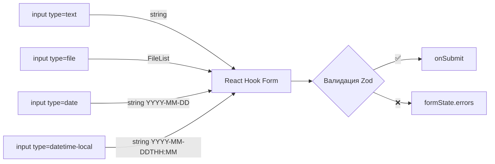
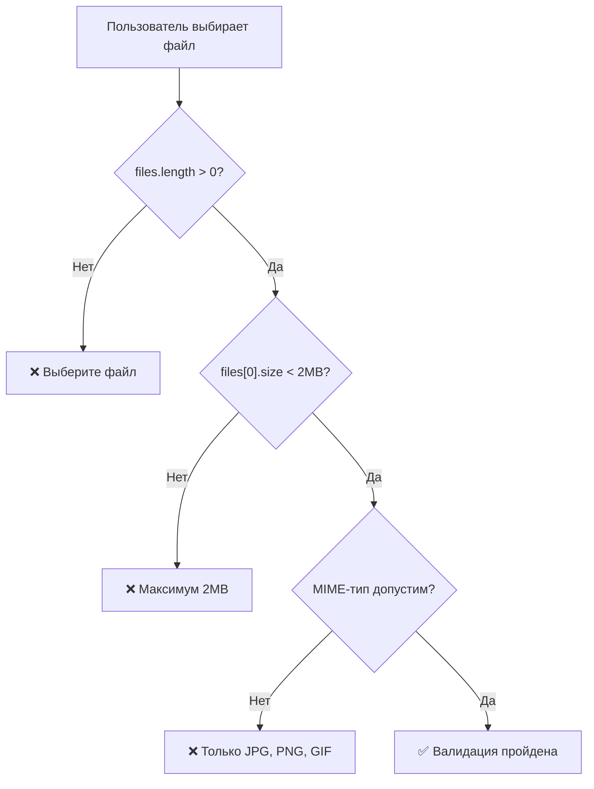
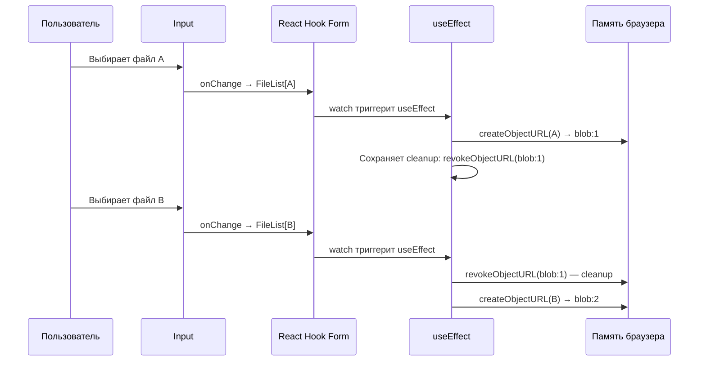
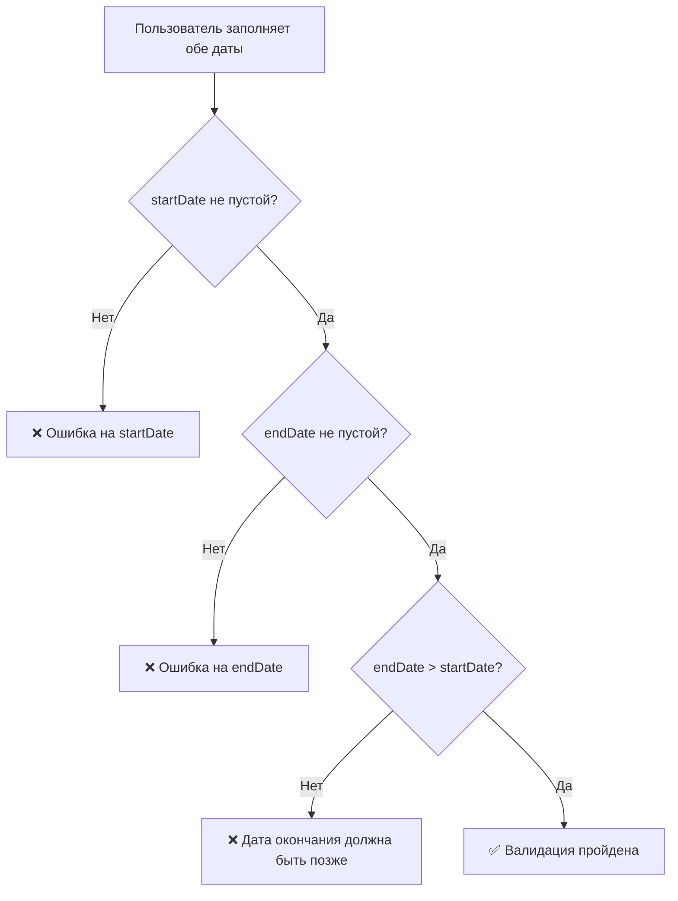

# Уровень 7: Файлы и даты

## Введение

Загрузка файлов и работа с датами -- частые задачи в веб-формах, которые требуют особого подхода. Если обычные текстовые поля -- это «прямая дорога» (ввёл строку, получил строку), то файлы и даты -- это **объезд через просёлочную дорогу**: другой тип данных, другое поведение браузера, другие подводные камни.

Почему эти два типа полей вынесены в отдельный уровень? Потому что оба нарушают привычную ментальную модель «значение поля = строка»:

- **Файл** -- это не строка, а объект `File` (вложенный в `FileList`). Его нельзя просто сохранить в JSON, нельзя предзаполнить через `defaultValues`, и даже `isDirty` для него работает иначе
- **Дата** -- формально строка (`"2024-01-15"`), но семантически -- точка во времени. Валидация даты требует сравнения, преобразований и учёта часовых поясов

В этом уровне вы научитесь интегрировать file upload и date-поля с React Hook Form, валидировать их с помощью Zod, строить превью изображений без утечек памяти и работать с диапазонами дат.



---

## File Upload

### Базовая загрузка файла

Файловый input в HTML -- особенный элемент. В отличие от текстового поля, где значение -- строка, `<input type="file">` хранит объект `FileList`. Это массивоподобная коллекция объектов `File`, даже если пользователь выбрал один файл.

```tsx
function FileUpload() {
  const { register, handleSubmit } = useForm()

  const onSubmit = (data: any) => {
    const file = data.avatar[0]
    console.log('File:', file)
  }

  return (
    <form onSubmit={handleSubmit(onSubmit)}>
      <input type="file" accept="image/*" {...register('avatar')} />
      <button type="submit">Загрузить</button>
    </form>
  )
}
```

📌 **Важно:** `register` для `type="file"` возвращает `FileList`, а не один файл. Для получения первого файла используйте `data.avatar[0]`.

### Под капотом: как RHF работает с файлами

Когда вы вызываете `register('avatar')` на файловом input, React Hook Form прикрепляет `ref` и обработчики точно так же, как для обычных полей. Но есть несколько отличий:

1. **Значение не хранится как строка.** Браузер из соображений безопасности не позволяет программно задать значение файлового input. Поэтому `setValue('avatar', someFile)` не сработает напрямую -- DOM не примет это значение
2. **`isDirty` работает иначе.** Согласно документации RHF, file-типовые input требуют управления на уровне приложения, потому что пользователь может отменить выбор файла, а `FileList` -- это не простой объект для сравнения
3. **`defaultValues` для файлов бесполезны.** Вы не можете предзаполнить файловый input -- это ограничение браузера, а не RHF

Аналогия: если текстовое поле -- это ячейка в электронной таблице (вписал текст, прочитал текст), то файловый input -- это **слот для карты памяти**: вы можете вставить карту и прочитать её содержимое, но не можете «предзаписать» данные в слот.

### Атрибут `accept` -- фильтрация на уровне браузера

Атрибут `accept` ограничивает типы файлов, которые пользователь видит в диалоге выбора:

```tsx
// Только изображения
<input type="file" accept="image/*" {...register('photo')} />

// Только PDF
<input type="file" accept=".pdf" {...register('document')} />

// Несколько типов
<input type="file" accept=".pdf,.doc,.docx" {...register('resume')} />

// MIME-типы
<input type="file" accept="image/png, image/jpeg" {...register('avatar')} />
```

⚠️ **Внимание:** `accept` -- это лишь **подсказка браузеру**, а не валидация. Пользователь всё ещё может выбрать «Все файлы» в диалоге и загрузить что угодно. Настоящая валидация должна происходить в Zod-схеме.

---

## Валидация файлов

### Размер и тип файла

Валидация файлов через Zod требует цепочки `refine`, потому что стандартные методы Zod (`.string()`, `.number()`) не работают с `FileList`. Мы используем `z.instanceof(FileList)` как базовый тип и добавляем проверки сверху:

```tsx
const schema = z.object({
  avatar: z
    .instanceof(FileList)
    .refine(files => files.length > 0, 'Выберите файл')
    .refine(files => files[0]?.size < 2_000_000, 'Максимум 2MB')
    .refine(
      files => ['image/jpeg', 'image/png', 'image/gif'].includes(files[0]?.type),
      'Только JPG, PNG, GIF'
    ),
})
```

Порядок `refine` важен -- они выполняются последовательно, и если первый не прошёл, следующие не вызываются. Поэтому проверка `files.length > 0` идёт первой: без неё обращение к `files[0]?.size` на пустом `FileList` не вызовет ошибку (из-за optional chaining), но сообщение будет нелогичным -- «Максимум 2MB» вместо «Выберите файл».



### Множественная загрузка

Когда пользователь может загрузить несколько файлов, добавьте атрибут `multiple` и валидируйте массив:

```tsx
const schema = z.object({
  documents: z
    .instanceof(FileList)
    .refine(files => files.length > 0, 'Выберите хотя бы один файл')
    .refine(files => files.length <= 5, 'Максимум 5 файлов')
    .refine(
      files => Array.from(files).every(file => file.size < 5_000_000),
      'Каждый файл должен быть меньше 5MB'
    ),
})
```

Обратите внимание на `Array.from(files)` -- `FileList` не настоящий массив, и у него нет метода `.every()`. Преобразование в массив через `Array.from()` (или spread-оператор `[...files]`) открывает доступ к стандартным методам массива.

### Продакшн-паттерн: утилита валидации файлов

В реальных проектах логика валидации файлов повторяется в разных формах. Вынесите её в переиспользуемую функцию:

```tsx
function createFileSchema(options: {
  required?: boolean
  maxSizeMB?: number
  allowedTypes?: string[]
  maxFiles?: number
}) {
  let schema = z.instanceof(FileList)

  if (options.required) {
    schema = schema.refine(
      files => files.length > 0,
      'Выберите файл'
    ) as any
  }

  if (options.maxFiles) {
    schema = schema.refine(
      files => files.length <= options.maxFiles!,
      `Максимум ${options.maxFiles} файлов`
    ) as any
  }

  if (options.maxSizeMB) {
    const maxBytes = options.maxSizeMB * 1_000_000
    schema = schema.refine(
      files => Array.from(files).every(f => f.size < maxBytes),
      `Каждый файл должен быть меньше ${options.maxSizeMB}MB`
    ) as any
  }

  if (options.allowedTypes) {
    schema = schema.refine(
      files => Array.from(files).every(f => options.allowedTypes!.includes(f.type)),
      `Допустимые типы: ${options.allowedTypes.join(', ')}`
    ) as any
  }

  return schema
}

// Использование
const schema = z.object({
  avatar: createFileSchema({
    required: true,
    maxSizeMB: 2,
    allowedTypes: ['image/jpeg', 'image/png'],
  }),
  documents: createFileSchema({
    required: true,
    maxFiles: 5,
    maxSizeMB: 10,
  }),
})
```

---

## Превью изображений

Превью выбранного изображения -- стандартное UX-требование. Но реализация содержит тонкость, которую многие упускают: **управление памятью**.

### Наивный подход (с проблемой)

```tsx
import { useState } from 'react'
import { useForm } from 'react-hook-form'

function FileUploadWithPreview() {
  const { register, handleSubmit } = useForm()
  const [preview, setPreview] = useState<string | null>(null)

  // Сохраняем оригинальный onChange от register
  const avatarRegister = register('avatar')

  return (
    <form onSubmit={handleSubmit(onSubmit)}>
      <input
        type="file"
        accept="image/*"
        {...avatarRegister}
        onChange={e => {
          avatarRegister.onChange(e) // Сначала передаём событие в RHF
          const file = e.target.files?.[0]
          if (file) {
            const url = URL.createObjectURL(file)
            setPreview(url)
          }
        }}
      />

      {preview && (
        
      )}

      <button type="submit">Загрузить</button>
    </form>
  )
}
```

Этот код работает, но каждый вызов `URL.createObjectURL()` создаёт **blob URL** -- строку вида `blob:http://localhost:3000/abc-123`, которая ссылается на файл в памяти браузера. Если пользователь меняет файл 10 раз, в памяти остаётся 10 blob-ссылок, и ни одна не освобождается автоматически.

💡 **Совет:** Не забывайте вызывать `URL.revokeObjectURL()` при размонтировании компонента или смене файла, чтобы избежать утечек памяти.

### Очистка URL при размонтировании

Правильный подход -- использовать `watch` для отслеживания файла и `useEffect` для управления жизненным циклом blob URL:

```tsx
import { useState, useEffect } from 'react'

function FileUploadClean() {
  const { register, watch } = useForm()
  const [preview, setPreview] = useState<string | null>(null)
  const avatarFile = watch('avatar')

  useEffect(() => {
    if (avatarFile?.[0]) {
      const url = URL.createObjectURL(avatarFile[0])
      setPreview(url)
      return () => URL.revokeObjectURL(url) // Cleanup
    }
  }, [avatarFile])

  return (
    <div>
      <input type="file" accept="image/*" {...register('avatar')} />
      {preview && }
    </div>
  )
}
```

Что здесь происходит:

1. `watch('avatar')` подписывается на изменения файлового поля и возвращает `FileList`
2. При каждом изменении файла `useEffect` создаёт новый blob URL
3. Функция cleanup (`return () => URL.revokeObjectURL(url)`) вызывается **перед** следующим выполнением эффекта или при размонтировании компонента, освобождая предыдущий URL



### Превью для нескольких файлов

В продакшн-формах часто нужно показать превью всех выбранных файлов:

```tsx
function MultiFilePreview() {
  const { register, watch } = useForm()
  const [previews, setPreviews] = useState<string[]>([])
  const files = watch('photos')

  useEffect(() => {
    if (files?.length) {
      const urls = Array.from(files as FileList).map(file =>
        URL.createObjectURL(file)
      )
      setPreviews(urls)
      return () => urls.forEach(url => URL.revokeObjectURL(url))
    }
    setPreviews([])
  }, [files])

  return (
    <div>
      <input type="file" accept="image/*" multiple {...register('photos')} />
      <div style={{ display: 'flex', gap: '8px', flexWrap: 'wrap' }}>
        {previews.map((url, i) => (
          
        ))}
      </div>
    </div>
  )
}
```

---

## Date и DateTime поля

### Как браузер работает с датами

HTML5 предоставляет нативные элементы для ввода дат: `<input type="date">` и `<input type="datetime-local">`. Они рендерят календарь и/или поля для времени, но под капотом значение -- всегда **строка** в формате ISO:

| Тип input | Формат значения | Пример |
|-----------|----------------|--------|
| `date` | `YYYY-MM-DD` | `"2024-01-15"` |
| `datetime-local` | `YYYY-MM-DDTHH:MM` | `"2024-01-15T10:30"` |
| `month` | `YYYY-MM` | `"2024-01"` |
| `time` | `HH:MM` | `"10:30"` |

Это важно понимать, потому что React Hook Form получает именно строку, а не объект `Date`. Если бэкенд ожидает `Date`, нужно явное преобразование.

### Date input

```tsx
function DateForm() {
  const { register, handleSubmit } = useForm()

  const onSubmit = (data: any) => {
    console.log('Birth date:', data.birthDate) // '1990-01-01'
  }

  return (
    <form onSubmit={handleSubmit(onSubmit)}>
      <label>Дата рождения</label>
      <input type="date" {...register('birthDate')} />
      <button type="submit">Отправить</button>
    </form>
  )
}
```

### DateTime-local

```tsx
function DateTimeForm() {
  const { register, handleSubmit } = useForm()

  const onSubmit = (data: any) => {
    console.log('Appointment:', data.appointment) // '2024-01-15T10:00'
  }

  return (
    <form onSubmit={handleSubmit(onSubmit)}>
      <label>Запись на встречу</label>
      <input type="datetime-local" {...register('appointment')} />
      <button type="submit">Записаться</button>
    </form>
  )
}
```

### Опция `valueAsDate` -- автоматическое преобразование

React Hook Form поддерживает опцию `valueAsDate` в `register`, которая автоматически преобразует строковое значение в объект `Date`:

```tsx
<input
  type="date"
  {...register('birthDate', { valueAsDate: true })}
/>

// В onSubmit: data.birthDate будет объектом Date, а не строкой
```

📌 **Важно:** `valueAsDate` работает **до** валидации. Это означает, что Zod-схема получит уже `Date`, а не строку. Учитывайте это при написании схемы:

```tsx
// Если используете valueAsDate: true
const schema = z.object({
  birthDate: z.date({ required_error: 'Выберите дату' }),
})

// Если НЕ используете valueAsDate
const schema = z.object({
  birthDate: z.string().min(1, 'Выберите дату'),
})
```

### Ограничение диапазона через HTML-атрибуты

Нативные date-input поддерживают атрибуты `min` и `max`, которые ограничивают выбор даты на уровне UI:

```tsx
// Не позволяет выбрать дату раньше сегодня
<input
  type="date"
  min={new Date().toISOString().split('T')[0]}
  {...register('appointment')}
/>

// Только 2024 год
<input
  type="date"
  min="2024-01-01"
  max="2024-12-31"
  {...register('eventDate')}
/>
```

⚠️ Как и с `accept` для файлов, `min`/`max` -- это UI-ограничения. Пользователь может обойти их через DevTools. Валидация в Zod обязательна.

---

## Валидация дат

### Базовая валидация

```tsx
const schema = z.object({
  birthDate: z.string().min(1, 'Выберите дату'),
  appointment: z
    .string()
    .min(1, 'Выберите время')
    .refine(date => new Date(date) > new Date(), 'Время должно быть в будущем'),
})
```

Обратите внимание: для поля `birthDate` достаточно проверить, что строка не пустая. Формат `YYYY-MM-DD` гарантирован браузером -- нативный date picker не позволяет ввести произвольный текст (в отличие от текстового поля). Однако для `appointment` мы добавляем семантическую проверку: дата записи должна быть в будущем.

### Диапазон дат

Валидация «дата окончания позже даты начала» -- классическая задача cross-field валидации. В Zod для этого используется `.refine()` на уровне всего объекта:

```tsx
const schema = z
  .object({
    startDate: z.string().min(1, 'Выберите дату начала'),
    endDate: z.string().min(1, 'Выберите дату окончания'),
  })
  .refine(data => new Date(data.endDate) > new Date(data.startDate), {
    message: 'Дата окончания должна быть позже даты начала',
    path: ['endDate'],
  })
```

🔥 **Ключевой момент:** параметр `path: ['endDate']` привязывает ошибку к конкретному полю. Без него ошибка попадёт в `errors.root` (или вообще не отобразится), а пользователь не поймёт, какое поле исправлять.



### Ограничение по возрасту

Проверка возраста -- частый сценарий для форм регистрации. Нужно вычислить разницу между текущей датой и датой рождения:

```tsx
const schema = z.object({
  birthDate: z
    .string()
    .min(1, 'Выберите дату')
    .refine(
      date => {
        const age = Math.floor(
          (Date.now() - new Date(date).getTime()) / (365.25 * 24 * 60 * 60 * 1000)
        )
        return age >= 18
      },
      'Вам должно быть не менее 18 лет'
    ),
})
```

Число `365.25` учитывает високосные годы (каждый четвёртый год -- 366 дней, в среднем 365.25). Для юридических целей может понадобиться более точный расчёт с учётом конкретных дат, но для формы регистрации этого достаточно.

### Продакшн-паттерн: утилиты для работы с датами

В реальном проекте вынесите вычисления в отдельные функции:

```tsx
function getAge(birthDate: string): number {
  const today = new Date()
  const birth = new Date(birthDate)
  let age = today.getFullYear() - birth.getFullYear()
  const monthDiff = today.getMonth() - birth.getMonth()

  if (monthDiff < 0 || (monthDiff === 0 && today.getDate() < birth.getDate())) {
    age--
  }

  return age
}

function isFutureDate(dateStr: string): boolean {
  return new Date(dateStr) > new Date()
}

function isWithinDays(dateStr: string, days: number): boolean {
  const date = new Date(dateStr)
  const maxDate = new Date()
  maxDate.setDate(maxDate.getDate() + days)
  return date <= maxDate
}

// Использование в схеме
const schema = z.object({
  birthDate: z
    .string()
    .min(1, 'Выберите дату')
    .refine(date => getAge(date) >= 18, 'Вам должно быть не менее 18 лет'),
  appointment: z
    .string()
    .min(1, 'Выберите дату')
    .refine(isFutureDate, 'Дата должна быть в будущем')
    .refine(date => isWithinDays(date, 90), 'Максимум 90 дней вперёд'),
})
```

Функция `getAge` точнее формулы с `365.25`, потому что учитывает конкретный день и месяц рождения.

---

## ⚠️ Частые ошибки новичков

### ❌ Ошибка 1: Перезапись onChange от register

```tsx
// ❌ Неправильно -- свой onChange перезаписывает обработчик register
<input
  type="file"
  {...register('avatar')}
  onChange={(e) => {
    const file = e.target.files?.[0]
    // register.onChange не вызовется -- RHF не получит значение
  }}
/>

// ✅ Правильно -- вызываем onChange от register, добавляя свою логику
const avatarRegister = register('avatar')
<input
  type="file"
  {...avatarRegister}
  onChange={(e) => {
    avatarRegister.onChange(e)  // Сначала передаём событие в RHF
    const file = e.target.files?.[0]
    if (file) setPreview(URL.createObjectURL(file))
  }}
/>
```

**Почему это ошибка:** оператор spread `{...register('avatar')}` добавляет `onChange` как проп. Если после spread вы указываете свой `onChange`, он **перезаписывает** обработчик RHF. Решение -- сохранить результат `register` в переменную и вызвать его `onChange` явно внутри своего обработчика.

Альтернативный подход -- использовать `watch` вместо кастомного `onChange`:

```tsx
// ✅ Альтернатива -- watch вместо перехвата onChange
const { register, watch } = useForm()
const files = watch('avatar')

// files обновляется автоматически при выборе файла
// Не нужно перехватывать onChange
<input type="file" {...register('avatar')} />
```

---

### ❌ Ошибка 2: Утечка памяти при превью

```tsx
// ❌ Неправильно -- URL не освобождается
const url = URL.createObjectURL(file)
setPreview(url)

// ✅ Правильно -- cleanup через useEffect
useEffect(() => {
  if (avatarFile?.[0]) {
    const url = URL.createObjectURL(avatarFile[0])
    setPreview(url)
    return () => URL.revokeObjectURL(url)
  }
}, [avatarFile])
```

**Почему это ошибка:** `URL.createObjectURL` создаёт blob URL, который занимает память, пока не будет освобождён через `revokeObjectURL`. В SPA-приложении, где компоненты монтируются и размонтируются многократно, это приводит к постепенному росту потребления памяти. На мобильных устройствах с ограниченной памятью эффект особенно заметен.

💡 **Как обнаружить утечку:** откройте DevTools → Memory → сделайте snapshot → выберите файл несколько раз → сделайте ещё snapshot → сравните размеры. Если память растёт линейно с каждым выбором файла -- утечка есть.

---

### ❌ Ошибка 3: Дата как строка без преобразования

```tsx
// ❌ Неправильно -- дата остаётся строкой
birthDate: z.string().min(1, 'Обязательно')
// При отправке: { birthDate: "1990-01-15" } -- строка, не Date

// ✅ Правильно -- преобразуем в Date при необходимости
birthDate: z
  .string()
  .min(1, 'Обязательно')
  .transform(val => new Date(val))
```

**Почему это ошибка:** HTML date input всегда возвращает строку формата `YYYY-MM-DD`. Если бэкенд ожидает объект `Date` или ISO-строку с временной зоной, нужно явное преобразование. Два варианта:

1. **Через Zod `.transform()`** -- преобразование происходит после валидации, данные в `onSubmit` уже будут `Date`
2. **Через RHF `valueAsDate: true`** -- преобразование происходит до валидации, но тогда Zod-схема должна ожидать `z.date()`, а не `z.string()`

Выбирайте один подход и придерживайтесь его в рамках проекта.

---

### ❌ Ошибка 4: Валидация файла без проверки наличия

```tsx
// ❌ Неправильно -- может быть undefined при первом рендере
avatar: z
  .instanceof(FileList)
  .refine(files => files[0].size < 2_000_000, 'Максимум 2MB')

// ✅ Правильно -- проверяем наличие файла сначала
avatar: z
  .instanceof(FileList)
  .refine(files => files.length > 0, 'Выберите файл')
  .refine(files => files[0]?.size < 2_000_000, 'Максимум 2MB')
```

**Почему это ошибка:** без проверки `.length > 0` обращение к `files[0].size` вызовет `TypeError: Cannot read properties of undefined`, если файл не выбран. `FileList` может быть пустым (length === 0), и `files[0]` вернёт `undefined`. Используйте optional chaining (`?.`) для безопасного доступа даже после проверки длины -- это защита от edge-кейсов.

---

### ❌ Ошибка 5: Сравнение дат как строк

```tsx
// ❌ Неправильно -- лексикографическое сравнение строк
.refine(data => data.endDate > data.startDate, 'Дата окончания позже')

// ✅ Правильно -- сравнение через объекты Date
.refine(
  data => new Date(data.endDate) > new Date(data.startDate),
  'Дата окончания должна быть позже'
)
```

**Почему это может работать, но не должно:** формат `YYYY-MM-DD` -- один из немногих, где лексикографическое сравнение строк совпадает с хронологическим порядком. Поэтому `"2024-01-15" > "2024-01-10"` вернёт `true`. Но это хрупкий приём: он ломается с форматами `DD/MM/YYYY`, с `datetime-local` (из-за `T` в строке) и делает код непонятным для других разработчиков. Всегда преобразуйте в `Date` для сравнений.

---

## 📚 Дополнительные ресурсы

- [MDN: File API](https://developer.mozilla.org/en-US/docs/Web/API/File_API) -- работа с файлами в браузере
- [MDN: URL.createObjectURL](https://developer.mozilla.org/en-US/docs/Web/API/URL/createObjectURL_static) -- создание blob URL для превью
- [MDN: input type="date"](https://developer.mozilla.org/en-US/docs/Web/HTML/Element/input/date) -- нативный date picker
- [register документация](https://react-hook-form.com/docs/useform/register) -- опции `valueAsDate`, `valueAsNumber`

---

## Что дальше?

В следующем уровне вы познакомитесь с **динамическими формами** -- одной из самых мощных возможностей React Hook Form:

- **`useFieldArray`** -- добавление и удаление полей по клику (списки товаров, контактов, навыков)
- **Условные поля** -- показ/скрытие полей в зависимости от значений других полей
- **Зависимые поля** -- каскадные выпадающие списки (страна → город)
- **Wizard-формы** -- пошаговые формы с навигацией вперёд-назад
