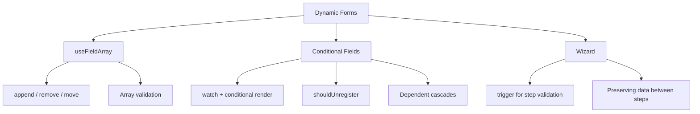
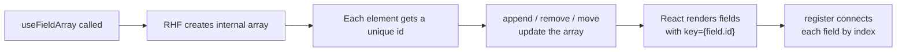
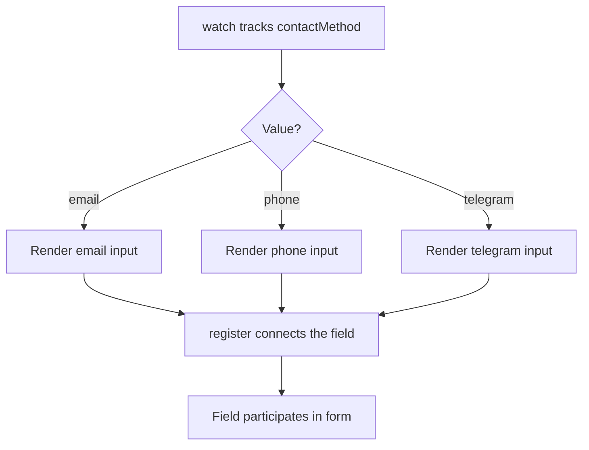
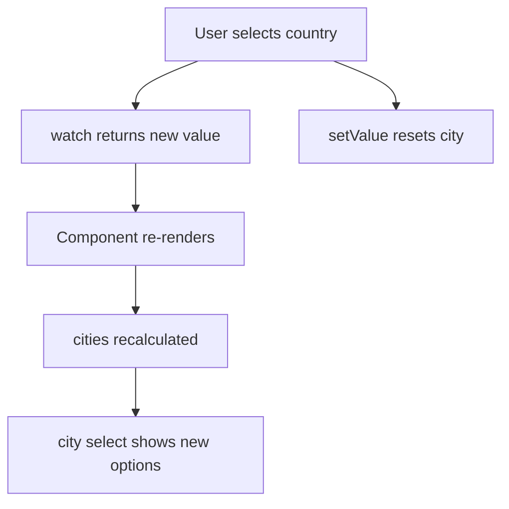
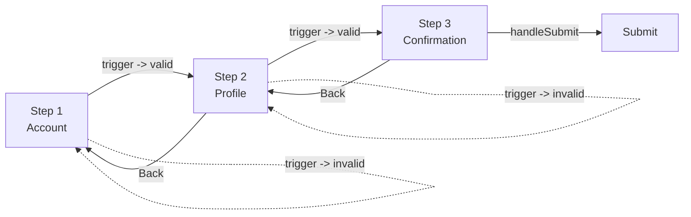

# Level 8: Dynamic Forms -- useFieldArray, Wizard, Conditional

## Introduction

Imagine filling out a paper form with a fixed number of rows: three lines for "previous employers." What if you have five? Or none? Paper forms can't adapt to reality. Dynamic forms on the web solve exactly this problem -- they **change their structure** based on user actions.

In real projects, dynamic forms are everywhere:

- Online store: user adds items to an order -- each item is a new row with "name", "quantity", "price" fields
- HR system: candidate lists their work experience -- from zero to ten entries
- Survey builder: author adds questions and answer options
- Insurance policy checkout: wizard of 5-7 steps, where each next step depends on previous answers

In this level, we'll cover three key dynamic form patterns:

1. **useFieldArray** -- managing field arrays (add/remove/move)
2. **Conditional and dependent fields** -- showing/hiding fields based on other field values
3. **Wizard (multi-step forms)** -- splitting a long form into step-by-step screens



**Important:** all three patterns are often combined in one form. For example, an order wizard might contain a step with a dynamic product list (useFieldArray) and conditional delivery fields that depend on the selected shipping method. That's why we study them in one level.

---

## Part 1: useFieldArray

### What is useFieldArray?

**useFieldArray** is a React Hook Form hook designed for working with **dynamic field arrays**. It allows adding, removing, moving, and updating array elements while preserving all RHF benefits: minimal re-renders, validation, and typing.

Analogy: if `register` connects one field to the form (like a single wall socket), then `useFieldArray` is a **power strip with variable slots**. You can add as many fields as needed, and each one is fully connected to the form system.

### Under the Hood

When you call `useFieldArray`, RHF creates an internal array where each element gets a unique `id`. This `id` is generated when the element is added and **doesn't change** throughout its lifetime -- even if elements around it are removed or rearranged. This is why `field.id` should be used as the React `key` -- it's stable, unlike the array index.



### Basic Usage

```tsx
import { useForm, useFieldArray } from 'react-hook-form'

interface FormValues {
  emails: { value: string }[]
}

function DynamicForm() {
  const { control, register, handleSubmit } = useForm<FormValues>({
    defaultValues: {
      emails: [{ value: '' }], // Initial value -- one empty email
    },
  })

  const { fields, append, remove } = useFieldArray({
    control,
    name: 'emails',
  })

  const onSubmit = (data: FormValues) => {
    console.log('Emails:', data.emails)
  }

  return (
    <form onSubmit={handleSubmit(onSubmit)}>
      {fields.map((field, index) => (
        <div key={field.id}>
          <input {...register(`emails.${index}.value`)} placeholder="Email" />
          <button type="button" onClick={() => remove(index)}>
            X
          </button>
        </div>
      ))}

      <button type="button" onClick={() => append({ value: '' })}>
        + Add
      </button>

      <button type="submit">Submit</button>
    </form>
  )
}
```

Note several important details:

1. **`control`** is passed to `useFieldArray` -- this is the bridge object between `useForm` and child hooks. Without it, `useFieldArray` doesn't know which form the array belongs to
2. **`name: 'emails'`** -- the path to the array in the form data structure. Must match the key in `defaultValues`
3. **`key={field.id}`** -- not `key={index}`! More on this in the errors section
4. **`register(\`emails.${index}.value\`)`** -- the path to a specific field within the array, formed dynamically by index

### useFieldArray Methods

The hook returns a `fields` array and a set of methods for mutating it:

```tsx
const {
  fields,   // Array of fields { id, ...value }
  append,   // Add to the end
  prepend,  // Add to the beginning
  insert,   // Insert at index
  remove,   // Remove at index
  swap,     // Swap two elements
  move,     // Move element
  replace,  // Replace entire array
  update,   // Update a specific field
} = useFieldArray({ control, name: 'items' })
```

Each method **doesn't cause a full form re-render** -- RHF optimizes updates, re-rendering only the changed elements.

### Method Usage Examples

```tsx
// Add one element to the end
append({ value: '' })

// Add multiple elements at once
append([{ value: 'a' }, { value: 'b' }])

// Add to the beginning
prepend({ value: 'first' })

// Insert at index (after the first element)
insert(1, { value: 'new' })

// Remove element at index
remove(2)

// Remove multiple elements at once
remove([1, 3, 5])

// Swap two elements
swap(0, 1)

// Move element (from position 3 to position 1)
move(3, 1)

// Replace entire array with new values
replace([{ value: 'new1' }, { value: 'new2' }])

// Update a specific field by index
update(0, { value: 'updated' })
```

**Tip:** `swap` and `move` differ in logic. `swap(0, 2)` exchanges elements 0 and 2, others don't move. `move(0, 2)` **moves** element 0 to position 2, shifting intermediate elements. For drag-and-drop, `move` is typically used, while for "up/down" buttons -- `swap`.

### When to Use What in Production

| Method | Typical scenario |
|-------|-------------------|
| `append` | "+ Add row" button |
| `remove` | "X" button next to element |
| `move` | Drag-and-drop sorting |
| `swap` | "Up" / "Down" buttons |
| `insert` | Insert between existing elements (rare) |
| `replace` | Loading data from server, resetting list |
| `update` | Inline editing of a single element |
| `prepend` | Adding "most important" to the beginning |

---

### Validating Dynamic Fields

Array field validation requires a special approach -- you need to validate both **each element** and the **array as a whole** (e.g., "minimum one email"). Zod handles both levels excellently:

```tsx
import { z } from 'zod'
import { zodResolver } from '@hookform/resolvers/zod'

const schema = z.object({
  emails: z
    .array(
      z.object({
        value: z.string().email('Invalid email'),
      })
    )
    .min(1, 'At least one email required')
    .max(10, 'Maximum 10 emails'),
})

type FormValues = z.infer<typeof schema>
```

Two validation levels work here:

1. **Element level:** `z.string().email()` -- checks each email for correct format
2. **Array level:** `.min(1)` and `.max(10)` -- checks the number of elements

Integration with the form:

```tsx
const {
  control,
  register,
  handleSubmit,
  formState: { errors },
} = useForm<FormValues>({
  resolver: zodResolver(schema),
  defaultValues: { emails: [{ value: '' }] },
})

const { fields, append, remove } = useFieldArray({ control, name: 'emails' })
```

Displaying errors:

```tsx
{fields.map((field, index) => (
  <div key={field.id}>
    <input {...register(`emails.${index}.value` as const)} />
    {errors.emails?.[index]?.value && (
      <span className="error">{errors.emails[index]?.value?.message}</span>
    )}
    <button type="button" onClick={() => remove(index)}>
      X
    </button>
  </div>
))}

{/* Array-level error (not enough elements) */}
{errors.emails?.root && (
  <span className="error">{errors.emails.root.message}</span>
)}
```

**Important:** array-level error (`.min(1)`) goes to `errors.emails.root`, not `errors.emails.message`. This is a common source of confusion -- element errors live in `errors.emails[index]`, while whole-array errors are in `errors.emails.root`.

### The `rules` Option in useFieldArray

In addition to a Zod schema, you can add basic rules directly in `useFieldArray`:

```tsx
const { fields, append, remove } = useFieldArray({
  control,
  name: 'users',
  rules: { minLength: 1 }, // Can't remove the last element
})
```

This is convenient for simple constraints that don't require a Zod schema.

---

## Part 2: Conditional Fields

### The Problem

In most real forms, not all fields are needed simultaneously. Chose "Contact method: Email" -- show email field. Chose "Phone" -- show phone field. This seems simple, but behind this simplicity lie several traps related to validation and hidden field state.

### Basic Conditional Rendering

The approach is simple: track the value via `watch` and conditionally render the field:

```tsx
function ConditionalForm() {
  const { register, handleSubmit, watch } = useForm()

  const contactMethod = watch('contactMethod')

  return (
    <form onSubmit={handleSubmit(onSubmit)}>
      <select {...register('contactMethod')}>
        <option value="email">Email</option>
        <option value="phone">Phone</option>
        <option value="telegram">Telegram</option>
      </select>

      {contactMethod === 'email' && <input {...register('email')} placeholder="Email" />}

      {contactMethod === 'phone' && <input {...register('phone')} placeholder="Phone" />}

      {contactMethod === 'telegram' && <input {...register('telegram')} placeholder="@username" />}

      <button type="submit">Submit</button>
    </form>
  )
}
```



**Tip:** `watch` causes a re-render on every change of the tracked field. If you have a complex form with many conditions, extract conditional blocks into separate components and use `useWatch` instead of `watch` -- this limits re-renders to only the component that actually depends on the value.

### Validating Conditional Fields

**Problem:** when a field is hidden from the DOM (conditional render returns `false`), it by default **remains registered** in RHF. This means validation rules for the hidden field still apply, and the form may fail validation because of a field the user can't even see.

**Solution 1: `shouldUnregister: true`** -- when the component unmounts, the field is automatically removed from the form:

```tsx
const { register } = useForm({ shouldUnregister: true })

// When this input is hidden -- the field is removed from the form
{showEmail && <input {...register('email', { required: true })} />}
```

**Caution:** `shouldUnregister: true` at the `useForm` level affects **all** fields. This can cause problems in wizard forms where fields from previous steps are unmounted but their values should be preserved. In such cases, solution 2 is better.

**Solution 2: Custom validation via Zod refine:**

```tsx
const schema = z
  .object({
    contactMethod: z.enum(['email', 'phone', 'telegram']),
    email: z.string().email().optional(),
    phone: z.string().optional(),
    telegram: z.string().optional(),
  })
  .refine(
    data => {
      if (data.contactMethod === 'email') return !!data.email
      if (data.contactMethod === 'phone') return !!data.phone
      return !!data.telegram
    },
    { message: 'Fill in contact details', path: ['email'] }
  )
```

This approach doesn't depend on whether the field is registered in the DOM or not -- validation happens at the data level, not DOM elements. This is more reliable and predictable.

---

## Part 3: Dependent Fields

### What Are Dependent Fields

Dependent fields are fields whose **options or availability** are determined by another field's value. The classic example is a "Country -> City" cascade: the city list depends on the selected country.

Difference from conditional fields: a conditional field may or may not exist (show/hide), while a dependent field **always exists**, but its contents (options, disabled state) changes.

### Basic Dependent Fields

```tsx
const citiesByCountry: Record<string, string[]> = {
  ru: ['Moscow', 'Saint Petersburg', 'Kazan'],
  us: ['New York', 'Los Angeles', 'Chicago'],
  de: ['Berlin', 'Munich', 'Hamburg'],
}

function DependentFields() {
  const { register, handleSubmit, watch, setValue } = useForm()

  const country = watch('country')
  const cities = country ? citiesByCountry[country] || [] : []

  return (
    <form>
      <select {...register('country')}>
        <option value="">Choose a country</option>
        <option value="ru">Russia</option>
        <option value="us">USA</option>
        <option value="de">Germany</option>
      </select>

      <select {...register('city')} disabled={!country}>
        <option value="">Choose a city</option>
        {cities.map(city => (
          <option key={city} value={city}>
            {city}
          </option>
        ))}
      </select>

      <button type="submit">Submit</button>
    </form>
  )
}
```



### Resetting Dependent Field on Parent Change

This is critically important. If the user selected Russia -> Moscow, then switched the country to USA, the "City" field will still show "Moscow" -- which isn't in the USA city list. The user will see an empty select, but the form will send an invalid value.

The solution is to reset the dependent field whenever the parent changes:

```tsx
<select
  {...register('country')}
  onChange={(e) => {
    setValue('country', e.target.value)
    setValue('city', '') // Reset city when country changes
  }}
>
```

**Tip:** if you have a chain of three or more levels (Country -> Region -> City), changing the country needs to reset both region and city. `useEffect` with dependency on the parent field is a more scalable solution for long cascades:

```tsx
const country = watch('country')

useEffect(() => {
  setValue('region', '')
  setValue('city', '')
}, [country, setValue])
```

---

## Part 4: Wizard (Multi-step Forms)

### Why Wizard Forms Are Needed

A long form with 15-20 fields intimidates users. UX research shows that splitting such a form into 3-5 logical steps increases completion rates. A wizard form is **one form** whose data is collected sequentially through several "screens."

The key task in implementing a wizard is **validating only the current step**, not letting the user proceed with errors. For this, RHF has the `trigger` method, which launches validation selectively -- only for specified fields.

### Basic Wizard

```tsx
import { useState } from 'react'
import { useForm } from 'react-hook-form'

function WizardForm() {
  const [step, setStep] = useState(1)
  const { register, handleSubmit, trigger } = useForm()

  const onNext = async () => {
    // Validate only current step's fields
    const fieldsToValidate =
      step === 1 ? ['email', 'password'] : ['firstName', 'lastName']

    const isValid = await trigger(fieldsToValidate)
    if (isValid) setStep(step + 1)
  }

  const onPrev = () => setStep(step - 1)

  const onSubmit = (data: any) => {
    console.log('Submitted:', data)
  }

  return (
    <form onSubmit={handleSubmit(onSubmit)}>
      {step === 1 && (
        <>
          <h2>Step 1: Account</h2>
          <input {...register('email', { required: true })} placeholder="Email" />
          <input
            {...register('password', { required: true })}
            type="password"
            placeholder="Password"
          />
          <button type="button" onClick={onNext}>
            Next
          </button>
        </>
      )}

      {step === 2 && (
        <>
          <h2>Step 2: Profile</h2>
          <input {...register('firstName', { required: true })} placeholder="First Name" />
          <input {...register('lastName', { required: true })} placeholder="Last Name" />
          <div>
            <button type="button" onClick={onPrev}>
              Back
            </button>
            <button type="button" onClick={onNext}>
              Next
            </button>
          </div>
        </>
      )}

      {step === 3 && (
        <>
          <h2>Step 3: Confirmation</h2>
          <textarea {...register('comments')} placeholder="Comment" />
          <div>
            <button type="button" onClick={onPrev}>
              Back
            </button>
            <button type="submit">Submit</button>
          </div>
        </>
      )}
    </form>
  )
}
```



### How `trigger` Works

`trigger` is an async method that validates specified fields and returns a `boolean`:

```tsx
// Validate one field
const isEmailValid = await trigger('email')

// Validate several fields
const isStepValid = await trigger(['email', 'password'])

// Validate all form fields
const isFormValid = await trigger()
```

**Key point:** `trigger` doesn't just return a result -- it also **updates `formState.errors`**. If a field is invalid, after calling `trigger` the error will appear in `errors`, and the UI can display it. If the field became valid, the error will be removed.

### Wizard with Data Persistence Between Steps

By default, RHF **preserves data** of all registered fields, even if they're unmounted (hidden). This default behavior (`shouldUnregister: false`) is ideal for wizard forms: the user filled step 1, moved to step 2, came back -- step 1 data is still there.

```tsx
function WizardWithPersistence() {
  const [step, setStep] = useState(1)

  const { register, handleSubmit, trigger, watch } = useForm({
    defaultValues: {
      email: '',
      password: '',
      firstName: '',
      lastName: '',
      comments: '',
    },
  })

  // All data available on any step -- even hidden ones
  const allData = watch()

  const onNext = async () => {
    const fields = step === 1 ? ['email', 'password'] : ['firstName', 'lastName']
    const isValid = await trigger(fields)
    if (isValid) setStep(step + 1)
  }

  return (
    <form onSubmit={handleSubmit(onSubmit)}>
      <div>Step {step} of 3</div>

      {/* Step rendering */}

      {/* Preview of all data -- for debugging */}
      <pre>{JSON.stringify(allData, null, 2)}</pre>
    </form>
  )
}
```

**Important:** this is exactly why `shouldUnregister: true` is dangerous in wizard forms. If you enable it, when moving to step 2 all step 1 data will be lost, because step 1 fields unmount and RHF removes their values.

### Production Patterns for Wizard Forms

In real applications, wizard forms are often more complex than textbook examples. Here are patterns found in production:

**Progress bar with step numbers** -- the user should see which step they're on and how many are left.

**localStorage saving** -- if the user accidentally closes the tab, data isn't lost. Implemented via `watch` + `useEffect` + `localStorage`:

```tsx
const allData = watch()

useEffect(() => {
  localStorage.setItem('wizard-draft', JSON.stringify(allData))
}, [allData])
```

**Jumping to a specific step on click** -- instead of "Next/Back," the user can click a step number. In this case, all intermediate steps need validation:

```tsx
const goToStep = async (targetStep: number) => {
  if (targetStep > step) {
    // When going forward -- validate current step
    const isValid = await trigger(fieldsForStep(step))
    if (!isValid) return
  }
  setStep(targetStep)
}
```

---

## Complete Example: Order Form

This example combines all three patterns: wizard (4 steps), conditional fields (contact method), useFieldArray (product list), and dependent fields (contact validation depends on selected method).

```tsx
import { useState } from 'react'
import { useForm, useFieldArray } from 'react-hook-form'
import { z } from 'zod'
import { zodResolver } from '@hookform/resolvers/zod'

const schema = z.object({
  // Step 1: Contact information
  contactMethod: z.enum(['email', 'phone']),
  email: z.string().email().optional(),
  phone: z.string().optional(),

  // Step 2: Products
  items: z
    .array(
      z.object({
        name: z.string().min(1),
        quantity: z.number().min(1),
        price: z.number().positive(),
      })
    )
    .min(1, 'Add at least one product'),

  // Step 3: Delivery
  address: z.object({
    city: z.string().min(1),
    street: z.string().min(1),
    zip: z.string().regex(/^\d{5}$/, 'Invalid zip code'),
  }),

  comments: z.string().optional(),
})

type OrderForm = z.infer<typeof schema>

export function OrderWizard() {
  const [step, setStep] = useState(1)

  const {
    control,
    register,
    handleSubmit,
    trigger,
    watch,
    setValue,
    formState: { errors },
  } = useForm<OrderForm>({
    resolver: zodResolver(schema),
    defaultValues: {
      items: [{ name: '', quantity: 1, price: 0 }],
      address: { city: '', street: '', zip: '' },
    },
  })

  const { fields, append, remove } = useFieldArray({
    control,
    name: 'items',
  })

  const contactMethod = watch('contactMethod')

  const onNext = async () => {
    let fieldsToValidate: any[] = []

    if (step === 1) {
      fieldsToValidate = ['contactMethod']
      if (contactMethod === 'email') fieldsToValidate.push('email')
      else fieldsToValidate.push('phone')
    } else if (step === 2) {
      fieldsToValidate = ['items']
    } else if (step === 3) {
      fieldsToValidate = ['address.city', 'address.street', 'address.zip']
    }

    const isValid = await trigger(fieldsToValidate)
    if (isValid) setStep(step + 1)
  }

  const onSubmit = (data: OrderForm) => {
    console.log('Order:', data)
  }

  return (
    <form onSubmit={handleSubmit(onSubmit)}>
      <div style={{ marginBottom: '1rem' }}>Step {step} of 4</div>

      {/* Step 1: Contact */}
      {step === 1 && (
        <div>
          <h2>Contact Information</h2>

          <div>
            <label>Contact method</label>
            <select {...register('contactMethod')}>
              <option value="email">Email</option>
              <option value="phone">Phone</option>
            </select>
          </div>

          {contactMethod === 'email' ? (
            <div>
              <label>Email</label>
              <input type="email" {...register('email')} />
              {errors.email && <span className="error">{errors.email.message}</span>}
            </div>
          ) : (
            <div>
              <label>Phone</label>
              <input type="tel" {...register('phone')} />
              {errors.phone && <span className="error">{errors.phone.message}</span>}
            </div>
          )}

          <button type="button" onClick={onNext}>
            Next
          </button>
        </div>
      )}

      {/* Step 2: Products */}
      {step === 2 && (
        <div>
          <h2>Products</h2>

          {fields.map((field, index) => (
            <div key={field.id} style={{ marginBottom: '1rem' }}>
              <input {...register(`items.${index}.name` as const)} placeholder="Name" />
              <input
                type="number"
                {...register(`items.${index}.quantity` as const, { valueAsNumber: true })}
                placeholder="Quantity"
              />
              <input
                type="number"
                {...register(`items.${index}.price` as const, { valueAsNumber: true })}
                placeholder="Price"
              />
              <button type="button" onClick={() => remove(index)}>
                X
              </button>
            </div>
          ))}

          <button type="button" onClick={() => append({ name: '', quantity: 1, price: 0 })}>
            + Add product
          </button>

          <div>
            <button type="button" onClick={() => setStep(step - 1)}>
              Back
            </button>
            <button type="button" onClick={onNext}>
              Next
            </button>
          </div>
        </div>
      )}

      {/* Step 3: Delivery */}
      {step === 3 && (
        <div>
          <h2>Delivery Address</h2>

          <input {...register('address.city')} placeholder="City" />
          {errors.address?.city && <span className="error">{errors.address.city.message}</span>}

          <input {...register('address.street')} placeholder="Street" />
          {errors.address?.street && <span className="error">{errors.address.street.message}</span>}

          <input {...register('address.zip')} placeholder="ZIP" />
          {errors.address?.zip && <span className="error">{errors.address.zip.message}</span>}

          <div>
            <button type="button" onClick={() => setStep(step - 1)}>
              Back
            </button>
            <button type="button" onClick={onNext}>
              Next
            </button>
          </div>
        </div>
      )}

      {/* Step 4: Confirmation */}
      {step === 4 && (
        <div>
          <h2>Confirmation</h2>
          <textarea {...register('comments')} placeholder="Comments" />

          <div>
            <button type="button" onClick={() => setStep(step - 1)}>
              Back
            </button>
            <button type="submit">Place Order</button>
          </div>
        </div>
      )}
    </form>
  )
}
```

---

## Common Beginner Mistakes

### Mistake 1: Using array index as key in useFieldArray

```tsx
// Wrong -- index as key causes issues on remove/move
{fields.map((field, index) => (
  <div key={index}>
    <input {...register(`emails.${index}.value`)} />
  </div>
))}

// Correct -- use field.id
{fields.map((field, index) => (
  <div key={field.id}>
    <input {...register(`emails.${index}.value`)} />
  </div>
))}
```

**Why this is a mistake:** React uses `key` to identify elements between renders. When you use index as key and remove an element, React incorrectly associates state with the wrong elements. The unique `field.id` from `useFieldArray` is stable across mutations, so React correctly tracks each element.

---

### Mistake 2: Forgetting to validate current step before proceeding

```tsx
// Wrong -- no validation, user can skip steps
const onNext = () => setStep(step + 1)

// Correct -- validate before moving
const onNext = async () => {
  const isValid = await trigger(['email', 'password'])
  if (isValid) setStep(step + 1)
}
```

**Why this is a mistake:** Without validation, users can skip through steps with empty or invalid data. The final submit will fail with errors the user never saw, creating a confusing experience.

---

### Mistake 3: Using `shouldUnregister: true` in wizard forms

```tsx
// Wrong -- data from previous steps is lost when navigating
const { register } = useForm({ shouldUnregister: true })

// Correct -- keep default (false) for wizard forms
const { register } = useForm()
```

**Why this is a mistake:** In wizard forms, steps are unmounted when the user moves to the next step. With `shouldUnregister: true`, RHF removes the unmounted field values, so going back reveals empty fields. The default `false` preserves data between steps.

---

### Mistake 4: Not resetting dependent fields

```tsx
// Wrong -- city remains "Moscow" when country changes to "USA"
<select {...register('country')}>
  <option value="ru">Russia</option>
  <option value="us">USA</option>
</select>
<select {...register('city')}>
  {cities.map(c => <option value={c}>{c}</option>)}
</select>

// Correct -- reset city on country change
<select
  {...register('country')}
  onChange={(e) => {
    setValue('country', e.target.value)
    setValue('city', '')
  }}
>
```

**Why this is a mistake:** When the parent field changes, the dependent field may contain a value that's no longer valid for the new parent selection. The form submits stale data.

---

### Mistake 5: Not using `as const` with register for array fields

```tsx
// Wrong -- TypeScript can't verify the path
<input {...register(`emails.${index}.value`)} />

// Correct -- TypeScript verifies the path structure
<input {...register(`emails.${index}.value` as const)} />
```

**Why this matters:** Without `as const`, TypeScript treats the template literal as a generic `string`, losing type safety. With `as const`, the path is verified against the form's type structure.

---

## Additional Resources

- [useFieldArray documentation](https://react-hook-form.com/docs/usefieldarray)
- [trigger documentation](https://react-hook-form.com/docs/useform/trigger)
- [shouldUnregister](https://react-hook-form.com/docs/useform#shouldUnregister)

---

## What's Next?

In the next level, you'll explore **form state** in depth:

- **Dirty and touched states** -- tracking user interaction
- **getFieldState()** -- querying individual field state
- **reset and defaultValues** -- controlling form baseline
- **isSubmitSuccessful** -- tracking submission outcomes
