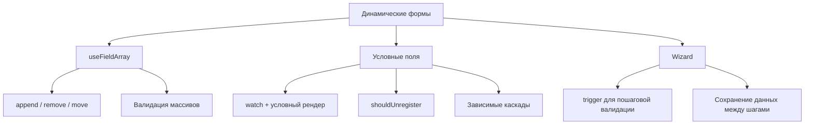
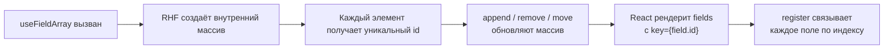
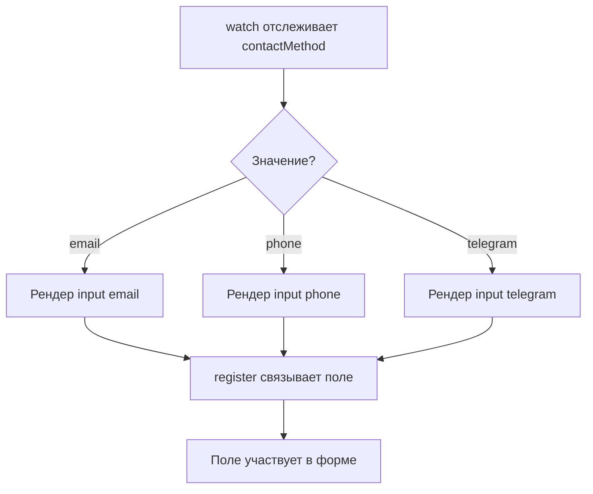
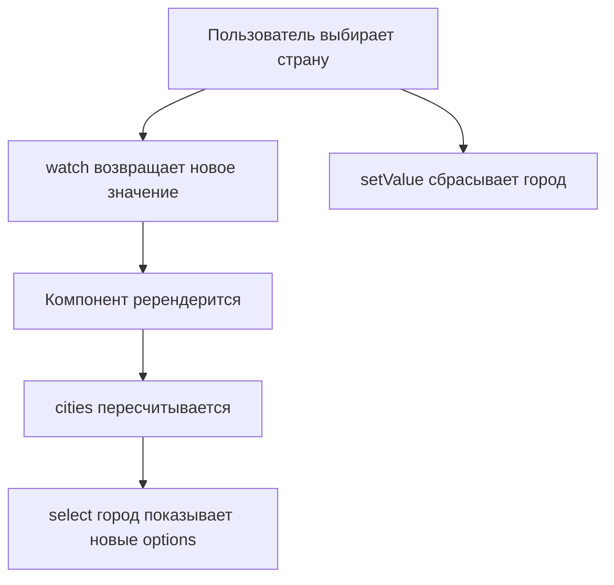
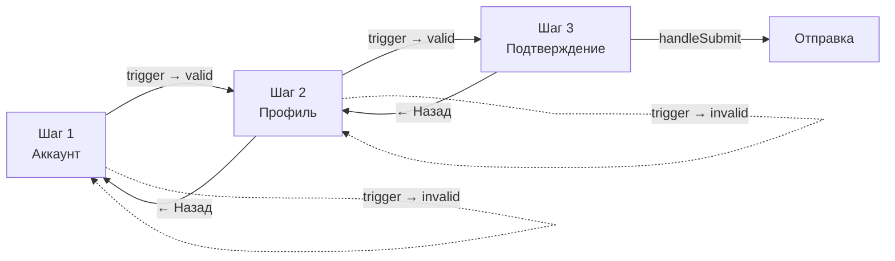

# Уровень 5: Динамические формы — useFieldArray, Wizard, Conditional

## Введение

Представьте, что вы заполняете бумажную анкету, где количество строк фиксировано: три строки для «предыдущих мест работы». А если у вас их пять? Или ни одного? Бумажная форма не подстраивается под реальность. Динамические формы в вебе решают именно эту проблему — они **меняют свою структуру** в зависимости от действий пользователя.

В реальных проектах динамические формы встречаются повсюду:

- Интернет-магазин: пользователь добавляет товары в заказ — каждый товар это новая строка с полями «название», «количество», «цена»
- HR-система: кандидат перечисляет свой опыт работы — от нуля до десяти записей
- Конструктор опросов: автор добавляет вопросы и варианты ответов
- Оформление страхового полиса: wizard из 5-7 шагов, где каждый следующий шаг зависит от ответов на предыдущем

В этом уровне мы разберём три ключевых паттерна динамических форм:

1. **useFieldArray** — управление массивами полей (добавить/удалить/переместить)
2. **Условные и зависимые поля** — показ/скрытие полей на основе значений других полей
3. **Wizard (multi-step формы)** — разбиение длинной формы на пошаговые экраны



📌 **Важно:** все три паттерна часто комбинируются в одной форме. Например, wizard-форма оформления заказа может содержать шаг с динамическим списком товаров (useFieldArray) и условные поля доставки, которые зависят от выбранного способа. Именно поэтому мы изучаем их в одном уровне.

---

## Часть 1: useFieldArray

### Что такое useFieldArray?

**useFieldArray** — это хук из React Hook Form, предназначенный для работы с **динамическими массивами полей**. Он позволяет добавлять, удалять, перемещать и обновлять элементы массива, при этом сохраняя все преимущества RHF: минимальные ререндеры, валидацию и типизацию.

Аналогия: если `register` — это подключение одного поля к форме (как одна розетка в стене), то `useFieldArray` — это **удлинитель с переменным числом гнёзд**. Вы можете добавить столько полей, сколько нужно, и каждое из них будет полноценно подключено к системе формы.

### Под капотом

Когда вы вызываете `useFieldArray`, RHF создаёт внутренний массив, где каждому элементу присваивается уникальный `id`. Этот `id` генерируется при добавлении элемента и **не меняется** на протяжении его жизни — даже если элементы вокруг удалены или переставлены. Именно поэтому `field.id` нужно использовать как `key` в React — он стабилен, в отличие от индекса массива.



### Базовое использование

```tsx
import { useForm, useFieldArray } from 'react-hook-form'

interface FormValues {
  emails: { value: string }[]
}

function DynamicForm() {
  const { control, register, handleSubmit } = useForm<FormValues>({
    defaultValues: {
      emails: [{ value: '' }], // Начальное значение — один пустой email
    },
  })

  const { fields, append, remove } = useFieldArray({
    control,
    name: 'emails',
  })

  const onSubmit = (data: FormValues) => {
    console.log('Emails:', data.emails)
  }

  return (
    <form onSubmit={handleSubmit(onSubmit)}>
      {fields.map((field, index) => (
        <div key={field.id}>
          <input {...register(`emails.${index}.value`)} placeholder="Email" />
          <button type="button" onClick={() => remove(index)}>
            ✕
          </button>
        </div>
      ))}

      <button type="button" onClick={() => append({ value: '' })}>
        + Добавить
      </button>

      <button type="submit">Отправить</button>
    </form>
  )
}
```

Обратите внимание на несколько важных деталей:

1. **`control`** передаётся в `useFieldArray` — это объект-мост между `useForm` и дочерними хуками. Без него `useFieldArray` не знает, к какой форме относится массив
2. **`name: 'emails'`** — путь к массиву в структуре данных формы. Должен совпадать с ключом в `defaultValues`
3. **`key={field.id}`** — не `key={index}`! Подробнее об этом в разделе ошибок
4. **`register(`emails.${index}.value`)`** — путь к конкретному полю внутри массива, формируется динамически по индексу

### Методы useFieldArray

Хук возвращает массив `fields` и набор методов для его мутации:

```tsx
const {
  fields,   // Массив полей { id, ...value }
  append,   // Добавить в конец
  prepend,  // Добавить в начало
  insert,   // Вставить по индексу
  remove,   // Удалить по индексу
  swap,     // Поменять местами
  move,     // Переместить
  replace,  // Заменить весь массив
  update,   // Обновить конкретное поле
} = useFieldArray({ control, name: 'items' })
```

Каждый метод **не вызывает полный ререндер формы** — RHF оптимизирует обновления, перерисовывая только изменённые элементы.

### Примеры использования методов

```tsx
// Добавить один элемент в конец
append({ value: '' })

// Добавить несколько элементов за раз
append([{ value: 'a' }, { value: 'b' }])

// Добавить в начало
prepend({ value: 'first' })

// Вставить по индексу (после первого элемента)
insert(1, { value: 'new' })

// Удалить элемент по индексу
remove(2)

// Удалить несколько элементов за раз
remove([1, 3, 5])

// Поменять местами два элемента
swap(0, 1)

// Переместить элемент (из позиции 3 в позицию 1)
move(3, 1)

// Заменить весь массив новыми значениями
replace([{ value: 'new1' }, { value: 'new2' }])

// Обновить конкретное поле по индексу
update(0, { value: 'updated' })
```

💡 **Совет:** `swap` и `move` отличаются логикой. `swap(0, 2)` меняет местами элементы 0 и 2, остальные не двигаются. `move(0, 2)` **перемещает** элемент 0 на позицию 2, сдвигая промежуточные элементы. Для drag-and-drop обычно используют `move`, а для кнопок «вверх/вниз» — `swap`.

### Когда что использовать в продакшене

| Метод | Типичный сценарий |
|-------|-------------------|
| `append` | Кнопка «+ Добавить строку» |
| `remove` | Кнопка «✕» рядом с элементом |
| `move` | Drag-and-drop сортировка |
| `swap` | Кнопки «↑ Вверх» / «↓ Вниз» |
| `insert` | Вставка между существующими (редко) |
| `replace` | Загрузка данных с сервера, сброс списка |
| `update` | Inline-редактирование одного элемента |
| `prepend` | Добавление «самого важного» в начало |

---

### Валидация динамических полей

Валидация массивов полей требует особого подхода — вам нужно валидировать и **каждый элемент** массива, и **массив целиком** (например, «минимум один email»). Zod отлично справляется с обоими уровнями:

```tsx
import { z } from 'zod'
import { zodResolver } from '@hookform/resolvers/zod'

const schema = z.object({
  emails: z
    .array(
      z.object({
        value: z.string().email('Неверный email'),
      })
    )
    .min(1, 'Минимум один email')
    .max(10, 'Максимум 10 email'),
})

type FormValues = z.infer<typeof schema>
```

Здесь работают два уровня валидации:

1. **Уровень элемента:** `z.string().email()` — проверяет каждый email на корректный формат
2. **Уровень массива:** `.min(1)` и `.max(10)` — проверяет количество элементов

Интеграция с формой:

```tsx
const {
  control,
  register,
  handleSubmit,
  formState: { errors },
} = useForm<FormValues>({
  resolver: zodResolver(schema),
  defaultValues: { emails: [{ value: '' }] },
})

const { fields, append, remove } = useFieldArray({ control, name: 'emails' })
```

Отображение ошибок:

```tsx
{fields.map((field, index) => (
  <div key={field.id}>
    <input {...register(`emails.${index}.value` as const)} />
    {errors.emails?.[index]?.value && (
      <span className="error">{errors.emails[index]?.value?.message}</span>
    )}
    <button type="button" onClick={() => remove(index)}>
      ✕
    </button>
  </div>
))}

{/* Ошибка уровня массива (не хватает элементов) */}
{errors.emails?.root && (
  <span className="error">{errors.emails.root.message}</span>
)}
```

📌 **Важно:** ошибка уровня массива (`.min(1)`) попадает в `errors.emails.root`, а не в `errors.emails.message`. Это частая причина путаницы — ошибки элементов лежат в `errors.emails[index]`, а ошибки массива целиком — в `errors.emails.root`.

### Опция rules в useFieldArray

Помимо Zod-схемы, можно добавить базовые правила прямо в `useFieldArray`:

```tsx
const { fields, append, remove } = useFieldArray({
  control,
  name: 'users',
  rules: { minLength: 1 }, // Нельзя удалить последний элемент
})
```

Это удобно для простых ограничений, которые не требуют Zod-схемы.

---

## Часть 2: Условные поля

### Проблема

В большинстве реальных форм не все поля нужны одновременно. Выбрал «Способ связи: Email» — покажи поле email. Выбрал «Телефон» — покажи поле телефона. Это кажется простым, но за этой простотой скрывается несколько ловушек, связанных с валидацией и состоянием скрытых полей.

### Базовое условное отображение

Подход прост: отслеживаем значение через `watch` и условно рендерим поле:

```tsx
function ConditionalForm() {
  const { register, handleSubmit, watch } = useForm()

  const contactMethod = watch('contactMethod')

  return (
    <form onSubmit={handleSubmit(onSubmit)}>
      <select {...register('contactMethod')}>
        <option value="email">Email</option>
        <option value="phone">Телефон</option>
        <option value="telegram">Telegram</option>
      </select>

      {contactMethod === 'email' && <input {...register('email')} placeholder="Email" />}

      {contactMethod === 'phone' && <input {...register('phone')} placeholder="Телефон" />}

      {contactMethod === 'telegram' && <input {...register('telegram')} placeholder="@username" />}

      <button type="submit">Отправить</button>
    </form>
  )
}
```



💡 **Совет:** `watch` вызывает ререндер при каждом изменении отслеживаемого поля. Если у вас сложная форма с множеством условий, выносите условные блоки в отдельные компоненты и используйте `useWatch` вместо `watch` — это ограничит ререндеры только тем компонентом, который реально зависит от значения.

### Валидация условных полей

**Проблема:** когда поле скрыто из DOM (условный рендер возвращает `false`), оно по умолчанию **остаётся зарегистрированным** в RHF. Это значит, что правила валидации скрытого поля продолжают действовать, и форма может не пройти валидацию из-за поля, которое пользователь даже не видит.

**Решение 1: `shouldUnregister: true`** — при размонтировании компонента поле автоматически удаляется из формы:

```tsx
const { register } = useForm({ shouldUnregister: true })

// Когда этот input скрывается — поле удаляется из формы
{showEmail && <input {...register('email', { required: true })} />}
```

⚠️ **Осторожно:** `shouldUnregister: true` на уровне `useForm` влияет на **все** поля. Это может вызвать проблемы в wizard-формах, где поля предыдущих шагов размонтированы, но их значения должны сохраняться. В таких случаях лучше использовать решение 2.

**Решение 2: Кастомная валидация через Zod refine:**

```tsx
const schema = z
  .object({
    contactMethod: z.enum(['email', 'phone', 'telegram']),
    email: z.string().email().optional(),
    phone: z.string().optional(),
    telegram: z.string().optional(),
  })
  .refine(
    data => {
      if (data.contactMethod === 'email') return !!data.email
      if (data.contactMethod === 'phone') return !!data.phone
      return !!data.telegram
    },
    { message: 'Заполните контакт', path: ['email'] }
  )
```

Этот подход не зависит от того, зарегистрировано поле в DOM или нет — валидация происходит на уровне данных, а не DOM-элементов. Это более надёжно и предсказуемо.

---

## Часть 3: Зависимые поля

### Что такое зависимые поля

Зависимые поля — это поля, чьи **опции или доступность** определяются значением другого поля. Классический пример — каскад «Страна → Город»: список городов зависит от выбранной страны.

Отличие от условных полей: условное поле может существовать или не существовать (show/hide), а зависимое поле **всегда существует**, но его содержимое (options, disabled-состояние) меняется.

### Базовые зависимые поля

```tsx
const citiesByCountry: Record<string, string[]> = {
  ru: ['Москва', 'Санкт-Петербург', 'Казань'],
  us: ['New York', 'Los Angeles', 'Chicago'],
  de: ['Berlin', 'Munich', 'Hamburg'],
}

function DependentFields() {
  const { register, handleSubmit, watch, setValue } = useForm()

  const country = watch('country')
  const cities = country ? citiesByCountry[country] || [] : []

  return (
    <form>
      <select {...register('country')}>
        <option value="">Выберите страну</option>
        <option value="ru">Россия</option>
        <option value="us">USA</option>
        <option value="de">Germany</option>
      </select>

      <select {...register('city')} disabled={!country}>
        <option value="">Выберите город</option>
        {cities.map(city => (
          <option key={city} value={city}>
            {city}
          </option>
        ))}
      </select>

      <button type="submit">Отправить</button>
    </form>
  )
}
```



### Сброс зависимого поля при изменении родителя

Это критически важный момент. Если пользователь выбрал Россию → Москву, а потом переключил страну на USA, в поле «Город» останется «Москва» — которой нет в списке городов USA. Пользователь увидит пустой select, но форма отправит невалидное значение.

Решение — сбрасывать зависимое поле при каждом изменении родительского:

```tsx
<select
  {...register('country')}
  onChange={(e) => {
    setValue('country', e.target.value)
    setValue('city', '') // Сбросить город при смене страны
  }}
>
```

💡 **Совет:** если у вас цепочка из трёх и более уровней (Страна → Регион → Город), при изменении страны нужно сбрасывать и регион, и город. `useEffect` с зависимостью от родительского поля — более масштабируемое решение для длинных каскадов:

```tsx
const country = watch('country')

useEffect(() => {
  setValue('region', '')
  setValue('city', '')
}, [country, setValue])
```

---

## Часть 4: Wizard (Multi-step формы)

### Зачем нужны wizard-формы

Длинная форма из 15-20 полей пугает пользователя. Исследования UX показывают, что разбиение такой формы на 3-5 логических шагов повышает конверсию заполнения. Wizard-форма — это **одна форма**, данные которой собираются последовательно через несколько «экранов».

Ключевая задача при реализации wizard — **валидировать только текущий шаг**, не позволяя пользователю перейти дальше с ошибками. Для этого в RHF есть метод `trigger`, который запускает валидацию выборочно — только для указанных полей.

### Базовый wizard

```tsx
import { useState } from 'react'
import { useForm } from 'react-hook-form'

function WizardForm() {
  const [step, setStep] = useState(1)
  const { register, handleSubmit, trigger } = useForm()

  const onNext = async () => {
    // Валидируем только поля текущего шага
    const fieldsToValidate =
      step === 1 ? ['email', 'password'] : ['firstName', 'lastName']

    const isValid = await trigger(fieldsToValidate)
    if (isValid) setStep(step + 1)
  }

  const onPrev = () => setStep(step - 1)

  const onSubmit = (data: any) => {
    console.log('Submitted:', data)
  }

  return (
    <form onSubmit={handleSubmit(onSubmit)}>
      {step === 1 && (
        <>
          <h2>Шаг 1: Аккаунт</h2>
          <input {...register('email', { required: true })} placeholder="Email" />
          <input
            {...register('password', { required: true })}
            type="password"
            placeholder="Пароль"
          />
          <button type="button" onClick={onNext}>
            Далее →
          </button>
        </>
      )}

      {step === 2 && (
        <>
          <h2>Шаг 2: Профиль</h2>
          <input {...register('firstName', { required: true })} placeholder="Имя" />
          <input {...register('lastName', { required: true })} placeholder="Фамилия" />
          <div>
            <button type="button" onClick={onPrev}>
              ← Назад
            </button>
            <button type="button" onClick={onNext}>
              Далее →
            </button>
          </div>
        </>
      )}

      {step === 3 && (
        <>
          <h2>Шаг 3: Подтверждение</h2>
          <textarea {...register('comments')} placeholder="Комментарий" />
          <div>
            <button type="button" onClick={onPrev}>
              ← Назад
            </button>
            <button type="submit">Отправить</button>
          </div>
        </>
      )}
    </form>
  )
}
```



### Как работает `trigger`

`trigger` — это асинхронный метод, который запускает валидацию указанных полей и возвращает `boolean`:

```tsx
// Валидация одного поля
const isEmailValid = await trigger('email')

// Валидация нескольких полей
const isStepValid = await trigger(['email', 'password'])

// Валидация всех полей формы
const isFormValid = await trigger()
```

🔥 **Ключевой момент:** `trigger` не просто возвращает результат — он также **обновляет `formState.errors`**. Если поле невалидно, после вызова `trigger` ошибка появится в `errors`, и UI может её отобразить. Если поле стало валидным, ошибка будет удалена.

### Wizard с сохранением данных между шагами

По умолчанию RHF **сохраняет данные** всех зарегистрированных полей, даже если они размонтированы (скрыты). Это поведение по умолчанию (`shouldUnregister: false`) идеально подходит для wizard-форм: пользователь заполнил шаг 1, перешёл на шаг 2, вернулся — данные шага 1 на месте.

```tsx
function WizardWithPersistence() {
  const [step, setStep] = useState(1)

  const { register, handleSubmit, trigger, watch } = useForm({
    defaultValues: {
      email: '',
      password: '',
      firstName: '',
      lastName: '',
      comments: '',
    },
  })

  // Все данные доступны на любом шаге — даже скрытых
  const allData = watch()

  const onNext = async () => {
    const fields = step === 1 ? ['email', 'password'] : ['firstName', 'lastName']
    const isValid = await trigger(fields)
    if (isValid) setStep(step + 1)
  }

  return (
    <form onSubmit={handleSubmit(onSubmit)}>
      <div>Шаг {step} из 3</div>

      {/* Рендеринг шагов */}

      {/* Превью всех данных — для отладки */}
      <pre>{JSON.stringify(allData, null, 2)}</pre>
    </form>
  )
}
```

📌 **Важно:** именно поэтому `shouldUnregister: true` опасен в wizard-формах. Если включить его, при переходе на шаг 2 все данные шага 1 будут потеряны, потому что поля шага 1 размонтируются и RHF удалит их значения.

### Продакшн-паттерны для wizard-форм

В реальных приложениях wizard-формы часто сложнее учебных примеров. Вот несколько паттернов, которые встречаются в продакшене:

**Прогресс-бар с номерами шагов** — пользователь должен видеть, на каком шаге он находится и сколько осталось.

**Сохранение в localStorage** — если пользователь случайно закроет вкладку, данные не потеряются. Это реализуется через `watch` + `useEffect` + `localStorage`:

```tsx
const allData = watch()

useEffect(() => {
  localStorage.setItem('wizard-draft', JSON.stringify(allData))
}, [allData])
```

**Переход к конкретному шагу по клику** — вместо «Далее/Назад» пользователь может кликнуть на номер шага. В таком случае нужно валидировать все промежуточные шаги:

```tsx
const goToStep = async (targetStep: number) => {
  if (targetStep > step) {
    // При переходе вперёд — валидируем текущий шаг
    const isValid = await trigger(fieldsForStep(step))
    if (!isValid) return
  }
  setStep(targetStep)
}
```

---

## Полный пример: Форма заказа

Этот пример объединяет все три паттерна: wizard (4 шага), условные поля (способ связи), useFieldArray (список товаров) и зависимые поля (валидация контакта зависит от выбранного метода).

```tsx
import { useForm, useFieldArray } from 'react-hook-form'
import { z } from 'zod'
import { zodResolver } from '@hookform/resolvers/zod'

const schema = z.object({
  // Шаг 1: Контактная информация
  contactMethod: z.enum(['email', 'phone']),
  email: z.string().email().optional(),
  phone: z.string().optional(),

  // Шаг 2: Товары
  items: z
    .array(
      z.object({
        name: z.string().min(1),
        quantity: z.number().min(1),
        price: z.number().positive(),
      })
    )
    .min(1, 'Добавьте хотя бы один товар'),

  // Шаг 3: Доставка
  address: z.object({
    city: z.string().min(1),
    street: z.string().min(1),
    zip: z.string().regex(/^\d{5}$/, 'Неверный индекс'),
  }),

  comments: z.string().optional(),
})

type OrderForm = z.infer<typeof schema>

export function OrderWizard() {
  const [step, setStep] = useState(1)

  const {
    control,
    register,
    handleSubmit,
    trigger,
    watch,
    setValue,
    formState: { errors },
  } = useForm<OrderForm>({
    resolver: zodResolver(schema),
    defaultValues: {
      items: [{ name: '', quantity: 1, price: 0 }],
      address: { city: '', street: '', zip: '' },
    },
  })

  const { fields, append, remove } = useFieldArray({
    control,
    name: 'items',
  })

  const contactMethod = watch('contactMethod')

  const onNext = async () => {
    let fieldsToValidate: any[] = []

    if (step === 1) {
      fieldsToValidate = ['contactMethod']
      if (contactMethod === 'email') fieldsToValidate.push('email')
      else fieldsToValidate.push('phone')
    } else if (step === 2) {
      fieldsToValidate = ['items']
    } else if (step === 3) {
      fieldsToValidate = ['address.city', 'address.street', 'address.zip']
    }

    const isValid = await trigger(fieldsToValidate)
    if (isValid) setStep(step + 1)
  }

  const onSubmit = (data: OrderForm) => {
    console.log('Order:', data)
  }

  return (
    <form onSubmit={handleSubmit(onSubmit)}>
      <div style={{ marginBottom: '1rem' }}>Шаг {step} из 4</div>

      {/* Шаг 1: Контакты */}
      {step === 1 && (
        <div>
          <h2>Контактная информация</h2>

          <div>
            <label>Способ связи</label>
            <select {...register('contactMethod')}>
              <option value="email">Email</option>
              <option value="phone">Телефон</option>
            </select>
          </div>

          {contactMethod === 'email' ? (
            <div>
              <label>Email</label>
              <input type="email" {...register('email')} />
              {errors.email && <span className="error">{errors.email.message}</span>}
            </div>
          ) : (
            <div>
              <label>Телефон</label>
              <input type="tel" {...register('phone')} />
              {errors.phone && <span className="error">{errors.phone.message}</span>}
            </div>
          )}

          <button type="button" onClick={onNext}>
            Далее →
          </button>
        </div>
      )}

      {/* Шаг 2: Товары */}
      {step === 2 && (
        <div>
          <h2>Товары</h2>

          {fields.map((field, index) => (
            <div key={field.id} style={{ marginBottom: '1rem' }}>
              <input {...register(`items.${index}.name` as const)} placeholder="Название" />
              <input
                type="number"
                {...register(`items.${index}.quantity` as const, { valueAsNumber: true })}
                placeholder="Количество"
              />
              <input
                type="number"
                {...register(`items.${index}.price` as const, { valueAsNumber: true })}
                placeholder="Цена"
              />
              <button type="button" onClick={() => remove(index)}>
                ✕
              </button>
            </div>
          ))}

          <button type="button" onClick={() => append({ name: '', quantity: 1, price: 0 })}>
            + Добавить товар
          </button>

          <div>
            <button type="button" onClick={() => setStep(1)}>
              ← Назад
            </button>
            <button type="button" onClick={onNext}>
              Далее →
            </button>
          </div>
        </div>
      )}

      {/* Шаг 3: Адрес */}
      {step === 3 && (
        <div>
          <h2>Адрес доставки</h2>

          <input {...register('address.city')} placeholder="Город" />
          {errors.address?.city && <span className="error">{errors.address.city.message}</span>}

          <input {...register('address.street')} placeholder="Улица" />
          {errors.address?.street && <span className="error">{errors.address.street.message}</span>}

          <input {...register('address.zip')} placeholder="Индекс" />
          {errors.address?.zip && <span className="error">{errors.address.zip.message}</span>}

          <div>
            <button type="button" onClick={() => setStep(2)}>
              ← Назад
            </button>
            <button type="button" onClick={onNext}>
              Далее →
            </button>
          </div>
        </div>
      )}

      {/* Шаг 4: Подтверждение */}
      {step === 4 && (
        <div>
          <h2>Подтверждение</h2>

          <textarea {...register('comments')} placeholder="Комментарий к заказу" />

          <div>
            <button type="button" onClick={() => setStep(3)}>
              ← Назад
            </button>
            <button type="submit">Оформить заказ</button>
          </div>
        </div>
      )}
    </form>
  )
}
```

Этот пример показывает, как все три паттерна работают вместе. Обратите внимание на несколько архитектурных решений:

1. **Одна форма на весь wizard** — не отдельные формы на каждый шаг. Это позволяет сохранять данные при навигации между шагами
2. **`trigger` с динамическим списком полей** — на каждом шаге валидируются только релевантные поля
3. **Условный рендер контактного поля** зависит от `watch('contactMethod')` — показывается email или телефон
4. **`useFieldArray` для товаров** — пользователь может добавлять/удалять строки
5. **`valueAsNumber: true`** для числовых полей — без этого RHF передаст строку `"5"` вместо числа `5`

---

## ⚠️ Частые ошибки новичков

### ❌ Ошибка 1: Ключ не field.id

```tsx
// ❌ Неправильно — индекс может измениться
{fields.map((field, index) => (
  <div key={index}>
    <input {...register(`emails.${index}.value`)} />
  </div>
))}

// ✅ Правильно — используем field.id
{fields.map((field, index) => (
  <div key={field.id}>
    <input {...register(`emails.${index}.value`)} />
  </div>
))}
```

**Почему это ошибка:** когда вы удаляете элемент из середины массива, индексы всех последующих элементов сдвигаются. React видит, что `key` изменился, и **пересоздаёт** DOM-элементы вместо того, чтобы обновить существующие. Это приводит к двум проблемам:

1. **Потеря фокуса** — если пользователь печатал в поле и удалил элемент выше, курсор пропадёт
2. **Перепутанные значения** — React может «присвоить» значение одного элемента другому, потому что DOM-элемент с тем же `key` уже существовал

`field.id` стабилен — он присваивается при создании элемента и не меняется, даже если элементы вокруг удалены или переставлены.

---

### ❌ Ошибка 2: Нет append/remove

```tsx
// ❌ Неправильно — массив не изменяется
const { fields } = useFieldArray({ control, name: 'emails' })
{fields.map(field => <div key={field.id}>{field.value}</div>)}

// ✅ Правильно — используем методы
const { fields, append, remove } = useFieldArray({ control, name: 'emails' })
{fields.map((field, index) => (
  <div key={field.id}>
    <input {...register(`emails.${index}.value`)} />
    <button type="button" onClick={() => remove(index)}>
      ✕
    </button>
  </div>
))}
<button type="button" onClick={() => append({ value: '' })}>
  + Добавить
</button>
```

**Почему это ошибка:** без `append`/`remove` массив полей остаётся статичным — вы просто рендерите начальные значения без возможности их изменить. `useFieldArray` без методов мутации — всё равно что купить ящик с инструментами и не открывать его.

---

### ❌ Ошибка 3: Wizard без trigger

```tsx
// ❌ Неправильно — переход без валидации
const onNext = () => setStep(step + 1)

// ✅ Правильно — валидируем перед переходом
const onNext = async () => {
  const isValid = await trigger(['email', 'password'])
  if (isValid) setStep(step + 1)
}
```

**Почему это ошибка:** без `trigger` пользователь может перейти на следующий шаг с пустыми или невалидными полями. Ошибки «всплывут» только при финальном submit — но к этому моменту пользователь уже забыл, что он вводил на шаге 1, и вынужден возвращаться. Это разрушает UX wizard-формы.

🐛 **Дополнительная ловушка:** `trigger` — это **асинхронная** функция. Если забыть `await`, проверка всегда будет «проходить»:

```tsx
// ❌ Забыли await — isValid всегда Promise (truthy)
const isValid = trigger(['email'])
if (isValid) setStep(step + 1) // Всегда переходит!

// ✅ С await — isValid это boolean
const isValid = await trigger(['email'])
if (isValid) setStep(step + 1)
```

---

### ❌ Ошибка 4: Условные поля без shouldUnregister

```tsx
// ❌ Неправильно — скрытое поле остаётся в форме и валидируется
{showEmail && <input {...register('email', { required: true })} />}

// ✅ Правильно — вариант 1: unregister при скрытии
const { register } = useForm({ shouldUnregister: true })
{showEmail && <input {...register('email', { required: true })} />}

// ✅ Правильно — вариант 2: кастомная валидация через Zod
// Валидация учитывает контекст (какой contactMethod выбран)
```

**Почему это ошибка:** скрытые поля с `required: true` блокируют отправку формы, хотя пользователь их даже не видит. Он заполнил все видимые поля, нажал «Отправить», а ничего не происходит — ошибка привязана к невидимому полю. Это один из самых раздражающих багов в формах.

---

### ❌ Ошибка 5: Зависимые поля без сброса

```tsx
// ❌ Неправильно — город остаётся при смене страны
<select {...register('country')}>
  <option value="ru">Россия</option>
  <option value="us">USA</option>
</select>
<select {...register('city')}>
  <option value="moscow">Москва</option>
  <option value="ny">New York</option>
</select>

// ✅ Правильно — сбрасываем город
<select
  {...register('country')}
  onChange={(e) => {
    setValue('country', e.target.value)
    setValue('city', '') // сброс зависимого поля
  }}
>
```

**Почему это ошибка:** при смене родительского поля зависимое сохраняет своё старое значение. Пользователь выбрал Россию → Москву, потом переключился на USA. Визуально select города очистился (новые options), но внутри RHF по-прежнему хранится `"moscow"`. При отправке формы на сервер уйдёт `{ country: 'us', city: 'moscow' }` — невалидная комбинация. Это приведёт к ошибке на сервере или, хуже, к тихому сохранению некорректных данных.

---

## 📚 Дополнительные ресурсы

- [useFieldArray документация](https://react-hook-form.com/docs/usefieldarray) — полное API, включая опцию `rules` и типы
- [trigger документация](https://react-hook-form.com/docs/useform/trigger) — ручная валидация, опции `shouldFocus`
- [watch документация](https://react-hook-form.com/docs/useform/watch) — отслеживание значений для условных полей
- [shouldUnregister](https://react-hook-form.com/docs/useform#shouldUnregister) — поведение при размонтировании полей
