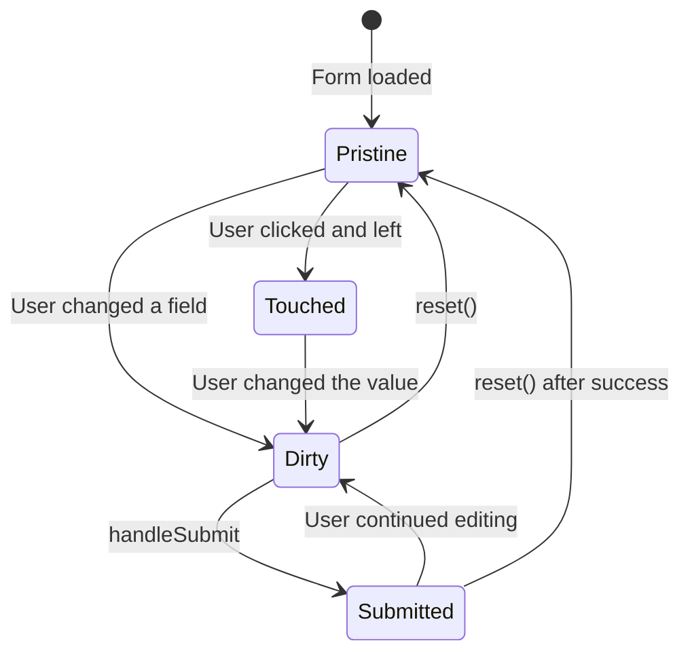
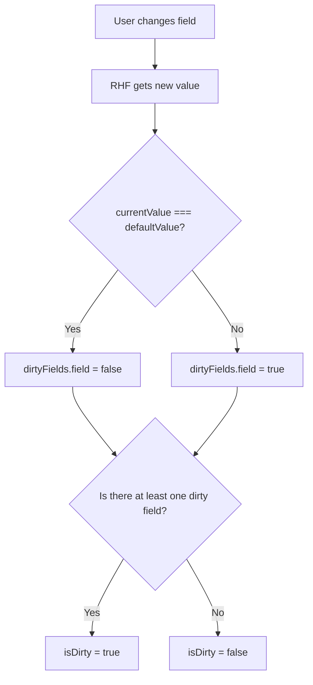
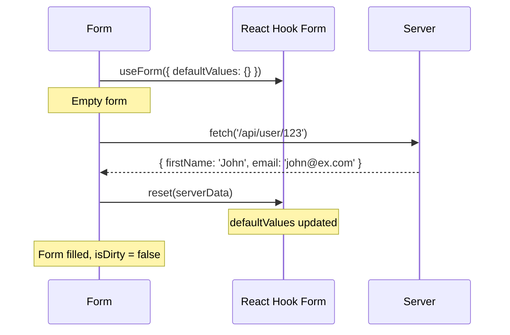
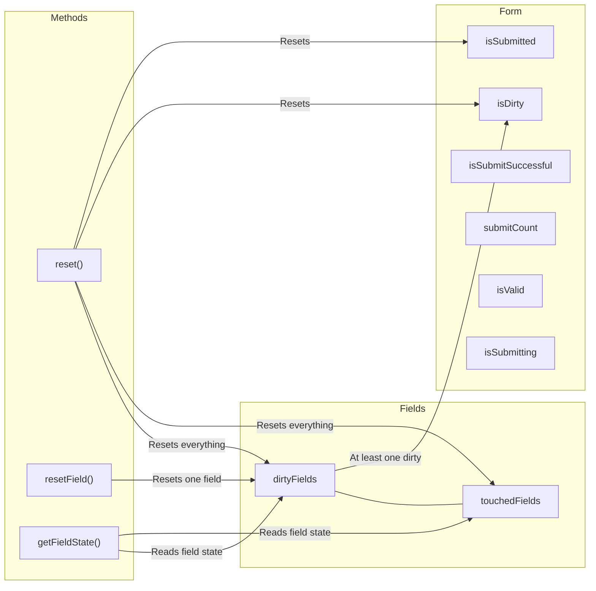

# Level 9: Form State

## Introduction

Every form is more than just a set of input fields. A form has an **interaction history**: which fields the user changed, which they touched, whether the form was submitted, whether submission succeeded. This history is stored in the `formState` object -- a kind of "flight recorder" for the form.

Imagine a paper questionnaire. If a person filled in the "Name" field, then erased it and wrote something else -- you can see this from eraser marks. If they just clicked in the field and walked away without writing anything -- that's also information. In digital forms, these signals are no less important: they determine when to show errors, when to activate the save button, when to warn about unsaved changes.

React Hook Form provides a rich set of form states through `formState`. Understanding dirty, touched, reset, and related methods enables creating forms that adequately respond to user actions -- display changes, reset when needed, and track submission success.



---

## Dirty and Touched States

### What Are Dirty and Touched?

Two key form state concepts -- **dirty** (changed) and **touched** (interacted with). They answer different questions:

- **Dirty** answers: "Does the current value differ from the initial one?"
- **Touched** answers: "Did the user interact with this field?"

Analogy: imagine a store display. If a customer picked up an item, looked at it, and put it back -- the item is **touched** (someone handled it), but not **dirty** (it's back in place). If the customer moved the item to another shelf -- it's both **touched** and **dirty** (it was changed). And if another employee put the item back -- it's no longer dirty, though the touched status remains.

| State | Description | When it changes | Reset on reset? |
| --------- | ------------------- | ------------------------- | ----------------------- |
| `dirty` | Field was changed | On value change | Yes |
| `touched` | Field was interacted with | On focus loss (blur) | Yes |
| `isDirty` | Form was changed | On any field change | Yes |

**Important nuance:** `dirty` is a **comparison with defaultValues**, not with the previous value. If the user changed a field from `"John"` to `"Jane"`, then back to `"John"` -- the field **stops** being dirty, because the current value matches the initial one. It's not just a "was changed" flag -- it's a live comparison.

### Getting State

```tsx
function MyForm() {
  const {
    register,
    formState: {
      dirtyFields,    // Which fields changed
      touchedFields,  // Which fields were touched
      isDirty,        // Form is changed
      isSubmitted,    // Form was submitted
    },
  } = useForm()

  return (
    <form>
      <input {...register('name')} />

      <div>Dirty: {dirtyFields.name ? 'Yes' : 'No'}</div>
      <div>Touched: {touchedFields.name ? 'Yes' : 'No'}</div>
      <div>Form changed: {isDirty ? 'Yes' : 'No'}</div>
    </form>
  )
}
```

### Under the Hood: How RHF Tracks Dirty

React Hook Form uses **deep comparison** of the current field value with its `defaultValue`. Here's a simplified scheme:



This means **without `defaultValues` the dirty system works incorrectly**. If you didn't specify initial values, RHF has nothing to compare against, and `isDirty` behavior becomes unpredictable.

### Practical Application

Dirty and touched states solve one of the main UX problems -- **when to show errors**:

```tsx
// Show error only after field was touched
<input {...register('email', { required: 'Required' })} />
{touchedFields.email && errors.email && (
  <span className="error">{errors.email.message}</span>
)}

// Or show only if field was changed and is invalid
{dirtyFields.email && errors.email && (
  <span className="error">{errors.email.message}</span>
)}
```

**Production error display strategies:**

| Strategy | When we show | Pros | Cons |
|-----------|-----------------|-------|--------|
| After blur (touched) | When user left the field | Doesn't interrupt input | Slow feedback |
| After change (dirty) | When field is changed | Fast feedback | Error before input is complete |
| After submit | Only after submission | Doesn't irritate | Delayed feedback |
| Combined | touched + onChange after first submit | Best UX | More complex to implement |

Most production forms use a **combined strategy**: before the first submit, errors aren't shown, and after submit it switches to `onChange` so the user sees corrections in real time. This is exactly how `mode: 'onTouched'` works in React Hook Form.

---

## getFieldState()

The `getFieldState` method allows getting the state of an individual field: `isDirty`, `isTouched`, and `error`. This is convenient when you need to check a field's state imperatively (e.g., in an event handler or utility function).

If `dirtyFields` and `touchedFields` are a "map of the entire form," then `getFieldState` is a "magnifying glass" focused on a specific field.

```tsx
const { getFieldState, formState } = useForm({
  defaultValues: { email: '', name: '' },
})

// Get field state
const { isDirty, isTouched, invalid, error } = getFieldState('email', formState)

console.log(isDirty)    // true, if field was changed
console.log(isTouched)  // true, if field lost focus
console.log(invalid)    // true, if field is invalid
console.log(error)      // error object or undefined
```

> **Important:** The second argument `formState` is mandatory. Without it, RHF can't track the subscription, and the component won't re-render on changes.

### Why formState Is Required

React Hook Form uses a **Proxy** to optimize re-renders. When you destructure `formState`, the Proxy records which properties you're reading and subscribes the component only to those changes. Without passing `formState` to `getFieldState`, the subscription isn't created:

```tsx
// Wrong -- without formState, component won't update
const { isDirty } = getFieldState('email')

// Correct -- pass formState
const { isDirty } = getFieldState('email', formState)
```

### When getFieldState Is More Useful Than dirtyFields

`getFieldState` is convenient when you need to check a field's state **outside JSX** -- in event handlers, conditional logic, custom hooks:

```tsx
const handleCustomAction = () => {
  const emailState = getFieldState('email', formState)

  if (emailState.isDirty && !emailState.invalid) {
    // Field changed and valid -- can auto-save
    saveToServer({ email: getValues('email') })
  }
}
```

---

## Visual Change Indicators

One of the powerful capabilities of dirty states is **visual feedback**. The user should see which fields they changed, especially in edit forms (profile, settings, admin panel).

```tsx
<input
  {...register('name')}
  style={{
    borderColor: dirtyFields.name
      ? (errors.name ? '#dc3545' : '#28a745')
      : '#ddd',
  }}
/>
```

This logic works like a traffic light:
- Gray border (`#ddd`) -- field hasn't been changed
- Green border (`#28a745`) -- field changed and valid
- Red border (`#dc3545`) -- field changed and invalid

Example with a per-field reset button:

```tsx
<div style={{ display: 'flex', gap: '0.5rem' }}>
  <input {...register('email')} />
  {getFieldState('email', formState).isDirty && (
    <button type="button" onClick={() => resetField('email')}>
      Reset
    </button>
  )}
</div>
```

**Production pattern:** In profile edit forms, an "Unsaved changes" indicator is often added to the form header, along with a warning when attempting to leave the page:

```tsx
const { formState: { isDirty } } = useForm()

// Warn on page unload
useEffect(() => {
  const handleBeforeUnload = (e: BeforeUnloadEvent) => {
    if (isDirty) {
      e.preventDefault()
    }
  }
  window.addEventListener('beforeunload', handleBeforeUnload)
  return () => window.removeEventListener('beforeunload', handleBeforeUnload)
}, [isDirty])
```

---

## Reset and defaultValues

### Setting Default Values

`defaultValues` is the foundation on which the entire form state system is built. They set the **reference point**: RHF compares current values against them to determine dirty status.

```tsx
// On initialization
const { register } = useForm({
  defaultValues: {
    firstName: 'John',
    lastName: 'Doe',
    email: 'john@example.com',
  },
})
```

**Why defaultValues matter so much:**

1. **isDirty** compares current values against defaultValues
2. **reset()** without arguments returns the form to defaultValues
3. **resetField()** returns a specific field to its defaultValue
4. When loading data from the server, defaultValues set the form's initial state

### The reset() Method

`reset` is the form's "time machine." It returns all values and states to the starting point. But its capabilities go beyond simple reset:

```tsx
const { reset } = useForm()

// Reset to default values
reset()

// Reset with new values
reset({
  firstName: 'Jane',
  lastName: 'Smith',
})

// With options
reset(values, {
  keepErrors: false,        // Keep errors
  keepDirty: false,         // Keep dirty state
  keepValues: false,        // Keep values
  keepDefaultValues: false,
  keepIsSubmitted: false,
  keepTouched: false,
  keepIsValid: false,
  keepSubmitCount: false,
})
```

Each `keep*` option controls a specific state aspect that should **not** be reset. This gives granular control. For example, after loading fresh data from the server, you want to update values but preserve information about which fields the user already touched:

```tsx
// Loaded fresh data from server -- update values,
// but preserve touched state
reset(serverData, { keepTouched: true })
```

### Typical Scenario: reset with Server Data



### resetField() -- Resetting a Specific Field

`resetField` allows resetting one specific field without affecting the rest of the form:

```tsx
const { resetField } = useForm({
  defaultValues: { email: 'user@example.com', name: 'John' },
})

// Reset to defaultValue
resetField('email') // email returns to 'user@example.com'

// Reset to a new value
resetField('email', { defaultValue: 'new@example.com' })

// With options -- preserve dirty/touched/error state
resetField('email', {
  keepDirty: true,
  keepTouched: true,
  keepError: true,
  defaultValue: '',
})
```

> **Difference between `reset` and `resetField`:** `reset` resets the entire form and all its states.
> `resetField` works surgically -- resets only the specified field. At the same time, `isValid` and `isDirty`
> of the form will be recalculated considering the new field state.

**Key point with `defaultValue` in `resetField`:** if you pass `defaultValue`, not only the current field value is updated, but also its **baseline** value for comparison. So subsequent calls to `resetField('email')` without arguments will return the field to this new value, not the original one.

---

## isSubmitSuccessful

`isSubmitSuccessful` is a `formState` property that becomes `true` after `onSubmit` completes without errors. This indicator answers the question: "Did the last submission succeed?"

```tsx
const {
  handleSubmit,
  reset,
  formState: { isSubmitSuccessful },
} = useForm()

// Show success message
{isSubmitSuccessful && (
  <div role="status">Form submitted successfully!</div>
)}

// Reset form after successful submission
useEffect(() => {
  if (isSubmitSuccessful) {
    reset()
  }
}, [isSubmitSuccessful, reset])
```

> **Gotcha:** If `onSubmit` throws an exception, `isSubmitSuccessful` remains
> `false`. If you make API requests in `onSubmit`, make sure errors are handled correctly.

### isSubmitSuccessful and Exception Relationship

This is a subtle but critical point. RHF determines "success" by whether the `onSubmit` function threw an exception:

```tsx
// Problem -- unhandled error breaks isSubmitSuccessful
const onSubmit = async (data: FormData) => {
  const response = await fetch('/api/submit', {
    method: 'POST',
    body: JSON.stringify(data),
  })
  // If server returns 500, fetch won't throw,
  // and isSubmitSuccessful will be true even though submission failed!
}

// Correct -- explicit error handling
const onSubmit = async (data: FormData) => {
  const response = await fetch('/api/submit', {
    method: 'POST',
    body: JSON.stringify(data),
  })
  if (!response.ok) {
    throw new Error('Server error')
    // Now isSubmitSuccessful correctly stays false
  }
}
```

### Tracking Changes

The combination of `isDirty` and `reset` enables intuitive controls:

```tsx
const { watch, reset, formState: { isDirty } } = useForm()

// Reset button active only if form is changed
<button type="button" onClick={() => reset()} disabled={!isDirty}>
  Reset
</button>
```

### Complete formState Picture

For understanding how all states relate:



---

## Common Beginner Mistakes

### Mistake 1: Destructuring not from formState

```tsx
// Wrong -- destructuring directly from useForm
const { errors, isDirty, isValid } = useForm()

// Correct -- from formState
const {
  formState: { errors, isDirty, isValid },
} = useForm()
```

**Why this is a mistake:** `formState` is a Proxy object that tracks subscriptions. Direct destructuring breaks this system -- the component won't re-render on state changes.

**Under the hood:** when you write `formState.isDirty`, the Proxy intercepts access to the `isDirty` property and registers a subscription: "This component depends on isDirty, re-render it on change." If you destructure from `useForm()` directly, the Proxy is bypassed, no subscription is created, and the component "doesn't know" the state changed.

Another trap -- **conditional access** to formState properties:

```tsx
// Problem -- isValid is read conditionally, Proxy may not register subscription
return <button disabled={!formState.isDirty || !formState.isValid} />

// Correct -- destructure in advance
const { isDirty, isValid } = formState
return <button disabled={!isDirty || !isValid} />
```

In the conditional expression `!formState.isDirty || !formState.isValid`, if `isDirty` is `false`, JavaScript won't reach `isValid` (short-circuit evaluation), and the Proxy won't register a subscription to `isValid`.

---

### Mistake 2: reset without defaultValues

```tsx
// Wrong -- reset without initial values
const { reset } = useForm()
reset()

// Correct -- with defaultValues
const { reset } = useForm({
  defaultValues: { name: '', email: '' },
})
reset()
```

**Why this is a mistake:** Without `defaultValues`, the form doesn't know what values to reset to. Additionally, `isDirty` won't work correctly without baseline values for comparison.

**Typical production bug:** a developer creates a profile edit form, loads data from the server via `setValue` instead of `defaultValues` or `reset`. The user changes nothing and clicks "Save" -- `isDirty` shows `true`, because current values (set via `setValue`) differ from empty defaultValues. As a result, an unnecessary request goes to the server, and "unsaved changes" protection falsely triggers when leaving the page.

```tsx
// Wrong -- setting values via setValue
const { setValue } = useForm()

useEffect(() => {
  const data = await fetchUser()
  setValue('name', data.name)
  setValue('email', data.email)
  // isDirty = true, even though user changed nothing!
}, [])

// Correct -- via reset, which updates defaultValues
const { reset } = useForm()

useEffect(() => {
  const data = await fetchUser()
  reset(data)
  // isDirty = false, defaultValues updated
}, [])
```

---

### Mistake 3: Ignoring touchedFields

```tsx
// Wrong -- show error immediately
{errors.email && <span className="error">{errors.email.message}</span>}

// Correct -- after touch
{touchedFields.email && errors.email && (
  <span className="error">{errors.email.message}</span>
)}
```

**Why this is a mistake:** The user sees an error before finishing input, which worsens UX. Especially noticeable with `mode: 'onChange'` -- the "Email is required" error appears when the user just clicked in the field and hasn't typed anything yet.

UX research shows that premature validation errors **increase form completion time by 22%** and raise abandonment rates. The user feels the form is "yelling" at them before they've even started typing.

---

### Mistake 4: getFieldState without formState

```tsx
// Wrong -- without formState component won't update
const { isDirty } = getFieldState('email')

// Correct -- pass formState
const { isDirty } = getFieldState('email', formState)
```

**Why this is a mistake:** Without the second argument, RHF can't create a subscription to changes, and `isDirty`/`isTouched` will always have initial values. The component reads the state once on mount and never updates.

---

### Mistake 5: Resetting form not in useEffect after isSubmitSuccessful

```tsx
// Wrong -- calling reset inside onSubmit
const onSubmit = (data: FormData) => {
  sendToServer(data)
  reset() // Works, but isSubmitSuccessful won't have time to update
}

// Correct -- via useEffect
useEffect(() => {
  if (isSubmitSuccessful) {
    reset()
  }
}, [isSubmitSuccessful, reset])
```

**Why this is a mistake:** Calling `reset()` inside `onSubmit` resets the form before `formState` updates `isSubmitSuccessful`. This can lead to a race condition -- the success message flashes and disappears, or doesn't appear at all. The recommended pattern is to react to `isSubmitSuccessful` in `useEffect`.

---

## Additional Resources

- [formState documentation](https://react-hook-form.com/docs/useform/formstate)
- [reset documentation](https://react-hook-form.com/docs/useform/reset)
- [resetField documentation](https://react-hook-form.com/docs/useform/resetfield)
- [getFieldState documentation](https://react-hook-form.com/docs/useform/getfieldstate)
