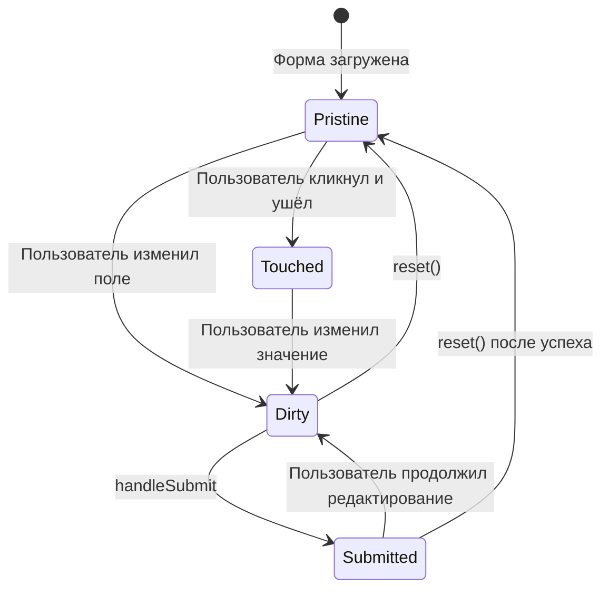
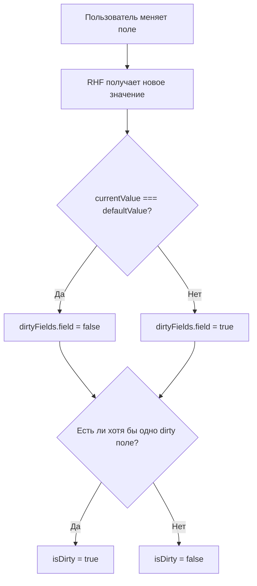
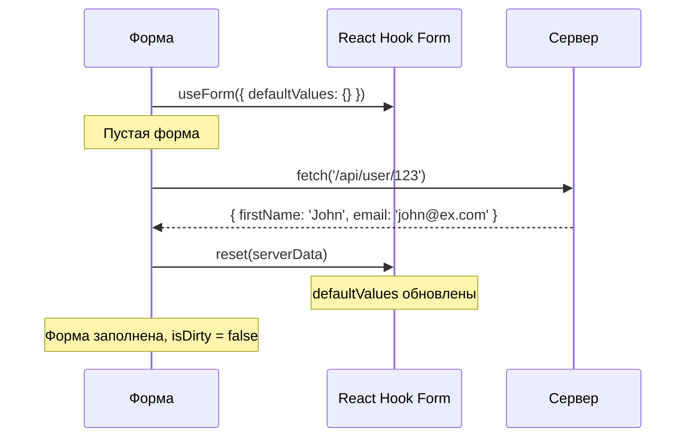
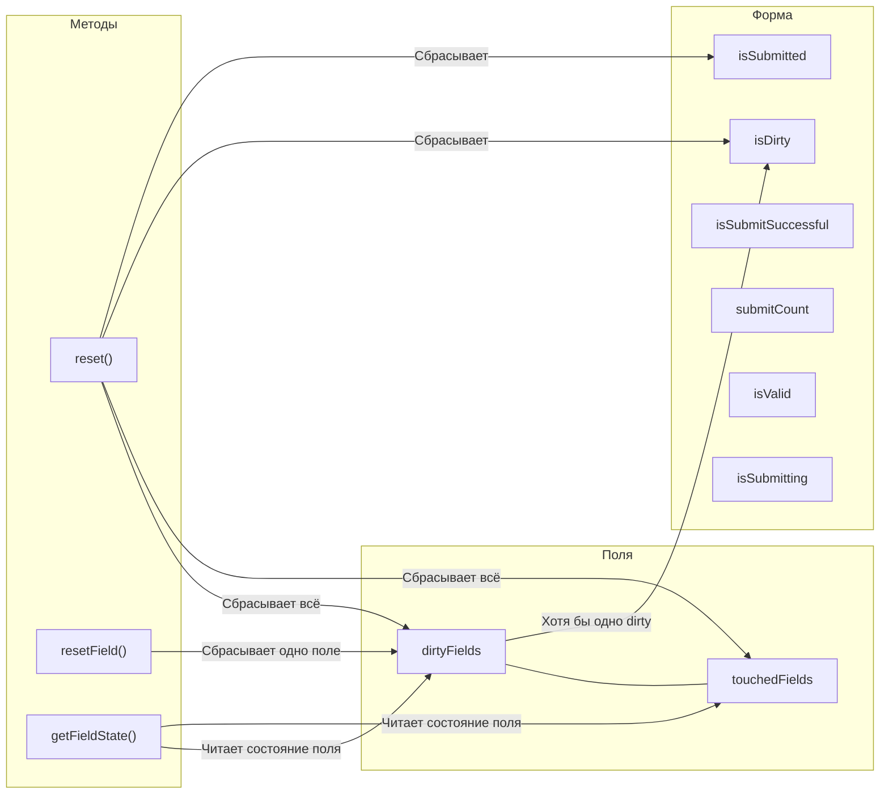

# Уровень 9: Состояние формы

## Введение

Каждая форма -- это не просто набор полей ввода. У формы есть **история взаимодействия**: какие поля пользователь менял, к каким прикасался, была ли форма отправлена, успешно ли прошла отправка. Эта история хранится в объекте `formState` -- своего рода «бортовом самописце» формы.

Представьте анкету на бумаге. Если человек заполнил поле «Имя», а потом стёр написанное и вписал другое -- вы можете это увидеть по следам ластика. Если он просто кликнул в поле и ушёл дальше, не написав ничего -- это тоже информация. В цифровых формах эти сигналы не менее важны: они определяют, когда показывать ошибки, когда активировать кнопку сохранения, когда предупреждать о несохранённых изменениях.

React Hook Form предоставляет богатый набор состояний формы через `formState`. Понимание dirty, touched, reset и связанных методов позволяет создавать формы, которые адекватно реагируют на действия пользователя -- показывают изменения, сбрасываются при необходимости и отслеживают успешность отправки.



---

## Dirty и Touched состояния

### Что такое Dirty и Touched?

Два ключевых понятия состояния формы -- **dirty** (изменено) и **touched** (затронуто). Они отвечают на разные вопросы:

- **Dirty** отвечает на вопрос: «Отличается ли текущее значение от начального?»
- **Touched** отвечает на вопрос: «Взаимодействовал ли пользователь с этим полем?»

Аналогия: представьте витрину магазина. Если покупатель взял товар с полки, посмотрел и поставил обратно -- товар **touched** (его трогали), но не **dirty** (он на месте). Если покупатель переставил товар на другую полку -- товар и **touched**, и **dirty** (его изменили). А если другой сотрудник вернул товар на место -- он снова не dirty, хотя touched-статус остаётся.

| Состояние | Описание | Когда меняется | Сбрасывается при reset? |
| --------- | ------------------- | ------------------------- | ----------------------- |
| `dirty` | Поле было изменено | При изменении значения | ✅ Да |
| `touched` | Поле было затронуто | При потере фокуса (blur) | ✅ Да |
| `isDirty` | Форма была изменена | При изменении любого поля | ✅ Да |

📌 **Важный нюанс:** `dirty` -- это **сравнение с defaultValues**, а не с предыдущим значением. Если пользователь изменил поле с `"John"` на `"Jane"`, а затем обратно на `"John"` -- поле **перестанет** быть dirty, потому что текущее значение совпало с начальным. Это не просто флаг «было изменение» -- это живое сравнение.

### Получение состояния

```tsx
function MyForm() {
  const {
    register,
    formState: {
      dirtyFields, // Какие поля изменены
      touchedFields, // Какие поля затронуты
      isDirty, // Форма изменена
      isSubmitted, // Форма отправлена
    },
  } = useForm()

  return (
    <form>
      <input {...register('name')} />

      <div>Dirty: {dirtyFields.name ? '✅' : '❌'}</div>
      <div>Touched: {touchedFields.name ? '✅' : '❌'}</div>
      <div>Форма изменена: {isDirty ? 'Да' : 'Нет'}</div>
    </form>
  )
}
```

### Под капотом: как RHF отслеживает dirty

React Hook Form использует **глубокое сравнение** (deep equal) текущего значения поля с его `defaultValue`. Вот упрощённая схема:



Это значит, что **без `defaultValues` система dirty работает некорректно**. Если вы не указали начальные значения, RHF не с чем сравнивать, и поведение `isDirty` становится непредсказуемым.

### Практическое применение

Dirty и touched состояния решают одну из главных проблем UX -- **когда показывать ошибки**:

```tsx
// Показывать ошибку только после того, как поле затронуто
<input {...register('email', { required: 'Обязательно' })} />
{touchedFields.email && errors.email && (
  <span className="error">{errors.email.message}</span>
)}

// Или показывать только если поле изменено и невалидно
{dirtyFields.email && errors.email && (
  <span className="error">{errors.email.message}</span>
)}
```

💡 **Стратегии показа ошибок в продакшене:**

| Стратегия | Когда показываем | Плюсы | Минусы |
|-----------|-----------------|-------|--------|
| После blur (touched) | Когда пользователь покинул поле | Не мешает вводу | Медленная обратная связь |
| После изменения (dirty) | Когда поле изменено | Быстрая обратная связь | Ошибка до завершения ввода |
| После submit | Только после отправки | Не раздражает | Запоздалая обратная связь |
| Комбинированная | touched + onChange после первого submit | Лучший UX | Сложнее реализовать |

В большинстве продакшн-форм используется **комбинированная стратегия**: до первого submit ошибки не показываются, а после submit переключается на `onChange`, чтобы пользователь видел исправления в реальном времени. Именно так работает `mode: 'onTouched'` в React Hook Form.

---

## getFieldState()

Метод `getFieldState` позволяет получить состояние отдельного поля: `isDirty`, `isTouched` и `error`. Это удобно, когда нужно проверить состояние поля императивно (например, в обработчике событий или в утилитарной функции).

Если `dirtyFields` и `touchedFields` -- это «карта всей формы», то `getFieldState` -- это «лупа», наведённая на конкретное поле.

```tsx
const { getFieldState, formState } = useForm({
  defaultValues: { email: '', name: '' },
})

// Получить состояние поля
const { isDirty, isTouched, invalid, error } = getFieldState('email', formState)

console.log(isDirty) // true, если поле было изменено
console.log(isTouched) // true, если поле потеряло фокус
console.log(invalid) // true, если поле невалидно
console.log(error) // объект ошибки или undefined
```

> ⚠️ **Важно:** Второй аргумент `formState` обязателен. Без него RHF не сможет отследить подписку на состояние, и компонент не будет ререндериться при изменениях.

### Почему formState обязателен

React Hook Form использует **Proxy** для оптимизации ререндеров. Когда вы деструктурируете `formState`, Proxy регистрирует, какие свойства вы читаете, и подписывает компонент только на эти изменения. Без передачи `formState` в `getFieldState` подписка не создаётся:

```tsx
// ❌ Неправильно -- без formState компонент не обновится
const { isDirty } = getFieldState('email')

// ✅ Правильно -- передаём formState
const { isDirty } = getFieldState('email', formState)
```

### Когда getFieldState полезнее dirtyFields

`getFieldState` удобен, когда вам нужно проверить состояние поля **вне JSX** -- в обработчиках событий, в условной логике, в кастомных хуках:

```tsx
const handleCustomAction = () => {
  const emailState = getFieldState('email', formState)

  if (emailState.isDirty && !emailState.invalid) {
    // Поле изменено и валидно -- можно выполнить автосохранение
    saveToServer({ email: getValues('email') })
  }
}
```

---

## Визуальные индикаторы изменений

Одна из мощных возможностей dirty-состояний -- **визуальная обратная связь**. Пользователь должен видеть, какие поля он изменил, особенно в формах редактирования (профиль, настройки, админ-панель).

```tsx
<input
  {...register('name')}
  style={{
    borderColor: dirtyFields.name
      ? (errors.name ? '#dc3545' : '#28a745')
      : '#ddd',
  }}
/>
```

Эта логика работает как светофор:
- Серая рамка (`#ddd`) -- поле не менялось
- Зелёная рамка (`#28a745`) -- поле изменено и валидно
- Красная рамка (`#dc3545`) -- поле изменено и невалидно

Пример с кнопкой сброса отдельного поля:

```tsx
<div style={{ display: 'flex', gap: '0.5rem' }}>
  <input {...register('email')} />
  {getFieldState('email', formState).isDirty && (
    <button type="button" onClick={() => resetField('email')}>
      Сбросить
    </button>
  )}
</div>
```

💡 **Продакшн-паттерн:** В формах редактирования профиля часто добавляют индикатор «Есть несохранённые изменения» в шапку формы и предупреждение при попытке уйти со страницы:

```tsx
const { formState: { isDirty } } = useForm()

// Предупреждение при уходе со страницы
useEffect(() => {
  const handleBeforeUnload = (e: BeforeUnloadEvent) => {
    if (isDirty) {
      e.preventDefault()
    }
  }
  window.addEventListener('beforeunload', handleBeforeUnload)
  return () => window.removeEventListener('beforeunload', handleBeforeUnload)
}, [isDirty])
```

---

## Reset и defaultValues

### Установка default values

`defaultValues` -- это фундамент, на котором строится вся система состояний формы. Они задают **точку отсчёта**: именно с ними RHF сравнивает текущие значения для определения dirty-статуса.

```tsx
// При инициализации
const { register } = useForm({
  defaultValues: {
    firstName: 'John',
    lastName: 'Doe',
    email: 'john@example.com',
  },
})
```

📌 **Почему defaultValues так важны:**

1. **isDirty** сравнивает текущие значения именно с defaultValues
2. **reset()** без аргументов возвращает форму к defaultValues
3. **resetField()** возвращает конкретное поле к его defaultValue
4. При серверной загрузке данных defaultValues задают начальное состояние формы

### Метод reset()

`reset` -- это «машина времени» формы. Он возвращает все значения и состояния к начальной точке. Но его возможности значительно шире простого сброса:

```tsx
const { reset } = useForm()

// Сброс к default values
reset()

// Сброс с новыми значениями
reset({
  firstName: 'Jane',
  lastName: 'Smith',
})

// С опциями
reset(values, {
  keepErrors: false, // Сохранить ошибки
  keepDirty: false, // Сохранить dirty состояние
  keepValues: false, // Сохранить значения
  keepDefaultValues: false,
  keepIsSubmitted: false,
  keepTouched: false,
  keepIsValid: false,
  keepSubmitCount: false,
})
```

Каждая опция `keep*` отвечает за конкретный аспект состояния, который **не** должен сбрасываться. Это даёт гранулярный контроль. Например, после загрузки свежих данных с сервера вы хотите обновить значения, но сохранить информацию о том, какие поля пользователь уже трогал:

```tsx
// Загрузили свежие данные с сервера -- обновляем значения,
// но сохраняем touched-состояние
reset(serverData, { keepTouched: true })
```

### Типичный сценарий: reset с серверными данными



### resetField() -- сброс конкретного поля

`resetField` позволяет сбросить одно конкретное поле, не затрагивая остальную форму:

```tsx
const { resetField } = useForm({
  defaultValues: { email: 'user@example.com', name: 'John' },
})

// Сброс к defaultValue
resetField('email') // email вернётся к 'user@example.com'

// Сброс к новому значению
resetField('email', { defaultValue: 'new@example.com' })

// С опциями -- сохранить dirty/touched/error состояние
resetField('email', {
  keepDirty: true,
  keepTouched: true,
  keepError: true,
  defaultValue: '',
})
```

> 📌 **Разница между `reset` и `resetField`:** `reset` сбрасывает всю форму и все её состояния.
> `resetField` работает точечно -- сбрасывает только указанное поле. При этом `isValid` и `isDirty`
> формы будут пересчитаны с учётом нового состояния поля.

🔥 **Ключевой момент с `defaultValue` в `resetField`:** если вы передаёте `defaultValue`, обновляется не только текущее значение поля, но и его **базовое** значение для сравнения. То есть последующие вызовы `resetField('email')` без аргументов вернут поле к этому новому значению, а не к изначальному.

---

## isSubmitSuccessful

`isSubmitSuccessful` -- свойство `formState`, которое становится `true` после того, как `onSubmit` выполнился без ошибок. Это индикатор, который отвечает на вопрос: «Последняя отправка прошла успешно?»

```tsx
const {
  handleSubmit,
  reset,
  formState: { isSubmitSuccessful },
} = useForm()

// Показать сообщение об успехе
{isSubmitSuccessful && (
  <div role="status">Форма успешно отправлена!</div>
)}

// Сброс формы после успешной отправки
useEffect(() => {
  if (isSubmitSuccessful) {
    reset()
  }
}, [isSubmitSuccessful, reset])
```

> ⚠️ **Подводный камень:** Если `onSubmit` выбросит исключение, `isSubmitSuccessful` останется
> `false`. Если вы делаете API-запросы в `onSubmit`, убедитесь что ошибки обрабатываются корректно.

### Связь isSubmitSuccessful с исключениями

Это тонкий, но критически важный момент. RHF определяет «успешность» по тому, выбросила ли функция `onSubmit` исключение:

```tsx
// ❌ Проблема -- необработанная ошибка сломает isSubmitSuccessful
const onSubmit = async (data: FormData) => {
  const response = await fetch('/api/submit', {
    method: 'POST',
    body: JSON.stringify(data),
  })
  // Если сервер вернул 500, fetch не выбросит исключение,
  // и isSubmitSuccessful будет true, хотя отправка не удалась!
}

// ✅ Правильно -- явная обработка ошибок
const onSubmit = async (data: FormData) => {
  const response = await fetch('/api/submit', {
    method: 'POST',
    body: JSON.stringify(data),
  })
  if (!response.ok) {
    throw new Error('Ошибка сервера')
    // Теперь isSubmitSuccessful корректно останется false
  }
}
```

### Отслеживание изменений

Комбинация `isDirty` и `reset` позволяет создавать интуитивные контролы:

```tsx
const { watch, reset, formState: { isDirty } } = useForm()

// Кнопка сброса активна только если форма изменена
<button type="button" onClick={() => reset()} disabled={!isDirty}>
  Сбросить
</button>
```

### Полная картина состояний formState

Для понимания того, как все состояния связаны между собой:



---

## ⚠️ Частые ошибки новичков

### ❌ Ошибка 1: Деструктуризация не из formState

```tsx
// ❌ Неправильно -- деструктуризация напрямую из useForm
const { errors, isDirty, isValid } = useForm()

// ✅ Правильно -- из formState
const {
  formState: { errors, isDirty, isValid },
} = useForm()
```

**Почему это ошибка:** `formState` -- это Proxy-объект, который отслеживает подписки. Прямая деструктуризация ломает эту систему -- компонент не будет ререндериться при изменении состояния.

💡 **Под капотом:** когда вы пишете `formState.isDirty`, Proxy перехватывает обращение к свойству `isDirty` и регистрирует подписку: «Этот компонент зависит от isDirty, ререндерить его при изменении». Если вы деструктурируете из `useForm()` напрямую, Proxy обходится, подписка не создаётся, и компонент «не знает», что состояние изменилось.

Ещё одна ловушка -- **условный доступ** к свойствам formState:

```tsx
// ❌ Проблема -- isValid читается условно, Proxy может не создать подписку
return <button disabled={!formState.isDirty || !formState.isValid} />

// ✅ Правильно -- деструктурируйте заранее
const { isDirty, isValid } = formState
return <button disabled={!isDirty || !isValid} />
```

При условном выражении `!formState.isDirty || !formState.isValid`, если `isDirty` равно `false`, JavaScript не дойдёт до `isValid` (short-circuit evaluation), и Proxy не зарегистрирует подписку на `isValid`.

---

### ❌ Ошибка 2: reset без defaultValues

```tsx
// ❌ Неправильно -- reset без начальных значений
const { reset } = useForm()
reset()

// ✅ Правильно -- с defaultValues
const { reset } = useForm({
  defaultValues: { name: '', email: '' },
})
reset()
```

**Почему это ошибка:** Без `defaultValues` форма не знает, к каким значениям сбрасывать. Кроме того, `isDirty` не будет корректно работать без базовых значений для сравнения.

🐛 **Типичный баг в продакшене:** разработчик создаёт форму редактирования профиля, загружает данные с сервера через `setValue` вместо `defaultValues` или `reset`. Пользователь ничего не меняет и нажимает «Сохранить» -- `isDirty` показывает `true`, потому что текущие значения (установленные через `setValue`) отличаются от пустых defaultValues. В результате на сервер уходит лишний запрос, а «защита от несохранённых изменений» ложно срабатывает при попытке покинуть страницу.

```tsx
// ❌ Неправильно -- установка значений через setValue
const { setValue } = useForm()

useEffect(() => {
  const data = await fetchUser()
  setValue('name', data.name)
  setValue('email', data.email)
  // isDirty = true, хотя пользователь ничего не менял!
}, [])

// ✅ Правильно -- через reset, который обновляет defaultValues
const { reset } = useForm()

useEffect(() => {
  const data = await fetchUser()
  reset(data)
  // isDirty = false, defaultValues обновлены
}, [])
```

---

### ❌ Ошибка 3: Игнорирование touchedFields

```tsx
// ❌ Неправильно -- показывать ошибку сразу
{errors.email && <span className="error">{errors.email.message}</span>}

// ✅ Правильно -- после касания
{touchedFields.email && errors.email && (
  <span className="error">{errors.email.message}</span>
)}
```

**Почему это ошибка:** Пользователь видит ошибку до того, как закончил ввод, что ухудшает UX. Особенно заметно при `mode: 'onChange'` -- ошибка «Email обязателен» появляется, когда пользователь только кликнул в поле и ещё ничего не набрал.

Исследования UX показывают, что преждевременные ошибки валидации **увеличивают время заполнения формы на 22%** и повышают процент отказов. Пользователь чувствует, что форма «ругается» на него, хотя он ещё даже не начал вводить данные.

---

### ❌ Ошибка 4: getFieldState без formState

```tsx
// ❌ Неправильно -- без formState компонент не обновится
const { isDirty } = getFieldState('email')

// ✅ Правильно -- передаём formState
const { isDirty } = getFieldState('email', formState)
```

**Почему это ошибка:** Без второго аргумента RHF не может создать подписку на изменения, и `isDirty`/`isTouched` всегда будут иметь начальные значения. Компонент прочитает состояние один раз при монтировании и больше не обновится.

---

### ❌ Ошибка 5: Сброс формы не в useEffect после isSubmitSuccessful

```tsx
// ❌ Неправильно -- вызов reset внутри onSubmit
const onSubmit = (data: FormData) => {
  sendToServer(data)
  reset() // Работает, но isSubmitSuccessful не успеет обновиться
}

// ✅ Правильно -- через useEffect
useEffect(() => {
  if (isSubmitSuccessful) {
    reset()
  }
}, [isSubmitSuccessful, reset])
```

**Почему это ошибка:** Вызов `reset()` внутри `onSubmit` сбрасывает форму до того, как `formState` обновит `isSubmitSuccessful`. Это может привести к гонке состояний -- success-сообщение мелькнёт и исчезнет, или не появится вовсе. Рекомендуемый паттерн -- реагировать на `isSubmitSuccessful` в `useEffect`.

---

## 📚 Дополнительные ресурсы

- [formState документация](https://react-hook-form.com/docs/useform/formstate)
- [reset документация](https://react-hook-form.com/docs/useform/reset)
- [resetField документация](https://react-hook-form.com/docs/useform/resetfield)
- [getFieldState документация](https://react-hook-form.com/docs/useform/getfieldstate)
