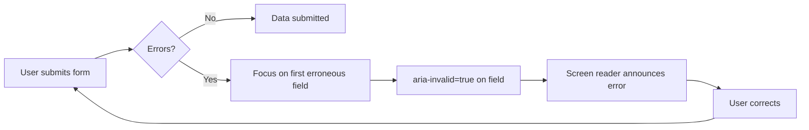
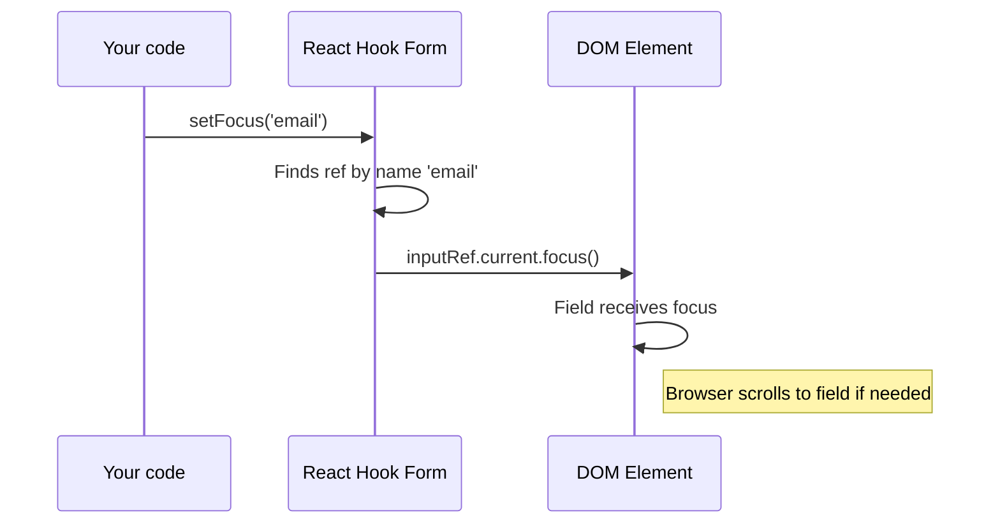
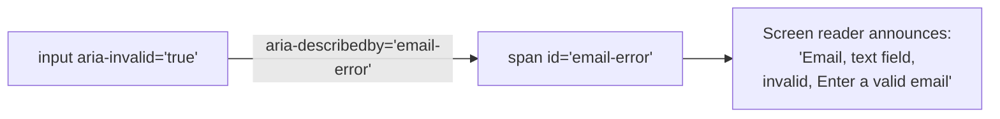

# Level 10: Focus and Accessibility

## Introduction

Imagine filling out a long form on a bank's website -- 15 fields, you click "Submit," and somewhere something failed validation. The screen stays in place, a red message flashes at the top, but you don't understand -- **where exactly is the error?** You start scrolling up and down, re-reading fields, searching for a red border. Frustrating? Absolutely.

Now imagine that after clicking "Submit," the cursor **jumps itself** to the first erroneous field, the text in it is selected, and a screen reader announces: "Email field invalid. Error: enter a valid email." A completely different experience.

Focus management and accessibility (a11y) aren't "bonus features for a checklist." They're critically important UX aspects that directly impact form conversion rates. According to WebAIM, over 96% of major sites have accessibility issues, and forms are one of the most problematic areas. React Hook Form provides tools that make proper focus and a11y implementation no harder than regular validation.



---

## Focus Management: setFocus

### Why Focus Management Is Needed

On validation error, the user should immediately understand where the problem is. Automatic focus on the first erroneous field significantly improves UX.

But focus isn't only needed for errors. Here are typical production scenarios:

- **Form opened** -- cursor is already in the first field, ready to type
- **Validation error on submit** -- focus jumps to the problematic field
- **Modal with form** -- focus should land inside the modal, not "wander" on the page behind it
- **Wizard / multi-step form** -- when moving to the next step, focus moves to the first field of the new step
- **Server error** -- API returned "email already taken," need to focus the email field

Without focus management, a user on a long form might not notice an error at all -- especially on mobile devices where the screen is small and scrolling is extensive.

### setFocus -- Programmatic Focus Setting

RHF provides the `setFocus` method for programmatically focusing a field by name. This is more convenient than working with the DOM directly, because RHF already knows about all registered fields.

```tsx
import { useEffect } from 'react'
import { useForm } from 'react-hook-form'

function MyForm() {
  const {
    register,
    handleSubmit,
    setFocus,
    formState: { errors },
  } = useForm()

  // Focus first field on mount
  useEffect(() => {
    setFocus('email')
  }, [setFocus])

  // Focus first error field after failed submit
  const onInvalid = (errors) => {
    const firstError = Object.keys(errors)[0]
    if (firstError) setFocus(firstError)
  }

  return (
    <form onSubmit={handleSubmit(onSubmit, onInvalid)}>
      <input {...register('email', { required: 'Required' })} />
      {errors.email && <span className="error">{errors.email.message}</span>}

      <input {...register('password', { required: 'Required' })} />
      {errors.password && <span className="error">{errors.password.message}</span>}

      <button type="submit">Submit</button>
    </form>
  )
}
```

### How setFocus Works Under the Hood

When you call `register('email')`, RHF saves a `ref` to the field's DOM element in its internal store. The `setFocus` method simply finds this `ref` by field name and calls the native `.focus()` method on the DOM element:



**Important:** `setFocus` works **only** with fields registered via `register` with `ref` passed. If you register a field without `ref` (e.g., `register('test')` without binding to a DOM element), focus won't work. The focus order with `shouldFocusError` is determined by the **order of `register` calls**, not by DOM element order.

---

## shouldFocusError

RHF has a built-in option for automatic focus on the first erroneous field. It's enabled by default -- meaning that in most cases you **don't need** to write custom focus logic manually.

```tsx
// Enabled by default
const { register } = useForm({
  shouldFocusError: true,
})

// Disable (if you want manual focus control)
const { register } = useForm({
  shouldFocusError: false,
})
```

### When shouldFocusError Is Enough vs When setFocus Is Needed

| Scenario | shouldFocusError | setFocus |
|----------|:---:|:---:|
| Focus on first error field on submit | Yes | Not needed |
| Focus first field on mount | No | Yes |
| Focus specific field conditionally | No | Yes |
| Focus after server error (setError) | No | Yes |
| Focus with text selection (shouldSelect) | No | Yes |
| Focus in wizard on step change | No | Yes |

**When to disable:** If you use custom focus logic (e.g., scroll to error) or fields through `Controller`, where automatic focus may not work.

**Tip:** start with `shouldFocusError: true` (default). Move to `setFocus` only when standard behavior is insufficient.

---

## setFocus Options

`setFocus` accepts a second argument -- an options object with `shouldSelect`:

```tsx
// Just focus
setFocus('email')

// Focus + select text in field
setFocus('email', { shouldSelect: true })
```

The difference between these two in practice:

- **Without `shouldSelect`** -- cursor is placed at the end of the text. The user sees the erroneous field and can start correcting, but if they want to replace all text, they need to select it manually (Ctrl+A).
- **With `shouldSelect: true`** -- all text in the field is selected. The user can immediately start typing, and the old text will be replaced. This is more convenient for fields where the entire value likely needs to be rewritten (email with a typo, wrong phone number).

**Important:** `setFocus` only works with fields registered via `register`. For `Controller` fields, focus depends on the component's implementation.

### Custom Hook for Error Focus

When `shouldFocusError` isn't enough (e.g., you want to focus a field not only on submit but also on real-time error changes), it's useful to extract the logic into a separate hook:

```tsx
import { useEffect } from 'react'
import { UseFormSetFocus, FieldErrors, FieldValues } from 'react-hook-form'

function useFocusOnError<T extends FieldValues>(
  errors: FieldErrors<T>,
  setFocus: UseFormSetFocus<T>
) {
  useEffect(() => {
    const firstError = Object.keys(errors)[0] as keyof T
    if (firstError) {
      setFocus(firstError as any)
    }
  }, [errors, setFocus])
}

// Usage
function MyForm() {
  const {
    setFocus,
    formState: { errors },
  } = useForm()
  useFocusOnError(errors, setFocus)
  // ...
}
```

This hook reacts to **any** change in the `errors` object. If you use `mode: 'onChange'` or `mode: 'onBlur'`, focus will jump to the first erroneous field on every error list change -- not only on submit.

### setError + shouldFocus -- Focus on Server Errors

Worth mentioning: the combination of `setError` with the `shouldFocus` option. When the server returns a validation error (e.g., "email already registered"), you can programmatically set an error **and** focus the field in one call:

```tsx
const onSubmit = async (data: FormData) => {
  try {
    await api.register(data)
  } catch (error) {
    if (error.field === 'email') {
      setError('email', {
        type: 'server',
        message: 'This email is already registered',
      }, { shouldFocus: true }) // Focus on email field
    }
  }
}
```

This eliminates the need to call `setError` and `setFocus` separately.

---

## Accessibility (a11y): ARIA Attributes

### Why Form Accessibility Isn't Optional

Accessibility isn't just about people with disabilities. Here's who benefits from proper a11y:

- **Screen reader users** (blind and visually impaired) -- about 2% of internet users
- **People with motor impairments** -- keyboard-only navigation, no mouse
- **People with temporary limitations** -- broken arm, bright sun on screen, noisy environment
- **Power users** -- developers and experienced users who prefer keyboard
- **Search engines** -- semantic markup helps SEO
- **Automated tests** -- ARIA attributes serve as reliable selectors

In some jurisdictions (EU, US, Canada), web application accessibility is a **legal requirement**. Companies receive real fines and lawsuits for inaccessible forms.

### Main Form ARIA Attributes

| Attribute            | Description                      | Example                           |
| ------------------ | ----------------------------- | -------------------------------- |
| `aria-label`       | Form text label         | `aria-label="Login form"`       |
| `aria-invalid`     | Field is invalid                | `aria-invalid={!!errors.email}`  |
| `aria-describedby` | Link to error description      | `aria-describedby="email-error"` |
| `aria-live`        | Real-time updates | `aria-live="polite"`             |
| `role="alert"`     | Important message              | `role="alert"`                   |
| `noValidate`       | Disable native validation  | `<form noValidate>`              |

### aria-invalid and aria-describedby

These two attributes work in tandem -- `aria-invalid` tells the screen reader the field is invalid, while `aria-describedby` points to where to find the error text. Without this pairing, the screen reader sees a red border but **doesn't know** the field contains an error and **can't** read the error text.



Here's how to implement it with RHF:

```tsx
<label htmlFor="email">Email</label>
<input
  id="email"
  type="email"
  {...register('email', { required: 'Required' })}
  aria-invalid={!!errors.email}
  aria-describedby={errors.email ? 'email-error' : undefined}
/>

{errors.email && (
  <span id="email-error" className="error" role="alert" aria-live="polite">
    {errors.email.message}
  </span>
)}
```

Breakdown by element:

- **`aria-invalid={!!errors.email}`** -- boolean that becomes `true` when the field has an error. Screen reader announces the field as "invalid"
- **`aria-describedby="email-error"`** -- link to the `id` of the element with error text. Set only when there's an error, so it doesn't point to a nonexistent element
- **`role="alert"`** -- tells the screen reader the element's content is an important message to announce immediately
- **`aria-live="polite"`** -- on content update, the screen reader waits for a pause and reads the new text

**Note:** `aria-describedby` is set to `undefined` (not an empty string) when there's no error. An empty string `aria-describedby=""` is an invalid value that may cause unpredictable screen reader behavior.

### role="alert" and aria-live

These two mechanisms handle **dynamic notifications** -- when content changes after initial page load, the screen reader should know about it.

- **`aria-live="assertive"`** -- screen reader **interrupts** current announcement and immediately reads the update. Use for critical errors (general "Fix errors in form" message)
- **`aria-live="polite"`** -- screen reader **waits** for a pause and reads the update. Use for individual field errors
- **`role="alert"`** -- implicitly implies `aria-live="assertive"`. Can be used instead of explicitly specifying `aria-live`

```tsx
function AccessibleForm() {
  const {
    register,
    handleSubmit,
    formState: { errors, isSubmitted },
  } = useForm()

  return (
    <form onSubmit={handleSubmit(onSubmit)} aria-label="Registration form" noValidate>
      {/* General error message */}
      {isSubmitted && Object.keys(errors).length > 0 && (
        <div role="alert" aria-live="assertive" style={{ color: '#dc3545' }}>
          Please fix the errors in the form
        </div>
      )}

      <label htmlFor="email">Email</label>
      <input
        id="email"
        type="email"
        {...register('email', { required: 'Required' })}
        aria-invalid={!!errors.email}
        aria-describedby={errors.email ? 'email-error' : undefined}
      />
      {errors.email && (
        <span id="email-error" className="error" role="alert" aria-live="polite">
          {errors.email.message}
        </span>
      )}

      <button type="submit">Submit</button>
    </form>
  )
}
```

**Tip:** Use `aria-live="assertive"` for critical errors (general message) and `aria-live="polite"` for individual field errors.

### Accessible Form Checklist

Use this checklist when reviewing production forms:

| # | Requirement | How to check |
|---|-----------|--------------|
| 1 | Every field has a `<label>` with `htmlFor` | Clicking label focuses field |
| 2 | `<form>` has `aria-label` or `aria-labelledby` | Screen reader announces form name |
| 3 | Erroneous fields have `aria-invalid="true"` | Tab to field -- screen reader says "invalid" |
| 4 | Errors linked via `aria-describedby` | Screen reader reads error text on focus |
| 5 | Error messages have `role="alert"` | Screen reader announces error appearance |
| 6 | `<form noValidate>` disables browser validation | No browser popup hints |
| 7 | All interactive elements are keyboard-accessible | Tab goes through all fields and buttons |
| 8 | Visible focus indicator (focus ring) | Tab shows which element is active |

---

## Keyboard Navigation

### Moving Between Fields via Enter

By default, pressing Enter in a text field **submits the form** (if there's a submit button). Sometimes you want different behavior -- Enter moves focus to the next field, like in desktop applications.

```tsx
<input
  {...register('name')}
  onKeyDown={(e) => {
    if (e.key === 'Enter') {
      e.preventDefault()
      document.getElementById('email')?.focus()
    }
  }}
/>
<input id="email" {...register('email')} />
```

**Warning:** intercepting Enter can confuse users accustomed to Enter submitting the form. Use this pattern consciously and only where UX requirements justify it (e.g., paper data entry forms, POS systems).

### Universal Keyboard Navigation Hook

For a form with many fields, you can write a hook that automates Enter navigation:

```tsx
function useEnterNavigation(fieldOrder: string[]) {
  return (currentField: string) => ({
    onKeyDown: (e: React.KeyboardEvent) => {
      if (e.key === 'Enter') {
        e.preventDefault()
        const currentIndex = fieldOrder.indexOf(currentField)
        const nextField = fieldOrder[currentIndex + 1]
        if (nextField) {
          document.getElementById(nextField)?.focus()
        }
      }
    },
  })
}

// Usage
function MyForm() {
  const { register } = useForm()
  const enterNav = useEnterNavigation(['name', 'email', 'phone'])

  return (
    <form>
      <input id="name" {...register('name')} {...enterNav('name')} />
      <input id="email" {...register('email')} {...enterNav('email')} />
      <input id="phone" {...register('phone')} {...enterNav('phone')} />
    </form>
  )
}
```

### Complete Accessible Form Example

This example combines all techniques from the level: `setFocus` on mount, `shouldFocusError` on submit, ARIA attributes for screen readers, and status notifications:

```tsx
function AccessibleRegistrationForm() {
  const {
    register,
    handleSubmit,
    setFocus,
    formState: { errors, isSubmitted, isSubmitSuccessful },
  } = useForm({
    shouldFocusError: true,
  })

  useEffect(() => {
    setFocus('name')
  }, [setFocus])

  return (
    <form onSubmit={handleSubmit(onSubmit)} aria-label="Registration form" noValidate>
      {isSubmitted && Object.keys(errors).length > 0 && (
        <div role="alert" aria-live="assertive">
          Please fix {Object.keys(errors).length} errors
        </div>
      )}

      {isSubmitSuccessful && (
        <div role="status" aria-live="polite">
          Registration successful!
        </div>
      )}

      <div>
        <label htmlFor="name">Name</label>
        <input
          id="name"
          {...register('name', { required: 'Name is required' })}
          aria-invalid={!!errors.name}
          aria-describedby={errors.name ? 'name-error' : undefined}
        />
        {errors.name && (
          <span id="name-error" role="alert">{errors.name.message}</span>
        )}
      </div>

      <div>
        <label htmlFor="email">Email</label>
        <input
          id="email"
          type="email"
          {...register('email', { required: 'Email is required' })}
          aria-invalid={!!errors.email}
          aria-describedby={errors.email ? 'email-error' : undefined}
        />
        {errors.email && (
          <span id="email-error" role="alert">{errors.email.message}</span>
        )}
      </div>

      <button type="submit">Register</button>
    </form>
  )
}
```

**Note `role="status"`** for the success message. Unlike `role="alert"`, `role="status"` implies `aria-live="polite"` -- the screen reader reads the message but doesn't interrupt the current announcement. Success isn't a critical event requiring immediate attention.

---

## Common Beginner Mistakes

### Mistake 1: Working with focus via DOM instead of setFocus

```tsx
// Wrong -- accessing DOM directly
useEffect(() => {
  const firstError = Object.keys(errors)[0]
  if (firstError) {
    document.getElementById(firstError)?.focus()
  }
}, [errors])

// Correct -- use setFocus from RHF
const { setFocus } = useForm()
const onInvalid = (errors) => {
  const firstError = Object.keys(errors)[0]
  if (firstError) setFocus(firstError)
}
```

**Why this is a mistake:** `setFocus` already knows about all registered fields and doesn't require binding to `id`. With direct DOM access, you create a dependency on `id` which may not exist. Additionally, `setFocus` supports the `shouldSelect` option, while plain `focus()` doesn't. And most importantly: `shouldFocusError: true` (enabled by default) automatically focuses the first erroneous field on submit -- often custom logic isn't needed at all.

---

### Mistake 2: Missing aria-invalid

```tsx
// Wrong -- screen reader doesn't know about error
<input {...register('email')} />
{errors.email && <span>{errors.email.message}</span>}

// Correct -- with aria-invalid and aria-describedby
<input
  {...register('email')}
  aria-invalid={!!errors.email}
  aria-describedby={errors.email ? 'email-error' : undefined}
/>
{errors.email && (
  <span id="email-error" role="alert">{errors.email.message}</span>
)}
```

**Why this is a mistake:** without `aria-invalid`, the screen reader won't tell the user the field contains an error. Visually the user sees red text, but a blind user with a screen reader -- doesn't. Without `aria-describedby`, the screen reader won't connect the input field with the error text, even if `role="alert"` announces the error -- the user won't understand which field it relates to.

---

### Mistake 3: Forgetting noValidate

```tsx
// Wrong -- native and RHF validation conflict
<form onSubmit={handleSubmit(onSubmit)}>
  <input type="email" {...register('email')} />
</form>

// Correct -- disable native validation
<form onSubmit={handleSubmit(onSubmit)} noValidate>
  <input type="email" {...register('email')} />
</form>
```

**Why this is a mistake:** without `noValidate`, the browser shows its built-in error messages, which conflict with custom RHF errors and may be in the wrong language. For example, Chrome on an English OS shows "Please include an '@' in the email address" even if your app is fully in Russian. Additionally, native tooltips aren't customizable and aren't accessible to screen readers.

---

### Mistake 4: aria-describedby pointing to a nonexistent element

```tsx
// Wrong -- aria-describedby always set,
// even when element with id="email-error" isn't in DOM
<input
  {...register('email')}
  aria-describedby="email-error"
/>
{errors.email && <span id="email-error">{errors.email.message}</span>}

// Correct -- conditional value
<input
  {...register('email')}
  aria-describedby={errors.email ? 'email-error' : undefined}
/>
```

**Why this is a mistake:** when `aria-describedby` points to an `id` that doesn't exist in the DOM, the screen reader may ignore the attribute, output an empty description, or behave unpredictably depending on implementation. A conditional value guarantees the link is only established when the description element actually exists.

---

### Mistake 5: Calling setFocus immediately after reset

```tsx
// Wrong -- reset removes all refs, setFocus won't work
const handleReset = () => {
  reset()
  setFocus('email') // Won't work!
}

// Correct -- setFocus in next tick
const handleReset = () => {
  reset()
  setTimeout(() => setFocus('email'), 0)
}
```

**Why this is a mistake:** the `reset` method removes all DOM element references (ref). If you call `setFocus` synchronously after `reset`, the references haven't been restored yet and focus won't happen. `setTimeout` with zero delay defers the call to the next event loop tick, when React has finished re-rendering and `register` has restored refs.

---

## Additional Resources

- [setFocus documentation](https://react-hook-form.com/docs/useform/setfocus)
- [ARIA for forms](https://www.w3.org/WAI/tutorials/forms/)
- [MDN: ARIA attributes](https://developer.mozilla.org/en-US/docs/Web/Accessibility/ARIA)
- [shouldFocusError](https://react-hook-form.com/docs/useform#shouldFocusError)
- [WebAIM: Accessible Forms](https://webaim.org/techniques/forms/) -- detailed guide to accessible forms
- [WAI-ARIA Authoring Practices: Forms](https://www.w3.org/WAI/ARIA/apg/patterns/form/) -- official ARIA patterns
