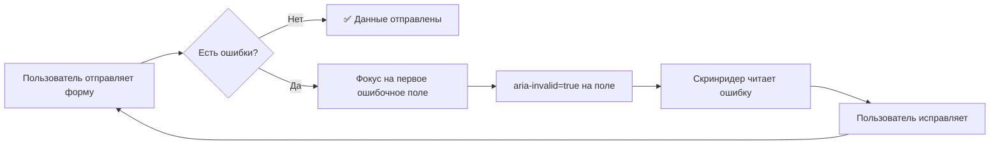
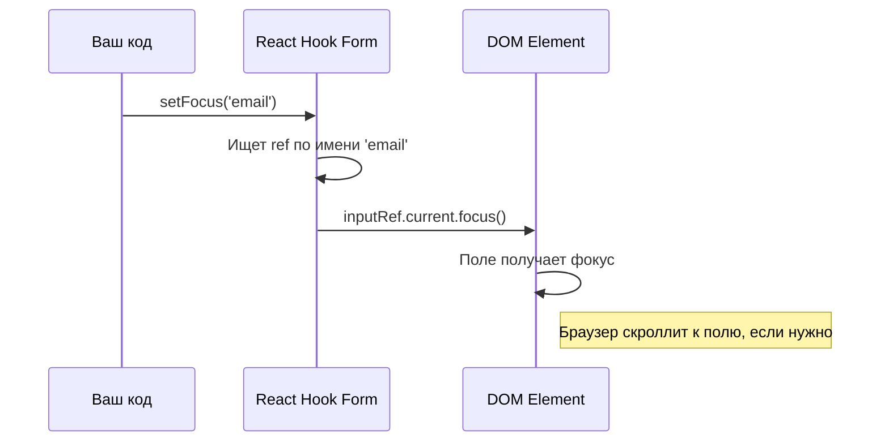
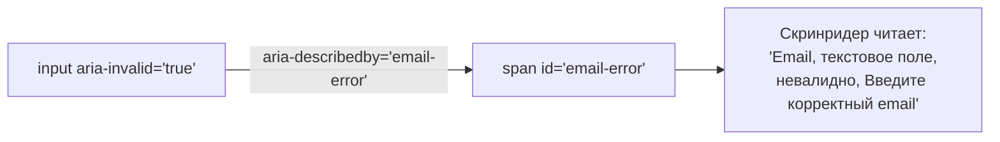

# Уровень 10: Фокус и доступность

## Введение

Представьте, что вы заполняете длинную форму на сайте банка -- 15 полей, вы нажимаете «Отправить», и где-то что-то не прошло валидацию. Экран остаётся на месте, красная надпись мелькает наверху, но вы не понимаете -- **где именно ошибка?** Вы начинаете скроллить вверх-вниз, перечитывать поля, искать глазами красный бордер. Раздражает? Ещё как.

А теперь представьте, что после нажатия «Отправить» курсор **сам прыгает** на первое ошибочное поле, текст в нём выделяется, а скринридер озвучивает: «Поле email невалидно. Ошибка: введите корректный email». Совсем другой опыт.

Управление фокусом и доступность (accessibility, a11y) -- это не «бонусные фичи для галочки». Это критически важные аспекты UX, которые напрямую влияют на конверсию форм. По данным WebAIM, более 96% крупных сайтов имеют проблемы с доступностью, и формы -- одна из самых проблемных областей. React Hook Form предоставляет инструменты, которые делают правильную реализацию фокуса и a11y не сложнее, чем обычную валидацию.



---

## Управление фокусом: setFocus

### Зачем нужен focus management?

При ошибке валидации пользователь должен сразу понять, где проблема. Автоматический фокус на первом ошибочном поле значительно улучшает UX.

Но фокус нужен не только для ошибок. Вот типичные сценарии из продакшена:

- **Форма открылась** -- курсор уже стоит в первом поле, можно сразу печатать
- **Ошибка валидации при submit** -- фокус прыгает на проблемное поле
- **Модальное окно с формой** -- фокус должен оказаться внутри модалки, а не «гулять» по странице за ней
- **Wizard / многошаговая форма** -- при переходе на следующий шаг фокус переходит на первое поле нового шага
- **Серверная ошибка** -- API вернул «email уже занят», нужно сфокусировать поле email

Без управления фокусом пользователь на длинной форме может не заметить ошибку вовсе -- особенно на мобильных устройствах, где экран маленький и скроллить приходится много.

### setFocus -- программная установка фокуса

RHF предоставляет метод `setFocus` для программной установки фокуса на поле по имени. Это удобнее, чем работать с DOM напрямую, потому что RHF уже знает о всех зарегистрированных полях.

```tsx
import { useEffect } from 'react'
import { useForm } from 'react-hook-form'

function MyForm() {
  const {
    register,
    handleSubmit,
    setFocus,
    formState: { errors },
  } = useForm()

  // Фокус на первое поле при монтировании
  useEffect(() => {
    setFocus('email')
  }, [setFocus])

  // Фокус на первое поле с ошибкой после неудачного submit
  const onInvalid = (errors) => {
    const firstError = Object.keys(errors)[0]
    if (firstError) setFocus(firstError)
  }

  return (
    <form onSubmit={handleSubmit(onSubmit, onInvalid)}>
      <input {...register('email', { required: 'Обязательно' })} />
      {errors.email && <span className="error">{errors.email.message}</span>}

      <input {...register('password', { required: 'Обязательно' })} />
      {errors.password && <span className="error">{errors.password.message}</span>}

      <button type="submit">Отправить</button>
    </form>
  )
}
```

### Как setFocus работает под капотом

Когда вы вызываете `register('email')`, RHF сохраняет `ref` на DOM-элемент поля во внутреннем хранилище. Метод `setFocus` просто находит этот `ref` по имени поля и вызывает нативный метод `.focus()` на DOM-элементе:



📌 **Важно:** `setFocus` работает **только** с полями, зарегистрированными через `register` с передачей `ref`. Если вы регистрируете поле без `ref` (например, `register('test')` без привязки к DOM-элементу), фокус не сработает. Порядок фокуса при `shouldFocusError` определяется **порядком вызова `register`**, а не порядком элементов в DOM.

---

## shouldFocusError

RHF имеет встроенную опцию автоматического фокуса на первом ошибочном поле. Она включена по умолчанию -- это значит, что в большинстве случаев вам **не нужно** писать кастомную логику фокуса вручную.

```tsx
// По умолчанию включено
const { register } = useForm({
  shouldFocusError: true,
})

// Отключить (если хотите управлять фокусом вручную)
const { register } = useForm({
  shouldFocusError: false,
})
```

### Когда shouldFocusError достаточно, а когда нужен setFocus

| Сценарий | shouldFocusError | setFocus |
|----------|:---:|:---:|
| Фокус на первое ошибочное поле при submit | ✅ | Не нужен |
| Фокус на первое поле при монтировании | ❌ | ✅ |
| Фокус на конкретное поле по условию | ❌ | ✅ |
| Фокус после серверной ошибки (setError) | ❌ | ✅ |
| Фокус с выделением текста (shouldSelect) | ❌ | ✅ |
| Фокус в wizard при смене шага | ❌ | ✅ |

> 📌 **Когда отключать:** Если вы используете кастомную логику фокуса (например, скролл к ошибке) или
> поля через `Controller`, где автоматический фокус может не работать.

💡 **Совет:** начните с `shouldFocusError: true` (по умолчанию). Переходите к `setFocus` только тогда, когда стандартного поведения недостаточно.

---

## Опции setFocus

`setFocus` принимает второй аргумент -- объект с опцией `shouldSelect`:

```tsx
// Просто фокус
setFocus('email')

// Фокус + выделение текста в поле
setFocus('email', { shouldSelect: true })
```

Разница между этими двумя вариантами на практике:

- **Без `shouldSelect`** -- курсор ставится в конец текста. Пользователь видит поле с ошибкой и может начать его исправлять, но если он хочет заменить весь текст, ему нужно сначала выделить его вручную (Ctrl+A).
- **С `shouldSelect: true`** -- весь текст в поле выделяется. Пользователь может сразу начать печатать, и старый текст заменится. Это удобнее для полей, где, скорее всего, нужно полностью переписать значение (email с опечаткой, неправильный номер телефона).

> ⚠️ **Важно:** `setFocus` работает только с полями, зарегистрированными через `register`. Для полей
> через `Controller` фокус зависит от реализации компонента.

### Кастомный хук для фокуса на ошибке

Когда `shouldFocusError` недостаточно (например, вы хотите фокусировать поле не только при submit, но и при изменении ошибок в реальном времени), полезно вынести логику в отдельный хук:

```tsx
import { useEffect } from 'react'
import { UseFormSetFocus, FieldErrors, FieldValues } from 'react-hook-form'

function useFocusOnError<T extends FieldValues>(
  errors: FieldErrors<T>,
  setFocus: UseFormSetFocus<T>
) {
  useEffect(() => {
    const firstError = Object.keys(errors)[0] as keyof T
    if (firstError) {
      setFocus(firstError as any)
    }
  }, [errors, setFocus])
}

// Использование
function MyForm() {
  const {
    setFocus,
    formState: { errors },
  } = useForm()
  useFocusOnError(errors, setFocus)
  // ...
}
```

Этот хук реагирует на **любое** изменение объекта `errors`. Если вы используете режим `mode: 'onChange'` или `mode: 'onBlur'`, фокус будет прыгать к первому ошибочному полю при каждом изменении списка ошибок -- не только при submit.

### setError + shouldFocus -- фокус при серверных ошибках

Отдельно стоит упомянуть связку `setError` с опцией `shouldFocus`. Когда сервер возвращает ошибку валидации (например, «email уже занят»), вы можете программно установить ошибку **и** сфокусировать поле за один вызов:

```tsx
const onSubmit = async (data: FormData) => {
  try {
    await api.register(data)
  } catch (error) {
    if (error.field === 'email') {
      setError('email', {
        type: 'server',
        message: 'Этот email уже зарегистрирован',
      }, { shouldFocus: true }) // Фокус на поле email
    }
  }
}
```

Это избавляет от необходимости вызывать `setError` и `setFocus` отдельно.

---

## Accessibility (a11y): ARIA-атрибуты

### Почему доступность форм -- это не опционально

Доступность -- это не только про людей с инвалидностью. Вот кто выигрывает от правильной a11y:

- **Люди, использующие скринридеры** (слепые и слабовидящие) -- около 2% пользователей интернета
- **Люди с моторными нарушениями** -- навигация только клавиатурой, без мыши
- **Люди с временными ограничениями** -- сломанная рука, яркое солнце на экране, шумное окружение
- **Power users** -- разработчики и опытные пользователи, которые предпочитают клавиатуру
- **Поисковые роботы** -- семантическая разметка помогает SEO
- **Автоматические тесты** -- ARIA-атрибуты служат надёжными селекторами

В некоторых юрисдикциях (ЕС, США, Канада) доступность веб-приложений -- **юридическое требование**. Компании получают реальные штрафы и судебные иски за недоступные формы.

### Основные ARIA-атрибуты для форм

| Атрибут            | Описание                      | Пример                           |
| ------------------ | ----------------------------- | -------------------------------- |
| `aria-label`       | Текстовая метка формы         | `aria-label="Форма входа"`       |
| `aria-invalid`     | Поле невалидно                | `aria-invalid={!!errors.email}`  |
| `aria-describedby` | Связь с описанием ошибки      | `aria-describedby="email-error"` |
| `aria-live`        | Обновления в реальном времени | `aria-live="polite"`             |
| `role="alert"`     | Важное сообщение              | `role="alert"`                   |
| `noValidate`       | Отключить нативную валидацию  | `<form noValidate>`              |

### aria-invalid и aria-describedby

Эти два атрибута работают в паре -- `aria-invalid` сообщает скринридеру, что поле невалидно, а `aria-describedby` указывает, где искать текст ошибки. Без этой связки скринридер видит красный бордер, но **не знает**, что поле содержит ошибку, и **не может** прочитать текст ошибки.



Вот как это реализуется в связке с RHF:

```tsx
<label htmlFor="email">Email</label>
<input
  id="email"
  type="email"
  {...register('email', { required: 'Обязательно' })}
  aria-invalid={!!errors.email}
  aria-describedby={errors.email ? 'email-error' : undefined}
/>

{errors.email && (
  <span id="email-error" className="error" role="alert" aria-live="polite">
    {errors.email.message}
  </span>
)}
```

Разберём по элементам:

- **`aria-invalid={!!errors.email}`** -- булевое значение, которое становится `true`, когда в поле есть ошибка. Скринридер объявит поле как «невалидное»
- **`aria-describedby="email-error"`** -- ссылка на `id` элемента с текстом ошибки. Устанавливается только при наличии ошибки, чтобы не указывать на несуществующий элемент
- **`role="alert"`** -- говорит скринридеру, что содержимое элемента -- важное сообщение, которое нужно озвучить сразу
- **`aria-live="polite"`** -- при обновлении содержимого скринридер дождётся паузы и прочитает новый текст

📌 **Обратите внимание:** `aria-describedby` указывается как `undefined` (а не пустая строка), когда ошибки нет. Пустая строка `aria-describedby=""` -- невалидное значение, которое может вызвать непредсказуемое поведение скринридера.

### role="alert" и aria-live

Эти два механизма отвечают за **динамические уведомления** -- когда контент меняется после начальной загрузки страницы, скринридер должен узнать об этом.

- **`aria-live="assertive"`** -- скринридер **прервёт** текущее озвучивание и немедленно прочитает обновление. Используйте для критических ошибок (общее сообщение «Исправьте ошибки в форме»)
- **`aria-live="polite"`** -- скринридер **дождётся** паузы и прочитает обновление. Используйте для ошибок отдельных полей
- **`role="alert"`** -- неявно подразумевает `aria-live="assertive"`. Можно использовать вместо явного указания `aria-live`

```tsx
function AccessibleForm() {
  const {
    register,
    handleSubmit,
    formState: { errors, isSubmitted },
  } = useForm()

  return (
    <form onSubmit={handleSubmit(onSubmit)} aria-label="Форма регистрации" noValidate>
      {/* Общее сообщение об ошибках */}
      {isSubmitted && Object.keys(errors).length > 0 && (
        <div role="alert" aria-live="assertive" style={{ color: '#dc3545' }}>
          Пожалуйста, исправьте ошибки в форме
        </div>
      )}

      <label htmlFor="email">Email</label>
      <input
        id="email"
        type="email"
        {...register('email', { required: 'Обязательно' })}
        aria-invalid={!!errors.email}
        aria-describedby={errors.email ? 'email-error' : undefined}
      />
      {errors.email && (
        <span id="email-error" className="error" role="alert" aria-live="polite">
          {errors.email.message}
        </span>
      )}

      <button type="submit">Отправить</button>
    </form>
  )
}
```

> 💡 **Совет:** Используйте `aria-live="assertive"` для критических ошибок (общее сообщение) и
> `aria-live="polite"` для ошибок отдельных полей.

### Чеклист доступной формы

Используйте этот чеклист при ревью форм в продакшене:

| # | Требование | Как проверить |
|---|-----------|--------------|
| 1 | Каждое поле имеет `<label>` с `htmlFor` | Клик по label фокусирует поле |
| 2 | `<form>` имеет `aria-label` или `aria-labelledby` | Скринридер объявляет название формы |
| 3 | Ошибочные поля имеют `aria-invalid="true"` | Tab до поля -- скринридер говорит «invalid» |
| 4 | Ошибки связаны через `aria-describedby` | Скринридер читает текст ошибки при фокусе |
| 5 | Сообщения об ошибках имеют `role="alert"` | Скринридер озвучивает появление ошибки |
| 6 | `<form noValidate>` отключает браузерную валидацию | Нет всплывающих подсказок браузера |
| 7 | Все интерактивные элементы доступны с клавиатуры | Tab проходит через все поля и кнопки |
| 8 | Есть видимый индикатор фокуса (focus ring) | При Tab видно, какой элемент активен |

---

## Навигация с клавиатуры

### Переход по полям через Enter

По умолчанию нажатие Enter в текстовом поле **отправляет форму** (если есть кнопка submit). Иногда хочется другого поведения -- чтобы Enter переводил фокус на следующее поле, как в десктопных приложениях.

```tsx
<input
  {...register('name')}
  onKeyDown={(e) => {
    if (e.key === 'Enter') {
      e.preventDefault()
      document.getElementById('email')?.focus()
    }
  }}
/>
<input id="email" {...register('email')} />
```

⚠️ **Предостережение:** перехват Enter может запутать пользователей, которые привыкли, что Enter отправляет форму. Используйте этот паттерн осознанно и только там, где это оправдано UX-требованиями (например, формы ввода данных из бумажных документов, POS-системы).

### Универсальный хук для клавиатурной навигации

Для формы с множеством полей можно написать хук, который автоматизирует переход по Enter:

```tsx
function useEnterNavigation(fieldOrder: string[]) {
  return (currentField: string) => ({
    onKeyDown: (e: React.KeyboardEvent) => {
      if (e.key === 'Enter') {
        e.preventDefault()
        const currentIndex = fieldOrder.indexOf(currentField)
        const nextField = fieldOrder[currentIndex + 1]
        if (nextField) {
          document.getElementById(nextField)?.focus()
        }
      }
    },
  })
}

// Использование
function MyForm() {
  const { register } = useForm()
  const enterNav = useEnterNavigation(['name', 'email', 'phone'])

  return (
    <form>
      <input id="name" {...register('name')} {...enterNav('name')} />
      <input id="email" {...register('email')} {...enterNav('email')} />
      <input id="phone" {...register('phone')} {...enterNav('phone')} />
    </form>
  )
}
```

### Полный пример доступной формы

Этот пример объединяет все техники из уровня: `setFocus` при монтировании, `shouldFocusError` при submit, ARIA-атрибуты для скринридеров и уведомления о статусе:

```tsx
function AccessibleRegistrationForm() {
  const {
    register,
    handleSubmit,
    setFocus,
    formState: { errors, isSubmitted, isSubmitSuccessful },
  } = useForm({
    shouldFocusError: true,
  })

  useEffect(() => {
    setFocus('name')
  }, [setFocus])

  return (
    <form onSubmit={handleSubmit(onSubmit)} aria-label="Форма регистрации" noValidate>
      {isSubmitted && Object.keys(errors).length > 0 && (
        <div role="alert" aria-live="assertive">
          Пожалуйста, исправьте {Object.keys(errors).length} ошибок
        </div>
      )}

      {isSubmitSuccessful && (
        <div role="status" aria-live="polite">
          Регистрация успешна!
        </div>
      )}

      <div>
        <label htmlFor="name">Имя</label>
        <input
          id="name"
          {...register('name', { required: 'Имя обязательно' })}
          aria-invalid={!!errors.name}
          aria-describedby={errors.name ? 'name-error' : undefined}
        />
        {errors.name && (
          <span id="name-error" role="alert">{errors.name.message}</span>
        )}
      </div>

      <div>
        <label htmlFor="email">Email</label>
        <input
          id="email"
          type="email"
          {...register('email', { required: 'Email обязателен' })}
          aria-invalid={!!errors.email}
          aria-describedby={errors.email ? 'email-error' : undefined}
        />
        {errors.email && (
          <span id="email-error" role="alert">{errors.email.message}</span>
        )}
      </div>

      <button type="submit">Зарегистрироваться</button>
    </form>
  )
}
```

🔥 **Обратите внимание на `role="status"`** для сообщения об успехе. В отличие от `role="alert"`, `role="status"` подразумевает `aria-live="polite"` -- скринридер прочитает сообщение, но не прервёт текущее озвучивание. Успех -- это не критическое событие, требующее немедленного внимания.

---

## ⚠️ Частые ошибки новичков

### ❌ Ошибка 1: Работа с фокусом через DOM вместо setFocus

```tsx
// ❌ Неправильно -- обращение к DOM напрямую
useEffect(() => {
  const firstError = Object.keys(errors)[0]
  if (firstError) {
    document.getElementById(firstError)?.focus()
  }
}, [errors])

// ✅ Правильно -- использовать setFocus из RHF
const { setFocus } = useForm()
const onInvalid = (errors) => {
  const firstError = Object.keys(errors)[0]
  if (firstError) setFocus(firstError)
}
```

**Почему это ошибка:** `setFocus` уже знает о всех зарегистрированных полях и не требует привязки к `id`. При прямом обращении к DOM вы создаёте зависимость от `id`, которого может не быть. Кроме того, `setFocus` поддерживает опцию `shouldSelect`, а прямой `focus()` -- нет. И самое главное: `shouldFocusError: true` (включён по умолчанию) автоматически фокусирует первое ошибочное поле при submit -- часто кастомная логика не нужна вовсе.

---

### ❌ Ошибка 2: Отсутствие aria-invalid

```tsx
// ❌ Неправильно -- скринридер не знает об ошибке
<input {...register('email')} />
{errors.email && <span>{errors.email.message}</span>}

// ✅ Правильно -- с aria-invalid и aria-describedby
<input
  {...register('email')}
  aria-invalid={!!errors.email}
  aria-describedby={errors.email ? 'email-error' : undefined}
/>
{errors.email && (
  <span id="email-error" role="alert">{errors.email.message}</span>
)}
```

**Почему это ошибка:** без `aria-invalid` скринридер не сообщит пользователю, что поле содержит ошибку. Визуально пользователь видит красный текст, но слепой пользователь с скринридером -- нет. Без `aria-describedby` скринридер не свяжет поле ввода с текстом ошибки, даже если `role="alert"` озвучит ошибку -- пользователь не поймёт, к какому полю она относится.

---

### ❌ Ошибка 3: noValidate забыли

```tsx
// ❌ Неправильно -- нативная и RHF валидация конфликтуют
<form onSubmit={handleSubmit(onSubmit)}>
  <input type="email" {...register('email')} />
</form>

// ✅ Правильно -- отключаем нативную валидацию
<form onSubmit={handleSubmit(onSubmit)} noValidate>
  <input type="email" {...register('email')} />
</form>
```

**Почему это ошибка:** без `noValidate` браузер покажет свои встроенные сообщения об ошибках, которые будут конфликтовать с кастомными ошибками RHF и могут быть не на нужном языке. Например, Chrome на английской ОС покажет «Please include an '@' in the email address» даже если ваше приложение полностью на русском. Кроме того, нативные тултипы не кастомизируемые и недоступны для скринридеров.

---

### ❌ Ошибка 4: aria-describedby указывает на несуществующий элемент

```tsx
// ❌ Неправильно -- aria-describedby всегда установлен,
// даже когда элемента с id="email-error" нет в DOM
<input
  {...register('email')}
  aria-describedby="email-error"
/>
{errors.email && <span id="email-error">{errors.email.message}</span>}

// ✅ Правильно -- условное значение
<input
  {...register('email')}
  aria-describedby={errors.email ? 'email-error' : undefined}
/>
```

**Почему это ошибка:** когда `aria-describedby` указывает на `id`, которого нет в DOM, скринридер может проигнорировать атрибут, выдать пустое описание или повести себя непредсказуемо в зависимости от реализации. Условное значение гарантирует, что связь устанавливается только тогда, когда элемент-описание действительно существует.

---

### ❌ Ошибка 5: Вызов setFocus сразу после reset

```tsx
// ❌ Неправильно -- reset удаляет все ref, setFocus не сработает
const handleReset = () => {
  reset()
  setFocus('email') // Не сработает!
}

// ✅ Правильно -- setFocus в следующем тике
const handleReset = () => {
  reset()
  setTimeout(() => setFocus('email'), 0)
}
```

**Почему это ошибка:** метод `reset` удаляет все ссылки на DOM-элементы (ref). Если вызвать `setFocus` синхронно после `reset`, ссылки ещё не восстановлены и фокус не произойдёт. `setTimeout` с нулевой задержкой откладывает вызов до следующего тика event loop, когда React завершит перерисовку и `register` восстановит ref.

---

## 📚 Дополнительные ресурсы

- [setFocus документация](https://react-hook-form.com/docs/useform/setfocus)
- [ARIA для форм](https://www.w3.org/WAI/tutorials/forms/)
- [MDN: ARIA attributes](https://developer.mozilla.org/en-US/docs/Web/Accessibility/ARIA)
- [shouldFocusError](https://react-hook-form.com/docs/useform#shouldFocusError)
- [WebAIM: Accessible Forms](https://webaim.org/techniques/forms/) -- подробное руководство по доступным формам
- [WAI-ARIA Authoring Practices: Forms](https://www.w3.org/WAI/ARIA/apg/patterns/form/) -- официальные паттерны ARIA

---

## Что дальше?

В следующем уровне вы изучите **производительность** форм:

- Как React Hook Form минимизирует ререндеры
- Методы `setFocus` и `resetField` для точечного управления отдельными полями
- Паттерны оптимизации для форм с большим количеством полей
