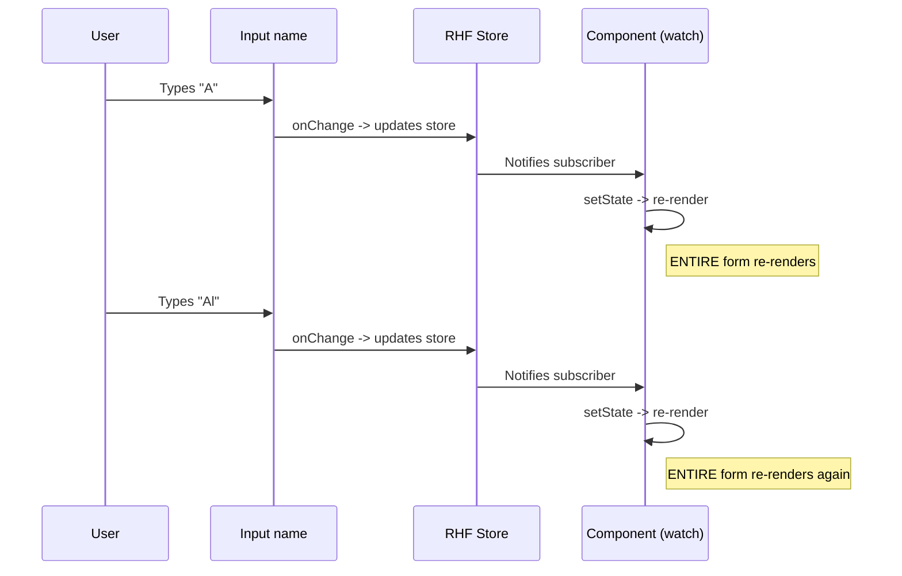
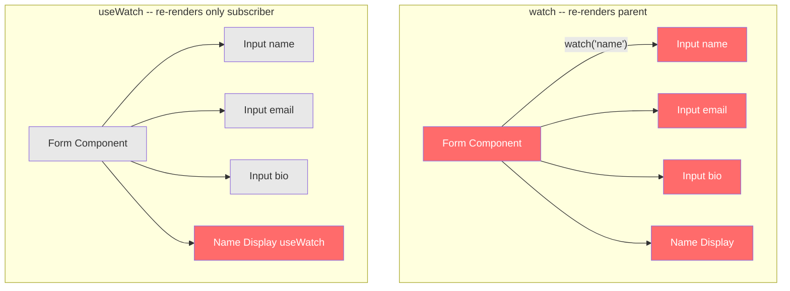
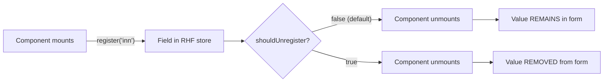
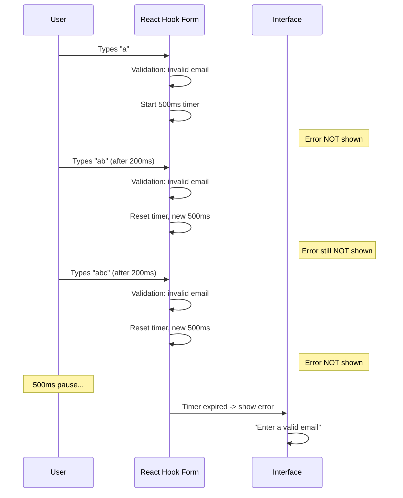

# Level 11: Performance

## Introduction

Imagine your form as an orchestra. Each input field is a separate musician. In a good orchestra, when a violinist plays a solo, the other musicians don't simultaneously start turning pages, tuning instruments, and moving chairs. They **sit quietly** and wait for their part.

In the React world, "turning pages" means component re-rendering. React Hook Form is originally designed to minimize re-renders thanks to its uncontrolled approach: field values live in the DOM, not in React state. But this architectural magic is easily broken if you misuse `watch`, forget about memoization, or misconfigure the form.

In this level, we'll cover **four key optimization directions**: replacing `watch` with `useWatch`, component memoization, field lifecycle management via `shouldUnregister`, and UX improvement with `delayError`. Each direction is a specific tool you can apply in production today.

**Key idea of this level:** React Hook Form gives you performance "for free," but only if you don't break its architecture. Most performance problems aren't RHF bugs, but incorrect use of its API.

---

## watch() Problems

### What Happens Inside

When you call `watch()` without arguments, React Hook Form creates a **global subscription** to all form changes. This means every change to any field -- every keystroke, every checkbox click, every select choice -- triggers a re-render of the component where `watch()` is called.

To understand why this is a problem, let's count. Say you have a form with 15 fields. The user fills each field with an average of 10 characters. Using `watch()` without arguments means **150 re-renders** from typing alone. Each re-render recreates the entire form's JSX, recalculates all expressions, calls all functions inside the component. On a small form this is unnoticeable, but on a form with heavy computations, conditional rendering, or nested components -- the user starts feeling delays.

```tsx
// Bad: re-render on ANY change of ANY field
function SlowForm() {
  const { register, watch } = useForm()
  const values = watch() // Subscribed to all fields
  console.log('Render!', values)

  return (
    <form>
      <input {...register('name')} />
      <input {...register('email')} />
      <input {...register('bio')} />
      {/* Every keystroke in any field = full form re-render */}
    </form>
  )
}
```

### Under the Hood: How watch Creates Subscriptions

Internally, React Hook Form stores all field values in a regular JavaScript object (not in React state). When you call `watch()`, RHF registers your component as an "observer" of changes. On every field change, RHF calls `setState` inside the hook, which triggers the re-render.



**Tip:** `watch()` with a specific field name (`watch('name')`) is slightly better, because it subscribes only to the specified field. But the re-render still affects the **entire** component where the hook is called. That's why `useWatch` exists for production.

### When watch Is Acceptable

Don't get paranoid and avoid `watch` everywhere. It's convenient for:

- **Prototyping** -- when you're quickly testing an idea and performance isn't critical
- **Small forms** (3-5 fields) without heavy computations
- **DevTools and debugging** -- `watch()` is convenient for outputting all form values in development

But as soon as the form grows or dependent computations appear -- switch to `useWatch`.

---

## useWatch for Individual Fields

### Why a Separate Hook Is Needed

`useWatch` is a hook designed specifically for **isolated subscriptions**. The key difference from `watch`: re-render happens only in the component where `useWatch` is called, and only on changes of specified fields. This allows building forms where each UI element updates independently.

Back to the orchestra analogy. If `watch()` is a conductor making the entire orchestra react to every note, then `useWatch` is an earpiece for a specific musician, through which they hear only their part.

```tsx
import { useWatch } from 'react-hook-form'

function OptimizedForm() {
  const { control, register } = useForm()

  // Subscribed to only one field
  const name = useWatch({
    control,
    name: 'name',
    defaultValue: '',
  })

  return (
    <div>
      <input {...register('name')} />
      <input {...register('email')} /> {/* Doesn't cause re-render */}
      <div>You typed: {name}</div>
    </div>
  )
}
```

### useWatch Parameters

`useWatch` accepts an object with three key parameters:

- **`control`** -- the form management object from `useForm()`. Through it, `useWatch` connects to a specific form instance
- **`name`** -- field name (string) or array of names. Defines which specific changes the hook subscribes to
- **`defaultValue`** -- the value the hook returns before the first field update. Without it, you get `undefined` on the first render

```tsx
// Subscribe to one field
const email = useWatch({ control, name: 'email', defaultValue: '' })

// Subscribe to several fields -- returns an array
const [firstName, lastName] = useWatch({
  control,
  name: ['firstName', 'lastName'],
  defaultValue: ['', ''],
})

// Subscribe to all fields (analogous to watch() without args, but in an isolated component)
const allValues = useWatch({ control })
```

### watch vs useWatch

| `watch()`                        | `useWatch()`                       |
| -------------------------------- | ---------------------------------- |
| Subscribes to all fields         | Subscribes to specific fields      |
| Re-renders entire form           | Re-renders only subscribed parts   |
| Can specify name, but in hook    | Isolated subscriptions             |
| Convenient for quick prototype   | Better for production              |

### Under the Hood: How useWatch Isolates Re-renders

The key difference between `watch` and `useWatch` isn't **what** they observe, but **where** the re-render happens. Both hooks internally use the same RHF subscription system. But `watch` calls `setState` in the form component (parent), while `useWatch` does it in the component where it's called (potentially a child).



On the left diagram, changing the `name` field re-renders the **entire** form (red). On the right -- only the `Name Display` component using `useWatch`. Other components are untouched.

---

## Component Memoization

### Why useWatch + memo Is the Perfect Pair

`useWatch` isolates the subscription, but the real power emerges when combined with `React.memo`. The idea is simple: extract the UI element depending on a field value into a separate component, wrap it in `memo`, and give it `useWatch` inside. Now this component:

1. **Doesn't re-render** when the parent changes (thanks to `memo`)
2. **Re-renders only** when the specified field changes (thanks to `useWatch`)

It's like a private office: whatever happens in the open space (rest of the form), the person in the room (memo component) reacts only to calls on their phone (useWatch).

```tsx
import { memo } from 'react'
import { useWatch } from 'react-hook-form'

const PriceDisplay = memo(({ control }: { control: any }) => {
  const price = useWatch({ control, name: 'price' })
  console.log('PriceDisplay render') // Only when price changes
  return <div>Price: {price}</div>
})

const NameDisplay = memo(({ control }: { control: any }) => {
  const name = useWatch({ control, name: 'name' })
  console.log('NameDisplay render') // Only when name changes
  return <div>Name: {name}</div>
})

function MyForm() {
  const { control, register } = useForm()

  return (
    <form>
      <input {...register('name')} />
      <input {...register('price', { valueAsNumber: true })} />
      <input {...register('description')} /> {/* Doesn't affect display components */}

      <NameDisplay control={control} />
      <PriceDisplay control={control} />
    </form>
  )
}
```

### Production Example: Order Form with Total Calculation

In real projects, memoization is especially useful when the form has **computed values**. For example, a shopping cart where you need to display the total:

```tsx
import { memo, useMemo } from 'react'
import { useWatch, useForm, useFieldArray } from 'react-hook-form'
import type { Control } from 'react-hook-form'

interface OrderItem {
  name: string
  price: number
  quantity: number
}

interface OrderForm {
  items: OrderItem[]
  discount: number
}

// Isolated component for total calculation
const OrderTotal = memo(({ control }: { control: Control<OrderForm> }) => {
  const items = useWatch({ control, name: 'items' })
  const discount = useWatch({ control, name: 'discount' })

  const total = useMemo(() => {
    if (!items) return 0
    const subtotal = items.reduce(
      (sum, item) => sum + (item.price || 0) * (item.quantity || 0),
      0
    )
    return subtotal * (1 - (discount || 0) / 100)
  }, [items, discount])

  return (
    <div>
      <strong>Total: {total.toFixed(2)}</strong>
    </div>
  )
})
```

**Important:** notice the `useMemo` inside the component. Even with isolated re-rendering via `useWatch`, if the computation is heavy (e.g., processing an array of 100 items), it's worth memoizing the computation result too.

### When memo Is NOT Needed

Don't wrap every component in `memo` -- it also has a cost (prop comparison on every render). `memo` is justified when:

- The component renders frequently, but its props rarely change
- The component contains heavy JSX or computations
- The component is in a form with `useWatch`

And isn't needed when:

- The component already only re-renders on its own data changes
- Props are primitives that change every render
- The component is lightweight (a simple `<div>` with text)

---

## shouldUnregister

### The Problem: Phantom Data

By default `shouldUnregister: false` -- meaning that when a component with a registered field unmounts from the DOM, its value **remains** in the form store. On form submission, you'll receive data from fields that are no longer on screen. This can be both useful and dangerous.

Imagine a form where selecting "Legal entity" shows TIN and KPP fields. The user selected "Legal entity," filled in the TIN, then changed their mind and switched to "Individual." The TIN and KPP fields disappeared from the DOM, but their values are still in the form. On submission, the server receives a TIN for an individual -- which might be a bug, a business logic violation, or even a security issue.

```tsx
// By default false -- fields register permanently
const { register } = useForm({ shouldUnregister: false })

// true -- fields unregister on unmount
const { register } = useForm({ shouldUnregister: true })

// For conditional fields, shouldUnregister: true is often better
{showEmail && <input {...register('email')} />}
// With shouldUnregister: true -- email removed from data when hidden
// With shouldUnregister: false -- email remains in data
```

### How It Works Internally

When `shouldUnregister: true`, React Hook Form subscribes to the component lifecycle via `useEffect`. On component unmount (the `useEffect` cleanup function), RHF calls the internal `unregister` method, which:

1. Removes the field value from the internal store
2. Removes validation errors for this field
3. Removes the field from `dirtyFields` and `touchedFields`



### When to Use shouldUnregister: true?

- Conditional fields that aren't needed in the final data
- Wizard forms where steps may be removed
- Reducing the size of submitted data

### When to Leave false (default)?

- Data needs to be preserved between field hide/show
- Tab forms where the user switches between tabs
- Draft forms where the user may return to a hidden field

### Granular Control: Manual unregister

Sometimes you need `shouldUnregister` only for **specific** fields, not the entire form. In this case, leave the global setting as `false` and call `unregister` manually:

```tsx
const { register, unregister, watch } = useForm()
const userType = watch('userType')

useEffect(() => {
  if (userType !== 'company') {
    unregister(['inn', 'kpp']) // Remove only business fields
  }
}, [userType, unregister])
```

This approach gives maximum control: you decide when and which fields to remove from the form.

---

## delayError

### The Flickering Error Problem

With `mode: 'onChange'`, validation runs on every field change. This gives instant feedback but creates an unpleasant side effect: the user just started typing an email, typed one letter `a`, and immediately sees a red message "Enter a valid email." They haven't even finished typing, and the form is already "yelling" at them.

This is like a teacher giving an F on an essay after the first word -- wait, let me finish writing!

The `delayError` option solves this problem. It delays the **display** of errors for the specified number of milliseconds after the last change. Validation still happens instantly, but the error **appears in `formState.errors`** only after a pause in typing.

```tsx
const {
  register,
  formState: { errors },
} = useForm({
  mode: 'onChange',
  delayError: 500, // Error will appear 500ms after typing stops
})
```

### How It Works Step by Step



The mechanism is similar to **debounce**: each new input resets the timer. The error appears only when the user stopped typing for the specified duration.

### When delayError Is Useful

> **When to use:** `delayError` is useful in combination with `mode: 'onChange'` or `mode: 'all'`.
> With `mode: 'onBlur'` or `mode: 'onSubmit'`, it's unnecessary.

```tsx
// Typical combination for best UX
const { register } = useForm({
  mode: 'onChange',
  delayError: 300,
})
```

### Choosing the Delay Value

- **200-300ms** -- for fast fields (email, username), where the user types fluently
- **500ms** -- universal value, suitable for most cases
- **800-1000ms** -- for fields where the user thinks between characters (e.g., search field with suggestions)

**Tip:** note that `delayError` only delays error **appearance**. If an error is already shown and the user starts correcting the field, the error **disappears immediately** as soon as the value becomes valid. This is correct behavior: positive feedback should be given instantly, negative feedback -- with a delay.

---

## Re-render Optimization: Final Comparison

### Three Optimization Levels

```tsx
// Slow: watch all fields
const allValues = watch()

// Fast: useWatch for specific fields
const email = useWatch({ name: 'email', control })
const password = useWatch({ name: 'password', control })

// Very fast: memo + useWatch in a separate component
const MemoizedField = memo(({ control, name }) => {
  const value = useWatch({ control, name })
  return <div>{value}</div>
})
```

### Subscribing to formState: Hidden Trap

React Hook Form uses a **Proxy** for the `formState` object. This means RHF **knows** which `formState` properties you access, and subscribes the component only to those specific properties. If you access `errors` -- the component re-renders on error changes. If `isDirty` -- on "dirtiness" changes.

But this optimization only works if you **destructure** `formState` correctly:

```tsx
// Correct: RHF knows you only need errors and isDirty
const { formState: { errors, isDirty } } = useForm()

// Problematic: conditional access may not register subscription
const { formState } = useForm()
// If formState.errors is used inside a condition,
// the Proxy may not track the access
if (someCondition) {
  console.log(formState.errors) // Subscription may not work
}
```

**Rule:** always destructure the needed `formState` properties at the component's top level. Don't access them conditionally or inside callbacks -- the Proxy tracks access only during render.

### Optimization Checklist

- [ ] Replace `watch()` without arguments with `useWatch` for specific fields
- [ ] Extract value-dependent UI elements into separate `memo` components
- [ ] Use `shouldUnregister: true` for conditional fields if data isn't needed after hiding
- [ ] Add `delayError` with `mode: 'onChange'` to prevent error flickering
- [ ] Don't subscribe to `formState` properties that aren't used
- [ ] Destructure `formState` at the component's top level, not inside conditions
- [ ] Use `useMemo` for heavy computations depending on field values

---

## Common Beginner Mistakes

### Mistake 1: watch() instead of useWatch

```tsx
// Wrong -- watching all fields
const values = watch()
console.log('Render', values)

// Correct -- useWatch for specific fields
const name = useWatch({ name: 'name', control })
```

**Why this is a mistake:** `watch()` subscribes to all form changes, causing the entire component to re-render on every keystroke in any field. On a 20-field form, this can be hundreds of unnecessary re-renders per minute.

**How to spot the problem:** open React DevTools, enable "Highlight updates when components render" and start typing in one field. If the entire form flashes -- you have a `watch` problem.

---

### Mistake 2: useWatch without control

```tsx
// May work, but unreliable
const name = useWatch({ name: 'name' })

// Correct -- pass control
const { control } = useForm()
const name = useWatch({ name: 'name', control })
```

**Why this is a mistake:** without `control`, `useWatch` tries to use the `FormProvider` context. If `FormProvider` is absent from the component tree, behavior may be unpredictable: the hook may return `undefined`, not update, or cause a runtime error.

**Rule:** always pass `control` explicitly. This makes component dependencies obvious and simplifies testing.

---

### Mistake 3: Heavy computations in the form component

```tsx
// Wrong -- recalculated on every re-render
function Form() {
  const { register, watch } = useForm()
  const items = watch('items')
  const total = items?.reduce((sum, item) => sum + item.price * item.qty, 0) // On every re-render!

  return <div>Total: {total}</div>
}

// Correct -- extract to memo component
const TotalDisplay = memo(({ control }) => {
  const items = useWatch({ control, name: 'items' })
  const total = items?.reduce((sum, item) => sum + item.price * item.qty, 0)
  return <div>Total: {total}</div>
})
```

**Why this is a mistake:** computations run on every form re-render, even if a different field changed. Extracting to a `memo` component with `useWatch` isolates the computation -- it only runs when `items` changes.

---

### Mistake 4: Passing a new object as control on every render

```tsx
// Wrong -- recreating object on every render
<MemoizedDisplay control={{ ...control }} />

// Correct -- pass the original control
<MemoizedDisplay control={control} />
```

**Why this is a mistake:** the spread operator creates a **new** object on every render. `memo` compares props by reference (`===`), so a new object is always considered "changed," and `memo` loses its meaning. The component re-renders every time, as if `memo` isn't there.

---

### Mistake 5: Destructuring formState inside conditions

```tsx
// Wrong -- Proxy may not register subscription
function Form() {
  const { formState } = useForm()

  if (formState.isSubmitted) {
    return <div>{formState.errors.name?.message}</div> // errors may not update!
  }
  return <form>...</form>
}

// Correct -- destructure at top level
function Form() {
  const { formState: { isSubmitted, errors } } = useForm()

  if (isSubmitted) {
    return <div>{errors.name?.message}</div>
  }
  return <form>...</form>
}
```

**Why this is a mistake:** `formState` is wrapped in a Proxy that registers a subscription on **first access** to a property. If access to `errors` is hidden behind a condition that's `false` on first render, the Proxy doesn't know you need errors and doesn't subscribe the component to their updates.

---

## Additional Resources

- [useWatch documentation](https://react-hook-form.com/docs/usewatch) -- full API description and examples
- [shouldUnregister](https://react-hook-form.com/docs/useform#shouldUnregister) -- option description and its effect on field lifecycle
- [delayError](https://react-hook-form.com/docs/useform#delayError) -- error delay mechanism description
- [Performance tips](https://react-hook-form.com/advanced-usage#FormProviderPerformance) -- official optimization recommendations
- [formState Proxy](https://react-hook-form.com/docs/useform/formstate) -- how Proxy-based subscription works
