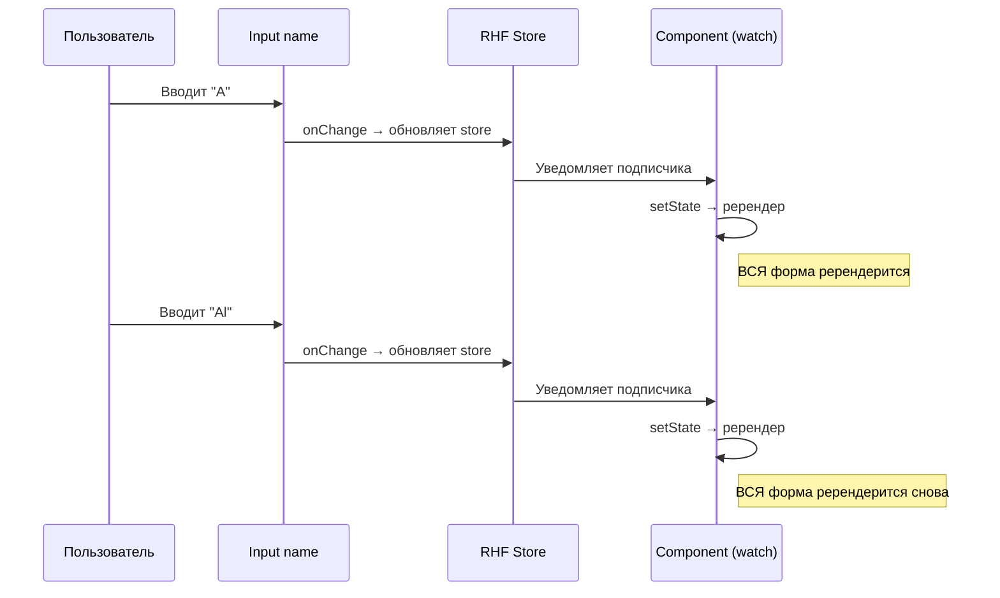
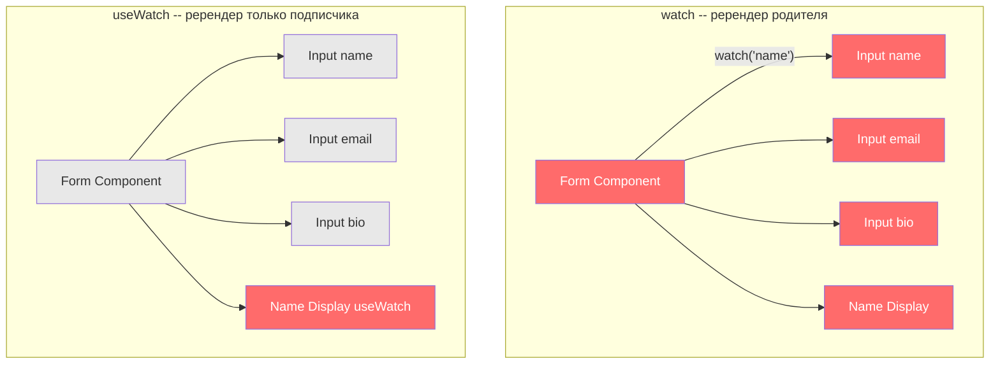
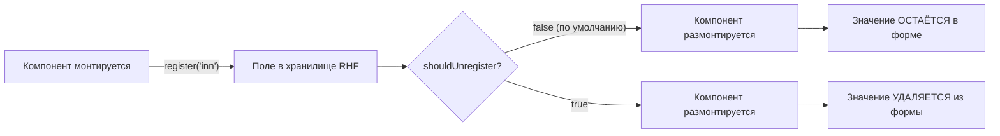
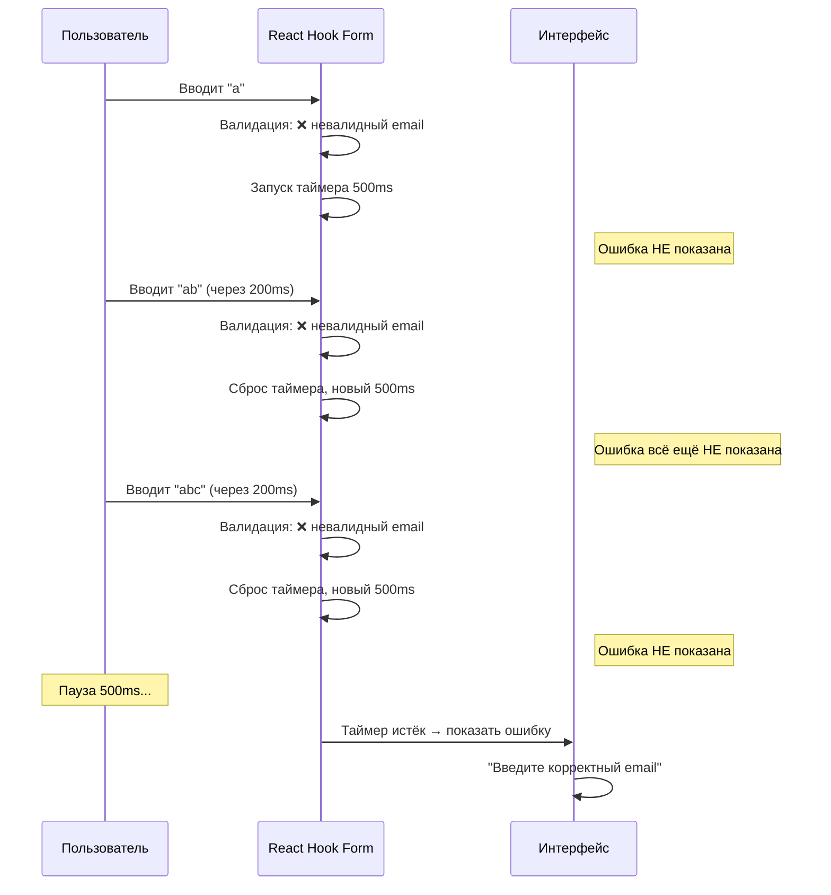

# Уровень 11: Производительность

## Введение

Представьте, что ваша форма -- это оркестр. Каждое поле ввода -- отдельный музыкант. В хорошем оркестре, когда скрипач играет соло, остальные музыканты не начинают одновременно перелистывать ноты, настраивать инструменты и двигать стулья. Они **сидят тихо** и ждут своей партии.

В мире React «перелистывать ноты» -- это ререндер компонента. React Hook Form изначально спроектирован так, чтобы минимизировать ререндеры благодаря uncontrolled-подходу: значения полей живут в DOM, а не в React-состоянии. Но эта архитектурная магия легко ломается, если вы неправильно используете `watch`, забываете про мемоизацию или неверно конфигурируете форму.

В этом уровне мы разберём **четыре ключевых направления оптимизации**: замену `watch` на `useWatch`, мемоизацию компонентов, управление жизненным циклом полей через `shouldUnregister` и улучшение UX с помощью `delayError`. Каждое направление -- это конкретный инструмент, который вы сможете применить в продакшене уже сегодня.

🔥 **Ключевая идея уровня:** React Hook Form даёт вам производительность «бесплатно», но только если вы не ломаете его архитектуру. Большинство проблем с производительностью -- это не баги RHF, а неправильное использование его API.

---

## Проблемы watch()

### Что происходит внутри

Когда вы вызываете `watch()` без аргументов, React Hook Form создаёт **глобальную подписку** на все изменения формы. Это значит, что каждое изменение любого поля -- каждое нажатие клавиши, каждый клик по чекбоксу, каждый выбор в селекте -- вызывает ререндер компонента, в котором вызван `watch()`.

Чтобы понять, почему это проблема, давайте посчитаем. Допустим, у вас форма с 15 полями. Пользователь заполняет каждое поле в среднем 10 символами. При использовании `watch()` без аргументов это **150 ререндеров** только от набора текста. Каждый ререндер пересоздаёт весь JSX формы, пересчитывает все выражения, вызывает все функции внутри компонента. На маленькой форме это незаметно, но на форме с тяжёлыми вычислениями, условным рендерингом или вложенными компонентами -- пользователь начнёт ощущать задержки.

```tsx
// ❌ Плохо: ререндер при ЛЮБОМ изменении ЛЮБОГО поля
function SlowForm() {
  const { register, watch } = useForm()
  const values = watch() // Подписка на все поля
  console.log('Render!', values)

  return (
    <form>
      <input {...register('name')} />
      <input {...register('email')} />
      <input {...register('bio')} />
      {/* Каждый символ в любом поле = ререндер всей формы */}
    </form>
  )
}
```

### Под капотом: как watch создаёт подписку

Внутри React Hook Form хранит значения всех полей в обычном JavaScript-объекте (не в React-состоянии). Когда вы вызываете `watch()`, RHF регистрирует ваш компонент как «наблюдатель» за изменениями. При каждом изменении любого поля RHF вызывает `setState` внутри хука, что и триггерит ререндер.



💡 **Совет:** `watch()` с конкретным именем поля (`watch('name')`) немного лучше, потому что подписывается только на указанное поле. Но ререндер всё равно затрагивает **весь** компонент, в котором вызван хук. Поэтому для продакшена существует `useWatch`.

### Когда watch всё-таки допустим

Не нужно впадать в паранойю и избегать `watch` повсюду. Он удобен для:

- **Прототипирования** -- когда вы быстро проверяете идею и производительность не критична
- **Маленьких форм** (3-5 полей) без тяжёлых вычислений
- **DevTools и отладки** -- `watch()` удобно использовать в development для вывода всех значений формы

Но как только форма растёт или появляются зависимые вычисления -- переходите на `useWatch`.

---

## useWatch для отдельных полей

### Зачем нужен отдельный хук

`useWatch` -- это хук, спроектированный специально для **изолированных подписок**. Главное отличие от `watch`: ререндер происходит только в том компоненте, где вызван `useWatch`, и только при изменении указанных полей. Это позволяет строить формы, где каждый UI-элемент обновляется независимо.

Вернёмся к аналогии с оркестром. Если `watch()` -- это дирижёр, который заставляет весь оркестр реагировать на каждую ноту, то `useWatch` -- это наушник у конкретного музыканта, через который он слышит только свою партию.

```tsx
import { useWatch } from 'react-hook-form'

function OptimizedForm() {
  const { control, register } = useForm()

  // Подписка только на одно поле
  const name = useWatch({
    control,
    name: 'name',
    defaultValue: '',
  })

  return (
    <div>
      <input {...register('name')} />
      <input {...register('email')} /> {/* Не вызывает ререндер */}
      <div>Вы ввели: {name}</div>
    </div>
  )
}
```

### Параметры useWatch

`useWatch` принимает объект с тремя ключевыми параметрами:

- **`control`** -- объект управления формой, получаемый из `useForm()`. Через него `useWatch` связывается с конкретным экземпляром формы
- **`name`** -- имя поля (строка) или массив имён. Определяет, на какие именно изменения подписывается хук
- **`defaultValue`** -- значение, которое хук вернёт до первого обновления поля. Без него вы получите `undefined` на первом рендере

```tsx
// Подписка на одно поле
const email = useWatch({ control, name: 'email', defaultValue: '' })

// Подписка на несколько полей -- возвращает массив
const [firstName, lastName] = useWatch({
  control,
  name: ['firstName', 'lastName'],
  defaultValue: ['', ''],
})

// Подписка на все поля (аналог watch() без аргументов, но в изолированном компоненте)
const allValues = useWatch({ control })
```

### watch vs useWatch

| `watch()`                        | `useWatch()`                       |
| -------------------------------- | ---------------------------------- |
| Подписка на все поля             | Подписка на конкретные поля        |
| Ререндер всей формы             | Ререндер только подписанных частей |
| Можно указать имя, но в хуке    | Изолированные подписки             |
| Удобно для быстрого прототипа   | Лучше для продакшена               |

### Под капотом: как useWatch изолирует ререндеры

Ключевое различие между `watch` и `useWatch` не в том, **что** они наблюдают, а в том, **где** происходит ререндер. Оба хука внутри используют одну и ту же систему подписок RHF. Но `watch` вызывает `setState` в компоненте формы (родительском), а `useWatch` -- в том компоненте, где он вызван (потенциально дочернем).



На диаграмме слева при изменении поля `name` ререндерится **вся** форма (красным). Справа -- только компонент `Name Display`, который использует `useWatch`. Остальные компоненты не затронуты.

---

## Мемоизация компонентов

### Почему useWatch + memo -- идеальная пара

`useWatch` изолирует подписку, но настоящая сила раскрывается в сочетании с `React.memo`. Идея проста: вынесите UI-элемент, зависящий от значения поля, в отдельный компонент, оберните его в `memo` и дайте ему `useWatch` внутри. Теперь этот компонент:

1. **Не ререндерится** при изменении родителя (благодаря `memo`)
2. **Ререндерится только** при изменении нужного поля (благодаря `useWatch`)

Это как выделенная комната в офисе: что бы ни происходило в open space (остальная форма), человек в комнате (memo-компонент) реагирует только на звонки по своему телефону (useWatch).

```tsx
import { memo } from 'react'
import { useWatch } from 'react-hook-form'

const PriceDisplay = memo(({ control }: { control: any }) => {
  const price = useWatch({ control, name: 'price' })
  console.log('PriceDisplay render') // Только при изменении price
  return <div>Цена: {price}</div>
})

const NameDisplay = memo(({ control }: { control: any }) => {
  const name = useWatch({ control, name: 'name' })
  console.log('NameDisplay render') // Только при изменении name
  return <div>Имя: {name}</div>
})

function MyForm() {
  const { control, register } = useForm()

  return (
    <form>
      <input {...register('name')} />
      <input {...register('price', { valueAsNumber: true })} />
      <input {...register('description')} /> {/* Не влияет на display-компоненты */}

      <NameDisplay control={control} />
      <PriceDisplay control={control} />
    </form>
  )
}
```

### Продакшн-пример: форма заказа с подсчётом итога

В реальном проекте мемоизация особенно полезна, когда в форме есть **вычисляемые значения**. Например, корзина товаров, где нужно показывать итоговую сумму:

```tsx
import { memo, useMemo } from 'react'
import { useWatch, useForm, useFieldArray } from 'react-hook-form'
import type { Control } from 'react-hook-form'

interface OrderItem {
  name: string
  price: number
  quantity: number
}

interface OrderForm {
  items: OrderItem[]
  discount: number
}

// Изолированный компонент для подсчёта итога
const OrderTotal = memo(({ control }: { control: Control<OrderForm> }) => {
  const items = useWatch({ control, name: 'items' })
  const discount = useWatch({ control, name: 'discount' })

  const total = useMemo(() => {
    if (!items) return 0
    const subtotal = items.reduce(
      (sum, item) => sum + (item.price || 0) * (item.quantity || 0),
      0
    )
    return subtotal * (1 - (discount || 0) / 100)
  }, [items, discount])

  return (
    <div>
      <strong>Итого: {total.toFixed(2)} ₽</strong>
    </div>
  )
})
```

📌 **Важно:** обратите внимание на `useMemo` внутри компонента. Даже при изолированном ререндере через `useWatch`, если вычисление тяжёлое (например, обработка массива из 100 товаров), имеет смысл мемоизировать и результат вычисления.

### Когда memo НЕ нужен

Не оборачивайте каждый компонент в `memo` -- это тоже имеет стоимость (сравнение пропсов на каждом рендере). `memo` оправдан, когда:

- ✅ Компонент рендерится часто, но его пропсы меняются редко
- ✅ Компонент содержит тяжёлый JSX или вычисления
- ✅ Компонент находится в форме с `useWatch`

И не нужен, когда:

- ❌ Компонент и так рендерится только при изменении своих данных
- ❌ Пропсы -- примитивы, которые меняются на каждый рендер
- ❌ Компонент легковесный (простой `<div>` с текстом)

---

## shouldUnregister

### Проблема: призрачные данные

По умолчанию `shouldUnregister: false` -- это значит, что когда компонент с зарегистрированным полем размонтируется из DOM, его значение **остаётся** в хранилище формы. При отправке формы вы получите данные полей, которых уже нет на экране. Это может быть как полезным, так и опасным.

Представьте анкету, где при выборе «Юридическое лицо» появляются поля ИНН и КПП. Пользователь выбрал «Юридическое лицо», заполнил ИНН, потом передумал и переключился на «Физическое лицо». Поля ИНН и КПП исчезли из DOM, но их значения всё ещё в форме. При отправке сервер получит ИНН физического лица -- а это может быть баг, нарушение бизнес-логики или даже проблема безопасности.

```tsx
// По умолчанию false -- поля регистрируются навсегда
const { register } = useForm({ shouldUnregister: false })

// true -- поля unregister при размонтировании
const { register } = useForm({ shouldUnregister: true })

// Для conditional полей shouldUnregister: true часто лучше
{showEmail && <input {...register('email')} />}
// При shouldUnregister: true -- email удаляется из данных при скрытии
// При shouldUnregister: false -- email остаётся в данных
```

### Как это работает внутри

Когда `shouldUnregister: true`, React Hook Form подписывается на жизненный цикл компонента через `useEffect`. При размонтировании компонента (cleanup-функция `useEffect`) RHF вызывает внутренний метод `unregister`, который:

1. Удаляет значение поля из внутреннего хранилища
2. Удаляет ошибки валидации для этого поля
3. Удаляет поле из `dirtyFields` и `touchedFields`



### Когда использовать shouldUnregister: true?

- ✅ Условные поля, которые не нужны в итоговых данных
- ✅ Wizard-формы, где шаги могут убираться
- ✅ Уменьшение размера отправляемых данных

### Когда оставить false (по умолчанию)?

- ✅ Данные нужно сохранять между скрытием/показом поля
- ✅ Tab-формы, где пользователь переключается между вкладками
- ✅ Формы с «черновиком», где пользователь может вернуться к скрытому полю

### Гранулярный контроль: unregister вручную

Иногда вам нужен `shouldUnregister` только для **отдельных** полей, а не для всей формы. В этом случае оставьте глобальную настройку `false` и вызывайте `unregister` вручную:

```tsx
const { register, unregister, watch } = useForm()
const userType = watch('userType')

useEffect(() => {
  if (userType !== 'company') {
    unregister(['inn', 'kpp']) // Удаляем только бизнес-поля
  }
}, [userType, unregister])
```

Этот подход даёт максимальный контроль: вы решаете, когда и какие поля убрать из формы.

---

## delayError

### Проблема мерцающих ошибок

При `mode: 'onChange'` валидация запускается на каждое изменение поля. Это даёт моментальную обратную связь, но создаёт неприятный побочный эффект: пользователь только начал вводить email, набрал одну букву `a`, и тут же видит красное сообщение «Введите корректный email». Он ещё даже не закончил печатать, а форма уже «кричит» на него.

Это как учитель, который ставит двойку за диктант после первого слова -- подождите, дайте мне дописать!

Опция `delayError` решает эту проблему. Она задерживает **отображение** ошибок на указанное количество миллисекунд после последнего изменения. Валидация по-прежнему происходит мгновенно, но ошибка **появляется в `formState.errors`** только после паузы в наборе текста.

```tsx
const {
  register,
  formState: { errors },
} = useForm({
  mode: 'onChange',
  delayError: 500, // Ошибка появится через 500ms после прекращения ввода
})
```

### Как это работает по шагам



Механизм аналогичен **debounce**: каждый новый ввод сбрасывает таймер. Ошибка появляется только когда пользователь перестал печатать на заданное время.

### Когда delayError полезен

> 📌 **Когда использовать:** `delayError` полезен в сочетании с `mode: 'onChange'` или `mode: 'all'`.
> При `mode: 'onBlur'` или `mode: 'onSubmit'` в нём нет необходимости.

```tsx
// Типичная комбинация для лучшего UX
const { register } = useForm({
  mode: 'onChange',
  delayError: 300,
})
```

### Выбор значения задержки

- **200-300ms** -- для быстрых полей (email, username), где пользователь печатает бегло
- **500ms** -- универсальное значение, подходит для большинства случаев
- **800-1000ms** -- для полей, где пользователь думает между символами (например, поле поиска с подсказками)

💡 **Совет:** обратите внимание, что `delayError` задерживает только **появление** ошибки. Если ошибка уже показана и пользователь начинает исправлять поле, ошибка **исчезнет сразу**, как только значение станет валидным. Это правильное поведение: положительную обратную связь нужно давать мгновенно, а негативную -- с задержкой.

---

## Оптимизация ре-рендеров: итоговое сравнение

### Три уровня оптимизации

```tsx
// ❌ Медленно: watch всех полей
const allValues = watch()

// ✅ Быстро: useWatch для конкретных полей
const email = useWatch({ name: 'email', control })
const password = useWatch({ name: 'password', control })

// ✅ Очень быстро: memo + useWatch в отдельном компоненте
const MemoizedField = memo(({ control, name }) => {
  const value = useWatch({ control, name })
  return <div>{value}</div>
})
```

### Подписка на formState: скрытая ловушка

React Hook Form использует **Proxy** для объекта `formState`. Это означает, что RHF **знает**, к каким свойствам `formState` вы обращаетесь, и подписывает компонент только на эти конкретные свойства. Если вы обращаетесь к `errors` -- компонент будет ререндериться при изменении ошибок. Если к `isDirty` -- при изменении «грязности» формы.

Но эта оптимизация работает, только если вы **деструктурируете** `formState` правильно:

```tsx
// ✅ Правильно: RHF знает, что вам нужны только errors и isDirty
const { formState: { errors, isDirty } } = useForm()

// ❌ Проблемно: условный доступ может не зарегистрировать подписку
const { formState } = useForm()
// Если formState.errors используется внутри условия,
// Proxy может не отследить обращение
if (someCondition) {
  console.log(formState.errors) // Подписка может не сработать
}
```

📌 **Правило:** всегда деструктурируйте нужные свойства `formState` на верхнем уровне компонента. Не обращайтесь к ним условно или внутри колбэков -- Proxy отслеживает доступ только при рендере.

### Чеклист оптимизации

- [ ] Заменить `watch()` без аргументов на `useWatch` с конкретными полями
- [ ] Вынести зависимые от значений UI-элементы в отдельные `memo`-компоненты
- [ ] Использовать `shouldUnregister: true` для условных полей, если данные не нужны после скрытия
- [ ] Добавить `delayError` при `mode: 'onChange'` для предотвращения мерцания ошибок
- [ ] Не подписываться на `formState` свойства, которые не используются
- [ ] Деструктурировать `formState` на верхнем уровне компонента, а не внутри условий
- [ ] Использовать `useMemo` для тяжёлых вычислений, зависящих от значений полей

---

## ⚠️ Частые ошибки новичков

### ❌ Ошибка 1: watch() вместо useWatch

```tsx
// ❌ Неправильно -- watch всех полей
const values = watch()
console.log('Render', values)

// ✅ Правильно -- useWatch для отдельных полей
const name = useWatch({ name: 'name', control })
```

**Почему это ошибка:** `watch()` подписывается на все изменения формы, вызывая ререндер всего
компонента при каждом нажатии клавиши в любом поле. На форме с 20 полями это может быть сотни лишних ререндеров в минуту.

**Как заметить проблему:** откройте React DevTools, включите «Highlight updates when components render» и начните печатать в одном поле. Если вся форма мигает -- у вас проблема с `watch`.

---

### ❌ Ошибка 2: useWatch без control

```tsx
// ❌ Может работать, но ненадёжно
const name = useWatch({ name: 'name' })

// ✅ Правильно -- передаём control
const { control } = useForm()
const name = useWatch({ name: 'name', control })
```

**Почему это ошибка:** без `control` `useWatch` пытается использовать контекст `FormProvider`. Если `FormProvider` отсутствует в дереве компонентов, поведение может быть непредсказуемым: хук может вернуть `undefined`, не обновляться или вызвать runtime-ошибку.

**Правило:** всегда передавайте `control` явно. Это делает зависимости компонента очевидными и упрощает тестирование.

---

### ❌ Ошибка 3: Тяжёлые вычисления в компоненте формы

```tsx
// ❌ Неправильно -- пересчёт при каждом ререндере
function Form() {
  const { register, watch } = useForm()
  const items = watch('items')
  const total = items?.reduce((sum, item) => sum + item.price * item.qty, 0) // На каждый ререндер!

  return <div>Total: {total}</div>
}

// ✅ Правильно -- вынести в memo-компонент
const TotalDisplay = memo(({ control }) => {
  const items = useWatch({ control, name: 'items' })
  const total = items?.reduce((sum, item) => sum + item.price * item.qty, 0)
  return <div>Total: {total}</div>
})
```

**Почему это ошибка:** вычисления выполняются при каждом ререндере формы, даже если изменилось другое поле. Вынос в `memo`-компонент с `useWatch` изолирует пересчёт -- он произойдёт только при изменении `items`.

---

### ❌ Ошибка 4: Передача нового объекта в control на каждый рендер

```tsx
// ❌ Неправильно -- пересоздание объекта на каждый рендер
<MemoizedDisplay control={{ ...control }} />

// ✅ Правильно -- передаём оригинальный control
<MemoizedDisplay control={control} />
```

**Почему это ошибка:** оператор spread создаёт **новый** объект на каждый рендер. `memo` сравнивает пропсы по ссылке (`===`), поэтому новый объект всегда будет считаться «изменённым», и `memo` потеряет смысл. Компонент будет ререндериться каждый раз, как будто `memo` нет.

---

### ❌ Ошибка 5: Деструктуризация formState внутри условий

```tsx
// ❌ Неправильно -- Proxy может не зарегистрировать подписку
function Form() {
  const { formState } = useForm()

  if (formState.isSubmitted) {
    return <div>{formState.errors.name?.message}</div> // errors может не обновляться!
  }
  return <form>...</form>
}

// ✅ Правильно -- деструктурируем на верхнем уровне
function Form() {
  const { formState: { isSubmitted, errors } } = useForm()

  if (isSubmitted) {
    return <div>{errors.name?.message}</div>
  }
  return <form>...</form>
}
```

**Почему это ошибка:** `formState` обёрнут в Proxy, который регистрирует подписку при **первом обращении** к свойству. Если обращение к `errors` спрятано за условием, которое при первом рендере `false`, Proxy не знает, что вам нужны ошибки, и не подписывает компонент на их обновления.

---

## 📚 Дополнительные ресурсы

- [useWatch документация](https://react-hook-form.com/docs/usewatch) -- полное описание API и примеры
- [shouldUnregister](https://react-hook-form.com/docs/useform#shouldUnregister) -- описание опции и её влияния на жизненный цикл полей
- [delayError](https://react-hook-form.com/docs/useform#delayError) -- описание механизма задержки ошибок
- [Performance tips](https://react-hook-form.com/advanced-usage#FormProviderPerformance) -- официальные рекомендации по оптимизации
- [formState Proxy](https://react-hook-form.com/docs/useform/formstate) -- как работает подписка через Proxy

---

## Что дальше?

В следующем уровне вы изучите:

- **Асинхронную валидацию** -- проверка уникальности email или username через API
- **Загрузку данных** -- заполнение формы данными с сервера
- **Async defaultValues** -- как работать с формами, где начальные значения приходят асинхронно
