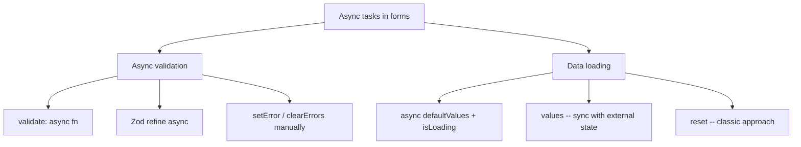
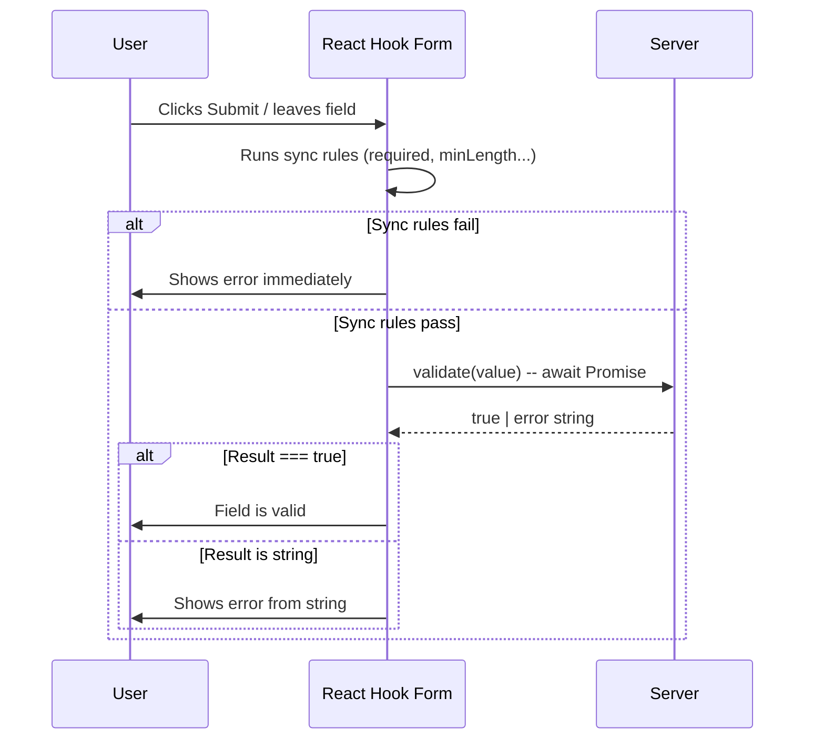
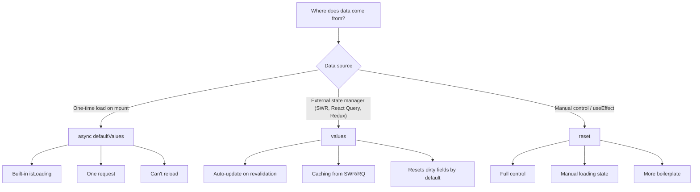
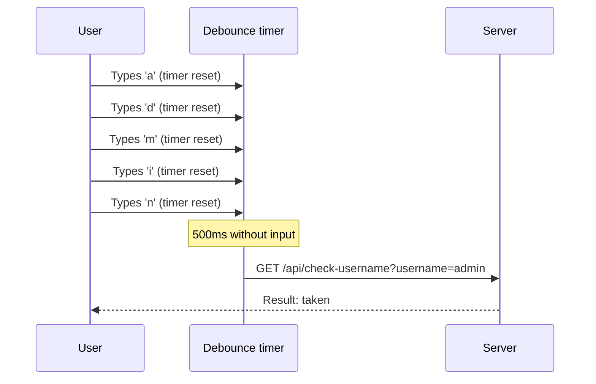

# Level 12: Async Validation and Data Loading

## Introduction

Imagine filling out a registration form. You type the username `admin` -- and instantly see: "Taken." You type `cooldev2026` -- and a green checkmark appears next to the field. All this happens **before** clicking the "Register" button. How does it work? Your browser quietly sends a request to the server, waits for the response, and shows the result -- this is **async validation**.

Another scenario: you open the "Edit Profile" page. The form appears empty for a second, then fills with data from the server -- name, email, avatar. This is **loading data into a form**, and React Hook Form offers three different approaches for it, each with its own trade-offs.

In this level, we'll cover both directions: how to validate data using the server and how to fill forms with asynchronously obtained data. These are skills no production form can do without.



---

## Async Field Validation

### Why Server-Side Validation Is Needed

Not everything can be validated on the client. Here are typical scenarios where a server request is unavoidable:

- **Username uniqueness** -- only the database knows if a name is taken
- **Promo code check** -- code validity is stored on the backend
- **TIN / business registration validation** -- checked against a registry via API
- **Email domain existence** -- MX record is checked on the server

Analogy: imagine you're in a waiting room filling out a form. Most fields you check yourself -- "Name not empty? Phone in correct format?" But one field -- "Pass number" -- can only be verified by the security guard calling the pass office. You hand them the number, wait for an answer, and only then learn if the pass is valid. Async validation is exactly that call to the pass office.

### Basic Async Validation via validate

The simplest way to add server-side checking -- pass an **async function** to the `validate` option when registering a field. React Hook Form natively supports promises in `validate`: if the function returns a `Promise`, RHF waits for it to resolve before considering the field valid or invalid.

```tsx
import { useForm } from 'react-hook-form'

const validateUsername = async (value: string) => {
  // Simulating a server request
  await new Promise(resolve => setTimeout(resolve, 500))

  const takenUsernames = ['admin', 'user', 'test']
  if (takenUsernames.includes(value.toLowerCase())) {
    return 'Username is taken'
  }

  return true
}

function RegistrationForm() {
  const { register, handleSubmit } = useForm()

  return (
    <form onSubmit={handleSubmit(onSubmit)}>
      <input
        {...register('username', {
          required: 'Required',
          validate: validateUsername,
        })}
      />
      <button type="submit">Register</button>
    </form>
  )
}
```

Under the hood, this works as follows:



**Important:** sync rules (`required`, `minLength`, `pattern`) are checked **before** calling async `validate`. If `required` fails, no server request is made. This is sensible behavior -- why check uniqueness of an empty string?

**When does async validate fire?** This depends on the `mode` option in `useForm`:
- `mode: 'onSubmit'` (default) -- validation runs only on form submission
- `mode: 'onBlur'` -- on field blur
- `mode: 'onChange'` -- on every change (careful with this! every keystroke is a server request)

### Async Validation with onBlur and Indicator

In practice, you often need more control: show a spinner during checking, display a green checkmark on success, manage when the check starts. In such cases, instead of the built-in `validate`, a **manual approach** with `setError` / `clearErrors` and custom state is used:

```tsx
function AsyncValidationForm() {
  const {
    register,
    setError,
    clearErrors,
    formState: { errors },
  } = useForm()

  const [checking, setChecking] = useState(false)
  const [available, setAvailable] = useState<boolean | null>(null)

  const validateUsername = async (value: string) => {
    if (!value || value.length < 3) return

    setChecking(true)

    try {
      const response = await fetch(`/api/check-username?username=${value}`)
      const { available } = await response.json()

      setAvailable(available)

      if (!available) {
        setError('username', {
          type: 'manual',
          message: 'Username is taken',
        })
      } else {
        clearErrors('username')
      }
    } catch (error) {
      setError('username', { type: 'manual', message: 'Validation error' })
    } finally {
      setChecking(false)
    }
  }

  return (
    <form>
      <input {...register('username')} onBlur={e => validateUsername(e.target.value)} />

      {checking && <span>Checking...</span>}
      {available === true && <span>Available</span>}
      {available === false && <span>Taken</span>}

      {errors.username && <span className="error">{errors.username.message}</span>}
    </form>
  )
}
```

Key decisions of this approach:

**`setError` and `clearErrors`** -- React Hook Form's API for manual error management. `setError` adds an error to a specific field, `clearErrors` removes it. Type `'manual'` means the error was set by code, not built-in validation.

**Separate state `checking` and `available`** -- RHF doesn't provide a built-in "field is being checked" indicator. So we create our own variables: `checking` controls the spinner, `available` -- the result icon (checkmark / cross).

**Check `if (!value || value.length < 3) return`** -- this is an "early exit." No point sending a server request if the field is empty or too short. This saves traffic and reduces API load.

**`onBlur` instead of `onChange`** -- the check fires on focus loss, not on every keystroke. If we used `onChange`, typing `admin` (5 letters) would send 5 requests: `a`, `ad`, `adm`, `admi`, `admin`. With `onBlur` -- one request after the user finishes typing.

**Choosing between approaches:**

| Approach | Pros | Cons |
|--------|-------|--------|
| `validate: async fn` | Simple, RHF integration, blocks submit | No loading indicator |
| `setError` + manual `onBlur` | Full UX control | More code, manage state yourself |

In production, a **combination** is often used: `validate: async fn` to block submission + manual `onBlur` with indicator for improved UX.

---

## Async Validation with Zod

If you use Zod for describing form schemas (levels 3-4 of the course), server validation can be added directly to the schema via the `refine` or `superRefine` method. This keeps **all validation logic in one place** -- both sync and async.

```tsx
import { z } from 'zod'

const schema = z.object({
  username: z.string().min(3, 'Minimum 3 characters'),
})

// Async validation via refine
const schemaWithAsync = schema.refine(
  async data => {
    const response = await fetch(`/api/check-username?username=${data.username}`)
    const { available } = await response.json()
    return available
  },
  {
    message: 'Username is taken',
    path: ['username'],
  }
)

// Usage
const { register, handleSubmit } = useForm({
  resolver: zodResolver(schemaWithAsync),
  mode: 'onChange',
})
```

How this works under the hood:

1. User changes a field (or submits the form, depending on `mode`)
2. RHF calls `zodResolver(schemaWithAsync)`, which runs `schema.parseAsync(data)`
3. Zod first executes sync checks (`string().min(3)`)
4. If sync checks pass, Zod launches `refine` with an async callback
5. The result (errors or success) is returned to RHF, which updates `formState.errors`

**Important nuance with `path`:** the `path: ['username']` parameter in `refine` specifies which field to attach the error to. Without it, the error goes to `errors.root` (root form error), not `errors.username`, and won't display next to the input.

**Caution with `mode: 'onChange'`:** combined with async refine, every keystroke sends a server request. If the API is paid or slow, this creates problems. Consider `mode: 'onBlur'` or add debounce at the `refine` function level.

---

## Data Loading (Edit Mode)

Loading data into a form is the second major async scenario. It occurs every time a user opens an **edit** form for an existing record: profile, order, product. React Hook Form offers three approaches, and the choice depends on the data source and UX requirements.



### async defaultValues and isLoading

Starting from version 7.40, React Hook Form allows passing an **async function** as `defaultValues`. This is the most elegant approach: you describe where to load data from, and RHF handles everything else -- loading state management, field initialization, promise handling.

```tsx
function EditForm() {
  const {
    register,
    handleSubmit,
    formState: { isLoading, isDirty },
  } = useForm({
    defaultValues: async () => {
      const response = await fetch('/api/user/1')
      return response.json()
    },
  })

  // isLoading === true while async defaultValues is pending
  if (isLoading) return <div>Loading data...</div>

  return (
    <form onSubmit={handleSubmit(onSubmit)}>
      <input {...register('name')} />
      <input {...register('email')} />

      <button type="submit" disabled={!isDirty}>
        Save {isDirty && '*'}
      </button>
    </form>
  )
}
```

What happens under the hood:

1. Component mounts, `useForm` sees that `defaultValues` is a function (not an object)
2. RHF sets `formState.isLoading = true` and starts awaiting the promise
3. Promise resolves -- RHF writes the received data as the form's `defaultValues`
4. `isLoading` switches to `false`, component re-renders with filled fields
5. `isDirty` is `false`, because current values match `defaultValues`

> **`isLoading`** -- a `formState` property that equals `true` only when `defaultValues`
> is an async function and data is still loading. This is **not** `isSubmitting` -- `isLoading`
> refers only to the initial loading of form values.

**When to use:** async `defaultValues` is ideal for pages like `/users/:id/edit`, where data loads once on form mount and doesn't change from outside.

---

### values for Syncing with External State

If form data comes from an external source (SWR, React Query, Redux), use the
`values` option. The form will automatically update when `values` changes:

```tsx
import useSWR from 'swr'

const fetcher = (url: string) => fetch(url).then(res => res.json())

function EditForm() {
  const { data, isLoading: isDataLoading } = useSWR('/api/user/1', fetcher)

  const {
    register,
    handleSubmit,
    formState: { isDirty },
  } = useForm({
    values: data, // Form will update when data changes
  })

  if (isDataLoading) return <div>Loading...</div>

  return (
    <form onSubmit={handleSubmit(onSubmit)}>
      <input {...register('name')} />
      <input {...register('email')} />

      <button type="submit" disabled={!isDirty}>
        Save {isDirty && '*'}
      </button>
    </form>
  )
}
```

Key behavior of `values`: every time the object passed to `values` changes by reference, RHF calls an internal `reset(newValues)`. This means **user input can be overwritten** if, for example, SWR revalidates in the background and returns old data.

To protect user input, use `resetOptions`:

```tsx
useForm({
  values: data,
  resetOptions: {
    keepDirtyValues: true, // Preserve fields the user already changed
    keepErrors: true,       // Don't reset validation errors
  },
})
```

**Difference between `values` and async `defaultValues`:**
- `defaultValues` (async) -- loads data **once** on form initialization
- `values` -- **synchronizes** the form with external state. Every time `values` changes,
  the form updates (similar to calling `reset(values)`)

Analogy: `async defaultValues` is like receiving a filled form at the start of an appointment. You get it once and work with it. `values` is like Google Docs with collaborative editing: if a colleague changes the document, your copy updates too (sometimes at inconvenient times).

---

### Loading Data via reset (Classic Approach)

Before `async defaultValues` and `values` appeared, the only way to load data into a form was `reset` inside `useEffect`. This approach still appears in legacy code and is useful when you need **full control** over the loading process:

```tsx
function EditForm() {
  const { register, handleSubmit, reset, formState: { isDirty } } = useForm()
  const [loading, setLoading] = useState(true)

  useEffect(() => {
    fetch('/api/user/1')
      .then(res => res.json())
      .then(data => {
        reset(data)
        setLoading(false)
      })
  }, [reset])

  if (loading) return <div>Loading...</div>

  return (
    <form onSubmit={handleSubmit(onSubmit)}>
      <input {...register('name')} />
      <input {...register('email')} />
      <button type="submit" disabled={!isDirty}>Save</button>
    </form>
  )
}
```

**When this is still justified:**
- You need complex data transformation logic before loading into the form
- You load data from multiple sources and assemble the form in parts
- You're working with an old codebase that already uses this pattern

**Approach comparison:**

| Approach | isLoading | Auto-update | Boilerplate | When to use |
|--------|-----------|---------------|-------------|-------------------|
| async `defaultValues` | Built-in | No | Minimal | Simple edit form |
| `values` | External (SWR/RQ) | Yes | Medium | Data from state manager |
| `reset` in useEffect | Manual `useState` | No | More | Legacy or complex logic |

---

## Error Handling During Loading

In production, data loading can fail: server unavailable, user lost connection, record deleted. It's important to handle these situations, otherwise the user sees an empty form with no explanation.

```tsx
function EditFormWithErrorHandling() {
  const [loading, setLoading] = useState(true)
  const [error, setError] = useState<string | null>(null)

  const { register, handleSubmit, reset } = useForm()

  useEffect(() => {
    const loadUser = async () => {
      try {
        const response = await fetch('/api/user/1')
        if (!response.ok) throw new Error('Failed to load data')

        const data = await response.json()
        reset(data)
      } catch (err) {
        setError(err instanceof Error ? err.message : 'Error')
      } finally {
        setLoading(false)
      }
    }

    loadUser()
  }, [reset])

  if (loading) return <div>Loading...</div>
  if (error) return <div style={{ color: 'red' }}>Error: {error}</div>

  return <form onSubmit={handleSubmit(onSubmit)}>{/* form fields */}</form>
}
```

Note the `if (!response.ok)` check. The `fetch` method **doesn't throw an exception** on HTTP errors (404, 500) -- it considers the request successful if it received a response from the server. Without this check, `response.json()` attempts to parse the error body (often an HTML page), and you get a cryptic `SyntaxError: Unexpected token '<'`.

**Pattern for async `defaultValues`:** if you use async `defaultValues`, error handling needs to go inside the function, and error state -- extracted outside:

```tsx
const [loadError, setLoadError] = useState<string | null>(null)

const { register, handleSubmit, formState: { isLoading } } = useForm({
  defaultValues: async () => {
    try {
      const response = await fetch('/api/user/1')
      if (!response.ok) throw new Error('Failed to load')
      return response.json()
    } catch (err) {
      setLoadError(err instanceof Error ? err.message : 'Error')
      return { name: '', email: '' } // Return empty values as fallback
    }
  },
})

if (isLoading) return <div>Loading...</div>
if (loadError) return <div>Error: {loadError}</div>
```

---

## Debounce for Async Validation

In the section above, we mentioned the problem of frequent requests with `mode: 'onChange'`. Debounce is a technique that delays function execution until the user stops input for a specified time. Instead of 10 requests when typing 10 characters, 1 request is sent -- 300-500ms after the last keystroke.

```tsx
import { useCallback, useRef } from 'react'

function useDebounce<T extends (...args: unknown[]) => void>(fn: T, delay: number) {
  const timerRef = useRef<ReturnType<typeof setTimeout>>()

  return useCallback((...args: Parameters<T>) => {
    clearTimeout(timerRef.current)
    timerRef.current = setTimeout(() => fn(...args), delay)
  }, [fn, delay]) as T
}

// Usage
function RegistrationForm() {
  const { register, setError, clearErrors } = useForm()
  const [checking, setChecking] = useState(false)

  const checkUsername = useDebounce(async (value: string) => {
    if (!value || value.length < 3) return
    setChecking(true)
    try {
      const res = await fetch(`/api/check-username?username=${value}`)
      const { available } = await res.json()
      if (!available) {
        setError('username', { type: 'manual', message: 'Taken' })
      } else {
        clearErrors('username')
      }
    } finally {
      setChecking(false)
    }
  }, 500)

  return (
    <input
      {...register('username')}
      onChange={e => checkUsername(e.target.value)}
    />
  )
}
```



Without debounce, there would be 5 requests (`a`, `ad`, `adm`, `admi`, `admin`). With debounce -- 1 request 500ms after the last keystroke.

---

## Common Beginner Mistakes

### Mistake 1: Async validation without indicator

```tsx
// Wrong -- user waits with no feedback
validate: async (value) => {
  const response = await fetch(`/api/check?username=${value}`)
  return response.json()
}

// Correct -- show status
const [checking, setChecking] = useState(false)
// + indicator in JSX
{checking && <span>Checking...</span>}
```

**Why this is a mistake:** Async validation takes from 200ms to several seconds. If the user doesn't see that something is happening, they decide the form "froze" and start clicking again. In production, this leads to duplicate requests and frustrated users. Always show a spinner, "Checking..." text, or animation next to the field.

---

### Mistake 2: reset after loading without error handling

```tsx
// Wrong -- loading error is ignored
useEffect(() => {
  fetch('/api/user/1')
    .then(res => res.json())
    .then(reset)
}, [reset])

// Correct -- error handling
useEffect(() => {
  fetch('/api/user/1')
    .then(res => {
      if (!res.ok) throw new Error('Failed to load')
      return res.json()
    })
    .then(reset)
    .catch(err => setLoadError(err.message))
}, [reset])
```

**Why this is a mistake:** Two problems here. First, if the server returns HTTP 500, `fetch` won't throw -- `res.json()` attempts to parse an HTML error page and crashes with `SyntaxError`. Second, even if you add `.catch`, without checking `res.ok` the user sees a cryptic JSON parsing error message instead of a clear "Failed to load data."

---

### Mistake 3: isLoading with regular defaultValues

```tsx
// Wrong -- isLoading won't be true
const { formState: { isLoading } } = useForm({
  defaultValues: { name: '', email: '' }, // Regular object, not async
})
// isLoading is always false!

// Correct -- isLoading only works with async defaultValues
const { formState: { isLoading } } = useForm({
  defaultValues: async () => {
    const res = await fetch('/api/user/1')
    return res.json()
  },
})
```

**Why this is a mistake:** `isLoading` is designed **exclusively** for async `defaultValues`. With a regular object, it's always `false`. If you load data through `useEffect` + `reset`, use your own `useState<boolean>` to track loading.

---

### Mistake 4: Async validation on every keystroke without debounce

```tsx
// Wrong -- request on every keystroke
<input
  {...register('username', {
    validate: async (value) => {
      const res = await fetch(`/api/check?username=${value}`)
      const { available } = await res.json()
      return available || 'Taken'
    },
  })}
/>
// + mode: 'onChange' in useForm
```

**Why this is a mistake:** typing a 10-letter word sends 10 requests to the server. This:
- Creates extra load on the API
- Can lead to race conditions: the response for `adm` may arrive later than the response for `admin`, overwriting the actual result
- Wastes user's traffic

```tsx
// Correct -- use mode: 'onBlur' or debounce
const { register } = useForm({ mode: 'onBlur' })
```

---

### Mistake 5: Forgetting about race conditions

```tsx
// Wrong -- previous request result may overwrite current
const validateUsername = async (value: string) => {
  setChecking(true)
  const res = await fetch(`/api/check?username=${value}`)
  const { available } = await res.json()
  setAvailable(available) // Which request returned? May be stale!
  setChecking(false)
}
```

**Why this is a mistake:** user typed `test`, then erased and typed `admin`. Two requests sent in parallel. If the response for `test` (available) arrives after the response for `admin` (taken), the user sees "Available" for `admin` -- which is incorrect.

```tsx
// Correct -- use AbortController to cancel previous requests
const abortControllerRef = useRef<AbortController>()

const validateUsername = async (value: string) => {
  abortControllerRef.current?.abort()
  abortControllerRef.current = new AbortController()

  setChecking(true)
  try {
    const res = await fetch(`/api/check?username=${value}`, {
      signal: abortControllerRef.current.signal,
    })
    const { available } = await res.json()
    setAvailable(available)
  } catch (err) {
    if (err instanceof DOMException && err.name === 'AbortError') return // Request cancelled -- this is fine
    setError('username', { type: 'manual', message: 'Validation error' })
  } finally {
    setChecking(false)
  }
}
```

`AbortController` cancels the previous request when a new one starts. This guarantees the result always corresponds to the last entered value.

---

## Additional Resources

- [Async defaultValues](https://react-hook-form.com/docs/useform#defaultValues)
- [values option](https://react-hook-form.com/docs/useform#values)
- [formState: isLoading](https://react-hook-form.com/docs/useform/formstate)
