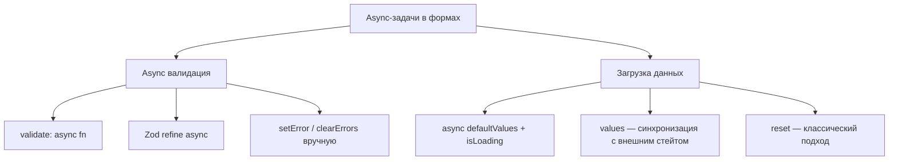
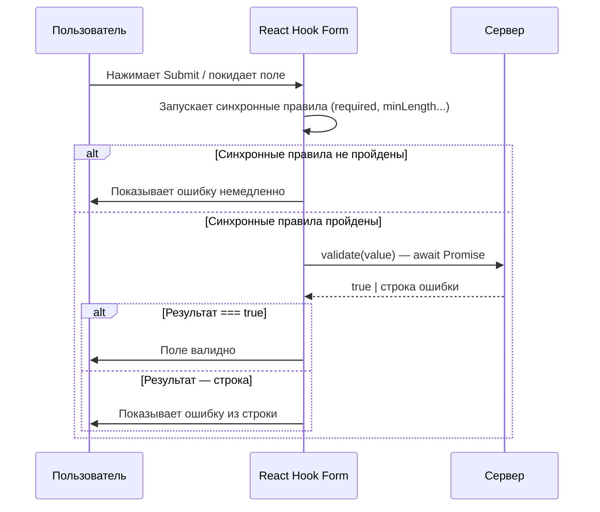
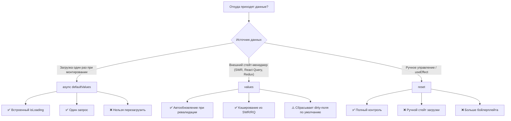
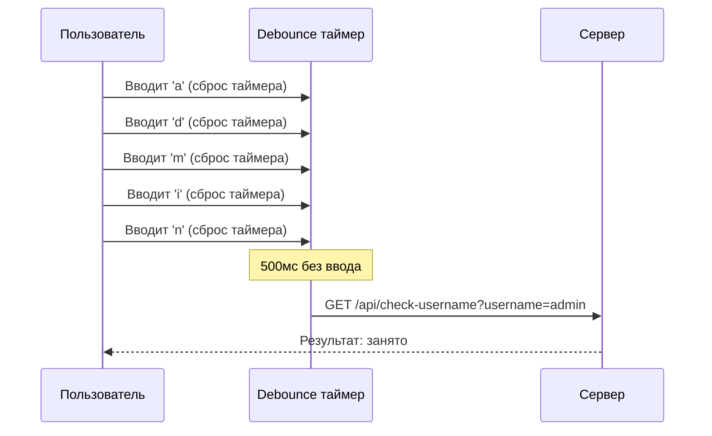

# Уровень 12: Async валидация и загрузка данных

## Введение

Представьте, что вы заполняете форму регистрации. Вводите имя пользователя `admin` -- и мгновенно видите: «Занято». Вводите `cooldev2026` -- и рядом с полем появляется зелёная галочка. Всё это происходит **до** нажатия на кнопку «Зарегистрироваться». Как это работает? Ваш браузер тихо отправляет запрос на сервер, дожидается ответа и показывает результат -- это и есть **async валидация**.

Другой сценарий: вы открываете страницу «Редактирование профиля». Форма появляется пустой на секунду, потом заполняется данными с сервера -- имя, email, аватар. Это **загрузка данных в форму**, и React Hook Form предлагает для неё три разных подхода, каждый со своими компромиссами.

В этом уровне мы разберём оба направления: как проверять данные с помощью сервера и как наполнять форму данными, полученными асинхронно. Это навыки, без которых не обходится ни одна продакшн-форма.



---

## Async валидация полей

### Зачем нужна серверная валидация поля

Не всё можно проверить на клиенте. Вот типичные сценарии, когда без запроса к серверу не обойтись:

- **Уникальность имени пользователя** -- только база данных знает, занято имя или нет
- **Проверка промокода** -- валидность кода хранится на бэкенде
- **Валидация ИНН / ОГРН** -- проверка по реестру через API
- **Существование email-домена** -- MX-запись проверяется на сервере

Аналогия: представьте, что вы стоите в приёмной и заполняете анкету. Большинство полей вы проверяете сами -- «Имя не пустое? Телефон в правильном формате?». Но одно поле -- «Номер пропуска» -- может проверить только охранник, позвонив в бюро пропусков. Вы передаёте ему номер, ждёте ответа, и только после этого узнаёте, действителен ли пропуск. Async валидация -- это и есть тот самый звонок в бюро пропусков.

### Базовая async валидация через validate

Самый простой способ добавить серверную проверку -- передать **асинхронную функцию** в опцию `validate` при регистрации поля. React Hook Form нативно поддерживает промисы в `validate`: если функция возвращает `Promise`, RHF дождётся его разрешения, прежде чем считать поле валидным или невалидным.

```tsx
import { useForm } from 'react-hook-form'

const validateUsername = async (value: string) => {
  // Имитация запроса к серверу
  await new Promise(resolve => setTimeout(resolve, 500))

  const takenUsernames = ['admin', 'user', 'test']
  if (takenUsernames.includes(value.toLowerCase())) {
    return 'Имя пользователя занято'
  }

  return true
}

function RegistrationForm() {
  const { register, handleSubmit } = useForm()

  return (
    <form onSubmit={handleSubmit(onSubmit)}>
      <input
        {...register('username', {
          required: 'Обязательно',
          validate: validateUsername,
        })}
      />
      <button type="submit">Зарегистрироваться</button>
    </form>
  )
}
```

Под капотом это работает так:



📌 **Важно:** синхронные правила (`required`, `minLength`, `pattern`) проверяются **до** вызова async `validate`. Если `required` провалился, запрос к серверу не отправляется. Это разумное поведение -- зачем проверять уникальность пустой строки?

💡 **Когда срабатывает async validate?** Это зависит от опции `mode` в `useForm`:
- `mode: 'onSubmit'` (по умолчанию) -- проверка запускается только при отправке формы
- `mode: 'onBlur'` -- при потере фокуса полем
- `mode: 'onChange'` -- при каждом изменении (осторожно с этим! каждый символ -- запрос к серверу)

### Async валидация с onBlur и индикатором

На практике часто нужно больше контроля: показать спиннер во время проверки, отобразить зелёную галочку при успехе, управлять временем запуска проверки. В таких случаях вместо встроенного `validate` используют **ручной подход** с `setError` / `clearErrors` и собственным состоянием:

```tsx
function AsyncValidationForm() {
  const {
    register,
    setError,
    clearErrors,
    formState: { errors },
  } = useForm()

  const [checking, setChecking] = useState(false)
  const [available, setAvailable] = useState<boolean | null>(null)

  const validateUsername = async (value: string) => {
    if (!value || value.length < 3) return

    setChecking(true)

    try {
      const response = await fetch(`/api/check-username?username=${value}`)
      const { available } = await response.json()

      setAvailable(available)

      if (!available) {
        setError('username', {
          type: 'manual',
          message: 'Имя пользователя занято',
        })
      } else {
        clearErrors('username')
      }
    } catch (error) {
      setError('username', { type: 'manual', message: 'Ошибка проверки' })
    } finally {
      setChecking(false)
    }
  }

  return (
    <form>
      <input {...register('username')} onBlur={e => validateUsername(e.target.value)} />

      {checking && <span>⏳ Проверка...</span>}
      {available === true && <span>✅ Доступно</span>}
      {available === false && <span>❌ Занято</span>}

      {errors.username && <span className="error">{errors.username.message}</span>}
    </form>
  )
}
```

Разберём ключевые решения этого подхода:

**`setError` и `clearErrors`** -- это API React Hook Form для ручного управления ошибками. `setError` добавляет ошибку к конкретному полю, а `clearErrors` убирает её. Тип `'manual'` означает, что ошибка установлена кодом, а не встроенной валидацией.

**Отдельный стейт `checking` и `available`** -- RHF не предоставляет встроенного индикатора «поле проверяется». Поэтому мы создаём свои переменные: `checking` управляет спиннером, а `available` -- иконкой результата (галочка / крестик).

**Проверка `if (!value || value.length < 3) return`** -- это «ранний выход». Нет смысла отправлять запрос к серверу, если поле пустое или слишком короткое. Это экономит трафик и снижает нагрузку на API.

**`onBlur` вместо `onChange`** -- проверка запускается при потере фокуса, а не при каждом нажатии клавиши. Если бы мы использовали `onChange`, то при вводе слова `admin` (5 букв) отправилось бы 5 запросов: `a`, `ad`, `adm`, `admi`, `admin`. При `onBlur` -- один запрос после того, как пользователь закончил ввод.

🔥 **Выбор между подходами:**

| Подход | Плюсы | Минусы |
|--------|-------|--------|
| `validate: async fn` | Простота, интеграция с RHF, блокирует submit | Нет индикатора загрузки |
| `setError` + ручной `onBlur` | Полный контроль над UX | Больше кода, нужно самому управлять стейтом |

В продакшене часто используют **комбинацию**: `validate: async fn` для блокировки отправки + ручной `onBlur` с индикатором для улучшения UX.

---

## Async валидация с Zod

Если вы используете Zod для описания схемы формы (уровни 3-4 курса), серверную валидацию можно добавить прямо в схему через метод `refine` или `superRefine`. Это позволяет хранить **всю логику валидации в одном месте** -- и синхронную, и асинхронную.

```tsx
import { z } from 'zod'

const schema = z.object({
  username: z.string().min(3, 'Минимум 3 символа'),
})

// Async валидация через refine
const schemaWithAsync = schema.refine(
  async data => {
    const response = await fetch(`/api/check-username?username=${data.username}`)
    const { available } = await response.json()
    return available
  },
  {
    message: 'Имя пользователя занято',
    path: ['username'],
  }
)

// Использование
const { register, handleSubmit } = useForm({
  resolver: zodResolver(schemaWithAsync),
  mode: 'onChange',
})
```

Как это работает под капотом:

1. Пользователь изменяет поле (или отправляет форму, в зависимости от `mode`)
2. RHF вызывает `zodResolver(schemaWithAsync)`, который запускает `schema.parseAsync(data)`
3. Zod выполняет сначала синхронные проверки (`string().min(3)`)
4. Если синхронные проверки прошли, Zod запускает `refine` с `async` callback-ом
5. Результат (ошибки или успех) возвращается в RHF, который обновляет `formState.errors`

📌 **Важный нюанс с `path`:** параметр `path: ['username']` в `refine` указывает, к какому полю привязать ошибку. Без него ошибка попадёт в `errors.root` (корневая ошибка формы), а не в `errors.username`, и не отобразится рядом с полем ввода.

⚠️ **Осторожно с `mode: 'onChange'`:** в сочетании с async refine каждое нажатие клавиши отправляет запрос к серверу. Если API платный или медленный, это создаст проблемы. Рассмотрите `mode: 'onBlur'` или добавьте debounce на уровне `refine`-функции.

---

## Загрузка данных (Edit Mode)

Загрузка данных в форму -- второй важный async-сценарий. Он возникает каждый раз, когда пользователь открывает форму **редактирования** существующей записи: профиля, заказа, товара. React Hook Form предлагает три подхода, и выбор между ними зависит от источника данных и требований UX.



### async defaultValues и isLoading

Начиная с версии 7.40, React Hook Form позволяет передавать в `defaultValues` **асинхронную функцию**. Это самый элегантный подход: вы описываете, откуда загрузить данные, а RHF берёт на себя всё остальное -- управление состоянием загрузки, инициализацию полей, обработку промиса.

```tsx
function EditForm() {
  const {
    register,
    handleSubmit,
    formState: { isLoading, isDirty },
  } = useForm({
    defaultValues: async () => {
      const response = await fetch('/api/user/1')
      return response.json()
    },
  })

  // isLoading === true пока async defaultValues не разрешится
  if (isLoading) return <div>Загрузка данных...</div>

  return (
    <form onSubmit={handleSubmit(onSubmit)}>
      <input {...register('name')} />
      <input {...register('email')} />

      <button type="submit" disabled={!isDirty}>
        Сохранить {isDirty && '*'}
      </button>
    </form>
  )
}
```

Что происходит под капотом:

1. Компонент монтируется, `useForm` видит, что `defaultValues` -- это функция (не объект)
2. RHF устанавливает `formState.isLoading = true` и начинает ожидать промис
3. Промис разрешается -- RHF записывает полученные данные как `defaultValues` формы
4. `isLoading` переключается в `false`, компонент перерисовывается с заполненными полями
5. `isDirty` равен `false`, потому что текущие значения совпадают с `defaultValues`

> 📌 **`isLoading`** -- свойство `formState`, которое равно `true` только когда `defaultValues`
> является async функцией и данные ещё загружаются. Это **не** `isSubmitting` -- `isLoading`
> относится только к начальной загрузке значений формы.

💡 **Когда использовать:** async `defaultValues` идеален для страниц типа `/users/:id/edit`, где данные загружаются один раз при монтировании формы и не меняются извне.

---

### values для синхронизации с внешним состоянием

Если данные формы приходят из внешнего источника (SWR, React Query, Redux), используйте опцию
`values`. Форма будет автоматически обновляться при изменении `values`:

```tsx
import useSWR from 'swr'

const fetcher = (url: string) => fetch(url).then(res => res.json())

function EditForm() {
  const { data, isLoading: isDataLoading } = useSWR('/api/user/1', fetcher)

  const {
    register,
    handleSubmit,
    formState: { isDirty },
  } = useForm({
    values: data, // Форма обновится при изменении data
  })

  if (isDataLoading) return <div>Загрузка...</div>

  return (
    <form onSubmit={handleSubmit(onSubmit)}>
      <input {...register('name')} />
      <input {...register('email')} />

      <button type="submit" disabled={!isDirty}>
        Сохранить {isDirty && '*'}
      </button>
    </form>
  )
}
```

Ключевое поведение `values`: каждый раз, когда объект, переданный в `values`, меняется по ссылке, RHF вызывает внутренний `reset(newValues)`. Это означает, что **пользовательский ввод может быть перезаписан**, если, например, SWR сделает ревалидацию в фоне и вернёт старые данные.

Чтобы защитить пользовательский ввод, используйте `resetOptions`:

```tsx
useForm({
  values: data,
  resetOptions: {
    keepDirtyValues: true, // Сохранить поля, которые пользователь уже изменил
    keepErrors: true,       // Не сбрасывать ошибки валидации
  },
})
```

> **Разница между `values` и async `defaultValues`:**
> - `defaultValues` (async) -- загружает данные **один раз** при инициализации формы
> - `values` -- **синхронизирует** форму с внешним состоянием. Каждый раз когда `values` меняется,
>   форма обновляется (аналогично вызову `reset(values)`)

Аналогия: `async defaultValues` -- это как получить заполненный бланк в начале приёма. Вы получаете его один раз и дальше работаете с ним. `values` -- это как Google Docs с совместным редактированием: если коллега изменит документ, ваша копия тоже обновится (иногда не вовремя).

---

### Загрузка данных через reset (классический подход)

До появления `async defaultValues` и `values` единственным способом загрузить данные в форму был `reset` внутри `useEffect`. Этот подход до сих пор встречается в legacy-коде и полезен, когда вам нужен **полный контроль** над процессом загрузки:

```tsx
function EditForm() {
  const { register, handleSubmit, reset, formState: { isDirty } } = useForm()
  const [loading, setLoading] = useState(true)

  useEffect(() => {
    fetch('/api/user/1')
      .then(res => res.json())
      .then(data => {
        reset(data)
        setLoading(false)
      })
  }, [reset])

  if (loading) return <div>Загрузка...</div>

  return (
    <form onSubmit={handleSubmit(onSubmit)}>
      <input {...register('name')} />
      <input {...register('email')} />
      <button type="submit" disabled={!isDirty}>Сохранить</button>
    </form>
  )
}
```

📌 **Когда это всё ещё оправдано:**
- Вам нужна сложная логика трансформации данных перед загрузкой в форму
- Вы загружаете данные из нескольких источников и собираете форму по частям
- Вы работаете со старой кодовой базой, где уже используется этот паттерн

🔥 **Сводная таблица подходов:**

| Подход | isLoading | Автообновление | Бойлерплейт | Когда использовать |
|--------|-----------|---------------|-------------|-------------------|
| async `defaultValues` | Встроенный | Нет | Минимальный | Простая форма редактирования |
| `values` | Внешний (SWR/RQ) | Да | Средний | Данные из стейт-менеджера |
| `reset` в useEffect | Ручной `useState` | Нет | Много | Legacy или сложная логика |

---

## Обработка ошибок при загрузке

В продакшене загрузка данных может завершиться ошибкой: сервер недоступен, пользователь потерял сеть, запись удалена. Важно обрабатывать эти ситуации, иначе пользователь увидит пустую форму без объяснений.

```tsx
function EditFormWithErrorHandling() {
  const [loading, setLoading] = useState(true)
  const [error, setError] = useState<string | null>(null)

  const { register, handleSubmit, reset } = useForm()

  useEffect(() => {
    const loadUser = async () => {
      try {
        const response = await fetch('/api/user/1')
        if (!response.ok) throw new Error('Не удалось загрузить данные')

        const data = await response.json()
        reset(data)
      } catch (err) {
        setError(err instanceof Error ? err.message : 'Ошибка')
      } finally {
        setLoading(false)
      }
    }

    loadUser()
  }, [reset])

  if (loading) return <div>⏳ Загрузка...</div>
  if (error) return <div style={{ color: 'red' }}>❌ {error}</div>

  return <form onSubmit={handleSubmit(onSubmit)}>{/* поля формы */}</form>
}
```

Обратите внимание на проверку `if (!response.ok)`. Метод `fetch` **не бросает исключение** при HTTP-ошибках (404, 500) -- он считает запрос успешным, если получил ответ от сервера. Без этой проверки `response.json()` попытается распарсить тело ошибки (часто HTML-страницу), и вы получите загадочное `SyntaxError: Unexpected token '<'`.

💡 **Паттерн для async `defaultValues`:** если вы используете async `defaultValues`, обработку ошибок нужно поместить внутрь функции, а состояние ошибки -- вынести наружу:

```tsx
const [loadError, setLoadError] = useState<string | null>(null)

const { register, handleSubmit, formState: { isLoading } } = useForm({
  defaultValues: async () => {
    try {
      const response = await fetch('/api/user/1')
      if (!response.ok) throw new Error('Не удалось загрузить')
      return response.json()
    } catch (err) {
      setLoadError(err instanceof Error ? err.message : 'Ошибка')
      return { name: '', email: '' } // Возвращаем пустые значения как fallback
    }
  },
})

if (isLoading) return <div>Загрузка...</div>
if (loadError) return <div>❌ {loadError}</div>
```

---

## Debounce для async валидации

В разделе выше мы упоминали проблему частых запросов при `mode: 'onChange'`. Debounce -- это техника, которая откладывает выполнение функции до тех пор, пока пользователь не прекратит ввод на заданное время. Вместо 10 запросов при вводе 10 символов отправляется 1 запрос -- через 300-500мс после последнего нажатия клавиши.

```tsx
import { useCallback, useRef } from 'react'

function useDebounce<T extends (...args: unknown[]) => void>(fn: T, delay: number) {
  const timerRef = useRef<ReturnType<typeof setTimeout>>()

  return useCallback((...args: Parameters<T>) => {
    clearTimeout(timerRef.current)
    timerRef.current = setTimeout(() => fn(...args), delay)
  }, [fn, delay]) as T
}

// Использование
function RegistrationForm() {
  const { register, setError, clearErrors } = useForm()
  const [checking, setChecking] = useState(false)

  const checkUsername = useDebounce(async (value: string) => {
    if (!value || value.length < 3) return
    setChecking(true)
    try {
      const res = await fetch(`/api/check-username?username=${value}`)
      const { available } = await res.json()
      if (!available) {
        setError('username', { type: 'manual', message: 'Занято' })
      } else {
        clearErrors('username')
      }
    } finally {
      setChecking(false)
    }
  }, 500)

  return (
    <input
      {...register('username')}
      onChange={e => checkUsername(e.target.value)}
    />
  )
}
```



Без debounce было бы 5 запросов (`a`, `ad`, `adm`, `admi`, `admin`). С debounce -- 1 запрос через 500мс после последнего нажатия.

---

## ⚠️ Частые ошибки новичков

### ❌ Ошибка 1: Async валидация без индикатора

```tsx
// ❌ Неправильно -- пользователь ждёт без обратной связи
validate: async (value) => {
  const response = await fetch(`/api/check?username=${value}`)
  return response.json()
}

// ✅ Правильно -- показываем статус
const [checking, setChecking] = useState(false)
// + индикатор в JSX
{checking && <span>⏳ Проверка...</span>}
```

**Почему это ошибка:** Async валидация занимает от 200мс до нескольких секунд. Если пользователь не видит, что что-то происходит, он решит, что форма «зависла», и начнёт кликать повторно. В продакшне это приводит к дублирующим запросам и раздражённым пользователям. Всегда показывайте спиннер, текст «Проверка...» или анимацию рядом с полем.

---

### ❌ Ошибка 2: reset после загрузки без обработки ошибок

```tsx
// ❌ Неправильно -- ошибка загрузки игнорируется
useEffect(() => {
  fetch('/api/user/1')
    .then(res => res.json())
    .then(reset)
}, [reset])

// ✅ Правильно -- обработка ошибок
useEffect(() => {
  fetch('/api/user/1')
    .then(res => {
      if (!res.ok) throw new Error('Не удалось загрузить')
      return res.json()
    })
    .then(reset)
    .catch(err => setLoadError(err.message))
}, [reset])
```

**Почему это ошибка:** Здесь сразу две проблемы. Во-первых, если сервер вернёт HTTP 500, `fetch` не бросит исключение -- `res.json()` попытается распарсить HTML-страницу ошибки и упадёт с `SyntaxError`. Во-вторых, даже если вы добавите `.catch`, без проверки `res.ok` пользователь увидит загадочное сообщение об ошибке парсинга JSON, а не понятное «Не удалось загрузить данные».

---

### ❌ Ошибка 3: isLoading при обычных defaultValues

```tsx
// ❌ Неправильно -- isLoading не будет true
const { formState: { isLoading } } = useForm({
  defaultValues: { name: '', email: '' }, // Обычный объект, не async
})
// isLoading всегда false!

// ✅ Правильно -- isLoading работает только с async defaultValues
const { formState: { isLoading } } = useForm({
  defaultValues: async () => {
    const res = await fetch('/api/user/1')
    return res.json()
  },
})
```

**Почему это ошибка:** `isLoading` предназначен **исключительно** для async `defaultValues`. С обычным объектом
он всегда будет `false`. Если вы загружаете данные через `useEffect` + `reset`, используйте собственный `useState<boolean>` для отслеживания загрузки.

---

### ❌ Ошибка 4: Async валидация при каждом символе без debounce

```tsx
// ❌ Неправильно -- запрос при каждом нажатии клавиши
<input
  {...register('username', {
    validate: async (value) => {
      const res = await fetch(`/api/check?username=${value}`)
      const { available } = await res.json()
      return available || 'Занято'
    },
  })}
/>
// + mode: 'onChange' в useForm
```

**Почему это ошибка:** при вводе слова из 10 букв отправляется 10 запросов к серверу. Это:
- Создаёт лишнюю нагрузку на API
- Может привести к состоянию гонки (race condition): ответ на запрос `adm` может прийти позже, чем ответ на `admin`, и перезаписать актуальный результат
- Расходует трафик пользователя

```tsx
// ✅ Правильно -- используйте mode: 'onBlur' или debounce
const { register } = useForm({ mode: 'onBlur' })
```

---

### ❌ Ошибка 5: Забывают про race condition

```tsx
// ❌ Неправильно -- результат предыдущего запроса может перезаписать текущий
const validateUsername = async (value: string) => {
  setChecking(true)
  const res = await fetch(`/api/check?username=${value}`)
  const { available } = await res.json()
  setAvailable(available) // Какой запрос вернулся? Может быть устаревший!
  setChecking(false)
}
```

**Почему это ошибка:** пользователь ввёл `test`, затем стёр и ввёл `admin`. Два запроса отправлены параллельно. Если ответ на `test` (доступно) пришёл после ответа на `admin` (занято), пользователь увидит «Доступно» для `admin` -- это неправильно.

```tsx
// ✅ Правильно -- используйте AbortController для отмены предыдущих запросов
const abortControllerRef = useRef<AbortController>()

const validateUsername = async (value: string) => {
  abortControllerRef.current?.abort()
  abortControllerRef.current = new AbortController()

  setChecking(true)
  try {
    const res = await fetch(`/api/check?username=${value}`, {
      signal: abortControllerRef.current.signal,
    })
    const { available } = await res.json()
    setAvailable(available)
  } catch (err) {
    if (err instanceof DOMException && err.name === 'AbortError') return // Запрос отменён -- это нормально
    setError('username', { type: 'manual', message: 'Ошибка проверки' })
  } finally {
    setChecking(false)
  }
}
```

`AbortController` отменяет предыдущий запрос при запуске нового. Это гарантирует, что результат всегда соответствует последнему введённому значению.

---

## 📚 Дополнительные ресурсы

- [Async defaultValues](https://react-hook-form.com/docs/useform#defaultValues)
- [values опция](https://react-hook-form.com/docs/useform#values)
- [formState: isLoading](https://react-hook-form.com/docs/useform/formstate#isLoading)
- [setError документация](https://react-hook-form.com/docs/useform/seterror)
