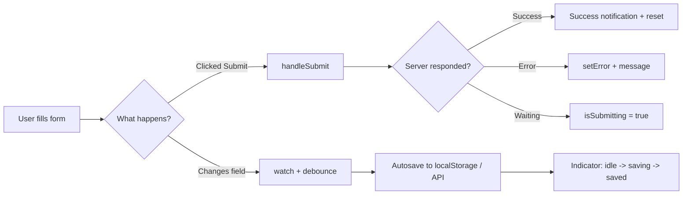
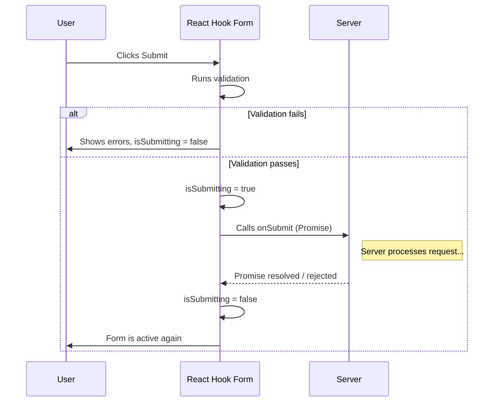
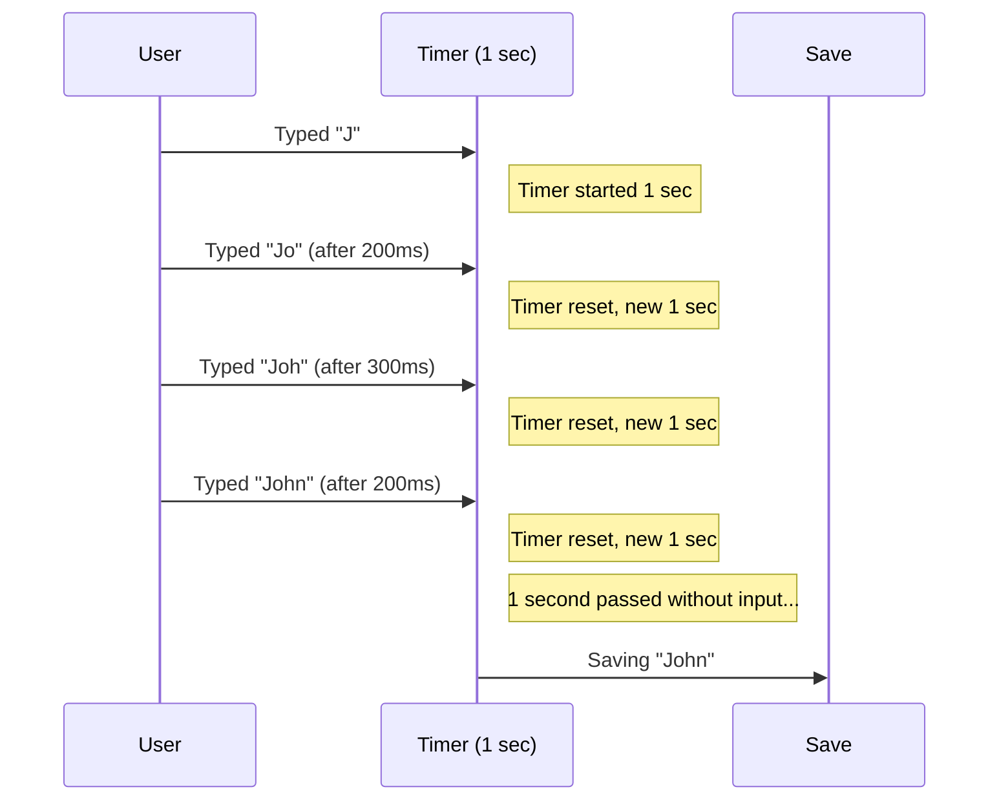
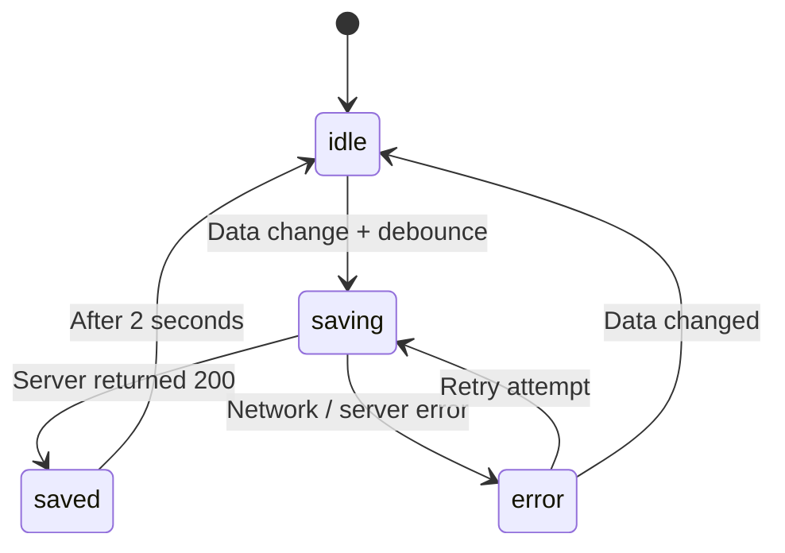

# Level 13: Submission and Autosave

## Introduction

Imagine filling out a long visa application form. You spent 20 minutes, clicked "Submit" -- and... nothing happened. The button didn't disable, no loading indicator. You click again. And again. The server ended up with three identical applications, and you don't even know if any went through. Now another scenario: you were filling out a form, accidentally closed the tab -- and all data is lost. You have to start over.

These two scenarios -- **form submission with state handling** and **draft autosave** -- are key patterns for production forms. They solve fundamental user experience problems:

- The user must **see** what's happening with their data (submitting, submitted, error)
- The user must not **lose** entered data on accidental actions
- The system must **protect** against duplicate submissions

In this level, you'll learn to correctly handle submit with loading/error states, show success/error notifications, and implement debounce autosave. React Hook Form provides convenient tools out of the box -- `isSubmitting`, `isSubmitSuccessful`, `setError`, and `errors.root`.



---

## Submit with Loading/Error States

### Using isSubmitting from formState

When the user clicks the submit button, time passes between the click and the server response -- from a few milliseconds to several seconds. During this time, the user should understand the form is being processed. Without visual feedback, they may decide the click didn't work and click again.

React Hook Form solves this task through the `isSubmitting` property from the `formState` object. The mechanism works automatically: if the `onSubmit` function passed to `handleSubmit` returns a `Promise`, RHF sets `isSubmitting` to `true` until the promise resolves.

**Important:** `isSubmitting` works **only** if `onSubmit` returns a Promise. If you forget `async`/`await` or return a sync value, `isSubmitting` instantly switches back to `false` and the user won't see the loading state.

```tsx
function SubmitForm() {
  const {
    register,
    handleSubmit,
    formState: { isSubmitting, errors },
  } = useForm()

  const onSubmit = async (data: any) => {
    // isSubmitting is automatically true until Promise resolves
    await fetch('/api/submit', {
      method: 'POST',
      headers: { 'Content-Type': 'application/json' },
      body: JSON.stringify(data),
    })
  }

  return (
    <form onSubmit={handleSubmit(onSubmit)}>
      <input {...register('name')} disabled={isSubmitting} />
      <input {...register('email')} disabled={isSubmitting} />

      <button type="submit" disabled={isSubmitting}>
        {isSubmitting ? 'Submitting...' : 'Submit'}
      </button>
    </form>
  )
}
```

#### Under the Hood: How RHF Manages isSubmitting

The internal `handleSubmit` mechanism looks roughly like this:



Key point: `handleSubmit` won't call `onSubmit` again while the previous Promise is pending. This is built-in double-submit protection. But visually, the button should still be disabled via `disabled={isSubmitting}` -- otherwise the user won't understand why their clicks are ignored.

Besides `isSubmitting`, related properties are available in `formState`:

| Property | Type | Purpose |
|---|---|---|
| `isSubmitting` | `boolean` | `true` until Promise from `onSubmit` resolves |
| `isSubmitted` | `boolean` | `true` after first submit attempt (even unsuccessful) |
| `isSubmitSuccessful` | `boolean` | `true` if `onSubmit` completed without errors |
| `submitCount` | `number` | Number of submit attempts |

### Handling Submit Errors via setError

In real applications, the server may return an error -- invalid email, taken login, network error. For these cases, React Hook Form provides the `setError` method, which allows programmatically adding an error to any field or to the form as a whole.

Analogy: if `register` with validation rules is **automated quality control** on the conveyor, then `setError` is **manual inspection**, when an inspector finds a defect the automation missed.

`setError` accepts three arguments:
- **`name`** -- field name (e.g., `'email'`) or `'root'` for a general form error
- **`error`** -- object with `type` and `message`
- **`config`** -- optionally, `{ shouldFocus: true }` to focus the erroneous field

```tsx
function SubmitWithErrorHandling() {
  const {
    register,
    handleSubmit,
    setError,
    formState: { errors, isSubmitting },
  } = useForm()

  const onSubmit = async (data: any) => {
    try {
      const response = await fetch('/api/submit', {
        method: 'POST',
        headers: { 'Content-Type': 'application/json' },
        body: JSON.stringify(data),
      })

      if (!response.ok) {
        const errorData = await response.json()

        // Server errors for specific fields
        if (errorData.field) {
          setError(errorData.field, { message: errorData.message })
        } else {
          // General form error
          setError('root', { message: errorData.message || 'Submission error' })
        }
      }
    } catch (err) {
      setError('root', { message: 'Network error. Please try again later.' })
    }
  }

  return (
    <form onSubmit={handleSubmit(onSubmit)}>
      {errors.root && (
        <div role="alert" style={{ color: 'red', marginBottom: '1rem' }}>
          {errors.root.message}
        </div>
      )}

      <input {...register('name')} />
      {errors.name && <span className="error">{errors.name.message}</span>}

      <input {...register('email')} />
      {errors.email && <span className="error">{errors.email.message}</span>}

      <button type="submit" disabled={isSubmitting}>
        {isSubmitting ? 'Submitting...' : 'Submit'}
      </button>
    </form>
  )
}
```

**Tip:** errors set via `setError('root', ...)` aren't tied to a specific field, so they **don't** reset automatically when field values change. To clear them, use `clearErrors('root')` -- for example, on new input or on re-submission.

#### Production Pattern: Mapping Server Errors

In real projects, APIs often return an array of errors for different fields. Here's a pattern for handling such responses:

```tsx
interface ServerError {
  field: string
  message: string
}

const handleServerErrors = (
  errors: ServerError[],
  setError: UseFormSetError<FormData>
) => {
  errors.forEach(({ field, message }) => {
    if (field === 'general') {
      setError('root', { message })
    } else {
      setError(field as keyof FormData, {
        type: 'server',
        message,
      })
    }
  })
}
```

This approach centralizes server error handling and makes it reusable across different forms.

---

## Success Notifications

After successful submission, the user should receive confirmation. A silent form reset leaves a sense of uncertainty: "Did it send? Or did the form just glitch?" A good notification is a small but important detail that builds trust in the interface.

React Hook Form doesn't provide a built-in notification mechanism (that's the UI layer's responsibility), but its API works well with any approach -- from simple `useState` to toast libraries like `react-hot-toast` or `sonner`.

```tsx
function SubmitWithNotification() {
  const [success, setSuccess] = useState(false)

  const {
    register,
    handleSubmit,
    reset,
    setError,
    formState: { errors, isSubmitting },
  } = useForm()

  const onSubmit = async (data: any) => {
    try {
      await fetch('/api/submit', {
        method: 'POST',
        headers: { 'Content-Type': 'application/json' },
        body: JSON.stringify(data),
      })

      setSuccess(true)
      reset()

      // Hide notification after 3 seconds
      setTimeout(() => setSuccess(false), 3000)
    } catch (err) {
      setError('root', {
        message: err instanceof Error ? err.message : 'Submission error',
      })
    }
  }

  return (
    <form onSubmit={handleSubmit(onSubmit)}>
      {success && (
        <div
          role="status"
          aria-live="polite"
          style={{
            padding: '1rem',
            background: '#d1e7dd',
            color: '#0f5132',
            marginBottom: '1rem',
            borderRadius: '4px',
          }}
        >
          Submitted successfully!
        </div>
      )}

      {errors.root && (
        <div
          role="alert"
          style={{
            padding: '1rem',
            background: '#f8d7da',
            color: '#842029',
            marginBottom: '1rem',
            borderRadius: '4px',
          }}
        >
          {errors.root.message}
        </div>
      )}

      <input {...register('name')} disabled={isSubmitting} />
      <input {...register('email')} disabled={isSubmitting} />

      <button type="submit" disabled={isSubmitting}>
        {isSubmitting ? 'Submitting...' : 'Submit'}
      </button>
    </form>
  )
}
```

#### Alternative: Using isSubmitSuccessful

Instead of manual `useState` for tracking success, you can use the built-in `isSubmitSuccessful` property from `formState`. It automatically becomes `true` if `onSubmit` completed without throwing an exception:

```tsx
const {
  formState: { isSubmitSuccessful },
  reset,
} = useForm()

useEffect(() => {
  if (isSubmitSuccessful) {
    reset()
  }
}, [isSubmitSuccessful, reset])
```

**Important:** `isSubmitSuccessful` resets when `reset()` is called. If you need to show a notification after the form reset, it's better to use a separate `useState`, as in the example above.

#### Notification Accessibility

Note the ARIA attributes in the example:
- Success notification uses `role="status"` and `aria-live="polite"` -- screen reader announces the message when it finishes the current phrase
- Error notification uses `role="alert"` -- screen reader announces it immediately, interrupting the current phrase

This isn't decoration -- without these attributes, visually impaired users won't know the form was submitted or an error occurred.

---

## Debounce for Autosave

### Why Debounce Is Needed

Autosave is a pattern where form data is saved automatically as the user types, without pressing a "Save" button. Google Docs, Notion, Figma -- they all use autosave. But a naive "save on every change" implementation creates problems:

- User types a 10-letter word -- that's 10 requests to the server or 10 localStorage writes
- During fast typing, intermediate values are meaningless (why save `"Joh"` when `"Johnson"` appears a second later?)
- On slow connections, requests start "overlapping"

**Debounce** solves this problem: it delays function execution until the user stops typing for a specified time. If the user continues typing, the timer resets:



Instead of 4 saves -- one. This is debounce.

### Basic Debounce

In React, debounce is implemented via `useEffect` + `setTimeout` with a mandatory cleanup function. React Hook Form provides the `watch()` method, which subscribes to all form field changes -- these are the values we'll "debounce":

```tsx
function AutoSaveForm() {
  const { register, watch } = useForm()
  const values = watch()
  const [saved, setSaved] = useState(false)

  useEffect(() => {
    const timer = setTimeout(() => {
      console.log('Auto-saved:', values)
      localStorage.setItem('draft', JSON.stringify(values))
      setSaved(true)

      setTimeout(() => setSaved(false), 2000)
    }, 1000) // Debounce 1 second

    return () => clearTimeout(timer) // Cleanup is mandatory!
  }, [values])

  return (
    <form>
      <textarea {...register('content')} />
      {saved && <div style={{ color: 'green' }}>Saved</div>}
    </form>
  )
}
```

**Key point:** the cleanup function `return () => clearTimeout(timer)` is the heart of the debounce mechanism. Without it, each change would create a new timer, but old ones would keep ticking. With cleanup, React cancels the previous timer on every new render, and only the last one fires.

#### Choosing Debounce Delay

Optimal delay depends on the scenario:

| Scenario | Delay | Why |
|---|---|---|
| Autosave to localStorage | 500-1000 ms | Write is instant, but too frequent still slows down |
| Autosave to server | 1000-3000 ms | Network requests are more expensive, need more time |
| Search with suggestions | 300-500 ms | User expects quick reaction |
| List filtering | 200-300 ms | Local operation, can be faster |

---

## useDebounce Hook

Debounce logic is conveniently extracted into a reusable hook. It accepts a value and delay, and returns a "delayed" version of that value:

```tsx
function useDebounce<T>(value: T, delay: number): T {
  const [debouncedValue, setDebouncedValue] = useState<T>(value)

  useEffect(() => {
    const timer = setTimeout(() => {
      setDebouncedValue(value)
    }, delay)

    return () => clearTimeout(timer)
  }, [value, delay])

  return debouncedValue
}

// Usage for search
function SearchForm() {
  const { register, watch } = useForm()
  const searchQuery = watch('query')
  const debouncedQuery = useDebounce(searchQuery, 500)

  useEffect(() => {
    if (debouncedQuery) {
      console.log('Searching for:', debouncedQuery)
    }
  }, [debouncedQuery])

  return (
    <form>
      <input {...register('query')} placeholder="Search..." />
    </form>
  )
}
```

This hook works on the same principle as built-in debounce in `useEffect`, but abstracts the implementation details. You can use it not only with forms, but with any value that changes too frequently -- mouse coordinates, window size, scroll position.

**Production tip:** if your project already uses a utility hook library (e.g., `usehooks-ts` or `ahooks`), it likely has a ready-made `useDebounce` with additional features -- cancel, flush (immediate fire), maxWait (maximum wait time).

---

## Autosave Status Indicator

In production forms with autosave, the user should see the current status. Simply saving silently isn't enough -- the user needs to be confident their data is safe. A good indicator goes through several states:



```tsx
function DraftForm() {
  const { register, watch } = useForm()
  const values = watch()
  const [status, setStatus] = useState<'idle' | 'saving' | 'saved' | 'error'>('idle')

  useEffect(() => {
    const timer = setTimeout(async () => {
      setStatus('saving')

      try {
        await fetch('/api/draft', {
          method: 'POST',
          headers: { 'Content-Type': 'application/json' },
          body: JSON.stringify(values),
        })
        setStatus('saved')

        setTimeout(() => setStatus('idle'), 2000)
      } catch (error) {
        setStatus('error')
      }
    }, 1000)

    return () => clearTimeout(timer)
  }, [values])

  return (
    <form>
      <textarea {...register('content')} />

      <div style={{ marginTop: '0.5rem', fontSize: '0.875rem' }}>
        {status === 'saving' && 'Saving...'}
        {status === 'saved' && 'Saved'}
        {status === 'error' && 'Save error'}
      </div>
    </form>
  )
}
```

#### Production Improvements for the Indicator

In a real application, the basic indicator should be supplemented with several details:

1. **Display time of last save** -- instead of a disappearing "Saved," show "Saved at 14:23." This gives the user confidence even if they got distracted.

2. **Retry button on error** -- if autosave failed, give the user a manual save option:

```tsx
{status === 'error' && (
  <div>
    Save error
    <button type="button" onClick={() => saveManually(values)}>
      Retry
    </button>
  </div>
)}
```

3. **Warning on page leave** -- if there are unsaved changes, warn the user:

```tsx
useEffect(() => {
  const handleBeforeUnload = (e: BeforeUnloadEvent) => {
    if (status === 'saving' || hasUnsavedChanges) {
      e.preventDefault()
    }
  }
  window.addEventListener('beforeunload', handleBeforeUnload)
  return () => window.removeEventListener('beforeunload', handleBeforeUnload)
}, [status, hasUnsavedChanges])
```

---

## Common Beginner Mistakes

### Mistake 1: No loading handling

```tsx
// Wrong -- button active during submission
<button type="submit">Submit</button>

// Correct -- show state
const { formState: { isSubmitting } } = useForm()
<button type="submit" disabled={isSubmitting}>
  {isSubmitting ? 'Submitting...' : 'Submit'}
</button>
```

**Why this is a mistake:** The user can submit the form multiple times if there's no loading state and the button isn't disabled. Although `handleSubmit` internally blocks repeated `onSubmit` calls, visually nothing happens -- and the user thinks the form froze. As a result, they may leave the page, losing data, or start reloading the page.

---

### Mistake 2: Debounce without cleanup

```tsx
// Wrong -- memory leak
useEffect(() => {
  const timer = setTimeout(() => {
    console.log('Search:', values)
  }, 500)
  // no cleanup!
})

// Correct -- timer cleanup
useEffect(() => {
  const timer = setTimeout(() => {
    console.log('Search:', values)
  }, 500)
  return () => clearTimeout(timer)
}, [values])
```

**Why this is a mistake:** Without cleanup, each change creates a new timer, old ones don't get cancelled -- leading to memory leaks and multiple requests. If the user types 10 characters in a second, 10 timers fire simultaneously after a second. Also note the missing dependency array `[values]` in the wrong variant -- without it, the effect runs on **every** render, worsening the problem further.

**How to detect:** in DevTools enable "Highlight updates when components render" -- with timer leaks, you'll see a cascade of updates. React StrictMode is also useful, as it calls effects twice in dev mode, revealing cleanup issues.

---

### Mistake 3: No API error handling

```tsx
// Wrong -- error is ignored
const onSubmit = async (data) => {
  await fetch('/api/submit', { body: JSON.stringify(data) })
}

// Correct -- try/catch with setError
const onSubmit = async (data) => {
  try {
    const res = await fetch('/api/submit', { body: JSON.stringify(data) })
    if (!res.ok) throw new Error('Server error')
  } catch (err) {
    setError('root', { message: 'Network error. Try again later.' })
  }
}
```

**Why this is a mistake:** The network may fail, the server may return an error. Without `try/catch`, an unhandled exception can "kill" your React component (especially without an Error Boundary), and the user sees a white screen instead of a clear message. Additionally, `fetch` **doesn't** throw on HTTP errors (4xx, 5xx) -- only on network issues. So checking `!res.ok` is mandatory.

---

### Mistake 4: Multiple submits without blocking

```tsx
// Wrong -- form resubmits on rapid clicks
const onSubmit = async (data) => {
  await saveData(data) // Can execute multiple times!
}

// Correct -- use isSubmitting for blocking
<button type="submit" disabled={isSubmitting}>
  Submit
</button>
// handleSubmit WON'T call onSubmit again while the previous Promise is pending
```

**Why this is a mistake:** `handleSubmit` in RHF automatically blocks repeated calls if `onSubmit` returns a Promise. But visually the button should be disabled via `disabled`, otherwise the user doesn't understand that submission is in progress. In production apps, besides `disabled`, a visual indicator (spinner or button text change) should be added -- this is a UX standard.

---

### Mistake 5: watch() without debounce for server autosave

```tsx
// Wrong -- request on every keystroke
const values = watch()

useEffect(() => {
  fetch('/api/save', {
    method: 'POST',
    body: JSON.stringify(values),
  })
}, [values])

// Correct -- with debounce
useEffect(() => {
  const timer = setTimeout(() => {
    fetch('/api/save', {
      method: 'POST',
      body: JSON.stringify(values),
    })
  }, 1500)
  return () => clearTimeout(timer)
}, [values])
```

**Why this is a mistake:** `watch()` triggers a re-render on **every** field change. If you send a request to the server in `useEffect` without debounce, every keystroke generates a network request. At a typing speed of 5 characters per second, you send 300 requests per minute. This loads both client and server, and can lead to race conditions where late values are overwritten by early ones.

---

## Additional Resources

- [handleSubmit documentation](https://react-hook-form.com/docs/useform/handlesubmit)
- [setError documentation](https://react-hook-form.com/docs/useform/seterror)
- [formState: isSubmitting](https://react-hook-form.com/docs/useform/formstate)
- [errors.root](https://react-hook-form.com/docs/useform/formstate#root)
