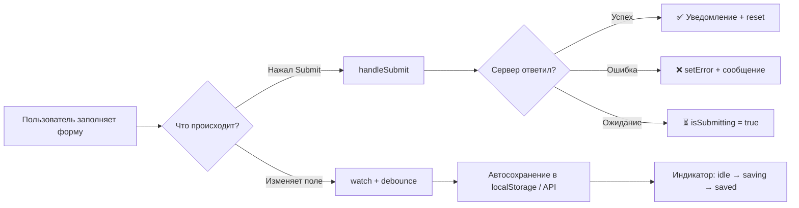
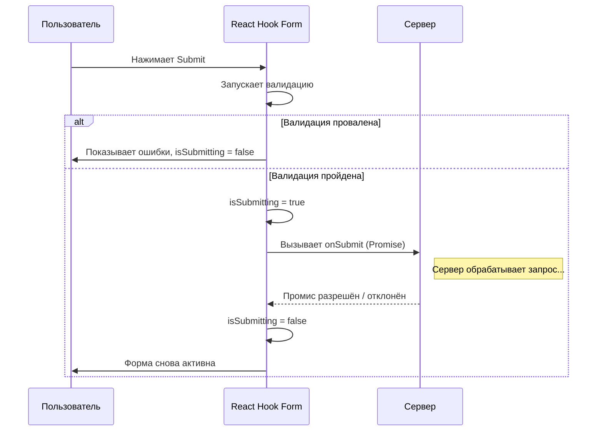
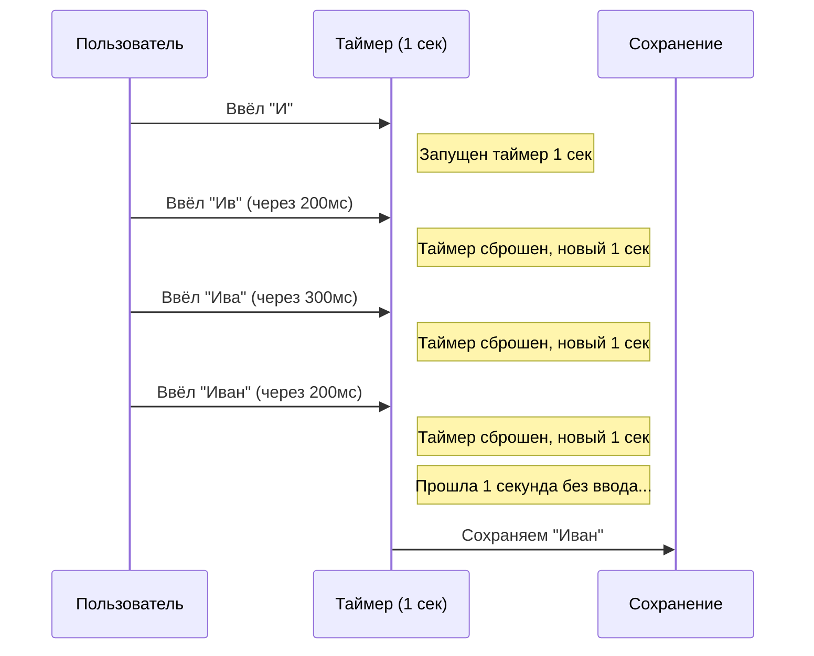
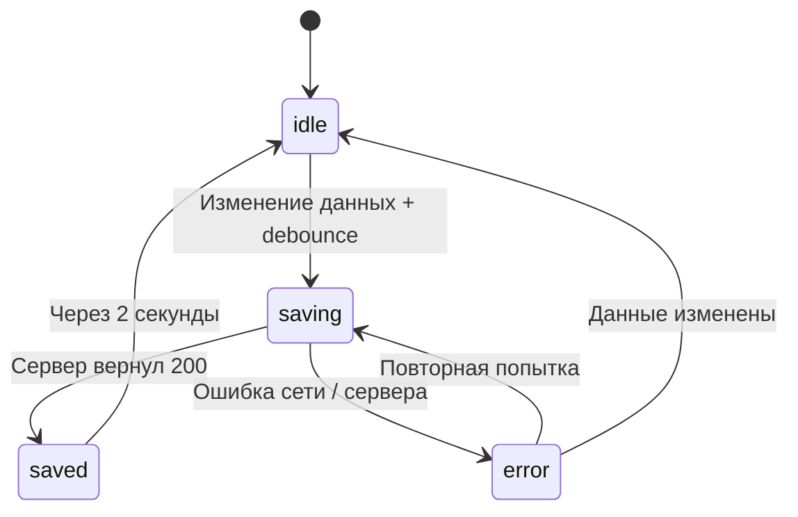

# Уровень 13: Отправка и автосохранение

## Введение

Представьте, что вы заполняете длинную форму заявки на визу. Вы потратили 20 минут, нажали «Отправить» -- и... ничего не произошло. Кнопка не заблокировалась, индикатора загрузки нет. Вы нажимаете ещё раз. И ещё. В итоге сервер получил три одинаковые заявки, а вы даже не знаете, прошла ли хоть одна. А теперь другая ситуация: вы заполняли форму, случайно закрыли вкладку -- и все данные потеряны. Придётся начинать заново.

Эти два сценария -- **отправка формы с обработкой состояний** и **автосохранение черновиков** -- ключевые паттерны для production-форм. Они решают фундаментальные проблемы пользовательского опыта:

- Пользователь должен **видеть**, что происходит с его данными (отправляются, отправлены, ошибка)
- Пользователь не должен **терять** введённые данные при случайных действиях
- Система должна **защищать** от повторных отправок

В этом уровне вы научитесь корректно обрабатывать submit с loading/error состояниями, показывать уведомления об успехе/ошибке и реализовывать debounce-автосохранение. React Hook Form предоставляет для этого удобные инструменты из коробки -- `isSubmitting`, `isSubmitSuccessful`, `setError` и `errors.root`.



---

## Submit с loading/error состояниями

### Использование isSubmitting из formState

Когда пользователь нажимает кнопку отправки, между нажатием и ответом сервера проходит время -- от нескольких миллисекунд до нескольких секунд. В это время пользователь должен понимать, что форма обрабатывается. Без визуальной обратной связи он может решить, что клик не сработал, и нажать снова.

React Hook Form решает эту задачу через свойство `isSubmitting` из объекта `formState`. Механизм работает автоматически: если функция `onSubmit`, переданная в `handleSubmit`, возвращает `Promise`, то RHF устанавливает `isSubmitting` в `true` до момента разрешения этого промиса.

📌 **Важно:** `isSubmitting` работает **только** если `onSubmit` возвращает Promise. Если вы забудете `async`/`await` или вернёте синхронное значение, `isSubmitting` мгновенно переключится обратно в `false` и пользователь не увидит состояние загрузки.

```tsx
function SubmitForm() {
  const {
    register,
    handleSubmit,
    formState: { isSubmitting, errors },
  } = useForm()

  const onSubmit = async (data: any) => {
    // isSubmitting автоматически true пока Promise не завершится
    await fetch('/api/submit', {
      method: 'POST',
      headers: { 'Content-Type': 'application/json' },
      body: JSON.stringify(data),
    })
  }

  return (
    <form onSubmit={handleSubmit(onSubmit)}>
      <input {...register('name')} disabled={isSubmitting} />
      <input {...register('email')} disabled={isSubmitting} />

      <button type="submit" disabled={isSubmitting}>
        {isSubmitting ? '⏳ Отправка...' : 'Отправить'}
      </button>
    </form>
  )
}
```

#### Под капотом: как RHF управляет isSubmitting

Внутренний механизм `handleSubmit` выглядит примерно так:



Ключевой момент: `handleSubmit` не вызовет `onSubmit` повторно, пока предыдущий Promise не завершится. Это встроенная защита от двойной отправки. Но визуально кнопка всё равно должна быть заблокирована через `disabled={isSubmitting}` -- иначе пользователь не поймёт, почему его клики игнорируются.

Кроме `isSubmitting`, в `formState` доступны связанные свойства:

| Свойство | Тип | Назначение |
|---|---|---|
| `isSubmitting` | `boolean` | `true` пока Promise из `onSubmit` не завершится |
| `isSubmitted` | `boolean` | `true` после первой попытки отправки (даже неуспешной) |
| `isSubmitSuccessful` | `boolean` | `true` если `onSubmit` завершился без ошибок |
| `submitCount` | `number` | Количество попыток отправки |

### Обработка ошибок submit через setError

В реальных приложениях сервер может вернуть ошибку -- невалидный email, занятый логин, ошибка сети. Для этих случаев React Hook Form предоставляет метод `setError`, который позволяет программно добавить ошибку к любому полю или к форме в целом.

Аналогия: если `register` с правилами валидации -- это **автоматический контроль качества** на конвейере, то `setError` -- это **ручной контроль**, когда инспектор нашёл дефект, который автоматика не заметила.

`setError` принимает три аргумента:
- **`name`** -- имя поля (например, `'email'`) или `'root'` для общей ошибки формы
- **`error`** -- объект с `type` и `message`
- **`config`** -- опционально, `{ shouldFocus: true }` для фокуса на ошибочном поле

```tsx
function SubmitWithErrorHandling() {
  const {
    register,
    handleSubmit,
    setError,
    formState: { errors, isSubmitting },
  } = useForm()

  const onSubmit = async (data: any) => {
    try {
      const response = await fetch('/api/submit', {
        method: 'POST',
        headers: { 'Content-Type': 'application/json' },
        body: JSON.stringify(data),
      })

      if (!response.ok) {
        const errorData = await response.json()

        // Серверные ошибки для конкретных полей
        if (errorData.field) {
          setError(errorData.field, { message: errorData.message })
        } else {
          // Общая ошибка формы
          setError('root', { message: errorData.message || 'Ошибка отправки' })
        }
      }
    } catch (err) {
      setError('root', { message: 'Ошибка сети. Попробуйте позже.' })
    }
  }

  return (
    <form onSubmit={handleSubmit(onSubmit)}>
      {errors.root && (
        <div role="alert" style={{ color: 'red', marginBottom: '1rem' }}>
          ❌ {errors.root.message}
        </div>
      )}

      <input {...register('name')} />
      {errors.name && <span className="error">{errors.name.message}</span>}

      <input {...register('email')} />
      {errors.email && <span className="error">{errors.email.message}</span>}

      <button type="submit" disabled={isSubmitting}>
        {isSubmitting ? '⏳ Отправка...' : 'Отправить'}
      </button>
    </form>
  )
}
```

💡 **Совет:** ошибки, установленные через `setError('root', ...)`, не привязаны к конкретному полю, поэтому они **не** сбрасываются автоматически при изменении значений полей. Чтобы убрать их, используйте `clearErrors('root')` -- например, при начале нового ввода или при повторной отправке.

#### Продакшн-паттерн: маппинг серверных ошибок

В реальных проектах API часто возвращает массив ошибок для разных полей. Вот паттерн для обработки таких ответов:

```tsx
interface ServerError {
  field: string
  message: string
}

const handleServerErrors = (
  errors: ServerError[],
  setError: UseFormSetError<FormData>
) => {
  errors.forEach(({ field, message }) => {
    if (field === 'general') {
      setError('root', { message })
    } else {
      setError(field as keyof FormData, {
        type: 'server',
        message,
      })
    }
  })
}
```

Этот подход позволяет централизовать обработку серверных ошибок и переиспользовать её в разных формах.

---

## Уведомления при успехе

После успешной отправки пользователь должен получить подтверждение. Молчаливый сброс формы оставляет ощущение неопределённости: «Отправилось? Или просто форма глюкнула?» Хорошее уведомление -- это маленькая, но важная деталь, которая формирует доверие к интерфейсу.

React Hook Form не предоставляет встроенного механизма уведомлений (это ответственность UI-слоя), но его API хорошо сочетается с любым подходом -- от простого `useState` до toast-библиотек вроде `react-hot-toast` или `sonner`.

```tsx
function SubmitWithNotification() {
  const [success, setSuccess] = useState(false)

  const {
    register,
    handleSubmit,
    reset,
    setError,
    formState: { errors, isSubmitting },
  } = useForm()

  const onSubmit = async (data: any) => {
    try {
      await fetch('/api/submit', {
        method: 'POST',
        headers: { 'Content-Type': 'application/json' },
        body: JSON.stringify(data),
      })

      setSuccess(true)
      reset()

      // Скрыть уведомление через 3 секунды
      setTimeout(() => setSuccess(false), 3000)
    } catch (err) {
      setError('root', {
        message: err instanceof Error ? err.message : 'Ошибка отправки',
      })
    }
  }

  return (
    <form onSubmit={handleSubmit(onSubmit)}>
      {success && (
        <div
          role="status"
          aria-live="polite"
          style={{
            padding: '1rem',
            background: '#d1e7dd',
            color: '#0f5132',
            marginBottom: '1rem',
            borderRadius: '4px',
          }}
        >
          ✅ Отправлено успешно!
        </div>
      )}

      {errors.root && (
        <div
          role="alert"
          style={{
            padding: '1rem',
            background: '#f8d7da',
            color: '#842029',
            marginBottom: '1rem',
            borderRadius: '4px',
          }}
        >
          ❌ {errors.root.message}
        </div>
      )}

      <input {...register('name')} disabled={isSubmitting} />
      <input {...register('email')} disabled={isSubmitting} />

      <button type="submit" disabled={isSubmitting}>
        {isSubmitting ? '⏳ Отправка...' : 'Отправить'}
      </button>
    </form>
  )
}
```

#### Альтернатива: использование isSubmitSuccessful

Вместо ручного `useState` для отслеживания успеха можно использовать встроенное свойство `isSubmitSuccessful` из `formState`. Оно автоматически становится `true`, если `onSubmit` завершился без выброса исключения:

```tsx
const {
  formState: { isSubmitSuccessful },
  reset,
} = useForm()

useEffect(() => {
  if (isSubmitSuccessful) {
    reset()
  }
}, [isSubmitSuccessful, reset])
```

📌 **Важно:** `isSubmitSuccessful` сбрасывается при вызове `reset()`. Если вам нужно показать уведомление после сброса формы, лучше использовать отдельный `useState`, как в примере выше.

#### Доступность уведомлений

Обратите внимание на ARIA-атрибуты в примере:
- Уведомление об успехе использует `role="status"` и `aria-live="polite"` -- скринридер озвучит сообщение, когда закончит текущую фразу
- Уведомление об ошибке использует `role="alert"` -- скринридер озвучит его немедленно, прерывая текущую фразу

Это не декорация -- без этих атрибутов пользователи с ограниченным зрением не узнают, что форма отправлена или произошла ошибка.

---

## Debounce для автосохранения

### Зачем нужен debounce

Автосохранение -- это паттерн, при котором данные формы сохраняются автоматически по мере ввода, без нажатия кнопки «Сохранить». Google Docs, Notion, Figma -- все они используют автосохранение. Но наивная реализация «сохранять при каждом изменении» создаёт проблемы:

- Пользователь печатает слово из 10 букв -- это 10 запросов к серверу или 10 записей в localStorage
- При быстром вводе промежуточные значения бессмысленны (зачем сохранять `"Ива"`, если через секунду будет `"Иванов"`)
- На медленном соединении запросы начинают «наезжать» друг на друга

**Debounce** решает эту проблему: он откладывает выполнение функции до тех пор, пока пользователь не прекратит ввод на заданное время. Если пользователь продолжает печатать, таймер сбрасывается:



Вместо 4 сохранений -- одно. Это и есть debounce.

### Базовый debounce

В React debounce реализуется через `useEffect` + `setTimeout` с обязательной функцией очистки (cleanup). React Hook Form предоставляет метод `watch()`, который подписывается на изменения всех полей формы -- именно его значения мы будем «debounce-ить»:

```tsx
function AutoSaveForm() {
  const { register, watch } = useForm()
  const values = watch()
  const [saved, setSaved] = useState(false)

  useEffect(() => {
    const timer = setTimeout(() => {
      console.log('Auto-saved:', values)
      localStorage.setItem('draft', JSON.stringify(values))
      setSaved(true)

      setTimeout(() => setSaved(false), 2000)
    }, 1000) // Debounce 1 секунда

    return () => clearTimeout(timer) // Cleanup обязателен!
  }, [values])

  return (
    <form>
      <textarea {...register('content')} />
      {saved && <div style={{ color: 'green' }}>✓ Сохранено</div>}
    </form>
  )
}
```

🔥 **Ключевой момент:** функция очистки `return () => clearTimeout(timer)` -- это сердце debounce-механизма. Без неё каждое изменение создавало бы новый таймер, но старые продолжали бы тикать. С очисткой React отменяет предыдущий таймер при каждом новом рендере, и срабатывает только последний.

#### Выбор задержки debounce

Оптимальная задержка зависит от сценария:

| Сценарий | Задержка | Почему |
|---|---|---|
| Автосохранение в localStorage | 500-1000 мс | Запись мгновенная, но слишком частая всё равно тормозит |
| Автосохранение на сервер | 1000-3000 мс | Сетевые запросы дороже, нужно больше времени |
| Поиск с подсказками | 300-500 мс | Пользователь ожидает быстрой реакции |
| Фильтрация списка | 200-300 мс | Локальная операция, можно быстрее |

---

## useDebounce хук

Логику debounce удобно вынести в переиспользуемый хук. Он принимает значение и задержку, а возвращает «задержанную» версию этого значения:

```tsx
function useDebounce<T>(value: T, delay: number): T {
  const [debouncedValue, setDebouncedValue] = useState<T>(value)

  useEffect(() => {
    const timer = setTimeout(() => {
      setDebouncedValue(value)
    }, delay)

    return () => clearTimeout(timer)
  }, [value, delay])

  return debouncedValue
}

// Использование для поиска
function SearchForm() {
  const { register, watch } = useForm()
  const searchQuery = watch('query')
  const debouncedQuery = useDebounce(searchQuery, 500)

  useEffect(() => {
    if (debouncedQuery) {
      console.log('Searching for:', debouncedQuery)
    }
  }, [debouncedQuery])

  return (
    <form>
      <input {...register('query')} placeholder="Поиск..." />
    </form>
  )
}
```

Этот хук работает по тому же принципу, что и встроенный debounce в `useEffect`, но абстрагирует детали реализации. Вы можете использовать его не только с формами, но и с любым значением, которое меняется слишком часто -- координаты мыши, размер окна, положение скролла.

💡 **Совет для продакшена:** если ваш проект уже использует библиотеку утилитарных хуков (например, `usehooks-ts` или `ahooks`), в ней скорее всего есть готовый `useDebounce` с дополнительными возможностями -- отмена, flush (немедленное срабатывание), maxWait (максимальное время ожидания).

---

## Индикатор статуса автосохранения

В продакшн-формах с автосохранением пользователь должен видеть текущий статус. Недостаточно просто сохранять молча -- пользователь должен быть уверен, что его данные в безопасности. Хороший индикатор проходит через несколько состояний:



```tsx
function DraftForm() {
  const { register, watch } = useForm()
  const values = watch()
  const [status, setStatus] = useState<'idle' | 'saving' | 'saved' | 'error'>('idle')

  useEffect(() => {
    const timer = setTimeout(async () => {
      setStatus('saving')

      try {
        await fetch('/api/draft', {
          method: 'POST',
          headers: { 'Content-Type': 'application/json' },
          body: JSON.stringify(values),
        })
        setStatus('saved')

        setTimeout(() => setStatus('idle'), 2000)
      } catch (error) {
        setStatus('error')
      }
    }, 1000)

    return () => clearTimeout(timer)
  }, [values])

  return (
    <form>
      <textarea {...register('content')} />

      <div style={{ marginTop: '0.5rem', fontSize: '0.875rem' }}>
        {status === 'saving' && '⏳ Сохранение...'}
        {status === 'saved' && '✓ Сохранено'}
        {status === 'error' && '❌ Ошибка сохранения'}
      </div>
    </form>
  )
}
```

#### Продакшн-улучшения для индикатора

В реальном приложении базовый индикатор стоит дополнить несколькими деталями:

1. **Отображение времени последнего сохранения** -- вместо исчезающего «Сохранено» показывайте «Сохранено в 14:23». Это даёт пользователю уверенность, даже если он отвлёкся.

2. **Кнопка повторной попытки при ошибке** -- если автосохранение не удалось, дайте пользователю возможность сохранить вручную:

```tsx
{status === 'error' && (
  <div>
    ❌ Ошибка сохранения
    <button type="button" onClick={() => saveManually(values)}>
      Повторить
    </button>
  </div>
)}
```

3. **Предупреждение при уходе со страницы** -- если есть несохранённые изменения, предупредите пользователя:

```tsx
useEffect(() => {
  const handleBeforeUnload = (e: BeforeUnloadEvent) => {
    if (status === 'saving' || hasUnsavedChanges) {
      e.preventDefault()
    }
  }
  window.addEventListener('beforeunload', handleBeforeUnload)
  return () => window.removeEventListener('beforeunload', handleBeforeUnload)
}, [status, hasUnsavedChanges])
```

---

## ⚠️ Частые ошибки новичков

### ❌ Ошибка 1: Нет обработки loading

```tsx
// ❌ Неправильно -- кнопка активна во время отправки
<button type="submit">Отправить</button>

// ✅ Правильно -- показываем состояние
const { formState: { isSubmitting } } = useForm()
<button type="submit" disabled={isSubmitting}>
  {isSubmitting ? '⏳ Отправка...' : 'Отправить'}
</button>
```

**Почему это ошибка:** Пользователь может отправить форму несколько раз, если не видно состояние загрузки и кнопка не заблокирована. Хотя `handleSubmit` внутренне блокирует повторный вызов `onSubmit`, визуально ничего не происходит -- и пользователь думает, что форма зависла. В результате он может уйти со страницы, потеряв данные, или начать перезагружать страницу.

---

### ❌ Ошибка 2: Debounce без cleanup

```tsx
// ❌ Неправильно -- утечка памяти
useEffect(() => {
  const timer = setTimeout(() => {
    console.log('Search:', values)
  }, 500)
  // нет cleanup!
})

// ✅ Правильно -- очистка таймера
useEffect(() => {
  const timer = setTimeout(() => {
    console.log('Search:', values)
  }, 500)
  return () => clearTimeout(timer)
}, [values])
```

**Почему это ошибка:** Без очистки таймера при каждом изменении создаётся новый таймер, старые не отменяются -- это приводит к утечкам памяти и множественным запросам. Если пользователь введёт 10 символов за секунду, через секунду сработают 10 таймеров одновременно. Кроме того, обратите внимание на отсутствие массива зависимостей `[values]` в неправильном варианте -- без него эффект запускается при **каждом** рендере, что ещё больше усугубляет проблему.

🐛 **Как обнаружить:** в DevTools включите «Highlight updates when components render» -- при утечке таймеров вы увидите каскад обновлений. Также полезен React StrictMode, который дважды вызывает эффекты в dev-режиме, выявляя проблемы с cleanup.

---

### ❌ Ошибка 3: Нет обработки ошибок API

```tsx
// ❌ Неправильно -- ошибка игнорируется
const onSubmit = async (data) => {
  await fetch('/api/submit', { body: JSON.stringify(data) })
}

// ✅ Правильно -- try/catch с setError
const onSubmit = async (data) => {
  try {
    const res = await fetch('/api/submit', { body: JSON.stringify(data) })
    if (!res.ok) throw new Error('Ошибка сервера')
  } catch (err) {
    setError('root', { message: 'Ошибка сети. Попробуйте позже.' })
  }
}
```

**Почему это ошибка:** Сеть может отказать, сервер может вернуть ошибку. Без `try/catch` необработанное исключение может «убить» ваш React-компонент (особенно без Error Boundary), а пользователь увидит белый экран вместо понятного сообщения. Кроме того, `fetch` **не** выбрасывает исключение при HTTP-ошибках (4xx, 5xx) -- только при сетевых проблемах. Поэтому проверка `!res.ok` обязательна.

---

### ❌ Ошибка 4: Множественные submit без блокировки

```tsx
// ❌ Неправильно -- форма отправляется повторно при быстром клике
const onSubmit = async (data) => {
  await saveData(data) // Может выполниться несколько раз!
}

// ✅ Правильно -- используем isSubmitting для блокировки
<button type="submit" disabled={isSubmitting}>
  Отправить
</button>
// handleSubmit НЕ вызовет onSubmit повторно, пока предыдущий Promise не завершится
```

**Почему это ошибка:** `handleSubmit` в RHF автоматически блокирует повторный вызов, если `onSubmit` возвращает Promise. Но визуально кнопка должна быть заблокирована через `disabled`, иначе пользователь не понимает, что отправка идёт. В production-приложениях, помимо `disabled`, стоит добавить визуальный индикатор (спиннер или изменение текста кнопки) -- это стандарт UX.

---

### ❌ Ошибка 5: watch() без debounce для автосохранения на сервер

```tsx
// ❌ Неправильно -- запрос на каждое нажатие клавиши
const values = watch()

useEffect(() => {
  fetch('/api/save', {
    method: 'POST',
    body: JSON.stringify(values),
  })
}, [values])

// ✅ Правильно -- с debounce
useEffect(() => {
  const timer = setTimeout(() => {
    fetch('/api/save', {
      method: 'POST',
      body: JSON.stringify(values),
    })
  }, 1500)
  return () => clearTimeout(timer)
}, [values])
```

**Почему это ошибка:** `watch()` вызывает ререндер при **каждом** изменении любого поля. Если вы отправляете запрос на сервер в `useEffect` без debounce, каждое нажатие клавиши порождает сетевой запрос. При скорости печати 5 символов в секунду за минуту вы отправите 300 запросов. Это нагрузит и клиент, и сервер, и может привести к race condition, когда поздние значения перезаписываются ранними.

---

## 📚 Дополнительные ресурсы

- [handleSubmit документация](https://react-hook-form.com/docs/useform/handlesubmit)
- [setError документация](https://react-hook-form.com/docs/useform/seterror)
- [formState: isSubmitting](https://react-hook-form.com/docs/useform/formstate)
- [errors.root](https://react-hook-form.com/docs/useform/formstate#root)
