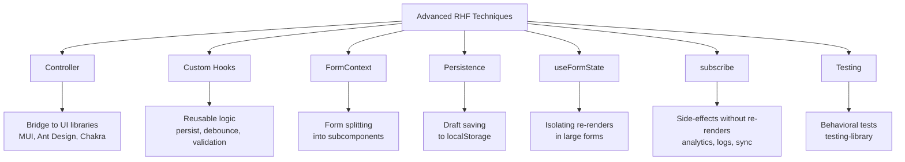
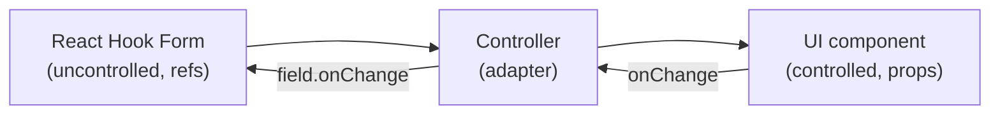
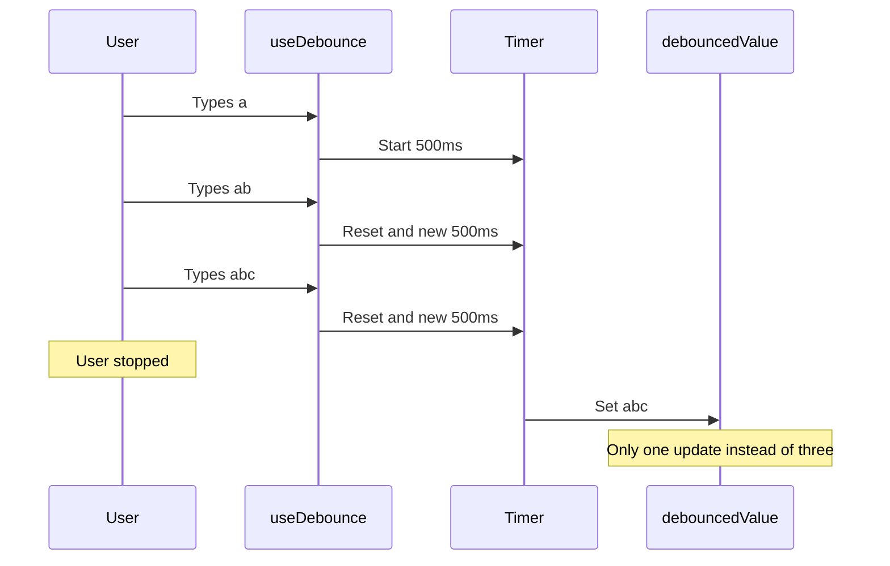
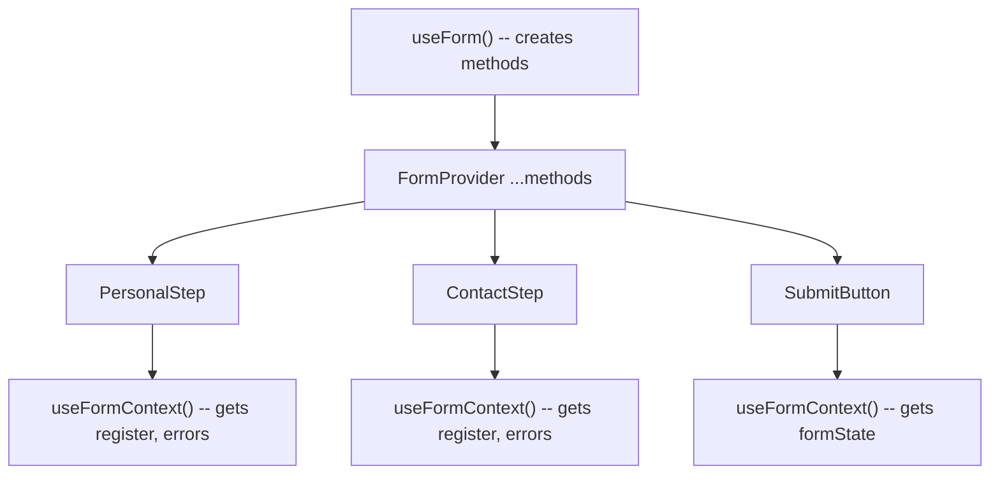
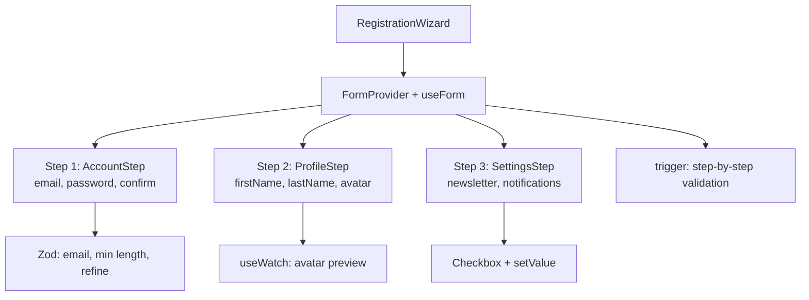

# Level 14: Advanced Techniques -- Controller, Custom Hooks, Context, Persistence

## Introduction

You've come a long way: from the first form with `register` and `handleSubmit` to async validation and autosave. Now it's time to put everything together and master the techniques that turn a collection of forms into a **form architecture** for an application.

Imagine that up to this level, you've been building individual houses. Each house is a separate form with its own validation, state, and logic. Now you'll be designing the **infrastructure of an entire neighborhood**: shared utilities (custom hooks), central management (FormContext), integration with external services (UI libraries), data backup (localStorage persistence), and a monitoring system (useFormState, subscribe, testing).

This level covers eight related topics. Each solves a specific problem you'll encounter in production projects:



---

## Part 1: Integration with UI Libraries

### Controller for Third-Party Components

In real projects, bare HTML `<input>` and `<select>` elements are rarely used. Teams work with UI libraries -- Material UI, Ant Design, Chakra UI, Radix -- where each form element is a **controlled React component** with its own API.

The problem is that `register` works through refs and native DOM events. It expects the element to be a regular `<input>` with `value`, `onChange`, `onBlur`, `ref` properties. But a `<Select>` component from MUI isn't an `<input>`. It has a completely different API: it accepts `value` as a prop, returns the selected object (not a string) via `onChange`, and you can't bind a ref to it directly.

**Controller** solves this problem by acting as an **adapter** (or bridge) between two worlds:



Mental model: Controller is a **translator**. RHF "speaks" the language of refs and DOM events, while MUI Select "speaks" the language of props and React state. Controller translates between them: it receives the `field` object from RHF (with `onChange`, `onBlur`, `value`, `ref`) and passes it to the component in a convenient format.

```tsx
import { Controller, useForm } from 'react-hook-form'
import { TextField, Select, MenuItem } from '@mui/material'

function MyForm() {
  const { control } = useForm()

  return (
    <form>
      <Controller
        name="firstName"
        control={control}
        render={({ field, fieldState: { error } }) => (
          <TextField {...field} label="First Name" error={!!error} helperText={error?.message} />
        )}
      />

      <Controller
        name="category"
        control={control}
        render={({ field }) => (
          <Select {...field}>
            <MenuItem value="electronics">Electronics</MenuItem>
            <MenuItem value="clothing">Clothing</MenuItem>
          </Select>
        )}
      />
    </form>
  )
}
```

### Under the Hood of Controller

When you write `<Controller render={...} />`, the following happens internally:

1. Controller calls `useController({ name, control, rules })` -- an internal RHF hook
2. The hook registers the field in the form (analogous to `register`, but for controlled components)
3. The hook returns a `field` object with `onChange`, `onBlur`, `value`, `ref`, and `name` methods
4. Your `render` function receives this `field` and passes it to the UI component
5. When the user changes the value, the UI component calls `field.onChange` -- and RHF updates its internal store

**Important:** Controller creates a **controlled** component. This means that unlike `register`, the field value is stored in React state (inside RHF), and every change triggers a Controller re-render. For one or two fields this is unnoticeable, but if the entire 30-field form is built on Controller -- performance may suffer.

**Rule:** use `register` for standard HTML elements and Controller only where `register` doesn't work -- for third-party UI components.

### Alternative: useController Hook

If you're building a reusable wrapper component, it's more convenient to use the `useController` hook directly instead of the `<Controller>` JSX component. The result is the same, but the code is cleaner:

```tsx
import { useController, UseControllerProps, Control } from 'react-hook-form'

type FormValues = {
  firstName: string
  lastName: string
}

function FormInput({ control, name, rules }: UseControllerProps<FormValues>) {
  const {
    field: { onChange, onBlur, value, ref },
    fieldState: { invalid, error },
  } = useController({ name, control, rules })

  return (
    <div>
      <input
        onChange={onChange}
        onBlur={onBlur}
        value={value}
        ref={ref}
        placeholder={name}
        style={{ borderColor: invalid ? 'red' : 'gray' }}
      />
      {error && <span style={{ color: 'red' }}>{error.message}</span>}
    </div>
  )
}
```

The difference between `<Controller>` and `useController` is purely stylistic. Controller internally calls `useController`. Choose whichever reads better in your context.

### Custom TextField Component

In production, you shouldn't manually write `<Controller render={...}>` every time. Instead, create a **reusable component** that encapsulates the Controller + UI pairing:

```tsx
// Create a reusable component
function FormTextField({ label, error, ...props }: any) {
  return (
    <div className="form-group">
      {label && <label>{label}</label>}
      <input
        style={{
          borderColor: error ? '#dc3545' : '#ddd',
          width: '100%',
          padding: '0.5rem',
          borderRadius: '4px',
        }}
        {...props}
      />
      {error && <span style={{ color: '#dc3545', fontSize: '0.875rem' }}>{error}</span>}
    </div>
  )
}

// Usage with Controller
;<Controller
  name="email"
  control={control}
  render={({ field, fieldState: { error } }) => (
    <FormTextField {...field} label="Email" error={error?.message} />
  )}
/>
```

### Button Component with Loading

The submit button is another component worth extracting. In production, it should react to form state: disable during submission, show a loading indicator:

```tsx
function FormButton({ children, loading, ...props }: any) {
  return (
    <button
      {...props}
      disabled={loading || props.disabled}
      style={{
        opacity: loading || props.disabled ? 0.7 : 1,
        cursor: loading || props.disabled ? 'not-allowed' : 'pointer',
        position: 'relative',
        paddingRight: loading ? '2rem' : undefined,
      }}
    >
      {children}
      {loading && (
        <span style={{
          position: 'absolute',
          right: '0.75rem',
        }}>
          Loading...
        </span>
      )}
    </button>
  )
}

// Usage
const { formState: { isSubmitting } } = useForm()

<FormButton type="submit" loading={isSubmitting}>
  Submit
</FormButton>
```

### Production Context: How Integration Works in Real Projects

In large teams, a `components/form/` folder is typically created with a set of wrappers:

```
components/form/
├── FormInput.tsx        // text, email, password
├── FormSelect.tsx       // single select
├── FormMultiSelect.tsx  // multi select
├── FormCheckbox.tsx     // checkbox
├── FormDatePicker.tsx   // date picker
├── FormButton.tsx       // submit button with loading
└── index.ts             // re-export
```

Each component accepts `control` and `name`, internally uses `useController`, and wraps a specific UI component from the chosen library. This allows replacing the UI library (e.g., migrating from MUI to Chakra) by changing only these wrappers, not all forms in the project.

---

## Part 2: Custom Hooks

### Why Custom Hooks Are Needed for Forms

Custom hooks solve the **logic duplication** problem. If a project has 10 forms, and each needs autosave to localStorage -- you don't want to copy 20 lines of code 10 times. Instead, you extract the logic into a `useFormPersist` hook and call it in one line.

Additionally, custom hooks create an **abstraction layer**: the form knows *what* it wants (autosave automatically), but not *how* (localStorage, sessionStorage, IndexedDB). If tomorrow you need to migrate from localStorage to server drafts -- you change the hook implementation, not 10 forms.

### useFormPersist -- Saving to localStorage

```tsx
import { useState, useEffect } from 'react'

function useFormPersist<T extends Record<string, any>>(name: string, defaultValues?: T) {
  // Load from localStorage
  const [stored, setStored] = useState<T>(() => {
    const saved = localStorage.getItem(`form-${name}`)
    return saved ? JSON.parse(saved) : defaultValues
  })

  // Save to localStorage
  const save = (values: T) => {
    localStorage.setItem(`form-${name}`, JSON.stringify(values))
    setStored(values)
  }

  // Clear
  const clear = () => {
    localStorage.removeItem(`form-${name}`)
    setStored(defaultValues || ({} as T))
  }

  return { stored, save, clear }
}
```

Usage with React Hook Form:

```tsx
function ArticleForm() {
  const { stored, save, clear } = useFormPersist('article', {
    title: '',
    content: '',
  })

  const { register, handleSubmit, watch, reset } = useForm({
    defaultValues: stored,
  })

  const values = watch()

  // Autosave on change
  useEffect(() => {
    save(values)
  }, [values])

  const onSubmit = (data: any) => {
    console.log('Submitted:', data)
    clear() // Clear after submission
  }

  return (
    <form onSubmit={handleSubmit(onSubmit)}>
      <input {...register('title')} placeholder="Title" />
      <textarea {...register('content')} placeholder="Content" />

      <button type="submit">Publish</button>
      <button type="button" onClick={clear}>
        Clear draft
      </button>
    </form>
  )
}
```

**Note the pattern:** the `useFormPersist` hook knows nothing about React Hook Form. It works with plain objects. This makes it testable and reusable -- it can be applied even with Formik or vanilla React state.

### useDebounce -- Debounce for Values

Debounce is a technique that delays action execution until the user stops triggering it for a specified time. Analogy: an elevator doesn't close its doors immediately after the button is pressed -- it waits until people stop entering.

In the context of forms, debounce is needed for:
- Search as you type (don't send a request on every character)
- Autosave (don't write to localStorage 10 times a second)
- Async validation (don't check username uniqueness on every keystroke)

```tsx
function useDebounce<T>(value: T, delay: number): T {
  const [debouncedValue, setDebouncedValue] = useState<T>(value)

  useEffect(() => {
    const timer = setTimeout(() => {
      setDebouncedValue(value)
    }, delay)

    return () => clearTimeout(timer)
  }, [value, delay])

  return debouncedValue
}
```

How it works step by step:



Usage with a search form:

```tsx
function SearchForm() {
  const { register, watch } = useForm()
  const query = watch('search')
  const debouncedQuery = useDebounce(query, 500)

  useEffect(() => {
    if (debouncedQuery) {
      console.log('Searching for:', debouncedQuery)
      // API call
    }
  }, [debouncedQuery])

  return <input {...register('search')} placeholder="Search..." />
}
```

### useFieldValidation -- Custom Validation

Sometimes you need validation that goes beyond standard RHF rules -- for example, a password strength indicator with multiple levels, or format checking tied to an external service:

```tsx
function useFieldValidation<T>(value: T, validations: Array<(v: T) => string | true>) {
  const [error, setError] = useState<string | null>(null)
  const [isValid, setIsValid] = useState(true)

  useEffect(() => {
    for (const validate of validations) {
      const result = validate(value)
      if (result !== true) {
        setError(result)
        setIsValid(false)
        return
      }
    }
    setError(null)
    setIsValid(true)
  }, [value, validations])

  return { error, isValid }
}

// Usage
function PasswordField() {
  const { watch } = useForm()
  const password = watch('password')

  const { error, isValid } = useFieldValidation(password, [
    v => v.length >= 8 || 'Minimum 8 characters',
    v => /[A-Z]/.test(v) || 'Must have an uppercase letter',
    v => /\d/.test(v) || 'Must have a digit',
  ])

  return (
    <div>
      <input {...register('password')} type="password" />
      {!isValid && error && <span className="error">{error}</span>}
    </div>
  )
}
```

**Tip:** for a password strength indicator, the hook can be modified to return not the first error, but an array of all check results. Then the UI can show which requirements are met (green checkmark) and which aren't (red cross).

---

## Part 3: FormContext (FormProvider)

### Splitting a Form into Subcomponents

As a form grows, it inevitably becomes too large for one component. A 20-field registration form split into 4 sections is 200+ lines of JSX in one component. Readability drops, testability worsens, and teamwork becomes difficult (everyone edits one file).

The solution is to split the form into subcomponents. But a problem arises: subcomponents need access to `register`, `formState`, `watch`, and other `useForm` methods. How to pass them? Through props? That's prop drilling -- passing data through multiple nesting levels.

**FormProvider** and **useFormContext** solve this problem through React Context:



Analogy: FormProvider is a **bulletin board** in an office. Instead of the manager walking to each employee and personally delivering information (prop drilling), they post a notice on the board -- and each employee (subcomponent) can read the data they need via `useFormContext`.

```tsx
import { FormProvider, useForm, useFormContext } from 'react-hook-form'

// Subcomponent with useFormContext
function PersonalStep() {
  const { register } = useFormContext()

  return (
    <>
      <input {...register('firstName')} placeholder="First Name" />
      <input {...register('lastName')} placeholder="Last Name" />
    </>
  )
}

function ContactStep() {
  const { register } = useFormContext()

  return (
    <>
      <input type="email" {...register('email')} placeholder="Email" />
      <input type="tel" {...register('phone')} placeholder="Phone" />
    </>
  )
}

// Parent component with FormProvider
function App() {
  const methods = useForm({
    defaultValues: {
      firstName: '',
      lastName: '',
      email: '',
      phone: '',
    },
  })

  const { handleSubmit } = methods

  const onSubmit = (data: any) => {
    console.log('Submitted:', data)
  }

  return (
    <FormProvider {...methods}>
      <form onSubmit={handleSubmit(onSubmit)}>
        <PersonalStep />
        <ContactStep />
        <button type="submit">Submit</button>
      </form>
    </FormProvider>
  )
}
```

### Under the Hood of FormProvider

FormProvider is a regular React Context Provider. When you write `<FormProvider {...methods}>`, the following happens:

1. All methods from `useForm` (`register`, `handleSubmit`, `watch`, `formState`, `control`, etc.) are placed in the context
2. Any descendant component at any nesting depth can call `useFormContext()` and receive these methods
3. Typing is preserved: if you specified a generic in `useForm<MyFormData>`, subcomponents can use `useFormContext<MyFormData>()` for type-safe access

**Key difference from prop drilling:** FormProvider doesn't create new re-renders. Form values are stored in RHF (not in React state), so passing `methods` through context doesn't cause cascading re-renders on every field change.

### Wizard with FormProvider

Wizard (step-by-step form) is the most common use case for FormProvider. Each step is a separate component, and the common form state is preserved between steps:

```tsx
function WizardForm() {
  const [step, setStep] = useState(1)

  const methods = useForm({
    defaultValues: {
      email: '',
      password: '',
      firstName: '',
      lastName: '',
    },
  })

  const { handleSubmit, trigger } = methods

  const onNext = async () => {
    const fields = step === 1 ? ['email', 'password'] : ['firstName', 'lastName']

    const isValid = await trigger(fields)
    if (isValid) setStep(step + 1)
  }

  return (
    <FormProvider {...methods}>
      <form onSubmit={handleSubmit(onSubmit)}>
        {step === 1 && <AccountStep />}
        {step === 2 && <ProfileStep />}

        <div>
          {step > 1 && (
            <button type="button" onClick={() => setStep(s => s - 1)}>
              Back
            </button>
          )}
          {step < 2 ? (
            <button type="button" onClick={onNext}>
              Next
            </button>
          ) : (
            <button type="submit">Submit</button>
          )}
        </div>
      </form>
    </FormProvider>
  )
}
```

**Key technique:** the `trigger` method allows validating **only specific fields** of the current step. Without it, calling `handleSubmit` would check all form fields, including ones the user hasn't seen yet -- and wouldn't let them proceed.

---

## Part 4: localStorage Persistence

### Why Save Forms

A user fills out 15 fields of a long form, accidentally closes the tab -- and all data is lost. This is one of the most frustrating UX patterns. Autosave to localStorage solves this problem: even after a page reload, the form restores to where the user stopped.

Typical scenarios for localStorage persistence:
- Long forms (questionnaires, applications, surveys)
- Content editors (articles, posts, comments)
- Checkout forms (so you don't have to re-fill after a connection drop)

### Basic Saving

The simplest approach -- load data from localStorage on form initialization and save on every change:

```tsx
function PersistentForm() {
  const { register, reset, watch } = useForm({
    defaultValues: () => {
      const saved = localStorage.getItem('my-form')
      return saved ? JSON.parse(saved) : { name: '', email: '' }
    },
  })

  const values = watch()

  useEffect(() => {
    localStorage.setItem('my-form', JSON.stringify(values))
  }, [values])

  return (
    <form>
      <input {...register('name')} />
      <input type="email" {...register('email')} />
    </form>
  )
}
```

**Note:** `defaultValues` can be a function. RHF calls it once during initialization. This is convenient for lazy computations -- parsing JSON from localStorage happens only on form creation, not on every re-render.

### With Change Subscription

The `watch` method without arguments subscribes to **all** form fields and causes a re-render on every change. For autosave, you can use `watch` with a callback form -- it doesn't cause a re-render, it simply notifies of changes:

```tsx
function FormWithSubscription() {
  const { register, handleSubmit, reset, watch } = useForm({
    defaultValues: { subject: '', body: '' },
  })

  // Load on mount
  useEffect(() => {
    const saved = localStorage.getItem('email-draft')
    if (saved) {
      reset(JSON.parse(saved))
    }
  }, [reset])

  // Save on change (via subscription, without unnecessary re-renders)
  useEffect(() => {
    const subscription = watch(value => {
      localStorage.setItem('email-draft', JSON.stringify(value))
    })
    return () => subscription.unsubscribe()
  }, [watch])

  const onSubmit = (data: any) => {
    localStorage.removeItem('email-draft') // Clear after submission
    console.log('Sent:', data)
  }

  return (
    <form onSubmit={handleSubmit(onSubmit)}>
      <input {...register('subject')} placeholder="Subject" />
      <textarea {...register('body')} placeholder="Message text" />
      <button type="submit">Send</button>
    </form>
  )
}
```

Difference between the two approaches:

| Approach | Re-renders | Usage |
| --- | --- | --- |
| `watch()` without args | Yes, on every change | When you need to show values in the UI |
| `watch(callback)` | No | For side effects: autosave, logging |

**Important:** don't forget to call `subscription.unsubscribe()` in the `useEffect` cleanup function. Without it, the subscription remains active after component unmount, leading to memory leaks and attempts to write to localStorage for a nonexistent form.

---

## Part 5: Final Project -- Registration Form

### Complete Form with Validation and All Techniques

The final project combines everything studied into one form: Zod validation, FormProvider, wizard pattern, useWatch, file upload, and step-by-step navigation with validation at each step.

Project structure:



```tsx
import { useState, useEffect } from 'react'
import { useForm, FormProvider, useWatch } from 'react-hook-form'
import { z } from 'zod'
import { zodResolver } from '@hookform/resolvers/zod'

// Validation schema
const schema = z
  .object({
    // Step 1: Account
    email: z.string().email('Invalid email'),
    password: z.string().min(8, 'Minimum 8 characters'),
    confirm: z.string(),

    // Step 2: Profile
    firstName: z.string().min(1, 'Required'),
    lastName: z.string().min(1, 'Required'),
    avatar: z.instanceof(FileList).optional(),

    // Step 3: Settings
    newsletter: z.boolean().optional(),
    notifications: z.boolean().optional(),
  })
  .refine(data => data.password === data.confirm, {
    message: 'Passwords do not match',
    path: ['confirm'],
  })

type FormData = z.infer<typeof schema>

// Step 1 component
function AccountStep() {
  const {
    register,
    formState: { errors },
  } = useFormContext<FormData>()

  return (
    <>
      <div>
        <label>Email</label>
        <input type="email" {...register('email')} />
        {errors.email && <span className="error">{errors.email.message}</span>}
      </div>

      <div>
        <label>Password</label>
        <input type="password" {...register('password')} />
        {errors.password && <span className="error">{errors.password.message}</span>}
      </div>

      <div>
        <label>Confirm</label>
        <input type="password" {...register('confirm')} />
        {errors.confirm && <span className="error">{errors.confirm.message}</span>}
      </div>
    </>
  )
}

// Step 2 component
function ProfileStep() {
  const {
    register,
    formState: { errors },
  } = useFormContext<FormData>()
  const [preview, setPreview] = useState<string | null>(null)
  const avatar = useWatch({ name: 'avatar' })

  useEffect(() => {
    if (avatar?.[0]) {
      const url = URL.createObjectURL(avatar[0])
      setPreview(url)
      return () => URL.revokeObjectURL(url)
    }
  }, [avatar])

  return (
    <>
      <div>
        <label>First Name</label>
        <input {...register('firstName')} />
        {errors.firstName && <span className="error">{errors.firstName.message}</span>}
      </div>

      <div>
        <label>Last Name</label>
        <input {...register('lastName')} />
        {errors.lastName && <span className="error">{errors.lastName.message}</span>}
      </div>

      <div>
        <label>Avatar</label>
        <input type="file" accept="image/*" {...register('avatar')} />
        {preview && }
      </div>
    </>
  )
}

// Step 3 component
function SettingsStep() {
  const { register } = useFormContext<FormData>()

  return (
    <>
      <label>
        <input type="checkbox" {...register('newsletter')} />
        Subscribe to newsletter
      </label>

      <label>
        <input type="checkbox" {...register('notifications')} />
        Enable notifications
      </label>
    </>
  )
}

// Main wizard component
export function RegistrationWizard() {
  const [step, setStep] = useState(1)

  const methods = useForm<FormData>({
    resolver: zodResolver(schema),
    defaultValues: {
      email: '',
      password: '',
      confirm: '',
      firstName: '',
      lastName: '',
      newsletter: false,
      notifications: false,
    },
  })

  const { handleSubmit, trigger, watch } = methods
  const email = watch('email')

  const onNext = async () => {
    let fields: (keyof FormData)[] = []

    if (step === 1) {
      fields = ['email', 'password', 'confirm']
    } else if (step === 2) {
      fields = ['firstName', 'lastName']
    }

    const isValid = await trigger(fields)
    if (isValid) setStep(step + 1)
  }

  const onSubmit = (data: FormData) => {
    console.log('Registration data:', data)
  }

  return (
    <FormProvider {...methods}>
      <form onSubmit={handleSubmit(onSubmit)}>
        <div style={{ marginBottom: '1rem' }}>Step {step} of 3</div>
        <div style={{ marginBottom: '0.5rem', color: '#666' }}>Email: {email}</div>

        {step === 1 && <AccountStep />}
        {step === 2 && <ProfileStep />}
        {step === 3 && <SettingsStep />}

        <div style={{ marginTop: '1rem', display: 'flex', gap: '0.5rem' }}>
          {step > 1 && (
            <button type="button" onClick={() => setStep(step - 1)}>
              Back
            </button>
          )}

          {step < 3 ? (
            <button type="button" onClick={onNext}>
              Next
            </button>
          ) : (
            <button type="submit">Register</button>
          )}
        </div>
      </form>
    </FormProvider>
  )
}
```

### What This Project Demonstrates

1. **FormProvider** -- shares form state between step components without prop drilling
2. **useFormContext** -- each step accesses register and errors from the shared context
3. **Zod validation** -- schema validates all fields, including cross-field check (password confirmation)
4. **useWatch** -- displays the email value in the header without re-rendering the entire form
5. **useWatch for file preview** -- tracks avatar file and creates a blob URL with proper cleanup
6. **trigger for step validation** -- validates only the current step's fields before allowing progression
7. **Conditional rendering** -- different step components shown based on the `step` state

---

## Part 6: useFormState for Isolated Re-renders

### What Is useFormState?

`useFormState` is a relatively recent addition to React Hook Form. It allows subscribing to specific `formState` properties **in an isolated component**, similar to how `useWatch` isolates field value subscriptions.

The problem it solves: when you destructure `formState` properties in a parent component, the entire component re-renders on every change to those properties. If you have a large form and only a small part of the UI depends on, say, `isSubmitting`, you still re-render the entire form.

```tsx
// Without useFormState -- entire form re-renders on isSubmitting change
function MyForm() {
  const { formState: { isSubmitting } } = useForm()

  return (
    <form>
      {/* Entire form re-renders when isSubmitting changes */}
      <button disabled={isSubmitting}>Submit</button>
    </form>
  )
}

// With useFormState -- only the isolated component re-renders
function SubmitButton() {
  const { isSubmitting } = useFormState({ control })

  return (
    <button disabled={isSubmitting}>
      {isSubmitting ? 'Submitting...' : 'Submit'}
    </button>
  )
}

function MyForm() {
  const { control } = useForm()

  return (
    <form>
      {/* Other parts don't re-render when isSubmitting changes */}
      <SubmitButtonWithControl control={control} />
    </form>
  )
}
```

### When useFormState Is Useful

- Large forms where only specific UI elements depend on form state
- When you want to avoid re-rendering heavy components on state changes
- When building reusable UI components that need access to form state

---

## Part 7: subscribe for Side Effects Without Re-renders

### What Is subscribe?

The `subscribe` method (available on the form instance returned by `useForm`) allows listening to form changes **without causing re-renders**. This is similar to `watch(callback)` but more powerful -- you can subscribe to specific form state properties.

```tsx
function AnalyticsTracker() {
  const { subscribe } = useForm()

  useEffect(() => {
    const unsub = subscribe({
      formState: { isDirty: true },
      callback: (state) => {
        // Called when isDirty changes, without re-rendering
        analytics.track('form_dirty', { timestamp: Date.now() })
      },
    })
    return unsub
  }, [subscribe])

  return null // This component doesn't render anything
}
```

### Typical Use Cases

- **Analytics** -- tracking form interactions without re-rendering
- **Logging** -- recording form state changes for debugging
- **External sync** -- syncing form data with external stores (Redux, Zustand)
- **Autosave** -- saving drafts without triggering UI updates

```tsx
// Syncing form values with Redux
useEffect(() => {
  const unsub = form.subscribe({
    callback: (formState) => {
      dispatch(updateFormDraft(formState.values))
    },
  })
  return unsub
}, [form, dispatch])
```

---

## Part 8: Testing Forms

### Why Testing Forms Matters

Forms are the most interactive part of any application, and they're also the most error-prone. Testing ensures that:
- Validation works correctly
- Submission sends the right data
- Error messages display properly
- UI state (loading, disabled) updates correctly

### Testing with React Testing Library

```tsx
import { render, screen, fireEvent, waitFor } from '@testing-library/react'
import userEvent from '@testing-library/user-event'
import { LoginForm } from './LoginForm'

test('submits valid data', async () => {
  const user = userEvent.setup()
  const onSubmit = vi.fn()

  render(<LoginForm onSubmit={onSubmit} />)

  await user.type(screen.getByLabelText(/email/i), 'test@example.com')
  await user.type(screen.getByLabelText(/password/i), 'password123')
  await user.click(screen.getByRole('button', { name: /log in/i }))

  await waitFor(() => {
    expect(onSubmit).toHaveBeenCalledWith({
      email: 'test@example.com',
      password: 'password123',
    })
  })
})

test('shows validation error for empty email', async () => {
  const user = userEvent.setup()

  render(<LoginForm onSubmit={vi.fn()} />)

  await user.click(screen.getByRole('button', { name: /log in/i }))

  expect(await screen.findByText(/email is required/i)).toBeInTheDocument()
})
```

### Testing Async Validation

```tsx
test('checks username availability', async () => {
  const user = userEvent.setup()

  // Mock the API
  global.fetch = vi.fn(() =>
    Promise.resolve({
      json: () => Promise.resolve({ available: false }),
    })
  )

  render(<RegistrationForm />)

  await user.type(screen.getByLabelText(/username/i), 'admin')
  await user.tab() // Trigger blur

  expect(await screen.findByText(/username is taken/i)).toBeInTheDocument()
})
```

### Testing Form State

```tsx
test('disables button during submission', async () => {
  const user = userEvent.setup()
  let resolvePromise: () => void

  const onSubmit = () =>
    new Promise<void>((resolve) => {
      resolvePromise = resolve
    })

  render(<LoginForm onSubmit={onSubmit} />)

  await user.type(screen.getByLabelText(/email/i), 'test@example.com')
  await user.type(screen.getByLabelText(/password/i), 'password123')
  await user.click(screen.getByRole('button', { name: /log in/i }))

  // Button should be disabled
  expect(screen.getByRole('button', { name: /submitting/i })).toBeDisabled()

  // Resolve the promise
  resolvePromise!()

  // Button should be enabled again
  await waitFor(() => {
    expect(screen.getByRole('button', { name: /log in/i })).toBeEnabled()
  })
})
```

---

## Common Beginner Mistakes

### Mistake 1: Controller for native HTML elements

```tsx
// Wrong -- unnecessary Controller for a standard input
<Controller
  name="email"
  control={control}
  render={({ field }) => <input {...field} />}
/>

// Correct -- register works with native inputs
<input {...register('email')} />
```

**Why this is a mistake:** `register` is faster and simpler for native HTML elements. `Controller` adds unnecessary overhead -- extra re-renders and more code for no benefit.

---

### Mistake 2: Not cleaning up subscriptions

```tsx
// Wrong -- subscription leak
useEffect(() => {
  const subscription = watch(value => {
    localStorage.setItem('draft', JSON.stringify(value))
  })
  // No cleanup!
})

// Correct -- cleanup on unmount
useEffect(() => {
  const subscription = watch(value => {
    localStorage.setItem('draft', JSON.stringify(value))
  })
  return () => subscription.unsubscribe()
}, [watch])
```

**Why this is a mistake:** Without cleanup, the subscription remains active after component unmount, causing memory leaks and attempts to write to storage for a nonexistent form.

---

### Mistake 3: Prop drilling instead of FormProvider

```tsx
// Wrong -- passing form methods through multiple levels
function Wizard() {
  const methods = useForm()
  return <Step1 register={methods.register} errors={methods.formState.errors} />
}

function Step1({ register, errors }) {
  return <SubStep register={register} errors={errors} />
}

// Correct -- FormProvider eliminates prop drilling
function Wizard() {
  const methods = useForm()
  return (
    <FormProvider {...methods}>
      <Step1 />
    </FormProvider>
  )
}

function Step1() {
  const { register } = useFormContext()
  return <SubStep />
}
```

---

### Mistake 4: Not isolating re-renders in large forms

```tsx
// Wrong -- entire form re-renders on every state change
function LargeForm() {
  const { formState: { isSubmitting } } = useForm()
  // 50 fields...
  return <button disabled={isSubmitting}>Submit</button>
}

// Correct -- isolate state-dependent components
function SubmitButton({ control }) {
  const { isSubmitting } = useFormState({ control })
  return <button disabled={isSubmitting}>Submit</button>
}
```

---

### Mistake 5: Not testing form behavior

Forms are the most error-prone part of any application. Not testing them means shipping bugs to production. At minimum, test:
- Validation rules work
- Submission sends correct data
- Error messages display
- Loading states work correctly

---

## Additional Resources

- [Controller documentation](https://react-hook-form.com/docs/usecontroller/controller)
- [FormProvider documentation](https://react-hook-form.com/docs/formprovider)
- [useFormContext documentation](https://react-hook-form.com/docs/useformcontext)
- [subscribe documentation](https://react-hook-form.com/docs/useform/subscribe)
- [Testing React Hook Form](https://react-hook-form.com/advanced-usage#TestingForm)

---

## What's Next?

You've now completed the full React Hook Form course! You've learned:

- Basic form creation with `useForm`, `register`, and `handleSubmit`
- Validation: built-in rules, patterns, custom validation, Zod, Yup
- Complex fields: Controller, radio, select, checkbox groups
- Files and dates: upload, preview, date ranges
- Dynamic forms: useFieldArray, conditional fields, wizards
- Form state: dirty, touched, reset, isSubmitSuccessful
- Focus and accessibility: setFocus, ARIA attributes, keyboard navigation
- Performance: useWatch, memo, shouldUnregister, delayError
- Async: server validation, data loading, debounce
- Submission and autosave: loading states, error handling, draft saving
- Advanced techniques: FormProvider, custom hooks, localStorage persistence, testing

You're now equipped to build any form scenario in production. The key principles to remember:

1. Use `register` for native elements, `Controller` for third-party components
2. Validate with schemas (Zod/Yup) for maintainability
3. Isolate re-renders with `useWatch` and `memo` in large forms
4. Always handle loading and error states in submission
5. Test your forms -- they're the most interactive part of your application
