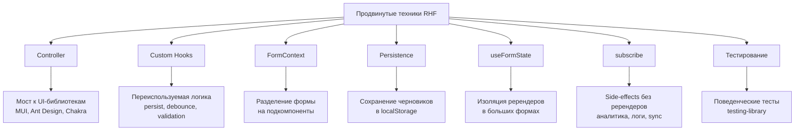
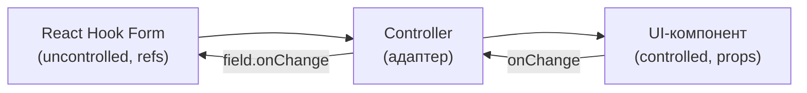
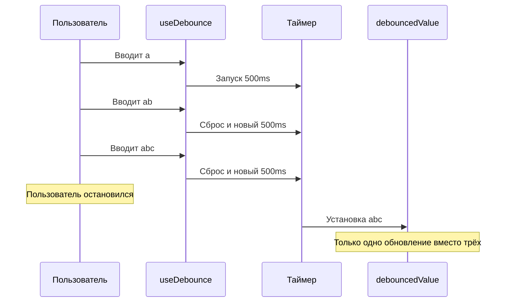
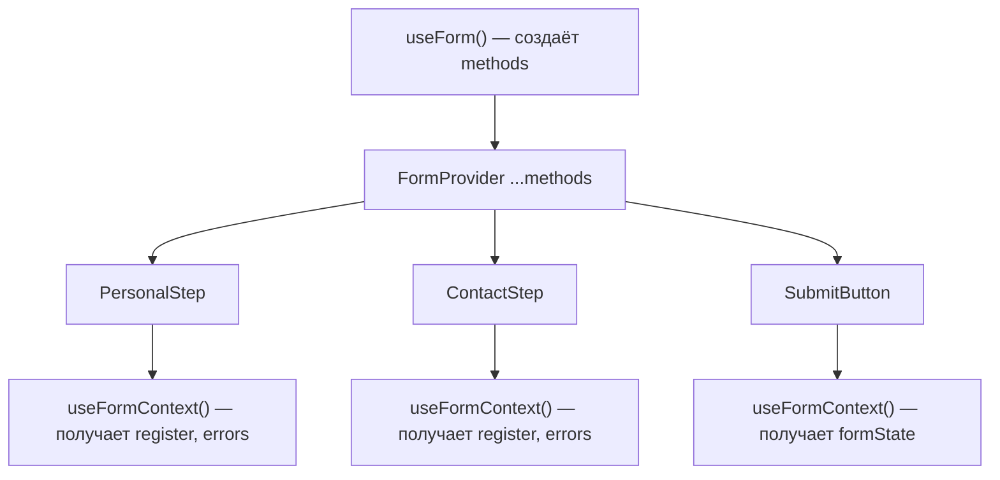
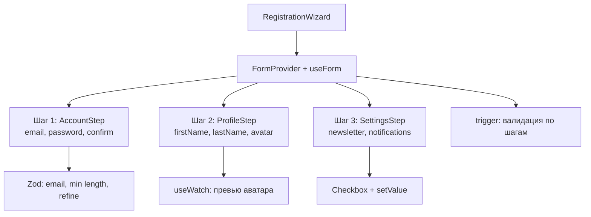
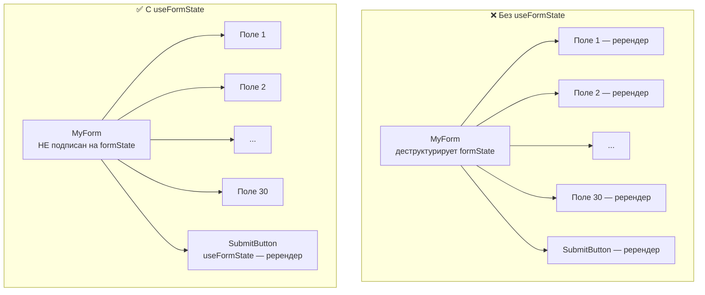
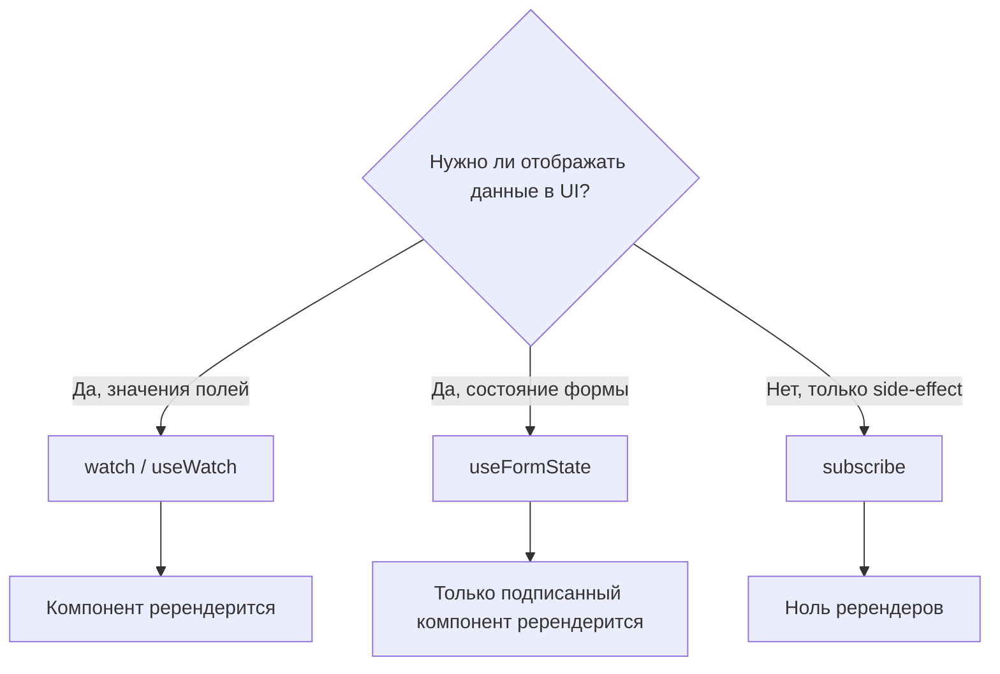
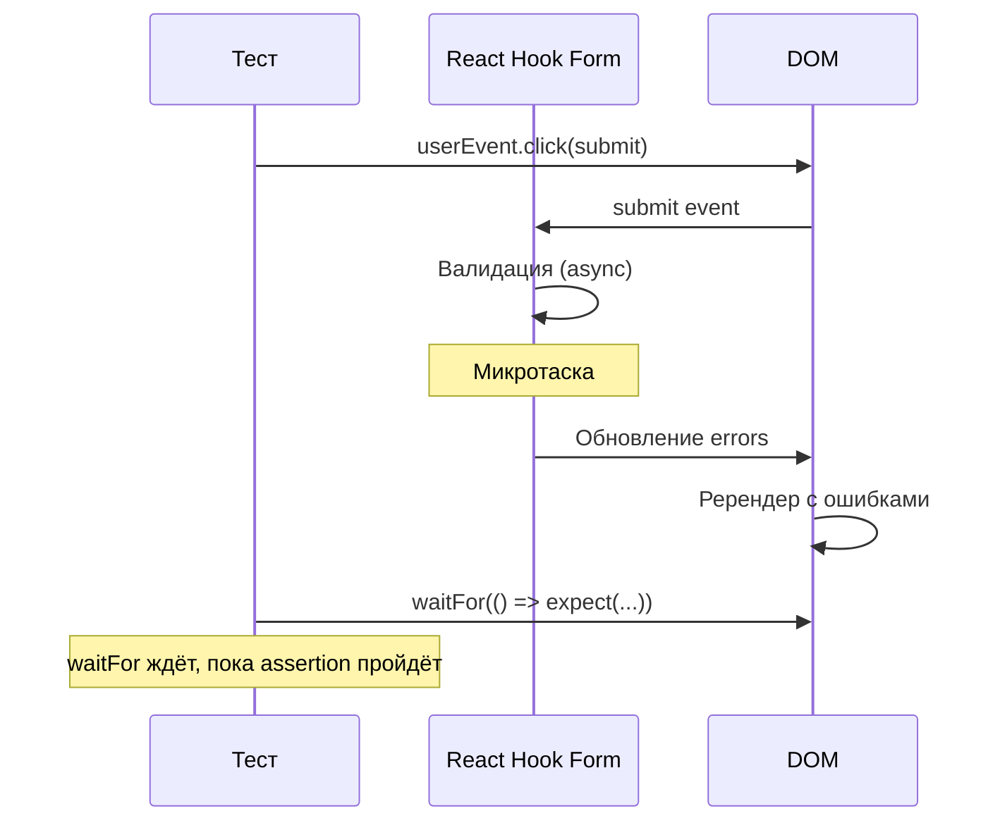

# Уровень 8: Продвинутые техники — Controller, Custom Hooks, Context, Persistence

## Введение

Вы прошли долгий путь: от первой формы с `register` и `handleSubmit` до async-валидации и автосохранения. Теперь пришло время собрать всё воедино и освоить техники, которые превращают набор форм в **архитектуру форм** приложения.

Представьте, что до этого уровня вы строили отдельные дома. Каждый дом — отдельная форма со своей валидацией, состоянием, логикой. Теперь вы будете проектировать **инфраструктуру целого квартала**: общие коммуникации (кастомные хуки), центральное управление (FormContext), интеграция с внешними сервисами (UI-библиотеки), резервное копирование данных (localStorage persistence) и система мониторинга (useFormState, subscribe, тестирование).

Этот уровень охватывает восемь связанных тем. Каждая из них решает конкретную проблему, с которой вы столкнётесь в продакшн-проекте:



---

## Часть 1: Интеграция с UI-библиотеками

### Controller для сторонних компонентов

В реальных проектах редко используют голые HTML-элементы `<input>` и `<select>`. Команды работают с UI-библиотеками — Material UI, Ant Design, Chakra UI, Radix — где каждый элемент формы является **контролируемым React-компонентом** со своим API.

Проблема в том, что `register` работает через рефы и нативные DOM-события. Он ожидает, что элемент — это обычный `<input>`, у которого есть свойства `value`, `onChange`, `onBlur`, `ref`. Но компонент `<Select>` из MUI — это не `<input>`. У него совершенно другой API: он принимает `value` как проп, возвращает выбранный объект (а не строку) через `onChange`, и к нему нельзя привязать реф напрямую.

**Controller** решает эту проблему, выступая в роли **адаптера** (или моста) между двумя мирами:



Ментальная модель: Controller — это **переводчик**. RHF «говорит» на языке рефов и DOM-событий, а MUI Select «говорит» на языке пропсов и React-состояния. Controller переводит между ними: получает `field` объект от RHF (с `onChange`, `onBlur`, `value`, `ref`) и передаёт его компоненту в удобном формате.

```tsx
import { Controller, useForm } from 'react-hook-form'
import { TextField, Select, MenuItem } from '@mui/material'

function MyForm() {
  const { control } = useForm()

  return (
    <form>
      <Controller
        name="firstName"
        control={control}
        render={({ field, fieldState: { error } }) => (
          <TextField {...field} label="First Name" error={!!error} helperText={error?.message} />
        )}
      />

      <Controller
        name="category"
        control={control}
        render={({ field }) => (
          <Select {...field}>
            <MenuItem value="electronics">Электроника</MenuItem>
            <MenuItem value="clothing">Одежда</MenuItem>
          </Select>
        )}
      />
    </form>
  )
}
```

### Под капотом Controller

Когда вы пишете `<Controller render={...} />`, внутри происходит следующее:

1. Controller вызывает `useController({ name, control, rules })` — внутренний хук RHF
2. Хук регистрирует поле в форме (аналог `register`, но для контролируемых компонентов)
3. Хук возвращает объект `field` с методами `onChange`, `onBlur`, `value`, `ref` и `name`
4. Ваша `render`-функция получает этот `field` и передаёт его UI-компоненту
5. Когда пользователь меняет значение, UI-компонент вызывает `field.onChange` — и RHF обновляет своё внутреннее хранилище

📌 **Важно:** Controller создаёт **контролируемый** компонент. Это значит, что в отличие от `register`, значение поля хранится в React-состоянии (внутри RHF), и при каждом изменении происходит ререндер Controller. Для одного-двух полей это незаметно, но если вся форма из 30 полей построена на Controller — производительность может пострадать.

💡 **Правило:** используйте `register` для стандартных HTML-элементов и Controller только там, где `register` не работает — для сторонних UI-компонентов.

### Альтернатива: хук useController

Если вы строите переиспользуемый компонент-обёртку, удобнее использовать хук `useController` напрямую вместо JSX-компонента `<Controller>`. Результат тот же, но код чище:

```tsx
import { useController, UseControllerProps, Control } from 'react-hook-form'

type FormValues = {
  firstName: string
  lastName: string
}

function FormInput({ control, name, rules }: UseControllerProps<FormValues>) {
  const {
    field: { onChange, onBlur, value, ref },
    fieldState: { invalid, error },
  } = useController({ name, control, rules })

  return (
    <div>
      <input
        onChange={onChange}
        onBlur={onBlur}
        value={value}
        ref={ref}
        placeholder={name}
        style={{ borderColor: invalid ? 'red' : 'gray' }}
      />
      {error && <span style={{ color: 'red' }}>{error.message}</span>}
    </div>
  )
}
```

Разница между `<Controller>` и `useController` — чисто стилистическая. Controller внутри вызывает `useController`. Выбирайте то, что лучше читается в вашем контексте.

### Кастомный компонент TextField

В продакшне не стоит каждый раз вручную писать `<Controller render={...}>`. Вместо этого создайте **переиспользуемый компонент**, который инкапсулирует связку Controller + UI:

```tsx
// Создаём переиспользуемый компонент
function FormTextField({ label, error, ...props }: any) {
  return (
    <div className="form-group">
      {label && <label>{label}</label>}
      <input
        style={{
          borderColor: error ? '#dc3545' : '#ddd',
          width: '100%',
          padding: '0.5rem',
          borderRadius: '4px',
        }}
        {...props}
      />
      {error && <span style={{ color: '#dc3545', fontSize: '0.875rem' }}>{error}</span>}
    </div>
  )
}

// Использование с Controller
;<Controller
  name="email"
  control={control}
  render={({ field, fieldState: { error } }) => (
    <FormTextField {...field} label="Email" error={error?.message} />
  )}
/>
```

### Компонент Button с loading

Кнопка отправки — ещё один компонент, который стоит вынести. В продакшне она должна реагировать на состояние формы: блокироваться во время отправки, показывать индикатор загрузки:

```tsx
function FormButton({ children, loading, ...props }: any) {
  return (
    <button
      {...props}
      disabled={loading || props.disabled}
      style={{
        opacity: loading || props.disabled ? 0.7 : 1,
        cursor: loading || props.disabled ? 'not-allowed' : 'pointer',
        position: 'relative',
        paddingRight: loading ? '2rem' : undefined,
      }}
    >
      {children}
      {loading && (
        <span style={{
          position: 'absolute',
          right: '0.75rem',
        }}>
          ⏳
        </span>
      )}
    </button>
  )
}

// Использование
const { formState: { isSubmitting } } = useForm()

<FormButton type="submit" loading={isSubmitting}>
  Отправить
</FormButton>
```

### Продакшн-контекст: как устроена интеграция в реальных проектах

В больших командах обычно создают папку `components/form/` с набором обёрток:

```
components/form/
├── FormInput.tsx        // text, email, password
├── FormSelect.tsx       // single select
├── FormMultiSelect.tsx  // multi select
├── FormCheckbox.tsx     // checkbox
├── FormDatePicker.tsx   // date picker
├── FormButton.tsx       // submit button с loading
└── index.ts             // реэкспорт
```

Каждый компонент принимает `control` и `name`, внутри использует `useController`, и оборачивает конкретный UI-компонент из выбранной библиотеки. Это позволяет заменить UI-библиотеку (например, мигрировать с MUI на Chakra), изменив только эти обёртки, а не все формы в проекте.

---

## Часть 2: Кастомные хуки

### Зачем нужны кастомные хуки для форм

Кастомные хуки решают проблему **дублирования логики**. Если в проекте 10 форм, и в каждой нужно автосохранение в localStorage — вы не хотите копировать 20 строк кода 10 раз. Вместо этого вы выносите логику в хук `useFormPersist` и вызываете его одной строкой.

Кроме того, кастомные хуки создают **слой абстракции**: форма знает, *что* она хочет (сохраняться автоматически), но не знает *как* (localStorage, sessionStorage, IndexedDB). Если завтра нужно мигрировать с localStorage на серверные черновики — меняете реализацию хука, а не 10 форм.

### useFormPersist — сохранение в localStorage

```tsx
import { useState, useEffect } from 'react'

function useFormPersist<T extends Record<string, any>>(name: string, defaultValues?: T) {
  // Загрузка из localStorage
  const [stored, setStored] = useState<T>(() => {
    const saved = localStorage.getItem(`form-${name}`)
    return saved ? JSON.parse(saved) : defaultValues
  })

  // Сохранение в localStorage
  const save = (values: T) => {
    localStorage.setItem(`form-${name}`, JSON.stringify(values))
    setStored(values)
  }

  // Очистка
  const clear = () => {
    localStorage.removeItem(`form-${name}`)
    setStored(defaultValues || ({} as T))
  }

  return { stored, save, clear }
}
```

Использование с React Hook Form:

```tsx
function ArticleForm() {
  const { stored, save, clear } = useFormPersist('article', {
    title: '',
    content: '',
  })

  const { register, handleSubmit, watch, reset } = useForm({
    defaultValues: stored,
  })

  const values = watch()

  // Автосохранение при изменении
  useEffect(() => {
    save(values)
  }, [values])

  const onSubmit = (data: any) => {
    console.log('Submitted:', data)
    clear() // Очистить после отправки
  }

  return (
    <form onSubmit={handleSubmit(onSubmit)}>
      <input {...register('title')} placeholder="Заголовок" />
      <textarea {...register('content')} placeholder="Содержание" />

      <button type="submit">Опубликовать</button>
      <button type="button" onClick={clear}>
        Очистить черновик
      </button>
    </form>
  )
}
```

📌 **Обратите внимание на паттерн:** хук `useFormPersist` не знает ничего о React Hook Form. Он работает с обычными объектами. Это делает его тестируемым и переиспользуемым — можно применить даже с Formik или ванильным React-состоянием.

### useDebounce — debounce для значений

Debounce — это техника, которая откладывает выполнение действия до тех пор, пока пользователь не перестанет его вызывать на протяжении заданного времени. Аналогия: лифт не закрывает двери сразу после нажатия кнопки — он ждёт, пока люди перестанут заходить.

В контексте форм debounce нужен для:
- Поиска по мере ввода (не отправлять запрос на каждый символ)
- Автосохранения (не записывать в localStorage 10 раз в секунду)
- Асинхронной валидации (не проверять уникальность username при каждом нажатии)

```tsx
function useDebounce<T>(value: T, delay: number): T {
  const [debouncedValue, setDebouncedValue] = useState<T>(value)

  useEffect(() => {
    const timer = setTimeout(() => {
      setDebouncedValue(value)
    }, delay)

    return () => clearTimeout(timer)
  }, [value, delay])

  return debouncedValue
}
```

Как это работает пошагово:



Использование с формой поиска:

```tsx
function SearchForm() {
  const { register, watch } = useForm()
  const query = watch('search')
  const debouncedQuery = useDebounce(query, 500)

  useEffect(() => {
    if (debouncedQuery) {
      console.log('Searching for:', debouncedQuery)
      // API call
    }
  }, [debouncedQuery])

  return <input {...register('search')} placeholder="Поиск..." />
}
```

### useFieldValidation — кастомная валидация

Иногда нужна валидация, которая выходит за рамки стандартных правил RHF — например, индикатор сложности пароля с несколькими уровнями, или проверка формата, привязанная к внешнему сервису:

```tsx
function useFieldValidation<T>(value: T, validations: Array<(v: T) => string | true>) {
  const [error, setError] = useState<string | null>(null)
  const [isValid, setIsValid] = useState(true)

  useEffect(() => {
    for (const validate of validations) {
      const result = validate(value)
      if (result !== true) {
        setError(result)
        setIsValid(false)
        return
      }
    }
    setError(null)
    setIsValid(true)
  }, [value, validations])

  return { error, isValid }
}

// Использование
function PasswordField() {
  const { watch } = useForm()
  const password = watch('password')

  const { error, isValid } = useFieldValidation(password, [
    v => v.length >= 8 || 'Минимум 8 символов',
    v => /[A-Z]/.test(v) || 'Должна быть заглавная буква',
    v => /\d/.test(v) || 'Должна быть цифра',
  ])

  return (
    <div>
      <input {...register('password')} type="password" />
      {!isValid && error && <span className="error">{error}</span>}
    </div>
  )
}
```

💡 **Совет:** для индикатора сложности пароля можно модифицировать хук так, чтобы он возвращал не первую ошибку, а массив результатов всех проверок. Тогда UI сможет показать, какие требования уже выполнены (зелёная галочка), а какие нет (красный крестик).

---

## Часть 3: FormContext (FormProvider)

### Разделение формы на подкомпоненты

По мере роста формы она неизбежно становится слишком большой для одного компонента. Форма регистрации из 20 полей, разбитых на 4 секции, — это 200+ строк JSX в одном компоненте. Читаемость падает, тестируемость ухудшается, а командная работа затрудняется (все правят один файл).

Решение — разбить форму на подкомпоненты. Но возникает проблема: подкомпонентам нужен доступ к `register`, `formState`, `watch` и другим методам `useForm`. Как передать их? Через пропсы? Это prop drilling — передача данных через несколько уровней вложенности.

**FormProvider** и **useFormContext** решают эту проблему через React Context:



Аналогия: FormProvider — это **доска объявлений** в офисе. Вместо того чтобы руководитель ходил к каждому сотруднику и лично передавал информацию (prop drilling), он вешает объявление на доску — и каждый сотрудник (подкомпонент) может сам прочитать нужные данные через `useFormContext`.

```tsx
import { FormProvider, useForm, useFormContext } from 'react-hook-form'

// Подкомпонент с useFormContext
function PersonalStep() {
  const { register } = useFormContext()

  return (
    <>
      <input {...register('firstName')} placeholder="Имя" />
      <input {...register('lastName')} placeholder="Фамилия" />
    </>
  )
}

function ContactStep() {
  const { register } = useFormContext()

  return (
    <>
      <input type="email" {...register('email')} placeholder="Email" />
      <input type="tel" {...register('phone')} placeholder="Телефон" />
    </>
  )
}

// Родительский компонент с FormProvider
function App() {
  const methods = useForm({
    defaultValues: {
      firstName: '',
      lastName: '',
      email: '',
      phone: '',
    },
  })

  const { handleSubmit } = methods

  const onSubmit = (data: any) => {
    console.log('Submitted:', data)
  }

  return (
    <FormProvider {...methods}>
      <form onSubmit={handleSubmit(onSubmit)}>
        <PersonalStep />
        <ContactStep />
        <button type="submit">Отправить</button>
      </form>
    </FormProvider>
  )
}
```

### Под капотом FormProvider

FormProvider — это обычный React Context Provider. Когда вы пишете `<FormProvider {...methods}>`, происходит следующее:

1. Все методы из `useForm` (`register`, `handleSubmit`, `watch`, `formState`, `control` и т.д.) помещаются в контекст
2. Любой дочерний компонент на любой глубине вложенности может вызвать `useFormContext()` и получить эти методы
3. Типизация сохраняется: если вы указали дженерик в `useForm<MyFormData>`, подкомпоненты могут использовать `useFormContext<MyFormData>()` для типобезопасного доступа

📌 **Важное отличие от prop drilling:** FormProvider не создаёт новые ререндеры. Значения формы хранятся в RHF (не в React-состоянии), поэтому передача `methods` через контекст не приводит к каскадным ререндерам при каждом изменении поля.

### Wizard с FormProvider

Wizard (пошаговая форма) — самый частый use case для FormProvider. Каждый шаг — отдельный компонент, а общее состояние формы сохраняется между шагами:

```tsx
function WizardForm() {
  const [step, setStep] = useState(1)

  const methods = useForm({
    defaultValues: {
      email: '',
      password: '',
      firstName: '',
      lastName: '',
    },
  })

  const { handleSubmit, trigger } = methods

  const onNext = async () => {
    const fields = step === 1 ? ['email', 'password'] : ['firstName', 'lastName']

    const isValid = await trigger(fields)
    if (isValid) setStep(step + 1)
  }

  return (
    <FormProvider {...methods}>
      <form onSubmit={handleSubmit(onSubmit)}>
        {step === 1 && <AccountStep />}
        {step === 2 && <ProfileStep />}

        <div>
          {step > 1 && (
            <button type="button" onClick={() => setStep(s => s - 1)}>
              ←
            </button>
          )}
          {step < 2 ? (
            <button type="button" onClick={onNext}>
              →
            </button>
          ) : (
            <button type="submit">Отправить</button>
          )}
        </div>
      </form>
    </FormProvider>
  )
}
```

🔥 **Ключевой приём:** метод `trigger` позволяет валидировать **только конкретные поля** текущего шага. Без него вызов `handleSubmit` проверял бы все поля формы, включая те, которые пользователь ещё не видел — и не пускал бы его дальше.

---

## Часть 4: localStorage Persistence

### Зачем сохранять форму

Пользователь заполнил 15 полей длинной формы, случайно закрыл вкладку — и все данные потеряны. Это один из самых раздражающих UX-паттернов. Автосохранение в localStorage решает эту проблему: даже после перезагрузки страницы форма восстанавливается с того места, где пользователь остановился.

Типичные сценарии для localStorage persistence:
- Длинные формы (анкеты, заявки, опросы)
- Редакторы контента (статьи, посты, комментарии)
- Формы оформления заказа (чтобы не заполнять заново после разрыва соединения)

### Базовое сохранение

Самый простой подход — загрузить данные из localStorage при инициализации формы и сохранять при каждом изменении:

```tsx
function PersistentForm() {
  const { register, reset, watch } = useForm({
    defaultValues: () => {
      const saved = localStorage.getItem('my-form')
      return saved ? JSON.parse(saved) : { name: '', email: '' }
    },
  })

  const values = watch()

  useEffect(() => {
    localStorage.setItem('my-form', JSON.stringify(values))
  }, [values])

  return (
    <form>
      <input {...register('name')} />
      <input type="email" {...register('email')} />
    </form>
  )
}
```

💡 **Обратите внимание:** `defaultValues` может быть функцией. RHF вызовет её один раз при инициализации. Это удобно для ленивых вычислений — парсинг JSON из localStorage происходит только при создании формы, а не при каждом ререндере.

### С подпиской на изменения

Метод `watch` без аргументов подписывается на **все** поля формы и вызывает ререндер при каждом изменении. Для автосохранения можно использовать `watch` с callback-формой — она не вызывает ререндер, а просто уведомляет о изменениях:

```tsx
function FormWithSubscription() {
  const { register, handleSubmit, reset, watch } = useForm({
    defaultValues: { subject: '', body: '' },
  })

  // Загрузка при монтировании
  useEffect(() => {
    const saved = localStorage.getItem('email-draft')
    if (saved) {
      reset(JSON.parse(saved))
    }
  }, [reset])

  // Сохранение при изменении (через подписку, без лишних ререндеров)
  useEffect(() => {
    const subscription = watch(value => {
      localStorage.setItem('email-draft', JSON.stringify(value))
    })
    return () => subscription.unsubscribe()
  }, [watch])

  const onSubmit = (data: any) => {
    localStorage.removeItem('email-draft') // Очистить после отправки
    console.log('Sent:', data)
  }

  return (
    <form onSubmit={handleSubmit(onSubmit)}>
      <input {...register('subject')} placeholder="Тема" />
      <textarea {...register('body')} placeholder="Текст письма" />
      <button type="submit">Отправить</button>
    </form>
  )
}
```

Разница между двумя подходами:

| Подход | Ререндеры | Использование |
| --- | --- | --- |
| `watch()` без аргументов | Да, при каждом изменении | Когда нужно показывать значения в UI |
| `watch(callback)` | Нет | Для side-effects: автосохранение, логирование |

⚠️ **Важно:** не забывайте вызывать `subscription.unsubscribe()` в cleanup-функции `useEffect`. Без этого подписка останется активной после размонтирования компонента, что приведёт к утечке памяти и попыткам записи в localStorage для несуществующей формы.

---

## Часть 5: Финальный проект — Форма регистрации

### Полная форма с валидацией и всеми техниками

Финальный проект объединяет всё изученное в одну форму: Zod-валидацию, FormProvider, wizard-паттерн, useWatch, загрузку файлов и пошаговую навигацию с валидацией каждого шага.

Структура проекта:



```tsx
import { useState, useEffect } from 'react'
import { useForm, FormProvider, useWatch } from 'react-hook-form'
import { z } from 'zod'
import { zodResolver } from '@hookform/resolvers/zod'

// Схема валидации
const schema = z
  .object({
    // Шаг 1: Аккаунт
    email: z.string().email('Неверный email'),
    password: z.string().min(8, 'Минимум 8 символов'),
    confirm: z.string(),

    // Шаг 2: Профиль
    firstName: z.string().min(1, 'Обязательно'),
    lastName: z.string().min(1, 'Обязательно'),
    avatar: z.instanceof(FileList).optional(),

    // Шаг 3: Настройки
    newsletter: z.boolean().optional(),
    notifications: z.boolean().optional(),
  })
  .refine(data => data.password === data.confirm, {
    message: 'Пароли не совпадают',
    path: ['confirm'],
  })

type FormData = z.infer<typeof schema>

// Компонент шага 1
function AccountStep() {
  const {
    register,
    formState: { errors },
  } = useFormContext<FormData>()

  return (
    <>
      <div>
        <label>Email</label>
        <input type="email" {...register('email')} />
        {errors.email && <span className="error">{errors.email.message}</span>}
      </div>

      <div>
        <label>Password</label>
        <input type="password" {...register('password')} />
        {errors.password && <span className="error">{errors.password.message}</span>}
      </div>

      <div>
        <label>Confirm</label>
        <input type="password" {...register('confirm')} />
        {errors.confirm && <span className="error">{errors.confirm.message}</span>}
      </div>
    </>
  )
}

// Компонент шага 2
function ProfileStep() {
  const {
    register,
    formState: { errors },
  } = useFormContext<FormData>()
  const [preview, setPreview] = useState<string | null>(null)
  const avatar = useWatch({ name: 'avatar' })

  useEffect(() => {
    if (avatar?.[0]) {
      const url = URL.createObjectURL(avatar[0])
      setPreview(url)
      return () => URL.revokeObjectURL(url)
    }
  }, [avatar])

  return (
    <>
      <div>
        <label>First Name</label>
        <input {...register('firstName')} />
        {errors.firstName && <span className="error">{errors.firstName.message}</span>}
      </div>

      <div>
        <label>Last Name</label>
        <input {...register('lastName')} />
        {errors.lastName && <span className="error">{errors.lastName.message}</span>}
      </div>

      <div>
        <label>Avatar</label>
        <input
          type="file"
          accept="image/*"
          {...register('avatar')}
          onChange={e => {
            const file = e.target.files?.[0]
            if (file) setPreview(URL.createObjectURL(file))
          }}
        />
        {preview && }
      </div>
    </>
  )
}

// Компонент шага 3
function SettingsStep() {
  const { register, watch, setValue } = useFormContext<FormData>()

  return (
    <>
      <label>
        <input type="checkbox" {...register('newsletter')} />
        Подписаться на рассылку
      </label>

      <label>
        <input
          type="checkbox"
          checked={watch('notifications')}
          onChange={e => setValue('notifications', e.target.checked)}
        />
        Уведомления
      </label>
    </>
  )
}

// Главная форма
export function RegistrationWizard() {
  const [step, setStep] = useState(1)
  const [submitted, setSubmitted] = useState<FormData | null>(null)

  const methods = useForm<FormData>({
    resolver: zodResolver(schema),
    mode: 'onChange',
    defaultValues: {
      newsletter: false,
      notifications: false,
    },
  })

  const { handleSubmit, trigger } = methods

  const onNext = async () => {
    const fields =
      step === 1 ? ['email', 'password', 'confirm'] : step === 2 ? ['firstName', 'lastName'] : []

    const valid = await trigger(fields)
    if (valid) setStep(step + 1)
  }

  const onSubmit = (data: FormData) => {
    setSubmitted(data)
    console.log('Registered:', data)
  }

  if (submitted) {
    return (
      <div>
        <h2>Регистрация завершена!</h2>
        <pre>{JSON.stringify(submitted, null, 2)}</pre>
        <button
          onClick={() => {
            setSubmitted(null)
            setStep(1)
          }}
        >
          Начать заново
        </button>
      </div>
    )
  }

  return (
    <FormProvider {...methods}>
      <form onSubmit={handleSubmit(onSubmit)}>
        <div>Шаг {step} из 3</div>

        {step === 1 && <AccountStep />}
        {step === 2 && <ProfileStep />}
        {step === 3 && <SettingsStep />}

        <div>
          {step > 1 && (
            <button type="button" onClick={() => setStep(s => s - 1)}>
              ←
            </button>
          )}
          {step < 3 ? (
            <button type="button" onClick={onNext}>
              →
            </button>
          ) : (
            <button type="submit">Завершить</button>
          )}
        </div>
      </form>
    </FormProvider>
  )
}
```

### Архитектурные решения в этом примере

Стоит обратить внимание на несколько решений, которые делают этот код продакшн-ready:

1. **Единая Zod-схема для всех шагов.** Валидация определена в одном месте, а не размазана по компонентам шагов. При изменении требований нужно поправить только схему.

2. **`trigger` с массивом полей.** Каждый шаг валидирует только свои поля. Пользователь не увидит ошибки полей, до которых ещё не дошёл.

3. **`mode: 'onChange'`** даёт мгновенную обратную связь. Пользователь видит ошибки при вводе, а не только при попытке перейти на следующий шаг.

4. **`useFormContext` в подкомпонентах** избавляет от prop drilling. Добавить новый шаг — создать компонент и вызвать `useFormContext`.

5. **`useWatch` для превью аватара.** Вместо локального state, который дублирует значение формы, `useWatch` подписывается на поле напрямую.

---

## Часть 6: useFormState — изоляция ререндеров

### Проблема

Когда вы деструктурируете `formState` из `useForm`, **весь компонент** подписывается на изменения этих свойств. В форме с 30 полями, где `formState.errors` обновляется при каждом изменении любого поля, это может стать узким местом: родительский компонент ререндерится, а вместе с ним — все дочерние компоненты.



### Решение: useFormState

Хук `useFormState` позволяет подписаться на `formState` в **отдельном компоненте**, изолируя ререндеры. Вместо того чтобы родительская форма реагировала на каждое изменение ошибок, вы выносите подписку в маленький компонент, который ререндерится сам по себе:

```tsx
import { useForm, useFormState } from 'react-hook-form'

// Этот компонент ререндерится ТОЛЬКО когда меняются isSubmitting или isValid
function SubmitButton({ control }: { control: Control }) {
  const { isSubmitting, isValid } = useFormState({ control })

  return (
    <button type="submit" disabled={!isValid || isSubmitting}>
      {isSubmitting ? 'Отправка...' : 'Отправить'}
    </button>
  )
}

// Этот компонент ререндерится ТОЛЬКО когда меняются errors
function ErrorSummary({ control }: { control: Control }) {
  const { errors } = useFormState({ control })

  if (Object.keys(errors).length === 0) return null

  return (
    <div style={{ color: 'red' }}>
      {Object.entries(errors).map(([field, error]) => (
        <p key={field}>{error?.message as string}</p>
      ))}
    </div>
  )
}

// Родительский компонент НЕ подписан на formState — не ререндерится
function MyForm() {
  const { register, handleSubmit, control } = useForm({
    mode: 'onChange',
  })

  return (
    <form onSubmit={handleSubmit(onSubmit)}>
      <input {...register('email', { required: 'Обязательно' })} />
      <input {...register('name', { required: 'Обязательно' })} />

      <ErrorSummary control={control} />
      <SubmitButton control={control} />
    </form>
  )
}
```

### Под капотом useFormState

`useFormState` использует тот же механизм подписки, что и деструктуризация `formState` из `useForm`, но с одним ключевым отличием: подписка привязана к **конкретному компоненту**, а не к родительскому компоненту формы.

Когда вы пишете `const { isSubmitting } = useFormState({ control })`, RHF:
1. Создаёт подписку на изменение `isSubmitting` внутри компонента `SubmitButton`
2. При изменении `isSubmitting` вызывает ререндер **только** `SubmitButton`
3. Родительский `MyForm` остаётся нетронутым — он не знает, что `isSubmitting` изменился

### Опции useFormState

| Опция      | Тип                  | Описание                                                          |
| ---------- | -------------------- | ----------------------------------------------------------------- |
| `control`  | `Control`            | Объект `control` из `useForm`. Необязателен внутри `FormProvider` |
| `name`     | `string \| string[]` | Подписка на конкретные поля (фильтрация ререндеров)               |
| `disabled` | `boolean`            | Отключает подписку                                                |
| `exact`    | `boolean`            | Точное совпадение имени поля (без вложенных)                      |

### useFormState vs formState из useForm

```tsx
// ❌ Весь компонент ререндерится при любом изменении formState
function App() {
  const {
    register,
    formState: { errors, isSubmitting },
  } = useForm()
  // ...всё ререндерится
}

// ✅ Только SubmitButton ререндерится при изменении isSubmitting
function SubmitButton({ control }) {
  const { isSubmitting } = useFormState({ control })
  return <button disabled={isSubmitting}>Send</button>
}
```

💡 **Когда использовать useFormState?** Если в форме меньше 10 полей — разницы вы не заметите. Оптимизация через `useFormState` имеет смысл для форм с 20+ полями, или когда компоненты полей «тяжёлые» (содержат графики, карты, WYSIWYG-редакторы).

---

## Часть 7: subscribe — подписка без ререндеров

### Проблема

`useFormState` изолирует ререндеры, но всё ещё вызывает их. Иногда нужно **реагировать** на изменения формы вообще **без ререндера**. Например:
- Логирование в консоль для отладки
- Отправка аналитических событий
- Синхронизация с внешним хранилищем (localStorage, IndexedDB, серверный API)
- Обновление заголовка вкладки браузера

Все эти операции — это **side-effects**. Им не нужно обновлять DOM. Поэтому ререндер для них — лишняя трата ресурсов.

### Метод subscribe

Метод `subscribe`, возвращаемый из `useForm`, позволяет подписаться на изменения формы без вызова ререндера:

```tsx
import { useForm } from 'react-hook-form'
import { useEffect } from 'react'

function MyForm() {
  const { register, handleSubmit, subscribe } = useForm({
    defaultValues: { email: '', name: '' },
  })

  // Subscribe to isDirty changes — no re-renders
  useEffect(() => {
    const unsubscribe = subscribe({
      formState: { isDirty: true },
      callback: ({ formState, values }) => {
        console.log('isDirty:', formState.isDirty)
        console.log('Current values:', values)
      },
    })

    return unsubscribe
  }, [subscribe])

  return (
    <form onSubmit={handleSubmit(onSubmit)}>
      <input {...register('email')} />
      <input {...register('name')} />
      <button type="submit">Отправить</button>
    </form>
  )
}
```

### Параметры subscribe

```tsx
const unsubscribe = subscribe({
  // Какие свойства formState отслеживать
  formState: {
    isDirty: true,
    isValid: true,
    errors: true,
    // ...любые свойства FormState
  },

  // Фильтр по именам полей (необязательно)
  name: ['email', 'password'],

  // Точное совпадение имени (необязательно)
  exact: true,

  // Callback вызывается при изменениях
  callback: ({ formState, values, name, type }) => {
    // formState — текущее состояние формы (только подписанные свойства)
    // values — текущие значения всех полей
    // name — имя изменённого поля
    // type — тип события ('change', 'blur' и т.д.)
  },
})

// Не забудьте отписаться при размонтировании
```

### Практические примеры

**Автосохранение без ререндеров:**

```tsx
function AutoSaveForm() {
  const { register, handleSubmit, subscribe } = useForm()

  useEffect(() => {
    const unsubscribe = subscribe({
      formState: { isDirty: true },
      callback: ({ values, formState }) => {
        if (formState.isDirty) {
          // Save to localStorage without re-rendering
          localStorage.setItem('draft', JSON.stringify(values))
        }
      },
    })
    return unsubscribe
  }, [subscribe])

  return (
    <form onSubmit={handleSubmit(onSubmit)}>
      <input {...register('title')} />
      <textarea {...register('content')} />
      <button type="submit">Опубликовать</button>
    </form>
  )
}
```

**Аналитика:**

```tsx
useEffect(() => {
  const unsubscribe = subscribe({
    formState: { errors: true },
    callback: ({ formState }) => {
      // Track validation errors for analytics
      const errorFields = Object.keys(formState.errors || {})
      if (errorFields.length > 0) {
        analytics.track('form_validation_error', { fields: errorFields })
      }
    },
  })
  return unsubscribe
}, [subscribe])
```

### subscribe vs useFormState vs watch — когда что использовать

Три инструмента для наблюдения за формой, и каждый для своей ситуации:

|                      | Ререндер         | Использование                                |
| -------------------- | ---------------- | -------------------------------------------- |
| `watch` / `useWatch` | Да               | Отображение значений в JSX                   |
| `useFormState`       | Да (изолировано) | Отображение formState в JSX (кнопки, ошибки) |
| `subscribe`          | Нет              | Side-effects: логи, аналитика, localStorage  |



---

## Часть 8: Тестирование форм

### Подход к тестированию

Формы на React Hook Form тестируются как обычные React-компоненты с помощью `@testing-library/react`. Ключевой принцип — **тестировать поведение пользователя**, а не внутреннее состояние формы.

Это значит: вы не проверяете, что `formState.errors.email.type === 'required'`. Вместо этого вы проверяете, что пользователь видит текст «Email обязателен» на экране. Не проверяете, что `formState.isSubmitting === true`. Вместо этого проверяете, что кнопка стала disabled.

Почему? Потому что внутренняя реализация RHF может измениться, а поведение, видимое пользователю, — это контракт вашего приложения.

### Базовый тест: отправка формы

```tsx
import { render, screen, waitFor } from '@testing-library/react'
import userEvent from '@testing-library/user-event'
import { vi } from 'vitest'

// Component under test
function LoginForm({ onSubmit }: { onSubmit: (data: any) => void }) {
  const {
    register,
    handleSubmit,
    formState: { errors },
  } = useForm()

  return (
    <form onSubmit={handleSubmit(onSubmit)}>
      <label>
        Email
        <input {...register('email', { required: 'Обязательно' })} />
      </label>
      {errors.email && <span role="alert">{errors.email.message}</span>}

      <label>
        Password
        <input type="password" {...register('password', { required: 'Обязательно' })} />
      </label>
      {errors.password && <span role="alert">{errors.password.message}</span>}

      <button type="submit">Войти</button>
    </form>
  )
}

// Tests
test('submits form with valid data', async () => {
  const onSubmit = vi.fn()
  render(<LoginForm onSubmit={onSubmit} />)

  await userEvent.type(screen.getByLabelText('Email'), 'test@example.com')
  await userEvent.type(screen.getByLabelText('Password'), 'secret123')
  await userEvent.click(screen.getByRole('button', { name: /войти/i }))

  await waitFor(() => {
    expect(onSubmit).toHaveBeenCalledWith(
      { email: 'test@example.com', password: 'secret123' },
      expect.anything() // second arg is the event
    )
  })
})

test('shows validation errors for empty fields', async () => {
  render(<LoginForm onSubmit={vi.fn()} />)

  await userEvent.click(screen.getByRole('button', { name: /войти/i }))

  await waitFor(() => {
    const alerts = screen.getAllByRole('alert')
    expect(alerts).toHaveLength(2)
  })
})
```

### Под капотом: почему нужен waitFor

Валидация в React Hook Form **всегда асинхронна** — даже для синхронных правил вроде `required`. Это архитектурное решение RHF: после вызова `handleSubmit` валидация выполняется в микротаске, а обновление `formState.errors` и ререндер происходят в следующем цикле. Без `waitFor` тест проверит DOM до того, как ошибки появятся, и упадёт.



### Тестирование async валидации

```tsx
test('shows error for taken username', async () => {
  // Mock API
  vi.spyOn(global, 'fetch').mockResolvedValue({
    ok: true,
    json: async () => ({ available: false }),
  } as Response)

  render(<RegistrationForm onSubmit={vi.fn()} />)

  await userEvent.type(screen.getByLabelText('Username'), 'admin')
  await userEvent.tab() // trigger onBlur

  await waitFor(() => {
    expect(screen.getByText(/занято/i)).toBeInTheDocument()
  })

  vi.restoreAllMocks()
})
```

### Тестирование формы с defaultValues

```tsx
test('loads and displays default values', async () => {
  render(
    <EditForm defaultValues={{ name: 'Иван', email: 'ivan@example.com' }} onSubmit={vi.fn()} />
  )

  expect(screen.getByLabelText('Name')).toHaveValue('Иван')
  expect(screen.getByLabelText('Email')).toHaveValue('ivan@example.com')
})
```

### Best Practices тестирования

1. **Используйте `userEvent` вместо `fireEvent`** — `userEvent` точнее имитирует реальное поведение пользователя. Он симулирует полную цепочку событий: focus, keydown, input, keyup, blur. `fireEvent` вызывает только одно событие, что может не триггерить валидацию RHF.

2. **Оборачивайте проверки в `waitFor`** — валидация в RHF асинхронна, даже для синхронных правил. Это самая частая причина «мигающих» тестов.

3. **Ищите элементы по роли и лейблу** — `getByRole`, `getByLabelText` вместо `getByTestId`. Это заодно проверяет доступность (accessibility) ваших форм.

4. **Не тестируйте внутреннее состояние RHF** — тестируйте то, что видит пользователь: текст ошибок, disabled-состояние кнопки, отправленные данные через mock-функцию.

5. **Тестируйте сценарии, а не поля** — вместо отдельного теста на каждое поле, пишите сценарии: «пользователь заполняет форму корректно и отправляет», «пользователь оставляет обязательные поля пустыми», «пользователь вводит невалидный email».

---

## ⚠️ Частые ошибки новичков

### ❌ Ошибка 1: Controller без правильного onChange

```tsx
// ❌ Неправильно - значение не обновляется
<Controller
  name="category"
  control={control}
  render={({ field }) => (
    <Select {...field} />
  )}
/>

// ✅ Правильно - явно указываем onChange
<Controller
  name="category"
  control={control}
  render={({ field }) => (
    <Select
      {...field}
      onChange={(selected) => field.onChange(selected?.value)}
    />
  )}
/>
```

**Почему это ошибка:** многие сторонние компоненты (react-select, MUI Autocomplete) передают в `onChange` не простое значение, а **объект**. Например, react-select отдаёт `{ value: 'electronics', label: 'Электроника' }`. Если просто сделать spread `{...field}`, в форму попадёт объект вместо строки. При отправке вы получите `{ category: { value: 'electronics', label: 'Электроника' } }` вместо `{ category: 'electronics' }`. Нужно явно «достать» нужное значение в `onChange`.

💡 **Совет:** перед интеграцией нового UI-компонента проверьте, что именно он передаёт в `onChange`. Выведите аргументы в console.log — это избавит от часа отладки.

---

### ❌ Ошибка 2: FormProvider без context

```tsx
// ❌ Неправильно - useFormContext не работает
function Child() {
  const { register } = useFormContext() // ошибка!
}
function Parent() {
  const { register } = useForm()
  return <Child />
}

// ✅ Правильно - оборачиваем в FormProvider
function Parent() {
  const methods = useForm()
  return (
    <FormProvider {...methods}>
      <Child />
    </FormProvider>
  )
}
```

**Почему это ошибка:** `useFormContext` — это вызов `useContext` для контекста RHF. Если компонент не обёрнут в `FormProvider`, контекст будет `null`, и вы получите runtime error: `Cannot destructure property 'register' of null`. Ошибка особенно коварна, потому что TypeScript её **не ловит** — типы `useFormContext` всегда возвращают корректный объект.

🐛 **Типичный сценарий:** вы перенесли компонент из формы с `FormProvider` в другое место (или начали рендерить его в Storybook без обёртки) — и всё сломалось. Защита: добавьте проверку в начале компонента или используйте `useFormContext()` с optional chaining.

---

### ❌ Ошибка 3: localStorage без JSON.parse

```tsx
// ❌ Неправильно - строка вместо объекта
const saved = localStorage.getItem('form')
defaultValues: saved

// ✅ Правильно - парсим JSON
const saved = localStorage.getItem('form')
defaultValues: saved ? JSON.parse(saved) : { name: '' }
```

**Почему это ошибка:** `localStorage.getItem` всегда возвращает **строку** (или `null`). Если вы сохранили объект через `JSON.stringify`, обратно получите строку `'{"name":"Иван"}'`. Без `JSON.parse` RHF примет эту строку как значение формы — и каждое поле получит `undefined`, потому что строка — не объект с ключами.

📌 **Дополнительная ловушка:** `JSON.parse` может выбросить исключение, если в localStorage попали повреждённые данные. В продакшне оборачивайте в try/catch:

```tsx
const getSavedForm = (key: string, defaults: any) => {
  try {
    const saved = localStorage.getItem(key)
    return saved ? JSON.parse(saved) : defaults
  } catch {
    return defaults
  }
}
```

---

### ❌ Ошибка 4: Автосохранение без debounce

```tsx
// ❌ Неправильно - сохранение на каждое изменение
useEffect(() => {
  localStorage.setItem('draft', JSON.stringify(values))
}, [values])

// ✅ Правильно - с debounce
useEffect(() => {
  const timer = setTimeout(() => {
    localStorage.setItem('draft', JSON.stringify(values))
  }, 1000)
  return () => clearTimeout(timer)
}, [values])
```

**Почему это ошибка:** `localStorage.setItem` — синхронная операция, которая блокирует основной поток. При быстром наборе текста (10 символов в секунду) вы вызываете `JSON.stringify` + `setItem` 10 раз в секунду. Для маленьких форм это незаметно, но для формы с 30 полями и вложенными объектами сериализация может занимать несколько миллисекунд — и UI начнёт «подтормаживать».

⚠️ **Ещё лучше:** используйте `subscribe` вместо `watch` + `useEffect`. Метод `subscribe` не вызывает ререндер, а debounce можно добавить внутри callback.

---

### ❌ Ошибка 5: Кастомный хук без cleanup и зависимостей

```tsx
// ❌ Неправильно - нет cleanup и зависимостей
function useDebounce(value, delay) {
  const [debounced, setDebounced] = useState(value)
  useEffect(() => {
    const timer = setTimeout(() => setDebounced(value), delay)
    // нет cleanup — таймеры накапливаются
  })
  return debounced
}

// ✅ Правильно - с cleanup и зависимостями
function useDebounce(value, delay) {
  const [debounced, setDebounced] = useState(value)
  useEffect(() => {
    const timer = setTimeout(() => setDebounced(value), delay)
    return () => clearTimeout(timer)
  }, [value, delay])
  return debounced
}
```

**Почему это ошибка:** без массива зависимостей `useEffect` запускается при **каждом ререндере** компонента. Без cleanup-функции `clearTimeout` таймеры не очищаются — каждый ререндер создаёт новый `setTimeout`, и все они срабатывают. Результат: `setDebouncedValue` вызывается не один раз через 500мс, а десятки раз, что сводит на нет весь смысл debounce.

---

### ❌ Ошибка 6: Тестирование без waitFor

```tsx
// ❌ Неправильно — тест проверяет DOM до ререндера
test('shows errors', async () => {
  render(<LoginForm onSubmit={vi.fn()} />)
  await userEvent.click(screen.getByRole('button'))
  
  // Ошибки ещё не появились в DOM!
  expect(screen.getAllByRole('alert')).toHaveLength(2)
})

// ✅ Правильно — ждём обновления DOM
test('shows errors', async () => {
  render(<LoginForm onSubmit={vi.fn()} />)
  await userEvent.click(screen.getByRole('button'))
  
  await waitFor(() => {
    expect(screen.getAllByRole('alert')).toHaveLength(2)
  })
})
```

**Почему это ошибка:** валидация в RHF асинхронна. Между кликом на кнопку submit и появлением ошибок в DOM проходит как минимум один цикл рендера. `waitFor` повторяет assertion до тех пор, пока он не пройдёт (или не истечёт таймаут). Без него тест проверяет старое состояние DOM и падает с `Expected 2, received 0`.

---

## 📚 Дополнительные ресурсы

- [Controller документация](https://react-hook-form.com/docs/useform/controller) — полное API компонента Controller
- [useController документация](https://react-hook-form.com/docs/usecontroller) — хук-альтернатива Controller
- [FormProvider документация](https://react-hook-form.com/docs/formprovider) — передача методов формы через контекст
- [useFormContext документация](https://react-hook-form.com/docs/useformcontext) — доступ к методам формы в подкомпонентах
- [useFormState документация](https://react-hook-form.com/docs/useformstate) — изоляция ререндеров formState
- [subscribe документация](https://react-hook-form.com/docs/useform/subscribe) — подписка без ререндеров
- [Testing документация](https://react-hook-form.com/advanced-usage#TestingForm) — рекомендации по тестированию форм

---

## Что дальше?

Поздравляем! Вы прошли все уровни курса React Hook Form. Теперь у вас есть полный набор инструментов для построения форм любой сложности:

- **Базовые формы** — `register`, `handleSubmit`, `formState`
- **Валидация** — built-in правила, Zod, Yup, async-валидация
- **Сложные формы** — `useFieldArray`, условные поля, wizard
- **UI-интеграция** — Controller, кастомные компоненты
- **Архитектура** — FormProvider, кастомные хуки, persistence
- **Производительность** — `useFormState`, `subscribe`, изоляция ререндеров
- **Качество** — тестирование с testing-library

Следующий шаг — применить эти знания в реальном проекте. Начните с рефакторинга существующих форм: замените `useState`-подход на `useForm`, добавьте Zod-валидацию, вынесите общие паттерны в кастомные хуки.
