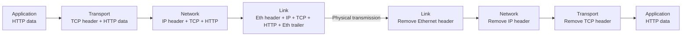
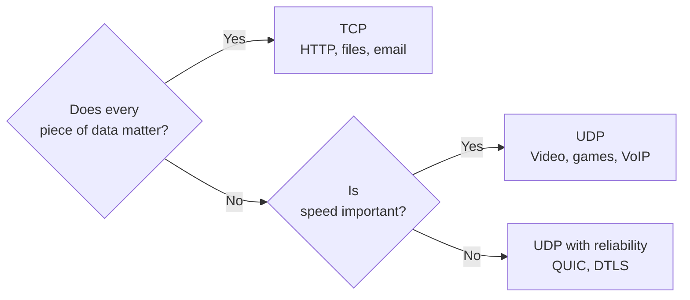
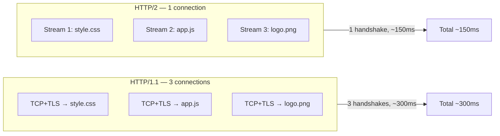
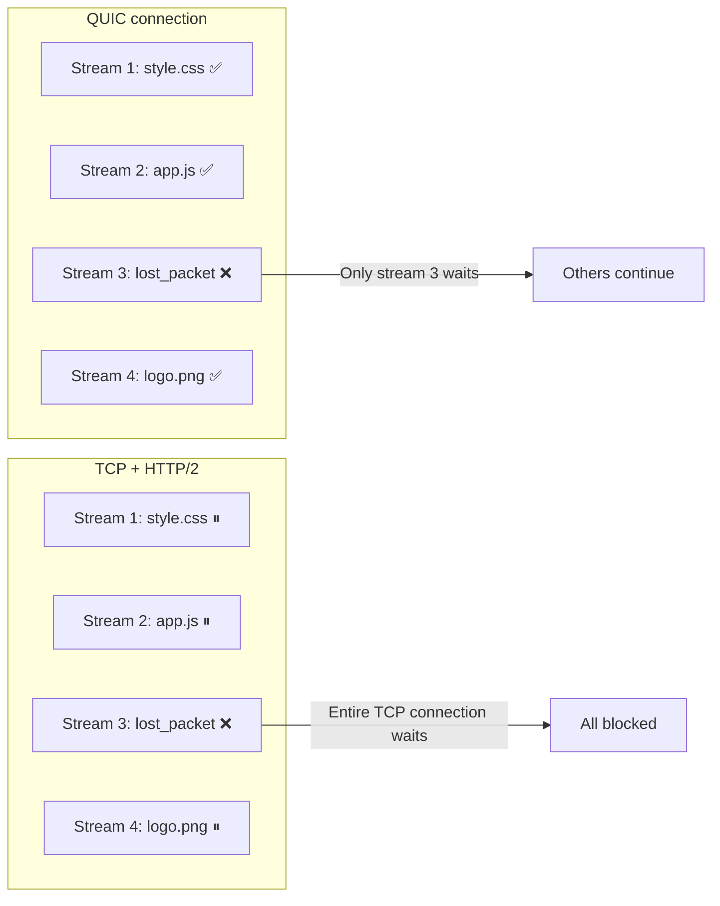
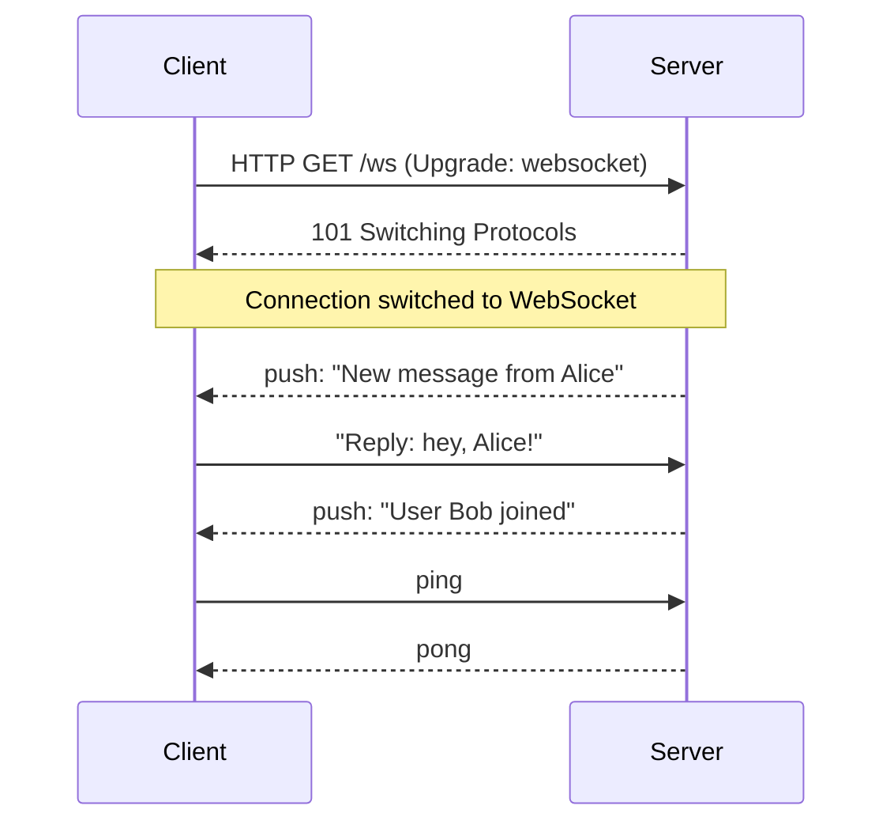
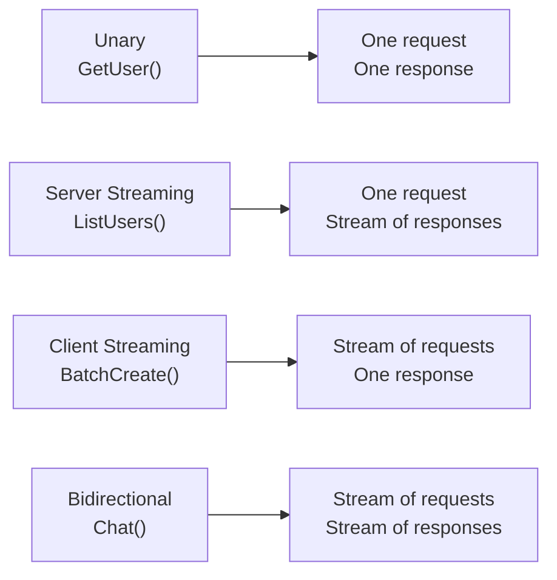
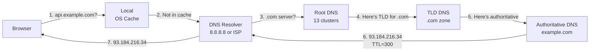
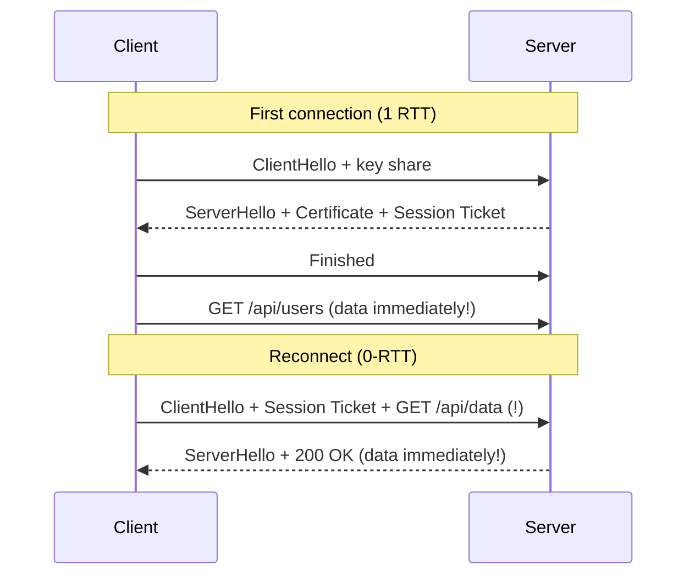
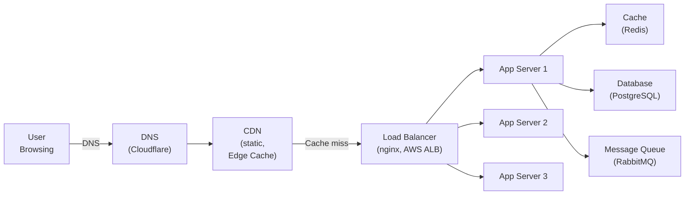

# Level 0: Networking and Protocols -- Deep Dive into Network Communication Fundamentals

## Introduction

Imagine sending an important document through a courier service. The process works like this: you look up the recipient's address in a phone book (DNS), make a deal with the courier and agree on delivery details (TCP handshake), seal the document in a tamper-proof package with a code (TLS), write the address on the envelope (IP), place it in the courier's branded package (Ethernet frame) -- and only then does the courier deliver it to the recipient.

When you type `https://api.example.com/users` into your browser, the exact same thing happens -- only in **50-200 milliseconds**. Understanding each stage of this journey is fundamental for any work with distributed systems, API design, and performance.

At this level, we will cover:

1. **TCP/IP Stack** -- four layers of the networking model, data encapsulation, and the key TCP vs UDP choice
2. **HTTP Evolution** -- from HTTP/1.1 to HTTP/3, HOL blocking problem, and QUIC
3. **WebSocket** -- when bidirectional communication is needed and how it works
4. **gRPC** -- binary RPC for microservices and Protocol Buffers
5. **DNS** -- hierarchical naming system and TTL caching
6. **TLS** -- encryption in transit, handshake, and 0-RTT
7. **Key Network Metrics** -- latency, throughput, RTT, connection pooling
8. **Request Path in Production** -- CDN, Load Balancer, App Server, Database
9. **Common Mistakes** -- anti-patterns with explanations of why they are dangerous

---

## 1. TCP/IP Stack: Four Layers of Networking

### Why Do We Even Need Layers?

When computers first started communicating over networks, every manufacturer did it differently. IBM machines couldn't understand DEC machines, protocols were incompatible. Then engineers made a smart move -- they split the task into independent layers, each unaware of the details of its neighbors.

This is the principle of **separation of concerns** applied to network communication. Application developers don't think about whether their data is transmitted over WiFi or cable. Network engineers don't think about application business logic. Each layer does its job and provides an abstraction for the layer above.

### Four Layers of the TCP/IP Model

| Layer | Name | Protocols | Analogy |
|---------|----------|-----------|----------|
| 4 | **Application** | HTTP, WebSocket, gRPC, DNS | Letter content |
| 3 | **Transport** | TCP, UDP | Envelope with delivery guarantee |
| 2 | **Network** | IP, ICMP | Address on envelope + route |
| 1 | **Link** | Ethernet, Wi-Fi, PPP | Mail truck |

There is also the OSI model with 7 layers, which is often mentioned in theory. In practice, the internet uses TCP/IP, so we work with four layers. The top three OSI layers (application, presentation, session) are combined into a single TCP/IP application layer.

### How Data Travels Down and Up the Stack

When you send an HTTP request, each layer **wraps** (encapsulates) the data in its own header. On the receiving side, headers are removed in reverse order.



In practice, this means your 200-byte HTTP request becomes an Ethernet frame of approximately 260 bytes -- headers are added at each layer. This is called **protocol overhead**.

### TCP vs UDP: Two Strategic Approaches to Delivery

#### TCP -- Reliable Courier with Delivery Notification

TCP (Transmission Control Protocol) guarantees that all data will arrive, in the correct order, without duplication. This is achieved through an acknowledgment mechanism: the receiver sends an ACK (acknowledgment) for each received segment. If the ACK doesn't arrive within the allotted time -- the sender retransmits.

**Three stages of a TCP connection's life:**

```
1. Connection establishment (3-way handshake):
   Client → Server: SYN (seq=X)
   Server → Client: SYN-ACK (seq=Y, ack=X+1)
   Client → Server: ACK (ack=Y+1)
   Cost: 1 RTT

2. Data transfer:
   Client → Server: [data]
   Server → Client: ACK

3. Connection teardown (4-way handshake):
   Client → Server: FIN
   Server → Client: ACK
   Server → Client: FIN
   Client → Server: ACK
```

The 3-way handshake before each connection is the unavoidable price of TCP reliability. With an RTT of 50ms, just establishing the connection takes 50ms, even before the first byte of data is sent. This is precisely why keep-alive and connection pooling are so important.

#### UDP -- Fast Messenger Without a Receipt

UDP (User Datagram Protocol) sends packets and doesn't wait for acknowledgments. No handshake, no retransmissions. The packet is sent -- that's it, not your concern anymore.

This sounds like a drawback, but for certain use cases it's ideal behavior:

- **Video streaming and online gaming**: better to receive a frame with a delay than wait for a retransmission -- the user is already watching the next frame
- **DNS queries**: small packet, quick response -- if lost, it's easier to ask again than set up a TCP connection
- **VoIP**: in a conversation, you don't need to "replay" lost syllables -- better to continue
- **QUIC (HTTP/3)**: UDP is used as a foundation, but reliability is implemented at a higher layer

| Characteristic | TCP | UDP |
|---|---|---|
| Reliability | Guaranteed delivery | No guarantees |
| Packet ordering | Preserved | Not guaranteed |
| Handshake | 3-way (SYN, SYN-ACK, ACK) | None |
| Congestion control | Yes (congestion control) | No |
| Header overhead | 20-60 bytes | 8 bytes |
| Speed | Slower | Faster |
| Use case | HTTP, email, files, SSH | Video, games, DNS, QUIC |

#### When to Choose What?



---

## 2. HTTP: Evolution from 1.1 to 3

### Why Did HTTP Evolve?

The internet of the 1990s was very different from today. A page consisted of a few files, connections were slow but reliable. HTTP/1.0 was simple: one connection -- one request -- one response -- close.

Then web pages became more complex -- dozens of CSS files, JavaScript, images, fonts. HTTP/1.0 struggled to cope. HTTP/1.1 added keep-alive. But with the growth of mobile internet, CDNs, and SPA applications, something fundamentally different was needed.

### HTTP/1.1 -- Queue at the Cash Register

HTTP/1.1 works on a **"one request at a time"** principle within a single connection. This is called **Head-of-Line (HOL) blocking**: if the first request is slow -- all others wait.

```
Connection 1:  [GET /style.css  200ms] → [GET /app.js  150ms] → [GET /logo.png  300ms]
                                                                   Total: 650ms
```

Browsers work around this by opening 6-8 parallel TCP connections to a single domain. But each connection requires its own TCP + TLS handshake:

```
Connection 1: [TCP+TLS]──[GET /style.css]
Connection 2: [TCP+TLS]──[GET /app.js]
Connection 3: [TCP+TLS]──[GET /logo.png]
              ↑
              Each TCP+TLS handshake = 2 RTT = 100ms at RTT=50ms
              6 connections = 6 × TLS overhead
```

This is wasteful: going through handshake six times, holding six sockets, consuming memory on both ends.

**Another problem with HTTP/1.1** -- headers. Each request carries a full set of headers: `User-Agent`, `Accept`, `Cookie`, `Authorization` -- in text form. For APIs with hundreds of requests per second, the total volume of headers can exceed the useful payload.

### HTTP/2 -- Multiplexing Through a Single Channel

HTTP/2 (2015) solved HOL blocking through **multiplexing**: multiple requests go in parallel through a **single TCP connection**, split into independent **streams**.



Key features of HTTP/2:

- **Multiplexing** -- parallel streams in a single TCP connection without HOL blocking at the HTTP level
- **Header compression (HPACK)** -- headers are encoded, common parts are cached. Repeating `User-Agent` and `Cookie` are not sent again
- **Server Push** -- the server can proactively send a resource before the client requests it. Requested `index.html` -- the server immediately pushes `style.css` and `app.js`
- **Stream prioritization** -- you can specify that CSS is more important than images

Important limitation: HTTP/2 is built on top of TCP. If a TCP packet is lost -- **all streams in that connection block** until TCP recovers the lost packet. This is **TCP-level HOL blocking** -- a problem that HTTP/2 did not solve.

### HTTP/3 -- QUIC and Saying Goodbye to TCP

HTTP/3 (2022) replaces TCP with **QUIC** -- a transport-layer protocol over UDP, developed by Google (2012) and standardized by IETF (RFC 9000, 2021).

**Why is QUIC better than TCP for HTTP?**

QUIC implements stream multiplexing at its own level. Loss of a UDP packet blocks only the stream it belongs to -- others continue working. No TCP-level HOL blocking.



**Faster connection establishment:**

```
HTTP/1.1 + TLS 1.2:  TCP (1 RTT) + TLS (2 RTT) = 3 RTT
HTTP/2  + TLS 1.3:   TCP (1 RTT) + TLS (1 RTT) = 2 RTT
HTTP/3  + QUIC:      QUIC+TLS combined         = 1 RTT
HTTP/3  (reconnect): 0-RTT reconnect             = 0 RTT (!)
```

With 0-RTT reconnect, the client can send data in the very first packet, using session keys from the previous connection. This allows completely eliminating connection establishment delay on repeat visits.

0-RTT has a vulnerability to **replay attacks**: an attacker can replay captured data. Therefore, 0-RTT should only be used for idempotent requests (GET), not for POST.

**Another advantage of QUIC** -- support for **connection migration**. If a user switches from WiFi to LTE -- the TCP connection breaks and needs to be re-established. QUIC identifies the connection by Connection ID (not by IP:port), so the connection continues to work when the address changes.

| Characteristic | HTTP/1.1 | HTTP/2 | HTTP/3 |
|---|---|---|---|
| Transport | TCP | TCP | QUIC (UDP) |
| Multiplexing | No | Yes (TCP-level HOL) | Yes (no HOL) |
| Handshake | 3+ RTT | 2 RTT | 1 RTT (0-RTT) |
| Header compression | No | HPACK | QPACK |
| Connection migration | No | No | Yes |
| Browser support | All | All | 95%+ (2024) |

---

## 3. WebSocket: Full-Duplex Communication

### The Problem WebSocket Solves

HTTP is a "request-response" model: the **client** is always the initiator. The server cannot send data to the client without a request.

For some applications, this is a fundamental problem:

- **Chat applications**: the user should receive messages the moment they are sent by another user
- **Stock quotes**: prices change constantly, a push stream is needed
- **Multiplayer games**: state synchronization between players in real time
- **Push notifications**: notify the user about an event without their request

Before WebSocket, several workarounds were used:

```
Polling -- client polls every N seconds:
Client: "Any new messages?"  Server: "No"  (N sec delay)
Client: "Any new messages?"  Server: "No"  (N sec delay)
Client: "Any new messages?"  Server: "Yes!"  (message with up to N sec delay)
Problem: 99% of requests are empty, server load, latency

Long Polling -- keep request open:
Client: "Any new messages?" →  (waiting...)
Server: [holds request open until event occurs]
Server: "Here's a message!" → Client immediately makes new request
Better, but still half-duplex, header overhead

SSE (Server-Sent Events) -- one-way stream from server:
Client: GET /events
Server: [stream of events]
Good for notifications, but client cannot send data through the same channel
```

### How WebSocket Works

WebSocket starts as a regular HTTP request with an `Upgrade` header:

```
Client → Server:
GET /chat HTTP/1.1
Upgrade: websocket
Connection: Upgrade
Sec-WebSocket-Key: dGhlIHNhbXBsZSBub25jZQ==
Sec-WebSocket-Version: 13

Server → Client:
HTTP/1.1 101 Switching Protocols
Upgrade: websocket
Connection: Upgrade
Sec-WebSocket-Accept: s3pPLMBiTxaQ9kYGzzhZRbK+xOo=
```

After `101 Switching Protocols`, the TCP connection remains open, but the HTTP protocol is replaced with WebSocket frames. Now both ends can send data at any time -- this is **full-duplex** communication.



### WebSocket Code on Client and Server

```typescript
// Client (browser)
const ws = new WebSocket('wss://chat.example.com/ws')

ws.onopen = () => {
  console.log('Connected')
  ws.send(JSON.stringify({ type: 'join', room: 'general', userId: '123' }))
}

ws.onmessage = (event) => {
  const message = JSON.parse(event.data)
  if (message.type === 'chat') {
    renderMessage(message)
  }
}

ws.onclose = (event) => {
  console.log('Disconnected:', event.code, event.reason)
  // Reconnect with exponential backoff
  setTimeout(() => reconnect(), calculateBackoff())
}

ws.onerror = (error) => {
  console.error('WebSocket error:', error)
}
```

```typescript
// Server (Node.js + ws)
import WebSocket, { WebSocketServer } from 'ws'

const wss = new WebSocketServer({ port: 8080 })
const rooms = new Map<string, Set<WebSocket>>()

wss.on('connection', (ws) => {
  ws.on('message', (data) => {
    const message = JSON.parse(data.toString())

    if (message.type === 'join') {
      if (!rooms.has(message.room)) {
        rooms.set(message.room, new Set())
      }
      rooms.get(message.room)!.add(ws)
    }

    if (message.type === 'chat') {
      // Broadcast to everyone in the room
      rooms.get(message.room)?.forEach((client) => {
        if (client.readyState === WebSocket.OPEN) {
          client.send(JSON.stringify(message))
        }
      })
    }
  })

  ws.on('close', () => {
    // Remove from all rooms
    rooms.forEach((clients) => clients.delete(ws))
  })
})
```

### When NOT to Use WebSocket

WebSocket is a persistent TCP connection. 10,000 simultaneous users = 10,000 open sockets. Each consumes memory on the server (typically 100-200 KB). This scales worse than stateless HTTP.

Additionally, WebSocket is not supported by HTTP caching, is harder to pass through proxies and corporate firewalls.

| Scenario | Recommendation |
|---|---|
| Chat, live notifications | ✅ WebSocket |
| Stock quotes, games | ✅ WebSocket |
| Getting news once a minute | ❌ Use SSE or polling |
| CRUD API | ❌ Use regular HTTP |
| One-way server updates | ❌ Use SSE (simpler, better proxy support) |

---

## 4. gRPC: Binary RPC for Microservices

### The Problem with REST in Microservices

In a monolith, a function call takes a few nanoseconds. In microservices, a "function call" becomes a network request: serialize data to JSON, HTTP request, deserialize JSON on the other end. With hundreds of inter-service calls per second, overhead becomes significant.

**Specific problems with REST/JSON in microservices:**

- **Large message size**: JSON is a text format, every number is transmitted as a string. `{"userId": 12345}` -- that's 16 bytes, whereas the number 12345 in binary format is 3 bytes
- **Slow serialization**: JSON parsing requires CPU
- **No strict contract**: OpenAPI is optional, the contract is easy to break without noticeable error
- **Limited streaming**: REST doesn't support native bidirectional streaming

### What is gRPC and Protocol Buffers

**gRPC** is an RPC (Remote Procedure Call) framework from Google. It runs over HTTP/2 and uses **Protocol Buffers (protobuf)** as a serialization format.

Protocol Buffers is a binary serialization format with schema described in `.proto` files:

```protobuf
// user.proto
syntax = "proto3";

package user;

service UserService {
  // Unary RPC: one request, one response
  rpc GetUser (GetUserRequest) returns (User);

  // Server streaming: one request, stream of responses
  rpc ListUsers (ListUsersRequest) returns (stream User);

  // Client streaming: stream of requests, one response
  rpc BatchCreateUsers (stream CreateUserRequest) returns (BatchResult);

  // Bidirectional streaming: stream of requests, stream of responses
  rpc Chat (stream ChatMessage) returns (stream ChatMessage);
}

message GetUserRequest {
  string user_id = 1;  // Field 1
}

message User {
  string id = 1;
  string name = 2;
  string email = 3;
  int32 age = 4;
  repeated string roles = 5;  // Array of strings
}

message ListUsersRequest {
  int32 page = 1;
  int32 page_size = 2;
}
```

From this `.proto` file, **code is generated** for both client and server in any language: Go, Java, Python, TypeScript, C++, Ruby...

```typescript
// Generated TypeScript client
import { UserServiceClient } from './generated/user_grpc_pb'
import { GetUserRequest } from './generated/user_pb'

const client = new UserServiceClient('user-service:50051', credentials.createInsecure())

const request = new GetUserRequest()
request.setUserId('user-123')

client.getUser(request, (error, response) => {
  if (error) throw error
  console.log(response.getName()) // Strictly typed!
})

// Server streaming
const stream = client.listUsers(new ListUsersRequest())
stream.on('data', (user) => console.log(user.getName()))
stream.on('end', () => console.log('Stream ended'))
```

### Why Protobuf is 3-10x Smaller Than JSON

Protobuf uses numeric tags instead of string keys and efficient binary encoding:

```
JSON:     {"userId": "abc123", "age": 25, "active": true}
Bytes:    {"userId": "abc123", "age": 25, "active": true}
Size:     44 bytes

Protobuf: [field=1, type=string, len=6]["abc123"][field=2, type=varint][25][field=3, type=bool][1]
Size:     ~12 bytes (3.7x smaller)

With complex nested objects, the difference can reach 10x
```

### Four gRPC Streaming Modes



### gRPC Limitations

| Characteristic | REST (JSON) | gRPC (Protobuf) |
|---|---|---|
| Format | Text | Binary |
| Transport | HTTP/1.1 or HTTP/2 | HTTP/2 |
| Contract | OpenAPI (optional) | .proto (required) |
| Streaming | No (only SSE) | 4 modes |
| Payload size | Larger | 3-10x smaller |
| Browser support | Yes, native | No (needs grpc-web proxy) |
| Debugging readability | Easy (curl, browser) | Needs tools (grpcurl) |
| Versioning | Through URL (/v2/) | Through proto fields |

The main limitation of gRPC -- browsers cannot make gRPC requests directly, because they don't give control over HTTP/2 frames. For browsers, `grpc-web` is used -- gRPC over HTTP/1.1 with a proxy (`envoy`) on the server side.

**Typical architecture:**

```
Browser → REST/JSON → API Gateway → gRPC → Microservices
```

The public API remains REST (convenient for developers), internal calls use gRPC (fast and typed).

---

## 5. DNS: Hierarchical Phone Book of the Internet

### Why Hierarchy is Needed

DNS is a distributed database storing records like "domain name → IP address". Billions of records cannot be kept in one place. Therefore, DNS is organized hierarchically: each level of the hierarchy knows who to ask at the next level.

### Full DNS Resolution Path



This process looks complex, but in practice most queries **do not reach Root DNS** -- they are intercepted by cache at one of the earlier levels.

### Caching and TTL

Each DNS record has a **TTL (Time To Live)** -- the time in seconds the record can be cached.

```
$ dig api.example.com
;; ANSWER SECTION:
api.example.com.  300  IN  A  93.184.216.34
                  ↑
                  TTL = 300 seconds (5 minutes)
```

Typical TTLs:
- **60-300 seconds** -- for records that may change (temporary failovers)
- **3600 seconds (1 hour)** -- standard value
- **86400 seconds (24 hours)** -- stable records

Key understanding: the client caches the DNS response for `TTL` seconds. If you change the server IP, clients will still reach the old address for up to `TTL` seconds. This is why TTL is reduced well in advance during migrations.

### DNS Record Types

| Type | Purpose | Example |
|-----|-----------|--------|
| **A** | IPv4 address | `example.com → 93.184.216.34` |
| **AAAA** | IPv6 address | `example.com → 2606:2800:220:1:248:1893:25c8:1946` |
| **CNAME** | Alias (canonical name) | `www.example.com → example.com` |
| **MX** | Mail server | `example.com → mail.example.com` |
| **TXT** | Arbitrary text | SPF, DKIM, domain verification |
| **NS** | Name server | Authoritative server for the zone |

### What is a DNS Resolver and Why Use 8.8.8.8

By default, your computer uses your ISP's DNS Resolver. ISP resolvers are often slower and may intercept queries (for blocking or ads).

Public resolvers:
- **8.8.8.8 / 8.8.4.4** -- Google DNS, fast, no censorship
- **1.1.1.1 / 1.0.0.1** -- Cloudflare DNS, fastest by measurements, privacy-first
- **9.9.9.9** -- Quad9, blocks malware domains

---

## 6. TLS: Encryption in Transit

### Why Plain HTTP is Dangerous

Without TLS, data between client and server is transmitted in the open. Any router, ISP, or attacker positioned on the packet path (MITM -- Man-in-the-Middle) can:

- Read all your data (passwords, tokens, card data)
- Modify server responses (spoof content)
- Inject ads or malicious code

This is why browsers mark HTTP sites as "not secure" and the modern internet has almost entirely transitioned to HTTPS.

### What TLS Does

**TLS (Transport Layer Security)** -- a protocol providing three properties:

1. **Confidentiality** -- data is encrypted, only the recipient can read
2. **Integrity** -- data cannot be modified in transit (MAC verification)
3. **Authentication** -- the certificate confirms that the server is truly `api.example.com`, not an attacker

### TLS Handshake: Under the Hood

TLS uses **asymmetric cryptography** only during the handshake phase (for key exchange), then switches to **symmetric** (for data encryption) -- which is 100-1000x faster.

```
TLS 1.3 Handshake (1 RTT):

Client → Server:
  ClientHello:
    - Supported cipher suites (AES-256-GCM, ChaCha20-Poly1305...)
    - Public key for ECDH (key exchange)
    - TLS version
    - Random nonce

Server → Client:
  ServerHello:
    - Selected cipher suite
    - Public key for ECDH
    - Certificate (X.509) with server's public key
    - Certificate Verify (signature with key from certificate)
    - Finished (MAC of entire handshake)
  ← From this point, traffic is encrypted ←

Client → Server:
  Finished (MAC of entire handshake)
  ← Can send data immediately →
```

TLS 1.2 took 2 RTT. TLS 1.3 optimized it to 1 RTT by having the client send its key share in the first message.

### 0-RTT: Zero Latency on Reconnect

When reconnecting to the same server, TLS 1.3 supports **0-RTT resumption**: the client can send data in the very first packet, using a **session ticket** -- an encrypted token from the previous session.



### Certificates and Certificate Authorities

A certificate is a file containing the server's public key, domain information, and a **signature from a Certificate Authority (CA)**. A CA is a trusted third party (DigiCert, Let's Encrypt, Comodo) that browsers trust by default.

**Let's Encrypt** revolutionized the field: free, automatically renewed certificates. Through the ACME protocol, a server proves to the CA that it controls the domain (by placing a file or DNS record), and receives a certificate -- no humans involved, free, in seconds.

---

## 7. Key Network Metrics

### Latency vs Throughput -- Pipes and Water

Imagine a water pipe:

- **Latency** -- the time it takes for the first water molecule to travel from source to faucet. Measured in **milliseconds**. Depends on distance and signal speed.
- **Throughput** -- how much water flows through the pipe per second. Measured in **Mbps**. Depends on pipe diameter.

You can have a thick pipe (high throughput) that is a kilometer long (high latency). You can have a thin pipe (low throughput) right next to you (low latency).

Key rule: throughput is easy to increase (buy a wider channel). Latency is almost impossible to reduce -- the speed of light is constant, and the only way to lower latency is to physically bring the server closer to the user (CDN, edge computing).

### RTT (Round-Trip Time) -- One "Ping"

RTT -- the time it takes for a packet to fly to the server and back. This is the base unit of network delay measurement.

```
Typical RTTs:
- Between containers in the same pod:      < 0.1 ms
- Within a data center:                    0.1 - 1 ms
- Between cities on the same continent:    5 - 50 ms
- Between continents (transatlantic):      70 - 150 ms
- Satellite internet (GEO):                500 - 700 ms
- Starlink (LEO):                          20 - 40 ms
```

Why RTT matters: each handshake and each request costs 1 RTT. If a user's RTT to your server is 100ms, then:

```
DNS lookup:          1 RTT = 100ms (if not cached)
TCP handshake:       1 RTT = 100ms
TLS 1.3 handshake:   1 RTT = 100ms
HTTP request:        1 RTT = 100ms
                     Total for first request: 400ms + processing time
```

### Bandwidth and Real Throughput

**Bandwidth** -- the theoretical maximum of a channel (e.g., 1 Gbps). **Real throughput** is always lower:

- **TCP congestion control**: TCP starts with slow start and gradually increases speed. On packet loss, it halves the speed
- **Competition**: multiple streams share the channel
- **Protocol overhead**: TCP/IP headers take up space
- **Full-duplex**: if you download fast, upload slows down

### Connection Pooling -- Pool of Ready Connections

Each new TCP connection costs 1 RTT for handshake + 1 RTT for TLS. At 50ms RTT, that's 100ms just to establish a connection to a database.

**Connection pool** -- a set of pre-established connections ready for use. Instead of creating a new connection for each request, we take one from the pool:

```typescript
// Without pool: each request spends time on TCP+TLS handshake
async function getUserWithoutPool(id: string) {
  const conn = await createNewConnection() // 100ms (TCP + TLS)
  const result = await conn.query('SELECT * FROM users WHERE id = $1', [id]) // 5ms
  await conn.close()
  return result
}
// Total: 105ms

// With pool: connection already established
const pool = new Pool({ max: 10, connectionString: DATABASE_URL })

async function getUserWithPool(id: string) {
  const result = await pool.query('SELECT * FROM users WHERE id = $1', [id]) // 5ms
  return result
}
// Total: 5ms (20x faster!)
```

**Keep-Alive in HTTP** -- the analog of connection pooling at the HTTP level: the TCP connection is not closed after the request but reused for subsequent requests. Enabled by default in HTTP/1.1.

---

## 8. Request Path in Production

### Real Architecture

In production, several layers of infrastructure stand between the user and your server, each adding latency but also adding value:



### CDN -- Content Close to the User

**CDN (Content Delivery Network)** -- a global network of servers caching static content. Instead of a request to New York, a user in Moscow gets content from the nearest CDN node in Moscow or Amsterdam.

```
Without CDN: Moscow → New York = RTT 150ms → Load 300ms
With CDN:    Moscow → Amsterdam = RTT 25ms  → Load 50ms (6x faster!)
```

CDN caches: images, CSS, JavaScript, fonts, static HTML. Dynamic API responses are usually not cached (or cached with short TTL).

Major CDNs: Cloudflare, AWS CloudFront, Fastly, Akamai. Cloudflare handles about 20% of all internet traffic.

### Load Balancer -- Even Distribution of Load

**Load Balancer** accepts incoming traffic and distributes it across multiple application servers. Algorithms:

| Algorithm | Principle | When to Use |
|---|---|---|
| **Round Robin** | In turns | All servers are identical |
| **Least Connections** | To server with fewest active connections | Different processing times |
| **IP Hash** | By client IP hash | Need "stickiness" (sticky sessions) |
| **Weighted** | By server weight | Servers of different capacity |

The Load Balancer also performs **health checks**: regularly checks `/health` on each server and removes failed ones from rotation. If a server fails -- requests automatically go to the remaining ones.

### Why Each Layer Exists

| Layer | Purpose | What It Provides |
|---|---|---|
| **DNS** | Name → IP | Human-readable addresses |
| **CDN** | Static cache close to user | 5-10x faster loading |
| **Load Balancer** | Load distribution | Horizontal scaling, fault tolerance |
| **App Server** | Business logic | |
| **Cache (Redis)** | Hot data cache | 100-1000x faster than DB for frequently read data |
| **Database** | Persistent storage | |

---

## 9. Common Mistakes

### Mistake 1: "HTTP/2 is Always Faster Than HTTP/1.1"

HTTP/2 wins when **loading web pages** with dozens of resources (CSS, JS, images) -- multiplexing reduces the number of connections and handshakes.

But for single API requests, the difference is minimal. Moreover, with a high percentage of packet loss (unstable mobile internet), TCP-level HOL blocking in HTTP/2 can perform **worse** than multiple HTTP/1.1 connections -- if one packet is lost, all streams stall.

Correct approach:
- HTTP/2 + multiplexing -- for web pages with many resources
- HTTP/3 -- if you control the server and low latency is important
- For APIs: HTTP/2 benefit is in header compression and connection reuse, not multiplexing
- Measure, don't assume

### Mistake 2: WebSocket for Regular CRUD

Why this is bad: 10,000 users = 10,000 persistent TCP connections. The server keeps each connection in memory. On server restart -- all connections break, reconnection logic is needed. No caching. No standard HTTP codes (404, 401). Harder to debug.

```typescript
// Good: HTTP for CRUD, WebSocket only for real-time
const users = await fetch('/api/users?page=1').then(r => r.json())

// WebSocket only where server push is needed
const ws = new WebSocket('wss://api.example.com/ws/notifications')
ws.onmessage = (event) => showNotification(JSON.parse(event.data))
```

### Mistake 3: Ignoring DNS TTL During Migrations

DNS records are cached with TTL. If TTL = 3600 (1 hour), some users will still go to the old IP for up to an hour.

Correct migration plan:
- 48 hours before migration: Reduce TTL: `example.com. 60 IN A 1.2.3.4` (TTL = 60 seconds)
- On migration day (after 48 hours -- all cached records with TTL=3600 have expired): Change A record: `example.com. 60 IN A 5.6.7.8`
- After verification (after 1-2 hours): Restore TTL: `example.com. 3600 IN A 5.6.7.8`

### Mistake 4: Assuming Server Latency = User Latency

Real picture for a user with RTT = 50ms to the server, first visit:

```
DNS lookup (not cached):          1 RTT = 50ms
TCP handshake:                    1 RTT = 50ms
TLS 1.3 handshake:                1 RTT = 50ms
HTTP request → server:            0.5 RTT = 25ms
Server processing:                10ms
HTTP response → client:           0.5 RTT = 25ms
                                  ─────────────
Total:                            210ms

(not 10ms!)
```

For optimization:
- DNS: prefetch (`<link rel="dns-prefetch">`) or reduce TTL for hot records
- TCP + TLS: keep-alive, HTTP/2+, connection pooling
- Server time: code optimization, caching
- RTT: CDN, edge deployment, servers closer to users

### Mistake 5: gRPC Everywhere, Including Public API

gRPC is not natively supported by browsers. Mobile and frontend developers are used to REST. Debugging via curl is impossible. Every contract change requires code regeneration for all clients.

Correct strategy:
- Public API (browser, mobile) → REST/JSON
- Internal microservices → gRPC
- Streaming between services → gRPC bidirectional streaming
- If gRPC in browser is needed → grpc-web + Envoy proxy

---

## Summary

Understanding the network stack is not abstract theory but a practical tool for system design:

- **TCP/IP stack**: data is encapsulated at each layer. TCP guarantees delivery at the cost of RTT, UDP sacrifices reliability for speed
- **HTTP evolution**: HTTP/1.1 suffers from HOL blocking, HTTP/2 solves it at the HTTP level through multiplexing, HTTP/3 + QUIC eliminates TCP-level HOL blocking
- **WebSocket**: the only right choice for real-time push. For CRUD -- use HTTP
- **gRPC**: binary, typed, fast -- for internal microservices. REST -- for public APIs
- **DNS TTL**: during migration, reduce TTL 24-48 hours in advance, otherwise users will still go to the old IP
- **TLS 1.3**: 1 RTT handshake vs 2 RTT in TLS 1.2. 0-RTT for reconnections (only for idempotent requests)
- **Real latency**: DNS + TCP + TLS + RTT + server_time. First request is expensive -- optimize connection caching
- **Connection pooling**: required everywhere connections to DBs or external services are created
- CDN reduces latency by 5-10x for static content -- the simplest optimization with the greatest effect
- Never count latency only by server processing time -- account for all network stages
