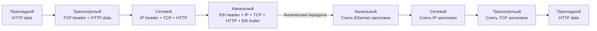
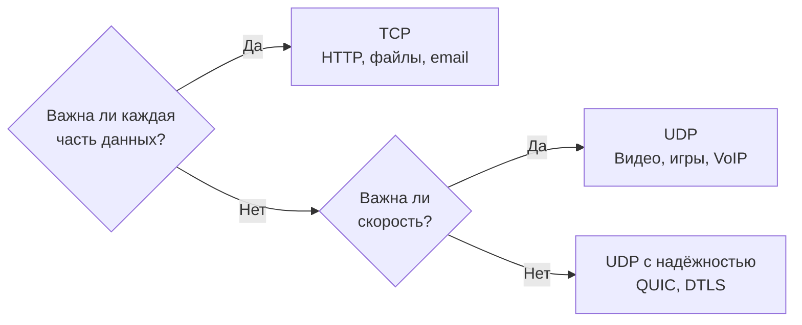
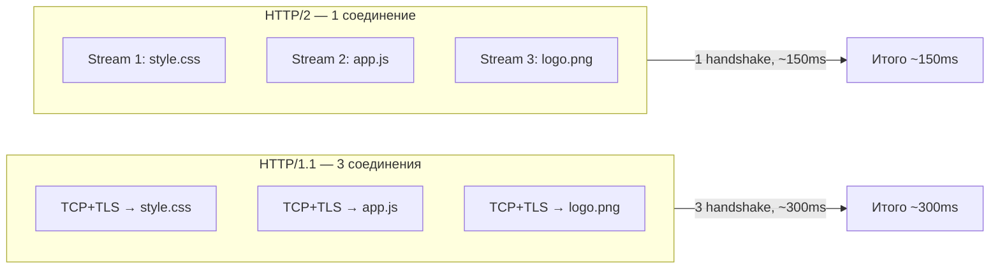
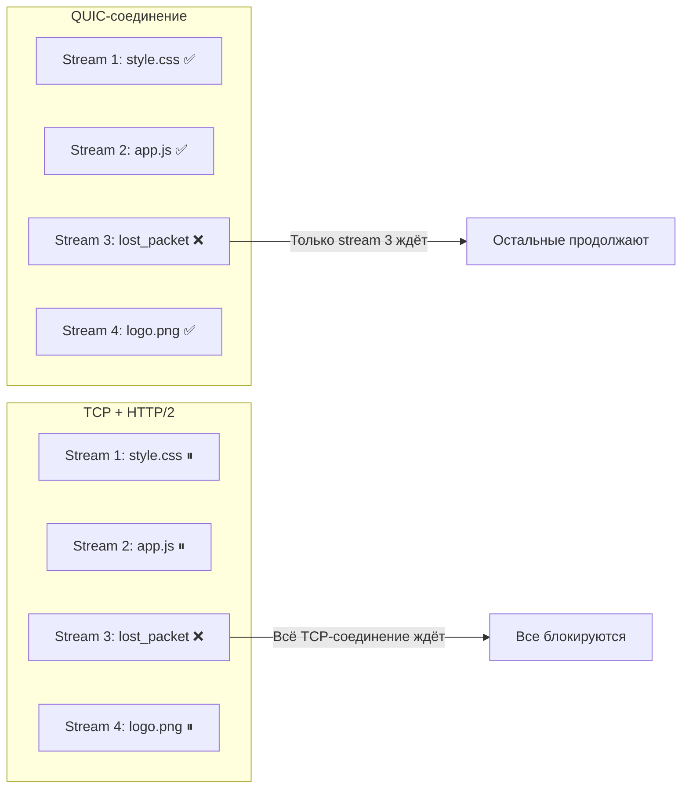
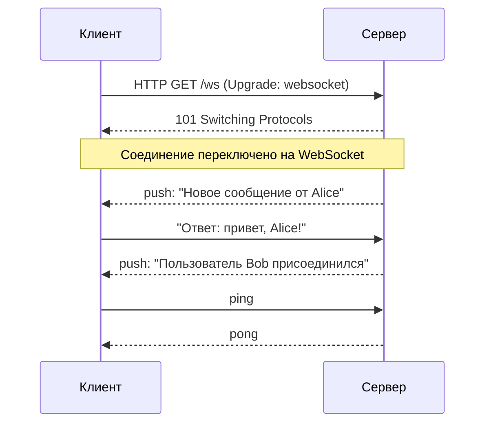
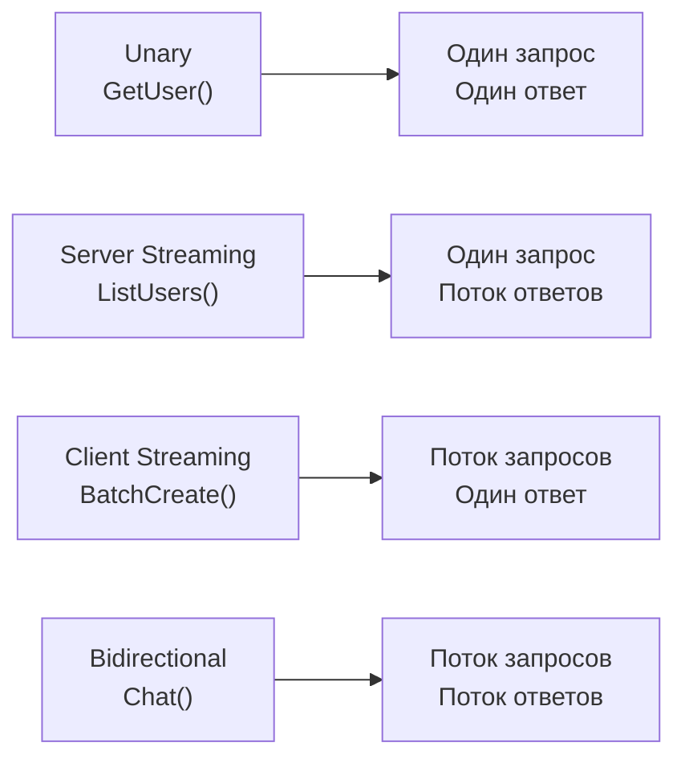
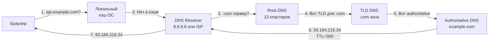
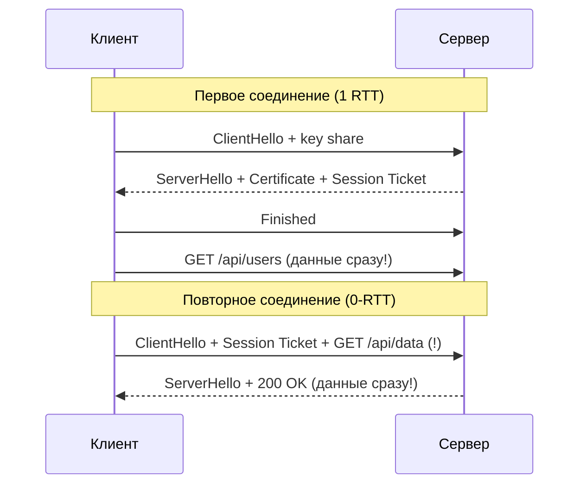
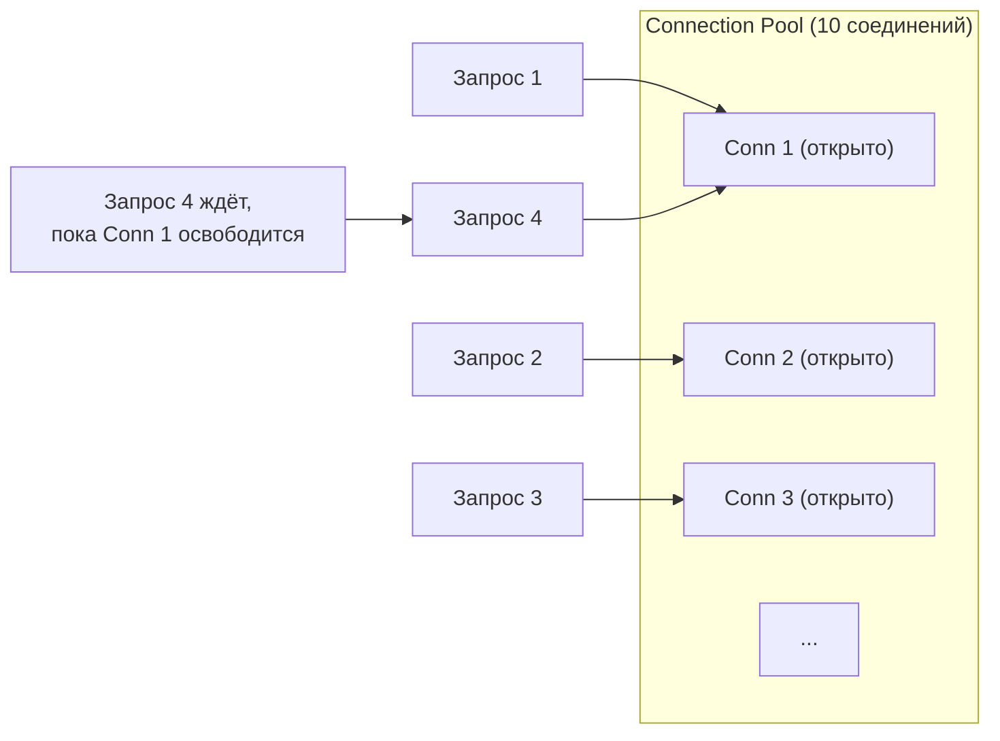
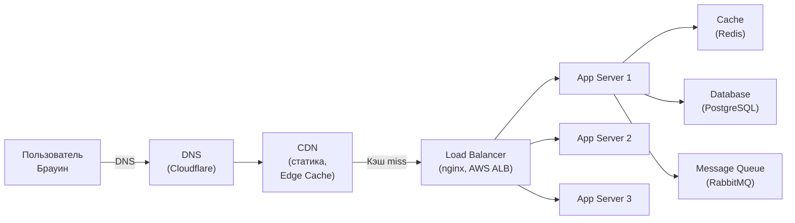

# Уровень 0: Сеть и протоколы -- подробное погружение в основы сетевой коммуникации

## Введение

Представьте, что вы отправляете важный документ через курьерскую службу. Процесс выглядит так: вы узнаёте адрес получателя по телефонной книге (DNS), заключаете договор с курьером и оговариваете детали доставки (TCP handshake), запечатываете документ в сейф-пакет с кодом (TLS), пишете адрес на конверте (IP), кладёте в фирменный пакет курьера (Ethernet-фрейм) -- и только потом курьер везёт его получателю.

Когда вы набираете `https://api.example.com/users` в браузере, происходит ровно то же самое, только за **50-200 миллисекунд**. Понимание каждого этапа этого пути -- фундамент для любой работы с distributed systems, API-дизайном и производительностью.

На этом уровне мы разберём:

1. **Стек TCP/IP** -- четыре уровня сетевой модели, инкапсуляция данных и ключевой выбор TCP vs UDP
2. **Эволюция HTTP** -- от HTTP/1.1 до HTTP/3, проблема HOL blocking и QUIC
3. **WebSocket** -- когда нужна двусторонняя связь и как она работает
4. **gRPC** -- бинарные RPC для микросервисов и Protocol Buffers
5. **DNS** -- иерархическая система имён и TTL-кэширование
6. **TLS** -- шифрование в пути, handshake и 0-RTT
7. **Ключевые метрики сети** -- latency, throughput, RTT, connection pooling
8. **Путь запроса в продакшене** -- CDN, Load Balancer, App Server, Database
9. **Частые ошибки** -- антипаттерны с объяснением, почему они опасны

---

## 1. Стек TCP/IP: четыре уровня сети

### Зачем вообще нужны уровни?

Когда компьютеры только начинали общаться по сетям, каждый производитель делал это по-своему. IBM-машины не понимали DEC-машины, протоколы были несовместимы. Тогда инженеры сделали умный ход -- разбили задачу на независимые слои, каждый из которых не знает о деталях соседних.

Это принцип **разделения ответственности**, применённый к сетевой коммуникации. Разработчик приложения не думает о том, по WiFi или кабелю передаются его данные. Сетевой инженер не думает о бизнес-логике приложения. Каждый слой делает свою работу и предоставляет абстракцию для слоя выше.

### Четыре уровня модели TCP/IP

| Уровень | Название | Протоколы | Аналогия |
|---------|----------|-----------|----------|
| 4 | **Прикладной** | HTTP, WebSocket, gRPC, DNS | Содержимое письма |
| 3 | **Транспортный** | TCP, UDP | Конверт с гарантией доставки |
| 2 | **Сетевой** | IP, ICMP | Адрес на конверте + маршрут |
| 1 | **Канальный** | Ethernet, Wi-Fi, PPP | Почтовый грузовик |

💡 Существует также модель OSI с 7 уровнями, которую часто упоминают в теории. На практике в интернете используется TCP/IP, поэтому мы работаем с четырьмя уровнями. Верхние три уровня OSI (прикладной, представления, сеансовый) объединены в один прикладной уровень TCP/IP.

### Как данные путешествуют вниз и вверх по стеку

Когда вы отправляете HTTP-запрос, каждый уровень **оборачивает** (инкапсулирует) данные в свой заголовок. На принимающей стороне заголовки снимаются в обратном порядке.



На практике это означает: ваш HTTP-запрос размером 200 байт превращается в Ethernet-фрейм размером примерно 260 байт -- добавляются заголовки каждого уровня. Это называется **overhead протоколов**.

### TCP vs UDP: два стратегических подхода к доставке

#### TCP -- надёжный курьер с уведомлением о вручении

TCP (Transmission Control Protocol) гарантирует, что все данные дойдут, в правильном порядке, без дублирования. Достигается это через механизм подтверждений: получатель отправляет ACK (acknowledgment) на каждый полученный сегмент. Если ACK не пришёл за отведённое время -- отправитель повторяет передачу.

**Три этапа жизни TCP-соединения:**

```
1. Установка соединения (3-way handshake):
   Клиент → Сервер: SYN (seq=X)
   Сервер → Клиент: SYN-ACK (seq=Y, ack=X+1)
   Клиент → Сервер: ACK (ack=Y+1)
   Стоимость: 1 RTT

2. Передача данных:
   Клиент → Сервер: [данные]
   Сервер → Клиент: ACK

3. Закрытие соединения (4-way handshake):
   Клиент → Сервер: FIN
   Сервер → Клиент: ACK
   Сервер → Клиент: FIN
   Клиент → Сервер: ACK
```

📌 3-way handshake перед каждым соединением -- это неизбежная цена надёжности TCP. При RTT 50 мс только на установку соединения уходит 50 мс, ещё до того как отправится первый байт данных. Именно поэтому так важны keep-alive и connection pooling.

#### UDP -- быстрый гонец без расписки

UDP (User Datagram Protocol) отправляет пакеты и не ждёт подтверждений. Никакого handshake, никаких повторных передач. Пакет ушёл -- всё, дальше не ваша забота.

Это звучит как недостаток, но для ряда задач это идеальное поведение:

- **Видеостриминг и онлайн-игры**: лучше получить кадр с задержкой, чем ждать повтора -- пользователь уже смотрит следующий кадр
- **DNS-запросы**: маленький пакет, быстрый ответ -- если потерялся, проще переспросить, чем настраивать TCP-соединение
- **VoIP**: в разговоре не нужно "переигрывать" потерянные слоги -- лучше продолжить
- **QUIC (HTTP/3)**: UDP используется как основа, но надёжность реализована на уровне выше

| Характеристика | TCP | UDP |
|---|---|---|
| Надёжность | Гарантированная доставка | Без гарантий |
| Порядок пакетов | Сохраняется | Не гарантирован |
| Handshake | 3-way (SYN, SYN-ACK, ACK) | Нет |
| Контроль перегрузки | Есть (congestion control) | Нет |
| Overhead заголовка | 20-60 байт | 8 байт |
| Скорость | Медленнее | Быстрее |
| Применение | HTTP, email, файлы, SSH | Видео, игры, DNS, QUIC |

#### Когда выбирать что?



---

## 2. HTTP: эволюция от 1.1 до 3

### Почему HTTP эволюционировал?

Интернет 1990-х сильно отличался от сегодняшнего. Страница состояла из нескольких файлов, соединения были медленными, но надёжными. HTTP/1.0 был прост: одно соединение -- один запрос -- один ответ -- закрыть.

Потом веб-страницы стали сложнее -- десятки CSS-файлов, JavaScript, картинки, шрифты. HTTP/1.0 справлялся плохо. HTTP/1.1 добавил keep-alive. Но с ростом мобильного интернета, CDN и SPA-приложений понадобилось нечто принципиально иное.

### HTTP/1.1 -- очередь в кассу

HTTP/1.1 работает по принципу **"один запрос за раз"** в рамках одного соединения. Это называется **Head-of-Line (HOL) blocking**: если первый запрос медленный -- все остальные ждут.

```
Соединение 1:  [GET /style.css  200ms] → [GET /app.js  150ms] → [GET /logo.png  300ms]
                                                                   Итого: 650ms
```

Браузеры обходят это, открывая 6-8 параллельных TCP-соединений к одному домену. Но каждое соединение требует своего TCP + TLS handshake:

```
Соединение 1: [TCP+TLS]──[GET /style.css]
Соединение 2: [TCP+TLS]──[GET /app.js]
Соединение 3: [TCP+TLS]──[GET /logo.png]
              ↑
              Каждый TCP+TLS handshake = 2 RTT = 100ms при RTT=50ms
              6 соединений = 6 × TLS overhead
```

Это расточительно: шесть раз проходить handshake, держать шесть сокетов, потреблять память на обоих концах.

**Ещё одна проблема HTTP/1.1** -- заголовки. Каждый запрос несёт полный набор заголовков: `User-Agent`, `Accept`, `Cookie`, `Authorization` -- в текстовом виде. Для API с сотнями запросов в секунду суммарный объём заголовков может быть больше полезной нагрузки.

### HTTP/2 -- мультиплексинг через один канал

HTTP/2 (2015) решил HOL blocking через **мультиплексинг**: множество запросов идут параллельно через **одно TCP-соединение**, разбитые на независимые **потоки (streams)**.



Ключевые возможности HTTP/2:

- **Мультиплексинг** -- параллельные потоки в одном TCP-соединении без HOL blocking на HTTP-уровне
- **Сжатие заголовков (HPACK)** -- заголовки кодируются, общие части кэшируются. Повторяющиеся `User-Agent` и `Cookie` не передаются снова
- **Server Push** -- сервер может проактивно отправить ресурс ещё до запроса клиента. Запросил `index.html` -- сервер сразу пушит `style.css` и `app.js`
- **Приоритизация потоков** -- можно указать, что CSS важнее изображений

📌 Важное ограничение: HTTP/2 построен поверх TCP. Если TCP-пакет теряется -- **все потоки в этом соединении блокируются**, пока TCP не восстановит потерянный пакет. Это **TCP-level HOL blocking** -- проблема, которую HTTP/2 не решил.

### HTTP/3 -- QUIC и прощание с TCP

HTTP/3 (2022) заменяет TCP на **QUIC** -- протокол транспортного уровня поверх UDP, разработанный Google (2012) и стандартизированный IETF (RFC 9000, 2021).

**Почему QUIC лучше TCP для HTTP?**

QUIC реализует мультиплексирование потоков на своём уровне. Потеря UDP-пакета блокирует только тот поток, к которому он относится, -- остальные продолжают работу. Нет TCP-level HOL blocking.



**Ускорение установки соединения:**

```
HTTP/1.1 + TLS 1.2:  TCP (1 RTT) + TLS (2 RTT) = 3 RTT
HTTP/2  + TLS 1.3:   TCP (1 RTT) + TLS (1 RTT) = 2 RTT
HTTP/3  + QUIC:      QUIC+TLS совмещены         = 1 RTT
HTTP/3  (повторное): 0-RTT reconnect             = 0 RTT (!)
```

При 0-RTT reconnect клиент может отправить данные уже в первом пакете, используя сессионные ключи от предыдущего соединения. Это позволяет полностью убрать задержку на установку соединения при повторных визитах.

⚠️ 0-RTT имеет уязвимость к **replay attacks**: злоумышленник может повторно отправить захваченные данные. Поэтому 0-RTT применяют только для идемпотентных запросов (GET), не для POST.

**Ещё одно преимущество QUIC** -- поддержка **connection migration**. Если пользователь переключился с WiFi на LTE -- TCP-соединение разрывается, нужно переустанавливать. QUIC идентифицирует соединение по Connection ID (не по IP:port), поэтому при смене адреса соединение продолжает работать.

| Характеристика | HTTP/1.1 | HTTP/2 | HTTP/3 |
|---|---|---|---|
| Транспорт | TCP | TCP | QUIC (UDP) |
| Мультиплексинг | Нет | Да (TCP-level HOL) | Да (без HOL) |
| Handshake | 3+ RTT | 2 RTT | 1 RTT (0-RTT) |
| Сжатие заголовков | Нет | HPACK | QPACK |
| Connection migration | Нет | Нет | Да |
| Поддержка браузерами | Всеми | Всеми | 95%+ (2024) |

---

## 3. WebSocket: полнодуплексная связь

### Проблема, которую решает WebSocket

HTTP -- это модель "запрос-ответ": инициатором **всегда** является клиент. Сервер не может отправить данные клиенту без запроса.

Для некоторых приложений это фундаментальная проблема:

- **Чат-приложения**: пользователь должен получать сообщения в момент их отправки другим пользователем
- **Биржевые котировки**: цены меняются постоянно, нужен push-поток
- **Многопользовательские игры**: синхронизация состояния между игроками в реальном времени
- **Push-уведомления**: уведомить пользователя о событии без его запроса

До WebSocket использовали несколько обходных путей:

```
Polling -- клиент опрашивает каждые N секунд:
Клиент: "Есть новые сообщения?"  Сервер: "Нет"  (задержка N сек)
Клиент: "Есть новые сообщения?"  Сервер: "Нет"  (задержка N сек)
Клиент: "Есть новые сообщения?"  Сервер: "Да!"  (сообщение с задержкой до N сек)
Проблема: 99% запросов пустые, нагрузка на сервер, задержка

Long Polling -- держим запрос открытым:
Клиент: "Есть новые сообщения?" →  (ждём...)
Сервер: [держит запрос открытым до появления события]
Сервер: "Вот сообщение!" → Клиент сразу делает новый запрос
Лучше, но всё ещё полуhalf-duplex, overhead заголовков

SSE (Server-Sent Events) -- однонаправленный поток от сервера:
Клиент: GET /events
Сервер: [поток событий]
Хорошо для уведомлений, но клиент не может отправлять данные через тот же канал
```

### Как работает WebSocket

WebSocket начинается как обычный HTTP-запрос с заголовком `Upgrade`:

```
Клиент → Сервер:
GET /chat HTTP/1.1
Upgrade: websocket
Connection: Upgrade
Sec-WebSocket-Key: dGhlIHNhbXBsZSBub25jZQ==
Sec-WebSocket-Version: 13

Сервер → Клиент:
HTTP/1.1 101 Switching Protocols
Upgrade: websocket
Connection: Upgrade
Sec-WebSocket-Accept: s3pPLMBiTxaQ9kYGzzhZRbK+xOo=
```

После `101 Switching Protocols` TCP-соединение остаётся открытым, но HTTP-протокол заменяется WebSocket-фреймами. Теперь оба конца могут отправлять данные в любой момент -- это **full-duplex** связь.



### Код WebSocket на клиенте и сервере

```typescript
// Клиент (браузер)
const ws = new WebSocket('wss://chat.example.com/ws')

ws.onopen = () => {
  console.log('Connected')
  ws.send(JSON.stringify({ type: 'join', room: 'general', userId: '123' }))
}

ws.onmessage = (event) => {
  const message = JSON.parse(event.data)
  if (message.type === 'chat') {
    renderMessage(message)
  }
}

ws.onclose = (event) => {
  console.log('Disconnected:', event.code, event.reason)
  // Переподключение через exponential backoff
  setTimeout(() => reconnect(), calculateBackoff())
}

ws.onerror = (error) => {
  console.error('WebSocket error:', error)
}
```

```typescript
// Сервер (Node.js + ws)
import WebSocket, { WebSocketServer } from 'ws'

const wss = new WebSocketServer({ port: 8080 })
const rooms = new Map<string, Set<WebSocket>>()

wss.on('connection', (ws) => {
  ws.on('message', (data) => {
    const message = JSON.parse(data.toString())

    if (message.type === 'join') {
      if (!rooms.has(message.room)) {
        rooms.set(message.room, new Set())
      }
      rooms.get(message.room)!.add(ws)
    }

    if (message.type === 'chat') {
      // Broadcast ко всем в комнате
      rooms.get(message.room)?.forEach((client) => {
        if (client.readyState === WebSocket.OPEN) {
          client.send(JSON.stringify(message))
        }
      })
    }
  })

  ws.on('close', () => {
    // Удалить из всех комнат
    rooms.forEach((clients) => clients.delete(ws))
  })
})
```

### Когда НЕ использовать WebSocket

📌 WebSocket -- постоянное TCP-соединение. 10 000 одновременных пользователей = 10 000 открытых сокетов. Каждый потребляет память на сервере (обычно 100-200 KB). Это масштабируется хуже, чем stateless HTTP.

Кроме того, WebSocket не поддерживается HTTP-кэшированием, сложнее проходит через прокси и корпоративные файерволы.

| Сценарий | Рекомендация |
|---|---|
| Чат, живые уведомления | ✅ WebSocket |
| Биржевые котировки, игры | ✅ WebSocket |
| Получение новостей раз в минуту | ❌ Используйте SSE или polling |
| CRUD API | ❌ Используйте обычный HTTP |
| Одностороннее обновление от сервера | ❌ Используйте SSE (проще, лучше поддержка прокси) |

---

## 4. gRPC: бинарные RPC для микросервисов

### Проблема с REST в микросервисах

В монолите вызов функции -- это несколько наносекунд. В микросервисах "вызов функции" превращается в сетевой запрос: сериализация данных в JSON, HTTP-запрос, десериализация JSON на другом конце. При сотнях межсервисных вызовов в секунду накладные расходы становятся ощутимыми.

**Конкретные проблемы REST/JSON в микросервисах:**

- **Большой размер сообщений**: JSON -- текстовый формат, каждое число передаётся как строка. `{"userId": 12345}` -- это 16 байт, тогда как число 12345 в бинарном формате -- 3 байта
- **Медленная сериализация**: парсинг JSON требует CPU
- **Нет строгого контракта**: OpenAPI опционален, контракт легко нарушить без заметного error
- **Ограниченный streaming**: REST не поддерживает нативный двунаправленный стриминг

### Что такое gRPC и Protocol Buffers

**gRPC** -- это фреймворк RPC (Remote Procedure Call) от Google. Работает поверх HTTP/2 и использует **Protocol Buffers (protobuf)** как формат сериализации.

Protocol Buffers -- это бинарный формат сериализации с описанием схемы в `.proto` файлах:

```protobuf
// user.proto
syntax = "proto3";

package user;

service UserService {
  // Unary RPC: один запрос, один ответ
  rpc GetUser (GetUserRequest) returns (User);

  // Server streaming: один запрос, поток ответов
  rpc ListUsers (ListUsersRequest) returns (stream User);

  // Client streaming: поток запросов, один ответ
  rpc BatchCreateUsers (stream CreateUserRequest) returns (BatchResult);

  // Bidirectional streaming: поток запросов, поток ответов
  rpc Chat (stream ChatMessage) returns (stream ChatMessage);
}

message GetUserRequest {
  string user_id = 1;  // Поле 1
}

message User {
  string id = 1;
  string name = 2;
  string email = 3;
  int32 age = 4;
  repeated string roles = 5;  // Массив строк
}

message ListUsersRequest {
  int32 page = 1;
  int32 page_size = 2;
}
```

Из этого `.proto` файла **генерируется код** для клиента и сервера на любом языке: Go, Java, Python, TypeScript, C++, Ruby...

```typescript
// Сгенерированный TypeScript клиент
import { UserServiceClient } from './generated/user_grpc_pb'
import { GetUserRequest } from './generated/user_pb'

const client = new UserServiceClient('user-service:50051', credentials.createInsecure())

const request = new GetUserRequest()
request.setUserId('user-123')

client.getUser(request, (error, response) => {
  if (error) throw error
  console.log(response.getName()) // Строго типизировано!
})

// Server streaming
const stream = client.listUsers(new ListUsersRequest())
stream.on('data', (user) => console.log(user.getName()))
stream.on('end', () => console.log('Stream ended'))
```

### Почему protobuf в 3-10 раз компактнее JSON

Protobuf использует числовые теги вместо строковых ключей и эффективное бинарное кодирование:

```
JSON:     {"userId": "abc123", "age": 25, "active": true}
Байты:    {"userId": "abc123", "age": 25, "active": true}
Размер:   44 байта

Protobuf: [field=1, type=string, len=6]["abc123"][field=2, type=varint][25][field=3, type=bool][1]
Размер:   ~12 байт (в 3.7x меньше)

При сложных объектах с вложенностью разница достигает 10x
```

### Четыре режима стриминга gRPC



### Ограничения gRPC

| Характеристика | REST (JSON) | gRPC (Protobuf) |
|---|---|---|
| Формат | Текстовый | Бинарный |
| Транспорт | HTTP/1.1 или HTTP/2 | HTTP/2 |
| Контракт | OpenAPI (опционально) | .proto (обязательно) |
| Streaming | Нет (только SSE) | 4 режима |
| Размер payload | Больше | В 3-10x меньше |
| Поддержка браузером | Да, нативно | Нет (нужен grpc-web proxy) |
| Читаемость для отладки | Легко (curl, браузер) | Нужны инструменты (grpcurl) |
| Версионирование | Через URL (/v2/) | Через поля proto |

📌 Главное ограничение gRPC -- браузеры не могут делать gRPC-запросы напрямую, потому что не дают контроль над HTTP/2-фреймами. Для браузеров используется `grpc-web` -- это gRPC через HTTP/1.1 с прокси (`envoy`) на стороне сервера.

**Типичная архитектура:**

```
Браузер → REST/JSON → API Gateway → gRPC → Микросервисы
```

Публичный API остаётся REST (удобен для разработчиков), внутренние вызовы -- gRPC (быстро и типизированно).

---

## 5. DNS: иерархическая телефонная книга интернета

### Зачем нужна иерархия

DNS -- это распределённая база данных, хранящая записи вида "имя домена → IP-адрес". Миллиарды записей невозможно держать в одном месте. Поэтому DNS организована иерархически: каждый уровень иерархии знает, к кому обратиться на следующем уровне.

### Полный путь DNS-резолюции



Этот процесс выглядит сложно, но на практике большинство запросов **не доходят до Root DNS** -- они перехватываются кэшем на одном из ранних уровней.

### Кэширование и TTL

Каждая DNS-запись имеет **TTL (Time To Live)** -- время в секундах, в течение которого запись можно кэшировать.

```
$ dig api.example.com
;; ANSWER SECTION:
api.example.com.  300  IN  A  93.184.216.34
                  ↑
                  TTL = 300 секунд (5 минут)
```

Типичные TTL:
- **60-300 секунд** -- для записей, которые могут меняться (временные переключения)
- **3600 секунд (1 час)** -- стандартное значение
- **86400 секунд (24 часа)** -- стабильные записи

🔥 Ключевое понимание: клиент кэширует DNS-ответ на `TTL` секунд. Если вы меняете IP сервера, клиенты ещё до `TTL` секунд будут обращаться по старому адресу. Именно поэтому при миграциях TTL снижают заблаговременно.

### Типы DNS-записей

| Тип | Назначение | Пример |
|-----|-----------|--------|
| **A** | IPv4-адрес | `example.com → 93.184.216.34` |
| **AAAA** | IPv6-адрес | `example.com → 2606:2800:220:1:248:1893:25c8:1946` |
| **CNAME** | Псевдоним (алиас) | `www.example.com → example.com` |
| **MX** | Mail сервер | `example.com → mail.example.com` |
| **TXT** | Произвольный текст | SPF, DKIM, domain verification |
| **NS** | Name server | Authoritative сервер зоны |

### Что такое DNS Resolver и зачем использовать 8.8.8.8

По умолчанию ваш компьютер использует DNS Resolver вашего провайдера. Провайдерские резолверы часто медленнее и могут перехватывать запросы (для блокировок или рекламы).

Публичные резолверы:
- **8.8.8.8 / 8.8.4.4** -- Google DNS, быстрый, без цензуры
- **1.1.1.1 / 1.0.0.1** -- Cloudflare DNS, самый быстрый по замерам, privacy-first
- **9.9.9.9** -- Quad9, блокирует malware-домены

---

## 6. TLS: шифрование в пути

### Почему HTTP без TLS опасен

Без TLS данные между клиентом и сервером передаются в открытом виде. Любой роутер, провайдер или злоумышленник, находящийся на пути пакетов (MITM -- Man-in-the-Middle), может:

- Читать все ваши данные (пароли, токены, карточные данные)
- Модифицировать ответы сервера (подменять контент)
- Инжектировать рекламу или вредоносный код

Именно поэтому браузеры помечают HTTP-сайты как "небезопасные" и современный интернет практически полностью перешёл на HTTPS.

### Что делает TLS

**TLS (Transport Layer Security)** -- протокол, обеспечивающий три свойства:

1. **Конфиденциальность** -- данные зашифрованы, читает только получатель
2. **Целостность** -- невозможно изменить данные в пути (MAC-проверка)
3. **Аутентификация** -- сертификат подтверждает, что сервер -- это действительно `api.example.com`, а не злоумышленник

### TLS Handshake: под капотом

TLS использует **асимметричную криптографию** только на этапе handshake (для обмена ключами), а затем переходит на **симметричную** (для шифрования данных) -- она в 100-1000 раз быстрее.

```
TLS 1.3 Handshake (1 RTT):

Клиент → Сервер:
  ClientHello:
    - Поддерживаемые cipher suites (AES-256-GCM, ChaCha20-Poly1305...)
    - Публичный ключ для ECDH (key exchange)
    - Версия TLS
    - Random nonce

Сервер → Клиент:
  ServerHello:
    - Выбранный cipher suite
    - Публичный ключ для ECDH
    - Сертификат (X.509) с публичным ключом сервера
    - Certificate Verify (подпись ключом из сертификата)
    - Finished (MAC всего handshake)
  ← С этого момента трафик зашифрован ←

Клиент → Сервер:
  Finished (MAC всего handshake)
  ← Можно сразу отправлять данные →
```

В TLS 1.2 процесс занимал 2 RTT. TLS 1.3 оптимизировал его до 1 RTT за счёт того, что клиент сразу отправляет свой key share в первом сообщении, не дожидаясь подтверждения от сервера.

### 0-RTT: нулевая задержка при переподключении

При повторном подключении к тому же серверу TLS 1.3 поддерживает **0-RTT resumption**: клиент может отправить данные уже в самом первом пакете, используя **session ticket** -- зашифрованный токен от предыдущей сессии.



### Сертификаты и Certificate Authorities

Сертификат -- это файл, содержащий публичный ключ сервера, информацию о домене и **подпись Certificate Authority (CA)**. CA -- это доверенная третья сторона (DigiCert, Let's Encrypt, Comodo), которой браузеры доверяют by default.

**Let's Encrypt** произвёл революцию: бесплатные автоматически обновляемые сертификаты. Через ACME-протокол сервер доказывает CA, что контролирует домен (размещает файл или DNS-запись), и получает сертификат -- без людей, бесплатно, за секунды.

---

## 7. Ключевые метрики сети

### Latency vs Throughput -- трубы и вода

Представьте водопровод:

- **Latency (задержка)** -- время, за которое первая молекула воды пройдёт от источника до крана. Измеряется в **миллисекундах**. Зависит от расстояния и скорости сигнала.
- **Throughput (пропускная способность)** -- сколько воды пройдёт через трубу за секунду. Измеряется в **Мбит/с**. Зависит от диаметра трубы.

Можно иметь толстую трубу (высокий throughput) длиной в километр (высокий latency). Можно иметь тонкую трубу (низкий throughput) прямо рядом (низкий latency).

🔥 **Ключевое правило**: throughput легко увеличить (купить более широкий канал). Latency почти невозможно уменьшить -- скорость света постоянна, и единственный способ снизить latency -- физически приблизить сервер к пользователю (CDN, edge computing).

### RTT (Round-Trip Time) -- один "пинг"

RTT -- время, за которое пакет долетит до сервера и вернётся обратно. Это базовая единица измерения сетевой задержки.

```
Типичные RTT:
- Между контейнерами в одном поде:      < 0.1 мс
- Внутри дата-центра:                    0.1 - 1 мс
- Между городами одного континента:      5 - 50 мс
- Между континентами (трансатлантика):   70 - 150 мс
- Спутниковый интернет (GEO):            500 - 700 мс
- Starlink (LEO):                        20 - 40 мс
```

Почему RTT важен: каждый handshake и каждый запрос стоит 1 RTT. Если у пользователя RTT 100 мс до вашего сервера, то:

```
DNS lookup:          1 RTT = 100ms (если не закэширован)
TCP handshake:       1 RTT = 100ms
TLS 1.3 handshake:   1 RTT = 100ms
HTTP запрос:         1 RTT = 100ms
                     Итого первый запрос: 400ms + время обработки
```

### Bandwidth и реальный Throughput

**Bandwidth** -- теоретический максимум канала (например, 1 Гбит/с). **Реальный throughput** всегда ниже:

- **TCP congestion control**: TCP начинает с медленного старта и наращивает скорость постепенно (slow start). При потере пакета снижает скорость вдвое
- **Конкуренция**: канал делят несколько потоков
- **Protocol overhead**: заголовки TCP/IP занимают место
- **Full-duplex**: если вы скачиваете быстро, upload замедляется

### Connection Pooling -- пул готовых соединений

Каждое новое TCP-соединение стоит 1 RTT на handshake + 1 RTT на TLS. При 50 мс RTT это 100 мс только на установку соединения к базе данных.

**Connection pool** -- набор заранее установленных соединений, готовых к использованию. Вместо создания нового соединения на каждый запрос, берём из пула:

```typescript
// Без пула: каждый запрос тратит время на TCP+TLS handshake
async function getUserWithoutPool(id: string) {
  const conn = await createNewConnection() // 100ms (TCP + TLS)
  const result = await conn.query('SELECT * FROM users WHERE id = $1', [id]) // 5ms
  await conn.close()
  return result
}
// Итого: 105ms

// С пулом: соединение уже установлено
const pool = new Pool({ max: 10, connectionString: DATABASE_URL })

async function getUserWithPool(id: string) {
  const result = await pool.query('SELECT * FROM users WHERE id = $1', [id]) // 5ms
  return result
}
// Итого: 5ms (20x быстрее!)
```



**Keep-Alive в HTTP** -- аналог connection pooling на уровне HTTP: TCP-соединение не закрывается после запроса, а переиспользуется для следующих запросов. В HTTP/1.1 включено по умолчанию.

---

## 8. Путь запроса в продакшене

### Реальная архитектура

В продакшене между пользователем и вашим сервером стоит несколько слоёв инфраструктуры, каждый из которых добавляет задержку, но и добавляет ценность:



### CDN -- контент рядом с пользователем

**CDN (Content Delivery Network)** -- глобальная сеть серверов, кэширующих статический контент. Вместо запроса в Нью-Йорк пользователь из Москвы получает контент с ближайшего CDN-узла в Москве или Амстердаме.

```
Без CDN: Москва → Нью-Йорк = RTT 150 мс → Загрузка 300 мс
С CDN:   Москва → Амстердам = RTT 25 мс  → Загрузка 50 мс (6x быстрее!)
```

CDN кэширует: изображения, CSS, JavaScript, шрифты, статические HTML. Динамические API-ответы обычно не кэшируются (или кэшируются с коротким TTL).

Крупнейшие CDN: Cloudflare, AWS CloudFront, Fastly, Akamai. Cloudflare обрабатывает около 20% интернет-трафика.

### Load Balancer -- равномерное распределение нагрузки

**Load Balancer** принимает входящий трафик и распределяет его между несколькими серверами приложения. Алгоритмы:

| Алгоритм | Принцип | Когда использовать |
|---|---|---|
| **Round Robin** | По очереди | Все серверы одинаковые |
| **Least Connections** | На сервер с наименьшим числом активных соединений | Разное время обработки |
| **IP Hash** | По хэшу IP клиента | Нужна "липкость" (sticky sessions) |
| **Weighted** | По весу сервера | Серверы разной мощности |

Load Balancer также выполняет **health check**: регулярно проверяет `/health` на каждом сервере и убирает упавшие из ротации. Если сервер падает -- запросы автоматически уходят на оставшиеся.

### Зачем нужен каждый слой

| Слой | Задача | Что даёт |
|---|---|---|
| **DNS** | Имя → IP | Человекочитаемые адреса |
| **CDN** | Кэш статики рядом с пользователем | 5-10x ускорение загрузки |
| **Load Balancer** | Распределение нагрузки | Горизонтальное масштабирование, отказоустойчивость |
| **App Server** | Бизнес-логика | |
| **Cache (Redis)** | Кэш горячих данных | 100-1000x быстрее БД для часто читаемых данных |
| **Database** | Персистентное хранилище | |

---

## 9. Частые ошибки

### ❌ Ошибка 1: "HTTP/2 всегда быстрее HTTP/1.1"

```
❌ Неправильное убеждение:
"Включим HTTP/2 -- всё станет быстрее!"
```

HTTP/2 выигрывает при **загрузке веб-страниц** с десятками ресурсов (CSS, JS, изображения) -- мультиплексинг снижает количество соединений и handshake.

Но для одиночных API-запросов разница минимальна. Более того, при высоком проценте потерь пакетов (нестабильный мобильный интернет) TCP-level HOL blocking в HTTP/2 может работать **хуже** множества HTTP/1.1 соединений -- если один пакет теряется, все потоки стоят.

```
✅ Правильный подход:
- HTTP/2 + мультиплексинг -- для веб-страниц с многими ресурсами
- HTTP/3 -- если контролируете сервер и важна низкая latency
- Для API: выгода HTTP/2 -- в сжатии заголовков и connection reuse, не в мультиплексинге
- Измеряйте, не предполагайте
```

### ❌ Ошибка 2: WebSocket для обычного CRUD

```typescript
// ❌ Плохо: WebSocket для получения списка пользователей
const ws = new WebSocket('wss://api.example.com')
ws.onopen = () => ws.send(JSON.stringify({ action: 'getUsers', page: 1 }))
ws.onmessage = (event) => setUsers(JSON.parse(event.data))
```

Почему это плохо: 10 000 пользователей = 10 000 постоянных TCP-соединений. Сервер держит каждое соединение в памяти. При перезапуске сервера -- все соединения рвутся, нужна логика переподключения. Нет кэширования. Нет стандартных HTTP-кодов (404, 401). Сложнее отлаживать.

```typescript
// ✅ Хорошо: HTTP для CRUD, WebSocket только для real-time
const users = await fetch('/api/users?page=1').then(r => r.json())

// WebSocket только там, где нужен push от сервера
const ws = new WebSocket('wss://api.example.com/ws/notifications')
ws.onmessage = (event) => showNotification(JSON.parse(event.data))
```

### ❌ Ошибка 3: Игнорировать DNS TTL при миграциях

```
❌ Сценарий:
1. В пятницу вечером: меняем A-запись example.com с 1.2.3.4 на 5.6.7.8
2. Ждём несколько минут
3. Обнаруживаем, что половина пользователей всё ещё идёт на старый IP
4. Паника!
```

DNS-записи кэшируются с TTL. Если TTL = 3600 (1 час), часть пользователей будет идти на старый IP до часа.

```
✅ Правильный план миграции:
За 48 часов до миграции:
  Снизить TTL: example.com. 60 IN A 1.2.3.4 (TTL = 60 секунд)

В день миграции (через 48 часов -- все закэшированные записи с TTL=3600 уже истекли):
  Сменить A-запись: example.com. 60 IN A 5.6.7.8

После проверки (через 1-2 часа):
  Вернуть TTL: example.com. 3600 IN A 5.6.7.8
```

### ❌ Ошибка 4: Считать latency сервера = latency пользователя

```
❌ "Наш сервер отвечает за 10ms, значит пользователь видит ответ через 10ms"
```

Разберём реальную картину для пользователя с RTT = 50 мс до сервера, первый визит:

```
DNS lookup (не закэширован):          1 RTT = 50ms
TCP handshake:                        1 RTT = 50ms
TLS 1.3 handshake:                    1 RTT = 50ms
HTTP запрос → сервер:                 0.5 RTT = 25ms
Обработка на сервере:                 10ms
HTTP ответ → клиент:                  0.5 RTT = 25ms
                                      ─────────────
Итого:                                210ms

(не 10ms!)
```

```
✅ Правильный расчёт latency:
Полная latency = DNS + TCP + TLS + (RTT/2) + server_time + (RTT/2)

Для оптимизации:
- DNS: предзагрузка (<link rel="dns-prefetch">) или снижение TTL для горячих записей
- TCP + TLS: keep-alive, HTTP/2+, connection pooling
- Server time: оптимизация кода, кэширование
- RTT: CDN, edge deployment, серверы ближе к пользователям
```

### ❌ Ошибка 5: gRPC везде, включая публичный API

```protobuf
// ❌ Публичный API для мобильных приложений через gRPC
service PublicAPI {
  rpc GetFeed (FeedRequest) returns (stream Post);
}
```

gRPC не поддерживается браузерами нативно. Мобильные разработчики и фронтенд-разработчики привыкли к REST. Отладка через curl невозможна. Каждое изменение контракта требует регенерации кода у всех клиентов.

```
✅ Правильная стратегия:
- Публичный API (браузер, мобильные) → REST/JSON
- Внутренние микросервисы → gRPC
- Streaming между сервисами → gRPC bidirectional streaming
- Если нужен gRPC в браузере → grpc-web + Envoy proxy
```

---

## Итоги

Понимание сетевого стека -- это не абстрактная теория, а практический инструмент системного дизайна:

- ✅ **TCP/IP стек**: данные инкапсулируются на каждом уровне. TCP гарантирует доставку ценой RTT, UDP жертвует надёжностью ради скорости
- ✅ **HTTP эволюция**: HTTP/1.1 страдает от HOL blocking, HTTP/2 решает его на HTTP-уровне через мультиплексинг, HTTP/3 + QUIC устраняет и TCP-level HOL blocking
- ✅ **WebSocket**: единственный правильный выбор для real-time push. Для CRUD -- HTTP
- ✅ **gRPC**: бинарный, типизированный, быстрый -- для внутренних микросервисов. REST -- для публичных API
- ✅ **DNS TTL**: при миграции снижайте TTL за 24-48 часов, иначе пользователи будут идти на старый IP
- ✅ **TLS 1.3**: 1 RTT handshake против 2 RTT в TLS 1.2. 0-RTT для повторных соединений (только для идемпотентных запросов)
- ✅ **Реальная latency**: DNS + TCP + TLS + RTT + server_time. Первый запрос дорог -- оптимизируйте кэширование соединений
- ✅ **Connection pooling**: обязателен везде, где создаются соединения к БД или внешним сервисам
- 📌 CDN снижает latency в 5-10 раз для статики -- это самая простая оптимизация с наибольшим эффектом
- 📌 Никогда не считайте latency только по времени обработки на сервере -- учитывайте все сетевые этапы
