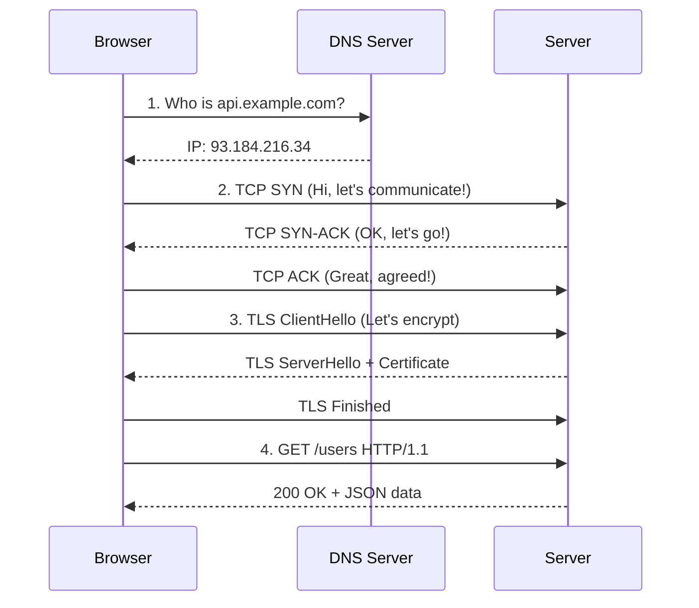
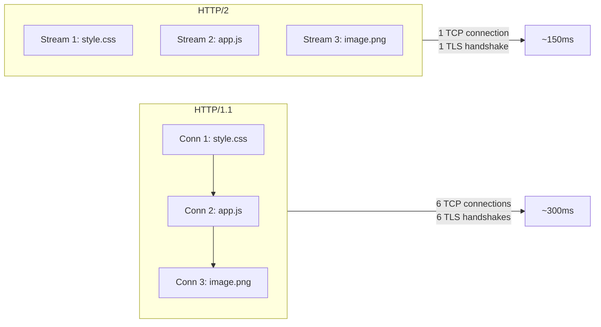
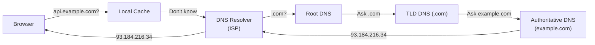
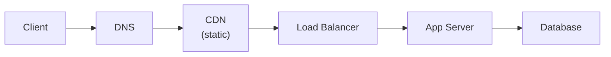

# 🔥 Level 0: Networking and Protocols

## 🎯 How a Request Travels from Browser to Server

When you type `https://api.example.com/users` in your browser and press Enter, a whole odyssey unfolds behind the scenes. The request passes through dozens of devices, several protocols, and hundreds of kilometers of cables — all within **50-200 milliseconds**.

Imagine sending a package. You don't just throw it out the window — you write the address (DNS), make a deal with the courier (TCP handshake), seal it in an envelope (TLS), and only then place the contents inside (HTTP). The network works the same way.



Each stage adds latency. DNS lookup — 20-120 ms. TCP handshake — 1 RTT. TLS — another 1-2 RTT. Only then does your request fly off.

## 🔥 TCP/IP Stack: Four Network Layers

All network communication on the internet is built on the **TCP/IP stack** — a four-layer model where each layer handles its own task.

| Layer | Name | Protocols | Analogy |
|---------|----------|-----------|----------|
| 4 | **Application** | HTTP, WebSocket, gRPC, DNS | Letter text |
| 3 | **Transport** | TCP, UDP | Envelope (delivery guarantee) |
| 2 | **Network** | IP, ICMP | Address on the envelope |
| 1 | **Link** | Ethernet, Wi-Fi | Postal truck |

💡 Data is **encapsulated** at each layer: HTTP request is wrapped in a TCP segment, which is wrapped in an IP packet, which is wrapped in an Ethernet frame. On the receiving side, layers are "unwrapped" in reverse order.

### TCP vs UDP: When Reliability Matters More Than Speed

**TCP (Transmission Control Protocol)** — reliable delivery with order guarantee. Like a registered letter with return receipt.

**UDP (User Datagram Protocol)** — fast sending without guarantees. Like a postcard — drop it in the mailbox and forget it.

```
TCP (registered letter):
1. Establish connection (3-way handshake)
2. Send data
3. Receive acknowledgment (ACK)
4. If lost — retransmit
5. Close connection

UDP (postcard):
1. Send data
2. ...that's it!
```

| Characteristic | TCP | UDP |
|---|---|---|
| Reliability | Guaranteed delivery | No guarantees |
| Order | Preserved | Not guaranteed |
| Handshake | 3-way (SYN, SYN-ACK, ACK) | None |
| Speed | Slower (overhead) | Faster |
| Use case | HTTP, email, files | Video, games, DNS |

## 🔥 HTTP: From 1.1 to 3

### HTTP/1.1 — Queue at the Checkout

HTTP/1.1 works like a supermarket queue with a single checkout: each request waits for the previous one to complete. This is called **Head-of-Line (HOL) blocking**.

```
HTTP/1.1 — sequential requests in one connection:

Connection 1: [GET /style.css]──────[GET /app.js]──────[GET /image.png]
                  200ms                 150ms                300ms
                                                        Total: 650ms

Browsers work around this by opening 6-8 parallel connections:

Connection 1: [GET /style.css]──────
Connection 2: [GET /app.js]─────
Connection 3: [GET /image.png]──────────
                                        Total: ~300ms
```

But each connection is a separate TCP + TLS handshake, meaning extra RTTs and resource consumption.

### HTTP/2 — Multiplexing

HTTP/2 solves HOL blocking through **multiplexing**: multiple requests fly in parallel through **a single TCP connection**, split into streams.



Key HTTP/2 features:

- **Multiplexing** — parallel streams in one connection
- **Server Push** — server can send resources before the browser requests them
- **Header compression (HPACK)** — headers are encoded and cached
- **Stream prioritization** — important resources load first

📌 But HTTP/2 is still built on top of TCP, and if a TCP packet is lost — **all streams block** until it's retransmitted. This is TCP-level HOL blocking.

### HTTP/3 — QUIC and Goodbye, TCP

HTTP/3 replaces TCP with **QUIC** — a protocol over UDP developed by Google. QUIC solves TCP-level HOL blocking: packet loss in one stream doesn't block the others.

```
Connection setup:

HTTP/1.1 + TLS 1.2:  TCP (1 RTT) + TLS (2 RTT) = 3 RTT
HTTP/2 + TLS 1.3:    TCP (1 RTT) + TLS (1 RTT) = 2 RTT
HTTP/3 + QUIC:       QUIC + TLS (1 RTT)         = 1 RTT
                      Reconnect: 0 RTT (0-RTT reconnect)
```

| Characteristic | HTTP/1.1 | HTTP/2 | HTTP/3 |
|---|---|---|---|
| Transport | TCP | TCP | QUIC (UDP) |
| Multiplexing | No | Yes | Yes |
| HOL blocking | HTTP-level | TCP-level | None |
| Handshake | 3+ RTT | 2 RTT | 1 RTT (0-RTT) |
| Header compression | No | HPACK | QPACK |

## 🔥 WebSocket: Bidirectional Communication

HTTP is "request-response": client asks, server answers. But what if the server needs to send data to the client **on its own**? Chat, notifications, stock quotes — all of these require a push mechanism.

**WebSocket** is a full-duplex communication protocol over TCP. It starts as a regular HTTP request (upgrade handshake), then turns into a permanent bidirectional channel.

```
HTTP (polling):
Client: "Any new messages?" → Server: "No"
Client: "Any new messages?" → Server: "No"
Client: "Any new messages?" → Server: "Yes! Here they are"
                                 (Unnecessary requests every N seconds)

WebSocket:
Client: "Upgrade to WebSocket" → Server: "101 Switching Protocols"
         ←→ Bidirectional channel open ←→
Server: "New message!"   (Push without request)
Client: "Sending reply"    (Instant)
```

```typescript
// WebSocket example on the client
const ws = new WebSocket('wss://chat.example.com')

ws.onopen = () => {
  ws.send(JSON.stringify({ type: 'join', room: 'general' }))
}

ws.onmessage = (event) => {
  const message = JSON.parse(event.data)
  console.log('New message:', message)
}
```

📌 WebSocket is ideal for **real-time**, but overkill for regular APIs: harder to scale, no built-in caching, no standard error codes.

## 🔥 gRPC: Fast Microservices

**gRPC** is a remote procedure call framework from Google. It runs over HTTP/2 and uses **Protocol Buffers** for serialization — a binary format 3-10x more compact than JSON.

```protobuf
// user.proto — API definition
service UserService {
  rpc GetUser (GetUserRequest) returns (User);
  rpc ListUsers (ListUsersRequest) returns (stream User);  // Server streaming
}

message GetUserRequest {
  string user_id = 1;
}

message User {
  string id = 1;
  string name = 2;
  string email = 3;
}
```

Why gRPC is popular in microservices:

- **Speed** — binary serialization + HTTP/2 multiplexing
- **Strong typing** — contract described in .proto files, code generated for client and server
- **Streaming** — four modes: unary, server streaming, client streaming, bidirectional
- **Not for browsers** — browsers don't support gRPC directly (need grpc-web proxy)

| Characteristic | REST (JSON) | gRPC (Protobuf) |
|---|---|---|
| Format | Text (JSON) | Binary (Protobuf) |
| Transport | HTTP/1.1 or HTTP/2 | HTTP/2 |
| Contract | OpenAPI (optional) | .proto (required) |
| Streaming | No (except SSE) | 4 modes |
| Payload size | Larger | 3-10x smaller |
| Browser | Yes | No (needs proxy) |

## 📌 DNS: The Internet's Phone Book

People remember names, computers remember IP addresses. **DNS (Domain Name System)** translates one to the other.



DNS resolution stages:

1. **Browser cache** — checks if IP is in memory
2. **OS cache** — checks `/etc/hosts` and system cache
3. **DNS Resolver** (recursive) — usually from ISP or 8.8.8.8 (Google)
4. **Root DNS** → **TLD DNS** (.com, .org) → **Authoritative DNS** — hierarchical search
5. Result is cached with TTL (Time To Live)

💡 DNS query usually takes 20-120 ms. But if IP is cached — **0 ms**. That's why the first visit to a site is slower than subsequent ones.

## 📌 TLS: Encryption in Transit

**TLS (Transport Layer Security)** encrypts data between client and server. Without TLS (plain HTTP), any router along the path sees your data — logins, passwords, card details — in plain text.

```
TLS 1.3 Handshake (1 RTT):

Client → Server: ClientHello + supported cipher suites + key share
Server → Client: ServerHello + chosen cipher + certificate + key share
                  → From this point everything is encrypted ←
Client → Server: Finished (encrypted)
```

TLS 1.3 vs TLS 1.2:
- **TLS 1.2**: 2 RTT for handshake
- **TLS 1.3**: 1 RTT (removed extra round-trip, simplified cipher negotiation)
- **TLS 1.3 0-RTT**: on reconnect — 0 RTT (send data immediately)

## 🔥 Key Network Metrics

### Latency vs Throughput

Imagine a water pipe:
- **Latency** — time it takes for the first drop to travel from the tap to the bucket. Measured in **milliseconds**.
- **Throughput** — how much water flows through the pipe per second. Measured in **Mbps**.

You can have huge throughput (thick pipe) but high latency (pipe a kilometer long). Or vice versa — low latency but small throughput.

### RTT (Round-Trip Time)

Time it takes for a packet to reach the server **and come back**. One RTT is one "ping".

```
Typical RTTs:
- Within data center:      0.5 ms
- Between cities (100 km): 1-5 ms
- Between continents:      100-300 ms
- Satellite internet:      600+ ms
```

### Bandwidth

Maximum channel capacity. But **actual throughput** is always lower: resource contention, TCP congestion control, packet loss.

### Connection Pooling and Keep-Alive

Creating a TCP connection costs 1 RTT (+ TLS). If you open a new connection for each request — you waste time.

```
Without keep-alive:
[TCP] [TLS] [GET /api] [close] [TCP] [TLS] [GET /users] [close]
  1 RTT  1 RTT              1 RTT  1 RTT

With keep-alive (HTTP/1.1 default):
[TCP] [TLS] [GET /api] [GET /users] [GET /posts] ... [close]
  1 RTT  1 RTT   ← connection reused →
```

**Connection pool** — a pool of pre-established connections to the server. Instead of opening a new connection for each request, take an existing one from the pool.

## 📌 Request Path in Production

In real production, a request passes through several intermediate layers:



- **CDN (Content Delivery Network)** — caches static assets (images, JS, CSS) on servers closest to the user. Instead of 200 ms to origin — 20 ms to the nearest CDN node.
- **Load Balancer** — distributes requests across multiple application servers.
- **App Server** — handles business logic.
- **Database** — stores and serves data.

Each layer adds latency but increases reliability and scalability.

## ⚠️ Common Beginner Mistakes

### 🐛 1. Thinking HTTP/2 is Always Faster Than HTTP/1.1

```
❌ "Let's switch everything to HTTP/2 — it'll be faster!"
```

> **Why this is a mistake:** HTTP/2 wins with **many parallel requests** (loading a page with dozens of resources). But for a single API call, the difference is minimal. And on a poor network, TCP-level HOL blocking in HTTP/2 can be **worse** than multiple TCP connections in HTTP/1.1.

```
✅ HTTP/2 provides the most benefit when loading web pages
   with many resources. For APIs — the benefit is header compression
   and connection reuse, not multiplexing.
```

### 🐛 2. Using WebSocket for Everything

```typescript
// ❌ WebSocket for regular CRUD API
const ws = new WebSocket('wss://api.example.com')
ws.send(JSON.stringify({ action: 'getUsers' }))
```

> **Why this is a mistake:** WebSocket is a persistent TCP connection per client. 10,000 users = 10,000 open connections. This consumes memory, complicates scaling, and breaks caching.

```typescript
// ✅ HTTP for CRUD, WebSocket only for real-time
fetch('/api/users')               // Regular data
new WebSocket('/ws/notifications') // Only push notifications
```

### 🐛 3. Ignoring DNS TTL During Migrations

```
❌ Change server IP and expect instant switchover
```

> **Why this is a mistake:** DNS records are cached with TTL (often 300-3600 seconds). Clients will continue using the old IP until TTL expires. Before migration, you need to **reduce TTL in advance**.

```
✅ 24-48 hours before migration, reduce TTL to 60 seconds.
   After migration and verification — restore TTL.
```

### 🐛 4. Not Accounting for TLS Overhead in Latency Calculations

```
❌ "Server responds in 5 ms, so the user will see the response in 5 ms"
```

> **Why this is a mistake:** DNS (20-120 ms) + TCP handshake (1 RTT) + TLS handshake (1-2 RTT) + request (1 RTT) + processing (5 ms) + response. At 50 ms RTT, the first request takes ~200-250 ms, not 5 ms.

```
✅ Total latency = DNS + TCP + TLS + Request + Processing + Response
   Count all stages, especially for cold start (first request).
```

## 📌 Key Takeaways

- ✅ Request path: DNS → TCP → TLS → HTTP → Server → Response
- ✅ TCP — reliable, UDP — fast. Choice depends on the task
- ✅ HTTP/2 = multiplexing in one TCP. HTTP/3 = QUIC over UDP, no HOL blocking
- ✅ WebSocket — for real-time (chats, notifications), not for regular APIs
- ✅ gRPC — for microservices: binary, strongly typed, with streaming
- ✅ DNS — hierarchical system with caching (consider TTL!)
- ✅ TLS 1.3 = 1 RTT handshake, TLS 1.2 = 2 RTT
- 📌 Latency adds up from ALL stages: DNS + TCP + TLS + HTTP + processing
- 📌 Connection pooling and keep-alive — essential for performance
