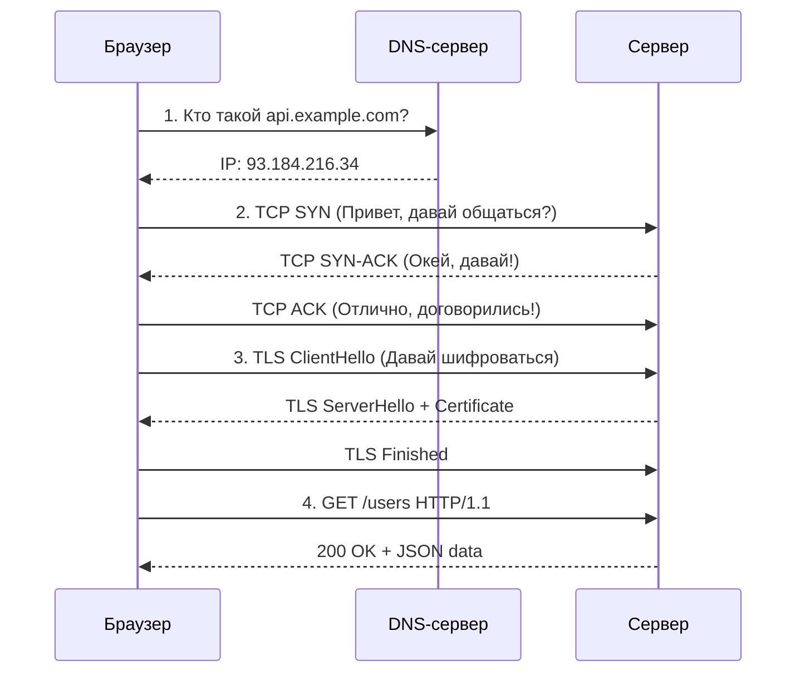
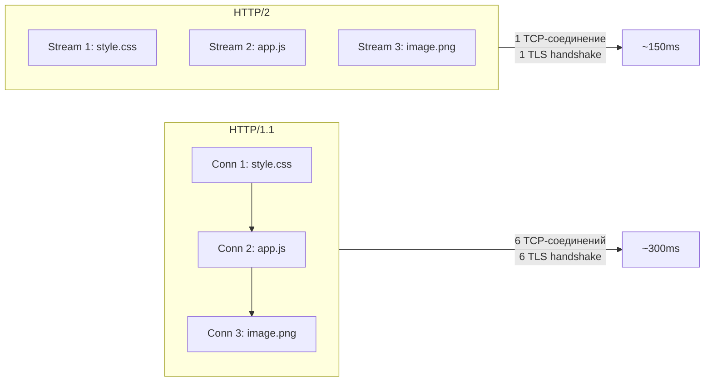
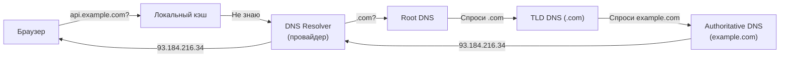
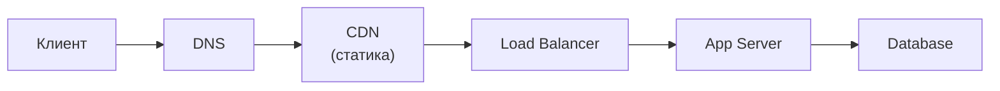

# 🔥 Уровень 0: Сеть и протоколы

## 🎯 Как запрос путешествует от браузера к серверу

Когда вы набираете `https://api.example.com/users` в браузере и нажимаете Enter, за кулисами происходит целая одиссея. Запрос проходит через десятки устройств, несколько протоколов и сотни километров кабелей — и всё это за **50-200 миллисекунд**.

Представьте, что вы отправляете посылку. Вы не просто бросаете её в окно — вы пишете адрес (DNS), заключаете договор с курьером (TCP handshake), запечатываете в конверт (TLS) и только потом кладёте содержимое (HTTP). Сеть работает точно так же.



Каждый этап добавляет задержку. DNS lookup — 20-120 мс. TCP handshake — 1 RTT. TLS — ещё 1-2 RTT. И только потом летит ваш запрос.

## 🔥 Стек TCP/IP: четыре уровня сети

Вся сетевая коммуникация в интернете построена на **стеке TCP/IP** — четырёхуровневой модели, где каждый уровень отвечает за свою задачу.

| Уровень | Название | Протоколы | Аналогия |
|---------|----------|-----------|----------|
| 4 | **Прикладной** | HTTP, WebSocket, gRPC, DNS | Текст письма |
| 3 | **Транспортный** | TCP, UDP | Конверт (гарантия доставки) |
| 2 | **Сетевой** | IP, ICMP | Адрес на конверте |
| 1 | **Канальный** | Ethernet, Wi-Fi | Почтовый грузовик |

💡 Данные **инкапсулируются** на каждом уровне: HTTP-запрос оборачивается в TCP-сегмент, тот — в IP-пакет, тот — в Ethernet-фрейм. На приёмной стороне слои «разворачиваются» в обратном порядке.

### TCP vs UDP: когда надёжность важнее скорости

**TCP (Transmission Control Protocol)** — надёжная доставка с гарантией порядка. Как заказное письмо с уведомлением.

**UDP (User Datagram Protocol)** — быстрая отправка без гарантий. Как открытка — бросил в ящик и забыл.

```
TCP (заказное письмо):
1. Установить соединение (3-way handshake)
2. Отправить данные
3. Получить подтверждение (ACK)
4. Если потеряно — повторить отправку
5. Закрыть соединение

UDP (открытка):
1. Отправить данные
2. ...всё!
```

| Характеристика | TCP | UDP |
|---|---|---|
| Надёжность | Гарантированная доставка | Без гарантий |
| Порядок | Сохраняется | Не гарантирован |
| Handshake | 3-way (SYN, SYN-ACK, ACK) | Нет |
| Скорость | Медленнее (overhead) | Быстрее |
| Применение | HTTP, email, файлы | Видео, игры, DNS |

## 🔥 HTTP: от 1.1 до 3

### HTTP/1.1 — очередь в кассу

HTTP/1.1 работает как очередь в супермаркете с одной кассой: каждый запрос ждёт, пока предыдущий завершится. Это называется **Head-of-Line (HOL) blocking**.

```
HTTP/1.1 — последовательные запросы в одном соединении:

Соединение 1: [GET /style.css]──────[GET /app.js]──────[GET /image.png]
                  200ms                 150ms                300ms
                                                        Итого: 650ms

Браузеры обходят это, открывая 6-8 параллельных соединений:

Соединение 1: [GET /style.css]──────
Соединение 2: [GET /app.js]─────
Соединение 3: [GET /image.png]──────────
                                        Итого: ~300ms
```

Но каждое соединение — это отдельный TCP + TLS handshake, а значит лишние RTT и расход ресурсов.

### HTTP/2 — мультиплексинг

HTTP/2 решает проблему HOL blocking через **мультиплексинг**: множество запросов летят параллельно через **одно TCP-соединение**, разбитые на потоки (streams).



Ключевые фичи HTTP/2:

- **Мультиплексинг** — параллельные потоки в одном соединении
- **Server Push** — сервер может отправить ресурсы до того, как браузер их запросит
- **Сжатие заголовков (HPACK)** — заголовки кодируются и кэшируются
- **Приоритизация потоков** — важные ресурсы загружаются первыми

📌 Но HTTP/2 всё ещё построен поверх TCP, и если TCP-пакет теряется — **все потоки блокируются** до его ретрансмиссии. Это TCP-level HOL blocking.

### HTTP/3 — QUIC и прощай, TCP

HTTP/3 заменяет TCP на **QUIC** — протокол поверх UDP, разработанный Google. QUIC решает TCP-level HOL blocking: потеря пакета в одном потоке не блокирует остальные.

```
Установка соединения:

HTTP/1.1 + TLS 1.2:  TCP (1 RTT) + TLS (2 RTT) = 3 RTT
HTTP/2 + TLS 1.3:    TCP (1 RTT) + TLS (1 RTT) = 2 RTT
HTTP/3 + QUIC:       QUIC + TLS (1 RTT)         = 1 RTT
                      Повторное: 0 RTT (0-RTT reconnect)
```

| Характеристика | HTTP/1.1 | HTTP/2 | HTTP/3 |
|---|---|---|---|
| Транспорт | TCP | TCP | QUIC (UDP) |
| Мультиплексинг | Нет | Да | Да |
| HOL blocking | HTTP-level | TCP-level | Нет |
| Handshake | 3+ RTT | 2 RTT | 1 RTT (0-RTT) |
| Сжатие заголовков | Нет | HPACK | QPACK |

## 🔥 WebSocket: двусторонняя связь

HTTP — это «запрос-ответ»: клиент спрашивает, сервер отвечает. Но что если серверу нужно **самому** отправить данные клиенту? Чат, уведомления, биржевые котировки — всё это требует push-механизма.

**WebSocket** — протокол полнодуплексной связи поверх TCP. Он начинается как обычный HTTP-запрос (upgrade handshake), а потом превращается в постоянный двунаправленный канал.

```
HTTP (polling):
Клиент: "Есть новые сообщения?" → Сервер: "Нет"
Клиент: "Есть новые сообщения?" → Сервер: "Нет"
Клиент: "Есть новые сообщения?" → Сервер: "Да! Вот они"
                                 (Лишние запросы каждые N секунд)

WebSocket:
Клиент: "Upgrade to WebSocket" → Сервер: "101 Switching Protocols"
         ←→ Двусторонний канал открыт ←→
Сервер: "Новое сообщение!"   (Пуш без запроса)
Клиент: "Отправляю ответ"    (Мгновенно)
```

```typescript
// Пример WebSocket на клиенте
const ws = new WebSocket('wss://chat.example.com')

ws.onopen = () => {
  ws.send(JSON.stringify({ type: 'join', room: 'general' }))
}

ws.onmessage = (event) => {
  const message = JSON.parse(event.data)
  console.log('New message:', message)
}
```

📌 WebSocket идеален для **реального времени**, но для обычных API это overkill: сложнее масштабировать, нет встроенного кэширования, нет стандартных кодов ошибок.

## 🔥 gRPC: быстрые микросервисы

**gRPC** — фреймворк удалённого вызова процедур от Google. Работает поверх HTTP/2 и использует **Protocol Buffers** для сериализации — бинарный формат, в 3-10 раз компактнее JSON.

```protobuf
// user.proto — описание API
service UserService {
  rpc GetUser (GetUserRequest) returns (User);
  rpc ListUsers (ListUsersRequest) returns (stream User);  // Server streaming
}

message GetUserRequest {
  string user_id = 1;
}

message User {
  string id = 1;
  string name = 2;
  string email = 3;
}
```

Почему gRPC популярен в микросервисах:

- **Скорость** — бинарная сериализация + HTTP/2 мультиплексинг
- **Строгая типизация** — контракт описан в .proto файлах, генерируется код для клиента и сервера
- **Streaming** — четыре режима: unary, server streaming, client streaming, bidirectional
- **Не для браузеров** — браузеры не поддерживают gRPC напрямую (нужен grpc-web proxy)

| Характеристика | REST (JSON) | gRPC (Protobuf) |
|---|---|---|
| Формат | Текстовый (JSON) | Бинарный (Protobuf) |
| Транспорт | HTTP/1.1 или HTTP/2 | HTTP/2 |
| Контракт | OpenAPI (опционально) | .proto (обязательно) |
| Streaming | Нет (кроме SSE) | 4 режима |
| Размер payload | Больше | В 3-10x меньше |
| Браузер | Да | Нет (нужен proxy) |

## 📌 DNS: телефонная книга интернета

Люди запоминают имена, компьютеры — IP-адреса. **DNS (Domain Name System)** переводит одно в другое.



Этапы DNS-резолюции:

1. **Браузерный кэш** — проверяет, есть ли IP в памяти
2. **OS кэш** — проверяет `/etc/hosts` и системный кэш
3. **DNS Resolver** (рекурсивный) — обычно у провайдера или 8.8.8.8 (Google)
4. **Root DNS** → **TLD DNS** (.com, .org) → **Authoritative DNS** — иерархический поиск
5. Результат кэшируется с TTL (Time To Live)

💡 DNS-запрос обычно занимает 20-120 мс. Но если IP закэширован — **0 мс**. Именно поэтому при первом визите на сайт всё медленнее, чем при последующих.

## 📌 TLS: шифрование в пути

**TLS (Transport Layer Security)** шифрует данные между клиентом и сервером. Без TLS (чистый HTTP) любой роутер на пути видит ваши данные — логины, пароли, карточные данные — в открытом виде.

```
TLS 1.3 Handshake (1 RTT):

Клиент → Сервер: ClientHello + поддерживаемые cipher suites + key share
Сервер → Клиент: ServerHello + выбранный cipher + сертификат + key share
                  → С этого момента всё зашифровано ←
Клиент → Сервер: Finished (зашифровано)
```

TLS 1.3 vs TLS 1.2:
- **TLS 1.2**: 2 RTT на handshake
- **TLS 1.3**: 1 RTT (убрали лишний round-trip, упростили cipher negotiation)
- **TLS 1.3 0-RTT**: при повторном подключении — 0 RTT (отправляем данные сразу)

## 🔥 Ключевые метрики сети

### Latency vs Throughput

Представьте водопроводную трубу:
- **Latency (задержка)** — время, за которое первая капля дойдёт от крана до ведра. Измеряется в **миллисекундах**.
- **Throughput (пропускная способность)** — сколько воды пройдёт через трубу за секунду. Измеряется в **Мбит/с**.

Можно иметь огромный throughput (толстая труба), но высокий latency (труба длиной в километр). Или наоборот — низкий latency, но маленький throughput.

### RTT (Round-Trip Time)

Время, за которое пакет долетит до сервера **и вернётся обратно**. Один RTT — это один «пинг».

```
Типичные RTT:
- Внутри дата-центра:     0.5 мс
- Между городами (100 км): 1-5 мс
- Между континентами:      100-300 мс
- Спутниковый интернет:    600+ мс
```

### Bandwidth

Максимальная пропускная способность канала. Но **реальный throughput** всегда ниже: конкуренция за ресурс, TCP congestion control, потери пакетов.

### Connection pooling и Keep-Alive

Создание TCP-соединения стоит 1 RTT (+ TLS). Если для каждого запроса открывать новое соединение — теряем время.

```
Без keep-alive:
[TCP] [TLS] [GET /api] [close] [TCP] [TLS] [GET /users] [close]
  1 RTT  1 RTT              1 RTT  1 RTT

С keep-alive (HTTP/1.1 по умолчанию):
[TCP] [TLS] [GET /api] [GET /users] [GET /posts] ... [close]
  1 RTT  1 RTT   ← соединение переиспользуется →
```

**Connection pool** — пул предустановленных соединений к серверу. Вместо открытия нового соединения на каждый запрос, берём готовое из пула.

## 📌 Путь запроса в продакшене

В реальном продакшене запрос проходит через несколько промежуточных слоёв:



- **CDN (Content Delivery Network)** — кэширует статику (картинки, JS, CSS) на серверах, ближайших к пользователю. Вместо 200 мс до оригинала — 20 мс до ближайшего CDN-узла.
- **Load Balancer** — распределяет запросы между несколькими серверами приложения.
- **App Server** — обрабатывает бизнес-логику.
- **Database** — хранит и отдаёт данные.

Каждый слой добавляет latency, но при этом повышает надёжность и масштабируемость.

## ⚠️ Частые ошибки новичков

### 🐛 1. Думать, что HTTP/2 всегда быстрее HTTP/1.1

```
❌ "Переключим всё на HTTP/2 — станет быстрее!"
```

> **Почему это ошибка:** HTTP/2 выигрывает при **множестве параллельных запросов** (загрузка страницы с десятками ресурсов). Но для одиночного API-вызова разница минимальна. А при плохом сетевом канале TCP-level HOL blocking в HTTP/2 может быть **хуже** множества TCP-соединений в HTTP/1.1.

```
✅ HTTP/2 даёт максимум пользы при загрузке веб-страниц
   с множеством ресурсов. Для API — выгода в сжатии заголовков
   и connection reuse, но не в мультиплексинге.
```

### 🐛 2. Использовать WebSocket для всего

```typescript
// ❌ WebSocket для обычного CRUD API
const ws = new WebSocket('wss://api.example.com')
ws.send(JSON.stringify({ action: 'getUsers' }))
```

> **Почему это ошибка:** WebSocket — это постоянное TCP-соединение на каждого клиента. 10 000 пользователей = 10 000 открытых соединений. Это потребляет память, усложняет масштабирование и ломает кэширование.

```typescript
// ✅ HTTP для CRUD, WebSocket только для real-time
fetch('/api/users')               // Обычные данные
new WebSocket('/ws/notifications') // Только push-уведомления
```

### 🐛 3. Игнорировать DNS TTL при миграциях

```
❌ Сменить IP сервера и ожидать мгновенного переключения
```

> **Почему это ошибка:** DNS-записи кэшируются с TTL (часто 300-3600 секунд). Клиенты будут обращаться по старому IP до истечения TTL. При миграции нужно **заранее** снизить TTL.

```
✅ За 24-48 часов до миграции снизить TTL до 60 секунд.
   После миграции и проверки — вернуть TTL обратно.
```

### 🐛 4. Не учитывать TLS overhead в расчётах латентности

```
❌ "Сервер отвечает за 5 мс, значит пользователь увидит ответ через 5 мс"
```

> **Почему это ошибка:** DNS (20-120 мс) + TCP handshake (1 RTT) + TLS handshake (1-2 RTT) + запрос (1 RTT) + обработка (5 мс) + ответ. При RTT 50 мс первый запрос займёт ~200-250 мс, а не 5 мс.

```
✅ Полная латентность = DNS + TCP + TLS + Request + Processing + Response
   Считайте все этапы, особенно для cold start (первый запрос).
```

## 📌 Итоги

- ✅ Запрос проходит путь: DNS → TCP → TLS → HTTP → Server → Response
- ✅ TCP — надёжный, UDP — быстрый. Выбор зависит от задачи
- ✅ HTTP/2 = мультиплексинг в одном TCP. HTTP/3 = QUIC поверх UDP, нет HOL blocking
- ✅ WebSocket — для real-time (чаты, уведомления), не для обычных API
- ✅ gRPC — для микросервисов: бинарный, строго типизированный, с streaming
- ✅ DNS — иерархическая система с кэшированием (учитывайте TTL!)
- ✅ TLS 1.3 = 1 RTT handshake, TLS 1.2 = 2 RTT
- 📌 Latency складывается из ВСЕХ этапов: DNS + TCP + TLS + HTTP + processing
- 📌 Connection pooling и keep-alive — обязательны для производительности
