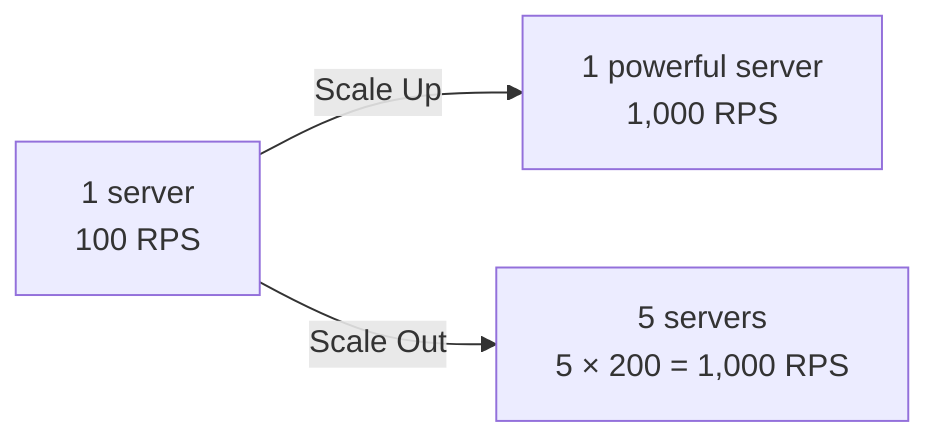
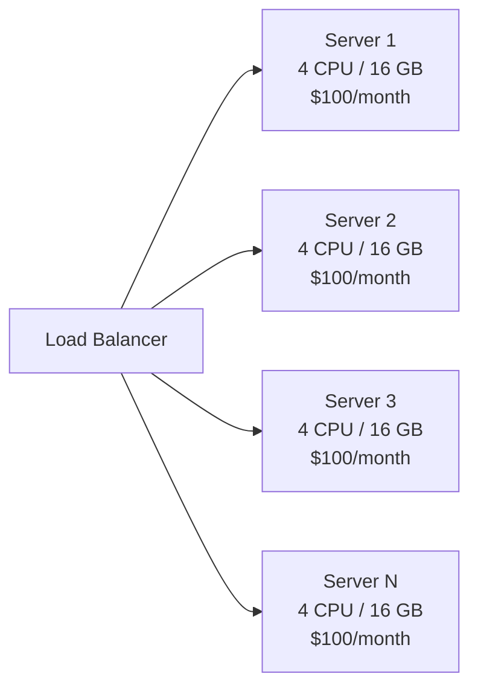
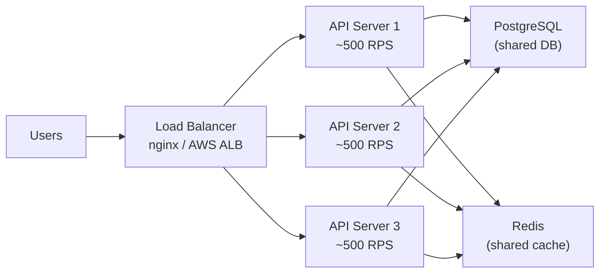
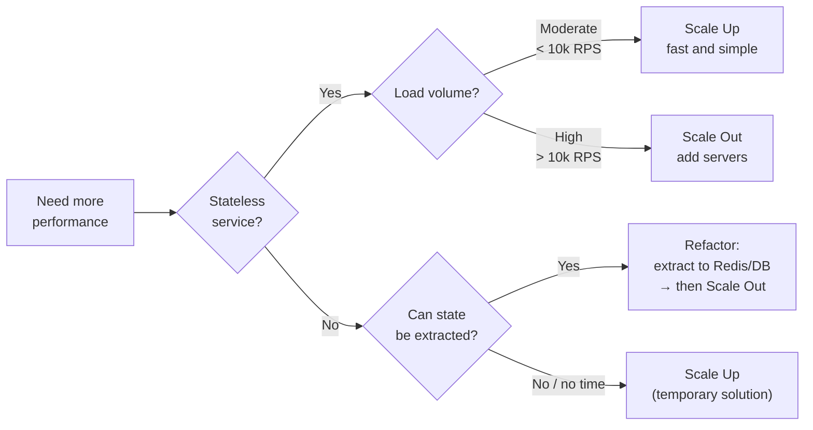
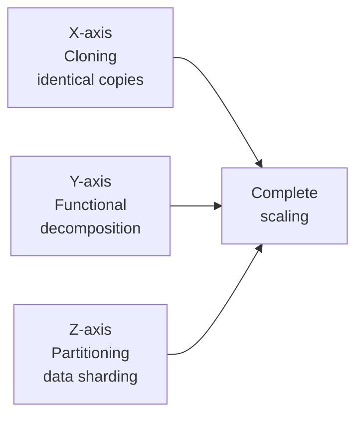
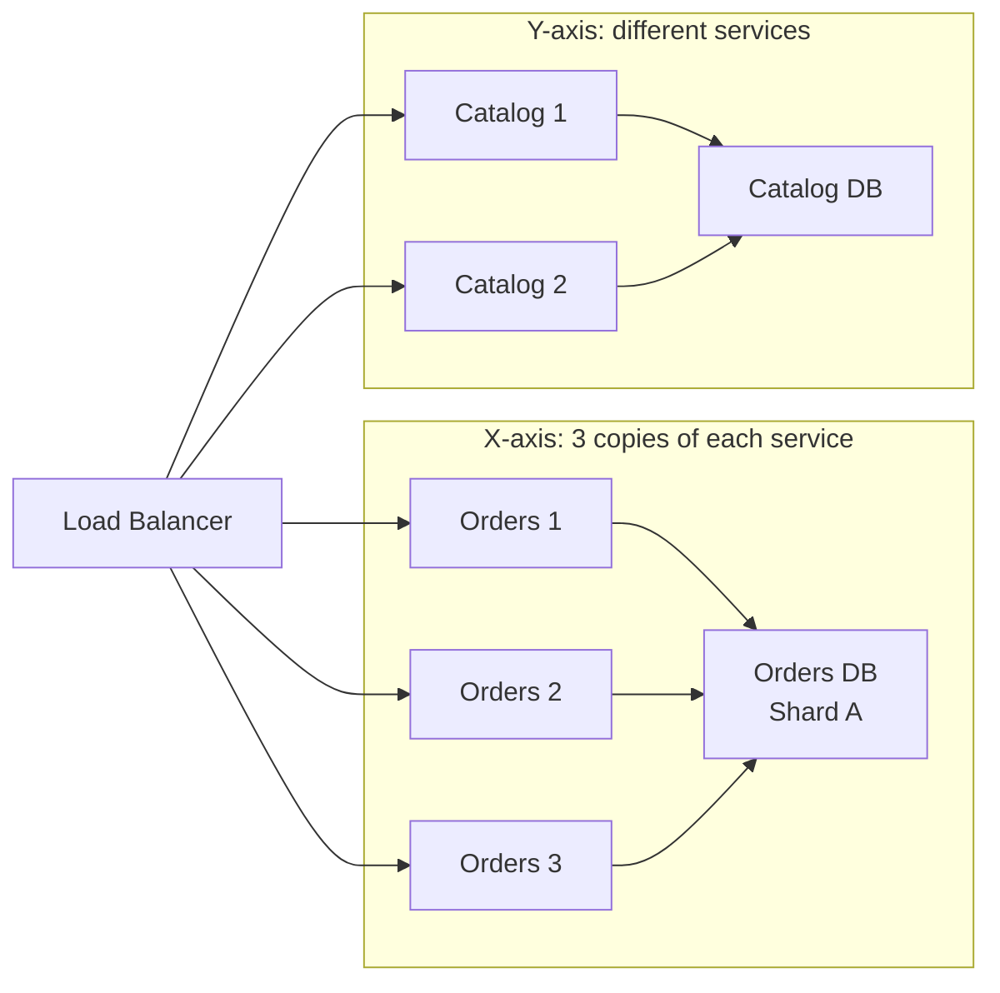

# Level 1: Scaling -- Horizontal, Vertical, and Everything In Between

## Introduction

Imagine you opened a small shop. One cashier handles five customers per hour. Business boomed -- now 500 people arrive. What to do?

First instinct: hire a faster, more experienced cashier. Maybe two. But even a super-cashier has a speed limit -- you can't cheat physics. So we open more registers and hire regular staff. If more customers come -- we add more registers.

This is exactly the same dilemma every engineer faces when user load exceeds a single server's capacity. **Scaling** is the art and engineering discipline of ensuring a system grows along with load growth, while maintaining reliability and manageability.

At this level we will cover:

1. **Vertical scaling** -- what "make the server more powerful" means and why it only works up to a certain point
2. **Horizontal scaling** -- how to add servers and what you need to prepare for it to work at all
3. **Stateless vs Stateful** -- the key distinction without which horizontal scaling won't work
4. **Scaling Cube** -- a three-dimensional model of system growth from "The Art of Scalability"
5. **Amdahl's Law** -- a mathematical limitation no one can bypass
6. **Shared-Nothing Architecture** -- why the best scalable systems avoid shared resources

---

## 1. Why Scale?

### The Problem of Growing Load

Your startup takes off. Yesterday there were 100 users, today -- 10,000, tomorrow -- a million. The server starts choking: response time grows, requests time out, users leave. What to do?

This is a classic scenario that repeats again and again. Twitter in 2008, GitHub in 2011, Clubhouse in 2021 -- all went through the moment when the architecture stopped handling the load.

Important to understand: the problem doesn't appear suddenly. First, the 95th percentile response time creeps from 50ms to 200ms. Then the database starts complaining about slow queries. Then the server CPU stays at 80%. Then timeouts begin. By the time everything completely "goes down," signals have been there for a while -- they just weren't noticed.

### Two Fundamentally Different Paths

Imagine the same restaurant. You have one chef and a queue of 50 people. Two paths:

- **Hire a super-chef** with six hands (vertical scaling)
- **Open more kitchens** with regular chefs (horizontal scaling)



Both paths lead to the same result -- 1,000 requests per second. But the cost, complexity, and long-term consequences are fundamentally different.

### What Load Actually Is

Before scaling, you need to understand what exactly is loading the system. "Many users" is too vague. Concrete metrics:

| Metric | What It Measures | Tools |
|---|---|---|
| RPS / QPS | Requests per second / per minute | Nginx logs, Prometheus |
| Latency (p50, p95, p99) | Response time by percentile | APM, Grafana |
| CPU utilization | Processor load | top, htop, CloudWatch |
| Memory usage | RAM usage | free -h, Prometheus |
| DB connections | Connection pool to DB | pg_stat_activity, slow log |
| Error rate | Percentage of error responses | ELK, Sentry |

Rule: never scale "blindly." First measure, find the bottleneck, then decide on a strategy.

---

## 2. Vertical Scaling (Scale Up)

### The Essence of the Approach

**Scale Up** -- increasing a single server's resources: more CPU, RAM, SSD, network. Instead of adding machines, you make the existing machine more powerful.

```
Before:                        After:
┌──────────────┐              ┌──────────────────────┐
│ 4 CPU cores  │              │ 64 CPU cores         │
│ 16 GB RAM    │    Scale     │ 512 GB RAM           │
│ 500 GB HDD   │ ──────Up──→ │ 2 TB NVMe SSD        │
│ 1 Gbps       │              │ 25 Gbps              │
│              │              │                      │
│ $100/month   │              │ $5,000/month         │
└──────────────┘              └──────────────────────┘
```

Zero code changes. The server just "became faster" from the application's perspective.

### When This is the Right Choice

Vertical scaling is not an anti-pattern. There are situations where it's the best or only sensible path:

**Database in early stages.** Horizontal scaling of a DB is complex: sharding, replication, eventual consistency. For most projects, the right strategy is to vertically scale the leader node first, and add horizontal scaling only when truly necessary.

**Monolith at MVP stage.** If a three-person team is building a startup and wants to validate a hypothesis -- don't build microservices right away. Scale Up solves the load problem until the business model is proven.

**Legacy application.** If you have a stateful monolith that you don't have time to rewrite -- Scale Up buys you time.

**Stateful services.** ZooKeeper, Kafka broker, PostgreSQL primary -- all of these are hard to scale horizontally without special effort. Scale Up is natural here.

### Pros of Scale Up

- **Simplicity** -- no need to change architecture, code stays the same. Just change the instance type in AWS Console
- **No distributed state problems** -- data on one server, no consistency questions
- **Transactions work "out of the box"** -- full ACID guarantees on a single node
- **Predictability** -- no network delays between nodes, no partial failures

### Cons of Scale Up

- **Hardware ceiling** -- maximum AWS server: 448 vCPU, 24 TB RAM. This is the ceiling you can't break through
- **Single Point of Failure (SPOF)** -- server down = everything down. No redundancy
- **Exponential cost growth** -- each doubling of power costs disproportionately more
- **Downtime during scaling** -- to change instance type, you need to stop the server

### The Cost Curve: Why Scale Up Costs Non-Linearly

This is fundamental hardware economics. Doubling performance doesn't cost twice as much -- it costs three to five times more.

```
Scale Up cost curve:

Cost ($)
    │
5000│                              ●
    │                         ●
    │                    ●
    │               ●
    │          ●
    │     ●
 100│ ●
    └──────────────────────────────→ Power
      4    8   16   32   64   128 vCPU
```

Why? A server with 128 vCPU isn't just 32 servers with 4 vCPU in one case. It's special processors, multi-channel memory, high-speed interconnect, reliable power supply -- all of this adds cost non-linearly. AWS m7i.48xlarge (192 vCPU, 768 GB RAM) costs $9.67/hour. Thirty-two m7i.xlarge (4 vCPU, 16 GB RAM) -- $0.2016 × 32 = $6.45/hour. And that's 128 vCPU total, with better fault tolerance.

### The Limit of Vertical Scaling

Imagine you're tuning a car. Up to 100 km/h -- no problem, pedal to the metal. Up to 200 -- works, but aerodynamics starts to matter. Up to 300 -- engine at the limit, fuel burns insanely. Up to 400 -- needs special fuel, special tires, the car costs as much as a plane. Scale Up works the same way: at each next level of power, costs grow faster and faster.

---

## 3. Horizontal Scaling (Scale Out)

### The Essence of the Approach

**Scale Out** -- adding new servers that work in parallel. Instead of one powerful machine -- many regular ones that share the load.



Ideally: adding a server = proportionally increasing throughput. In reality -- almost so, with some caveats (see Amdahl's Law below).

### Pros of Scale Out

- **No ceiling** -- you can always add more servers. Netflix, Google, Facebook run on thousands of regular servers
- **Fault tolerance** -- one server down, others continue working. Load is redistributed
- **Linear cost growth** -- 10 servers = 10 × $100 = $1,000. Predictable and manageable
- **Zero-downtime scaling** -- add servers "on the fly" without service interruption

### Cons of Scale Out

- **Architecture complexity** -- distributed state, consistency, network errors -- a new class of problems
- **Need a load balancer** -- someone has to distribute requests. The balancer itself can become a bottleneck
- **Not everything can scale horizontally** -- stateful services need special effort
- **Debugging is harder** -- a bug might only reproduce on a specific server, distributed tracing is required

### The Cost Curve of Scale Out: Why It's Cheaper

```
Scale Out cost curve:

Cost ($)
    │
1000│                              ●
    │                         ●
 800│                    ●
    │               ●
 600│          ●
    │     ●
 200│ ●
    └──────────────────────────────→ Power
      1    2    4    6    8   10 servers
```

Linear cost curve -- the CFO's dream. Every dollar invested in power gives the same return. There's some overhead on infrastructure (load balancer, network), but it's minimal compared to the superlinear cost growth of Scale Up.

### What Horizontal Scaling Looks Like in Practice

Scenario: your API server handles 500 RPS, CPU at 70%. Load is growing, 1,500 RPS expected in a month.

**Step 1.** Ensure the service is stateless (more on this in the next section).

**Step 2.** Add a load balancer in front of the existing server.

**Step 3.** Launch a second identical server, add it to the balancer pool.

**Step 4.** Monitor: load should distribute roughly 50/50.

**Step 5.** Before expected growth, add a third server.



---

## 4. Comparison: When to Choose What

### Comparison Table

| Criterion | Vertical (Scale Up) | Horizontal (Scale Out) |
|---|---|---|
| Complexity | Simple -- nothing to change in code | Complex -- needs stateless architecture |
| Ceiling | Limited by hardware (~24 TB RAM on AWS) | Practically unlimited |
| Fault tolerance | SPOF -- single point of failure | High -- servers duplicate each other |
| Cost at growth | Exponential | Linear |
| Downtime during scaling | Yes (server restart) | No (add "on the fly") |
| Data | Local, simple | Distributed, requires architectural work |
| Debugging | Simple | Needs distributed tracing |
| When to use | MVP, small projects, databases | High-load services, stateless APIs |

### Decision Tree



### Reality: Hybrid Approach

Most production systems use **both approaches simultaneously**. General strategy:

1. **MVP phase** -- one server, Scale Up as load grows
2. **Growth phase** -- Scale Up to a reasonable limit ($500-1000/month per server). In parallel, design stateless architecture
3. **Scaling phase** -- Scale Out: multiple servers behind a load balancer. Scale Up each node to optimal size
4. **Maturity phase** -- Y and Z axes of the Scaling Cube (decomposition and sharding)

There's no point in horizontal scaling from day one -- that's premature optimization with enormous complexity cost. Stack Overflow runs on a single very powerful SQL Server and handles millions of requests perfectly.

---

## 5. Stateless vs Stateful: The Key to Horizontal Scaling

### Why This is Critically Important

Horizontal scaling works well only if services are **stateless** -- they don't store state between requests. This isn't an optional recommendation -- it's a hard architectural requirement.

Ask this question: if the load balancer accidentally routes the next request from the same user to a different server -- will everything still work correctly? If "yes" -- the service is stateless. If "no" -- it's stateful.

### Stateless Service: What It Looks Like

Every request contains **all** necessary information. The server doesn't remember previous requests.

```typescript
// Stateless API -- any server can handle the request
app.get('/api/users/:id', async (req, res) => {
  // Authorization token -- in the request header (not in server memory)
  const token = req.headers.authorization
  const userId = verifyJWT(token) // Decode from token -- without accessing "memory"

  // Data -- in external DB, not in server memory
  const user = await db.users.findById(req.params.id)

  res.json(user)
})
```

**Analogy:** fast food. You go to **any** register, give your order, get your food. The cashier doesn't need to remember you. If the cashier gets sick -- another one will serve you exactly the same way, because you have a receipt (token) with complete order information.

**Key signs of a stateless service:**
- Authorization via JWT or API keys (not server-side sessions)
- No `Map`, `Set`, `{}` in global scope for storing user data
- Temporary files aren't stored locally (or aren't needed for subsequent requests)
- All state lives in external storage: DB, Redis, S3

### Stateful Service: Where the Problem Is

The server stores client state in its memory. The next request **must** hit the same server.

```typescript
// ❌ Stateful -- session in server memory
const sessions = new Map<string, UserSession>()

app.post('/api/login', (req, res) => {
  const session = { userId: req.body.userId, cart: [] }
  sessions.set(req.sessionId, session)  // Stored in RAM of this server!
  res.json({ ok: true })
})

app.get('/api/cart', (req, res) => {
  // If request hits another server -- session not found!
  const session = sessions.get(req.sessionId)
  if (!session) return res.status(401).json({ error: 'Session not found' })
  res.json(session.cart)
})
```

**What happens with horizontal scaling:**

1. User logs in → hits Server 1 → session created in Map on Server 1
2. Next request → load balancer sends to Server 2
3. Server 2: `sessions.get(req.sessionId)` → `undefined` → 401 Unauthorized
4. User sees "Session not found" and gets frustrated

**Analogy:** a personal hairdresser. They remember your haircut, preferences, dye allergies. If they're sick -- another stylist knows nothing about you. This is fine for a one-stylist salon, but unacceptable for a salon chain with a shared client base.

### Three Strategies for Solving the State Problem

**Strategy 1: Extract state to external storage (recommended)**

Best option. State is stored in Redis or a DB, accessible to all servers.

```typescript
// ✅ Stateless -- session in Redis
import Redis from 'ioredis'
const redis = new Redis()

app.post('/api/login', async (req, res) => {
  const session = { userId: req.body.userId, cart: [] }
  // Write to Redis with 1 hour TTL -- any server can read
  await redis.set(`session:${req.sessionId}`, JSON.stringify(session), 'EX', 3600)
  res.json({ ok: true })
})

app.get('/api/cart', async (req, res) => {
  // Any server reads from Redis -- session always available
  const raw = await redis.get(`session:${req.sessionId}`)
  if (!raw) return res.status(401).json({ error: 'Session not found' })
  const session = JSON.parse(raw)
  res.json(session.cart)
})
```

**Strategy 2: Session affinity (sticky sessions)**

The load balancer remembers which server the client was first sent to and always sends them there. Solves the problem but creates new ones:

- If the server goes down -- all its users lose sessions
- Load distributes unevenly (one "heavy" client = one overloaded server)
- During deployment or autoscaling -- sessions are lost

```nginx
# Nginx: sticky sessions by client IP
upstream backend {
    ip_hash;  # Client with same IP always goes to same server
    server 192.168.1.1:3000;
    server 192.168.1.2:3000;
    server 192.168.1.3:3000;
}
```

Sticky sessions are a temporary workaround, not an architectural solution.

**Strategy 3: Pass state in the request (JWT)**

Instead of server-side sessions -- use a self-contained token (JWT) that holds user data and is signed with a secret key. The server stores nothing -- it only verifies the signature.

```typescript
// ✅ JWT -- token contains all data, server is stateless
import jwt from 'jsonwebtoken'

app.post('/api/login', async (req, res) => {
  const user = await db.users.findOne({ email: req.body.email })
  // Create JWT with user data -- don't save it anywhere
  const token = jwt.sign(
    { userId: user.id, role: user.role },
    process.env.JWT_SECRET,
    { expiresIn: '1h' }
  )
  res.json({ token })
})

app.get('/api/profile', (req, res) => {
  // Decode from header -- no DB or Redis call
  const payload = jwt.verify(req.headers.authorization?.split(' ')[1], process.env.JWT_SECRET)
  res.json({ userId: payload.userId, role: payload.role })
})
```

JWT limitation: you can't "revoke" a token before it expires (unless you maintain a blacklist in Redis, which partially brings us back to external storage).

---

## 6. Scaling Cube: Three Axes of Scaling

### AKF Scale Cube Model

**AKF Scale Cube** -- a model from "The Art of Scalability" by Abbott and Fisher. Describes three independent dimensions along which a system can scale. Real production systems use all three axes simultaneously.



### X-axis: Cloning (Horizontal Duplication)

The simplest way -- run N identical copies of a service behind a load balancer. This is literally the horizontal scaling we discussed above.

```
          ┌───────────────┐
          │ Load Balancer │
          └───────┬───────┘
       ┌──────────┼──────────┐
       ▼          ▼          ▼
  ┌─────────┐ ┌─────────┐ ┌─────────┐
  │ App v1  │ │ App v1  │ │ App v1  │  ← Same code
  │ Clone 1 │ │ Clone 2 │ │ Clone 3 │
  └─────────┘ └─────────┘ └─────────┘
```

**Condition:** the service must be stateless.

**What it solves:** high load, fault tolerance.

**What it doesn't solve:** if all load goes to one type of operation (e.g., search) -- you scale useless parts too.

**Example:** three copies of your API server behind AWS Application Load Balancer. Each handles a third of requests.

### Y-axis: Functional Decomposition

Splitting a monolith into separate services by business function. This is what **microservice architecture** is called.

```
Monolith:                    Microservices:
┌──────────────────┐        ┌──────────┐  ┌──────────┐  ┌──────────┐
│ Auth             │        │ Auth     │  │ Catalog  │  │ Orders   │
│ Catalog          │   →    │ Service  │  │ Service  │  │ Service  │
│ Orders           │        └──────────┘  └──────────┘  └──────────┘
│ Notifications    │        ┌──────────┐  ┌──────────┐
│ Search           │        │ Notify   │  │ Search   │
└──────────────────┘        │ Service  │  │ Service  │
                            └──────────┘  └──────────┘
```

Each service scales **independently**: if search is loaded -- add copies of only Search Service. If auth is light -- keep one copy of Auth Service.

**Key advantage of Y-axis:** independent scaling by load. Different functions have fundamentally different loads -- no point scaling everything together.

**Real example -- Amazon Prime Day:**
- Catalog Service: +500% traffic (everyone browsing products)
- Orders Service: +300% traffic (purchases)
- Returns Service: +50% traffic (returns -- the next day)

With a monolith, you need to scale everything at once. With Y-axis -- each service independently.

### Z-axis: Data Partitioning (Sharding)

Splitting data across servers by key (sharding). Each server is responsible for its own "slice" of data.

```
All users:                  Sharding by ID:

┌──────────────────────┐       ┌─────────┐  ┌─────────┐  ┌─────────┐
│ Users 1 — 1,000,000  │       │ Shard 1 │  │ Shard 2 │  │ Shard 3 │
│                      │  →    │ ID 1-   │  │ ID 334K-│  │ ID 667K-│
│ (one DB, slow)       │       │ 333K    │  │ 666K    │  │ 1M      │
└──────────────────────┘       └─────────┘  └─────────┘  └─────────┘
```

**Sharding strategies:**

| Strategy | How It Works | Pros | Cons |
|---|---|---|---|
| Range-based | ID 1-333K → Shard 1 | Simple, range queries | Hotspot if new records go to one shard |
| Hash-based | shard = hash(userId) % N | Even distribution | Range queries are complex |
| Geographic | EU users → EU shard | Low latency, compliance | Uneven load between regions |
| Directory-based | Lookup table who's where | Flexibility | Additional service |

**When Z-axis isn't needed:** if X and Y already handle it. Z-axis is the most complex dimension, add it last.

### Combining All Three Axes

In real systems, all three axes work together:



---

## 7. Amdahl's Law: The Mathematical Limit of Scaling

### Where the Law Comes From and What It Says

**Amdahl's Law** was formulated by Gene Amdahl in 1967. He was researching parallel computing and noticed an inconvenient truth: not all code can be parallelized. There are always sequential sections that become bottlenecks.

The formula:

```
Speedup = 1 / (S + (1 - S) / N)

Where:
  S -- fraction of sequential (non-parallelizable) code
  N -- number of processors (servers)
```

**Analogy with pregnancy:** nine women can't have a baby in one month. Some processes simply cannot be parallelized. In programming: writes to a single leader DB node, global locks, sequential dependencies in business logic.

### Calculation for a System with 5% Sequential Code

If 5% of operations are **necessarily** sequential (write to leader DB, cache invalidation):

```
N = 1 server:    Speedup = 1 / (0.05 + 0.95/1)   = 1.0x   (baseline)
N = 2 servers:   Speedup = 1 / (0.05 + 0.95/2)   = 1.9x
N = 5 servers:   Speedup = 1 / (0.05 + 0.95/5)   = 3.8x
N = 10 servers:  Speedup = 1 / (0.05 + 0.95/10)  = 6.9x   (not 10x!)
N = 100:         Speedup = 1 / (0.05 + 0.95/100) = 16.8x  (not 100x!)
N = 1000:        Speedup = 1 / (0.05 + 0.95/1000)= 19.2x  (not 1000x!)
N = infinity:    Speedup = 1 / 0.05               = 20x    (ceiling!)
```

With 5% sequential code, the **maximum speedup is 20x**, no matter how many servers you add. The ceiling is absolute.

### What a "Sequential Section" Is in a Web Application

```typescript
// Example: order processing
async function processOrder(orderId: string) {
  // ✅ Parallelizable: independent requests
  const [user, product, inventory] = await Promise.all([
    db.users.findById(order.userId),
    db.products.findById(order.productId),
    db.inventory.check(order.productId),
  ])

  // ❌ Sequential section: writing to DB -- one operation
  // All servers write to the same leader node
  await db.orders.create({
    userId: user.id,
    productId: product.id,
    // ...
  })

  // ❌ Sequential section: publishing to queue
  await messageQueue.publish('order.created', { orderId: result.id })

  return result
}
```

That's why minimizing sequential sections is so important. Every percentage point of sequential code cuts the scaling ceiling.

### Practical Conclusions from Amdahl's Law

**Find the bottleneck instead of adding servers.** If 20% of time is spent on a request to one external system (payment provider, slow microservice), adding servers won't help -- you're still waiting for that one thing.

**Async removes sequential constraints.** If a DB write can go through a queue (Kafka, RabbitMQ) -- the request doesn't wait for the write, the sequential section shrinks.

**Caching eliminates repeated sequential operations.** If 80% of requests read the same data -- a Redis cache moves them from "sequential" (reading from one source) to "parallel" (reading from local cache).

---

## 8. Shared-Nothing Architecture

### What It Is

**Shared-Nothing** -- an architecture where each node is fully autonomous: it has its own CPU, RAM, disk and doesn't share resources with other nodes. Nodes interact only through the network -- via explicit messages, not through shared memory or disk.

```
Shared-Everything:              Shared-Nothing:
┌────┐ ┌────┐ ┌────┐           ┌─────────┐  ┌─────────┐  ┌─────────┐
│ S1 │ │ S2 │ │ S3 │           │ S1      │  │ S2      │  │ S3      │
└─┬──┘ └─┬──┘ └─┬──┘           │ CPU+RAM │  │ CPU+RAM │  │ CPU+RAM │
  │      │      │              │ Disk    │  │ Disk    │  │ Disk    │
  └──────┼──────┘              │ Data A  │  │ Data B  │  │ Data C  │
         │                     └─────────┘  └─────────┘  └─────────┘
    ┌────┴────┐
    │ Shared  │  ← Bottleneck!
    │ Storage │
    └─────────┘
```

**Why Shared-Everything scales poorly:** the shared disk or memory becomes a bottleneck. Locks, resource contention -- performance drops as the number of nodes grows.

**Why Shared-Nothing scales excellently:** no resource contention. Each node works independently. Adding a node doesn't create additional load on existing ones.

### Examples of Shared-Nothing Systems

**Apache Cassandra** -- a distributed database. Each node stores its own range of tokens (data partitions). No master node, no shared disk.

**Apache Kafka** -- a distributed message broker. Each broker stores its own topic partitions. Brokers don't share data.

**Stateless API servers** -- each server is independent, data in a separate DB and Redis.

### How to Apply Shared-Nothing in Your Service

```typescript
// ❌ Shared state -- bad for scaling
class RateLimiter {
  private counts = new Map<string, number>() // Shared across the whole process

  check(ip: string): boolean {
    const count = this.counts.get(ip) || 0
    if (count >= 100) return false
    this.counts.set(ip, count + 1)
    return true
  }
}
// On 3 servers: each stores its own Map. A user can make 300 requests.
```

```typescript
// ✅ Shared-Nothing -- each server independent, state in Redis
class DistributedRateLimiter {
  constructor(private redis: Redis) {}

  async check(ip: string): Promise<boolean> {
    const key = `rate:${ip}`
    const count = await this.redis.incr(key)
    if (count === 1) await this.redis.expire(key, 60) // First increment -- set TTL
    return count <= 100
  }
}
// On 3 servers: all write to Redis. Counter is shared and accurate.
```

Shared-Nothing scales best because there are no shared resources that become bottlenecks.

---

## 9. Common Mistakes

### Mistake 1: Storing State in Process Memory

```typescript
// ❌ State in memory -- doesn't scale horizontally
const rateLimits = new Map<string, number>()

app.use((req, res, next) => {
  const count = rateLimits.get(req.ip) || 0
  if (count > 100) return res.status(429).send('Too many requests')
  rateLimits.set(req.ip, count + 1)
  next()
})
```

**Why this is wrong:** with 3 servers, each has its own Map. A user makes 100 requests on Server 1, then 100 on Server 2 -- the rate limiter doesn't trigger! Total: 300 requests instead of 100.

```typescript
// ✅ State in Redis -- works on any number of servers
app.use(async (req, res, next) => {
  const key = `rate:${req.ip}`
  const count = await redis.incr(key)
  if (count === 1) await redis.expire(key, 60)
  if (count > 100) return res.status(429).send('Too many requests')
  next()
})
```

**Where else this error appears:**
- In-memory cache (`const cache = {}`) -- each server caches its own, caches desync
- In-memory counters (number of active users, task queue)
- Temporary files in local `/tmp` -- if the next request hits another server, the file is gone

### Mistake 2: Scaling Horizontally Without Stateless Design

```
❌ "Let's add more servers and everything will speed up!"
```

**What happens:** servers are stateful (store sessions, cache, temporary files in memory). After adding a second server, half the requests start getting "Session not found" errors. Users complain, you roll back.

```
✅ Correct order:
1. Identify all state in the service (sessions, cache, files)
2. Extract to Redis / S3 / DB
3. Verify the service is stateless (test: kill any random server -- does it work?)
4. Add servers + load balancer
```

### Mistake 3: Expecting Linear Speedup

```
❌ "1 server handles 1,000 RPS.
    So, 10 servers = 10,000 RPS"
```

**Why this is wrong:** Amdahl's Law! There are sequential sections (DB writes, global locks), network overhead, the load balancer as a potential bottleneck. Realistically, 10 servers will give 7,000-8,000 RPS.

```
✅ Realistic estimation:
   - Account for overhead: load balancer, network, coordination
   - Find the bottleneck: DB, external APIs, shared resources
   - Test under load after each server addition
   - Use load testing: k6, Locust, Apache JMeter
```

### Mistake 4: Sticky Sessions as a Permanent Solution

```
❌ "We'll set up sticky sessions -- and the stateful server will scale!"
```

**Why this is wrong:** sticky sessions tie a client to a server. Consequences:
- If that server goes down -- all its users lose sessions
- Load distributes unevenly (one "heavy" client = one overloaded server)
- During deployment of new code -- you can't instantly remove the old server

```
✅ Sticky sessions -- a temporary crutch.
   The right solution -- extract state to Redis/DB
   and make the service truly stateless.
```

### Mistake 5: Premature Horizontal Scaling

```
❌ "From day one we're doing microservices, so we can scale easily!"
```

**Why this is wrong:** a three-person team spends 80% of time on infrastructure (service discovery, distributed tracing, inter-service communication, eventual consistency). Business logic doesn't develop. Competitors with a monolith overtake them.

```
✅ Rule: optimize when it hurts, not in advance.
   1. Start with a monolith -- simpler to develop and debug
   2. Scale Up until it hurts financially (~$1,000/month per server)
   3. Add horizontal scaling when the monolith can't cope
   4. Decompose into services when a specific module becomes a bottleneck
```

---

## 10. Summary

Scaling is not a set of techniques but a **way of thinking**. Before choosing an approach, you need to understand the nature of the problem: where the bottleneck is, what exactly can't cope, what the cost of different solutions is.

- ✅ **Scale Up** (vertical) -- simplest, no code changes required. Limited by hardware and costs exponentially. Right choice for startups and databases
- ✅ **Scale Out** (horizontal) -- practically unlimited, linear cost. Requires stateless architecture as a prerequisite
- ✅ **Stateless design** -- the foundation of horizontal scaling. Extract state to Redis/DB, and any server can handle any request
- ✅ **Scaling Cube** -- three independent axes: X (cloning), Y (functional decomposition), Z (data partitioning). Real systems use all three
- ✅ **Amdahl's Law** -- sequential code limits scaling mathematically. 5% sequential code = maximum 20x speedup with any number of servers
- ✅ **Shared-Nothing** -- the best architecture for scaling: no shared resources, no contention, no bottlenecks

**The main rule:** stateless first, then scaling -- not the other way around. Adding servers to a stateful service makes the system worse, not better.

**Practical growth strategy:** monolith → Scale Up → stateless design → Scale Out → Y-axis (microservices by load) → Z-axis (sharding as needed). Don't skip steps.
