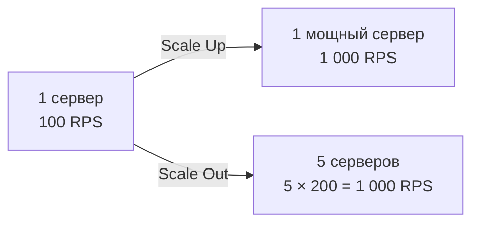
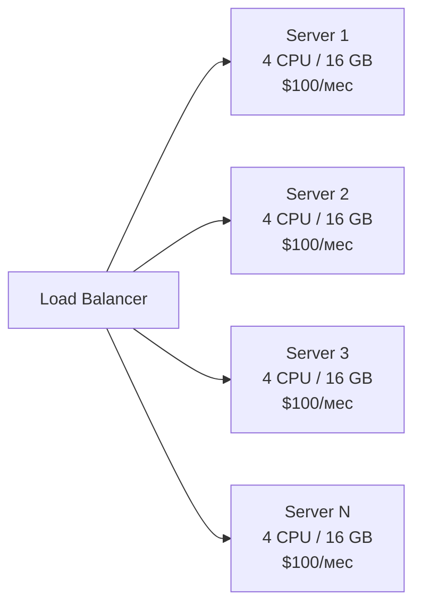
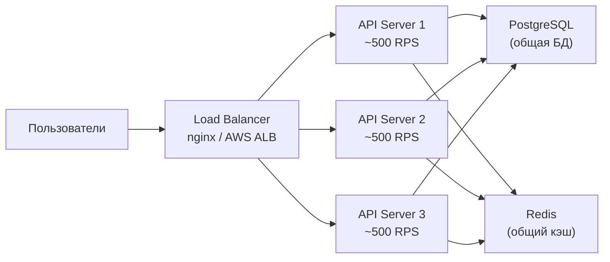
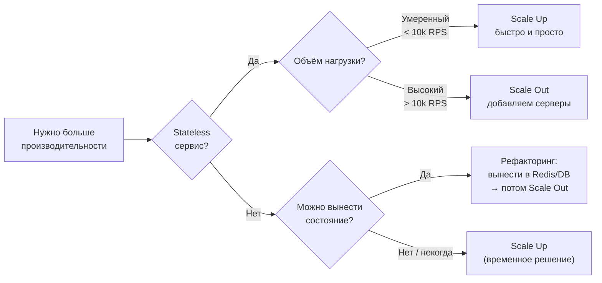
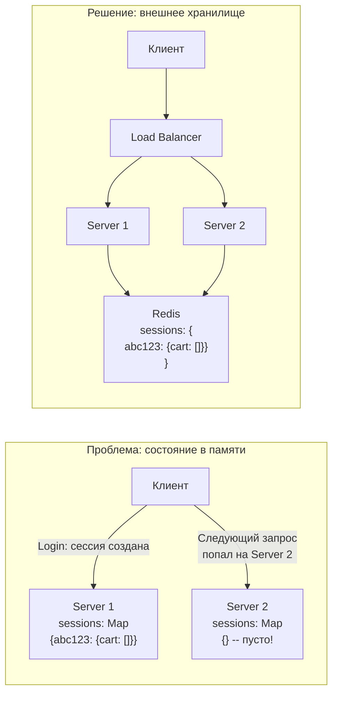
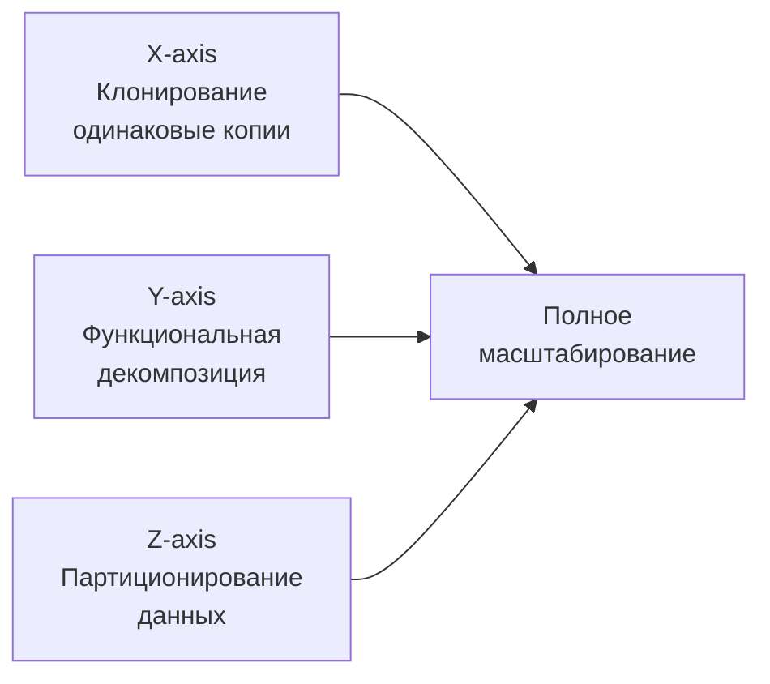
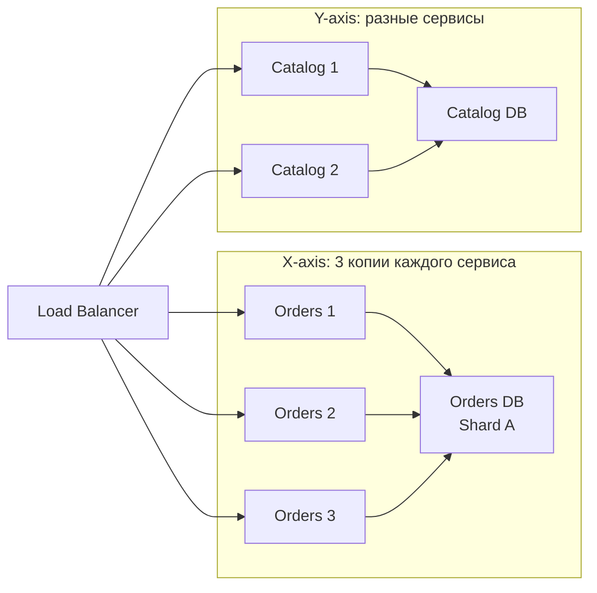

# Уровень 1: Масштабирование -- горизонтальное, вертикальное и всё между ними

## Введение

Представьте, что вы открыли небольшой магазин. Один кассир справляется с пятью покупателями в час. Бизнес пошёл в гору -- теперь приходит пятьсот человек. Что делать?

Первый инстинкт: нанять более быстрого, опытного кассира. Может быть, двух. Но даже суперкассир имеет предел скорости -- физику не обмануть. Тогда открываем ещё кассы и нанимаем обычных сотрудников. Если покупателей станет ещё больше -- добавляем ещё кассы.

Это ровно та же дилемма, с которой сталкивается любой инженер, когда пользовательская нагрузка превышает возможности одного сервера. **Масштабирование** -- это искусство и инженерная дисциплина обеспечить рост системы вслед за ростом нагрузки, сохранив надёжность и управляемость.

На этом уровне мы разберём:

1. **Вертикальное масштабирование** -- что значит "сделать сервер мощнее" и почему это работает только до определённого момента
2. **Горизонтальное масштабирование** -- как добавлять серверы и что нужно сделать заранее, чтобы это вообще работало
3. **Stateless vs Stateful** -- ключевое различие, без понимания которого горизонтальное масштабирование не получится
4. **Scaling Cube** -- трёхмерная модель роста системы из книги "The Art of Scalability"
5. **Закон Амдала** -- математическое ограничение, которое никто не может обойти
6. **Shared-Nothing Architecture** -- почему лучшие масштабируемые системы избегают разделяемых ресурсов

---

## 1. Зачем масштабировать?

### Проблема роста нагрузки

Ваш стартап взлетел. Вчера было 100 пользователей, сегодня -- 10 000, завтра -- миллион. Сервер начинает захлёбываться: время ответа растёт, запросы падают в таймаут, пользователи уходят. Что делать?

Это классический сценарий, который воспроизводится снова и снова. Twitter в 2008-м, GitHub в 2011-м, Clubhouse в 2021-м -- все они прошли через момент, когда архитектура перестала справляться с нагрузкой.

Важно понимать: проблема возникает не внезапно. Сначала 95-й перцентиль времени ответа подрастает с 50 мс до 200 мс. Потом база данных начинает жаловаться на долгие запросы. Потом CPU сервера постоянно держится на 80%. Потом начинаются таймауты. К моменту, когда всё окончательно "лежит", сигналы уже давно были -- просто их не замечали.

### Два принципиально разных пути

Представьте тот же ресторан. У вас один повар, и очередь из 50 человек. Два пути:

- **Нанять суперповара** с шестью руками (вертикальное масштабирование)
- **Открыть ещё кухни** с обычными поварами (горизонтальное масштабирование)



Оба пути ведут к одному результату -- 1 000 запросов в секунду. Но цена, сложность и долгосрочные последствия принципиально разные.

### Что такое нагрузка на самом деле

Прежде чем масштабировать, нужно понять, что именно нагружает систему. "Много пользователей" -- это слишком размыто. Конкретные метрики:

| Метрика | Что измеряет | Инструменты |
|---|---|---|
| RPS / QPS | Запросов в секунду / в минуту | Nginx logs, Prometheus |
| Latency (p50, p95, p99) | Время ответа по перцентилям | APM, Grafana |
| CPU utilization | Загрузка процессора | top, htop, CloudWatch |
| Memory usage | Использование RAM | free -h, Prometheus |
| DB connections | Пул соединений с БД | pg_stat_activity, slow log |
| Error rate | Процент ошибочных ответов | ELK, Sentry |

💡 Правило: никогда не масштабируйте "вслепую". Сначала измерьте, найдите узкое место (bottleneck), а потом принимайте решение о стратегии.

---

## 2. Вертикальное масштабирование (Scale Up)

### Суть подхода

**Scale Up** -- увеличение ресурсов одного сервера: больше CPU, RAM, SSD, сеть. Вместо того чтобы добавлять машины, вы делаете имеющуюся машину мощнее.

```
Было:                          Стало:
┌──────────────┐              ┌──────────────────────┐
│ 4 CPU cores  │              │ 64 CPU cores         │
│ 16 GB RAM    │    Scale     │ 512 GB RAM           │
│ 500 GB HDD   │ ──────Up──→ │ 2 TB NVMe SSD        │
│ 1 Gbps       │              │ 25 Gbps              │
│              │              │                      │
│ $100/мес     │              │ $5 000/мес           │
└──────────────┘              └──────────────────────┘
```

Изменений в коде -- ноль. Сервер просто "стал быстрее" с точки зрения приложения.

### Когда это правильный выбор

Вертикальное масштабирование -- не антипаттерн. Есть ситуации, где это лучший или единственный разумный путь:

**База данных на ранних стадиях.** Горизонтальное масштабирование БД -- это сложно: шардирование, репликация, eventual consistency. Для большинства проектов правильная стратегия -- сначала вертикально нарастить мощь лидер-ноды, а горизонталь добавлять только тогда, когда реально необходимо.

**Monolith на MVP.** Если команда из трёх человек делает стартап и хочет проверить гипотезу -- не надо сразу городить микросервисы. Scale Up решает проблему нагрузки, пока бизнес-модель не доказана.

**Legacy-приложение.** Если у вас монолит с состоянием в памяти, который переписывать некогда -- Scale Up даёт выигрыш времени.

**Stateful-сервисы.** Zookeeper, Kafka-брокер, PostgreSQL primary -- всё это сложно масштабировать горизонтально без специальной работы. Scale Up здесь органичен.

### Плюсы Scale Up

- **Простота** -- не нужно менять архитектуру, код остаётся прежним. Буквально меняете тип инстанса в AWS Console
- **Нет проблем с распределённым состоянием** -- данные на одном сервере, нет вопросов о консистентности
- **Транзакции работают "из коробки"** -- ACID-гарантии на одном узле полные
- **Предсказуемость** -- нет сетевых задержек между узлами, нет частичных отказов

### Минусы Scale Up

- **Потолок железа** -- максимальный сервер на AWS: 448 vCPU, 24 TB RAM. Это потолок, который нельзя пробить
- **Единая точка отказа (SPOF)** -- сервер упал = всё упало. Нет redundancy
- **Экспоненциальный рост стоимости** -- каждое удвоение мощности стоит непропорционально дороже
- **Downtime при масштабировании** -- чтобы поменять тип инстанса, нужно остановить сервер

### Кривая стоимости: почему Scale Up дорожает нелинейно

Это фундаментальная экономика железа. Удвоение производительности не стоит вдвое дороже -- оно стоит в три-пять раз дороже.

```
Кривая стоимости Scale Up:

Стоимость ($)
    │
5000│                              ●
    │                         ●
    │                    ●
    │               ●
    │          ●
    │     ●
 100│ ●
    └──────────────────────────────→ Мощность
      4    8   16   32   64   128 vCPU
```

Почему так? Сервер с 128 vCPU -- это не просто 32 сервера по 4 vCPU в одном корпусе. Это специальные процессоры, многоканальная память, высокоскоростной интерконнект, надёжный блок питания -- всё это добавляет стоимость нелинейно. AWS m7i.48xlarge (192 vCPU, 768 GB RAM) стоит $9.67 в час. Тридцать два m7i.xlarge (4 vCPU, 16 GB RAM) -- $0.2016 × 32 = $6.45 в час. И это 128 vCPU суммарно, с лучшей отказоустойчивостью.

### Предел вертикального масштабирования

Представьте, что вы разгоняете автомобиль. До 100 км/ч -- без проблем, педаль в пол. До 200 -- работает, но начинает сказываться аэродинамика. До 300 -- двигатель на пределе, топливо сгорает с безумной скоростью. До 400 -- нужно специальное топливо, специальные шины, сама машина стоит как самолёт. Scale Up работает точно так же: на каждом следующем уровне мощности затраты растут всё быстрее.

---

## 3. Горизонтальное масштабирование (Scale Out)

### Суть подхода

**Scale Out** -- добавление новых серверов, которые работают параллельно. Вместо одной мощной машины -- много обычных, которые разделяют нагрузку между собой.



В идеале: добавить сервер = пропорционально увеличить пропускную способность. В реальности -- почти так, с некоторыми оговорками (см. закон Амдала ниже).

### Плюсы Scale Out

- **Нет потолка** -- всегда можно добавить ещё серверов. Netflix, Google, Facebook работают на тысячах обычных серверов
- **Отказоустойчивость** -- один сервер упал, остальные продолжают работать. Нагрузка перераспределяется
- **Линейный рост стоимости** -- 10 серверов = 10 × $100 = $1 000. Предсказуемо и управляемо
- **Zero-downtime масштабирование** -- добавляем серверы "на лету", без остановки сервиса

### Минусы Scale Out

- **Сложность архитектуры** -- распределённое состояние, консистентность, сетевые ошибки -- это новый класс проблем
- **Нужен балансировщик нагрузки** -- кто-то должен распределять запросы. Сам балансировщик может стать узким местом
- **Не всё можно масштабировать горизонтально** -- stateful-сервисы требуют специальной работы
- **Дебаггинг сложнее** -- баг может воспроизводиться только на определённом сервере, distributed tracing необходим

### Кривая стоимости Scale Out: почему это выгоднее

```
Кривая стоимости Scale Out:

Стоимость ($)
    │
1000│                              ●
    │                         ●
 800│                    ●
    │               ●
 600│          ●
    │     ●
 200│ ●
    └──────────────────────────────→ Мощность
      1    2    4    6    8   10 серверов
```

Линейная кривая -- мечта финансового директора. Каждый доллар, вложенный в мощность, даёт одинаковую отдачу. Небольшой overhead на инфраструктуру (балансировщик, сеть) есть, но он минимален по сравнению с суперлинейным ростом стоимости Scale Up.

### Как выглядит горизонтальное масштабирование на практике

Сценарий: ваш API-сервер обрабатывает 500 RPS, CPU на 70%. Нагрузка растёт, ожидается 1 500 RPS через месяц.

**Шаг 1.** Убедиться, что сервис stateless (об этом -- в следующем разделе).

**Шаг 2.** Добавить балансировщик нагрузки перед существующим сервером.

**Шаг 3.** Запустить второй идентичный сервер, добавить его в пул балансировщика.

**Шаг 4.** Мониторинг: нагрузка должна распределиться примерно 50/50.

**Шаг 5.** Перед ожидаемым ростом добавить третий сервер.



---

## 4. Сравнение: когда что выбирать

### Таблица сравнения

| Критерий | Вертикальное (Scale Up) | Горизонтальное (Scale Out) |
|---|---|---|
| Сложность | Простое -- ничего не менять в коде | Сложное -- нужна stateless-архитектура |
| Потолок | Ограничен железом (~24 TB RAM на AWS) | Практически безлимитное |
| Отказоустойчивость | SPOF -- одна точка отказа | Высокая -- серверы дублируют друг друга |
| Стоимость при росте | Экспоненциальная | Линейная |
| Downtime при масштабировании | Да (перезагрузка сервера) | Нет (добавляем "на лету") |
| Данные | Локальные, простые | Распределённые, требуют архитектурной работы |
| Дебаггинг | Простой | Нужен distributed tracing |
| Когда использовать | MVP, маленькие проекты, базы данных | Высоконагруженные сервисы, stateless API |

### Дерево решений



### Реальность: гибридный подход

Большинство production-систем используют **оба подхода одновременно**. Общая стратегия:

1. **Фаза MVP** -- один сервер, Scale Up по мере роста
2. **Фаза роста** -- Scale Up до разумного лимита ($500-1000/мес на сервер). Параллельно проектируем stateless-архитектуру
3. **Фаза масштабирования** -- Scale Out: несколько серверов за балансировщиком. Scale Up каждого узла до оптимального размера
4. **Фаза зрелости** -- Y и Z оси Scaling Cube (декомпозиция и шардирование)

📌 Нет смысла делать горизонтальное масштабирование с самого начала -- это преждевременная оптимизация с огромной стоимостью сложности. Stack Overflow работает на одном очень мощном сервере SQL Server и прекрасно обрабатывает миллионы запросов.

---

## 5. Stateless vs Stateful: ключ к горизонтальному масштабированию

### Почему это критически важно

Горизонтальное масштабирование работает хорошо только если сервисы **stateless** -- не хранят состояние между запросами. Это не опциональная рекомендация -- это жёсткое требование архитектуры.

Представьте вопрос: если балансировщик случайно направит следующий запрос того же пользователя на другой сервер -- всё ли будет работать корректно? Если "да" -- сервис stateless. Если "нет" -- stateful.

### Stateless-сервис: как это выглядит

Каждый запрос содержит **всю** необходимую информацию. Сервер не помнит предыдущие запросы.

```typescript
// Stateless API -- любой сервер может обработать запрос
app.get('/api/users/:id', async (req, res) => {
  // Токен авторизации -- в заголовке запроса (не в памяти сервера)
  const token = req.headers.authorization
  const userId = verifyJWT(token) // Декодируем из токена -- без обращения к "памяти"

  // Данные -- во внешней БД, не в памяти сервера
  const user = await db.users.findById(req.params.id)

  res.json(user)
})
```

**Аналогия:** фастфуд. Вы подходите к **любой** кассе, называете заказ, получаете еду. Кассиру не нужно вас помнить. Если кассир заболел -- другой обслужит вас точно так же, потому что у вас есть чек (токен) с полной информацией о заказе.

**Ключевые признаки stateless-сервиса:**
- Авторизация через JWT или API-ключи (не через серверные сессии)
- Нет `Map`, `Set`, `{}` в глобальном scope для хранения пользовательских данных
- Временные файлы не хранятся локально (или не нужны для следующих запросов)
- Любое состояние живёт во внешнем хранилище: БД, Redis, S3

### Stateful-сервис: в чём проблема

Сервер хранит состояние клиента в своей памяти. Следующий запрос **обязан** попасть на тот же сервер.

```typescript
// ❌ Stateful -- сессия в памяти сервера
const sessions = new Map<string, UserSession>()

app.post('/api/login', (req, res) => {
  const session = { userId: req.body.userId, cart: [] }
  sessions.set(req.sessionId, session)  // Хранится в RAM этого сервера!
  res.json({ ok: true })
})

app.get('/api/cart', (req, res) => {
  // Если запрос попал на другой сервер -- сессии нет!
  const session = sessions.get(req.sessionId)
  if (!session) return res.status(401).json({ error: 'Session not found' })
  res.json(session.cart)
})
```

**Что происходит при горизонтальном масштабировании:**

1. Пользователь логинится → попадает на Server 1 → сессия создаётся в Map на Server 1
2. Следующий запрос → балансировщик отправляет на Server 2
3. Server 2: `sessions.get(req.sessionId)` → `undefined` → 401 Unauthorized
4. Пользователь видит "Session not found" и злится

**Аналогия:** личный парикмахер. Он помнит вашу стрижку, предпочтения, аллергии на краски. Если он заболел -- другой мастер про вас ничего не знает. Это нормально для парикмахерской с одним мастером, но неприемлемо для сети салонов с общей клиентской базой.

### Диаграмма проблемы и решения



### Три стратегии решения проблемы состояния

**Стратегия 1: Вынести состояние во внешнее хранилище (рекомендуется)**

Лучший вариант. Состояние хранится в Redis или БД, доступном всем серверам.

```typescript
// ✅ Stateless -- сессия в Redis
import Redis from 'ioredis'
const redis = new Redis()

app.post('/api/login', async (req, res) => {
  const session = { userId: req.body.userId, cart: [] }
  // Пишем в Redis с TTL 1 час -- любой сервер прочитает
  await redis.set(`session:${req.sessionId}`, JSON.stringify(session), 'EX', 3600)
  res.json({ ok: true })
})

app.get('/api/cart', async (req, res) => {
  // Любой сервер читает из Redis -- сессия всегда доступна
  const raw = await redis.get(`session:${req.sessionId}`)
  if (!raw) return res.status(401).json({ error: 'Session not found' })
  const session = JSON.parse(raw)
  res.json(session.cart)
})
```

**Стратегия 2: Session affinity (sticky sessions)**

Балансировщик запоминает, на какой сервер отправил клиента в первый раз, и всегда отправляет его туда. Проблему решает, но создаёт новые:

- Если сервер упал -- все его пользователи теряют сессии
- Нагрузка распределяется неравномерно (один "тяжёлый" клиент = один перегруженный сервер)
- При деплое или автоскейлинге -- сессии теряются

```nginx
# Nginx: sticky sessions по IP клиента
upstream backend {
    ip_hash;  # Клиент с одним IP всегда идёт на один сервер
    server 192.168.1.1:3000;
    server 192.168.1.2:3000;
    server 192.168.1.3:3000;
}
```

⚠️ Sticky sessions -- временный костыль, не архитектурное решение.

**Стратегия 3: Передавать состояние в запросе (JWT)**

Вместо серверной сессии -- самодостаточный токен (JWT), который содержит данные пользователя и подписан секретным ключом. Сервер не хранит ничего -- он только проверяет подпись.

```typescript
// ✅ JWT -- токен содержит все данные, сервер stateless
import jwt from 'jsonwebtoken'

app.post('/api/login', async (req, res) => {
  const user = await db.users.findOne({ email: req.body.email })
  // Создаём JWT с данными пользователя -- никуда не сохраняем
  const token = jwt.sign(
    { userId: user.id, role: user.role },
    process.env.JWT_SECRET,
    { expiresIn: '1h' }
  )
  res.json({ token })
})

app.get('/api/profile', (req, res) => {
  // Декодируем из заголовка -- без обращения к БД или Redis
  const payload = jwt.verify(req.headers.authorization?.split(' ')[1], process.env.JWT_SECRET)
  res.json({ userId: payload.userId, role: payload.role })
})
```

Ограничение JWT: нельзя "отозвать" токен до его истечения (если только не вести blacklist в Redis, что частично возвращает нас к внешнему хранилищу).

---

## 6. Scaling Cube: три оси масштабирования

### Модель AKF Scale Cube

**AKF Scale Cube** -- модель из книги "The Art of Scalability" авторов Аббот и Фишер. Описывает три независимых измерения, по которым можно масштабировать систему. Реальные production-системы используют все три оси одновременно.



### X-axis: Клонирование (Horizontal Duplication)

Самый простой способ -- запустить N одинаковых копий сервиса за балансировщиком. Это буквально горизонтальное масштабирование, которое мы обсуждали выше.

```
          ┌───────────────┐
          │ Load Balancer │
          └───────┬───────┘
       ┌──────────┼──────────┐
       ▼          ▼          ▼
  ┌─────────┐ ┌─────────┐ ┌─────────┐
  │ App v1  │ │ App v1  │ │ App v1  │  ← Один и тот же код
  │ Clone 1 │ │ Clone 2 │ │ Clone 3 │
  └─────────┘ └─────────┘ └─────────┘
```

**Работает при условии:** сервис stateless.

**Что решает:** высокую нагрузку, отказоустойчивость.

**Что не решает:** если вся нагрузка идёт на один тип операций (например, поиск) -- вы масштабируете и бесполезные части тоже.

**Пример:** три копии вашего API-сервера за AWS Application Load Balancer. Каждый обрабатывает треть запросов.

### Y-axis: Функциональная декомпозиция

Разделение монолита на отдельные сервисы по бизнес-функциям. Это то, что называют **микросервисной архитектурой**.

```
Монолит:                    Микросервисы:
┌──────────────────┐        ┌──────────┐  ┌──────────┐  ┌──────────┐
│ Auth             │        │ Auth     │  │ Catalog  │  │ Orders   │
│ Catalog          │   →    │ Service  │  │ Service  │  │ Service  │
│ Orders           │        └──────────┘  └──────────┘  └──────────┘
│ Notifications    │        ┌──────────┐  ┌──────────┐
│ Search           │        │ Notify   │  │ Search   │
└──────────────────┘        │ Service  │  │ Service  │
                            └──────────┘  └──────────┘
```

Каждый сервис масштабируется **независимо**: если поиск нагружен -- добавляем копии только Search Service. Если авторизация лёгкая -- оставляем одну копию Auth Service.

**Ключевое преимущество Y-axis:** независимое масштабирование по нагрузке. У разных функций нагрузка принципиально разная -- нет смысла масштабировать всё вместе.

**Реальный пример -- Amazon Prime Day:**
- Catalog Service: +500% трафика (все смотрят товары)
- Orders Service: +300% трафика (покупки)
- Returns Service: +50% трафика (возвраты -- на следующий день)

С монолитом нужно масштабировать всё сразу. С Y-axis -- каждый сервис независимо.

### Z-axis: Партиционирование данных (Sharding)

Разделение данных между серверами по ключу (шардирование). Каждый сервер отвечает за свой "срез" данных.

```
Все пользователи:              Шардирование по ID:

┌──────────────────────┐       ┌─────────┐  ┌─────────┐  ┌─────────┐
│ Users 1 — 1 000 000  │       │ Shard 1 │  │ Shard 2 │  │ Shard 3 │
│                      │  →    │ ID 1-   │  │ ID 334K-│  │ ID 667K-│
│ (одна БД, тормозит)  │       │ 333K    │  │ 666K    │  │ 1M      │
└──────────────────────┘       └─────────┘  └─────────┘  └─────────┘
```

**Стратегии шардирования:**

| Стратегия | Как работает | Плюсы | Минусы |
|---|---|---|---|
| Range-based | ID 1-333K → Shard 1 | Простота, range-запросы | Hotspot если новые записи в одном шарде |
| Hash-based | shard = hash(userId) % N | Равномерное распределение | Range-запросы сложны |
| Geographic | EU users → EU shard | Низкая задержка, compliance | Неравномерная нагрузка |
| Directory-based | Lookup table кто где | Гибкость | Дополнительный сервис |

**Когда Z-axis не нужен:** если X и Y уже справляются. Z-axis -- самое сложное измерение, добавляйте последним.

### Комбинирование трёх осей

В реальных системах все три оси работают вместе:



---

## 7. Закон Амдала: математический предел масштабирования

### Откуда закон и что он говорит

**Закон Амдала** сформулировал Джин Амдал в 1967 году. Он исследовал параллельные вычисления и заметил неудобную правду: не весь код можно распараллелить. Всегда есть последовательные участки, которые становятся узким горлом.

Формула:

```
Speedup = 1 / (S + (1 - S) / N)

Где:
  S -- доля последовательного (не параллелизуемого) кода
  N -- количество процессоров (серверов)
```

**Аналогия с беременностью:** девять женщин не родят ребёнка за один месяц. Некоторые процессы не параллелизуются никак. В программировании это: запись в один лидер-узел БД, глобальные блокировки, последовательные зависимости в бизнес-логике.

### Расчёт для системы с 5% последовательного кода

Если 5% операций **обязательно** последовательные (запись в лидер-БД, инвалидация кэша):

```
N = 1 сервер:    Speedup = 1 / (0.05 + 0.95/1)   = 1.0x   (базовый)
N = 2 серверов:  Speedup = 1 / (0.05 + 0.95/2)   = 1.9x
N = 5 серверов:  Speedup = 1 / (0.05 + 0.95/5)   = 3.8x
N = 10 серверов: Speedup = 1 / (0.05 + 0.95/10)  = 6.9x   (не 10x!)
N = 100:         Speedup = 1 / (0.05 + 0.95/100) = 16.8x  (не 100x!)
N = 1000:        Speedup = 1 / (0.05 + 0.95/1000)= 19.2x  (не 1000x!)
N = ∞:           Speedup = 1 / 0.05               = 20x    (потолок!)
```

📌 При 5% последовательного кода **максимальное ускорение -- 20x**, сколько бы серверов вы ни добавили. Потолок абсолютный.

### Что такое "последовательный участок" в web-приложении

```typescript
// Пример: обработка заказа
async function processOrder(orderId: string) {
  // ✅ Параллелизуется: независимые запросы
  const [user, product, inventory] = await Promise.all([
    db.users.findById(order.userId),
    db.products.findById(order.productId),
    db.inventory.check(order.productId),
  ])

  // ❌ Последовательный участок: запись в БД -- одна операция
  // Все серверы пишут в один PostgreSQL primary
  const result = await db.orders.create({
    userId: user.id,
    productId: product.id,
    // ...
  })

  // ❌ Последовательный участок: запись в очередь
  await messageQueue.publish('order.created', { orderId: result.id })

  return result
}
```

Вот почему минимизация последовательных участков так важна. Каждый процент последовательного кода срезает потолок масштабирования.

### Практические выводы из закона Амдала

**Ищите bottleneck, а не добавляйте серверы.** Если 20% времени уходит на запрос к одной внешней системе (платёжный провайдер, slow microservice), добавление серверов не поможет -- всё равно ждём этого одного.

**Асинхронность снимает последовательные ограничения.** Если запись в БД можно сделать через очередь (Kafka, RabbitMQ) -- request не ждёт записи, последовательный участок сокращается.

**Кэширование убирает повторные последовательные операции.** Если 80% запросов читают одни и те же данные -- кэш в Redis переводит их из "последовательных" (читают из одного источника) в "параллельные" (читают из локального кэша).

---

## 8. Shared-Nothing Architecture

### Что это такое

**Shared-Nothing** -- архитектура, где каждый узел полностью автономен: имеет свои CPU, RAM, диск и не разделяет ресурсы с другими узлами. Узлы взаимодействуют только через сеть -- явными сообщениями, не через общую память или диск.

```
Shared-Everything:              Shared-Nothing:
┌────┐ ┌────┐ ┌────┐           ┌─────────┐  ┌─────────┐  ┌─────────┐
│ S1 │ │ S2 │ │ S3 │           │ S1      │  │ S2      │  │ S3      │
└─┬──┘ └─┬──┘ └─┬──┘           │ CPU+RAM │  │ CPU+RAM │  │ CPU+RAM │
  │      │      │              │ Disk    │  │ Disk    │  │ Disk    │
  └──────┼──────┘              │ Data A  │  │ Data B  │  │ Data C  │
         │                     └─────────┘  └─────────┘  └─────────┘
    ┌────┴────┐
    │ Shared  │
    │ Storage │  ← Узкое место!
    └─────────┘
```

**Почему Shared-Everything плохо масштабируется:** общий диск или память становятся bottleneck. Блокировки, конкуренция за ресурс -- производительность падает при росте числа узлов.

**Почему Shared-Nothing масштабируется отлично:** нет конкуренции за ресурс. Каждый узел работает независимо. Добавление узла не создаёт дополнительной нагрузки на существующие.

### Примеры Shared-Nothing систем

**Apache Cassandra** -- распределённая база данных. Каждый узел хранит свой диапазон токенов (порций данных). Нет главного узла, нет общего диска.

```
Кольцо токенов Cassandra:

        Node 1 (токены 0-25%)
       /
Node 4       Node 2
(75-100%)     (25-50%)
       \
        Node 3 (50-75%)

Запрос к userId=12345 → hash → токен 34% → Node 2
```

**Apache Kafka** -- распределённый брокер сообщений. Каждый брокер хранит свои партиции топика. Брокеры не разделяют данные.

**Stateless API-серверы** -- каждый сервер независим, данные в отдельной БД и Redis.

### Как применить Shared-Nothing в своём сервисе

```typescript
// ❌ Shared state -- плохо для масштабирования
class RateLimiter {
  private counts = new Map<string, number>() // Общая для всего процесса

  check(ip: string): boolean {
    const count = this.counts.get(ip) || 0
    if (count >= 100) return false
    this.counts.set(ip, count + 1)
    return true
  }
}
// На 3 серверах: каждый хранит свой Map. Пользователь может сделать 300 запросов.
```

```typescript
// ✅ Shared-Nothing -- каждый сервер независим, состояние в Redis
class DistributedRateLimiter {
  constructor(private redis: Redis) {}

  async check(ip: string): Promise<boolean> {
    const key = `rate:${ip}`
    const count = await this.redis.incr(key)
    if (count === 1) await this.redis.expire(key, 60) // Первый инкремент -- ставим TTL
    return count <= 100
  }
}
// На 3 серверах: все пишут в Redis. Счётчик общий и точный.
```

📌 Shared-Nothing масштабируется лучше всего, потому что нет общих ресурсов, которые становятся узким горлом.

---

## 9. Частые ошибки

### 🐛 Ошибка 1: хранить состояние в памяти процесса

```typescript
// ❌ Состояние в памяти -- не масштабируется горизонтально
const rateLimits = new Map<string, number>()

app.use((req, res, next) => {
  const count = rateLimits.get(req.ip) || 0
  if (count > 100) return res.status(429).send('Too many requests')
  rateLimits.set(req.ip, count + 1)
  next()
})
```

**Почему это ошибка:** при 3 серверах у каждого своя Map. Пользователь сделает 100 запросов на Server 1, потом 100 на Server 2 -- rate limiter не сработает! Итого 300 запросов вместо 100.

```typescript
// ✅ Состояние в Redis -- работает на любом количестве серверов
app.use(async (req, res, next) => {
  const key = `rate:${req.ip}`
  const count = await redis.incr(key)
  if (count === 1) await redis.expire(key, 60)
  if (count > 100) return res.status(429).send('Too many requests')
  next()
})
```

**Где ещё встречается эта ошибка:**
- Кэш в памяти (`const cache = {}`) -- каждый сервер кэширует своё, кэши рассинхронизируются
- Счётчики в памяти (количество активных пользователей, очередь задач)
- Временные файлы в локальном `/tmp` -- если следующий запрос попадёт на другой сервер, файла нет

### 🐛 Ошибка 2: масштабировать горизонтально без stateless-дизайна

```
❌ "Добавим серверов и всё ускорится!"
```

**Что происходит:** серверы stateful (хранят сессии, кэш, временные файлы в памяти). После добавления второго сервера половина запросов начинает получать ошибки "Session not found". Пользователи жалуются, вы откатываетесь.

```
✅ Правильный порядок:
1. Выявить всё состояние в сервисе (сессии, кэш, файлы)
2. Вынести в Redis / S3 / БД
3. Убедиться, что сервис stateless (тест: убить произвольный сервер -- работает ли?)
4. Добавить серверы + балансировщик
```

### 🐛 Ошибка 3: рассчитывать на линейное ускорение

```
❌ "У нас 1 сервер обрабатывает 1 000 RPS.
    Значит, 10 серверов = 10 000 RPS"
```

**Почему это ошибка:** закон Амдала! Есть последовательные участки (запись в БД, глобальные блокировки), сетевой overhead, балансировщик как потенциальный bottleneck. Реально 10 серверов дадут 7 000-8 000 RPS.

```
✅ Реалистичная оценка:
   - Учитывайте overhead: балансировщик, сеть, координация
   - Ищите bottleneck: БД, внешние API, shared resources
   - Тестируйте нагрузку после каждого добавления серверов
   - Используйте load testing: k6, Locust, Apache JMeter
```

### 🐛 Ошибка 4: sticky sessions как постоянное решение

```
❌ "Настроим sticky sessions -- и stateful-сервер масштабируется!"
```

**Почему это ошибка:** sticky sessions привязывают клиента к серверу. Последствия:
- Если этот сервер падает -- все его пользователи теряют сессии
- Нагрузка распределяется неравномерно (один "тяжёлый" клиент = один перегруженный сервер)
- При деплое нового кода -- нельзя мгновенно убрать старый сервер

```
✅ Sticky sessions -- временный костыль.
   Правильное решение -- вынести состояние в Redis/БД
   и сделать сервис по-настоящему stateless.
```

### 🐛 Ошибка 5: преждевременное горизонтальное масштабирование

```
❌ "Мы с первого дня делаем микросервисы, чтобы легко масштабироваться!"
```

**Почему это ошибка:** команда из трёх человек тратит 80% времени на инфраструктуру (service discovery, distributed tracing, inter-service communication, eventual consistency). Бизнес-логика не развивается. Конкуренты с монолитом обгоняют.

```
✅ Правило: оптимизируйте, когда больно, а не заранее.
   1. Начните с монолита -- он проще в разработке и отладке
   2. Scale Up, пока не больно финансово (~$1000/мес на сервер)
   3. Добавьте горизонталь, когда монолит не справляется
   4. Декомпозируйте на сервисы, когда конкретный модуль стал узким местом
```

---

## 10. Итоги

Масштабирование -- это не набор техник, а **образ мышления**. Прежде чем выбрать подход, нужно понять природу проблемы: где узкое место, что именно не справляется, какова стоимость разных решений.

- ✅ **Scale Up** (вертикальное) -- проще всего, не требует изменений в коде. Ограничено железом и экспоненциально дорожает. Правильный выбор для старта и для баз данных
- ✅ **Scale Out** (горизонтальное) -- практически безлимитное, линейная стоимость. Требует stateless-архитектуры как предварительного условия
- ✅ **Stateless-дизайн** -- фундамент горизонтального масштабирования. Вынесите состояние в Redis/БД, и любой сервер сможет обработать любой запрос
- ✅ **Scaling Cube** -- три независимых оси: X (клонирование), Y (функциональная декомпозиция), Z (партиционирование данных). Реальные системы используют все три
- ✅ **Закон Амдала** -- последовательный код ограничивает масштабирование математически. 5% последовательного кода = максимум 20x ускорения при любом числе серверов
- ✅ **Shared-Nothing** -- лучшая архитектура для масштабирования: нет общих ресурсов, нет конкуренции, нет узких мест

📌 **Главное правило:** сначала stateless, потом масштабирование -- не наоборот. Добавление серверов к stateful-сервису делает систему хуже, а не лучше.

📌 **Практическая стратегия роста:** монолит → Scale Up → stateless-дизайн → Scale Out → Y-axis (микросервисы по нагрузке) → Z-axis (шардирование по необходимости). Не перепрыгивайте через шаги.
