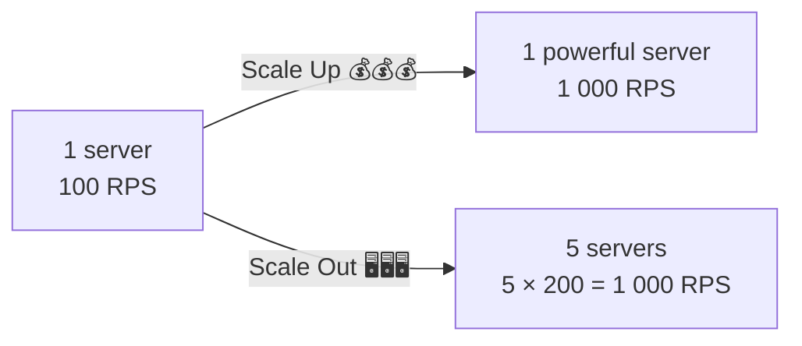
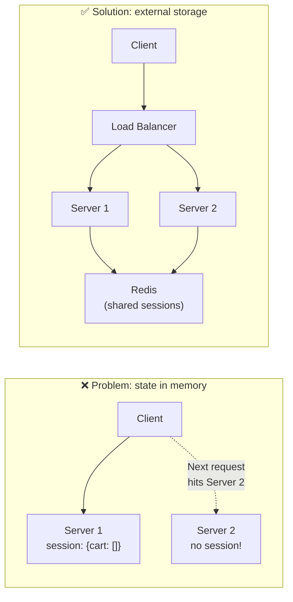
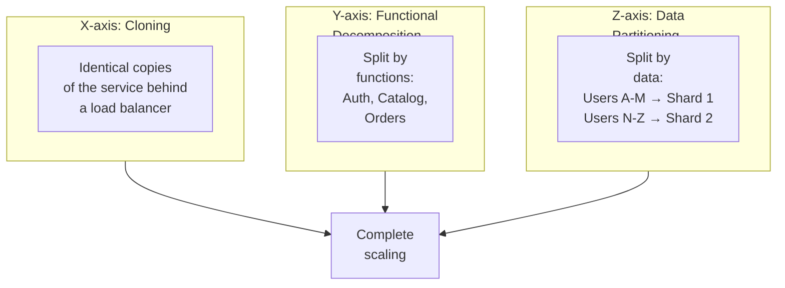

# 🔥 Level 1: Scaling — Vertical and Horizontal

## 🎯 Why Scale?

Your startup took off. Yesterday it was 100 users, today — 10,000, tomorrow — a million. The server starts choking: response times grow, requests time out, users leave. What do you do?

Imagine a restaurant. You have one cook and a queue of 50 people. Two paths:
- **Hire a super cook** with six arms (vertical scaling)
- **Open more kitchens** with regular cooks (horizontal scaling)

That's exactly how server scaling works.



## 🔥 Vertical Scaling (Scale Up)

**Scale Up** — increasing resources of a single server: more CPU, RAM, SSD, network.

```
Before:                        After:
┌──────────────┐              ┌──────────────────────┐
│ 4 CPU cores  │              │ 64 CPU cores         │
│ 16 GB RAM    │    Scale     │ 512 GB RAM           │
│ 500 GB HDD   │ ──────Up──→ │ 2 TB NVMe SSD        │
│ 1 Gbps       │              │ 25 Gbps              │
│              │              │                      │
│ $100/month   │              │ $5 000/month         │
└──────────────┘              └──────────────────────┘
```

### Pros of Scale Up

- **Simplicity** — no architecture changes, code stays the same
- **No distributed state issues** — data on a single server
- **Transactions work out of the box** — ACID on a single node

### Cons of Scale Up

- **Hardware ceiling** — max server on AWS: 448 vCPU, 24 TB RAM. Beyond that — a wall
- **Single point of failure (SPOF)** — server down = everything down
- **Exponential cost growth** — each doubling of power costs disproportionately more

```
Scale Up cost curve:

Cost ($)
    │
5000│                              ●
    │                         ●
    │                    ●
    │               ●
    │          ●
    │     ●
 100│ ●
    └──────────────────────────────→ Power
      4    8   16   32   64   128 vCPU

Cost growth is NOT linear — it's a superlinear curve!
```

## 🔥 Horizontal Scaling (Scale Out)

**Scale Out** — adding new servers that work in parallel.

```
┌──────────┐    ┌──────────┐    ┌──────────┐    ┌──────────┐
│ Server 1 │    │ Server 2 │    │ Server 3 │    │ Server N │
│ 4 CPU    │    │ 4 CPU    │    │ 4 CPU    │    │ 4 CPU    │
│ 16 GB    │    │ 16 GB    │    │ 16 GB    │    │ 16 GB    │
│ $100/mo  │    │ $100/mo  │    │ $100/mo  │    │ $100/mo  │
└────┬─────┘    └────┬─────┘    └────┬─────┘    └────┬─────┘
     │               │               │               │
     └───────────────┴───────┬───────┴───────────────┘
                             │
                    ┌────────┴────────┐
                    │  Load Balancer  │
                    └─────────────────┘
```

### Pros of Scale Out

- **No ceiling** — always possible to add more servers
- **Fault tolerance** — one server down, others keep running
- **Linear cost growth** — 10 servers = 10 × $100 = $1,000

### Cons of Scale Out

- **Architecture complexity** — distributed state, consistency, network errors
- **Needs a load balancer** — someone must distribute requests
- **Not everything scales horizontally** — stateful services need special handling

```
Scale Out cost curve:

Cost ($)
    │
1000│                              ●
    │                         ●
 800│                    ●
    │               ●
 600│          ●
    │     ●
 200│ ●
    └──────────────────────────────→ Power
      1    2    4    6    8   10 servers

Cost growth is roughly linear (with slight infrastructure overhead)
```

## 📌 Comparison: When to Choose What

| Criterion | Vertical (Scale Up) | Horizontal (Scale Out) |
|---|---|---|
| Complexity | Simple — no code changes | Complex — needs architecture design |
| Ceiling | Limited by hardware | Practically unlimited |
| Fault tolerance | SPOF — single point of failure | High — servers duplicate each other |
| Cost | Exponential | Linear |
| Downtime during scaling | Yes (reboot needed) | No (add "on the fly") |
| Data | Local, simple | Distributed, complex |
| When to use | MVP, small projects, databases | High-load services |

💡 **Reality:** most systems use **both approaches**. First Scale Up to a reasonable limit ($500-1000/month), then Scale Out for further growth.

## 🔥 Stateless vs Stateful: The Key to Horizontal Scaling

Horizontal scaling works well only if services are **stateless** — they don't store state between requests.

### Stateless Service

Each request contains **all** necessary information. The server doesn't remember previous requests.

```typescript
// Stateless API — any server can handle the request
app.get('/api/users/:id', async (req, res) => {
  // Authorization token — in the request header
  const token = req.headers.authorization

  // Data — in external DB, not in server memory
  const user = await db.users.findById(req.params.id)

  res.json(user)
})
```

Analogy: fast food. You go to **any** register, show the menu, get your order. The cashier doesn't need to "remember" you.

### Stateful Service

The server stores client state in its memory. The next request **must** hit the same server.

```typescript
// ❌ Stateful — session in server memory
const sessions = new Map<string, UserSession>()

app.post('/api/login', (req, res) => {
  const session = { userId: req.body.userId, cart: [] }
  sessions.set(req.sessionId, session)  // Stored in this server's RAM!
  res.json({ ok: true })
})

app.get('/api/cart', (req, res) => {
  // If request hits a different server — session is missing!
  const session = sessions.get(req.sessionId)
  if (!session) return res.status(401).json({ error: 'Session not found' })
  res.json(session.cart)
})
```

Analogy: a personal barber. They remember your haircut, preferences, allergies. If they're sick — another stylist knows nothing about you.

### How to Scale a Stateful Service



**Three strategies:**

1. **Move state** to external storage (Redis, DB) — the best option
2. **Session affinity (sticky sessions)** — load balancer directs client to the same server
3. **Pass state in the request** — JWT token with user data

```typescript
// ✅ Stateless — session in Redis
import Redis from 'ioredis'
const redis = new Redis()

app.post('/api/login', async (req, res) => {
  const session = { userId: req.body.userId, cart: [] }
  await redis.set(`session:${req.sessionId}`, JSON.stringify(session), 'EX', 3600)
  res.json({ ok: true })
})

app.get('/api/cart', async (req, res) => {
  // Any server can fetch session from Redis
  const raw = await redis.get(`session:${req.sessionId}`)
  if (!raw) return res.status(401).json({ error: 'Session not found' })
  const session = JSON.parse(raw)
  res.json(session.cart)
})
```

## 🔥 Scaling Cube: Three Axes of Scaling

**AKF Scale Cube** — a model from the book "The Art of Scalability". Describes three dimensions of scaling:



### X-axis: Cloning (Horizontal Duplication)

The simplest way — run N identical copies of the service behind a load balancer.

```
          ┌───────────────┐
          │ Load Balancer │
          └───────┬───────┘
       ┌──────────┼──────────┐
       ▼          ▼          ▼
  ┌─────────┐ ┌─────────┐ ┌─────────┐
  │ App v1  │ │ App v1  │ │ App v1  │  ← Same code
  │ Clone 1 │ │ Clone 2 │ │ Clone 3 │
  └─────────┘ └─────────┘ └─────────┘
```

Works only if the service is **stateless**.

### Y-axis: Functional Decomposition

Splitting a monolith into separate services by business functions (microservices).

```
Monolith:                     Microservices:
┌──────────────────┐        ┌──────────┐  ┌──────────┐  ┌──────────┐
│ Auth             │        │ Auth     │  │ Catalog  │  │ Orders   │
│ Catalog          │   →    │ Service  │  │ Service  │  │ Service  │
│ Orders           │        └──────────┘  └──────────┘  └──────────┘
│ Notifications    │        ┌──────────┐  ┌──────────┐
│ Search           │        │ Notify   │  │ Search   │
└──────────────────┘        │ Service  │  │ Service  │
                            └──────────┘  └──────────┘
```

Each service scales **independently**: if search is loaded — add copies of Search Service only.

### Z-axis: Data Partitioning (Sharding)

Splitting data across servers by key (sharding).

```
All users:                     Sharding by ID:

┌──────────────────┐           ┌─────────┐  ┌─────────┐  ┌─────────┐
│ Users 1 — 1 000 000 │        │ Shard 1 │  │ Shard 2 │  │ Shard 3 │
│                    │   →     │ ID 1-   │  │ ID 334K-│  │ ID 667K-│
│ (single DB, slow) │          │ 333K    │  │ 666K    │  │ 1M      │
└──────────────────┘           └─────────┘  └─────────┘  └─────────┘
```

## 📌 Amdahl's Law: The Scaling Limit

Not all code can be parallelized. **Amdahl's Law** shows the speedup limit:

```
Speedup = 1 / (S + (1 - S) / N)

Where:
  S — fraction of sequential (non-parallelizable) code
  N — number of processors (servers)
```

If 5% of the code is **necessarily** sequential (write to leader DB, global lock):

```
N = 10 servers:    Speedup = 1 / (0.05 + 0.95/10)  = 6.9x   (not 10x!)
N = 100 servers:   Speedup = 1 / (0.05 + 0.95/100) = 16.8x  (not 100x!)
N = 1000 servers:  Speedup = 1 / (0.05 + 0.95/1000) = 19.2x (not 1000x!)
N = ∞:             Speedup = 1 / 0.05                = 20x   (ceiling!)
```

💡 **Conclusion:** with 5% sequential code, maximum speedup is **20x**, no matter how many servers you add. That's why it's critical to **minimize sequential sections**.

## 🔥 Shared-Nothing Architecture

**Shared-Nothing** — architecture where each node is fully autonomous: has its own CPU, RAM, disk, and doesn't share resources with other nodes.

```
Shared-Everything:              Shared-Nothing:
┌────┐ ┌────┐ ┌────┐           ┌────┐  ┌────┐  ┌────┐
│ S1 │ │ S2 │ │ S3 │           │ S1 │  │ S2 │  │ S3 │
└─┬──┘ └─┬──┘ └─┬──┘           │Disk│  │Disk│  │Disk│
  │      │      │              │Data│  │Data│  │Data│
  └──────┼──────┘              └────┘  └────┘  └────┘
         │                     (each node is independent)
    ┌────┴────┐
    │ Shared  │
    │ Storage │  ← Bottleneck!
    └─────────┘
```

Shared-Nothing examples:
- **Cassandra** — each node stores its own data range
- **Kafka** — each broker stores its own partitions
- **Stateless App Servers** behind a load balancer

📌 Shared-Nothing scales best because there are no shared resources that become bottlenecks.

## ⚠️ Common Beginner Mistakes

### 🐛 1. Storing State in Process Memory

```typescript
// ❌ State in memory — doesn't scale
const rateLimits = new Map<string, number>()

app.use((req, res, next) => {
  const count = rateLimits.get(req.ip) || 0
  if (count > 100) return res.status(429).send('Too many requests')
  rateLimits.set(req.ip, count + 1)
  next()
})
```

> **Why this is a mistake:** with 3 servers, each has its own Map. A user can make 100 requests to Server 1, then 100 to Server 2 — the rate limiter won't trigger! Total: 300 requests instead of 100.

```typescript
// ✅ State in Redis — works on any number of servers
app.use(async (req, res, next) => {
  const key = `rate:${req.ip}`
  const count = await redis.incr(key)
  if (count === 1) await redis.expire(key, 60)
  if (count > 100) return res.status(429).send('Too many requests')
  next()
})
```

### 🐛 2. Scaling Horizontally Without Stateless Design

```
❌ "Let's add more servers and everything will speed up!"
```

> **Why this is a mistake:** if servers are stateful (store sessions, cache, temp files in memory), adding servers creates consistency problems. First you need to **move state out**, then scale.

```
✅ Order of actions:
1. Identify all state in the service (sessions, cache, files)
2. Move to Redis / S3 / DB
3. Verify the service is stateless
4. Add servers + load balancer
```

### 🐛 3. Expecting Linear Speedup

```
❌ "1 server handles 1,000 RPS.
    So 10 servers = 10,000 RPS"
```

> **Why this is a mistake:** Amdahl's Law! There are sequential sections (DB writes, global locks), network overhead, load balancer as a bottleneck. In reality, 10 servers will give ~7,000-8,000 RPS.

```
✅ Realistic estimation:
   - Account for overhead: load balancer, network, coordination
   - Find the bottleneck: DB, external APIs, shared resources
   - Load test after each server addition
```

### 🐛 4. Using Sticky Sessions as the Main Strategy

```
❌ "Let's configure sticky sessions — and the stateful server will scale!"
```

> **Why this is a mistake:** sticky sessions bind a client to a server. If that server goes down — all its users lose their sessions. Load is distributed unevenly (one "hot" client = one overloaded server).

```
✅ Sticky sessions — a temporary crutch.
   The right solution — move state to Redis/DB
   and make the service truly stateless.
```

## 📌 Key Takeaways

- ✅ **Scale Up** (vertical) — simpler, but limited by hardware and exponentially expensive
- ✅ **Scale Out** (horizontal) — unlimited, but requires stateless architecture
- ✅ **Stateless design** — the key to scalability: move state to Redis/DB
- ✅ **Scaling Cube** — three axes: X (cloning), Y (decomposition), Z (partitioning)
- ✅ **Amdahl's Law** — sequential code limits speedup, even with infinite servers
- ✅ **Shared-Nothing** — the best scaling architecture: no shared resources
- 📌 Most systems combine Scale Up + Scale Out
- 📌 First stateless, then scaling — not the other way around
