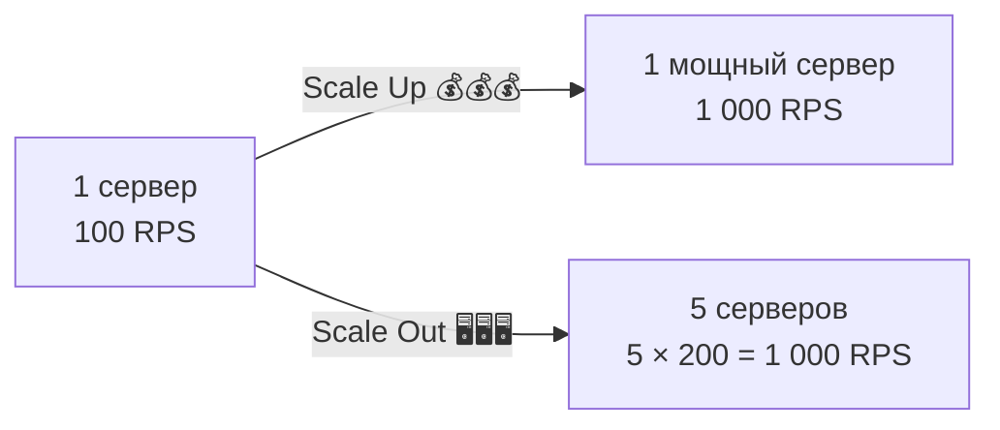
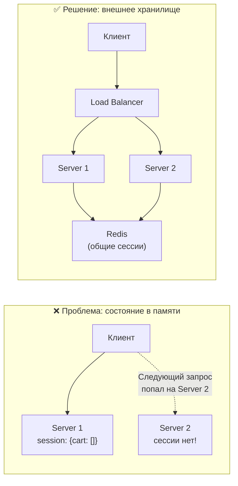
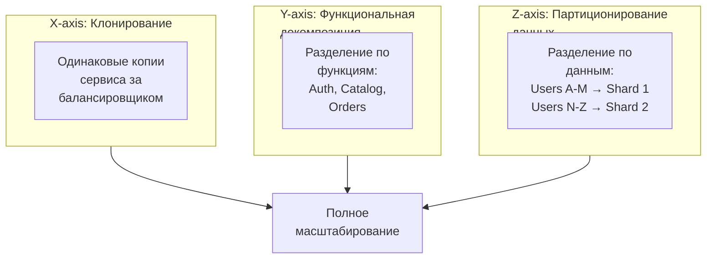

# 🔥 Уровень 1: Масштабирование — вертикальное и горизонтальное

## 🎯 Зачем масштабировать?

Ваш стартап взлетел. Вчера было 100 пользователей, сегодня — 10 000, завтра — миллион. Сервер начинает захлёбываться: время ответа растёт, запросы падают в таймаут, пользователи уходят. Что делать?

Представьте ресторан. У вас один повар, и очередь из 50 человек. Два пути:
- **Нанять суперповара** с шестью руками (вертикальное масштабирование)
- **Открыть ещё кухни** с обычными поварами (горизонтальное масштабирование)

Именно так работает масштабирование серверов.



## 🔥 Вертикальное масштабирование (Scale Up)

**Scale Up** — увеличение ресурсов одного сервера: больше CPU, RAM, SSD, сеть.

```
Было:                          Стало:
┌──────────────┐              ┌──────────────────────┐
│ 4 CPU cores  │              │ 64 CPU cores         │
│ 16 GB RAM    │    Scale     │ 512 GB RAM           │
│ 500 GB HDD   │ ──────Up──→ │ 2 TB NVMe SSD        │
│ 1 Gbps       │              │ 25 Gbps              │
│              │              │                      │
│ $100/мес     │              │ $5 000/мес           │
└──────────────┘              └──────────────────────┘
```

### Плюсы Scale Up

- **Простота** — не нужно менять архитектуру, код остаётся прежним
- **Нет проблем с распределённым состоянием** — данные на одном сервере
- **Транзакции работают "из коробки"** — ACID на одном узле

### Минусы Scale Up

- **Потолок железа** — максимальный сервер на AWS: 448 vCPU, 24 TB RAM. Дальше — стена
- **Единая точка отказа (SPOF)** — сервер упал = всё упало
- **Экспоненциальный рост стоимости** — каждое удвоение мощности стоит непропорционально дороже

```
Кривая стоимости Scale Up:

Стоимость ($)
    │
5000│                              ●
    │                         ●
    │                    ●
    │               ●
    │          ●
    │     ●
 100│ ●
    └──────────────────────────────→ Мощность
      4    8   16   32   64   128 vCPU

Рост стоимости НЕ линейный — это суперлинейная кривая!
```

## 🔥 Горизонтальное масштабирование (Scale Out)

**Scale Out** — добавление новых серверов, которые работают параллельно.

```
┌──────────┐    ┌──────────┐    ┌──────────┐    ┌──────────┐
│ Server 1 │    │ Server 2 │    │ Server 3 │    │ Server N │
│ 4 CPU    │    │ 4 CPU    │    │ 4 CPU    │    │ 4 CPU    │
│ 16 GB    │    │ 16 GB    │    │ 16 GB    │    │ 16 GB    │
│ $100/мес │    │ $100/мес │    │ $100/мес │    │ $100/мес │
└────┬─────┘    └────┬─────┘    └────┬─────┘    └────┬─────┘
     │               │               │               │
     └───────────────┴───────┬───────┴───────────────┘
                             │
                    ┌────────┴────────┐
                    │  Load Balancer  │
                    └─────────────────┘
```

### Плюсы Scale Out

- **Нет потолка** — всегда можно добавить ещё серверов
- **Отказоустойчивость** — один сервер упал, остальные работают
- **Линейный рост стоимости** — 10 серверов = 10 × $100 = $1 000

### Минусы Scale Out

- **Сложность архитектуры** — распределённое состояние, консистентность, сетевые ошибки
- **Нужен балансировщик нагрузки** — кто-то должен распределять запросы
- **Не всё можно масштабировать горизонтально** — stateful-сервисы требуют особого подхода

```
Кривая стоимости Scale Out:

Стоимость ($)
    │
1000│                              ●
    │                         ●
 800│                    ●
    │               ●
 600│          ●
    │     ●
 200│ ●
    └──────────────────────────────→ Мощность
      1    2    4    6    8   10 серверов

Рост стоимости примерно линейный (с небольшим overhead на инфраструктуру)
```

## 📌 Сравнение: когда что выбирать

| Критерий | Вертикальное (Scale Up) | Горизонтальное (Scale Out) |
|---|---|---|
| Сложность | Простое — ничего не менять в коде | Сложное — нужна архитектура |
| Потолок | Ограничен железом | Практически безлимитное |
| Отказоустойчивость | SPOF — одна точка отказа | Высокая — серверы дублируют друг друга |
| Стоимость | Экспоненциальная | Линейная |
| Downtime при масштабировании | Да (перезагрузка) | Нет (добавляем «на лету») |
| Данные | Локальные, простые | Распределённые, сложные |
| Когда использовать | MVP, маленькие проекты, БД | Высоконагруженные сервисы |

💡 **Реальность:** большинство систем используют **оба подхода**. Сначала Scale Up до разумного предела ($500-1000/мес), затем Scale Out для дальнейшего роста.

## 🔥 Stateless vs Stateful: ключ к горизонтальному масштабированию

Горизонтальное масштабирование работает хорошо только если сервисы **stateless** — не хранят состояние между запросами.

### Stateless-сервис

Каждый запрос содержит **всю** необходимую информацию. Сервер не помнит предыдущие запросы.

```typescript
// Stateless API — любой сервер может обработать запрос
app.get('/api/users/:id', async (req, res) => {
  // Токен авторизации — в заголовке запроса
  const token = req.headers.authorization

  // Данные — во внешней БД, не в памяти сервера
  const user = await db.users.findById(req.params.id)

  res.json(user)
})
```

Аналогия: фастфуд. Вы подходите к **любой** кассе, показываете меню, получаете заказ. Кассиру не нужно вас "помнить".

### Stateful-сервис

Сервер хранит состояние клиента в своей памяти. Следующий запрос **обязан** попасть на тот же сервер.

```typescript
// ❌ Stateful — сессия в памяти сервера
const sessions = new Map<string, UserSession>()

app.post('/api/login', (req, res) => {
  const session = { userId: req.body.userId, cart: [] }
  sessions.set(req.sessionId, session)  // Хранится в RAM этого сервера!
  res.json({ ok: true })
})

app.get('/api/cart', (req, res) => {
  // Если запрос попал на другой сервер — сессии нет!
  const session = sessions.get(req.sessionId)
  if (!session) return res.status(401).json({ error: 'Session not found' })
  res.json(session.cart)
})
```

Аналогия: личный парикмахер. Он помнит вашу стрижку, предпочтения, аллергии. Если он заболел — другой мастер про вас ничего не знает.

### Как сделать stateful-сервис масштабируемым



**Три стратегии:**

1. **Вынести состояние** во внешнее хранилище (Redis, БД) — лучший вариант
2. **Session affinity (sticky sessions)** — балансировщик направляет клиента на один и тот же сервер
3. **Передавать состояние в запросе** — JWT-токен с данными пользователя

```typescript
// ✅ Stateless — сессия в Redis
import Redis from 'ioredis'
const redis = new Redis()

app.post('/api/login', async (req, res) => {
  const session = { userId: req.body.userId, cart: [] }
  await redis.set(`session:${req.sessionId}`, JSON.stringify(session), 'EX', 3600)
  res.json({ ok: true })
})

app.get('/api/cart', async (req, res) => {
  // Любой сервер может достать сессию из Redis
  const raw = await redis.get(`session:${req.sessionId}`)
  if (!raw) return res.status(401).json({ error: 'Session not found' })
  const session = JSON.parse(raw)
  res.json(session.cart)
})
```

## 🔥 Scaling Cube: три оси масштабирования

**AKF Scale Cube** — модель из книги "The Art of Scalability". Описывает три измерения масштабирования:



### X-axis: Клонирование (Horizontal Duplication)

Самый простой способ — запустить N одинаковых копий сервиса за балансировщиком.

```
          ┌───────────────┐
          │ Load Balancer │
          └───────┬───────┘
       ┌──────────┼──────────┐
       ▼          ▼          ▼
  ┌─────────┐ ┌─────────┐ ┌─────────┐
  │ App v1  │ │ App v1  │ │ App v1  │  ← Один и тот же код
  │ Clone 1 │ │ Clone 2 │ │ Clone 3 │
  └─────────┘ └─────────┘ └─────────┘
```

Работает при условии, что сервис **stateless**.

### Y-axis: Функциональная декомпозиция

Разделение монолита на отдельные сервисы по бизнес-функциям (микросервисы).

```
Монолит:                    Микросервисы:
┌──────────────────┐        ┌──────────┐  ┌──────────┐  ┌──────────┐
│ Auth             │        │ Auth     │  │ Catalog  │  │ Orders   │
│ Catalog          │   →    │ Service  │  │ Service  │  │ Service  │
│ Orders           │        └──────────┘  └──────────┘  └──────────┘
│ Notifications    │        ┌──────────┐  ┌──────────┐
│ Search           │        │ Notify   │  │ Search   │
└──────────────────┘        │ Service  │  │ Service  │
                            └──────────┘  └──────────┘
```

Каждый сервис масштабируется **независимо**: если поиск нагружен — добавляем копии только Search Service.

### Z-axis: Партиционирование данных (Data Partitioning)

Разделение данных между серверами по ключу (sharding).

```
Все пользователи:              Шардирование по ID:

┌──────────────────┐           ┌─────────┐  ┌─────────┐  ┌─────────┐
│ Users 1 — 1 000 000 │        │ Shard 1 │  │ Shard 2 │  │ Shard 3 │
│                    │   →     │ ID 1-   │  │ ID 334K-│  │ ID 667K-│
│ (одна БД, тормозит)│         │ 333K    │  │ 666K    │  │ 1M      │
└──────────────────┘           └─────────┘  └─────────┘  └─────────┘
```

## 📌 Закон Амдала: предел масштабирования

Не весь код можно распараллелить. **Закон Амдала** показывает предел ускорения:

```
Speedup = 1 / (S + (1 - S) / N)

Где:
  S — доля последовательного (не параллелизуемого) кода
  N — количество процессоров (серверов)
```

Если 5% кода **обязательно** последовательные (запись в лидер-БД, глобальная блокировка):

```
N = 10 серверов:   Speedup = 1 / (0.05 + 0.95/10)  = 6.9x   (не 10x!)
N = 100 серверов:  Speedup = 1 / (0.05 + 0.95/100) = 16.8x  (не 100x!)
N = 1000 серверов: Speedup = 1 / (0.05 + 0.95/1000) = 19.2x (не 1000x!)
N = ∞:             Speedup = 1 / 0.05                = 20x   (потолок!)
```

💡 **Вывод:** при 5% последовательного кода максимальное ускорение — **20x**, сколько бы серверов вы ни добавили. Поэтому критически важно **минимизировать последовательные участки**.

## 🔥 Shared-Nothing Architecture

**Shared-Nothing** — архитектура, где каждый узел полностью автономен: имеет свои CPU, RAM, диск и не разделяет ресурсы с другими узлами.

```
Shared-Everything:              Shared-Nothing:
┌────┐ ┌────┐ ┌────┐           ┌────┐  ┌────┐  ┌────┐
│ S1 │ │ S2 │ │ S3 │           │ S1 │  │ S2 │  │ S3 │
└─┬──┘ └─┬──┘ └─┬──┘           │Disk│  │Disk│  │Disk│
  │      │      │              │Data│  │Data│  │Data│
  └──────┼──────┘              └────┘  └────┘  └────┘
         │                     (каждый узел независим)
    ┌────┴────┐
    │ Shared  │
    │ Storage │  ← Узкое место!
    └─────────┘
```

Примеры Shared-Nothing:
- **Cassandra** — каждый узел хранит свой диапазон данных
- **Kafka** — каждый брокер хранит свои партиции
- **Stateless App Servers** за балансировщиком

📌 Shared-Nothing масштабируется лучше всего, потому что нет общих ресурсов, которые становятся узким горлом.

## ⚠️ Частые ошибки новичков

### 🐛 1. Хранить состояние в памяти процесса

```typescript
// ❌ Состояние в памяти — не масштабируется
const rateLimits = new Map<string, number>()

app.use((req, res, next) => {
  const count = rateLimits.get(req.ip) || 0
  if (count > 100) return res.status(429).send('Too many requests')
  rateLimits.set(req.ip, count + 1)
  next()
})
```

> **Почему это ошибка:** при 3 серверах у каждого своя Map. Пользователь сделает 100 запросов на Server 1, потом 100 на Server 2 — rate limiter не сработает! Итого 300 запросов вместо 100.

```typescript
// ✅ Состояние в Redis — работает на любом количестве серверов
app.use(async (req, res, next) => {
  const key = `rate:${req.ip}`
  const count = await redis.incr(key)
  if (count === 1) await redis.expire(key, 60)
  if (count > 100) return res.status(429).send('Too many requests')
  next()
})
```

### 🐛 2. Масштабировать горизонтально без stateless-дизайна

```
❌ "Добавим серверов и всё ускорится!"
```

> **Почему это ошибка:** если серверы stateful (хранят сессии, кэш, временные файлы в памяти), добавление серверов создаст проблемы с консистентностью. Сначала нужно **вынести состояние**, потом масштабировать.

```
✅ Порядок действий:
1. Выявить всё состояние в сервисе (сессии, кэш, файлы)
2. Вынести в Redis / S3 / БД
3. Убедиться, что сервис stateless
4. Добавить серверы + балансировщик
```

### 🐛 3. Рассчитывать на линейное ускорение

```
❌ "У нас 1 сервер обрабатывает 1 000 RPS.
    Значит, 10 серверов = 10 000 RPS"
```

> **Почему это ошибка:** закон Амдала! Есть последовательные участки (запись в БД, глобальные блокировки), сетевой overhead, балансировщик как bottleneck. Реально 10 серверов дадут ~7 000-8 000 RPS.

```
✅ Реалистичная оценка:
   - Учитывайте overhead: балансировщик, сеть, координация
   - Ищите bottleneck: БД, внешние API, shared resources
   - Тестируйте нагрузку после каждого добавления серверов
```

### 🐛 4. Использовать sticky sessions как основную стратегию

```
❌ "Настроим sticky sessions — и stateful-сервер масштабируется!"
```

> **Почему это ошибка:** sticky sessions привязывают клиента к серверу. Если этот сервер падает — все его пользователи теряют сессии. Нагрузка распределяется неравномерно (один «горячий» клиент = один перегруженный сервер).

```
✅ Sticky sessions — временный костыль.
   Правильное решение — вынести состояние в Redis/БД
   и сделать сервис по-настоящему stateless.
```

## 📌 Итоги

- ✅ **Scale Up** (вертикальное) — проще, но ограничено железом и экспоненциально дорожает
- ✅ **Scale Out** (горизонтальное) — безлимитное, но требует stateless-архитектуры
- ✅ **Stateless-дизайн** — залог масштабируемости: вынесите состояние в Redis/БД
- ✅ **Scaling Cube** — три оси: X (клонирование), Y (декомпозиция), Z (партиционирование)
- ✅ **Закон Амдала** — последовательный код ограничивает ускорение, даже с бесконечным числом серверов
- ✅ **Shared-Nothing** — лучшая архитектура для масштабирования: нет общих ресурсов
- 📌 Большинство систем комбинируют Scale Up + Scale Out
- 📌 Сначала stateless, потом масштабирование — не наоборот
