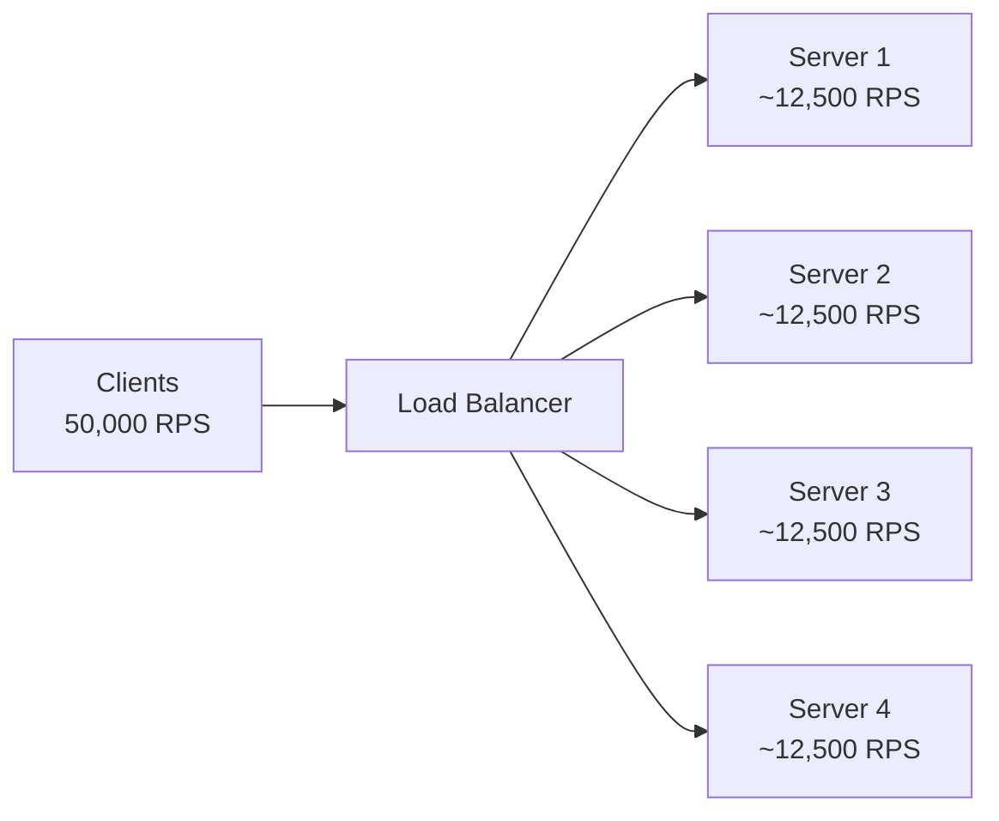
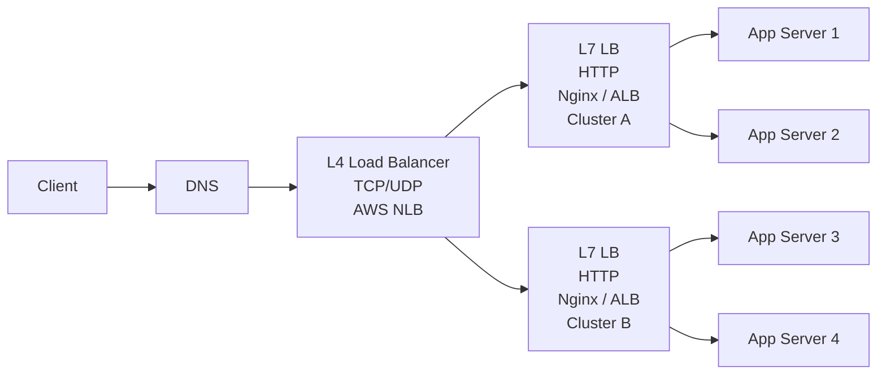
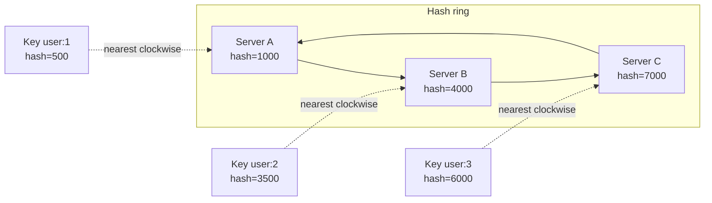
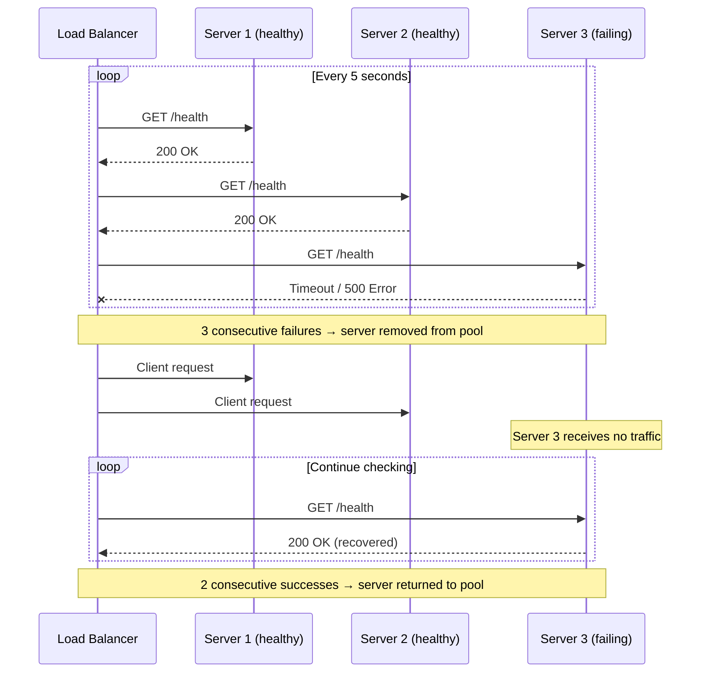
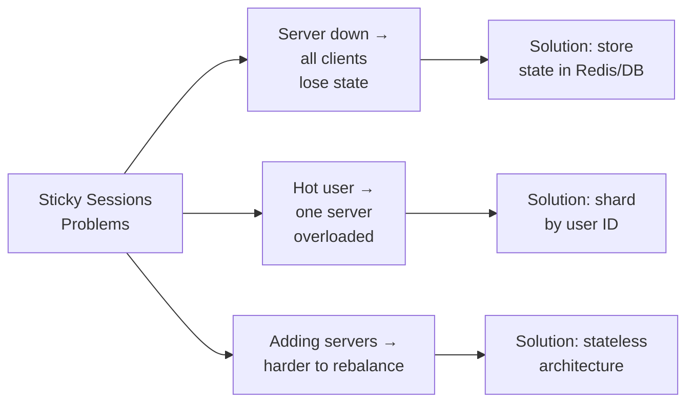
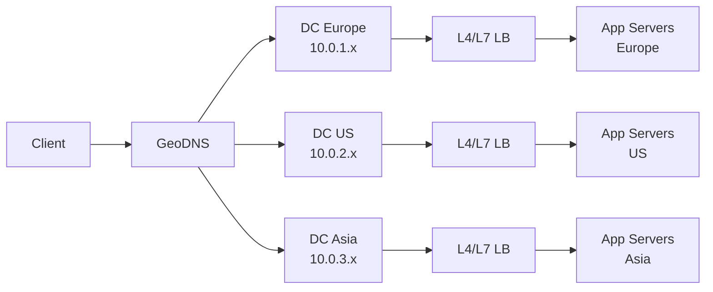
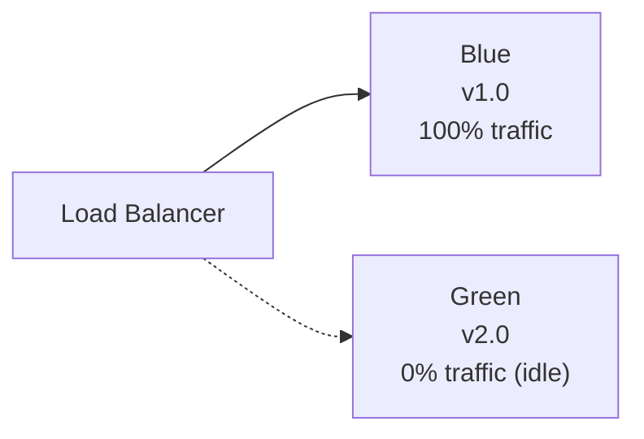

# Level 2: Load Balancing -- Traffic Distribution and Fault Tolerance

## Introduction

Imagine rush hour at an airport. Hundreds of passengers line up for check-in. If only one desk is open, a huge queue forms, people wait an hour, while adjacent desks sit empty. When all desks are opened and a dispatcher is placed at the entrance, directing passengers to less busy desks -- wait time drops tenfold.

A load balancer is exactly that dispatcher at the entrance. Only instead of passengers -- HTTP requests, instead of desks -- servers, and instead of a person -- a software or hardware component making millions of decisions per second.

Without a load balancer, even a well-written service won't handle growing load. Adding new servers won't help if all requests still go to just one of them. Load balancing is the part of infrastructure that turns a set of servers into a unified scalable system.

At this level we will cover:

1. **Why a load balancer is needed** -- the problem without it and the value with it
2. **L4 vs L7** -- two levels of load balancing, their capabilities and limitations
3. **Distribution algorithms** -- how exactly the next server is chosen
4. **Health checks** -- how the balancer learns a server is down
5. **Connection Draining** -- how to remove a server without losing requests
6. **Sticky Sessions** -- when a client must always hit the same server
7. **DNS balancing** -- the simplest but most limited level
8. **Reverse Proxy vs Load Balancer** -- what's the difference
9. **Advanced patterns** -- Blue-Green and Canary through the load balancer

---

## 1. Why a Load Balancer?

### The Problem of Vertical Scaling

When an application starts struggling with load, the first thought is to give the server more resources: add CPU, RAM, disks. This is called **vertical scaling** (scale up). It works, but has a hard ceiling.

First, cost grows non-linearly: a server with 64 CPU costs significantly more than two servers with 32 CPU each. Second, even the world's most powerful server will eventually go down. If it's the only server -- the entire service is unavailable.

The solution is **horizontal scaling** (scale out): instead of one powerful server, we take several regular ones. But the question arises: who will distribute requests between them? This is where the load balancer appears.



### What a Load Balancer Provides Beyond Traffic Distribution

A load balancer isn't just a "request distributor." It solves several important tasks simultaneously:

| Task | Without Load Balancer | With Load Balancer |
|---|---|---|
| Scaling | One server, load ceiling | N servers, linear growth |
| Fault tolerance | Server down = downtime | Failed server removed from pool |
| Deployment | Downtime on restart | Rolling update without downtime |
| SSL | Each server holds certificate | SSL termination in one place |
| Security | Real server IPs visible to clients | Servers hidden behind balancer |
| Monitoring | Metrics scattered across servers | Single point of traffic observation |

This is exactly why a load balancer is part of the architecture of virtually any production service with load above a few hundred RPS.

---

## 2. L4 vs L7: Two Levels of Load Balancing

Before discussing specific products and algorithms, it's important to understand a key distinction: load balancers operate at different levels of the OSI networking model. The two most important are **L4 (transport layer)** and **L7 (application layer)**.

The difference is **how much information the load balancer sees about each connection**.

### The OSI Model as Context

The OSI networking model describes seven layers of data transfer. Each layer adds its own header to the data. A load balancer operating at a certain layer sees information from that layer and all layers below.

L4 balancer operates at the transport layer and sees only IP addresses and ports. L7 balancer operates at the application layer and sees the full HTTP request.

### L4 -- Transport Layer (TCP/UDP)

An L4 load balancer sees only **IP addresses and ports**. It doesn't inspect packet contents -- it doesn't know whether this is HTTP or gRPC, what URL is requested, what the Content-Type header is. To it, all packets are the same -- just a TCP stream that needs to be redirected.

```
Client: 192.168.1.1:54321
         │
         ▼
   L4 Load Balancer (10.0.0.1:80)
   Sees: src=192.168.1.1:54321, dst=10.0.0.1:80
   Decides: → send to 10.0.0.10:80
   Doesn't see: HTTP method, URL, headers
         │
         ▼
   Server: 10.0.0.10:80
```

It works very simply: the balancer modifies the NAT table of the Linux kernel (or a hardware table), redirecting the TCP connection to the selected backend. The packet itself is not read or modified. This is what gives L4 incredible speed -- **tens of millions of packets per second**.

**Pros of L4:**
- Extremely fast -- works at the OS kernel or hardware level
- No need to decrypt TLS (just passes the encrypted stream through)
- Works with any protocol over TCP/UDP (not just HTTP)
- Cheap to operate

**Cons of L4:**
- Cannot route by URL, headers, cookies
- Doesn't do SSL termination (client encrypts all the way to backend)
- Cannot read or modify request contents
- Less flexibility for complex scenarios

**Where used:** AWS NLB, HAProxy in TCP mode, IPVS (built into Linux kernel), F5 hardware balancers.

### L7 -- Application Layer (HTTP/HTTPS)

An L7 load balancer **fully parses the HTTP request**: reads URL, headers, cookies, can read the request body. This enables truly intelligent routing decisions.

```
Client: GET /api/users HTTP/1.1
        Host: myapp.com
        Cookie: session=abc123
        Authorization: Bearer eyJhbGc...
         │
         ▼
   L7 Load Balancer
   Reads entire HTTP request
   Decides:
     /api/*          → API Server Pool
     /static/*       → CDN / Static Server Pool
     /ws/*           → WebSocket Server Pool
     Host: admin.*   → Admin Backend Pool
         │
         ▼
   API Server Pool (appropriate backend)
```

An L7 balancer works as a proxy: it accepts the TCP connection from the client, reads the HTTP request, selects a backend, and establishes a **new** TCP connection to the backend. This means additional overhead compared to L4, but it's compensated by flexibility.

**Pros of L7:**
- Smart routing by any HTTP request attribute
- SSL termination -- decrypts TLS once, backend gets plaintext
- Can modify requests and responses (add headers, rewrite URLs)
- gzip/brotli compression, response caching
- Rate limiting, authentication, DDoS protection
- Detailed metrics at the request level (latency, error rate by URL)

**Cons of L7:**
- Slower than L4 (~1M RPS vs ~10M PPS)
- Must decrypt TLS, which requires CPU
- More complex configuration
- Higher cost (when using managed services)

**Where used:** Nginx, AWS ALB (Application Load Balancer), Envoy, Traefik, HAProxy in HTTP mode.

### Comparison of L4 and L7

| Criterion | L4 (Transport) | L7 (Application) |
|---|---|---|
| Sees | IP + port | URL, headers, cookies, body |
| Speed | Very fast (~10M PPS) | Fast (~1M RPS) |
| SSL termination | No (passthrough) | Yes |
| URL routing | No | Yes |
| WebSocket | Passthrough (transparent) | Can inspect |
| Request modification | No | Yes |
| Rate limiting | No | Yes |
| Metrics | By connections | By requests (URL, status, latency) |
| Cost | Low | Higher |
| Protocols | Any TCP/UDP | HTTP, HTTPS, gRPC, WebSocket |
| When to use | TCP services, high PPS, before L7 | HTTP APIs, microservices, content-based routing |

**In practice**, **both levels** are often used: L4 at the entrance (quickly handles TCP, distributes across clusters), L7 inside the cluster (smart HTTP routing). This is called **two-tier load balancing**.



### Nginx Configuration as L7 Load Balancer

Nginx is one of the most popular L7 load balancers. Let's look at a typical configuration and break down each directive:

```nginx
# Server pool for API requests
upstream api_servers {
    # Weighted round-robin: powerful server gets 3x traffic
    server 10.0.0.1:8080 weight=3;   # 8 CPU, 32 GB RAM
    server 10.0.0.2:8080 weight=1;   # 2 CPU, 8 GB RAM
    server 10.0.0.3:8080 weight=1;   # 2 CPU, 8 GB RAM
    server 10.0.0.4:8080 backup;     # Only when all main ones are down
}

# Server pool for WebSocket connections
upstream websocket_servers {
    # IP hash: one client = one server (sticky sessions)
    ip_hash;
    server 10.0.0.10:8080;
    server 10.0.0.11:8080;
    server 10.0.0.12:8080;
}

server {
    listen 443 ssl;
    server_name myapp.com;

    # SSL termination: balancer decrypts TLS
    ssl_certificate     /etc/ssl/myapp.crt;
    ssl_certificate_key /etc/ssl/myapp.key;

    # API traffic → api_servers pool
    location /api/ {
        proxy_pass http://api_servers;
        # Pass real client IP to backend
        proxy_set_header X-Real-IP $remote_addr;
        proxy_set_header X-Forwarded-For $proxy_add_x_forwarded_for;
        proxy_set_header Host $host;
        # Timeouts
        proxy_connect_timeout 5s;
        proxy_read_timeout 60s;
    }

    # WebSocket traffic → websocket_servers pool
    location /ws/ {
        proxy_pass http://websocket_servers;
        proxy_http_version 1.1;
        # Required headers for WebSocket upgrade
        proxy_set_header Upgrade $http_upgrade;
        proxy_set_header Connection "upgrade";
        proxy_read_timeout 3600s; # Long-lived connections
    }

    # Static files → direct serving from disk, no proxying
    location /static/ {
        root /var/www;
        expires 30d;
        add_header Cache-Control "public, immutable";
    }
}
```

Key details to note:

- `upstream` block defines the server pool -- Nginx automatically monitors their health
- `weight=3` on the first server means it gets 3 out of every 5 requests
- `backup` server is only enabled when all main servers are unavailable
- `proxy_set_header X-Real-IP` -- critical, otherwise the backend won't know the real client IP
- WebSocket requires special `Upgrade` and `Connection` headers -- without them, the connection won't upgrade from HTTP/1.1 to WS

---

## 3. Load Balancing Algorithms

When a new request arrives, the load balancer needs to decide: which server should get it? This decision is made by a **load balancing algorithm**. The choice of algorithm significantly affects load distribution and system performance.

### Round Robin -- Simple Rotation

The simplest algorithm: requests are distributed across servers strictly in order -- 1, 2, 3, 1, 2, 3...

```
Requests:   R1  R2  R3  R4  R5  R6  R7  R8  R9
            │   │   │   │   │   │   │   │   │
Server 1:   R1          R4          R7
Server 2:       R2          R5          R8
Server 3:           R3          R6          R9
```

The balancer just keeps a pointer to the current server and shifts it with each request. O(1) complexity, no state other than a counter.

**When suitable:** servers of equal power, requests of equal weight (e.g., static files or light APIs).

**When not suitable:** servers of different power, or some requests take 1ms and others take 5 seconds. In this case, the queue skews.

Analogy: dealing cards in a card game -- each player gets one card in turn, regardless of how many cards they already have.

### Weighted Round Robin -- Weighted Rotation

Extension of Round Robin: each server is assigned a **weight** -- the number of requests it receives proportionally to others.

```
Weights: Server 1 = 3, Server 2 = 1, Server 3 = 1
Total: 5 parts → every 5 requests distributed 3:1:1

Requests:   R1  R2  R3  R4  R5  R6  R7  R8  R9  R10
Server 1:   R1  R2  R3          R6  R7  R8
Server 2:              R4                      R9
Server 3:                  R5                      R10
```

Nginx implements this algorithm with balancing within the cycle (SWRR -- Smooth Weighted Round Robin), so requests don't come in batches to one server but are distributed smoothly.

**When to use:** servers of different power (8 CPU vs 2 CPU), different cloud plans, gradual retirement of old servers.

```nginx
upstream backend {
    server 10.0.0.1:8080 weight=5;  # New powerful server
    server 10.0.0.2:8080 weight=2;  # Old weak server
    server 10.0.0.3:8080 weight=3;  # Medium server
}
```

### Least Connections -- Minimum Queue

Instead of strict rotation, the algorithm picks the server with the **fewest active connections**.

```
Current connections:
  Server 1: ████████  (8 connections)
  Server 2: ███       (3 connections)  ← new request goes here
  Server 3: █████     (5 connections)
```

Analogy: you arrive at a supermarket and choose a checkout. You don't look at how many checkouts customers have already passed through, but at how many people are standing in queue right now. You join the shortest queue.

The balancer tracks the number of active connections on each server. This requires slightly more memory and computation (O(log N) with min-heap), but gives significantly more even distribution for unequal requests.

**When critically important:**
- Requests with unpredictable processing time (from 10ms to 30 seconds)
- Streaming responses (files, video)
- Requests to external APIs with different latency
- Long-polling and SSE (Server-Sent Events)

```nginx
upstream backend {
    least_conn;
    server 10.0.0.1:8080;
    server 10.0.0.2:8080;
    server 10.0.0.3:8080;
}
```

Least Connections in Nginx doesn't account for server weights when counting. For weighted Least Connections you need Nginx Plus or another load balancer.

### IP Hash -- Deterministic Binding

A hash of the client's IP address determines which server the request goes to. The same IP **always** maps to the same server:

```
hash("192.168.1.1") % 3 = 0 → Server 1  (always)
hash("192.168.1.2") % 3 = 2 → Server 3  (always)
hash("192.168.1.3") % 3 = 1 → Server 2  (always)
hash("192.168.1.1") % 3 = 0 → Server 1  (same client → same server)
```

This provides **sticky sessions** without explicit cookies -- the balancer doesn't remember state, but the deterministic hash always gives the same result.

**When to use:**
- WebSocket connections (must hit the same process)
- In-memory server cache (cache warm-up for a specific client)
- Shopping cart in memory (without Redis)

**Critical drawback:** when adding or removing a server, **all** hashes change, and almost all clients get redistributed to new servers. This is called the mass-remapping problem.

```
3 servers: hash(IP) % 3
  Client A → Server 0
  Client B → Server 1
  Client C → Server 2

Added 4th server: hash(IP) % 4
  Client A → Server 0  (lucky, didn't change)
  Client B → Server 3  ← changed!
  Client C → Server 0  ← changed!
```

At N=3→N=4, ~75% of clients get redistributed. This flushes all cache and breaks WebSocket connections.

### Consistent Hashing -- Smart Binding Without Mass Redistribution

Consistent Hashing solves the IP Hash problem -- when the number of servers changes, only **~1/N of keys** are redistributed, not all of them.

**How it works:**

Imagine a ring with numbers from 0 to 2^32 (4 billion positions). Servers and keys are hashed onto this ring. A key is served by the nearest server **clockwise**:



When adding a new server D (hash=5500), only the range from C is moved:

```
3 servers before:              Added Server D (hash=5500):
[0...1000]   → A               [0...1000]   → A    (unchanged)
[1001...4000] → B              [1001...4000] → B    (unchanged)
[4001...7000] → C              [4001...5500] → D    ← only this part
[7001...9999] → A              [5501...7000] → C    (unchanged)
                               [7001...9999] → A    (unchanged)

Redistributed: ~25% of keys (only C→D)
IP Hash at N=3→N=4: ~75% of keys!
```

**Virtual nodes:** the problem with basic Consistent Hashing -- uneven distribution with few points. If all three servers landed in adjacent positions on the ring, one server gets 80% of keys, while the other two get 10% each.

Solution: each physical server creates 100-200 **virtual points** on the ring:

```
Without virtual nodes (3 points):
  Ring: ●━━━━━━━━━━━━━━━━━●━━●
         A                 B  C
  Distribution: A=80%, B=12%, C=8%  (extremely uneven)

With virtual nodes (150 points per server = 450 points):
  Ring: ●A₁●B₃●C₂●A₇●B₁●C₅●A₂●...
  Distribution: A≈34%, B≈33%, C≈33%  (nearly ideal)
```

**Consistent Hashing** is used in: **Cassandra** (data distribution across nodes), **DynamoDB** (partitioning), **Redis Cluster** (hash slots -- a simplified variant), **Memcached** (libketama), **CDN** (routing to edge servers).

```typescript
// Simplified Consistent Hashing implementation in TypeScript
class ConsistentHashRing {
  private ring = new Map<number, string>() // hash → serverName
  private sortedKeys: number[] = []
  private readonly virtualNodes: number

  constructor(virtualNodes = 150) {
    this.virtualNodes = virtualNodes
  }

  addServer(server: string): void {
    for (let i = 0; i < this.virtualNodes; i++) {
      const hash = this.hash(`${server}#${i}`)
      this.ring.set(hash, server)
      this.sortedKeys.push(hash)
    }
    this.sortedKeys.sort((a, b) => a - b)
  }

  removeServer(server: string): void {
    for (let i = 0; i < this.virtualNodes; i++) {
      const hash = this.hash(`${server}#${i}`)
      this.ring.delete(hash)
    }
    this.sortedKeys = this.sortedKeys.filter(k => this.ring.has(k))
  }

  getServer(key: string): string | undefined {
    if (this.ring.size === 0) return undefined
    const hash = this.hash(key)
    // Find nearest hash clockwise (binary search)
    const idx = this.sortedKeys.findIndex(k => k >= hash)
    const targetKey = idx === -1
      ? this.sortedKeys[0]  // Wrapped around to start of ring
      : this.sortedKeys[idx]
    return this.ring.get(targetKey)
  }

  private hash(key: string): number {
    // Simplified hash (in reality use MurmurHash3 or xxHash)
    let h = 0
    for (const char of key) {
      h = (Math.imul(31, h) + char.charCodeAt(0)) | 0
    }
    return Math.abs(h)
  }
}

// Usage
const ring = new ConsistentHashRing(150)
ring.addServer('server-1')
ring.addServer('server-2')
ring.addServer('server-3')

console.log(ring.getServer('user:123'))  // → 'server-2'
console.log(ring.getServer('user:456'))  // → 'server-1'

// Add server -- only ~25% of keys redistribute
ring.addServer('server-4')
console.log(ring.getServer('user:123'))  // → 'server-2'  (unchanged!)
console.log(ring.getServer('user:456'))  // → 'server-4'  (moved to new one)
```

### Algorithm Comparison

| Algorithm | Complexity | Accounts for Load | Sticky | Redistribution on N change | When to choose |
|---|---|---|---|---|---|
| Round Robin | O(1) | No | No | N/A | Identical servers, identical requests |
| Weighted RR | O(1) | Partially (static) | No | N/A | Servers of different power |
| Least Connections | O(log N) | Yes (dynamic) | No | N/A | Requests with different processing times |
| IP Hash | O(1) | No | Yes | ~100% (disaster) | Small clusters, rare changes |
| Consistent Hashing | O(log N) | No | Yes | ~1/N (minimal) | Large clusters, frequent changes |

---

## 4. Health Checks: Making Sure a Server Is Alive

A load balancer is pointless if it sends requests to failed servers. The client will get an error or timeout. To prevent this, **health checks** are used -- a mechanism for regularly checking server status.

### Server Lifecycle in the Pool



Note the asymmetry: to **remove** a server, 3 failures are needed; to **return** -- 2 successes. This is intentional:

- Strict removal prevents flapping (quick exclusion due to a single glitch)
- Strict return prevents prematurely returning an unstable server

### Active Health Checks

The balancer **itself** periodically polls servers on a special endpoint, independently of real traffic.

```nginx
upstream backend {
    server 10.0.0.1:8080;
    server 10.0.0.2:8080;
    server 10.0.0.3:8080;
}

# Nginx Plus / OpenResty (paid/extended version)
location / {
    proxy_pass http://backend;
    health_check interval=5s fails=3 passes=2 uri=/health;
}
```

Open-source Nginx doesn't support active health checks out of the box -- only passive. Active health checks are supported by Nginx Plus, HAProxy, Envoy, AWS ALB.

**Pros:**
- Server removed from pool within seconds of failure
- No need to wait for real client traffic
- Checking happens independently of load

**Cons:**
- Additional load: N balancers × M servers = N×M checks every K seconds
- Need a `/health` endpoint on each server

### Passive Health Checks

The balancer tracks **real responses** from servers to client requests. If a server starts responding with errors or timeouts -- it's removed from the pool.

```nginx
upstream backend {
    # 3 errors (5xx or timeout) in 30 seconds → remove server for 30 seconds
    server 10.0.0.1:8080 max_fails=3 fail_timeout=30s;
    server 10.0.0.2:8080 max_fails=3 fail_timeout=30s;
    server 10.0.0.3:8080 max_fails=3 fail_timeout=30s;
}
```

After 30 seconds, Nginx will try sending one request to the "removed" server. If successful -- it returns to the pool. If not -- excluded again for `fail_timeout`.

**Pros:**
- Zero overhead (works on real requests)
- No special `/health` endpoint needed

**Cons:**
- First few clients will get errors before the server is excluded
- Doesn't work without traffic (quiet servers aren't checked)

### A Proper /health Endpoint

A health check is useless if it always returns 200. The server may be alive (process running) but unhealthy -- database unavailable, disk full, memory pressure critical.

```typescript
// ❌ Useless health check
app.get('/health', (req, res) => {
  res.json({ status: 'ok' }) // Always 200, even if DB is down
})

// ✅ Full health check
interface HealthStatus {
  status: 'healthy' | 'degraded' | 'unhealthy'
  checks: {
    database: boolean
    redis: boolean
    diskSpace: boolean
  }
  uptime: number
  timestamp: number
}

app.get('/health', async (req, res) => {
  const checks = {
    database: false,
    redis: false,
    diskSpace: false,
  }

  // Check all dependencies in parallel
  await Promise.allSettled([
    db.query('SELECT 1')
      .then(() => { checks.database = true })
      .catch(() => {}),

    redis.ping()
      .then(() => { checks.redis = true })
      .catch(() => {}),

    checkDiskSpace('/var/app')
      .then(freeBytes => { checks.diskSpace = freeBytes > 1_000_000_000 })
      .catch(() => {}),
  ])

  const allHealthy = Object.values(checks).every(Boolean)
  const someHealthy = Object.values(checks).some(Boolean)

  const status: HealthStatus['status'] = allHealthy
    ? 'healthy'
    : someHealthy ? 'degraded' : 'unhealthy'

  const httpStatus = allHealthy ? 200 : someHealthy ? 207 : 503

  res.status(httpStatus).json({
    status,
    checks,
    uptime: process.uptime(),
    timestamp: Date.now(),
  } satisfies HealthStatus)
})
```

**Best practice:** use **both types** simultaneously -- active for fast failure detection, passive as additional insurance. Active health check with 5-second interval will detect failure in 15-25 seconds (3 fails × 5s + margin), while passive will immediately stop sending new requests to a failed server.

---

## 5. Connection Draining -- Graceful Shutdown Without Losing Requests

Servers in production are regularly stopped: new version deployment, scheduled maintenance, autoscaling. If you just kill the process -- all active connections will break, clients will get errors.

**Connection draining** solves this: the load balancer stops sending **new** requests to the server being removed, but waits for **current** connections to complete.

### What It Looks Like Over Time

```
Time →
─────────────────────────────────────────────────────────────

Step 1 (t=0): "Drain" signal -- remove server from pool
  LB:     [new requests → Server 2, Server 3]
  Server: [active requests: R1, R2, R3 still processing]

Step 2 (t=5s): Continue waiting
  LB:     [no new requests]
  Server: [R1 completed, R2 completed, R3 still processing]

Step 3 (t=8s): All requests completed
  LB:     [server removed]
  Server: [safe to stop process]

Or:
Step 3 (t=30s): Timeout -- forced shutdown
  Server: [R3 still not done, but we can't wait forever]
  Server: [forced shutdown, R3 gets error]
```

AWS ALB automatically performs connection draining when deregistering a server. Nginx Plus has a `drain` directive. Kubernetes implements this mechanism through `terminationGracePeriodSeconds` and `preStop` hooks.

### Graceful Shutdown in Node.js

```typescript
import { createServer } from 'http'
import express from 'express'

const app = express()
const server = createServer(app)

// State flag: is the server accepting new connections?
let isShuttingDown = false

// On shutdown -- immediately respond 503 to new requests
app.use((req, res, next) => {
  if (isShuttingDown) {
    res.setHeader('Connection', 'close')
    res.status(503).send('Server is shutting down')
    return
  }
  next()
})

app.get('/health', (req, res) => {
  // Balancer will see 503 and stop sending requests
  if (isShuttingDown) {
    res.status(503).json({ status: 'shutting_down' })
  } else {
    res.json({ status: 'healthy' })
  }
})

// SIGTERM sent by Kubernetes/Docker when stopping container
process.on('SIGTERM', () => {
  console.log('Received SIGTERM -- starting graceful shutdown')
  isShuttingDown = true

  // Stop accepting new TCP connections
  server.close(() => {
    console.log('All HTTP connections closed')
    // Close connections to DB, Redis, etc.
    Promise.all([
      db.end(),
      redis.quit(),
    ]).then(() => {
      console.log('Cleanup complete -- exiting')
      process.exit(0)
    })
  })

  // Forced exit after 30 seconds if not done
  setTimeout(() => {
    console.error('Forced shutdown after 30s timeout')
    process.exit(1)
  }, 30_000)
})
```

Important: if the health check starts returning 503 **before** the load balancer sends SIGTERM -- that's even better. The balancer will have time to remove the server from the pool before the process stops, and no one loses requests.

---

## 6. Sticky Sessions -- Binding Client to Server

### When Sticky Sessions Are Needed

An ideal stateless service can handle any request on any server. But in reality, situations often arise where requests from one client **must** hit the same server:

- **WebSocket** -- persistent connection bound to a specific process
- **Long polling** -- client waits for events from a specific server
- **In-memory server cache** -- user data cached on a specific node
- **Server-side rendering with state** -- session stored in process memory
- **Large file uploads** -- multipart upload must go to the same server

### Implementation Methods

```nginx
# 1. IP-based sticky sessions (simple but unreliable)
upstream backend {
    ip_hash;
    server 10.0.0.1:8080;
    server 10.0.0.2:8080;
    server 10.0.0.3:8080;
}
# Problem: clients behind NAT/proxy (corporate network) -- one IP for thousands of people
# Problem: mobile users change IP when switching networks

# 2. Cookie-based sticky sessions (more reliable)
upstream backend {
    # Nginx Plus (paid)
    sticky cookie srv_id expires=1h path=/;
    server 10.0.0.1:8080;
    server 10.0.0.2:8080;
}
# Balancer sets cookie srv_id with server ID
# Subsequent requests with this cookie go to the same server
```

```typescript
// 3. Application-level sticky sessions via header
// Client passes server ID in header, LB routes accordingly
app.post('/connect', async (req, res) => {
  const serverId = await selectLeastLoadedServer()

  res.setHeader('X-Server-Id', serverId)
  res.json({ serverId, wsUrl: `wss://ws-${serverId}.myapp.com` })
})
// Then client connects directly to specific WS server
```

### Problems with Sticky Sessions and How to Avoid Them



**Rule:** sticky sessions are a **crutch**, not an architectural solution. They're needed when redesigning a service as stateless is difficult or expensive. Strive for any request to be handled by any server -- this simplifies scaling and increases reliability.

**The right solution:** extract state from processes to external storage:

```typescript
// ❌ Sticky sessions: session in process memory
const sessions = new Map<string, UserSession>() // Lives only in this process

// ✅ Stateless: session in Redis
import { Redis } from 'ioredis'
const redis = new Redis(process.env.REDIS_URL)

async function getSession(sessionId: string): Promise<UserSession | null> {
  const data = await redis.get(`session:${sessionId}`)
  return data ? JSON.parse(data) : null
}

async function setSession(sessionId: string, session: UserSession): Promise<void> {
  await redis.setex(`session:${sessionId}`, 3600, JSON.stringify(session))
}
// Now any server can handle any request
```

---

## 7. DNS Balancing

### How DNS Round Robin Works

Before L4/L7 load balancers existed, DNS was used for primitive balancing: the DNS server returns multiple IP addresses for one domain and rotates their order:

```
$ dig myapp.com A

; ANSWER SECTION:
myapp.com.  60  IN  A  10.0.0.1   ← first response
myapp.com.  60  IN  A  10.0.0.2
myapp.com.  60  IN  A  10.0.0.3

# Next request:
myapp.com.  60  IN  A  10.0.0.2   ← rotation
myapp.com.  60  IN  A  10.0.0.3
myapp.com.  60  IN  A  10.0.0.1
```

The browser picks the first IP from the list (usually). Different clients get different order -- load is distributed roughly evenly.

### Pros and Cons of DNS Balancing

**Pros:**
- Distributes traffic **globally** between data centers (GeoDNS -- nearest DC)
- No additional infrastructure needed -- just DNS records
- Works at the connection level (reduces latency)

**Cons:**
- DNS is **cached** for TTL (usually 60-300 seconds). When a server goes down, clients continue hitting it for minutes
- No health checks -- DNS doesn't know if a server is alive
- Clients often cache the first IP and don't change it
- No smart routing -- only Round Robin by IP



**In practice:** DNS balancing is used for **global** distribution between regions/data centers. Within each region, a full L4/L7 load balancer stands. DNS is the first level, not a replacement for a load balancer.

---

## 8. Reverse Proxy vs Load Balancer

These terms are often confused because in practice the same product (Nginx, HAProxy) performs both roles.

**Reverse Proxy** -- a server that stands before one or more backends and accepts requests on behalf of clients. It hides backends from the outside world.

**Load Balancer** -- a reverse proxy with multiple backends and an algorithm for choosing between them.

```
Reverse Proxy (one backend):
  Client → Nginx → Backend

Load Balancer (multiple backends):
  Client → Nginx → Backend 1
                 → Backend 2
                 → Backend 3
```

Everything a reverse proxy can do, a load balancer can do too. Additionally, a load balancer has:

| Capability | Reverse Proxy | Load Balancer |
|---|---|---|
| SSL termination | ✅ | ✅ |
| Compression (gzip) | ✅ | ✅ |
| Caching | ✅ | ✅ |
| Rate limiting | ✅ | ✅ |
| Backend protection | ✅ | ✅ |
| Multiple backends | Optional | ✅ (essence) |
| Health checks | No | ✅ |
| Selection algorithm | No | ✅ |
| Connection draining | No | ✅ |

In practice, Nginx is always configured as both simultaneously.

---

## 9. Advanced Patterns

### Blue-Green Deployment via Load Balancer

Blue-Green -- a zero-downtime deployment strategy. Two identical environments: **Blue** (current production version) and **Green** (new version, prepared for release).



Deploying new code:

```
1. Deploy v2.0 in Green environment
2. Run smoke tests in Green (no production traffic)
3. Switch load balancer: 100% → Green
4. Blue becomes idle (rollback reserve)

On problems: switch back to Blue in seconds
```

```nginx
# Before deployment
upstream backend {
    server 10.0.0.1:8080;  # Blue
    server 10.0.0.2:8080;  # Blue
}

# After deployment (rebuild config and do nginx -s reload)
upstream backend {
    server 10.0.0.10:8080;  # Green
    server 10.0.0.11:8080;  # Green
}

# nginx -s reload -- graceful reload without downtime
```

**Pro:** instant rollback -- just switch the balancer back.
**Con:** need to keep double the number of servers during deployment.

### Canary Deployment via Weighted Routing

Canary -- gradual rollout of a new version. First, a small share of traffic (1-5%) goes to the new version. Monitor errors and latency. If everything is fine -- increase the share.

```nginx
# Stage 1: 5% on new version
upstream backend {
    server 10.0.0.1:8080 weight=19;  # v1.0 -- 95% traffic
    server 10.0.0.2:8080 weight=1;   # v2.0 -- 5% traffic (canary)
}

# Stage 2: 20% on new version (after verification)
upstream backend {
    server 10.0.0.1:8080 weight=4;   # v1.0 -- 80%
    server 10.0.0.2:8080 weight=1;   # v2.0 -- 20%
}

# Stage 3: 100% on new version
upstream backend {
    server 10.0.0.2:8080;            # v2.0 -- 100%
}
```

**Canary vs Blue-Green:**
- Blue-Green: "all or nothing" switch, instant rollback
- Canary: gradual rollout, minimal risk, rollback also instant (remove canary server)

For more complex Canary (by headers, cookies, geolocation), use Nginx Ingress in Kubernetes with `nginx.ingress.kubernetes.io/canary-*` annotations or Istio/Envoy with traffic splitting.

---

## Common Mistakes

### 1. Single Load Balancer = Single Point of Failure (SPOF)

**Problematic architecture:**

```
Client → [Load Balancer] → Servers
                ↑
    If LB goes down -- entire service unavailable!
```

A load balancer is an infrastructure component, and it can also fail. A single balancer creates a Single Point of Failure -- a single point whose failure brings down the entire system.

**Correct architecture -- Active-Passive:**

```
Client → DNS (Virtual IP) → [LB Active]  → Servers
                            [LB Passive] (standby)

Keepalived monitors LB Active.
If Active fails -- Passive takes over Virtual IP in seconds.
Clients continue hitting the same IP without noticing the switch.
```

**Correct architecture -- Active-Active:**

```
Client → DNS (multiple A records) → [LB 1] → Servers
                                    → [LB 2] → Servers

Both balancers active and accepting traffic.
If one fails, DNS continues returning the IP of the second.
```

Managed services (AWS ALB, Google Cloud Load Balancing, Cloudflare) handle fault tolerance themselves -- they are internally replicated. This is one of the key reasons for using them.

---

### 2. Health Checks Not Configured

**Without health checks:**

```nginx
upstream backend {
    server 10.0.0.1:8080;
    server 10.0.0.2:8080;
    # No max_fails, no health_check
    # Traffic goes to dead server!
}
```

If a server goes down -- the balancer continues sending requests to it. Clients get errors or timeouts until you manually intervene.

**With passive health checks (minimum):**

```nginx
upstream backend {
    server 10.0.0.1:8080 max_fails=3 fail_timeout=30s;
    server 10.0.0.2:8080 max_fails=3 fail_timeout=30s;
}
```

**With active health checks (better):**

```nginx
# HAProxy
backend app_servers
    option httpchk GET /health
    http-check expect status 200
    server s1 10.0.0.1:8080 check inter 5s fall 3 rise 2
    server s2 10.0.0.2:8080 check inter 5s fall 3 rise 2
```

---

### 3. Health Check Checks the Wrong Thing

**Always-healthy health check:**

```typescript
app.get('/health', (req, res) => {
  res.json({ status: 'ok' }) // Always 200, even if DB is unavailable
})
```

A server may be "alive" (process running, port listening) but unable to serve requests (DB unavailable, memory exhausted, disk full). The balancer will continue sending traffic, clients will get application errors.

**Health check that actually verifies readiness:**

```typescript
app.get('/health', async (req, res) => {
  const checks = { database: false, redis: false, diskSpace: false }

  try { await db.query('SELECT 1'); checks.database = true } catch {}
  try { await redis.ping(); checks.redis = true } catch {}
  try {
    const free = await checkDiskSpace()
    checks.diskSpace = free > 1_000_000_000 // > 1 GB
  } catch {}

  const healthy = Object.values(checks).every(Boolean)
  res.status(healthy ? 200 : 503).json({
    status: healthy ? 'healthy' : 'degraded',
    checks,
  })
})
```

---

### 4. Sticky Sessions Instead of Stateless Architecture

**State in memory + sticky sessions:**

```typescript
// Session stored in process memory
const userSessions = new Map<string, Session>()

// If user hits another server -- session not found
// If server goes down -- all sessions lost
```

Sticky sessions are not a solution but a temporary workaround. They create uneven load, complicate scaling, and don't save you when a server fails.

**Stateless with external storage:**

```typescript
// Session in Redis -- accessible from any server
const session = await redis.get(`session:${userId}`)
// Now any server can handle any user's request
```

---

### 5. Consistent Hashing Without Virtual Nodes

**3 servers on the ring without virtual nodes:**

```
Distribution with 3 points on the ring:
  Server A: 0...1000     → covers 10% of ring
  Server B: 1001...4000  → covers 30% of ring
  Server C: 4001...9999  → covers 60% of ring

Load: A=10%, B=30%, C=60%  (extremely uneven!)
```

One server is overloaded, another is underloaded -- horizontal scaling doesn't help.

**150 virtual nodes per server:**

```
3 servers × 150 points = 450 points on the ring
  Server A: ~33% of ring
  Server B: ~34% of ring
  Server C: ~33% of ring

Load is nearly perfectly even
```

---

### 6. Ignoring Connection Draining During Deployment

**Abrupt server stop:**

```bash
# Server killed immediately
systemctl stop myapp
# All active requests (may take seconds/minutes) = errors
```

**Graceful shutdown:**

```bash
# 1. Remove from balancer pool (or wait for health check to return 503)
curl -X POST http://lb/admin/drain/server-1

# 2. Wait for active requests to complete
sleep 30

# 3. Stop server
systemctl stop myapp
```

In Kubernetes, this is done automatically through `terminationGracePeriodSeconds` and `preStop` hooks.

---

## Summary

- ✅ **L4 load balancer** operates at TCP/UDP level -- extremely fast, sees only IP and ports, can't route by URL
- ✅ **L7 load balancer** parses HTTP -- smart routing, SSL termination, rate limiting, detailed metrics
- ✅ **Two tiers together** -- L4 at entrance for high PPS, L7 inside for smart HTTP routing
- ✅ **Round Robin** -- simplest algorithm, suitable for identical servers and requests
- ✅ **Weighted Round Robin** -- when servers have different power
- ✅ **Least Connections** -- best choice for requests with different processing times
- ✅ **Consistent Hashing** -- minimal redistribution when server count changes, must use with virtual nodes
- ✅ **Health Checks** -- active (periodic polling) + passive (monitoring real responses); health endpoint should check real dependencies
- ✅ **Connection Draining** -- graceful shutdown without losing active requests
- **Sticky sessions** -- temporary workaround, real solution is stateless architecture with Redis
- **DNS balancing** -- for global distribution between regions, but not a replacement for L4/L7
- **Load balancer itself must not be a SPOF** -- Active-Passive with Keepalived or managed service (AWS ALB)
- **Blue-Green** -- instant switch during deployment with rollback capability
- **Canary** -- gradual rollout of new version with early problem detection
