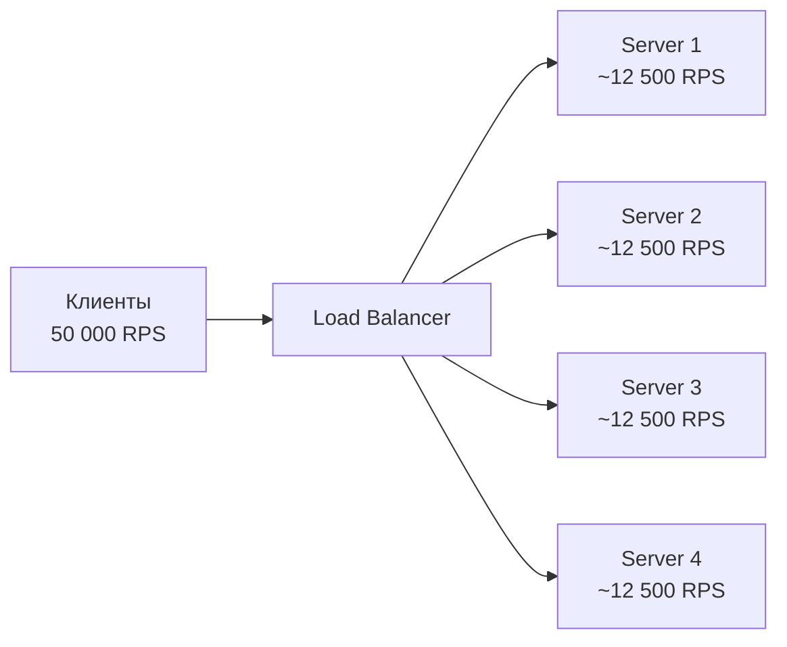
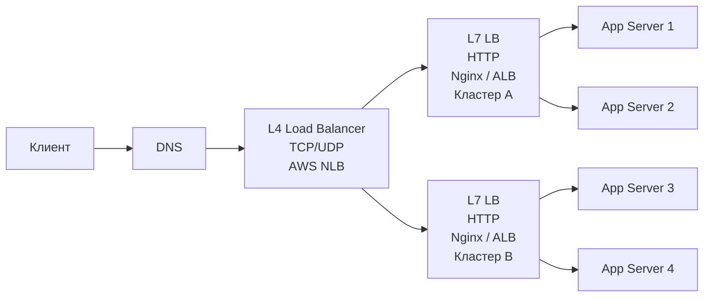
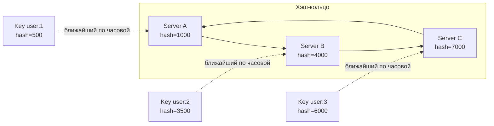
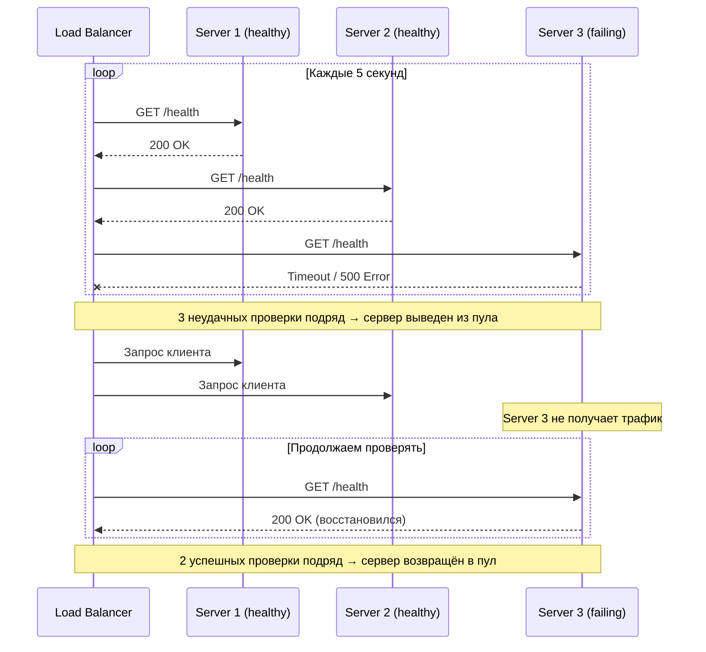
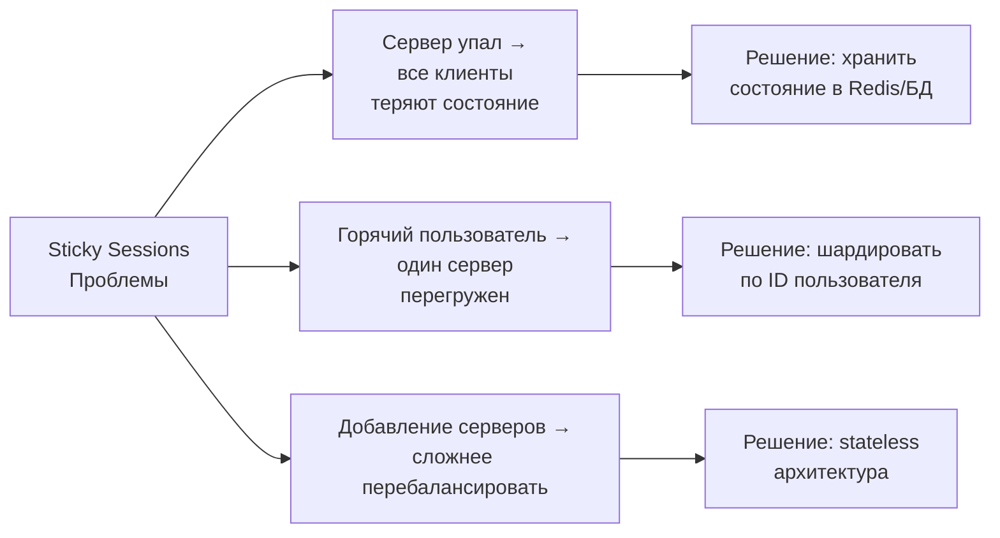
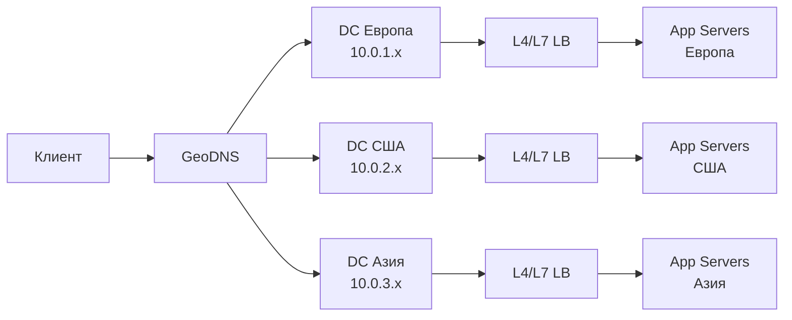
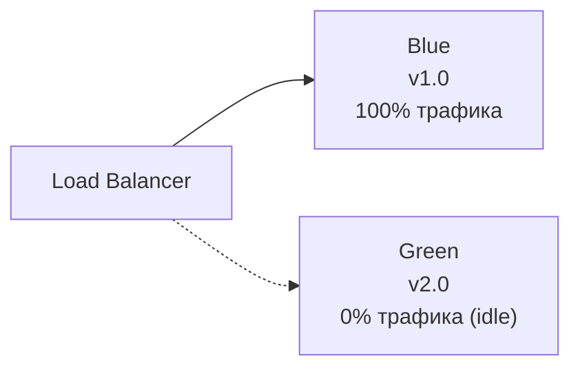

# Уровень 2: Балансировка нагрузки -- распределение трафика и отказоустойчивость

## Введение

Представьте час пик в аэропорту. Сотни пассажиров выстраиваются в очереди на регистрацию. Если открыта только одна стойка, образуется огромная очередь, людям приходится ждать час, а соседние стойки пустуют. Когда открывают все стойки и ставят сотрудника-распределителя у входа, который направляет пассажиров к менее загруженным -- время ожидания сокращается в десять раз.

Балансировщик нагрузки -- это тот самый распределитель у входа. Только вместо пассажиров -- HTTP-запросы, вместо стоек -- серверы, а вместо человека -- программный или аппаратный компонент, который принимает миллионы решений в секунду.

Без балансировки даже хорошо написанный сервис не выдержит роста нагрузки. Добавление новых серверов не поможет, если все запросы по-прежнему идут на один из них. Балансировка нагрузки -- это та часть инфраструктуры, которая превращает набор серверов в единую масштабируемую систему.

На этом уровне мы разберём:

1. **Зачем нужен балансировщик** -- проблема без него и ценность с ним
2. **L4 vs L7** -- два уровня балансировки, их возможности и ограничения
3. **Алгоритмы распределения** -- как именно выбирается следующий сервер
4. **Health checks** -- как балансировщик узнаёт, что сервер упал
5. **Connection Draining** -- как вывести сервер без потери запросов
6. **Sticky Sessions** -- когда клиент должен всегда попадать на один сервер
7. **DNS-балансировка** -- самый простой, но ограниченный уровень
8. **Reverse Proxy vs Load Balancer** -- в чём разница
9. **Продвинутые паттерны** -- Blue-Green и Canary через балансировщик

---

## 1. Зачем нужен балансировщик?

### Проблема вертикального масштабирования

Когда приложение начинает не справляться с нагрузкой, первое что приходит в голову -- дать серверу больше ресурсов: добавить CPU, RAM, диски. Это называется **вертикальным масштабированием** (scale up). Оно работает, но имеет жёсткий потолок.

Во-первых, стоимость растёт нелинейно: сервер с 64 CPU стоит значительно дороже, чем два сервера с 32 CPU каждый. Во-вторых, мощнейший в мире сервер всё равно когда-нибудь упадёт. Если это единственный сервер -- весь сервис недоступен.

Решение -- **горизонтальное масштабирование** (scale out): вместо одного мощного сервера берём несколько обычных. Но возникает вопрос: кто будет распределять запросы между ними? Именно здесь появляется балансировщик.



### Что даёт балансировщик помимо распределения трафика

Балансировщик -- это не просто «раздатчик запросов». Он решает несколько важных задач одновременно:

| Задача | Без балансировщика | С балансировщиком |
|---|---|---|
| Масштабирование | Один сервер, потолок нагрузки | N серверов, линейный рост |
| Отказоустойчивость | Падение сервера = простой | Упавший сервер выводится из пула |
| Деплой | Downtime при перезапуске | Rolling update без простоя |
| SSL | Каждый сервер держит сертификат | SSL termination в одном месте |
| Безопасность | Реальные IP серверов видны клиентам | Серверы скрыты за балансировщиком |
| Мониторинг | Метрики размазаны по серверам | Единая точка наблюдения трафика |

💡 Именно поэтому балансировщик стоит в архитектуре практически любого production-сервиса с нагрузкой выше нескольких сотен RPS.

---

## 2. L4 vs L7: два уровня балансировки

Прежде чем говорить о конкретных продуктах и алгоритмах, нужно понять ключевое разделение: балансировщики работают на разных уровнях сетевой модели OSI. Два наиболее важных -- **L4 (транспортный уровень)** и **L7 (прикладной уровень)**.

Разница в том, **сколько информации видит балансировщик о каждом соединении**.

### Модель OSI как контекст

Сетевая модель OSI описывает семь уровней передачи данных. Каждый уровень добавляет свой заголовок к данным. Балансировщик, работающий на определённом уровне, видит информацию этого уровня и всех нижележащих.


L4-балансировщик работает на транспортном уровне и видит только IP-адреса и порты. L7-балансировщик работает на прикладном уровне и видит полный HTTP-запрос.

### L4 -- транспортный уровень (TCP/UDP)

L4-балансировщик видит только **IP-адреса и порты**. Он не разбирает содержимое пакетов -- не знает, HTTP это или gRPC, какой URL запрашивается, какой заголовок Content-Type. Для него все пакеты одинаковы -- это просто TCP-поток, который нужно перенаправить.

```
Клиент: 192.168.1.1:54321
         │
         ▼
   L4 Load Balancer (10.0.0.1:80)
   Видит: src=192.168.1.1:54321, dst=10.0.0.1:80
   Решает: → отправить на 10.0.0.10:80
   Не видит: HTTP-метод, URL, заголовки
         │
         ▼
   Server: 10.0.0.10:80
```

Работает это очень просто: балансировщик модифицирует NAT-таблицу ядра Linux (или аппаратную таблицу), перенаправляя TCP-соединение на выбранный backend. Сам пакет не читается и не изменяется. Именно это даёт L4 невероятную скорость -- **десятки миллионов пакетов в секунду**.

**Плюсы L4:**
- Сверхбыстрый -- работает на уровне ядра ОС или аппаратуры
- Не нужно расшифровывать TLS (просто прокидывает зашифрованный поток)
- Работает с любым протоколом поверх TCP/UDP (не только HTTP)
- Дешёвый в эксплуатации

**Минусы L4:**
- Не может маршрутизировать по URL, заголовкам, cookies
- Не делает SSL termination (клиент шифрует до самого backend)
- Нет возможности читать или изменять содержимое запросов
- Меньше гибкости для сложных сценариев

**Где применяется:** AWS NLB, HAProxy в режиме TCP, IPVS (встроен в ядро Linux), аппаратные балансировщики F5.

### L7 -- прикладной уровень (HTTP/HTTPS)

L7-балансировщик **полностью разбирает HTTP-запрос**: читает URL, заголовки, cookies, может прочитать тело запроса. Это позволяет принимать по-настоящему умные решения о маршрутизации.

```
Клиент: GET /api/users HTTP/1.1
        Host: myapp.com
        Cookie: session=abc123
        Authorization: Bearer eyJhbGc...
         │
         ▼
   L7 Load Balancer
   Читает весь HTTP-запрос
   Решает:
     /api/*          → API Server Pool
     /static/*       → CDN / Static Server Pool
     /ws/*           → WebSocket Server Pool
     Host: admin.*   → Admin Backend Pool
         │
         ▼
   API Server Pool (нужный backend)
```

L7-балансировщик работает как прокси: он принимает TCP-соединение от клиента, читает HTTP-запрос, выбирает backend, и устанавливает **новое** TCP-соединение к backend. Это означает дополнительные накладные расходы по сравнению с L4, но они компенсируются гибкостью.

**Плюсы L7:**
- Умная маршрутизация по любым атрибутам HTTP-запроса
- SSL termination -- расшифровывает TLS один раз, backend получает plaintext
- Может изменять запросы и ответы (добавлять заголовки, переписывать URL)
- Сжатие gzip/brotli, кэширование ответов
- Rate limiting, аутентификация, защита от DDoS
- Детальные метрики на уровне запросов (latency, error rate по URL)

**Минусы L7:**
- Медленнее L4 (~1M RPS vs ~10M PPS)
- Должен расшифровывать TLS, что требует CPU
- Более сложная конфигурация
- Выше стоимость (при использовании managed-сервисов)

**Где применяется:** Nginx, AWS ALB (Application Load Balancer), Envoy, Traefik, HAProxy в режиме HTTP.

### Сравнение L4 и L7

| Критерий | L4 (Transport) | L7 (Application) |
|---|---|---|
| Видит | IP + порт | URL, заголовки, cookies, тело |
| Скорость | Очень быстрый (~10M PPS) | Быстрый (~1M RPS) |
| SSL termination | Нет (passthrough) | Да |
| Маршрутизация по URL | Нет | Да |
| WebSocket | Passthrough (прозрачно) | Может инспектировать |
| Изменение запросов | Нет | Да |
| Rate limiting | Нет | Да |
| Метрики | По соединениям | По запросам (URL, статус, latency) |
| Стоимость | Низкая | Выше |
| Протоколы | Любые TCP/UDP | HTTP, HTTPS, gRPC, WebSocket |
| Когда использовать | TCP-сервисы, высокий PPS, перед L7 | HTTP API, микросервисы, content-based routing |

📌 **На практике** часто используют **оба уровня**: L4 на входе (быстро обрабатывает TCP, распределяет по кластерам), L7 внутри кластера (умная маршрутизация HTTP). Это называется **двухуровневая балансировка**.



### Пример конфигурации Nginx как L7-балансировщика

Nginx -- один из самых популярных L7-балансировщиков. Рассмотрим типовую конфигурацию и разберём каждую директиву:

```nginx
# Пул серверов для API-запросов
upstream api_servers {
    # Weighted round-robin: мощный сервер получает 3x трафика
    server 10.0.0.1:8080 weight=3;   # 8 CPU, 32 GB RAM
    server 10.0.0.2:8080 weight=1;   # 2 CPU, 8 GB RAM
    server 10.0.0.3:8080 weight=1;   # 2 CPU, 8 GB RAM
    server 10.0.0.4:8080 backup;     # Только при падении всех основных
}

# Пул серверов для WebSocket-соединений
upstream websocket_servers {
    # IP hash: один клиент = один сервер (sticky sessions)
    ip_hash;
    server 10.0.0.10:8080;
    server 10.0.0.11:8080;
    server 10.0.0.12:8080;
}

server {
    listen 443 ssl;
    server_name myapp.com;

    # SSL termination: балансировщик расшифровывает TLS
    ssl_certificate     /etc/ssl/myapp.crt;
    ssl_certificate_key /etc/ssl/myapp.key;

    # API-трафик → пул api_servers
    location /api/ {
        proxy_pass http://api_servers;
        # Передаём реальный IP клиента бэкенду
        proxy_set_header X-Real-IP $remote_addr;
        proxy_set_header X-Forwarded-For $proxy_add_x_forwarded_for;
        proxy_set_header Host $host;
        # Таймауты
        proxy_connect_timeout 5s;
        proxy_read_timeout 60s;
    }

    # WebSocket-трафик → пул websocket_servers
    location /ws/ {
        proxy_pass http://websocket_servers;
        proxy_http_version 1.1;
        # Обязательные заголовки для WebSocket upgrade
        proxy_set_header Upgrade $http_upgrade;
        proxy_set_header Connection "upgrade";
        proxy_read_timeout 3600s; # Долгоживущие соединения
    }

    # Статика → прямая отдача с диска, без проксирования
    location /static/ {
        root /var/www;
        expires 30d;
        add_header Cache-Control "public, immutable";
    }
}
```

Обратите внимание на ключевые детали:

- `upstream` блок определяет пул серверов -- Nginx автоматически следит за их здоровьем
- `weight=3` у первого сервера означает, что он получит 3 из каждых 5 запросов
- `backup` сервер включается только когда все основные недоступны
- `proxy_set_header X-Real-IP` -- критично, иначе бэкенд не узнает реальный IP клиента
- WebSocket требует специальных заголовков `Upgrade` и `Connection` -- без них соединение не обновится с HTTP/1.1 до WS

---

## 3. Алгоритмы балансировки

Когда приходит новый запрос, балансировщику нужно принять решение: какому серверу его отдать? Это решение принимается по **алгоритму балансировки**. Выбор алгоритма существенно влияет на равномерность нагрузки и производительность системы.

### Round Robin -- простая очередь

Самый простой алгоритм: запросы распределяются по серверам строго по очереди -- 1, 2, 3, 1, 2, 3...

```
Запросы:   R1  R2  R3  R4  R5  R6  R7  R8  R9
           │   │   │   │   │   │   │   │   │
Server 1:  R1          R4          R7
Server 2:      R2          R5          R8
Server 3:          R3          R6          R9
```

Балансировщик просто держит указатель на текущий сервер и сдвигает его при каждом запросе. Сложность O(1), никакого состояния, кроме счётчика.

**Когда подходит:** серверы одинаковой мощности, запросы одинаковой тяжести (например, статика или лёгкие API).

**Когда не подходит:** серверы разной мощности, или одни запросы обрабатываются 1мс, а другие -- 5 секунд. В этом случае очередь перекашивается.

📌 Аналогия: раздача карт в карточной игре -- каждый игрок получает одну карту по кругу, независимо от того, сколько карт у него уже есть.

### Weighted Round Robin -- взвешенная очередь

Расширение Round Robin: каждому серверу назначается **вес** -- количество запросов, которые он получает пропорционально другим.

```
Веса: Server 1 = 3, Server 2 = 1, Server 3 = 1
Всего: 5 частей → каждые 5 запросов распределяются 3:1:1

Запросы:   R1  R2  R3  R4  R5  R6  R7  R8  R9  R10
Server 1:  R1  R2  R3          R6  R7  R8
Server 2:              R4                      R9
Server 3:                  R5                      R10
```

Nginx реализует этот алгоритм с балансировкой внутри цикла (SWRR -- Smooth Weighted Round Robin), чтобы запросы не шли пачками к одному серверу, а распределялись плавно.

**Когда использовать:** серверы разной мощности (8 CPU vs 2 CPU), разные тарифные планы в облаке, постепенный вывод старых серверов.

```nginx
upstream backend {
    server 10.0.0.1:8080 weight=5;  # Новый мощный сервер
    server 10.0.0.2:8080 weight=2;  # Старый слабый сервер
    server 10.0.0.3:8080 weight=3;  # Средний сервер
}
```

### Least Connections -- минимальная очередь

Вместо строгой очерёдности алгоритм выбирает сервер с **минимальным числом активных соединений**.

```
Текущие соединения:
  Server 1: ████████  (8 connections)
  Server 2: ███       (3 connections)  ← новый запрос идёт сюда
  Server 3: █████     (5 connections)
```

📌 Аналогия: вы пришли в супермаркет и выбираете кассу. Вы смотрите не на то, через сколько касс уже прошли покупатели, а на то, сколько людей стоит в очереди прямо сейчас. Вы встаёте в кратчайшую очередь.

Балансировщик отслеживает число активных соединений на каждый сервер. Это требует чуть больше памяти и вычислений (O(log N) с min-heap), но даёт значительно более равномерное распределение при неравных запросах.

**Когда критически важен:**
- Запросы с непредсказуемым временем обработки (от 10мс до 30 секунд)
- Streaming-ответы (файлы, видео)
- Запросы к внешним API с разным latency
- Long-polling и SSE (Server-Sent Events)

```nginx
upstream backend {
    least_conn;
    server 10.0.0.1:8080;
    server 10.0.0.2:8080;
    server 10.0.0.3:8080;
}
```

⚠️ Least Connections в Nginx не учитывает вес (weight) серверов при подсчёте. Для взвешенного Least Connections нужен Nginx Plus или другой балансировщик.

### IP Hash -- детерминированная привязка

Хэш от IP-адреса клиента определяет, на какой сервер пойдёт запрос. Один и тот же IP **всегда** отображается на один и тот же сервер:

```
hash("192.168.1.1") % 3 = 0 → Server 1  (постоянно)
hash("192.168.1.2") % 3 = 2 → Server 3  (постоянно)
hash("192.168.1.3") % 3 = 1 → Server 2  (постоянно)
hash("192.168.1.1") % 3 = 0 → Server 1  (тот же клиент → тот же сервер)
```

Это обеспечивает **sticky sessions** без явных cookie -- балансировщик не помнит состояние, но детерминированный хэш всегда даёт одинаковый результат.

**Когда использовать:**
- WebSocket-соединения (должны приходить на тот же процесс)
- Серверный кэш в памяти (cache warm-up для конкретного клиента)
- Корзина в памяти (без Redis)

**Критический недостаток:** при добавлении или удалении сервера **все** хэши меняются, и почти все клиенты перераспределяются на новые серверы. Это называется проблемой mass-remapping.

```
Было 3 сервера: hash(IP) % 3
  Client A → Server 0
  Client B → Server 1
  Client C → Server 2

Добавили 4-й сервер: hash(IP) % 4
  Client A → Server 0  (повезло, не поменялся)
  Client B → Server 3  ← поменялся!
  Client C → Server 0  ← поменялся!
```

При N=3→N=4 перераспределяется ~75% клиентов. Это смывает весь кэш и разрывает WebSocket-соединения.

### Consistent Hashing -- умная привязка без массового перераспределения

Consistent Hashing решает проблему IP Hash -- при изменении числа серверов перераспределяется только **~1/N ключей**, а не все.

**Как работает:**

Представьте кольцо с числами от 0 до 2^32 (4 миллиарда позиций). Серверы и ключи хэшируются на это кольцо. Ключ обслуживается ближайшим сервером **по часовой стрелке**:



При добавлении нового сервера D (hash=5500) перемещается только часть диапазона от C:

```
Было 3 сервера:              Добавили Server D (hash=5500):
[0...1000]   → A             [0...1000]   → A    (не изменилось)
[1001...4000] → B            [1001...4000] → B    (не изменилось)
[4001...7000] → C            [4001...5500] → D    ← только эта часть
[7001...9999] → A            [5501...7000] → C    (не изменилось)
                             [7001...9999] → A    (не изменилось)

Перераспределено: ~25% ключей (только C→D)
IP Hash при N=3→N=4: ~75% ключей!
```

**Virtual nodes (виртуальные узлы):** проблема базового Consistent Hashing -- неравномерное распределение при малом числе точек. Если все три сервера попали в соседние позиции кольца, один сервер получает 80% ключей, а два других -- по 10%.

Решение: каждый физический сервер создаёт 100-200 **виртуальных точек** на кольце:

```
Без virtual nodes (3 точки):
  Кольцо: ●━━━━━━━━━━━━━━━━━●━━●
           A                 B  C
  Распределение: A=80%, B=12%, C=8%  (крайне неравномерно)

С virtual nodes (150 точек на сервер = 450 точек):
  Кольцо: ●A₁●B₃●C₂●A₇●B₁●C₅●A₂●...
  Распределение: A≈34%, B≈33%, C≈33%  (почти идеально)
```

📌 **Consistent Hashing** используется в: **Cassandra** (распределение данных по узлам), **DynamoDB** (партиционирование), **Redis Cluster** (hash slots -- упрощённый вариант), **Memcached** (libketama), **CDN** (маршрутизация к edge-серверам).

```typescript
// Упрощённая реализация Consistent Hashing на TypeScript
class ConsistentHashRing {
  private ring = new Map<number, string>() // hash → serverName
  private sortedKeys: number[] = []
  private readonly virtualNodes: number

  constructor(virtualNodes = 150) {
    this.virtualNodes = virtualNodes
  }

  addServer(server: string): void {
    for (let i = 0; i < this.virtualNodes; i++) {
      const hash = this.hash(`${server}#${i}`)
      this.ring.set(hash, server)
      this.sortedKeys.push(hash)
    }
    this.sortedKeys.sort((a, b) => a - b)
  }

  removeServer(server: string): void {
    for (let i = 0; i < this.virtualNodes; i++) {
      const hash = this.hash(`${server}#${i}`)
      this.ring.delete(hash)
    }
    this.sortedKeys = this.sortedKeys.filter(k => this.ring.has(k))
  }

  getServer(key: string): string | undefined {
    if (this.ring.size === 0) return undefined
    const hash = this.hash(key)
    // Находим ближайший хэш по часовой стрелке (binary search)
    const idx = this.sortedKeys.findIndex(k => k >= hash)
    const targetKey = idx === -1
      ? this.sortedKeys[0]  // Обернулись на начало кольца
      : this.sortedKeys[idx]
    return this.ring.get(targetKey)
  }

  private hash(key: string): number {
    // Упрощённый хэш (в реальности используют MurmurHash3 или xxHash)
    let h = 0
    for (const char of key) {
      h = (Math.imul(31, h) + char.charCodeAt(0)) | 0
    }
    return Math.abs(h)
  }
}

// Использование
const ring = new ConsistentHashRing(150)
ring.addServer('server-1')
ring.addServer('server-2')
ring.addServer('server-3')

console.log(ring.getServer('user:123'))  // → 'server-2'
console.log(ring.getServer('user:456'))  // → 'server-1'

// Добавляем сервер -- перераспределяется только ~25% ключей
ring.addServer('server-4')
console.log(ring.getServer('user:123'))  // → 'server-2'  (не изменился!)
console.log(ring.getServer('user:456'))  // → 'server-4'  (переехал к новому)
```

### Сравнение алгоритмов

| Алгоритм | Сложность | Учитывает нагрузку | Sticky | Перераспределение при изменении N | Когда выбирать |
|---|---|---|---|---|---|
| Round Robin | O(1) | Нет | Нет | N/A | Идентичные серверы, одинаковые запросы |
| Weighted RR | O(1) | Частично (статика) | Нет | N/A | Серверы разной мощности |
| Least Connections | O(log N) | Да (динамически) | Нет | N/A | Запросы с разным временем обработки |
| IP Hash | O(1) | Нет | Да | ~100% (катастрофа) | Малые кластеры, редкие изменения |
| Consistent Hashing | O(log N) | Нет | Да | ~1/N (минимально) | Большие кластеры, частые изменения |

---

## 4. Health Checks: как убедиться, что сервер жив

Балансировщик бессмысленен, если он отправляет запросы на упавшие серверы. Клиент получит ошибку или таймаут. Для предотвращения этого используются **health checks** -- механизм регулярной проверки состояния серверов.

### Жизненный цикл сервера в пуле



Обратите внимание на асимметрию: для **вывода** сервера нужно 3 неудачи подряд, для **возврата** -- 2 успеха. Это сделано намеренно:

- Строгий вывод предотвращает флаппинг (быстрое исключение из-за единичного сбоя)
- Строгий возврат предотвращает преждевременное возвращение нестабильного сервера

### Active Health Checks

Балансировщик **сам** периодически опрашивает серверы по специальному эндпоинту, независимо от реального трафика.

```nginx
upstream backend {
    server 10.0.0.1:8080;
    server 10.0.0.2:8080;
    server 10.0.0.3:8080;
}

# Nginx Plus / OpenResty (платная/расширенная версия)
location / {
    proxy_pass http://backend;
    health_check interval=5s fails=3 passes=2 uri=/health;
}
```

Для открытого Nginx active health checks не поддерживаются из коробки -- только пассивные. Active поддерживает Nginx Plus, HAProxy, Envoy, AWS ALB.

**Плюсы:**
- Сервер выводится из пула за секунды после падения
- Не нужно ждать реального клиентского трафика
- Проверка происходит независимо от нагрузки

**Минусы:**
- Дополнительная нагрузка: N балансировщиков × M серверов = N×M проверок каждые K секунд
- Нужен `/health` endpoint на каждом сервере

### Passive Health Checks

Балансировщик отслеживает **реальные ответы** серверов на клиентские запросы. Если сервер начинает отвечать ошибками или таймаутами -- выводит его из пула.

```nginx
upstream backend {
    # 3 ошибки (5xx или таймаут) за 30 секунд → вывести сервер на 30 секунд
    server 10.0.0.1:8080 max_fails=3 fail_timeout=30s;
    server 10.0.0.2:8080 max_fails=3 fail_timeout=30s;
    server 10.0.0.3:8080 max_fails=3 fail_timeout=30s;
}
```

Через 30 секунд Nginx попробует отправить один запрос на "выбывший" сервер. Если успешно -- возвращает в пул. Если нет -- снова исключает на `fail_timeout`.

**Плюсы:**
- Нулевой overhead (работает на реальных запросах)
- Не нужен специальный `/health` endpoint

**Минусы:**
- Первые несколько клиентов получат ошибки, прежде чем сервер будет исключён
- Не работает без трафика (тихие серверы не проверяются)

### Правильный /health endpoint

Health check бесполезен, если он всегда возвращает 200. Сервер может быть жив (процесс запущен), но не здоров -- база данных недоступна, диск заполнен, memory pressure критическая.

```typescript
// ❌ Бесполезный health check
app.get('/health', (req, res) => {
  res.json({ status: 'ok' }) // Всегда 200, даже если БД упала
})

// ✅ Полноценный health check
interface HealthStatus {
  status: 'healthy' | 'degraded' | 'unhealthy'
  checks: {
    database: boolean
    redis: boolean
    diskSpace: boolean
  }
  uptime: number
  timestamp: number
}

app.get('/health', async (req, res) => {
  const checks = {
    database: false,
    redis: false,
    diskSpace: false,
  }

  // Параллельно проверяем все зависимости
  await Promise.allSettled([
    db.query('SELECT 1')
      .then(() => { checks.database = true })
      .catch(() => {}),

    redis.ping()
      .then(() => { checks.redis = true })
      .catch(() => {}),

    checkDiskSpace('/var/app')
      .then(freeBytes => {
        checks.diskSpace = freeBytes > 1_000_000_000 // > 1 GB
      })
      .catch(() => {}),
  ])

  const allHealthy = Object.values(checks).every(Boolean)
  const someHealthy = Object.values(checks).some(Boolean)

  const status: HealthStatus['status'] = allHealthy
    ? 'healthy'
    : someHealthy ? 'degraded' : 'unhealthy'

  const httpStatus = allHealthy ? 200 : someHealthy ? 207 : 503

  res.status(httpStatus).json({
    status,
    checks,
    uptime: process.uptime(),
    timestamp: Date.now(),
  } satisfies HealthStatus)
})
```

💡 **Best practice:** используйте **оба типа** одновременно -- active для быстрого обнаружения падений, passive как дополнительную страховку. Active health check с интервалом 5 секунд обнаружит падение за 15-25 секунд (3 fails × 5s + margin), а passive немедленно перестанет посылать на упавший сервер новые запросы.

---

## 5. Connection Draining -- graceful shutdown без потери запросов

Серверы в production регулярно останавливаются: деплой новой версии, плановое обслуживание, автомасштабирование. Если просто убить процесс -- все активные соединения оборвутся, клиенты получат ошибки.

**Connection draining** решает это: балансировщик перестаёт слать **новые** запросы на выводимый сервер, но ждёт завершения **текущих** соединений.

### Как это выглядит во времени

```
Время →
─────────────────────────────────────────────────────────────

Шаг 1 (t=0): Сигнал "drain" -- вывести сервер из пула
  LB:     [новые запросы → Server 2, Server 3]
  Server: [активные запросы: R1, R2, R3 ещё обрабатываются]

Шаг 2 (t=5s): Продолжаем ждать
  LB:     [новых запросов нет]
  Server: [R1 завершён, R2 завершён, R3 ещё обрабатывается]

Шаг 3 (t=8s): Все запросы завершены
  LB:     [сервер выведен]
  Server: [можно безопасно останавливать процесс]

Или:
Шаг 3 (t=30s): Таймаут -- принудительное завершение
  Server: [R3 ещё не завершён, но мы не можем ждать вечно]
  Server: [принудительный shutdown, R3 получает ошибку]
```

AWS ALB автоматически выполняет connection draining при deregistration сервера. В Nginx Plus есть директива `drain`. В Kubernetes этот механизм работает через `terminationGracePeriodSeconds` и `preStop` хуки.

### Graceful shutdown в Node.js

```typescript
import { createServer } from 'http'
import express from 'express'

const app = express()
const server = createServer(app)

// Флаг состояния: сервер принимает новые соединения?
let isShuttingDown = false

// При shutdown -- сразу отвечать 503 на новые запросы
app.use((req, res, next) => {
  if (isShuttingDown) {
    res.setHeader('Connection', 'close')
    res.status(503).send('Server is shutting down')
    return
  }
  next()
})

app.get('/health', (req, res) => {
  // Балансировщик увидит 503 и перестанет слать запросы
  if (isShuttingDown) {
    res.status(503).json({ status: 'shutting_down' })
  } else {
    res.json({ status: 'healthy' })
  }
})

// SIGTERM отправляет Kubernetes/Docker при остановке контейнера
process.on('SIGTERM', () => {
  console.log('Received SIGTERM -- starting graceful shutdown')
  isShuttingDown = true

  // Перестаём принимать новые TCP-соединения
  server.close(() => {
    console.log('All HTTP connections closed')
    // Закрываем соединения с БД, Redis и т.д.
    Promise.all([
      db.end(),
      redis.quit(),
    ]).then(() => {
      console.log('Cleanup complete -- exiting')
      process.exit(0)
    })
  })

  // Принудительный выход через 30 секунд, если не успели
  setTimeout(() => {
    console.error('Forced shutdown after 30s timeout')
    process.exit(1)
  }, 30_000)
})
```

⚠️ Важно: если health check начинает возвращать 503 **до** того, как балансировщик отправит SIGTERM -- это ещё лучше. Балансировщик успеет вывести сервер из пула до остановки процесса, и никто не потеряет запросы.

---

## 6. Sticky Sessions -- привязка клиента к серверу

### Когда нужны sticky sessions

Идеальный stateless-сервис может обработать любой запрос на любом сервере. Но в реальности часто встречаются ситуации, когда запросы одного клиента **должны** попадать на один сервер:

- **WebSocket** -- постоянное соединение привязано к конкретному процессу
- **Long polling** -- клиент ждёт события от конкретного сервера
- **Серверный кэш в памяти** -- данные пользователя закэшированы на конкретном узле
- **Серверный рендеринг с состоянием** -- сессия хранится в памяти процесса
- **Upload больших файлов** -- multipart upload должен идти на тот же сервер

### Способы реализации

```nginx
# 1. IP-based sticky sessions (простой, но ненадёжный)
upstream backend {
    ip_hash;
    server 10.0.0.1:8080;
    server 10.0.0.2:8080;
    server 10.0.0.3:8080;
}
# Проблема: клиенты за NAT/proxy (корпоративная сеть) -- один IP для тысяч людей
# Проблема: мобильные пользователи меняют IP при смене сети

# 2. Cookie-based sticky sessions (надёжнее)
upstream backend {
    # Nginx Plus (платный)
    sticky cookie srv_id expires=1h path=/;
    server 10.0.0.1:8080;
    server 10.0.0.2:8080;
}
# Балансировщик устанавливает cookie srv_id с ID сервера
# Последующие запросы с этим cookie идут на тот же сервер
```

```typescript
// 3. Application-level sticky sessions через заголовок
// Клиент передаёт ID сервера в заголовке, LB маршрутизирует
app.post('/connect', async (req, res) => {
  const serverId = await selectLeastLoadedServer()

  res.setHeader('X-Server-Id', serverId)
  res.json({ serverId, wsUrl: `wss://ws-${serverId}.myapp.com` })
})
// Дальше клиент подключается напрямую к конкретному WS-серверу
```

### Проблемы sticky sessions и как их избегать



📌 **Правило:** sticky sessions -- это **костыль**, а не архитектурное решение. Они нужны, когда переделать сервис на stateless сложно или дорого. Стремитесь к тому, чтобы любой запрос мог быть обработан любым сервером -- это упрощает масштабирование и повышает надёжность.

**Правильное решение:** вынести состояние из процессов в внешнее хранилище:

```typescript
// ❌ Sticky sessions: сессия в памяти процесса
const sessions = new Map<string, UserSession>() // Живёт только в этом процессе

// ✅ Stateless: сессия в Redis
import { Redis } from 'ioredis'
const redis = new Redis(process.env.REDIS_URL)

async function getSession(sessionId: string): Promise<UserSession | null> {
  const data = await redis.get(`session:${sessionId}`)
  return data ? JSON.parse(data) : null
}

async function setSession(sessionId: string, session: UserSession): Promise<void> {
  await redis.setex(`session:${sessionId}`, 3600, JSON.stringify(session))
}
// Теперь любой сервер может обработать любой запрос
```

---

## 7. DNS-балансировка

### Как работает DNS Round Robin

До появления L4/L7 балансировщиков DNS использовался для примитивной балансировки: DNS-сервер для одного домена возвращает несколько IP-адресов и ротирует их порядок:

```
$ dig myapp.com A

; ANSWER SECTION:
myapp.com.  60  IN  A  10.0.0.1   ← первый ответ
myapp.com.  60  IN  A  10.0.0.2
myapp.com.  60  IN  A  10.0.0.3

# Следующий запрос:
myapp.com.  60  IN  A  10.0.0.2   ← ротация
myapp.com.  60  IN  A  10.0.0.3
myapp.com.  60  IN  A  10.0.0.1
```

Браузер выбирает первый IP из списка (обычно). Разные клиенты получают разный порядок -- нагрузка распределяется примерно поровну.

### Плюсы и минусы DNS-балансировки

**Плюсы:**
- Распределяет трафик **глобально** между дата-центрами (GeoDNS -- ближайший DC)
- Не требует дополнительной инфраструктуры -- просто DNS-записи
- Работает на уровне до подключения (снижает задержку)

**Минусы:**
- DNS **кэшируется** на TTL (обычно 60-300 секунд). При падении сервера клиенты продолжают ходить на него минуты
- Нет health checks -- DNS не знает, жив ли сервер
- Клиент, не браузер, часто кэширует первый IP и не меняет его
- Нет умной маршрутизации -- только Round Robin по IP



💡 **На практике:** DNS-балансировка используется для **глобального** распределения между регионами/дата-центрами. Внутри каждого региона стоит полноценный L4/L7 балансировщик. DNS -- это первый уровень, а не замена балансировщику.

---

## 8. Reverse Proxy vs Load Balancer

Эти термины часто путают, потому что на практике один и тот же продукт (Nginx, HAProxy) выполняет обе роли.

**Reverse Proxy** -- сервер, который стоит перед одним или несколькими бэкендами и принимает запросы от имени клиентов. Он скрывает бэкенды от внешнего мира.

**Load Balancer** -- это reverse proxy с несколькими бэкендами и алгоритмом выбора между ними.

```
Reverse Proxy (один бэкенд):
  Client → Nginx → Backend

Load Balancer (несколько бэкендов):
  Client → Nginx → Backend 1
                 → Backend 2
                 → Backend 3
```

Всё, что умеет reverse proxy, умеет и балансировщик. Дополнительно у балансировщика есть:

| Возможность | Reverse Proxy | Load Balancer |
|---|---|---|
| SSL termination | ✅ | ✅ |
| Сжатие (gzip) | ✅ | ✅ |
| Кэширование | ✅ | ✅ |
| Rate limiting | ✅ | ✅ |
| Защита бэкендов | ✅ | ✅ |
| Несколько бэкендов | Опционально | ✅ (суть) |
| Health checks | Нет | ✅ |
| Алгоритм выбора | Нет | ✅ |
| Connection draining | Нет | ✅ |

На практике Nginx всегда настраивается как и то, и другое одновременно.

---

## 9. Продвинутые паттерны

### Blue-Green Deployment через балансировщик

Blue-Green -- стратегия деплоя с нулевым downtime. Два идентичных окружения: **Blue** (текущая production-версия) и **Green** (новая версия, подготовленная к релизу).



Деплой нового кода:

```
1. Разворачиваем v2.0 в Green-окружении
2. Прогоняем smoke tests в Green (без продакшн-трафика)
3. Переключаем балансировщик: 100% → Green
4. Blue становится idle (резерв для отката)

При проблемах: переключаем обратно на Blue за секунды
```

```nginx
# До деплоя
upstream backend {
    server 10.0.0.1:8080;  # Blue
    server 10.0.0.2:8080;  # Blue
}

# После деплоя (пересобираем конфиг и делаем nginx -s reload)
upstream backend {
    server 10.0.0.10:8080;  # Green
    server 10.0.0.11:8080;  # Green
}

# nginx -s reload -- graceful reload без downtime
```

**Плюс:** мгновенный откат -- достаточно переключить балансировщик обратно.
**Минус:** нужно держать двойное количество серверов во время деплоя.

### Canary Deployment через Weighted Routing

Canary -- постепенный выкат новой версии. Сначала маленькая доля трафика (1-5%) идёт на новую версию. Мониторим ошибки и latency. Если всё хорошо -- увеличиваем долю.

```nginx
# Этап 1: 5% на новую версию
upstream backend {
    server 10.0.0.1:8080 weight=19;  # v1.0 -- 95% трафика
    server 10.0.0.2:8080 weight=1;   # v2.0 -- 5% трафика (canary)
}

# Этап 2: 20% на новую версию (после проверки)
upstream backend {
    server 10.0.0.1:8080 weight=4;   # v1.0 -- 80%
    server 10.0.0.2:8080 weight=1;   # v2.0 -- 20%
}

# Этап 3: 100% на новую версию
upstream backend {
    server 10.0.0.2:8080;            # v2.0 -- 100%
}
```

💡 **Canary vs Blue-Green:**
- Blue-Green: переключение «всё или ничего», мгновенный откат
- Canary: постепенный выкат, риск минимален, откат тоже мгновенный (убираем canary-сервер)

Для более сложного Canary (по заголовкам, cookie, геолокации) используют Nginx Ingress в Kubernetes с аннотациями `nginx.ingress.kubernetes.io/canary-*` или Istio/Envoy с traffic splitting.

---

## Частые ошибки

### 1. Один балансировщик = единая точка отказа (SPOF)

❌ **Проблемная архитектура:**

```
Client → [Load Balancer] → Servers
                ↑
    Если LB упадёт -- весь сервис недоступен!
```

Балансировщик -- это инфраструктурный компонент, и он тоже может упасть. Один балансировщик создаёт Single Point of Failure (SPOF) -- единственную точку, падение которой роняет всю систему.

✅ **Правильная архитектура -- Active-Passive:**

```
Client → DNS (Virtual IP) → [LB Active]  → Servers
                            [LB Passive] (standby)

Keepalived следит за LB Active.
Если Active упал -- Passive захватывает Virtual IP за секунды.
Клиенты продолжают ходить на тот же IP, не замечая переключения.
```

✅ **Правильная архитектура -- Active-Active:**

```
Client → DNS (несколько A-записей) → [LB 1] → Servers
                                    → [LB 2] → Servers

Оба балансировщика активны и принимают трафик.
При падении одного DNS продолжает отдавать IP второго.
```

Managed-сервисы (AWS ALB, Google Cloud Load Balancing, Cloudflare) берут отказоустойчивость на себя -- они внутренне реплицированы. Это одна из ключевых причин их использования.

---

### 2. Health checks не настроены

❌ **Без health checks:**

```nginx
upstream backend {
    server 10.0.0.1:8080;
    server 10.0.0.2:8080;
    # Нет max_fails, нет health_check
    # Трафик идёт на мёртвый сервер!
}
```

Если сервер упал -- балансировщик продолжит слать на него запросы. Клиенты получат ошибки или таймауты, пока вы вручную не вмешаетесь.

✅ **С passive health checks (минимум):**

```nginx
upstream backend {
    server 10.0.0.1:8080 max_fails=3 fail_timeout=30s;
    server 10.0.0.2:8080 max_fails=3 fail_timeout=30s;
}
```

✅ **С active health checks (лучше):**

```nginx
# HAProxy
backend app_servers
    option httpchk GET /health
    http-check expect status 200
    server s1 10.0.0.1:8080 check inter 5s fall 3 rise 2
    server s2 10.0.0.2:8080 check inter 5s fall 3 rise 2
```

---

### 3. Health check проверяет не то

❌ **Всегда здоровый health check:**

```typescript
app.get('/health', (req, res) => {
  res.json({ status: 'ok' }) // Всегда 200, даже если БД недоступна
})
```

Сервер может быть «жив» (процесс запущен, порт слушается), но неспособен обслуживать запросы (БД недоступна, память исчерпана, диск заполнен). Балансировщик продолжит слать трафик, клиенты получат ошибки приложения.

✅ **Health check, проверяющий реальную готовность:**

```typescript
app.get('/health', async (req, res) => {
  const checks = { database: false, redis: false, diskSpace: false }

  try { await db.query('SELECT 1'); checks.database = true } catch {}
  try { await redis.ping(); checks.redis = true } catch {}
  try {
    const free = await checkDiskSpace()
    checks.diskSpace = free > 1_000_000_000 // > 1 GB
  } catch {}

  const healthy = Object.values(checks).every(Boolean)
  res.status(healthy ? 200 : 503).json({
    status: healthy ? 'healthy' : 'degraded',
    checks,
  })
})
```

---

### 4. Sticky sessions вместо stateless-архитектуры

❌ **Состояние в памяти + sticky sessions:**

```typescript
// Сессия хранится в памяти процесса
const userSessions = new Map<string, Session>()

// Если пользователь попадёт на другой сервер -- не найдёт сессию
// Если сервер упадёт -- все сессии потеряны
```

Sticky sessions -- не решение, а временный обходной путь. Они создают неравномерную нагрузку, усложняют масштабирование и не спасают при падении сервера.

✅ **Stateless с внешним хранилищем:**

```typescript
// Сессия в Redis -- доступна с любого сервера
const session = await redis.get(`session:${userId}`)
// Теперь любой сервер может обработать запрос любого пользователя
```

---

### 5. Consistent Hashing без virtual nodes

❌ **3 сервера на кольце без virtual nodes:**

```
Распределение при 3 точках на кольце:
  Server A: 0...1000     → покрывает 10% кольца
  Server B: 1001...4000  → покрывает 30% кольца
  Server C: 4001...9999  → покрывает 60% кольца

Нагрузка: A=10%, B=30%, C=60%  (крайне неравномерно!)
```

❌ Один сервер перегружен, другой недогружен -- горизонтальное масштабирование не помогает.

✅ **150 virtual nodes на сервер:**

```
3 сервера × 150 точек = 450 точек на кольце
  Server A: ~33% кольца
  Server B: ~34% кольца
  Server C: ~33% кольца

Нагрузка почти идеально равномерна
```

---

### 6. Игнорирование connection draining при деплое

❌ **Резкая остановка сервера:**

```bash
# Сервер убивается немедленно
systemctl stop myapp
# Все активные запросы (могут занимать секунды/минуты) = ошибки
```

✅ **Graceful shutdown:**

```bash
# 1. Вывести из пула балансировщика (или дождаться, пока health check вернёт 503)
curl -X POST http://lb/admin/drain/server-1

# 2. Подождать завершения активных запросов
sleep 30

# 3. Остановить сервер
systemctl stop myapp
```

В Kubernetes это делается автоматически через `terminationGracePeriodSeconds` и `preStop` hooks.

---

## Итоги

- ✅ **L4-балансировщик** работает на уровне TCP/UDP -- сверхбыстрый, видит только IP и порты, не умеет маршрутизировать по URL
- ✅ **L7-балансировщик** разбирает HTTP -- умная маршрутизация, SSL termination, rate limiting, детальные метрики
- ✅ **Два уровня вместе** -- L4 на входе для высокого PPS, L7 внутри для умной маршрутизации HTTP
- ✅ **Round Robin** -- простейший алгоритм, подходит для одинаковых серверов и запросов
- ✅ **Weighted Round Robin** -- когда серверы разной мощности
- ✅ **Least Connections** -- лучший выбор при запросах с разным временем обработки
- ✅ **Consistent Hashing** -- минимальное перераспределение при изменении числа серверов, обязательно с virtual nodes
- ✅ **Health Checks** -- active (периодический опрос) + passive (мониторинг реальных ответов); health endpoint должен проверять реальные зависимости
- ✅ **Connection Draining** -- graceful shutdown без потери активных запросов
- 📌 **Sticky sessions** -- временный обходной путь, настоящее решение -- stateless-архитектура с Redis
- 📌 **DNS-балансировка** -- для глобального распределения между регионами, но не замена L4/L7
- 📌 **Балансировщик сам не должен быть SPOF** -- Active-Passive с Keepalived или managed-сервис (AWS ALB)
- 📌 **Blue-Green** -- мгновенное переключение при деплое с возможностью отката
- 📌 **Canary** -- постепенный выкат новой версии с ранним обнаружением проблем
